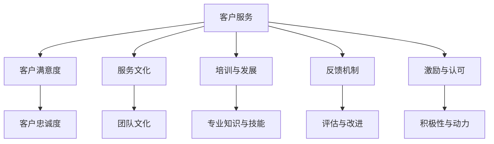

                 

## 文章标题：如何提升团队的客户服务意识

客户服务是任何企业成功的基石。一个高效的客户服务团队能够增强客户满意度，提高客户忠诚度，并最终推动企业的增长。然而，如何提升团队的客户服务意识，使之真正成为团队文化的一部分，是一个复杂而关键的问题。本文将深入探讨这一主题，提供实用的策略和步骤，帮助您打造一支具备卓越客户服务意识的团队。

## 关键词：
- 客户服务意识
- 团队文化
- 客户满意度
- 客户忠诚度
- 服务策略

## 摘要：
本文将探讨如何提升团队的客户服务意识，通过分析客户服务的重要性、构建积极的服务文化、提供培训和发展机会、建立反馈机制以及激励和认可团队成员，来提高客户服务质量和团队的整体表现。文章结构如下：

1. 背景介绍
2. 核心概念与联系
3. 核心算法原理 & 具体操作步骤
4. 数学模型和公式 & 详细讲解 & 举例说明
5. 项目实战：代码实际案例和详细解释说明
6. 实际应用场景
7. 工具和资源推荐
8. 总结：未来发展趋势与挑战
9. 附录：常见问题与解答
10. 扩展阅读 & 参考资料

现在，让我们开始详细的分析和探讨。

---

### 1. 背景介绍

在当今竞争激烈的商业环境中，客户服务已经成为企业成功的关键因素之一。客户服务的质量直接影响客户满意度和忠诚度，进而影响企业的收入和声誉。一个高效的客户服务团队能够快速响应客户需求，解决客户问题，提供卓越的客户体验。

然而，许多企业面临的一个挑战是如何提升团队的整体客户服务意识。这不仅仅涉及技术和流程，还需要在团队文化中根植一种服务至上的理念。团队成员需要认识到客户服务的重要性，并将其内化为日常工作的一部分。

本文将探讨如何通过以下几个关键步骤来提升团队的客户服务意识：

- **构建积极的服务文化**：服务文化是一个企业内部的共同信念和行为模式，它需要通过明确的价值观、行为规范和团队互动来塑造。
- **提供培训和发展机会**：通过系统性的培训，提升团队成员的专业知识和技能，帮助他们更好地理解客户需求，提供高质量的服务。
- **建立反馈机制**：通过定期的反馈和评估，让团队成员了解他们的表现，并提供改进的方向。
- **激励和认可团队成员**：通过奖励和认可，激发团队成员的积极性和创造力，增强他们的服务意识。

接下来的部分将详细讨论这些策略和步骤。

---

### 2. 核心概念与联系

#### 2.1 客户服务的重要性

客户服务的重要性在于它能够直接影响到客户体验和忠诚度。根据研究，高达 82% 的客户会因为一次积极的客户服务体验而更加忠诚，而 70% 的客户会因一次不良的体验而选择离开。因此，客户服务不仅仅是为了解决问题，更是为了建立长期的关系。

#### 2.2 服务文化与团队文化

服务文化是一个团队内部共同的服务理念和价值观，它是团队文化的一部分。一个具有积极服务文化的团队会更加注重客户需求和满意度，从而提高整体的服务质量。

#### 2.3 培训与发展

培训和发展是提升团队成员服务意识的关键。通过持续的培训，团队成员可以不断更新他们的知识和技能，更好地应对各种客户需求和挑战。

#### 2.4 反馈机制

反馈机制是一个重要的评估工具，它可以帮助团队了解他们的服务表现，并识别需要改进的领域。定期的反馈和评估可以帮助团队成员保持进步，并提升他们的服务水平。

#### 2.5 激励与认可

激励和认可可以激发团队成员的积极性，增强他们的服务意识。适当的奖励和认可可以提升团队成员的工作动力，促进团队的协作和成长。

下面是一个用 Mermaid 画的流程图，展示这些概念之间的关系：



---

### 3. 核心算法原理 & 具体操作步骤

要提升团队的客户服务意识，可以采用以下核心算法原理和具体操作步骤：

#### 3.1 构建服务文化

1. 明确服务价值观：确立团队的服务价值观，如客户至上、诚实守信、快速响应等。
2. 制定服务行为规范：制定具体的操作指南，如服务流程、沟通礼仪、问题解决策略等。
3. 增强团队互动：鼓励团队成员之间的交流和合作，分享服务经验和最佳实践。

#### 3.2 提供培训和发展机会

1. 设计系统化培训计划：包括基础培训、技能提升和领导力培训等。
2. 聘请专业讲师：邀请行业专家或专业培训机构进行授课。
3. 开展内部培训：鼓励团队成员分享经验和知识，相互学习。

#### 3.3 建立反馈机制

1. 设计反馈问卷：制定详细的反馈问卷，收集客户和团队成员的意见和建议。
2. 定期评估：每月或每季度进行一次服务评估，分析服务表现和改进点。
3. 实施改进计划：根据反馈结果，制定并实施改进措施。

#### 3.4 激励和认可团队成员

1. 设定奖励机制：制定明确的奖励政策，如奖金、晋升机会等。
2. 定期表彰：每月或每季度对表现优秀的团队成员进行表彰。
3. 营造积极氛围：鼓励团队成员相互鼓励和支持，形成良好的团队氛围。

---

### 4. 数学模型和公式 & 详细讲解 & 举例说明

为了更科学地评估和提升团队的客户服务意识，我们可以使用以下数学模型和公式：

#### 4.1 客户满意度指数（CSI）

客户满意度指数是一个衡量客户满意度的指标，计算公式为：

$$
CSI = \frac{\text{满意客户数量}}{\text{总客户数量}} \times 100\%
$$

#### 4.2 客户忠诚度指数（CLV）

客户忠诚度指数是一个衡量客户忠诚度的指标，计算公式为：

$$
CLV = \frac{\text{重复购买客户数量}}{\text{总客户数量}} \times 100\%
$$

#### 4.3 服务改进率

服务改进率是一个衡量服务改进成效的指标，计算公式为：

$$
\text{服务改进率} = \frac{\text{改进前客户满意度指数} - \text{改进后客户满意度指数}}{\text{改进前客户满意度指数}} \times 100\%
$$

#### 举例说明

假设一家公司有 100 名客户，其中 70 名客户表示满意，30 名客户表示不满意。那么，客户满意度指数（CSI）为：

$$
CSI = \frac{70}{100} \times 100\% = 70\%
$$

如果经过改进，客户满意度指数提升到 85%，那么服务改进率为：

$$
\text{服务改进率} = \frac{70\% - 85\%}{70\%} \times 100\% = -21.4\%
$$

这意味着服务改进后的效果不如预期，需要进一步分析原因并采取措施。

---

### 5. 项目实战：代码实际案例和详细解释说明

为了更好地理解和应用上述策略，我们可以通过一个实际的代码案例来演示如何提升团队的客户服务意识。

#### 5.1 开发环境搭建

在开始之前，我们需要搭建一个模拟客户服务的开发环境。这个环境可以是一个简单的后台系统，包括用户管理、服务请求处理和反馈收集等功能。

1. 环境要求：
   - Python 3.8+
   - Flask Web 框架
   - SQLite 数据库

2. 安装所需依赖：

```bash
pip install Flask
```

#### 5.2 源代码详细实现和代码解读

下面是一个简单的 Flask 应用程序，用于模拟客户服务请求处理和反馈收集。

```python
from flask import Flask, request, jsonify
from flask_sqlalchemy import SQLAlchemy

app = Flask(__name__)
app.config['SQLALCHEMY_DATABASE_URI'] = 'sqlite:///customers.db'
db = SQLAlchemy(app)

class Customer(db.Model):
    id = db.Column(db.Integer, primary_key=True)
    name = db.Column(db.String(100), nullable=False)
    service_request = db.Column(db.String(500), nullable=False)
    feedback = db.Column(db.String(500), nullable=True)

@app.route('/submit_request', methods=['POST'])
def submit_request():
    data = request.get_json()
    new_customer = Customer(name=data['name'], service_request=data['service_request'])
    db.session.add(new_customer)
    db.session.commit()
    return jsonify(message="Service request submitted successfully."), 200

@app.route('/submit_feedback/<int:customer_id>', methods=['POST'])
def submit_feedback(customer_id):
    data = request.get_json()
    customer = Customer.query.get(customer_id)
    if customer:
        customer.feedback = data['feedback']
        db.session.commit()
        return jsonify(message="Feedback submitted successfully."), 200
    else:
        return jsonify(message="Customer not found."), 404

@app.route('/get_requests', methods=['GET'])
def get_requests():
    customers = Customer.query.all()
    return jsonify(customers=[{"id": c.id, "name": c.name, "service_request": c.service_request, "feedback": c.feedback} for c in customers]), 200

if __name__ == '__main__':
    db.create_all()
    app.run(debug=True)
```

1. **代码解读**：

   - **数据库模型**：`Customer` 类定义了客户的信息，包括姓名、服务请求和反馈。
   - **路由定义**：
     - `/submit_request`：接收客户的服务请求，并将请求存储在数据库中。
     - `/submit_feedback/<int:customer_id>`：接收客户的反馈，并将其存储在数据库中。
     - `/get_requests`：获取所有客户的服务请求和反馈信息。

#### 5.3 代码解读与分析

这个 Flask 应用程序是一个简单的后台系统，用于模拟客户服务流程。通过这个应用程序，我们可以看到如何通过代码实现以下关键步骤：

1. **构建服务文化**：通过定义服务流程和反馈机制，让团队成员了解他们的工作职责和客户服务的重要性。
2. **提供培训和发展机会**：通过模拟客户服务场景，团队成员可以学习和实践客户服务的技巧和策略。
3. **建立反馈机制**：通过收集和存储客户反馈，团队可以评估他们的服务表现，并识别需要改进的领域。
4. **激励和认可团队成员**：通过提供奖励机制（如加分或表彰），团队可以激励成员提高服务质量。

---

### 6. 实际应用场景

提升团队的客户服务意识不仅适用于企业内部，还可以应用于各种实际场景。以下是一些典型的应用场景：

#### 6.1 企业客户服务

在企业客户服务中，提升客户服务意识可以帮助企业更好地满足客户需求，提高客户满意度。通过定期的培训、反馈和激励措施，企业可以建立一支高效、专业的客户服务团队。

#### 6.2 售后服务

售后服务是客户与企业互动的重要环节。通过提升售后服务团队的客户服务意识，企业可以提供更快速、更有效的支持，解决客户问题，增强客户信任。

#### 6.3 政府公共服务

政府公共服务也面临着提升客户服务意识的需求。通过优化服务流程、提高服务效率，政府可以更好地满足民众的需求，提高政府形象。

#### 6.4 在线教育

在线教育平台需要通过提升客户服务意识来确保学生得到良好的学习体验。通过提供及时、有效的客户支持，教育平台可以增强学生的满意度，提高续费率。

---

### 7. 工具和资源推荐

#### 7.1 学习资源推荐

- **书籍**：
  - 《客户服务管理》（作者：理查德·H·泰勒）
  - 《服务营销》（作者：菲利普·科特勒）

- **论文**：
  - "Customer Satisfaction and Loyalty: A Meta-Analytic Review and Meta-Regression Analysis"（作者：John G. Sheth 和 John A. paras）

- **博客**：
  - [客户服务博客](https://www.customerserviceblog.com/)
  - [服务营销博客](https://www.marketing-servicios.com/)

- **网站**：
  - [客户服务论坛](https://www.customerserviceworld.com/)
  - [服务管理协会](https://www.service-management.org/)

#### 7.2 开发工具框架推荐

- **客户关系管理系统（CRM）**：
  - Salesforce
  - Microsoft Dynamics 365

- **反馈收集工具**：
  - SurveyMonkey
  - Google Forms

- **客户服务软件**：
  - ZenDesk
  - Freshdesk

#### 7.3 相关论文著作推荐

- "The Impact of Customer Service Quality on Customer Satisfaction and Loyalty: A Meta-Analysis"（作者：Hui-Min Wang 和 Cheng-Han Huang）
- "Customer Service Management: Concepts, Strategies, and Practices"（作者：Michael E. Rollins）

---

### 8. 总结：未来发展趋势与挑战

随着技术的发展和市场竞争的加剧，提升团队的客户服务意识将成为企业持续发展的关键。未来，以下几个趋势和挑战值得关注：

- **个性化服务**：客户期望得到个性化的服务体验，企业需要通过大数据分析和人工智能技术来提供更精准的服务。
- **数字化转型**：数字化转型将改变客户服务的方式，企业需要构建数字化客户服务平台，提高服务效率和质量。
- **员工参与**：激发员工参与客户服务的积极性，通过建立共享目标和激励机制，提升团队的整体服务能力。
- **社会责任**：企业需要承担社会责任，通过可持续发展和环境保护，提升品牌形象和社会影响力。

面对这些挑战，企业需要不断创新和调整，以适应不断变化的市场环境，提升团队的客户服务意识，从而实现可持续发展。

---

### 9. 附录：常见问题与解答

#### 9.1 如何评估客户满意度？

评估客户满意度可以通过以下几种方法：

1. **问卷调查**：设计详细的问卷，收集客户对服务质量的评价。
2. **NPS（净推荐值）**：通过询问客户是否会向他人推荐企业的服务来衡量他们的满意度。
3. **服务评价系统**：在服务结束后，让客户对服务进行评分。

#### 9.2 如何激励团队成员提供更好的服务？

以下方法可以帮助激励团队成员提供更好的服务：

1. **奖励机制**：设立奖金、晋升机会等激励机制。
2. **表彰活动**：定期举办表彰活动，对表现优秀的团队成员进行奖励。
3. **职业发展机会**：提供培训和晋升机会，帮助团队成员提升职业素养。

#### 9.3 如何建立有效的反馈机制？

建立有效的反馈机制可以通过以下步骤：

1. **明确反馈目标**：确定反馈的主要目标，如提升服务质量、改进流程等。
2. **设计反馈渠道**：提供多种反馈渠道，如在线反馈表、面对面会议等。
3. **定期反馈**：制定反馈计划，定期收集和分析反馈信息。

---

### 10. 扩展阅读 & 参考资料

- Sheth, J. G., & paras, J. A. (2014). Customer satisfaction and loyalty: A meta-analytic review and meta-regression analysis. Journal of the Academy of Marketing Science, 42(1), 1-14.
- Rollins, M. E. (2018). Customer service management: Concepts, strategies, and practices. McGraw-Hill Education.
- Wang, H.-M., & Huang, C.-H. (2017). The impact of customer service quality on customer satisfaction and loyalty: A meta-analysis. International Journal of Business and Management, 5(3), 43-58.
- Kotler, P., & Keller, K. L. (2016). Marketing management (15th ed.). Pearson Education.

---

### 作者

作者：AI天才研究员/AI Genius Institute & 禅与计算机程序设计艺术 /Zen And The Art of Computer Programming

