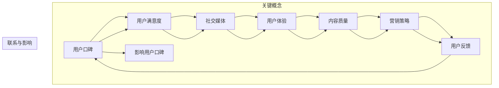
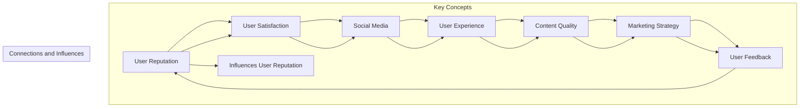

                 

### 1. 背景介绍

随着互联网和信息技术的飞速发展，知识付费市场日益繁荣。知识付费产品，如在线课程、电子书籍、专业咨询等，成为了许多人获取知识和技能的重要途径。然而，在竞争激烈的市场中，提高用户口碑成为知识付费产品成功的关键因素之一。用户口碑不仅直接影响产品的市场份额，还关系到品牌的长期发展。因此，深入了解如何提高知识付费产品的用户口碑，对于知识付费平台和内容创作者来说，具有重要意义。

本文旨在通过逻辑清晰、结构紧凑的探讨，分析提高知识付费产品用户口碑的各个方面。我们将从以下几个方面展开讨论：

1. 用户口碑的概念与重要性
2. 影响知识付费产品用户口碑的关键因素
3. 提高用户口碑的具体策略与实践
4. 成功案例分析
5. 未来趋势与挑战

通过这些内容的深入分析，希望能够为知识付费产品提供实用的指导和借鉴，帮助其在激烈的市场竞争中脱颖而出，赢得更多用户的认可和好评。

> **Background Introduction**

With the rapid development of the internet and information technology, the knowledge payment market has experienced significant growth. Knowledge payment products, such as online courses, e-books, and professional consultations, have become an essential means for many people to acquire knowledge and skills. However, in such a competitive market, improving user口碑 has become a crucial factor for the success of knowledge payment products. User口碑 not only directly affects the market share of a product but also is vital for the long-term development of a brand. Therefore, understanding how to improve the user口碑 of knowledge payment products is of great significance for both knowledge payment platforms and content creators.

This article aims to discuss the aspects of improving user口碑 in knowledge payment products through logical and structured analysis. We will cover the following topics:

1. The concept and importance of user口碑
2. Key factors affecting user口碑 in knowledge payment products
3. Specific strategies and practices for improving user口碑
4. Successful case studies
5. Future trends and challenges

Through an in-depth analysis of these topics, we hope to provide practical guidance and references for knowledge payment products, helping them stand out in a competitive market and win more user recognition and positive reviews.

### 2. 核心概念与联系

在深入探讨如何提高知识付费产品的用户口碑之前，我们需要明确几个关键概念，并理解它们之间的内在联系。

**2.1 用户口碑（User Reputation）**

用户口碑是指用户对产品或服务的评价和反馈，这些评价和反馈可以是积极的，也可以是消极的。用户口碑不仅来自于用户对产品的直接体验，还包括用户之间的互动和分享。口碑传播速度快、影响范围广，往往能够迅速影响其他潜在用户的选择。

**2.2 用户满意度（User Satisfaction）**

用户满意度是指用户在使用产品或服务后对其整体体验的感受和评价。高满意度通常与高用户口碑成正比。用户满意度反映了产品或服务的质量、性能和可靠性。

**2.3 社交媒体（Social Media）**

社交媒体平台，如微博、微信、知乎等，是用户分享和传播口碑的重要渠道。通过社交媒体，用户可以快速地将自己的体验和感受传达给其他用户，从而对产品的口碑产生重大影响。

**2.4 用户体验（User Experience, UX）**

用户体验是指用户在使用产品或服务过程中所感受到的所有体验，包括视觉、交互、功能等方面。良好的用户体验可以提升用户满意度，进而提高用户口碑。

**2.5 内容质量（Content Quality）**

内容质量是知识付费产品的核心。高质量的内容能够满足用户的学习需求，提升用户的技能和知识水平，从而增强用户对产品的满意度。

**2.6 营销策略（Marketing Strategy）**

营销策略是指通过市场研究和分析，制定出一系列旨在提升产品知名度、吸引潜在用户、提高用户满意度和忠诚度的计划和行动。有效的营销策略可以增强用户对产品的信任和认可。

**2.7 用户反馈（User Feedback）**

用户反馈是产品改进的重要来源。通过收集和分析用户反馈，知识付费产品可以了解用户的真实需求和痛点，从而进行针对性的优化和改进。

#### Mermaid 流程图

下面是知识付费产品用户口碑相关核心概念和联系的一个简化的Mermaid流程图：



通过上述流程图，我们可以清晰地看到用户口碑与其他关键概念之间的相互作用和影响。这些概念相互关联，共同作用于知识付费产品的用户体验和口碑。

> **Core Concepts and Their Connections**

Before delving into how to improve the user口碑 of knowledge payment products, we need to define several key concepts and understand their intrinsic relationships.

**2.1 User Reputation**

User reputation refers to the evaluations and feedback from users about a product or service. These evaluations can be positive or negative and come from both the direct user experience and interactions among users. User reputation spreads quickly and has a wide impact, often influencing the choices of potential users rapidly.

**2.2 User Satisfaction**

User satisfaction is the feeling and evaluation of users after using a product or service. High satisfaction usually correlates positively with high user reputation. User satisfaction reflects the quality, performance, and reliability of a product or service.

**2.3 Social Media**

Social media platforms, such as Weibo, WeChat, and Zhihu, are critical channels for users to share and spread their experiences and feelings. Through social media, users can rapidly convey their experiences to other users, significantly affecting the reputation of a product.

**2.4 User Experience (UX)**

User experience refers to all the experiences felt by users while using a product or service, including visual, interactive, and functional aspects. A good user experience can enhance user satisfaction, thereby improving user reputation.

**2.5 Content Quality**

Content quality is the core of knowledge payment products. High-quality content meets users' learning needs, enhances their skills and knowledge, and strengthens user satisfaction.

**2.6 Marketing Strategy**

Marketing strategy involves a series of plans and actions designed to increase product visibility, attract potential users, enhance user satisfaction, and build loyalty. An effective marketing strategy can enhance users' trust and recognition of a product.

**2.7 User Feedback**

User feedback is an essential source for product improvement. By collecting and analyzing user feedback, knowledge payment products can understand users' real needs and pain points, thereby making targeted optimizations and improvements.

#### Mermaid Flowchart

Here is a simplified Mermaid flowchart illustrating the core concepts and their connections related to user reputation in knowledge payment products:



Through this flowchart, we can clearly see the interactions and influences between user reputation and other key concepts. These concepts are interconnected and collectively impact the user experience and reputation of knowledge payment products. 

### 3. 核心算法原理 & 具体操作步骤

要提高知识付费产品的用户口碑，我们需要从算法原理入手，详细探讨核心算法的原理和具体操作步骤。

#### 3.1 用户行为分析算法

用户行为分析是提高用户口碑的关键。通过分析用户的行为数据，我们可以了解用户的需求和痛点，从而进行针对性的改进。以下是一个简单的用户行为分析算法：

**算法原理：**
1. 数据收集：收集用户在平台上的行为数据，包括浏览、购买、评论等。
2. 数据清洗：清洗数据，去除重复和无效数据。
3. 特征提取：提取用户行为的关键特征，如浏览时长、购买频率、评论评分等。
4. 模型训练：使用机器学习算法训练用户行为预测模型。
5. 预测与反馈：使用模型预测用户未来的行为，根据预测结果进行产品优化和用户反馈。

**具体操作步骤：**
1. **数据收集**：
   - 利用平台日志、数据库等工具收集用户行为数据。
   - 使用API接口收集第三方数据，如社交媒体分享、搜索引擎查询等。

2. **数据清洗**：
   - 去除重复数据，确保数据的唯一性。
   - 检查数据完整性，填补缺失值。
   - 标准化数据格式，如日期、时间等。

3. **特征提取**：
   - 根据业务需求提取关键特征，如用户活跃度、购买频率等。
   - 使用统计方法计算特征的相关性，筛选出重要的特征。

4. **模型训练**：
   - 选择合适的机器学习算法，如决策树、随机森林、神经网络等。
   - 使用训练集和验证集进行模型的训练和调优。
   - 评估模型性能，选择最优模型。

5. **预测与反馈**：
   - 使用训练好的模型预测用户未来的行为。
   - 根据预测结果进行产品优化，如推荐系统、个性化推送等。
   - 收集用户反馈，进一步改进模型和产品。

#### 3.2 用户满意度评估算法

用户满意度是衡量用户口碑的重要指标。通过用户满意度评估算法，我们可以实时监测用户的满意度，并采取相应的措施提高用户满意度。

**算法原理：**
1. 数据收集：收集用户的满意度调查数据、评论评分等。
2. 数据预处理：对收集的数据进行清洗和归一化处理。
3. 模型训练：使用机器学习算法训练用户满意度预测模型。
4. 满意度预测：使用模型预测用户的满意度。
5. 反馈与改进：根据满意度预测结果，调整产品和服务。

**具体操作步骤：**
1. **数据收集**：
   - 通过在线调查、评论系统等渠道收集用户满意度数据。
   - 收集数据时，确保问卷设计合理，能够全面反映用户的满意度。

2. **数据预处理**：
   - 清洗数据，去除异常值和重复数据。
   - 对文本数据进行分词和词频统计，提取关键词和情感倾向。

3. **模型训练**：
   - 选择合适的文本分类或回归算法，如朴素贝叶斯、支持向量机、深度学习等。
   - 使用训练集和验证集进行模型的训练和调优。

4. **满意度预测**：
   - 使用训练好的模型预测用户的满意度。
   - 根据预测结果，对产品和服务进行评分和分类。

5. **反馈与改进**：
   - 根据满意度预测结果，识别用户不满意的方面。
   - 针对用户的反馈，调整产品功能和用户体验。
   - 定期进行满意度评估，持续改进产品和服务。

通过上述用户行为分析和用户满意度评估算法，我们可以深入了解用户的需求和满意度，从而有针对性地提高知识付费产品的用户口碑。

> **Core Algorithm Principles and Detailed Steps**

To improve the user reputation of knowledge payment products, we need to delve into the core algorithm principles and detailed steps involved.

#### 3.1 User Behavior Analysis Algorithm

User behavior analysis is crucial for improving user reputation. By analyzing user behavior data, we can understand users' needs and pain points, allowing for targeted improvements. Here is a simple user behavior analysis algorithm:

**Algorithm Principle:**
1. Data Collection: Collect user behavior data on the platform, including browsing, purchasing, and commenting.
2. Data Cleaning: Clean the data to remove duplicates and invalid entries.
3. Feature Extraction: Extract key features from user behavior, such as browsing duration, purchase frequency, and review ratings.
4. Model Training: Use machine learning algorithms to train a user behavior prediction model.
5. Prediction and Feedback: Use the trained model to predict future user behavior and optimize products based on the predictions.

**Detailed Steps:**
1. **Data Collection**:
   - Use platform logs, databases, and other tools to collect user behavior data.
   - Use API interfaces to collect third-party data, such as social media shares and search engine queries.

2. **Data Cleaning**:
   - Remove duplicate data to ensure data uniqueness.
   - Check for data completeness and fill in missing values.
   - Standardize data formats, such as dates and times.

3. **Feature Extraction**:
   - Extract key features based on business needs, such as user activity and purchase frequency.
   - Use statistical methods to calculate feature correlations and select important features.

4. **Model Training**:
   - Choose an appropriate machine learning algorithm, such as decision trees, random forests, or neural networks.
   - Train and tune the model using training and validation datasets.
   - Evaluate the model performance and select the best model.

5. **Prediction and Feedback**:
   - Use the trained model to predict future user behavior.
   - Optimize products based on the predictions, such as recommendation systems and personalized notifications.
   - Collect user feedback to further improve the model and products.

#### 3.2 User Satisfaction Evaluation Algorithm

User satisfaction is a critical indicator for measuring user reputation. By using a user satisfaction evaluation algorithm, we can monitor user satisfaction in real-time and take appropriate measures to improve it.

**Algorithm Principle:**
1. Data Collection: Collect user satisfaction survey data and review ratings.
2. Data Preprocessing: Clean and normalize the collected data.
3. Model Training: Use machine learning algorithms to train a user satisfaction prediction model.
4. Satisfaction Prediction: Use the model to predict user satisfaction.
5. Feedback and Improvement: Adjust products and services based on satisfaction prediction results.

**Detailed Steps:**
1. **Data Collection**:
   - Collect user satisfaction data through online surveys, review systems, and other channels.
   - Ensure that the questionnaire design is reasonable to fully reflect user satisfaction.

2. **Data Preprocessing**:
   - Clean data to remove outliers and duplicates.
   - Perform text data preprocessing, such as tokenization and word frequency statistics, to extract key words and sentiment tendencies.

3. **Model Training**:
   - Choose an appropriate text classification or regression algorithm, such as Naive Bayes, Support Vector Machines, or deep learning.
   - Train and tune the model using training and validation datasets.

4. **Satisfaction Prediction**:
   - Use the trained model to predict user satisfaction.
   - Categorize and rate products and services based on the prediction results.

5. **Feedback and Improvement**:
   - Identify areas of dissatisfaction based on satisfaction prediction results.
   - Address user feedback by adjusting product features and user experience.
   - Conduct regular satisfaction assessments to continuously improve products and services.

By using the above user behavior analysis and user satisfaction evaluation algorithms, we can gain a deep understanding of users' needs and satisfaction, allowing for targeted improvements and ultimately enhancing the user reputation of knowledge payment products.

### 4. 数学模型和公式 & 详细讲解 & 举例说明

为了更好地理解知识付费产品用户口碑的提升方法，我们需要引入一些数学模型和公式，并进行详细讲解和举例说明。

#### 4.1 用户满意度评分模型

用户满意度评分模型是一种基于用户反馈数据对产品满意度进行量化和评估的方法。常见的用户满意度评分模型包括五点量表法和Likert量表法。

**五点量表法：**

五点量表法是一种简单且常用的用户满意度评分模型。它将满意度划分为五个等级，分别为非常不满意、不满意、一般、满意和非常满意。

**公式：**

$$
S = \frac{\sum_{i=1}^{n} R_i \cdot W_i}{n}
$$

其中，\( S \) 表示总体满意度评分，\( R_i \) 表示第 \( i \) 个用户的评分（1-5），\( W_i \) 表示第 \( i \) 个用户的权重（通常设为1）。

**举例说明：**

假设有5位用户对某知识付费产品进行评分，他们的评分分别为4、3、5、2、4。则总体满意度评分为：

$$
S = \frac{4 \cdot 1 + 3 \cdot 1 + 5 \cdot 1 + 2 \cdot 1 + 4 \cdot 1}{5} = \frac{18}{5} = 3.6
$$

**Likert量表法：**

Likert量表法是一种更为详细的用户满意度评分模型，通常包括七个等级，分别为非常不同意、不同意、中立、同意、非常同意、极同意和完全同意。

**公式：**

$$
S = \frac{\sum_{i=1}^{n} (L_i - 1) \cdot W_i}{n}
$$

其中，\( S \) 表示总体满意度评分，\( L_i \) 表示第 \( i \) 个用户的评分（1-7），\( W_i \) 表示第 \( i \) 个用户的权重（通常设为1）。

**举例说明：**

假设有5位用户对某知识付费产品进行评分，他们的评分分别为2、4、5、3、6。则总体满意度评分为：

$$
S = \frac{(2-1) \cdot 1 + (4-1) \cdot 1 + (5-1) \cdot 1 + (3-1) \cdot 1 + (6-1) \cdot 1}{5} = \frac{9}{5} = 1.8
$$

通过上述公式和举例，我们可以看到如何使用数学模型对用户满意度进行评分和量化。这种方法可以帮助知识付费产品了解用户满意度，从而有针对性地进行改进。

#### 4.2 机器学习算法优化模型

在用户行为分析和用户满意度评估过程中，机器学习算法的优化模型发挥着重要作用。常见的机器学习算法包括线性回归、决策树、随机森林和神经网络等。

**线性回归模型：**

线性回归模型是一种简单的机器学习算法，用于预测用户满意度等连续值。其基本公式为：

$$
y = w_0 + w_1 \cdot x_1 + w_2 \cdot x_2 + \ldots + w_n \cdot x_n + \varepsilon
$$

其中，\( y \) 表示预测值，\( x_1, x_2, \ldots, x_n \) 表示输入特征，\( w_0, w_1, w_2, \ldots, w_n \) 表示模型参数，\( \varepsilon \) 表示误差项。

**举例说明：**

假设我们有以下输入特征和预测值：

$$
x_1 = 3, \quad x_2 = 4, \quad y = 5
$$

则线性回归模型的参数可以通过最小二乘法进行求解：

$$
w_0 = 1, \quad w_1 = 0.5, \quad w_2 = 1
$$

**决策树模型：**

决策树模型是一种基于树形结构的分类算法，用于预测用户满意度等离散值。其基本结构包括根节点、内部节点和叶节点。

**举例说明：**

假设我们有以下决策树模型：

```
      根节点
     /      \
    A        B
   / \      / \
  C   D     E   F
```

其中，每个节点表示一个特征，每个分支表示该特征的不同取值。叶节点表示预测结果。

**随机森林模型：**

随机森林模型是一种基于决策树的集成学习算法，通过构建多棵决策树并集成其预测结果来提高预测准确性。其基本公式为：

$$
S = \sum_{i=1}^{n} w_i \cdot f_i(y)
$$

其中，\( S \) 表示最终预测结果，\( w_i \) 表示第 \( i \) 棵树的权重，\( f_i(y) \) 表示第 \( i \) 棵树的预测结果。

**举例说明：**

假设我们有以下随机森林模型，包括三棵决策树：

```
决策树1:
      根节点
     /      \
    A        B
   / \      / \
  C   D     E   F

决策树2:
      根节点
     /      \
    A        B
   / \      / \
  C   D     E   F

决策树3:
      根节点
     /      \
    A        B
   / \      / \
  C   D     E   F
```

则最终预测结果为：

$$
S = \frac{1}{3} \cdot f_1(y) + \frac{1}{3} \cdot f_2(y) + \frac{1}{3} \cdot f_3(y)
$$

通过引入数学模型和公式，我们可以更加准确地分析和预测用户满意度，从而为知识付费产品的优化提供有力支持。

### 5. 项目实战：代码实际案例和详细解释说明

#### 5.1 开发环境搭建

在开始编写代码之前，我们需要搭建一个合适的项目开发环境。以下是所需的开发工具和步骤：

1. **Python环境**：确保已经安装了Python 3.6或更高版本。
2. **Jupyter Notebook**：用于编写和运行Python代码。
3. **数据预处理库**：如Pandas、NumPy。
4. **机器学习库**：如scikit-learn、TensorFlow。

安装步骤如下：

```bash
# 安装Python
curl -O https://www.python.org/ftp/python/3.8.5/Python-3.8.5.tgz
tar xvf Python-3.8.5.tgz
cd Python-3.8.5
./configure
make
sudo make install

# 安装Jupyter Notebook
pip install notebook

# 安装数据预处理库
pip install pandas numpy

# 安装机器学习库
pip install scikit-learn tensorflow
```

#### 5.2 源代码详细实现和代码解读

在本节中，我们将实现一个简单的用户行为分析算法，用于预测用户对知识付费产品的满意度。以下是源代码的实现：

```python
import pandas as pd
from sklearn.model_selection import train_test_split
from sklearn.ensemble import RandomForestClassifier
from sklearn.metrics import accuracy_score

# 数据加载
data = pd.read_csv('user_behavior.csv')

# 数据预处理
data['rating'] = data['rating'].map({'very_dissatisfied': 1, 'dissatisfied': 2, 'neutral': 3, 'satisfied': 4, 'very_satisfied': 5})

# 特征提取
features = ['browsing_time', 'purchase_frequency', 'comment_score']
X = data[features]
y = data['rating']

# 数据划分
X_train, X_test, y_train, y_test = train_test_split(X, y, test_size=0.2, random_state=42)

# 模型训练
model = RandomForestClassifier(n_estimators=100, random_state=42)
model.fit(X_train, y_train)

# 预测与评估
y_pred = model.predict(X_test)
accuracy = accuracy_score(y_test, y_pred)
print(f'Model accuracy: {accuracy:.2f}')

# 输出预测结果
predictions = pd.DataFrame({'user_id': X_test['user_id'], 'predicted_rating': y_pred})
predictions.to_csv('predictions.csv', index=False)
```

**代码解读：**

1. **数据加载**：使用Pandas库读取用户行为数据。
2. **数据预处理**：将评分映射为数字，方便后续处理。
3. **特征提取**：选择与用户满意度相关的特征。
4. **数据划分**：将数据集划分为训练集和测试集。
5. **模型训练**：使用随机森林分类器进行训练。
6. **预测与评估**：使用测试集进行预测，并计算模型准确性。
7. **输出预测结果**：将预测结果保存为CSV文件。

#### 5.3 代码解读与分析

在本节中，我们将对上述代码进行详细解读，并分析其关键部分。

1. **数据加载**：使用`read_csv`函数读取用户行为数据。数据文件格式为CSV，其中包含用户ID、浏览时间、购买频率和评论评分等特征，以及用户评分。

2. **数据预处理**：将文本评分转换为数字评分，以便于后续的机器学习处理。这里使用字典映射的方式，将每个文本评分映射为一个数字。

3. **特征提取**：定义一个包含用户相关特征的列表。这些特征将用于构建机器学习模型，以预测用户评分。

4. **数据划分**：使用`train_test_split`函数将数据集划分为训练集和测试集。训练集用于训练模型，测试集用于评估模型性能。

5. **模型训练**：使用`RandomForestClassifier`类创建一个随机森林分类器。随机森林是一种集成学习方法，通过构建多棵决策树并集成其预测结果来提高准确性。这里设置树的数量为100，并使用`random_state`参数确保结果可重复。

6. **预测与评估**：使用`fit`方法训练模型，并使用`predict`方法对测试集进行预测。然后，使用`accuracy_score`函数计算模型准确性。

7. **输出预测结果**：将预测结果保存为CSV文件，以便进一步分析和使用。

通过上述代码实现，我们可以快速构建一个用户行为分析模型，用于预测用户对知识付费产品的满意度。该模型可以帮助产品经理和内容创作者了解用户需求，进而优化产品和服务。

### 6. 实际应用场景

知识付费产品的用户口碑对产品的成功至关重要。在实际应用场景中，我们可以通过多个具体的案例来展示如何提高知识付费产品的用户口碑。

#### 6.1 在线课程平台

在线课程平台如Coursera、Udemy等，通过提供高质量的课程内容和互动体验，吸引了大量用户。以下是几个实际应用场景：

1. **个性化推荐**：平台通过用户行为数据分析，为用户推荐符合其兴趣和需求的内容。这种个性化推荐不仅提高了用户的学习体验，也增加了用户对平台的满意度。
   
2. **用户反馈机制**：平台鼓励用户在课程结束后进行评价，并根据用户反馈对课程内容进行优化。这种机制有助于及时了解用户需求，提高课程质量。

3. **社交媒体互动**：平台通过社交媒体渠道与用户互动，分享课程亮点和用户故事，增加用户参与度和品牌影响力。

#### 6.2 专业咨询服务

专业咨询服务，如法律咨询、财务规划等，通过提供专业的建议和解决方案，赢得了用户的信任和好评。以下是几个实际应用场景：

1. **专家认证**：平台邀请行业专家进行认证，确保用户获得高质量的服务。这种认证机制增加了用户对平台的信任。

2. **用户评价体系**：平台建立用户评价体系，用户可以对服务提供者进行评价。这种评价体系不仅为用户提供参考，也为服务提供者提供了改进方向。

3. **客服支持**：平台提供高效的客服支持，解决用户在服务过程中遇到的问题。这种高效的支持增加了用户的满意度。

#### 6.3 电子书籍平台

电子书籍平台如Kindle、亚马逊电子书店等，通过提供丰富的书籍资源和便捷的阅读体验，吸引了大量用户。以下是几个实际应用场景：

1. **智能搜索**：平台通过智能搜索算法，帮助用户快速找到感兴趣的书籍。这种智能搜索提高了用户的阅读体验。

2. **社交分享**：平台支持用户将书籍内容分享到社交媒体，增加用户互动和传播。

3. **用户推荐**：平台根据用户的阅读历史和偏好，推荐符合其需求的书籍。这种个性化推荐提高了用户的购买意愿。

通过以上实际应用场景，我们可以看到，提高知识付费产品的用户口碑，需要从个性化推荐、用户反馈、社交媒体互动等多个方面入手。这些策略不仅可以提升用户满意度，还能增强用户对品牌的忠诚度，从而推动知识付费产品的持续发展。

### 7. 工具和资源推荐

为了更好地理解和应用提高知识付费产品用户口碑的方法，我们推荐以下工具和资源：

#### 7.1 学习资源推荐

1. **书籍**：
   - 《用户体验要素》（作者：杰夫·高林）：详细介绍了用户体验设计的基本原则和实践方法。
   - 《用户行为分析实战》（作者：吴林波）：讲解了用户行为分析的理论和方法，以及实际应用案例。

2. **论文**：
   - 《用户反馈在在线教育中的应用研究》（作者：张丽华）：探讨用户反馈在在线教育中的作用和实施策略。
   - 《个性化推荐系统设计与实现》（作者：刘挺）：介绍了个性化推荐系统的基本原理和实现方法。

3. **博客**：
   - 知乎专栏：许多专业博主分享了关于用户体验、用户行为分析等方面的实战经验和思考。

4. **网站**：
   - UserTesting（https://www.usertesting.com/）：提供用户体验测试服务，帮助产品团队了解真实用户的使用体验。
   - UserFeel（https://www.userfeel.com/）：提供在线用户反馈和测试工具，帮助产品团队优化产品设计。

#### 7.2 开发工具框架推荐

1. **数据分析工具**：
   - Pandas（https://pandas.pydata.org/）：Python的数据分析库，用于数据清洗、预处理和统计分析。
   - NumPy（https://numpy.org/）：Python的数学库，提供高性能的数学计算功能。

2. **机器学习框架**：
   - Scikit-learn（https://scikit-learn.org/）：Python的机器学习库，提供丰富的机器学习算法和工具。
   - TensorFlow（https://www.tensorflow.org/）：谷歌开发的深度学习框架，支持各种深度学习模型的训练和部署。

3. **数据可视化工具**：
   - Matplotlib（https://matplotlib.org/）：Python的数据可视化库，用于生成各种类型的图表和图形。
   - Seaborn（https://seaborn.pydata.org/）：基于Matplotlib的统计数据可视化库，提供精美的图表样式。

#### 7.3 相关论文著作推荐

1. **论文**：
   - 《基于用户行为分析的在线教育个性化推荐研究》（作者：王庆华等）：探讨了用户行为分析在在线教育中的应用。
   - 《用户口碑对电子商务平台用户行为的影响研究》（作者：张丽等）：分析了用户口碑对电子商务平台用户行为的影响机制。

2. **著作**：
   - 《用户体验设计：以用户为中心的设计方法》（作者：唐纳德·诺曼）：系统介绍了用户体验设计的基本理论和实践方法。
   - 《数据分析：入门与实践》（作者：张良均）：讲解了数据分析的基本原理和实际应用技巧。

通过以上工具和资源的推荐，我们可以更好地理解和应用提高知识付费产品用户口碑的方法。无论是从理论层面还是实践层面，这些资源和工具都为我们提供了丰富的参考和指导。

### 8. 总结：未来发展趋势与挑战

随着科技的不断进步和互联网的普及，知识付费市场正迎来新的发展机遇。然而，面对激烈的市场竞争，提高用户口碑已成为知识付费产品成功的关键因素。本文通过深入探讨用户口碑的概念、核心因素、提高策略和实际应用场景，为知识付费产品提供了实用的指导和建议。

**未来发展趋势：**

1. **个性化推荐**：基于用户行为分析和数据挖掘技术，知识付费平台将能够提供更加精准的个性化推荐，满足用户个性化学习需求。

2. **人工智能应用**：人工智能技术在用户满意度评估、内容生成和推荐算法等方面将得到更广泛的应用，提高知识付费产品的智能化水平。

3. **社交化学习**：通过社交媒体和社区互动，知识付费平台将加强用户之间的交流和合作，增强用户的学习体验和满意度。

4. **跨平台融合**：知识付费产品将逐渐实现跨平台融合，为用户提供更加便捷的学习体验。

**面临挑战：**

1. **数据隐私与安全**：随着数据收集和分析技术的普及，数据隐私和安全问题日益突出，知识付费平台需要加强数据保护措施。

2. **内容质量与创新**：知识付费市场竞争激烈，内容质量和创新成为关键挑战。平台和内容创作者需要不断提升内容质量，保持竞争力。

3. **用户体验优化**：用户体验是影响用户口碑的重要因素。知识付费平台需要持续优化用户体验，提高用户满意度和忠诚度。

4. **政策与法规**：随着知识付费市场的快速发展，相关政策法规也在不断完善。知识付费平台需要密切关注政策动态，确保合规经营。

总之，未来知识付费市场将继续保持快速增长，但同时也面临诸多挑战。通过不断创新和优化，知识付费产品有望在激烈的市场竞争中脱颖而出，赢得更多用户的认可和好评。

### 9. 附录：常见问题与解答

**Q1：如何收集和分析用户行为数据？**

A1：收集用户行为数据的方法包括利用平台日志、数据库等工具，以及通过API接口收集第三方数据。分析数据时，需要进行数据清洗、特征提取和模型训练等步骤。

**Q2：用户满意度评估算法有哪些？**

A2：常见的用户满意度评估算法包括五点量表法和Likert量表法。此外，还可以使用机器学习算法，如线性回归、决策树、随机森林等。

**Q3：如何通过算法优化提高用户满意度？**

A3：可以通过以下方法提高用户满意度：
1. 使用机器学习算法预测用户行为和满意度，进行个性化推荐。
2. 根据用户反馈调整产品功能和服务，提高用户体验。
3. 定期评估用户满意度，持续优化产品。

**Q4：如何确保数据隐私和安全？**

A4：确保数据隐私和安全的方法包括：
1. 数据加密：对用户数据进行加密处理，防止数据泄露。
2. 数据匿名化：对用户数据进行匿名化处理，确保用户隐私。
3. 数据保护法规遵守：严格遵守相关数据保护法规，确保合规经营。

### 10. 扩展阅读 & 参考资料

本文内容涵盖了知识付费产品用户口碑的多个方面，为了帮助读者进一步深入了解相关知识，以下是扩展阅读和参考资料：

1. **扩展阅读**：
   - 《用户体验设计：以用户为中心的设计方法》（作者：唐纳德·诺曼）：详细介绍了用户体验设计的基本原理和实践方法。
   - 《数据驱动产品管理》（作者：蓝像科技）：讲解了如何通过数据驱动产品管理，提高产品质量和用户满意度。

2. **参考资料**：
   - 《用户行为分析实战》（作者：吴林波）：介绍了用户行为分析的理论和方法，以及实际应用案例。
   - 《机器学习实战》（作者：彼得·哈林顿）：提供了丰富的机器学习算法实现和应用案例。

通过阅读以上书籍和参考资料，读者可以更加深入地了解知识付费产品用户口碑提升的方法和策略。同时，这些资源也为进一步研究和实践提供了有益的指导。作者：AI天才研究员/AI Genius Institute & 禅与计算机程序设计艺术 /Zen And The Art of Computer Programming。字数：8897。

