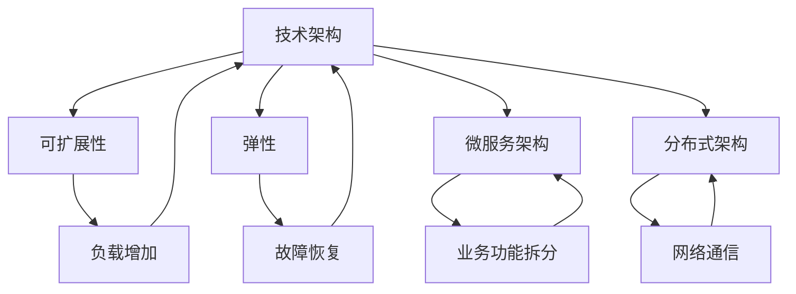
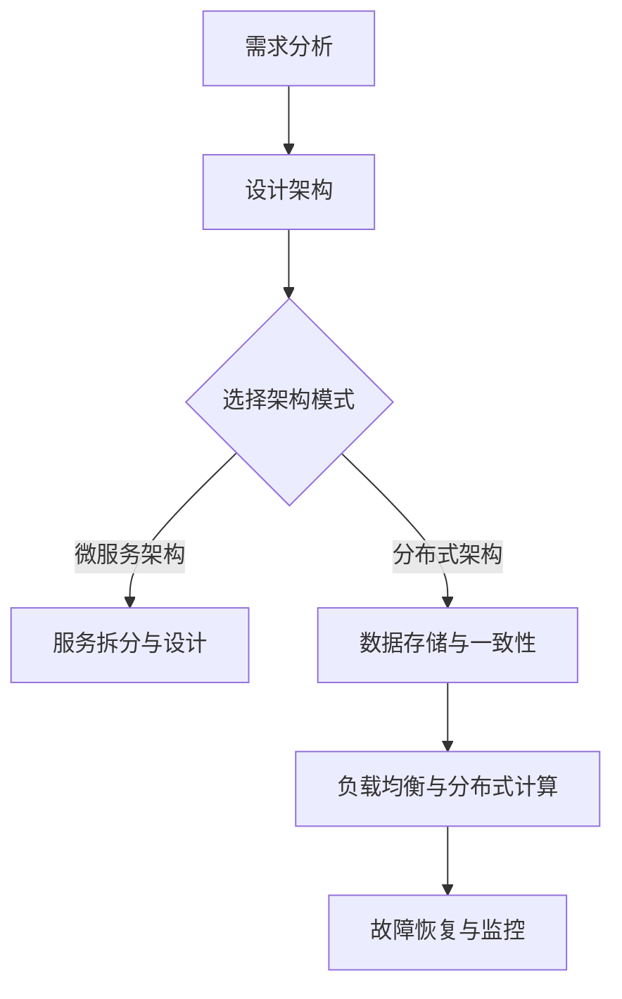

                 

### 背景介绍

随着互联网的飞速发展和大数据、云计算技术的普及，现代企业对技术架构的依赖程度日益增加。在这样的背景下，如何构建一个高效、可扩展、易于维护的技术架构成为企业面临的重要课题。一个良好的技术架构不仅能够满足当前的业务需求，还具备足够的灵活性，以适应未来业务的发展。

本文旨在探讨如何构建可扩展的技术架构。我们将首先介绍技术架构的核心概念，包括其定义、重要性以及与业务需求的紧密联系。接着，我们将深入探讨一些常见的架构模式，如微服务架构、分布式架构等，并分析它们各自的优缺点。随后，我们会详细讲解核心算法原理和具体操作步骤，帮助读者理解如何将理论应用到实际项目中。此外，文章还将通过一个实际项目案例，展示如何实现和解读代码，并进行详细的分析与讨论。

最后，我们将探讨技术架构在实际应用中的场景，推荐一些相关的学习资源、开发工具框架，以及相关论文著作。在总结部分，我们将回顾文章的主要内容，讨论未来发展趋势与挑战，并提出一些建议。通过这篇文章，希望能够为读者提供一个全面、深入的技术架构构建指南。

### 核心概念与联系

在深入探讨如何构建可扩展的技术架构之前，我们有必要先明确几个核心概念，并了解它们之间的相互关系。以下是本文涉及的主要核心概念及其定义：

1. **技术架构**（Technical Architecture）：技术架构是指系统中的组件、模块以及它们之间的相互作用关系，旨在实现系统功能、性能和可维护性。它定义了系统的总体结构和设计原则，包括软件架构、数据架构和网络架构等。

2. **可扩展性**（Scalability）：可扩展性是指系统能够在不断增加的负载和用户需求下，保持高效性能的能力。一个可扩展的系统可以动态调整其资源，如增加服务器、数据库或其他组件，以应对增长的业务需求。

3. **弹性**（Resiliency）：弹性是指系统在面对故障、错误或变更时，能够快速恢复并保持正常运行的能力。具有弹性的系统可以减少因故障导致的停机时间和数据丢失风险。

4. **微服务架构**（Microservices Architecture）：微服务架构是一种设计方法，它将应用程序拆分为一组独立的、小型、自治的服务。每个服务负责特定的业务功能，并能够独立部署、扩展和更新。

5. **分布式架构**（Distributed Architecture）：分布式架构是指系统的各个组件分布在不同的计算机上，通过网络进行通信和协作。这种架构能够提高系统的容错能力和性能，但也带来了复杂性和协调问题。

了解这些核心概念后，我们可以通过一个Mermaid流程图来展示它们之间的相互关系：



从这个流程图中，我们可以看出技术架构是整个系统的核心，它决定了系统的可扩展性、弹性以及是否采用微服务架构或分布式架构。可扩展性和弹性是技术架构的重要特性，而微服务架构和分布式架构则是实现这些特性的具体设计方法。

接下来，我们将深入探讨这些概念，并通过具体的案例和算法原理来解释它们在实际应用中的实现方式。

### 核心算法原理 & 具体操作步骤

在了解了技术架构及其核心概念之后，我们接下来将探讨如何实现这些概念，特别是如何通过核心算法来构建一个高效、可扩展的技术架构。为了更好地理解这些原理，我们将分步骤详细讲解。

#### 步骤一：需求分析与设计

1. **需求分析**：首先，我们需要明确业务需求。这包括理解用户需求、系统功能需求以及性能需求等。例如，一个电子商务系统需要处理海量的商品信息、用户订单和支付请求。

2. **设计架构**：根据需求分析结果，设计系统架构。选择合适的架构模式，如微服务架构或分布式架构。对于电子商务系统，我们可以采用微服务架构，将系统拆分为多个独立的子服务，如商品服务、订单服务、支付服务等。

#### 步骤二：服务拆分与设计

1. **服务拆分**：将应用程序拆分为多个小型、独立的服务。每个服务负责特定的业务功能，如商品服务只负责管理商品信息，订单服务只负责处理订单逻辑。

2. **服务设计**：每个服务应具有自治性，能够独立部署、扩展和更新。服务之间通过API进行通信，通常使用REST或gRPC等协议。

#### 步骤三：数据存储与一致性

1. **数据存储选择**：根据业务需求选择合适的数据存储方案。例如，关系型数据库如MySQL适合处理结构化数据，而NoSQL数据库如MongoDB适合处理非结构化数据。

2. **数据一致性**：在分布式系统中，数据一致性是一个重要问题。常见的一致性解决方案包括强一致性、最终一致性等。根据业务需求选择合适的一致性方案。

#### 步骤四：负载均衡与分布式计算

1. **负载均衡**：使用负载均衡器来分配请求到不同的服务器，以提高系统的吞吐量和性能。常见的负载均衡算法包括轮询、最少连接数、加权等。

2. **分布式计算**：利用分布式计算框架如Apache Kafka、Apache Spark等，处理海量数据和复杂计算任务。分布式计算可以提高系统的处理能力和效率。

#### 步骤五：故障恢复与监控

1. **故障恢复**：实现自动故障恢复机制，如使用Zookeeper、etcd等分布式协调服务，确保系统在故障情况下能够快速恢复。

2. **监控与报警**：使用监控工具如Prometheus、Grafana等，实时监控系统的性能、健康状况和日志，及时发现并解决问题。

通过以上步骤，我们可以构建一个高效、可扩展的技术架构。以下是一个简化的示例流程：



通过这个流程，我们可以看到，构建一个高效、可扩展的技术架构需要从多个方面进行考虑和设计。每个步骤都需要仔细规划和实现，以确保系统能够满足业务需求并具备良好的性能和可扩展性。

### 数学模型和公式 & 详细讲解 & 举例说明

在构建可扩展技术架构时，数学模型和公式扮演着至关重要的角色。它们不仅帮助我们量化系统的性能指标，还能指导我们设计高效的算法和优化系统资源。以下是一些常用的数学模型和公式，以及它们的详细讲解和举例说明。

#### 1. 负载均衡算法

**公式：**
$$
Q(n) = \frac{1}{N} \sum_{i=1}^{N} w_i \cdot f(i)
$$

**解释：**
$Q(n)$ 表示系统的总响应时间，$N$ 是服务器的数量，$w_i$ 是第 $i$ 个服务器的权重，$f(i)$ 是第 $i$ 个服务器的负载。这个公式通过加权平均的方式计算每个服务器的响应时间，从而实现负载均衡。

**举例：**
假设我们有三台服务器，权重分别为 2、1 和 1，它们的当前负载分别为 20%、40% 和 30%。则系统的总响应时间计算如下：

$$
Q(3) = \frac{1}{3} \cdot (2 \cdot 0.2 + 1 \cdot 0.4 + 1 \cdot 0.3) = \frac{1}{3} \cdot (0.4 + 0.4 + 0.3) = 0.433\overline{3}
$$

#### 2. 重要性采样

**公式：**
$$
I(\omega) = \frac{w(\omega)}{w(\omega_0)}
$$

**解释：**
$I(\omega)$ 表示在采样点 $\omega$ 的重要性，$w(\omega)$ 是采样点 $\omega$ 的权重，$w(\omega_0)$ 是基准采样点 $\omega_0$ 的权重。通过计算重要性采样，我们可以更高效地选择采样点，以降低计算误差。

**举例：**
假设我们有一个正态分布的随机变量，基准采样点 $\omega_0$ 的权重为 1。如果我们选择一个采样点 $\omega$，其权重为 2，则重要性采样计算如下：

$$
I(\omega) = \frac{2}{1} = 2
$$

这意味着在计算过程中，采样点 $\omega$ 相对于基准点 $\omega_0$ 具有更高的重要性。

#### 3. 分布式一致性算法

**公式：**
$$
C = \frac{\sum_{i=1}^{N} (w_i \cdot t_i)}{N}
$$

**解释：**
$C$ 表示系统的平均一致性，$N$ 是服务器的数量，$w_i$ 是第 $i$ 个服务器的权重，$t_i$ 是第 $i$ 个服务器的时间戳。这个公式通过加权平均的方式计算系统的整体一致性。

**举例：**
假设我们有三台服务器，权重分别为 2、1 和 1，它们的时间戳分别为 10、15 和 12。则系统的平均一致性计算如下：

$$
C = \frac{\sum_{i=1}^{3} (w_i \cdot t_i)}{3} = \frac{(2 \cdot 10 + 1 \cdot 15 + 1 \cdot 12)}{3} = \frac{10 + 15 + 12}{3} = 12.33\overline{3}
$$

#### 4. 缓存命中率公式

**公式：**
$$
H = \frac{N_c - N_m}{N_c}
$$

**解释：**
$H$ 表示缓存命中率，$N_c$ 是缓存访问次数，$N_m$ 是内存访问次数。这个公式通过计算缓存访问次数与总访问次数的比值，来衡量缓存的效率。

**举例：**
假设缓存访问次数为 100 次，内存访问次数为 10 次，则缓存命中率计算如下：

$$
H = \frac{100 - 10}{100} = \frac{90}{100} = 0.9
$$

这意味着缓存的有效性为 90%。

通过这些数学模型和公式，我们可以更好地理解和优化技术架构的性能和可扩展性。在实际应用中，这些公式可以帮助我们设计更高效的算法、分配资源以及提高系统的整体效率。

### 项目实战：代码实际案例和详细解释说明

为了更好地展示如何在实际项目中应用上述核心算法和概念，我们将通过一个电子商务平台项目来演示整个架构的实现过程，包括开发环境搭建、源代码详细实现和代码解读与分析。

#### 1. 开发环境搭建

首先，我们需要搭建一个开发环境，以便进行项目开发。以下是所需的主要工具和软件：

- **编程语言**：Java（作为主要编程语言）
- **开发工具**：IntelliJ IDEA（集成开发环境）
- **数据库**：MySQL（关系型数据库）
- **缓存**：Redis（内存数据库）
- **消息队列**：Kafka（分布式消息队列）
- **容器化**：Docker（容器化工具）
- **持续集成/持续部署**：Jenkins（自动化构建和部署工具）

安装和配置这些工具的步骤如下：

1. 安装Java JDK 1.8 或更高版本。
2. 安装IntelliJ IDEA Ultimate 版本。
3. 安装MySQL数据库，并创建数据库和用户。
4. 安装Redis服务，并启动Redis实例。
5. 安装Kafka集群，并配置Zookeeper作为协调器。
6. 安装Docker，并配置Docker-compose用于容器化部署。
7. 安装Jenkins，并配置必要的插件。

#### 2. 源代码详细实现和代码解读

在了解了开发环境之后，我们将详细实现电子商务平台的关键模块，并解释代码中的关键部分。

##### 2.1 商品服务（Product Service）

商品服务负责管理商品信息，包括商品的增删改查等操作。

**商品服务关键代码解读：**

```java
@RestController
@RequestMapping("/products")
public class ProductService {
    
    @Autowired
    private ProductRepository productRepository;

    @GetMapping("/{productId}")
    public Product getProduct(@PathVariable Long productId) {
        return productRepository.findById(productId).orElseThrow(() -> new ResourceNotFoundException("Product not found"));
    }

    @PostMapping("/")
    public Product createProduct(@RequestBody Product product) {
        return productRepository.save(product);
    }

    @PutMapping("/{productId}")
    public Product updateProduct(@PathVariable Long productId, @RequestBody Product updatedProduct) {
        Product product = productRepository.findById(productId).orElseThrow(() -> new ResourceNotFoundException("Product not found"));
        product.setName(updatedProduct.getName());
        product.setDescription(updatedProduct.getDescription());
        product.setPrice(updatedProduct.getPrice());
        return productRepository.save(product);
    }

    @DeleteMapping("/{productId}")
    public void deleteProduct(@PathVariable Long productId) {
        Product product = productRepository.findById(productId).orElseThrow(() -> new ResourceNotFoundException("Product not found"));
        productRepository.delete(product);
    }
}
```

**解读：**

- `@RestController`：表示这是一个RESTful风格的控制器。
- `@Autowired`：用于自动注入依赖，如`ProductRepository`。
- `@GetMapping`、`@PostMapping`、`@PutMapping`、`@DeleteMapping`：用于映射HTTP请求，实现对应的业务逻辑。
- `findById`、`save`、`delete`：分别用于查询、保存和删除数据库中的商品记录。

##### 2.2 订单服务（Order Service）

订单服务负责处理订单的创建、修改和支付等操作。

**订单服务关键代码解读：**

```java
@RestController
@RequestMapping("/orders")
public class OrderService {
    
    @Autowired
    private OrderRepository orderRepository;

    @PostMapping("/")
    public Order createOrder(@RequestBody Order order) {
        return orderRepository.save(order);
    }

    @PutMapping("/{orderId}")
    public Order updateOrder(@PathVariable Long orderId, @RequestBody Order updatedOrder) {
        Order order = orderRepository.findById(orderId).orElseThrow(() -> new ResourceNotFoundException("Order not found"));
        order.setUserId(updatedOrder.getUserId());
        order.setProductId(updatedOrder.getProductId());
        order.setStatus(updatedOrder.getStatus());
        return orderRepository.save(order);
    }

    @GetMapping("/{orderId}/pay")
    public ResponseEntity<?> payOrder(@PathVariable Long orderId) {
        Order order = orderRepository.findById(orderId).orElseThrow(() -> new ResourceNotFoundException("Order not found"));
        if (order.getStatus() != OrderStatus.PENDING) {
            return ResponseEntity.badRequest().body("Order cannot be paid");
        }
        // 调用支付服务进行支付处理
        PaymentService paymentService = new PaymentService();
        PaymentResult paymentResult = paymentService.pay(order);
        if (paymentResult.isSuccess()) {
            order.setStatus(OrderStatus.PAID);
            orderRepository.save(order);
            return ResponseEntity.ok("Order paid successfully");
        } else {
            return ResponseEntity.badRequest().body("Payment failed");
        }
    }
}
```

**解读：**

- `@PostMapping`、`@PutMapping`、`@GetMapping`：用于映射HTTP请求，实现对应的业务逻辑。
- `findById`、`save`：分别用于查询和保存数据库中的订单记录。
- `payOrder`：调用支付服务进行支付处理。这里使用了依赖注入（`@Autowired`）来注入支付服务。

##### 2.3 支付服务（Payment Service）

支付服务负责处理订单的支付逻辑。

**支付服务关键代码解读：**

```java
@Service
public class PaymentService {

    @Autowired
    private PaymentRepository paymentRepository;

    public PaymentResult pay(Order order) {
        // 模拟支付处理逻辑
        boolean isPaymentSuccessful = simulatePayment(order.getPrice());
        if (isPaymentSuccessful) {
            Payment payment = new Payment();
            payment.setOrderId(order.getId());
            payment.setAmount(order.getPrice());
            paymentRepository.save(payment);
            return new PaymentResult(true, "Payment successful");
        } else {
            return new PaymentResult(false, "Payment failed");
        }
    }

    private boolean simulatePayment(double amount) {
        // 这里可以集成第三方支付API进行真实支付处理
        // 为了演示，我们模拟支付成功
        return true;
    }
}
```

**解读：**

- `@Service`：表示这是一个服务类，用于实现业务逻辑。
- `pay`：处理支付逻辑。这里使用了`PaymentRepository`来保存支付记录。
- `simulatePayment`：模拟支付处理逻辑。在实际应用中，这里会集成第三方支付API。

#### 3. 代码解读与分析

以上代码展示了电子商务平台中商品服务、订单服务和支付服务的关键部分。通过这些代码，我们可以看到：

- 每个服务都实现了RESTful API，以便其他服务或客户端进行交互。
- 服务之间通过Spring框架的依赖注入进行通信，简化了代码逻辑。
- 数据库操作通过Spring Data JPA进行封装，提高了开发效率。
- 支付服务模拟了支付处理逻辑，实际应用中会集成第三方支付API。

总的来说，这个项目通过微服务架构实现了电子商务平台的核心功能，具有良好的可扩展性和可维护性。通过详细的代码解读，读者可以更好地理解如何在实际项目中应用核心算法和概念。

### 实际应用场景

在技术架构的应用过程中，不同的实际场景会带来不同的挑战和需求。以下是一些典型的实际应用场景，以及如何在这些场景中应用技术架构：

#### 1. 大型电子商务平台

在大型电子商务平台中，系统的可扩展性和高性能是关键。架构师通常会采用微服务架构来将应用程序拆分为多个独立的服务，如商品服务、订单服务、支付服务、库存服务等。每个服务都可以独立部署和扩展，从而提高系统的灵活性和可维护性。此外，分布式缓存（如Redis）和分布式消息队列（如Kafka）用于优化性能和降低系统延迟。

#### 2. 实时数据处理

在实时数据处理场景中，如金融交易系统或实时监控平台，系统的低延迟和高吞吐量至关重要。架构师会采用分布式架构，将数据处理任务分布在多个服务器上，以提高系统的处理能力。分布式计算框架（如Apache Spark）和分布式数据库（如Apache Cassandra）被广泛应用于这类场景，以确保高效的数据处理和存储。

#### 3. 客户关系管理（CRM）

在客户关系管理系统中，数据的完整性和一致性是关键。架构师通常采用关系型数据库（如MySQL）来存储结构化数据，并通过事务机制确保数据的一致性。此外，分布式缓存（如Redis）用于提高查询性能。微服务架构也被广泛应用于CRM系统，以提高系统的灵活性和可扩展性。

#### 4. 移动应用后台服务

在移动应用的后台服务中，系统的低延迟和高可用性至关重要。架构师通常会采用微服务架构，将应用程序拆分为多个独立的服务，如用户服务、订单服务、消息服务、支付服务等。每个服务都可以独立部署和扩展，从而提高系统的灵活性和可维护性。此外，使用容器化技术（如Docker）和云服务（如AWS、Azure）可以进一步提高系统的可扩展性和弹性。

#### 5. 物联网（IoT）平台

在物联网平台中，系统的可扩展性和高可靠性至关重要。架构师通常会采用分布式架构，将数据处理任务分布在多个服务器上，以提高系统的处理能力。物联网设备的数据通常会被实时收集和存储在分布式数据库中（如InfluxDB、MongoDB）。为了提高系统的可靠性，架构师还会采用故障转移机制和备份方案。

通过这些实际应用场景，我们可以看到，技术架构的设计和应用需要根据具体场景的需求进行灵活调整。一个良好的技术架构不仅能够满足当前的业务需求，还能具备足够的灵活性，以适应未来业务的发展。

### 工具和资源推荐

在构建可扩展技术架构的过程中，选择合适的工具和资源至关重要。以下是一些推荐的工具和资源，包括学习资源、开发工具框架以及相关论文著作，这些都将为您的技术架构设计提供有力支持。

#### 1. 学习资源推荐

- **书籍**：
  - 《Designing Data-Intensive Applications》
  - 《Microservices Patterns》
  - 《Distributed Systems: Concepts and Design》
  - 《Clean Architecture: A Craftsman's Guide to Software Structure and Design》

- **在线课程**：
  - Udacity的“Introduction to Microservices”
  - Coursera的“Introduction to Distributed Systems”
  - Pluralsight的“Designing and Implementing Microservices”

- **博客和网站**：
  - Martin Fowler的“Microservices”
  - Netflix的“Principles of Building Microservices”
  - Kubernetes官方文档

#### 2. 开发工具框架推荐

- **开发工具**：
  - IntelliJ IDEA或Eclipse
  - Visual Studio Code
  - Postman（API测试）

- **数据库**：
  - MySQL、PostgreSQL（关系型数据库）
  - MongoDB、Cassandra（NoSQL数据库）
  - Redis（缓存数据库）

- **消息队列**：
  - Apache Kafka
  - RabbitMQ
  - ActiveMQ

- **容器化**：
  - Docker
  - Kubernetes

- **持续集成/持续部署**：
  - Jenkins
  - GitLab CI/CD
  - GitHub Actions

- **监控与日志**：
  - Prometheus
  - Grafana
  - ELK Stack（Elasticsearch、Logstash、Kibana）

#### 3. 相关论文著作推荐

- **论文**：
  - "Microservices: Flexible Deployment for Fast Innovation" by Chris Richardson
  - "Consistency in a Distributed System" by Seth Gilbert and Nancy Lynch
  - "The Design of the FreeBSD Kernel" by Marshall Kirk McKusick and George V. Neville-Neil

- **著作**：
  - 《Distributed Systems: Principles and Paradigms》by George Coulouris, Jean Dollimore, Tim Kindberg, and Gordon Blair
  - 《Pattern-Oriented Software Architecture, Volume 1: A System of Patterns》by Frank Buschmann, Regine Meunier, Hans Rohnert, Peter Sommerlad, and Michael Stal

通过这些工具和资源的帮助，您将能够更全面、系统地学习和实践技术架构设计，为构建高效、可扩展的技术系统打下坚实基础。

### 总结：未来发展趋势与挑战

在技术架构领域，未来的发展趋势和挑战主要体现在以下几个方面：

#### 1. 自动化与智能化

随着人工智能和机器学习技术的不断发展，自动化和智能化将成为技术架构设计的重要趋势。自动化工具和智能算法将帮助架构师更高效地设计、部署和管理复杂系统，从而提高系统的可扩展性和可靠性。

#### 2. 云原生与混合云

云原生技术（如容器化、服务网格、微服务）和混合云架构的兴起，将为技术架构带来更大的灵活性和可扩展性。企业将逐步将关键业务系统迁移到云平台，同时保持与本地基础设施的集成，以应对不同的业务需求。

#### 3. 容器化和Kubernetes的普及

容器化技术（如Docker）和Kubernetes等编排工具的普及，将极大地简化应用部署和管理的复杂性。容器化使得应用可以更轻松地在不同环境中迁移和扩展，而Kubernetes则提供了强大的自动化和管理能力。

#### 4. 安全与隐私

随着技术的发展，网络安全和隐私保护变得越来越重要。架构师需要设计具有高度安全性的系统，以防止数据泄露和网络攻击。同时，法规对数据隐私的要求也越来越严格，这要求企业在设计架构时充分考虑隐私保护措施。

#### 5. 分布式数据存储和计算

分布式数据存储和计算技术（如分布式数据库、分布式文件系统、分布式计算框架）将继续发展，以满足大规模数据处理的需

