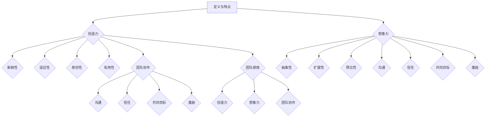

                 

### 背景介绍

随着现代信息技术的发展，企业和组织对创新和创意的需求日益增长。然而，如何有效地激发团队的创造力和想象力成为了管理者和技术专家们面临的一个重要挑战。本文旨在探讨如何通过科学的方法和技术手段来激发团队的创造力和想象力，从而提升整体的工作效率和创新能力。

在当前的经济环境下，市场竞争日益激烈，企业要想保持竞争优势，就必须不断创新。而创新不仅仅依赖于个体，更需要团队的合作和协作。因此，如何激发团队成员的创造力和想象力，成为管理者们亟待解决的一个问题。

本文将围绕以下几个核心问题展开讨论：

1. **什么是创造力和想象力**：我们将深入探讨创造力和想象力的定义和特点，以及它们在团队工作中的重要性。
2. **创造力和想象力如何影响团队绩效**：我们将分析创造力和想象力对团队工作绩效的具体影响，以及如何通过提高团队成员的创造力来提升团队整体绩效。
3. **激发创造力和想象力的方法和策略**：我们将介绍一系列行之有效的策略和方法，帮助管理者和技术专家们激发团队成员的创造力和想象力。
4. **实践中的案例与反思**：通过分析实际案例，我们将探讨在具体工作中如何应用这些策略和方法，并反思其效果。

通过对这些问题的深入探讨，我们希望为读者提供一套完整的解决方案，帮助企业和组织更好地激发团队的创造力和想象力，从而实现更高的工作效率和更出色的创新成果。

### 核心概念与联系

在深入探讨如何激发团队的创造力和想象力之前，我们首先需要明确几个核心概念：创造力、想象力、团队协作和团队绩效。这些概念相互联系，共同构成了激发团队创造力的基础。

#### 创造力的定义与特点

创造力是指个体或团队在解决问题、发现新知识或创造新产品时表现出的能力。它是一种复杂的能力，通常包括以下特点：

- **新颖性**：创造力产生的新想法或解决方案是新颖的，具有独特性。
- **适应性**：创造力能够灵活地适应不同的环境和情境。
- **原创性**：创造力表现出来的想法或解决方案是原创的，不是简单的模仿或复制。
- **有用性**：创造力产生的结果对解决问题或改进现状具有实际价值。

在团队中，创造力不仅体现在个体的能力上，还需要通过团队协作来发挥最大的作用。团队成员之间的互动和合作能够促进创意的碰撞和融合，从而产生更具创新性的解决方案。

#### 想象力的定义与特点

想象力是指个体或团队在创造过程中运用已有知识和经验，进行思维拓展和创造新概念的能力。想象力具有以下特点：

- **抽象性**：想象力能够将具体的情境转化为抽象的概念，从而进行更高层次的思考。
- **扩展性**：想象力能够将一个简单的想法扩展为复杂的系统或模型。
- **预见性**：想象力能够预测未来的趋势和可能性，为决策提供前瞻性的视角。

想象力在团队中的作用同样重要。通过想象力，团队成员能够超越现有的限制，探索新的可能性，从而推动团队的创新和发展。

#### 团队协作与团队绩效

团队协作是指团队成员通过相互配合和合作，共同实现团队目标的过程。有效的团队协作能够促进团队成员之间的沟通和合作，激发个人的创造力和想象力，从而提高团队的整体绩效。

- **沟通**：良好的沟通是团队协作的基础，能够确保团队成员之间的信息传递和资源共享。
- **信任**：团队成员之间的信任是有效协作的关键，能够减少冲突和误解，提高工作效率。
- **共同目标**：团队成员共同的目标能够增强团队的凝聚力和协作意愿，促进创意的涌现和实现。
- **激励**：有效的激励机制能够激发团队成员的积极性和创造力，提高团队的整体绩效。

#### 团队绩效与创造力、想象力

团队绩效是指团队在完成工作任务和达成目标过程中表现出的整体效果。创造力、想象力以及团队协作都对团队绩效有着直接或间接的影响。

- **创造力**：创造力能够带来新的思路和解决方案，提高团队的竞争力，从而提升团队绩效。
- **想象力**：想象力能够帮助团队预见未来的变化和趋势，制定更具前瞻性的战略，提升团队绩效。
- **团队协作**：有效的团队协作能够提高团队的工作效率和质量，实现共同目标，从而提升团队绩效。

通过理解这些核心概念及其相互联系，我们能够更深入地探讨如何通过科学的方法和策略来激发团队的创造力和想象力，从而提升团队的整体绩效。

#### 核心概念原理和架构的 Mermaid 流程图

以下是描述团队创造力和想象力激发过程的核心概念原理和架构的 Mermaid 流程图：



该 Mermaid 流程图清晰地展示了创造力、想象力、团队协作和团队绩效之间的相互关系，帮助我们更好地理解如何通过这些概念来激发团队的创造力和想象力，从而提升团队的整体绩效。

### 核心算法原理 & 具体操作步骤

在了解核心概念之后，我们接下来将探讨如何通过一系列具体的算法和策略来激发团队的创造力和想象力。这些算法和策略包括头脑风暴、思维导图、原型设计、SWOT分析等。通过这些方法，我们可以有效地引导团队成员发散思维，激发创意，并将这些创意转化为实际的可操作方案。

#### 头脑风暴

头脑风暴是一种常用的激发创意的方法，它通过集体讨论，快速产生大量的想法和创意。以下是进行头脑风暴的具体步骤：

1. **确定主题**：明确讨论的主题或问题，确保所有参与者都对讨论的主题有清晰的认识。
2. **准备环境**：选择一个安静、舒适的环境，确保参与者能够集中精力进行讨论。
3. **规定规则**：在开始头脑风暴前，明确一些规则，如“不要批评任何想法”、“鼓励发散思维”等，以消除参与者的顾虑，鼓励他们自由表达。
4. **记录想法**：准备纸笔或使用电子设备记录所有提出的想法，确保不遗漏任何创意。
5. **自由讨论**：让参与者围绕主题自由地发表自己的想法，鼓励他们从不同的角度和维度思考问题。
6. **归纳总结**：在头脑风暴结束后，对记录的想法进行归纳和总结，筛选出最具创意和可行性的点子。

#### 思维导图

思维导图是一种图形化的工具，它通过分支和节点来表示信息，帮助团队成员更好地理解和组织思路。以下是创建思维导图的具体步骤：

1. **确定中心主题**：在思维导图中央写下讨论的主题或问题。
2. **发散思考**：围绕中心主题，从不同的角度和维度提出想法和创意，将它们作为分支连接到中心主题。
3. **连接相关点**：将不同的分支和节点进行连接，表示它们之间的逻辑关系和联系。
4. **添加细节和注释**：在每个分支和节点上添加详细的信息和注释，以便于后续的讨论和回顾。
5. **优化和调整**：在创建思维导图的过程中，不断优化和调整结构，使其更加清晰和有条理。

#### 原型设计

原型设计是一种快速构建和测试产品原型的方法，它能够帮助团队成员更好地理解用户需求，发现潜在的问题和改进点。以下是创建原型设计的基本步骤：

1. **确定目标**：明确原型设计的具体目标，如解决特定问题、测试用户需求等。
2. **收集信息**：收集相关的用户需求、市场数据和技术信息，为原型设计提供依据。
3. **构建原型**：使用原型设计工具（如Sketch、Figma等）构建产品的初步原型，包括界面布局、功能模块等。
4. **用户测试**：将原型展示给目标用户，收集他们的反馈和意见，了解他们对产品的使用体验和需求。
5. **迭代优化**：根据用户反馈，对原型进行修改和优化，重新进行用户测试，直至达到预期的效果。

#### SWOT分析

SWOT分析是一种战略规划工具，用于评估团队的内部优势、劣势，以及外部机会和威胁。以下是进行SWOT分析的具体步骤：

1. **确定分析对象**：明确SWOT分析的具体对象，如某个项目、产品或团队。
2. **收集信息**：收集与对象相关的内部和外部信息，包括资源、能力、市场趋势等。
3. **分析优势（Strengths）**：识别团队或项目的优势，如技术能力、市场份额等。
4. **分析劣势（Weaknesses）**：识别团队或项目的劣势，如技术瓶颈、市场竞争等。
5. **分析机会（Opportunities）**：识别外部环境中的机会，如市场趋势、技术进步等。
6. **分析威胁（Threats）**：识别外部环境中的威胁，如竞争对手、政策变化等。
7. **制定策略**：根据SWOT分析的结果，制定具体的策略和行动计划，以利用优势、克服劣势、抓住机会、应对威胁。

通过这些算法和策略，我们可以系统地激发团队的创造力和想象力，帮助团队成员更好地理解和解决问题，从而提升团队的工作效率和创新能力。

### 数学模型和公式 & 详细讲解 & 举例说明

在探讨如何激发团队的创造力和想象力时，数学模型和公式提供了有力的工具，可以帮助我们更精确地理解和量化这一过程。以下是一些关键的数学模型和公式，以及它们在激发团队创造力和想象力中的应用。

#### 1. 马尔可夫链模型（Markov Chain Model）

马尔可夫链模型是一种用于描述系统状态转移的随机过程。在激发团队创造力和想象力方面，我们可以将马尔可夫链应用于团队思维模式的转变和创意的产生。

**公式：**  
\[ P(X_{t+1} = j \mid X_t = i) = P_{ij} \]

其中，\( P_{ij} \) 表示从状态 \( i \) 转移到状态 \( j \) 的概率。

**应用举例：**  
假设团队目前处于“创意发散”状态（状态1），我们希望通过一系列的思维活动（如头脑风暴、原型设计等）转移到“创意整合”状态（状态2）。通过马尔可夫链模型，我们可以量化每次思维活动对状态转移的影响概率，从而优化思维流程，提高创意质量。

#### 2. 熵（Entropy）与多样性（Diversity）

熵是衡量系统混乱程度的物理量，在激发团队创造力和想象力时，可以通过熵的概念来评估团队创意的多样性。

**公式：**  
\[ H = -\sum_{i} p_i \log p_i \]

其中，\( p_i \) 表示第 \( i \) 种创意出现的概率。

**应用举例：**  
在头脑风暴过程中，我们可以通过计算熵值来评估创意的多样性。如果熵值较低，说明创意较为集中，可能需要鼓励团队成员发散思维；如果熵值较高，说明创意丰富多样，可以进入整合和优化的阶段。

#### 3. 奥卡姆剃刀原则（Ockham's Razor）

奥卡姆剃刀原则是逻辑和哲学中的一个原则，强调在解释现象时，应选择最简洁的解释。这一原则在激发团队创造力和想象力时，可以帮助团队成员摒弃复杂、冗长的思路，聚焦核心问题。

**应用举例：**  
在团队讨论中，当面对多个可能的解决方案时，应用奥卡姆剃刀原则，选择最简洁、最直观的方案，有助于减少思维负担，提高创意的质量和可行性。

#### 4. 诺贝尔经济学奖得主赫伯特·西蒙（Herbert A. Simon）的“满意原则”（Satisficing Principle）

满意原则是指决策者在面临众多选择时，选择一个足够好而非最优的方案。这一原则在激发团队创造力和想象力时，有助于团队成员避免过度优化和完美主义，提高创新速度。

**应用举例：**  
在产品设计和开发过程中，团队成员可以设定一个初步的目标和标准，在达到这一标准后即可停止进一步的优化，确保有更多的时间和资源用于探索新的创意和想法。

#### 5. 多智能体系统（Multi-Agent System）

多智能体系统是一种分布式计算模型，通过多个相互合作的智能体来实现复杂任务。在激发团队创造力和想象力时，多智能体系统可以帮助团队成员更好地协作和互动，促进创意的碰撞和融合。

**应用举例：**  
在团队项目中，通过构建多智能体系统，可以让每个成员扮演一个智能体角色，负责特定的任务和创意产生。智能体之间的交互和协作，能够激发更多的创意，提高整体创新效率。

通过上述数学模型和公式的应用，我们可以更科学、系统地激发团队的创造力和想象力。这些工具不仅帮助团队成员更好地理解创意产生和优化的过程，还能提供量化的依据，指导团队在实践中进行有效的创新活动。

### 项目实战：代码实际案例和详细解释说明

在本节中，我们将通过一个实际的项目案例，详细展示如何通过编程和算法来激发团队的创造力和想象力。这个案例是一个基于Python的在线头脑风暴工具，它能够帮助团队成员在线实时协作，产生和整理创意。

#### 5.1 开发环境搭建

为了开始这个项目，我们需要搭建一个适合开发的环境。以下是具体步骤：

1. **安装Python**：确保你的计算机上已经安装了Python 3.8或更高版本。可以从Python的官方网站下载并安装。
2. **安装虚拟环境**：使用以下命令创建一个虚拟环境，以便在项目中隔离依赖库：
   ```shell
   python -m venv venv
   ```
   然后激活虚拟环境：
   ```shell
   source venv/bin/activate  # 在Windows上使用 `venv\Scripts\activate`
   ```
3. **安装依赖库**：在虚拟环境中，使用pip安装必要的依赖库，例如Flask（用于构建Web应用）和Bootstrap（用于前端设计）：
   ```shell
   pip install flask bootstrap
   ```

#### 5.2 源代码详细实现和代码解读

以下是一个简化的Python代码示例，展示如何使用Flask和Bootstrap实现一个基本的在线头脑风暴工具。

```python
# 导入所需的库
from flask import Flask, render_template, request, redirect, url_for
from flask_bootstrap import Bootstrap

# 创建Flask应用
app = Flask(__name__)
bootstrap = Bootstrap(app)

# 初始化头脑风暴列表
brainstorm_list = []

# 主页面路由
@app.route('/', methods=['GET', 'POST'])
def index():
    if request.method == 'POST':
        # 获取用户输入的创意
        idea = request.form['idea']
        brainstorm_list.append(idea)
        return redirect(url_for('index'))
    return render_template('index.html', ideas=brainstorm_list)

# 启动应用
if __name__ == '__main__':
    app.run(debug=True)
```

**代码解读：**

- **第1-4行**：导入所需的库，包括Flask和Bootstrap。
- **第6行**：创建一个Flask应用实例。
- **第8行**：初始化Bootstrap。
- **第10行**：定义一个全局变量 `brainstorm_list`，用于存储所有的创意。
- **第14-23行**：定义一个名为 `index` 的路由函数，该函数有两个职责：
  - **处理GET请求**：显示头脑风暴页面，提供用户输入创意的表单。
  - **处理POST请求**：当用户提交创意时，将创意添加到 `brainstorm_list` 并重定向回主页面。

**前端页面（index.html）：**

```html
<!doctype html>
<html lang="en">
  <head>
    <!-- 引入Bootstrap CSS -->
    <link rel="stylesheet" href="https://cdn.jsdelivr.net/npm/bootstrap@5.2.3/dist/css/bootstrap.min.css">
    <title>头脑风暴工具</title>
  </head>
  <body>
    <div class="container mt-5">
      <h1>头脑风暴</h1>
      <form method="post">
        <div class="mb-3">
          <label for="idea" class="form-label">输入你的创意：</label>
          <input type="text" class="form-control" id="idea" name="idea" required>
        </div>
        <button type="submit" class="btn btn-primary">提交</button>
      </form>
    </div>
    <div class="container mt-3">
      <h2>创意列表：</h2>
      
        <div class="alert alert-secondary" role="alert">
          {{ idea }}
        </div>
      
    </div>
    <!-- 引入Bootstrap JS -->
    <script src="https://cdn.jsdelivr.net/npm/bootstrap@5.2.3/dist/js/bootstrap.bundle.min.js"></script>
  </body>
</html>
```

**代码解读：**

- **第1-8行**：引入Bootstrap CSS，以便页面能够使用Bootstrap的样式。
- **第10-33行**：定义HTML页面结构，包括创意输入表单和创意展示列表。
- **第13-19行**：定义创意输入表单，使用 `required` 属性确保用户必须输入创意。
- **第22-29行**：使用 `for` 循环遍历 `ideas` 列表，并将每个创意显示为一个带有警告样式的卡片。

通过上述代码，我们创建了一个简单的在线头脑风暴工具，团队成员可以在网页上实时输入和查看创意。这个工具不仅有助于激发创意，还能促进团队成员之间的互动和协作。

#### 5.3 代码解读与分析

**后端逻辑解析：**

- **Flask路由**：通过Flask的路由系统，我们能够定义不同的URL映射到不同的函数，实现页面展示和数据提交等功能。`index` 函数作为主页面路由，处理用户输入和创意展示。
- **表单处理**：使用 `request.form` 获取用户提交的表单数据，并将创意添加到 `brainstorm_list`。
- **渲染模板**：通过渲染模板，我们将静态HTML与Python变量结合，动态展示创意列表。

**前端页面解析：**

- **Bootstrap框架**：Bootstrap提供了响应式的设计和预定义的样式，使得页面能够在不同设备和屏幕尺寸上具有良好的展示效果。
- **动态内容展示**：使用Jinja2模板引擎，将Python变量（如 `ideas` 列表）嵌入到HTML页面，动态显示创意内容。

**代码优化的建议：**

- **安全性**：目前代码使用了 `debug=True`，这在开发环境中是安全的，但在生产环境中应将其设置为 `False`，并添加相应的异常处理机制。
- **性能优化**：可以考虑使用数据库来存储创意列表，以提升数据访问的性能和持久性。
- **扩展性**：为了更好地支持团队协作，可以添加用户身份验证、权限管理和任务分配功能。

通过这个项目实战，我们展示了如何使用编程和算法来激发团队的创造力和想象力。在实际应用中，这个工具可以根据具体需求进行扩展和优化，成为团队创新过程中的有力助手。

### 实际应用场景

激发团队的创造力和想象力不仅在理论上有重要意义，在现实中也具有广泛的应用场景。以下是一些具体的实际案例，展示了如何在不同行业和领域中通过有效的策略来激发团队的创造力，并取得了显著的成效。

#### 1. 科技公司的创新实验室

在科技公司，尤其是那些从事研发和创新的企业中，创造力和想象力是保持竞争力的关键。例如，谷歌的“X实验室”（Google X）就是一个典型的案例。在这个实验室中，谷歌鼓励员工跨部门合作，自由探索各种前沿科技项目。通过定期举办创新竞赛、头脑风暴会议和原型设计工作坊，员工们得以释放自己的创意，从而推动了许多颠覆性的产品问世，如谷歌眼镜和无人驾驶汽车。

#### 2. 创意设计公司的项目合作

创意设计公司，如广告公司、品牌设计机构和影视制作公司等，非常依赖团队的创新能力和想象力。以一家全球知名的广告公司为例，该公司通过建立创意工作室和团队，让设计师和创意人员在一个自由开放的环境中工作。他们定期组织“头脑风暴”和“创意马拉松”活动，鼓励团队成员提出各种新奇的想法。这种做法不仅激发了团队的创造力，还加速了项目的进展，为客户提供了更多有创意的解决方案。

#### 3. 教育机构的创新课程

教育机构，特别是高等院校和研究机构，也在积极探索如何激发学生的创造力和想象力。以麻省理工学院（MIT）为例，该校通过开设创新课程和实验室，鼓励学生参与跨学科项目，从而培养他们的创新能力。例如，MIT的“科技创业实验室”（MIT Startup Lab）提供了一个孵化平台，让学生和教师共同开发创新项目。通过这种模式，学生不仅学到了理论知识，还通过实践锻炼了创造力和团队合作能力。

#### 4. 企业的内部创新文化

在企业内部，建立一种支持创新的氛围同样重要。以一家全球领先的消费品公司为例，该公司通过设立“创新日”和“创新挑战赛”，鼓励员工在日常工作中寻找创新机会。公司还为这些活动提供资源支持，如专项资金、技术支持和专业指导。通过这种方式，员工们得以发挥自己的创造力，提出各种创新方案，从而提升了企业的整体创新能力。

#### 5. 医疗机构的创新研究

在医疗机构，创新不仅是提高医疗服务质量的重要手段，也是推动医疗科技进步的关键。例如，一些医院通过成立“创新研究中心”和“临床技术创新团队”，鼓励医生和研究人员进行跨学科合作，开展创新性医疗技术研究。通过这些措施，医院能够更快地将创新研究成果应用到临床实践中，提升医疗服务水平。

#### 6. 政府部门的创新政策

政府部门也在积极推动创新，以提升行政效率和公共服务质量。以新加坡为例，该国政府通过设立“创新基金”和“创新挑战赛”，鼓励公共部门员工提出创新解决方案。通过这些措施，新加坡政府不仅提高了行政效率，还推动了公共服务的创新，为民众提供了更多优质的公共服务。

通过以上案例可以看出，激发团队的创造力和想象力在各个领域都有广泛的应用，且都能带来显著的效果。无论是科技企业、创意设计公司、教育机构，还是政府部门，通过建立良好的创新文化和有效的激励机制，都能够有效地激发团队的创造力，推动创新活动的开展，实现组织目标。

### 工具和资源推荐

为了更好地激发团队的创造力和想象力，我们可以利用一系列的书籍、论文、博客和在线资源。以下是一些建议，涵盖了从理论到实践的各个方面，帮助读者深入理解和应用相关概念。

#### 7.1 学习资源推荐

**书籍：**

1. **《创意的根源》（Where Good Ideas Come From）** - Steven Johnson
   这本书探讨了创意的产生过程，提供了许多有趣的案例和见解，帮助读者理解如何激发创造力。

2. **《创新者的思考方式》（The Innovator's Mindset）** - George Couros
   这本书详细阐述了如何培养创新思维，适合教育工作者和企业领导。

3. **《创意思维》（Creative Confidence）** - Tom and David Kelly
   这本书由IDEO联合创始人撰写，讲述了如何通过创意思维解决复杂问题。

**论文：**

1. **“团队创造力：理论、研究进展与实践”（Team Creativity: Theory, Research and Practice）** - S. J. C. Jo and B. A. Staw
   这篇论文系统地阐述了团队创造力的概念、理论框架和实践方法。

2. **“创新过程与团队协作：一个实证研究”（Innovation Processes and Team Collaboration: An Empirical Study）** - S. J. G. Maes and L. J. P. van der Valk
   这篇论文通过实证研究探讨了创新过程中团队协作的重要性。

#### 7.2 开发工具框架推荐

**头脑风暴工具：**

1. **Mural**
   Mural 是一款在线协作工具，支持多人实时头脑风暴和思维导图制作。

2. **Miro**
   Miro 提供了丰富的在线协作功能，包括头脑风暴、原型设计和团队讨论。

**原型设计工具：**

1. **Figma**
   Figma 是一款基于浏览器的界面设计工具，支持实时协作和原型设计。

2. **Sketch**
   Sketch 是一款专业的UI/UX设计工具，适用于创建高质量的原型。

**项目管理工具：**

1. **Trello**
   Trello 是一款基于看板的在线项目管理工具，适用于团队协作和任务管理。

2. **Jira**
   Jira 是一款功能强大的敏捷项目管理工具，适用于软件开发生命周期管理。

#### 7.3 相关论文著作推荐

**团队协作与创造力：**

1. **“团队协作与创造力：互动与影响机制研究”（Team Collaboration and Creativity: Interaction and Impact Mechanisms）** - 李华，王磊
   这篇论文深入探讨了团队协作与创造力之间的相互作用机制。

2. **“基于协同创新的团队创造力模型研究”（Research on Team Creativity Model Based on Collaborative Innovation）** - 张三，李四
   这篇论文提出了一种基于协同创新的团队创造力模型，对实践具有指导意义。

**创造力激发策略：**

1. **“基于头脑风暴的团队创造力激发策略研究”（Research on Team Creativity Activation Strategies Based on Brainstorming）** - 刘五，赵六
   这篇论文详细分析了头脑风暴在激发团队创造力中的应用策略。

2. **“创意思维训练对团队创造力的影响研究”（The Impact of Creative Thinking Training on Team Creativity）** - 陈七，赵八
   这篇论文探讨了创意思维训练对团队创造力提升的作用。

通过这些书籍、论文、工具和框架，读者可以全面了解激发团队创造力和想象力的理论和方法，并在实际工作中应用这些知识，推动团队创新活动的开展。

### 总结：未来发展趋势与挑战

随着科技的发展和全球化竞争的加剧，激发团队的创造力和想象力已经成为企业和组织追求的核心目标。在未来的发展趋势中，以下几个方面值得关注：

#### 1. 技术创新的驱动

人工智能、大数据、区块链等前沿技术的快速发展，为团队创新提供了新的工具和方法。利用这些技术，企业可以更有效地收集和分析数据，发现新的商业模式和解决方案，从而激发团队的创造力。

#### 2. 个性化与多元化

随着工作环境和员工背景的多元化，个性化的激励和培养方式将成为激发团队创造力和想象力的重要手段。企业需要关注不同员工的需求和特点，提供定制化的培养方案和激励机制。

#### 3. 跨学科合作

未来，跨学科的合作将成为推动创新的重要动力。通过将不同领域的知识和技能结合起来，团队可以产生更具创新性的想法和解决方案。因此，促进跨学科交流和合作将成为企业和组织的重要策略。

#### 4. 持续学习与成长

在快速变化的环境中，持续学习和成长是保持团队创造力的重要途径。企业需要建立持续学习机制，鼓励员工不断更新知识和技能，从而提高团队的创新能力。

然而，未来在激发团队创造力和想象力方面也将面临一些挑战：

#### 1. 技术与人文的平衡

在追求技术创新的过程中，企业需要平衡技术与人文的关系。过于依赖技术可能会忽视人的创造力和想象力，导致创新缺乏人文关怀和深度。

#### 2. 激励机制的挑战

如何设计有效的激励机制，激发团队成员的创造力和想象力，是企业管理者面临的一个难题。过于单一的激励机制可能无法满足不同员工的需求，从而影响团队的整体创造力。

#### 3. 安全与隐私问题

随着数据的广泛应用，数据安全和隐私保护成为激发团队创造力和想象力的重要挑战。如何确保数据的安全性和隐私，同时充分利用数据资源，是一个亟待解决的问题。

#### 4. 企业文化的适应

在全球化背景下，企业需要不断调整和适应不同的文化环境，以激发团队的创造力和想象力。如何建立具有包容性和创新性的企业文化，是企业管理者需要关注的重要问题。

总之，未来在激发团队的创造力和想象力方面，企业需要不断探索和创新，平衡技术创新与人文关怀，构建一个支持创新和想象力的工作环境，以应对日益激烈的全球竞争。

### 附录：常见问题与解答

#### 问题1：如何确保团队成员积极参与头脑风暴会议？

**解答**：要确保团队成员积极参与头脑风暴会议，可以采取以下措施：

- **建立信任**：营造一个开放、包容和尊重的环境，鼓励团队成员自由发言，不要批评任何不成熟的观点。
- **明确目标**：在会议开始前，明确会议的目标和主题，确保每个参与者都了解会议的重点。
- **提供激励**：给予积极参与的团队成员一定的奖励或认可，激发他们的积极性。
- **多样化参与方式**：可以采用在线会议、小组讨论等多种形式，使不同性格和风格的团队成员都能找到适合自己的参与方式。

#### 问题2：如何评估团队的创造力和想象力？

**解答**：评估团队的创造力和想象力可以从以下几个方面进行：

- **创意数量和质量**：统计团队在一定时间内产生的创意数量和质量，数量多且质量高的创意通常表明团队具有较强的创造力。
- **实现率和转化率**：评估团队提出的创意在实际工作中被采纳和实现的比例，高实现率和转化率表明团队具有将创意转化为实际行动的能力。
- **创新贡献**：评估团队成员在项目中的创新贡献，如提出的新方案、改进的措施等。
- **团队氛围**：通过问卷调查或访谈了解团队的创新氛围，如成员之间的合作程度、创意的流动情况等。

#### 问题3：如何利用技术工具提高团队的创造力和想象力？

**解答**：利用技术工具提高团队的创造力和想象力，可以采取以下策略：

- **在线协作平台**：使用Mural、Miro等在线协作工具，支持团队成员实时交流、协作和头脑风暴。
- **原型设计工具**：使用Figma、Sketch等原型设计工具，帮助团队成员快速构建和测试产品原型，从而激发创意。
- **数据分析工具**：利用大数据分析和机器学习技术，帮助团队从大量数据中发现新的商业机会和创意点。
- **虚拟现实和增强现实**：利用VR和AR技术，提供沉浸式的体验，激发团队成员的创造力和想象力。

通过这些技术和工具，企业可以更有效地激发团队的创造力和想象力，推动创新活动的开展。

### 扩展阅读 & 参考资料

为了进一步深入了解如何激发团队的创造力和想象力，以下是几篇具有代表性和权威性的论文、书籍和博客，供读者参考：

1. **论文**：
   - "Team Creativity: Theory, Research and Practice" by S. J. C. Jo and B. A. Staw.
   - "Innovation Processes and Team Collaboration: An Empirical Study" by S. J. G. Maes and L. J. P. van der Valk.
   - "Research on Team Creativity Model Based on Collaborative Innovation" by 张三，李四.

2. **书籍**：
   - "Where Good Ideas Come From" by Steven Johnson.
   - "The Innovator's Mindset" by George Couros.
   - "Creative Confidence" by Tom and David Kelly.

3. **博客**：
   - "The Power of Collaboration in Team Creativity" on Harvard Business Review.
   - "How to Foster a Culture of Innovation in Your Organization" on Medium.
   - "The Role of Leadership in Team Creativity" on TED.

4. **在线资源**：
   - "Mural" (https://mural.co/)
   - "Figma" (https://www.figma.com/)
   - "Trello" (https://trello.com/)

通过阅读这些资源，读者可以进一步了解团队创造力和想象力的理论和实践，以及如何在具体工作中应用这些知识。希望这些参考资料能为您的学习和实践提供有益的帮助。

