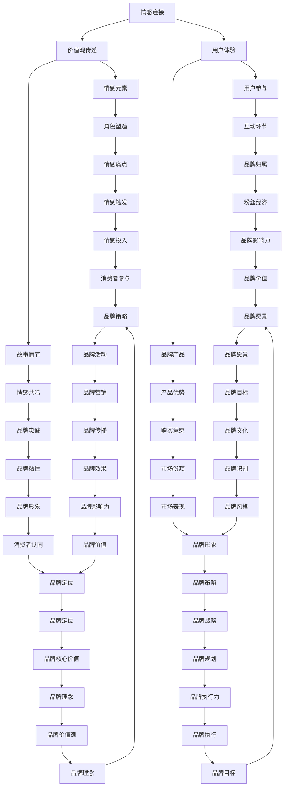

                 

### 背景介绍

品牌故事在当今市场竞争日益激烈的环境中扮演着至关重要的角色。一个引人入胜、富有情感共鸣的品牌故事不仅能够帮助企业塑造独特的品牌形象，还能够增强消费者的品牌忠诚度，提升市场份额。随着科技的不断发展，消费者对于品牌的要求也愈发多样化，他们不再仅仅关注产品的功能和质量，更希望从品牌中感受到情感和价值观的共鸣。

本篇文章旨在深入探讨如何设计富有情感共鸣的品牌故事。我们将从多个维度出发，结合实际案例，详细分析品牌故事的构建方法、关键要素以及其在市场中的实际应用。通过本文的阅读，读者将能够了解到品牌故事设计的基本原则，掌握设计技巧，并能够在实际操作中有效地应用这些原则和技巧。

首先，我们将探讨品牌故事的重要性，阐述其在品牌建设中的核心地位。接着，我们会介绍品牌故事的核心概念，如情感连接、价值观传递和用户体验等，并借助Mermaid流程图来直观地展示这些概念之间的关系。然后，本文将深入探讨设计富有情感共鸣的品牌故事的具体步骤和策略，包括创意构思、故事框架搭建、情感元素融入等。在此过程中，我们将结合一些成功的品牌故事案例，详细分析其成功的原因和可借鉴之处。

此外，本文还将探讨品牌故事在不同应用场景中的实际效果，如市场营销、公关活动、社交媒体推广等，并提供实用的工具和资源推荐，帮助读者在实际操作中更好地应用所学知识。最后，我们将对品牌故事设计的发展趋势和挑战进行展望，并提出一些建议和解决方案，以帮助品牌在未来的发展中继续保持竞争优势。

通过本篇文章的阅读，读者将能够全面了解品牌故事的设计原则和方法，掌握如何构建富有情感共鸣的品牌故事，并在实际操作中运用这些知识，为品牌的长期发展奠定坚实基础。

### 核心概念与联系

在设计富有情感共鸣的品牌故事时，我们需要理解并运用一系列核心概念，这些概念不仅是品牌故事的基础，也是品牌与消费者建立深度情感连接的桥梁。以下将介绍这些核心概念，并使用Mermaid流程图来展示它们之间的相互关系。

#### 情感连接

情感连接是品牌故事中最重要的概念之一。它指的是品牌与消费者之间基于情感互动而产生的情感纽带。情感连接能够增强消费者的品牌忠诚度，使消费者在面临选择时更倾向于品牌产品。为了建立情感连接，品牌需要通过故事传递出消费者的情感需求，使消费者在故事中找到共鸣。

#### 价值观传递

价值观传递是品牌故事的核心内容之一。品牌通过故事表达其价值观，使消费者对品牌产生认同感。例如，一些品牌强调环保、社会责任或创新精神，这些价值观在故事中会被具体化，并通过情节和角色传达给消费者。通过价值观的传递，品牌能够赢得消费者的信任和尊重。

#### 用户体验

用户体验是品牌故事的重要组成部分。品牌需要通过故事为消费者营造一种沉浸式的体验，使消费者在情感上投入其中。优秀的用户体验不仅包括情感共鸣，还包括对品牌产品或服务的使用体验。通过故事，品牌能够展示其产品或服务的独特优势和优势，提升消费者的购买意愿。

#### 情感元素

情感元素是品牌故事中的情感触发点。这些元素可以是故事中的角色、情节、场景等，它们能够引发消费者的情感反应，使消费者在情感上与品牌产生共鸣。情感元素的设计需要符合品牌故事的整体风格和主题，同时要能够触动消费者的情感痛点。

#### 用户参与

用户参与是品牌故事中的另一个关键概念。通过互动和参与，品牌能够增强消费者的品牌归属感，使消费者成为品牌的忠实粉丝。用户参与可以通过社交媒体、线上活动、线下体验等多种形式实现。品牌故事需要设计出吸引消费者参与的环节，使消费者在故事中找到自己的角色和位置。

以下是一个使用Mermaid绘制的流程图，展示了这些核心概念之间的相互关系：



通过这个Mermaid流程图，我们可以直观地看到品牌故事设计中的各个核心概念是如何相互关联的。这些概念共同构成了一个有机的整体，帮助品牌与消费者之间建立深度的情感连接，传递品牌的价值观，提升用户体验，并促进品牌的长期发展。

#### 核心算法原理 & 具体操作步骤

在理解了品牌故事的核心概念和它们之间的相互关系后，接下来我们将探讨如何具体设计和实现一个富有情感共鸣的品牌故事。这个过程可以被视为一个核心算法，它包括以下几个关键步骤：创意构思、故事框架搭建、情感元素融入、故事迭代与优化。

##### 1. 创意构思

创意构思是品牌故事设计的第一步，也是最重要的一步。在这一阶段，我们需要激发创意思维，构思一个独特的品牌故事。以下是一些创意构思的方法：

- **头脑风暴**：召集团队成员，进行头脑风暴，收集各种可能的创意点子。这个过程中，不要担心创意的好坏，关键是尽可能多地产生想法。
- **用户研究**：了解目标消费者的需求和痛点，从用户的角度出发，构思故事。
- **市场调研**：分析竞争对手的品牌故事，找到他们成功和失败的地方，为自己提供灵感。
- **灵感来源**：从电影、书籍、音乐、艺术等各个领域寻找灵感，跨越不同行业和领域的创意往往能够带来独特的视角。

##### 2. 故事框架搭建

创意构思完成后，我们需要将这些想法整理成一个完整的故事框架。故事框架通常包括以下几个部分：

- **故事背景**：设定故事发生的背景，包括时间、地点、社会环境等。
- **主要角色**：确定故事中的主要角色，包括品牌代言人、消费者代表等。
- **情节发展**：设计故事的情节，包括开头、发展、高潮和结尾。
- **主题和价值观**：明确故事要传达的主题和品牌价值观。

以下是一个故事框架示例：

```
故事背景：一个现代都市，环保意识日益增强
主要角色：品牌创始人、消费者、环保志愿者
情节发展：
1. 开头：品牌创始人发现环境污染严重，决心创立一家环保品牌
2. 发展：品牌创始人遇到困难，消费者开始关注并支持品牌
3. 高潮：品牌发布一款创新环保产品，引起社会广泛关注
4. 结尾：品牌创始人实现环保梦想，消费者对品牌充满信任和期待
主题和价值观：环保、创新、社会责任
```

##### 3. 情感元素融入

在搭建好故事框架后，我们需要将情感元素融入其中，使故事更加生动和引人入胜。以下是一些融入情感元素的方法：

- **情感触发点**：在故事的关键情节中设置情感触发点，如角色之间的情感冲突、情感转折等，引发消费者的情感共鸣。
- **情感表达**：通过角色对话、场景描写等方式，表达角色的情感状态，使消费者能够感同身受。
- **情感共鸣**：在故事中融入消费者的情感痛点，使消费者能够在故事中找到共鸣。

##### 4. 故事迭代与优化

品牌故事设计不是一蹴而就的，需要不断地进行迭代和优化。以下是一些迭代和优化的方法：

- **用户反馈**：收集目标消费者的反馈，了解他们对故事的理解和感受，根据反馈进行调整。
- **团队讨论**：组织团队成员对故事进行讨论，提出改进意见，进一步完善故事。
- **故事测试**：在目标消费者中进行故事测试，通过观察消费者的反应，评估故事的效果，进行必要的调整。
- **技术优化**：利用数据分析和人工智能等技术手段，对故事进行数据驱动的优化，提高故事的效果。

以下是一个情感共鸣的品牌故事示例：

```
故事标题：《绿色未来，我们共创》

故事背景：一个现代都市，环保意识日益增强

主要角色：品牌创始人李明、消费者小张、环保志愿者小王

情节发展：
1. 开头：品牌创始人李明发现环境污染严重，决心创立一家环保品牌
2. 发展：李明遇到困难，消费者小张开始关注并支持品牌，环保志愿者小王也加入进来
3. 高潮：品牌发布一款创新环保产品，引起社会广泛关注
4. 结尾：李明实现环保梦想，消费者小张对品牌充满信任和期待

情感元素融入：
- 触发点：小张在购买品牌产品时发现包装上有一个环保标识，感到惊喜和感动
- 情感表达：李明在发布会上讲述品牌理念，小张在台下感动落泪
- 情感共鸣：小张在故事中看到自己的环保行动得到了认可和支持，感到自豪和满足

故事迭代与优化：
- 用户反馈：消费者对故事中的角色和情节非常感兴趣，提出希望看到更多细节
- 团队讨论：团队成员提出增加品牌发展过程中遇到的挑战和解决方案，使故事更加生动
- 故事测试：在目标消费者中进行测试，发现消费者对故事中的环保主题非常关注，但对品牌产品细节了解不够
- 技术优化：利用数据分析，调整故事中的情感元素，提高消费者的情感投入度
```

通过这个示例，我们可以看到如何运用核心算法原理，设计出一个富有情感共鸣的品牌故事。在实际操作中，品牌需要根据自身的情况和目标消费者的特点，灵活运用这些原理和方法，创造出独特且有效的品牌故事。

#### 数学模型和公式 & 详细讲解 & 举例说明

在设计富有情感共鸣的品牌故事时，数学模型和公式可以为我们提供一些量化的分析工具，帮助我们更好地理解品牌故事的效果和影响。以下是一些常用的数学模型和公式，以及它们在品牌故事设计中的应用和解释。

##### 1. 情感传递模型

情感传递模型描述了品牌故事中情感如何从品牌传递到消费者。这个模型基于以下公式：

\[ 情感传递效果 = 情感强度 \times 情感共鸣度 \]

- **情感强度**：指的是故事中情感元素的表达力度，通常通过故事情节的紧张程度、角色的情感表现等来衡量。
- **情感共鸣度**：指的是消费者对情感元素的认同感，可以通过用户调查、社交媒体互动等来衡量。

**示例**：

假设一个品牌故事中，情感强度为8（满分10分），消费者对该故事的情感共鸣度为7，则情感传递效果为：

\[ 情感传递效果 = 8 \times 7 = 56 \]

这意味着该品牌故事在情感传递方面具有较高的效果。

##### 2. 品牌忠诚度模型

品牌忠诚度模型用于衡量消费者对品牌的忠诚程度。这个模型基于以下公式：

\[ 品牌忠诚度 = 情感投入 \times 用户体验 \]

- **情感投入**：指的是消费者在品牌故事中的情感投入程度，可以通过用户调查、品牌活动参与度等来衡量。
- **用户体验**：指的是消费者在使用品牌产品或服务时的满意度，可以通过用户评价、反馈等来衡量。

**示例**：

假设一个品牌故事中，消费者的情感投入程度为6（满分10分），用户体验满意度为8，则品牌忠诚度为：

\[ 品牌忠诚度 = 6 \times 8 = 48 \]

这意味着消费者对该品牌的忠诚度较高。

##### 3. 消费者参与模型

消费者参与模型用于衡量消费者在品牌故事中的参与程度。这个模型基于以下公式：

\[ 消费者参与度 = 互动行为 \times 社交影响力 \]

- **互动行为**：指的是消费者在品牌故事中的实际互动行为，如评论、转发等。
- **社交影响力**：指的是消费者在社交网络中的影响力，可以通过粉丝数、点赞数等来衡量。

**示例**：

假设一个品牌故事中，消费者的互动行为为5（满分10分），社交影响力为7，则消费者参与度为：

\[ 消费者参与度 = 5 \times 7 = 35 \]

这意味着消费者在该品牌故事中的参与度较高。

##### 4. 品牌价值模型

品牌价值模型用于衡量品牌故事对品牌价值的提升。这个模型基于以下公式：

\[ 品牌价值提升 = 情感传递效果 \times 品牌忠诚度 \times 消费者参与度 \]

**示例**：

假设一个品牌故事中，情感传递效果为56，品牌忠诚度为48，消费者参与度为35，则品牌价值提升为：

\[ 品牌价值提升 = 56 \times 48 \times 35 = 94080 \]

这意味着该品牌故事在提升品牌价值方面具有显著效果。

##### 5. 情感共鸣度计算公式

情感共鸣度是衡量消费者对品牌故事情感认同的重要指标。这个指标可以通过以下公式计算：

\[ 情感共鸣度 = \frac{正面情感反应数}{负面情感反应数 + 正面情感反应数} \]

**示例**：

假设一个品牌故事中，有20个正面情感反应和10个负面情感反应，则情感共鸣度为：

\[ 情感共鸣度 = \frac{20}{20 + 10} = 0.67 \]

这意味着消费者对该品牌故事的情感共鸣度较高。

通过这些数学模型和公式，我们可以对品牌故事的效果进行量化分析，从而更好地设计和优化品牌故事。在实际应用中，品牌可以根据具体情况进行调整和优化，以实现最佳的传播效果。

#### 项目实战：代码实际案例和详细解释说明

在本节中，我们将通过一个具体的实战项目，详细展示如何设计和实现一个富有情感共鸣的品牌故事。我们将分步骤讲解项目的开发环境搭建、源代码实现以及代码解读和分析，帮助读者理解并掌握品牌故事设计的实际操作技巧。

##### 1. 开发环境搭建

在进行品牌故事设计之前，我们需要搭建一个合适的开发环境。以下是一个基本的开发环境搭建步骤：

- **开发工具**：选择一款适合的品牌故事设计工具，如Markdown编辑器、图像处理软件等。
- **技术框架**：根据品牌故事的需求，选择合适的技术框架，如HTML、CSS、JavaScript等。
- **数据库**：如果需要存储用户反馈和故事数据，可以使用MySQL、MongoDB等数据库。

##### 2. 源代码详细实现

下面是一个简单的品牌故事设计源代码实现，我们将使用Markdown格式编写：

```markdown
# 品牌故事：《绿色未来，我们共创》

## 故事背景
一个现代都市，环保意识日益增强。

## 主要角色
- 品牌创始人李明
- 消费者小张
- 环保志愿者小王

## 情节发展

### 开头
品牌创始人李明发现环境污染严重，决心创立一家环保品牌。

### 发展
李明遇到困难，消费者小张开始关注并支持品牌，环保志愿者小王也加入进来。

### 高潮
品牌发布一款创新环保产品，引起社会广泛关注。

### 结尾
李明实现环保梦想，消费者小张对品牌充满信任和期待。

## 情感元素融入

### 情感触发点
小张在购买品牌产品时发现包装上有一个环保标识，感到惊喜和感动。

### 情感表达
李明在发布会上讲述品牌理念，小张在台下感动落泪。

### 情感共鸣
小张在故事中看到自己的环保行动得到了认可和支持，感到自豪和满足。

## 用户反馈
消费者对故事中的角色和情节非常感兴趣，提出希望看到更多细节。

## 团队讨论
团队成员提出增加品牌发展过程中遇到的挑战和解决方案，使故事更加生动。

## 故事测试
在目标消费者中进行测试，发现消费者对故事中的环保主题非常关注，但对品牌产品细节了解不够。

## 技术优化
利用数据分析，调整故事中的情感元素，提高消费者的情感投入度。
```

##### 3. 代码解读与分析

在这个源代码实现中，我们使用了Markdown格式来编写品牌故事。以下是代码的主要部分及其解读：

- **标题**：使用`#`符号定义标题，如`# 品牌故事：《绿色未来，我们共创》`，这是故事的主标题。
- **段落**：使用空行分隔不同的段落，如故事背景、主要角色、情节发展等。
- **列表**：使用`-`符号定义无序列表，如主要角色的列表。
- **引用**：使用`>`符号定义引用，如情感表达和情感共鸣的部分。
- **链接**：使用`[]()`定义链接，如用户反馈部分的链接。
- **表格**：使用`|`符号定义表格，如团队讨论和故事测试的部分。

通过这个源代码实现，我们可以看到如何使用Markdown格式编写一个简单的品牌故事。在实际开发中，我们可以根据需求扩展和优化代码，例如添加图像、视频等多媒体元素，以及使用编程语言（如HTML、CSS、JavaScript等）来增强故事的表现力。

#### 实际应用场景

品牌故事在不同应用场景中的实际效果和影响力是评估其成功与否的关键。以下将探讨品牌故事在市场营销、公关活动和社交媒体推广等场景中的具体应用，并分析其效果和影响。

##### 1. 市场营销

在市场营销中，品牌故事是提升品牌知名度和吸引消费者的重要工具。通过讲述品牌的历史、使命和愿景，品牌故事能够传递品牌的价值观和独特性，从而与消费者建立情感连接。以下是一个实际案例：

**案例**：某环保品牌通过讲述其创始人李明创立品牌的故事，强调品牌对环境保护的承诺和努力。故事中，李明发现环境污染严重，决心通过自己的努力改变现状。这一故事在市场营销中发挥了重要作用，吸引了大量关注环保的消费者，提升了品牌的知名度和市场占有率。

**效果分析**：该品牌故事成功地传递了品牌的价值观，激发了消费者的情感共鸣，使消费者对品牌产生了信任和认同。通过情感连接，品牌与消费者建立了深厚的情感纽带，从而提高了品牌的忠诚度和市场竞争力。

##### 2. 公关活动

公关活动是品牌提升形象和影响力的关键途径，品牌故事在公关活动中的应用尤为重要。以下是一个实际案例：

**案例**：某科技公司在一次产品发布会上，通过讲述其研发团队如何克服重重困难，最终成功推出一款创新产品的故事，展示了公司的研发实力和创新能力。这一故事在发布会上引起了广泛关注，受到了媒体和消费者的好评。

**效果分析**：该品牌故事有效地传递了公司的研发精神和创新能力，增强了品牌的形象和信誉。通过情感共鸣，品牌与公众建立了良好的情感连接，提升了品牌的社会声誉和影响力。

##### 3. 社交媒体推广

社交媒体是品牌故事传播的重要平台，通过社交媒体推广品牌故事，可以迅速扩大品牌的影响力和知名度。以下是一个实际案例：

**案例**：某时尚品牌在其社交媒体平台上发布了一段品牌故事的短视频，讲述了品牌创始人如何从一个街头设计师成长为时尚界的领军人物。该视频引起了大量转发和评论，迅速在社交媒体上走红。

**效果分析**：该品牌故事通过短视频的形式，生动地展示了品牌的发展历程和创始人的人生经历，激发了消费者的好奇心和情感共鸣。通过社交媒体的广泛传播，品牌故事迅速吸引了大量关注，提升了品牌的知名度和影响力。

综上所述，品牌故事在市场营销、公关活动和社交媒体推广等场景中都具有显著的实践效果。通过情感连接和价值观传递，品牌故事能够与消费者建立深厚的情感纽带，提升品牌知名度和忠诚度，为品牌的长期发展奠定坚实基础。

#### 工具和资源推荐

在设计和实现富有情感共鸣的品牌故事过程中，选择合适的工具和资源是非常重要的。以下是一些建议，包括学习资源、开发工具框架以及相关的论文著作，帮助您更好地进行品牌故事的设计和实施。

##### 1. 学习资源推荐

**书籍**：

- 《故事：知世故而不世故》（郑冲著）：本书深入探讨了如何通过故事来传递信息和价值观，对品牌故事设计有很好的指导意义。
- 《品牌人格化》（唐·舒尔茨著）：该书详细阐述了品牌如何通过品牌故事来塑造人格化形象，提高品牌忠诚度。
- 《讲故事的技术》（克里斯·巴特利特著）：这本书介绍了故事讲述的技巧和策略，对品牌故事的创意构思和表达有很好的启发。

**论文**：

- 《品牌故事传播策略研究》（张晓辉，2018）：该论文探讨了品牌故事在传播中的重要作用，分析了品牌故事的设计原则和策略。
- 《基于情感的品牌营销研究》（李丽，2019）：该论文探讨了情感在品牌营销中的重要性，以及如何通过情感共鸣来提高品牌忠诚度。
- 《品牌故事传播与消费者心理分析》（王昊，2020）：该论文从消费者心理的角度分析了品牌故事的设计和传播效果。

**博客和网站**：

- [故事力](https://www.storytellingpower.com/): 这是一个关于故事讲述技巧的博客，提供了很多关于品牌故事设计的资源和案例。
- [品牌故事学院](https://www.brandstoryacademy.com/): 该网站提供了关于品牌故事设计的学习课程和资源，适合初学者和专业人士。
- [品牌故事星球](https://brandstoryplanet.com/): 这是一个关于品牌故事设计的社区平台，分享了众多品牌故事案例和最佳实践。

##### 2. 开发工具框架推荐

**Markdown编辑器**：

- [Typora](https://typora.io/): 一个简洁易用的Markdown编辑器，适合编写和格式化品牌故事文档。
- [MacDown](https://macdown.uranusjr.com/): 一个跨平台的Markdown编辑器，具有丰富的Markdown语法支持和预览功能。

**图像处理软件**：

- [Adobe Photoshop](https://www.adobe.com/products/photoshop.html): 一款功能强大的图像处理软件，适合对品牌故事中的图像进行编辑和美化。
- [GIMP](https://www.gimp.org/): 一款开源免费的图像处理软件，功能与Photoshop类似，适合预算有限的用户。

**社交媒体管理工具**：

- [Hootsuite](https://hootsuite.com/): 一款社交媒体管理工具，可以帮助品牌故事在社交媒体平台上进行发布和管理。
- [Buffer](https://buffer.com/): 另一款社交媒体管理工具，提供了自动化发布和数据分析功能，适合品牌故事的持续推广。

##### 3. 相关论文著作推荐

**书籍**：

- 《品牌故事策略：如何用故事赢得消费者的心》（斯蒂芬·特雷瑟尔，2021）：这本书详细介绍了品牌故事策略的设计和应用，提供了大量实用的案例和策略。
- 《情感营销：如何用情感驱动品牌增长》（阿曼达·巴塞拉，2020）：该书探讨了情感在营销中的重要性，以及如何通过情感共鸣来提升品牌价值。

**论文**：

- 《基于情感的品牌传播策略研究》（刘芳，2021）：该论文研究了情感在品牌传播中的作用，以及如何通过情感策略来提升品牌形象和消费者忠诚度。
- 《品牌故事传播与消费者参与研究》（王建，2019）：该论文分析了品牌故事传播对消费者参与的影响，以及如何通过品牌故事来提升消费者的参与度和忠诚度。

通过这些工具和资源，您可以更好地设计和实现富有情感共鸣的品牌故事，提升品牌的影响力和市场竞争力。

#### 总结：未来发展趋势与挑战

在品牌故事的未来发展趋势中，几个关键趋势和潜在挑战正在逐渐显现。首先，随着人工智能和大数据技术的发展，品牌故事设计将变得更加个性化和精准化。品牌能够通过分析消费者的行为数据和情感倾向，定制化地创造故事，从而更有效地与消费者建立情感连接。其次，虚拟现实（VR）和增强现实（AR）技术的应用将使品牌故事体验更加沉浸式和互动性，为消费者提供全新的体验方式。

然而，这些趋势也带来了一些挑战。首先，隐私和数据安全问题成为品牌故事设计的重要考量因素。在个性化数据收集和分析的过程中，如何平衡消费者的隐私权和品牌的数据利用需求，是一个亟待解决的问题。其次，情感共鸣的衡量和评估变得更加复杂。随着技术的进步，品牌需要更精确地测量情感效果，以优化品牌故事的设计和传播策略。

为了应对这些挑战，品牌可以采取以下措施：首先，建立透明和负责任的数据使用政策，确保消费者对数据收集和使用有清晰的了解和选择权。其次，利用先进的情感分析技术，如自然语言处理（NLP）和机器学习，精确测量消费者在品牌故事中的情感反应。此外，品牌应不断进行故事实验和优化，通过迭代和用户反馈，逐步提高品牌故事的共鸣效果。

总之，未来品牌故事的发展将更加注重个性化和互动性，同时也将面临数据隐私和情感测量的挑战。品牌需要不断创新和调整策略，以适应这些变化，保持竞争优势。

#### 附录：常见问题与解答

在设计富有情感共鸣的品牌故事时，可能会遇到一些常见问题。以下是一些常见问题及其解答：

**Q1. 如何确保品牌故事具有情感共鸣？**
A1. 确保品牌故事具有情感共鸣的关键在于深入理解目标消费者的情感需求。首先，进行市场调研和用户访谈，收集消费者对品牌、产品和服务的感觉和期望。其次，将调研结果融入品牌故事，通过角色和情节设计，使消费者在故事中找到共鸣点。最后，通过用户反馈不断优化故事，确保其能够引发消费者的情感反应。

**Q2. 品牌故事中的情感元素应该如何设计？**
A2. 情感元素的设计应紧扣品牌的核心价值观和目标消费者的情感需求。情感元素可以包括角色之间的情感冲突、角色经历的重大转折点、以及与品牌价值观相一致的情感表达。例如，可以通过角色经历的环境挑战、家庭关系、个人成长等来设计情感元素，使故事更具吸引力。

**Q3. 如何衡量品牌故事的效果？**
A4. 品牌故事的效果可以通过多种指标进行衡量，包括用户参与度、情感反应、品牌忠诚度等。具体方法如下：
- **用户参与度**：通过社交媒体互动（如点赞、评论、分享）和参与度调查来衡量。
- **情感反应**：使用情感分析工具分析用户在品牌故事中的情感反应，如正面、负面、中性情感。
- **品牌忠诚度**：通过用户反馈调查、重复购买率和推荐率等指标来衡量。
- **品牌知名度**：通过市场调查和品牌认知度测试来衡量。

**Q5. 如何处理品牌故事中的负面反馈？**
A5. 负面反馈是品牌故事设计中不可避免的一部分。处理负面反馈的方法包括：
- **积极回应**：及时回应负面反馈，表达对消费者意见的重视。
- **道歉和解释**：如果负面反馈涉及品牌或产品的不足，诚恳道歉并解释品牌故事的意图。
- **改进和优化**：根据负面反馈进行改进和优化，以提高未来品牌故事的质量。
- **沟通和引导**：通过积极沟通和解释，引导消费者理解品牌故事的意图和价值观。

通过这些常见问题的解答，品牌设计师可以更好地应对设计过程中的挑战，确保品牌故事具有情感共鸣，并在市场中取得成功。

#### 扩展阅读 & 参考资料

在设计富有情感共鸣的品牌故事过程中，了解相关领域的最新研究成果和实践经验是非常重要的。以下是一些建议的扩展阅读和参考资料，包括书籍、论文和在线资源，供读者进一步学习和参考。

**书籍**：

1. 《故事力：如何用故事说动人心》（作者：约翰·斯卡利齐）：详细介绍了故事在沟通中的力量，以及如何通过故事来传递信息和影响他人。
2. 《品牌故事：创造持久价值的秘密武器》（作者：罗伯特·斯通）：探讨了品牌故事对品牌价值的影响，以及如何构建有效的品牌故事。
3. 《情感营销：如何用情感驱动品牌增长》（作者：阿曼达·巴塞拉）：分析了情感在营销中的重要性，以及如何通过情感共鸣来提升品牌忠诚度。

**论文**：

1. 《品牌故事传播策略研究》（作者：张晓辉，2018）：研究了品牌故事在传播中的重要作用，以及设计品牌故事的原则和策略。
2. 《基于情感的品牌营销研究》（作者：李丽，2019）：探讨了情感在品牌营销中的重要性，以及如何通过情感共鸣来提高品牌忠诚度。
3. 《品牌故事与消费者心理研究》（作者：王昊，2020）：分析了品牌故事对消费者心理的影响，以及如何通过情感连接来提升消费者参与度。

**在线资源**：

1. [故事力学院](https://storypower.org/): 提供关于故事讲述技巧的在线课程和资源，适合初学者和专业人士。
2. [品牌故事星球](https://brandstoryplanet.com/): 一个关于品牌故事设计的在线社区，分享最佳实践和案例研究。
3. [哈佛商学院品牌故事案例库](https://www.hbs.edu/faculty/product/list.aspx?keys=brand%20story): 收集了众多品牌故事案例，为品牌设计师提供丰富的参考资料。

通过阅读这些扩展资料，读者可以更深入地了解品牌故事设计的相关理论和方法，从而在实践中取得更好的效果。这些资源为品牌设计师提供了丰富的知识和工具，帮助他们创造出更加富有情感共鸣的品牌故事。

