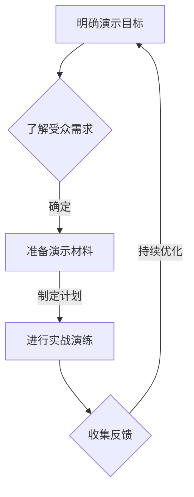

                 

# 如何设计富有说服力的产品演示

## 摘要

本文旨在探讨如何设计富有说服力的产品演示，通过分析产品演示的目的、受众和关键要素，提供一整套设计原则和实用技巧。文章首先介绍了产品演示的基本概念和重要性，然后详细阐述了设计富有说服力的产品演示的七个核心步骤，包括明确演示目标、了解受众需求、准备演示材料、制定演示计划、进行实战演练、收集反馈和持续优化。此外，文章还提供了工具和资源推荐，帮助读者更好地掌握产品演示设计的核心知识和技能。最后，文章总结了未来发展趋势与挑战，并提出了常见问题的解答。

## 1. 背景介绍

产品演示是产品营销和推广过程中至关重要的一环。它不仅仅是对产品的展示，更是一种与潜在客户建立联系、传递产品价值、激发购买欲望的有效手段。在当今竞争激烈的市场环境中，一款优秀的产品往往需要通过富有说服力的演示来脱颖而出，从而吸引更多用户的关注和兴趣。

为什么产品演示如此重要呢？首先，产品演示能够直观地展示产品的功能、特点和优势，让潜在客户更好地理解产品的价值和潜力。其次，通过产品演示，企业可以与客户建立互动，回答他们的疑问，消除他们的顾虑，从而增加成交的可能性。此外，产品演示还能帮助企业收集客户的反馈和建议，为产品优化和创新提供有力支持。

然而，设计一款富有说服力的产品演示并非易事。它需要考虑多个方面的因素，包括演示目标、受众需求、演示内容、演示形式和演示技巧等。本文将围绕这些关键要素，提供一整套设计原则和实用技巧，帮助读者设计和实施成功的产品演示。

## 2. 核心概念与联系

在设计富有说服力的产品演示之前，我们需要理解一些核心概念和它们之间的联系。以下是几个关键概念：

### 2.1 产品演示的目标

产品演示的目标通常包括以下几个方面：

- **传递产品价值**：向潜在客户展示产品的功能、特点和优势，让他们感受到产品的价值。
- **建立信任**：通过展示产品的可靠性和安全性，增强潜在客户对企业的信任。
- **激发购买欲望**：通过演示产品如何解决用户的问题或满足他们的需求，激发用户的购买欲望。

### 2.2 产品演示的受众

产品演示的受众可以分为以下几类：

- **潜在客户**：他们对产品感兴趣，但尚未做出购买决策。
- **现有客户**：他们已经购买产品，但可能对产品的某些功能或使用场景感兴趣。
- **合作伙伴和投资者**：他们关注产品的市场前景和商业潜力。

### 2.3 产品演示的关键要素

设计富有说服力的产品演示需要考虑以下几个关键要素：

- **演示内容**：包括产品功能、使用场景、优势、案例等。
- **演示形式**：如面对面演示、线上演示、视频演示等。
- **演示技巧**：如演讲技巧、互动技巧、演示工具的使用等。

### 2.4 产品演示的结构

产品演示通常包含以下几个部分：

- **开场白**：介绍演示的目的和议程，吸引观众的注意力。
- **产品介绍**：详细展示产品的功能、特点和优势。
- **互动环节**：与观众互动，回答问题，收集反馈。
- **总结与呼吁行动**：总结演示内容，强调产品价值，呼吁观众采取行动。

### 2.5 产品演示的评估

产品演示的效果需要通过以下指标进行评估：

- **观众参与度**：观众提问、互动、反馈的情况。
- **演示效果**：产品功能展示的完整性、准确性、直观性。
- **成交率**：观众转化为实际客户的情况。

### 2.6 Mermaid 流程图

以下是产品演示的核心概念和结构的 Mermaid 流程图：



通过这个流程图，我们可以清晰地看到产品演示的设计和实施过程。

## 3. 核心算法原理 & 具体操作步骤

### 3.1 明确演示目标

在设计产品演示之前，首先需要明确演示的目标。这包括：

- **产品价值传递**：明确演示需要展示产品的哪些功能和特点，以及如何让潜在客户感受到产品的价值。
- **建立信任**：确定如何通过演示展示产品的可靠性和安全性，增强潜在客户的信任。
- **激发购买欲望**：设定演示的目标是直接促进销售，还是引导客户进行更深入的探索。

### 3.2 了解受众需求

了解受众的需求是设计富有说服力的产品演示的关键。这包括：

- **受众背景**：分析受众的背景信息，如行业、职位、经验等，以确定他们可能关心的问题和需求。
- **受众关注点**：通过调查、访谈、用户反馈等方式，了解受众对产品的关注点和期望。
- **受众痛点**：确定产品如何解决受众的痛点，以便在演示中重点强调。

### 3.3 准备演示材料

准备演示材料是确保演示顺利进行的重要步骤。这包括：

- **演示文稿**：制作演示文稿，包括幻灯片、图片、图表等，以直观地展示产品功能和特点。
- **产品原型或模型**：如果可能，准备产品原型或模型，以更直观地展示产品的外观和功能。
- **演示工具**：选择合适的演示工具，如演示软件、视频播放器、投影仪等。

### 3.4 制定演示计划

制定演示计划是确保演示有序进行的关键。这包括：

- **演示议程**：确定演示的时间、地点、议程和参与人员。
- **演示步骤**：详细列出演示的每个步骤，包括开场白、产品介绍、互动环节、总结与呼吁行动等。
- **时间分配**：为每个演示步骤分配合适的时间，确保演示在规定时间内完成。

### 3.5 进行实战演练

进行实战演练是确保演示效果的关键。这包括：

- **内部演练**：组织内部人员对演示进行演练，检查演示的流畅性、内容的准确性以及互动环节的适应性。
- **模拟场景**：模拟实际演示的场景，如客户会议、展台展示等，以检验演示的效果。
- **反馈与调整**：根据演练结果，收集反馈并调整演示内容、形式和技巧。

### 3.6 收集反馈

收集反馈是改进演示的重要环节。这包括：

- **观众反馈**：在演示结束后，收集观众的反馈，了解他们对演示的满意度和建议。
- **数据分析**：分析观众的参与度、提问情况、成交率等数据，评估演示的效果。
- **反馈整理**：将收集到的反馈进行整理，确定需要改进的地方。

### 3.7 持续优化

持续优化是提升演示效果的关键。这包括：

- **定期回顾**：定期回顾演示的过程和结果，分析存在的问题和改进空间。
- **持续学习**：学习最新的演示技巧、工具和资源，不断提升自己的演示能力。
- **迭代优化**：根据反馈和数据分析，不断迭代和优化演示内容、形式和技巧。

## 4. 数学模型和公式 & 详细讲解 & 举例说明

在设计富有说服力的产品演示时，我们可以运用一些数学模型和公式来优化演示效果。以下是一个简单的示例：

### 4.1 演示效果评估模型

假设我们使用以下公式来评估演示效果：

\[ E = f(V, T, I) \]

其中，\( E \) 表示演示效果，\( V \) 表示产品价值传递，\( T \) 表示信任建立，\( I \) 表示互动效果。

### 4.2 演示效果评估公式

\[ E = 0.5V + 0.3T + 0.2I \]

其中，\( V \)、\( T \) 和 \( I \) 的取值范围均为 0 到 1，分别表示它们在整体演示效果中的权重。

### 4.3 详细讲解

这个模型的基本思想是将演示效果分解为三个关键因素：产品价值传递、信任建立和互动效果。通过调整这三个因素的权重，我们可以优化整体演示效果。

- **产品价值传递（V）**：这是演示的核心，决定了潜在客户对产品的兴趣和购买欲望。我们可以通过详细展示产品的功能、特点和优势来实现这一点。
- **信任建立（T）**：这是建立客户信任的关键，可以通过展示产品的可靠性、安全性和案例研究来实现。
- **互动效果（I）**：这是增强观众参与度和互动性的关键，可以通过提问、互动游戏、观众投票等方式实现。

### 4.4 举例说明

假设我们正在设计一个新产品演示，目标是让潜在客户感受到产品的价值，并建立信任。根据我们的目标，我们可以为这三个因素分配以下权重：

\[ V = 0.6, T = 0.3, I = 0.1 \]

根据这个权重分配，我们可以制定以下策略：

- **产品价值传递**：详细展示产品的核心功能、使用场景和优势，使用数据和案例研究来支持。
- **信任建立**：展示产品的可靠性、安全性和客户评价，通过视频和案例分析来增强信任。
- **互动效果**：通过问答环节和互动游戏来增强观众的参与度，收集反馈和建议。

通过这个示例，我们可以看到如何使用数学模型和公式来指导演示设计，从而提高演示效果。

## 5. 项目实战：代码实际案例和详细解释说明

### 5.1 开发环境搭建

为了更好地理解产品演示的设计与实施，我们将通过一个具体的代码案例来展示如何进行产品演示。首先，我们需要搭建一个基本的开发环境。以下是所需步骤：

1. **安装 Python 环境**：确保系统已经安装了 Python 3.8 或更高版本。
2. **安装相关库**：使用以下命令安装所需的库：
   ```bash
   pip install matplotlib numpy pandas
   ```

### 5.2 源代码详细实现和代码解读

以下是一个简单的 Python 脚本，用于生成并展示一个数据可视化的产品演示。脚本的核心功能是读取数据、进行数据分析，并使用 Matplotlib 绘制图表。

```python
import matplotlib.pyplot as plt
import numpy as np
import pandas as pd

# 5.2.1 加载数据
data = pd.read_csv('sales_data.csv')

# 5.2.2 数据预处理
# 筛选特定时间段的数据
data = data[data['Date'] >= '2022-01-01']

# 5.2.3 数据分析
# 计算每月的销售总额
monthly_sales = data.groupby(data['Date'].dt.strftime('%Y-%m'))['Amount'].sum().reset_index()

# 5.2.4 数据可视化
# 绘制销售趋势图
plt.figure(figsize=(10, 5))
plt.plot(monthly_sales['Date'], monthly_sales['Amount'])
plt.title('Monthly Sales Trend')
plt.xlabel('Date')
plt.ylabel('Sales Amount')
plt.xticks(rotation=45)
plt.grid(True)
plt.show()
```

### 5.3 代码解读与分析

1. **加载数据**：使用 `pandas` 库读取 CSV 文件中的销售数据。
2. **数据预处理**：筛选特定时间段的数据，确保分析的数据具有代表性。
3. **数据分析**：计算每月的销售总额，生成每月的销售趋势数据。
4. **数据可视化**：使用 `matplotlib` 库绘制销售趋势图，展示分析结果。

### 5.4 运行脚本并观察结果

执行上述脚本后，将弹出一个窗口，展示每月的销售总额趋势图。通过图表，我们可以直观地看到产品的销售趋势，分析不同月份的销售波动，从而为销售策略的制定提供依据。

### 5.5 代码优化与扩展

在实际的产品演示中，我们可能需要根据不同的需求进行代码的优化和扩展，例如：

- **交互式图表**：使用交互式可视化库，如 `Plotly`，提供更丰富的交互功能。
- **自定义指标**：根据用户需求，计算并展示更多的销售指标，如增长率、环比等。
- **多维度分析**：扩展数据源，支持多维度分析，如按产品类别、地区等。

通过这些扩展，我们可以使产品演示更加全面和深入，更好地满足潜在客户的需求。

## 6. 实际应用场景

产品演示在实际应用场景中具有广泛的应用，以下是几个典型的应用场景：

### 6.1 企业推广新产品

企业在推广新产品时，通过产品演示向潜在客户展示新产品的功能和优势，增强客户的购买意愿。例如，一家科技公司可以通过产品演示向潜在客户展示其最新的智能家居设备，如智能音箱、智能灯泡等。

### 6.2 项目投标

在项目投标过程中，通过产品演示展示项目方案的技术可行性、优势和价值，赢得投标机会。例如，一家软件公司可以通过产品演示展示其开发的项目管理系统，说明如何帮助客户提高项目管理效率。

### 6.3 投资者路演

企业在向投资者进行路演时，通过产品演示展示公司产品的市场潜力、商业模式和财务状况，增加投资者的信心和投资意愿。例如，一家初创公司可以通过产品演示向潜在投资者展示其创新的产品和服务，说明其盈利模式和增长潜力。

### 6.4 培训和研讨会

在培训和研讨会中，通过产品演示向参与者展示产品功能和使用方法，帮助他们更好地理解和掌握产品。例如，一家云计算公司可以通过产品演示向客户展示如何使用其云服务平台，提供详细的操作指导和案例分享。

### 6.5 网络营销

在互联网营销中，通过产品演示视频或直播展示产品，吸引潜在客户的关注和兴趣。例如，电商平台可以通过短视频或直播展示商品的详细功能和用户体验，提高转化率。

## 7. 工具和资源推荐

### 7.1 学习资源推荐

- **书籍**：
  - 《演讲的力量》（The Power of Presentation）- Christensen
  - 《展示与演讲技巧》（Presentation Skills Step by Step）- Alison
- **论文**：
  - 《Effective Presentation Techniques for Technology Products》（有效技术产品的演示技巧）- ACM
- **博客**：
  - [Presentation Zen](http://www.presentationzen.com/)
  - [The Brainy Business](https://thebrainybusiness.com/presentations/)
- **网站**：
  - [SlideShare](https://www.slideshare.net/)
  - [TED Talks](https://www.ted.com/talks)

### 7.2 开发工具框架推荐

- **演示工具**：
  - **Microsoft PowerPoint**
  - **Google Slides**
  - **Keynote**
- **数据可视化工具**：
  - **Tableau**
  - **Power BI**
  - **D3.js**
- **互动演示工具**：
  - **Prezi**
  - **Haiku Deck**
  - **Slides.com**

### 7.3 相关论文著作推荐

- **《产品演示的艺术》（The Art of Product Demonstration）》- Garcia
- **《如何设计有效的产品演示》（How to Design Effective Product Demonstrations）》- Johnson

## 8. 总结：未来发展趋势与挑战

随着技术的不断进步和市场的日益竞争，产品演示的设计和实施将面临新的发展趋势和挑战。

### 8.1 发展趋势

- **虚拟现实（VR）和增强现实（AR）的应用**：VR 和 AR 技术将使产品演示更加沉浸式和互动性，提高观众的参与度和体验。
- **人工智能（AI）的应用**：AI 技术将帮助产品演示更准确地分析受众需求，优化演示内容和形式。
- **数据驱动的决策**：通过大数据分析和机器学习，企业将能够更精准地评估产品演示的效果，不断优化和改进演示策略。

### 8.2 挑战

- **受众多样化的挑战**：随着市场的不断扩大，产品演示需要适应不同受众的需求，这要求企业具备更广泛的知识和技能。
- **技术更新的挑战**：技术的快速更新要求企业不断学习和掌握最新的演示工具和技巧，以保持竞争力。
- **信息过载的挑战**：在信息爆炸的时代，如何有效地传递产品价值，避免信息过载，是产品演示面临的重大挑战。

## 9. 附录：常见问题与解答

### 9.1 如何选择演示工具？

- **根据需求选择**：如果需要简单且易操作的演示工具，可以选择 PowerPoint 或 Google Slides。如果需要更丰富的交互和视觉效果，可以选择 Prezi 或 Haiku Deck。
- **考虑受众**：如果受众对技术敏感，可以选择数据可视化工具如 Tableau 或 D3.js。如果受众是普通用户，可以选择更加直观的演示工具。
- **预算和资源**：根据企业的预算和资源，选择适合的工具。开源工具如 Google Slides 和 D3.js 是免费且功能强大的选择。

### 9.2 如何优化演示内容？

- **明确演示目标**：确保演示内容与目标一致，避免偏离主题。
- **简洁明了**：避免过多的文字和复杂的图表，使用简单的语言和直观的图表来传达信息。
- **交互性**：增加互动环节，如问答、投票和互动游戏，提高观众的参与度。
- **数据支持**：使用数据和案例研究来支持观点，增加可信度。

### 9.3 如何评估演示效果？

- **收集反馈**：在演示结束后，收集观众的反馈，了解他们的满意度和建议。
- **数据分析**：分析观众的参与度、提问情况和成交率等数据，评估演示的效果。
- **定期回顾**：定期回顾演示的过程和结果，分析存在的问题和改进空间。

## 10. 扩展阅读 & 参考资料

- **《演讲的力量》** - Christensen
- **《产品演示的艺术》** - Garcia
- **《Effective Presentation Techniques for Technology Products》** - ACM
- **《How to Design Effective Product Demonstrations》** - Johnson
- **[Presentation Zen](http://www.presentationzen.com/)** 
- **[The Brainy Business](https://thebrainybusiness.com/presentations/)** 
- **[SlideShare](https://www.slideshare.net/)** 
- **[TED Talks](https://www.ted.com/talks)**

### 作者

**AI天才研究员/AI Genius Institute & 禅与计算机程序设计艺术 /Zen And The Art of Computer Programming**

