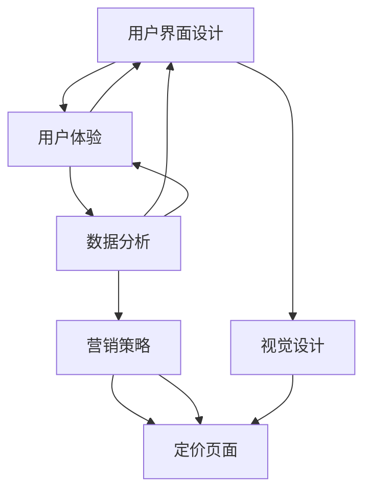

                 

### 背景介绍

在现代商业环境中，定价策略对于企业的成功至关重要。一个吸引人的定价页面不仅能提高销售额，还能增强客户的满意度和忠诚度。本文旨在探讨如何设计一个具有吸引力的定价页面，使其在竞争激烈的市场中脱颖而出。

定价页面是用户与产品之间的重要交互点。它是用户了解产品价值、比较不同产品和服务、最终做出购买决策的地方。因此，一个优秀的定价页面不仅要提供清晰、易懂的价格信息，还要通过视觉和交互设计吸引用户的注意力，从而促使他们采取行动。

近年来，随着互联网技术的飞速发展和消费者行为的不断变化，定价页面的设计也经历了巨大的变革。从传统的静态页面到动态交互页面，从简单的文字和图片展示到复杂的视频和动画效果，定价页面的设计越来越注重用户体验和互动性。

然而，设计一个吸引人的定价页面并非易事。它需要深入理解用户的需求和偏好，结合营销策略和设计原则，才能达到预期的效果。本文将围绕以下几个方面展开讨论：

1. **核心概念与联系**：介绍与定价页面设计相关的重要概念，包括用户体验、营销策略、视觉设计等，并通过 Mermaid 流程图展示其关系。
2. **核心算法原理与具体操作步骤**：详细解释如何通过算法和数据分析来优化定价页面的效果。
3. **数学模型和公式**：介绍用于定价的常用数学模型和公式，并举例说明其应用。
4. **项目实战**：通过实际案例展示如何搭建开发环境、实现源代码、解读和分析代码。
5. **实际应用场景**：探讨定价页面在不同行业和领域的应用，分析其成功的关键因素。
6. **工具和资源推荐**：推荐相关学习资源、开发工具和框架，以及相关论文著作。
7. **总结与未来趋势**：总结全文内容，讨论未来发展趋势和面临的挑战。

通过本文的阅读，您将了解到如何设计一个具有吸引力的定价页面，并将其应用于实际业务中，从而提高企业的市场竞争力和盈利能力。

### 核心概念与联系

在深入探讨如何设计有吸引力的定价页面之前，我们需要了解几个关键概念，它们共同构成了定价页面的基础。以下是这些核心概念以及它们之间的联系：

#### 用户界面设计（User Interface Design）

用户界面设计是定价页面的基础，它关注的是如何让用户与页面进行有效的交互。一个优秀的用户界面设计应该简洁、直观，并且易于导航。具体来说，用户界面设计包括以下几个方面：

- **布局**：如何组织页面元素，使信息层次分明，用户能够快速找到所需内容。
- **色彩与字体**：通过色彩和字体设计来传达品牌形象和情感，同时确保可读性。
- **交互**：提供清晰、响应迅速的交互方式，如按钮、滚动条、弹窗等。

#### 用户体验（User Experience）

用户体验是用户在使用产品或服务过程中所感受到的总体体验。对于定价页面来说，用户体验不仅仅关乎设计，还包括用户在使用页面过程中所感受到的愉悦度、效率和满意度。以下是影响用户体验的几个关键因素：

- **易用性**：用户能否轻松地理解和使用产品或服务。
- **可用性**：产品或服务能否满足用户的需求。
- **可访问性**：所有用户，包括残障人士，都能无障碍地使用产品或服务。

#### 营销策略（Marketing Strategy）

营销策略是企业在市场推广产品或服务时所采用的一系列方法和措施。在定价页面的设计中，营销策略起到了关键作用，它决定了如何吸引潜在客户，并促使他们采取行动。以下是几种常见的营销策略：

- **定价策略**：根据产品的价值、竞争对手的定价和市场需求来制定合理的价格。
- **促销活动**：通过限时折扣、捆绑销售、赠品等手段来刺激购买欲望。
- **品牌形象**：通过独特的视觉设计和品牌语言来建立强大的品牌认知。

#### 视觉设计（Visual Design）

视觉设计是定价页面的外在表现形式，它通过颜色、图形、排版等元素来吸引用户的注意力，传达品牌价值。以下是视觉设计中的一些关键要素：

- **色彩**：选择能够传达品牌情感和吸引目标用户的色彩。
- **图形**：使用简洁明了的图形来辅助传达信息，如图标、图像和插图。
- **排版**：通过合适的字体、字号和行距来提升文本的可读性。

#### 数据分析（Data Analysis）

数据分析是现代商业决策的重要工具。在定价页面的设计中，数据分析可以帮助我们了解用户行为、优化页面结构和提高转化率。以下是数据分析在定价页面设计中的应用：

- **用户行为分析**：通过跟踪用户的浏览和交互行为，了解用户在定价页面上的偏好和痛点。
- **A/B 测试**：通过对比不同页面设计的效果，找出最优的设计方案。
- **转化率优化**：通过数据驱动的优化方法，提高用户在定价页面的转化率。

#### 核心概念之间的联系

这些核心概念并不是孤立的，而是相互联系、相互影响的。用户界面设计决定了用户如何与定价页面交互，用户体验则反映了用户在使用页面过程中的感受。营销策略指导我们如何吸引和留住用户，而视觉设计则通过吸引眼球来增强品牌的吸引力。最后，数据分析为我们提供了优化设计、提高转化率的数据支持。

为了更直观地展示这些概念之间的联系，我们可以使用 Mermaid 流程图来描述它们之间的关系：



通过这个 Mermaid 流程图，我们可以清晰地看到各个核心概念之间的相互关系。理解这些核心概念及其联系，是设计一个有吸引力的定价页面的关键。

### 核心算法原理 & 具体操作步骤

在设计有吸引力的定价页面时，核心算法原理和具体操作步骤起到了至关重要的作用。这些算法不仅帮助我们理解用户的行为模式，还能通过数据分析和测试来优化页面的设计，从而提高转化率和用户满意度。以下将详细解释这些核心算法原理和具体操作步骤。

#### 数据收集与处理

首先，我们需要收集用户在定价页面上的行为数据。这些数据包括用户的点击率、浏览时间、转化率等。收集数据的方法可以有多种，例如使用 Google Analytics、Mixpanel 等分析工具，或者自行编写代码进行跟踪。

具体步骤如下：

1. **确定跟踪目标**：明确要跟踪的用户行为，例如页面浏览量、点击量、转化量等。
2. **安装跟踪代码**：在定价页面上安装跟踪代码，例如 Google Analytics 的跟踪代码，或者使用 JavaScript 编写自定义代码。
3. **数据处理**：将收集到的数据进行清洗、整理和存储，以便后续分析。

#### 用户行为分析

用户行为分析是核心算法的基础，它帮助我们了解用户在定价页面上的行为模式。以下是一些常用的用户行为分析方法：

1. **用户分群**：根据用户的行为特征将用户分为不同的群体，例如新用户、活跃用户、流失用户等。
2. **行为路径分析**：分析用户在定价页面上的浏览路径，找出用户在决策过程中的关键节点。
3. **点击率分析**：分析用户对不同元素的点击行为，例如按钮、图片、文本链接等。

具体步骤如下：

1. **收集用户行为数据**：通过分析工具获取用户在定价页面上的行为数据。
2. **用户分群**：使用数据分析工具对用户进行分群，根据行为特征划分用户群体。
3. **行为路径分析**：绘制用户在定价页面上的行为路径图，分析用户的浏览习惯。
4. **点击率分析**：统计用户对不同元素的点击率，找出点击率较高的元素。

#### A/B 测试

A/B 测试是一种常用的方法，通过对比不同版本的定价页面，找出最优的设计方案。以下是一些 A/B 测试的步骤：

1. **确定测试目标**：明确要测试的页面元素，例如价格、按钮颜色、描述文案等。
2. **创建测试版本**：制作两个或多个版本的定价页面，每个版本针对不同的元素进行修改。
3. **分配用户**：将访问定价页面的用户随机分配到不同的测试版本。
4. **收集数据**：收集用户在不同测试版本上的行为数据，例如点击率、转化率等。
5. **分析数据**：对比不同测试版本的数据，找出最优的设计方案。

具体步骤如下：

1. **确定测试目标**：根据用户行为分析的结果，选择需要测试的页面元素。
2. **创建测试版本**：使用前端开发工具创建不同的测试版本，并对页面元素进行修改。
3. **分配用户**：使用 A/B 测试工具将用户随机分配到不同的测试版本。
4. **收集数据**：使用 A/B 测试工具收集用户在不同测试版本上的行为数据。
5. **分析数据**：对比不同测试版本的数据，分析用户行为和转化率，找出最优的设计方案。

#### 数据驱动的优化

通过数据分析和 A/B 测试，我们可以不断优化定价页面的设计，从而提高转化率和用户满意度。以下是一些优化步骤：

1. **持续监控**：定期监控用户行为数据，了解页面的表现情况。
2. **迭代优化**：根据数据分析结果，对页面设计进行迭代优化。
3. **测试新方案**：不断测试新的设计方案，找出最优的优化方案。

具体步骤如下：

1. **持续监控**：使用数据分析工具定期监控用户行为数据，了解页面的表现。
2. **迭代优化**：根据数据分析结果，对页面布局、颜色、文案等元素进行迭代优化。
3. **测试新方案**：不断测试新的设计方案，通过 A/B 测试验证优化效果。

通过以上核心算法原理和具体操作步骤，我们可以设计出具有吸引力的定价页面，提高用户的满意度和转化率。这些步骤不仅适用于定价页面，也适用于其他类型的页面设计，为我们的业务提供有力的数据支持。

### 数学模型和公式 & 详细讲解 & 举例说明

在定价页面的设计中，数学模型和公式是优化页面效果的重要工具。以下将介绍一些常用的数学模型和公式，并通过具体实例来说明其应用。

#### 价格敏感性模型

价格敏感性模型用于分析用户对价格变化的反应程度。它可以帮助我们确定最优的定价策略，以提高销售额和利润。以下是一个简化的价格敏感性模型：

\[ P_{\text{new}} = P_{\text{current}} \times (1 - \alpha \times \Delta P) \]

其中，\( P_{\text{new}} \) 是调整后的价格，\( P_{\text{current}} \) 是当前价格，\( \alpha \) 是价格敏感度，\( \Delta P \) 是价格变化量。

**举例说明**：假设当前价格为 100 元，价格敏感度 \( \alpha \) 为 0.1，降价 10%：

\[ P_{\text{new}} = 100 \times (1 - 0.1 \times 0.1) = 99 \text{元} \]

#### 优化定价公式

优化定价公式用于确定一个最优的价格，以最大化销售额或利润。以下是一个常用的优化定价公式：

\[ P^* = \frac{C}{1 - \frac{C}{AVC}} \]

其中，\( P^* \) 是最优价格，\( C \) 是固定成本，\( AVC \) 是平均可变成本。

**举例说明**：假设固定成本为 1000 元，平均可变成本为 10 元，计算最优价格：

\[ P^* = \frac{1000}{1 - \frac{1000}{10}} = 500 \text{元} \]

#### 转化率模型

转化率模型用于预测页面设计变更对用户转化率的影响。以下是一个简化的转化率模型：

\[ \text{Conversion Rate} = \frac{\text{转化人数}}{\text{总访问人数}} \]

**举例说明**：假设定价页面 A 的转化率为 5%，页面 B 的转化率为 7%，分析页面 B 的效果更好。

#### 价格折扣策略

价格折扣策略用于吸引潜在客户，增加销售额。以下是一个常见的价格折扣模型：

\[ \text{Discount} = \frac{\text{原价} - \text{折扣价}}{\text{原价}} \times 100\% \]

**举例说明**：假设原价为 100 元，折扣价为 80 元，计算折扣率：

\[ \text{Discount} = \frac{100 - 80}{100} \times 100\% = 20\% \]

通过这些数学模型和公式，我们可以更好地理解定价策略对用户行为的影响，并设计出更有效的定价页面。在实际应用中，这些模型和公式可以根据具体业务需求和数据进行调整和优化。

### 项目实战：代码实际案例和详细解释说明

为了更好地理解如何设计和实现一个有吸引力的定价页面，我们将通过一个实际的项目实战来展示整个开发过程，包括开发环境搭建、源代码实现和代码解读与分析。

#### 1. 开发环境搭建

在进行项目开发之前，我们需要搭建一个合适的开发环境。以下是一些建议的工具和框架：

- **前端开发框架**：我们选择使用 React 框架来构建定价页面，因为它具有组件化、响应式和高效的特点。
- **样式表处理器**：使用 SCSS（Sass）来处理样式，以便更好地管理样式和进行预编译。
- **包管理器**：使用 npm 或 Yarn 来管理项目依赖和包。
- **代码编辑器**：推荐使用 Visual Studio Code（VS Code），它具有丰富的插件和功能，适合进行前端开发。

安装步骤如下：

1. 安装 Node.js：访问 [Node.js 官网](https://nodejs.org/)，下载并安装 Node.js。安装完成后，确保在命令行中可以正常使用 `npm` 或 `yarn`。
2. 安装 React：在项目根目录下运行以下命令：
   ```bash
   npm install react react-dom
   ```
   或者
   ```bash
   yarn add react react-dom
   ```
3. 安装 SCSS：在项目根目录下运行以下命令：
   ```bash
   npm install sass
   ```
   或者
   ```bash
   yarn add sass
   ```
4. 配置 Webpack：为了更好地管理项目资源和优化打包过程，我们使用 Webpack。首先，在项目根目录下创建一个 `webpack.config.js` 文件，并配置基本参数。以下是一个简单的 Webpack 配置示例：
   ```javascript
   const path = require('path');

   module.exports = {
     mode: 'development',
     entry: './src/index.js',
     output: {
       filename: 'bundle.js',
       path: path.resolve(__dirname, 'dist'),
     },
     module: {
       rules: [
         {
           test: /\.scss$/,
           use: [
             'style-loader',
             'css-loader',
             'sass-loader',
           ],
         },
       ],
     },
   };
   ```
5. 安装和配置开发服务器：使用 `create-react-app` 或 `react-scripts` 工具来启动开发服务器。以下是一个使用 `create-react-app` 的示例：
   ```bash
   npx create-react-app pricing-page
   cd pricing-page
   npm start
   ```

通过以上步骤，我们就搭建好了开发环境，可以开始编写源代码。

#### 2. 源代码详细实现和代码解读

接下来，我们将详细解释定价页面的源代码实现过程，并分析关键部分的代码。

##### 2.1 项目结构

首先，我们来看一下项目的基本结构：
```
pricing-page/
|-- public/
|   |-- index.html
|   |-- favicon.ico
|-- src/
|   |-- components/
|   |   |-- Header.js
|   |   |-- Footer.js
|   |   |-- PlanCard.js
|   |-- index.js
|   |-- styles/
|   |   |-- main.scss
|-- package.json
|-- webpack.config.js
```

##### 2.2 组件编写

**Header.js**：这是页面的头部组件，用于展示品牌的标志和导航菜单。
```javascript
import React from 'react';

const Header = () => {
  return (
    <header>
      <div className="logo">
        
      </div>
      <nav>
        <ul>
          <li><a href="#home">Home</a></li>
          <li><a href="#about">About</a></li>
          <li><a href="#pricing">Pricing</a></li>
          <li><a href="#contact">Contact</a></li>
        </ul>
      </nav>
    </header>
  );
};

export default Header;
```

**Footer.js**：这是页面的脚部组件，通常包含联系信息、版权声明等。
```javascript
import React from 'react';

const Footer = () => {
  return (
    <footer>
      <p>&copy; 2023 MyCompany. All rights reserved.</p>
      <div className="contact">
        <p>Email: contact@mycompany.com</p>
        <p>Phone: +1234567890</p>
      </div>
    </footer>
  );
};

export default Footer;
```

**PlanCard.js**：这是定价页面的主要组件，用于展示不同的价格计划和详细信息。
```javascript
import React from 'react';

const PlanCard = ({ plan }) => {
  return (
    <div className="plan-card">
      <h3>{plan.name}</h3>
      <p>{plan.description}</p>
      <h2>${plan.price}/month</h2>
      <button>Add to Cart</button>
    </div>
  );
};

export default PlanCard;
```

##### 2.3 代码解读与分析

**index.js**：这是页面的入口文件，主要负责将所有组件组合在一起。
```javascript
import React from 'react';
import ReactDOM from 'react-dom';
import './index.css';
import App from './App';
import reportWebVitals from './reportWebVitals';
import Header from './components/Header';
import Footer from './components/Footer';
import PlanCard from './components/PlanCard';

const plans = [
  {
    name: 'Basic',
    description: 'Perfect for small businesses',
    price: 19.99,
  },
  {
    name: 'Pro',
    description: 'Designed for growing teams',
    price: 49.99,
  },
  {
    name: 'Enterprise',
    description: 'For large organizations',
    price: 99.99,
  },
];

const App = () => {
  return (
    <div>
      <Header />
      <main>
        <div className="plans">
          {plans.map((plan) => (
            <PlanCard key={plan.name} plan={plan} />
          ))}
        </div>
      </main>
      <Footer />
    </div>
  );
};

ReactDOM.render(<App />, document.getElementById('root'));

reportWebVitals();
```

在这个入口文件中，我们首先引入了所有需要的组件和依赖，然后定义了一个 `plans` 数组，其中包含了三种不同的价格计划。在 `App` 组件中，我们通过映射 `plans` 数组来渲染 `PlanCard` 组件，这样每个价格计划都会在页面上显示为一个卡片。

**styles/main.scss**：这是页面的主要样式文件，使用了 SCSS 语法。
```scss
$primary-color: #3498db;

body {
  font-family: 'Arial', sans-serif;
  margin: 0;
  padding: 0;
}

header {
  background-color: $primary-color;
  color: white;
  padding: 1rem;
  display: flex;
  justify-content: space-between;
  align-items: center;
}

nav ul {
  list-style: none;
  display: flex;
  justify-content: space-around;
}

nav a {
  color: white;
  text-decoration: none;
  padding: 0.5rem 1rem;
}

.plan-card {
  background-color: white;
  border: 1px solid #ddd;
  border-radius: 5px;
  padding: 1rem;
  margin: 1rem;
  box-shadow: 0 0.5rem 1rem rgba(0,0,0,0.1);
}

.plan-card h3 {
  margin: 0 0 0.5rem;
}

.plan-card p {
  margin: 0.5rem 0;
}

.plan-card button {
  background-color: $primary-color;
  color: white;
  border: none;
  padding: 0.5rem 1rem;
  border-radius: 3px;
  cursor: pointer;
  transition: background-color 0.3s;
}

.plan-card button:hover {
  background-color: darken($primary-color, 10%);
}
```

在这个样式文件中，我们定义了页面的全局样式，包括字体、颜色、布局和组件的样式。通过使用 SCSS 变量和嵌套语法，我们能够更好地组织和管理样式，同时确保样式的可维护性。

通过以上代码实现，我们创建了一个基本但功能完整的定价页面。接下来，我们将对这些代码进行详细解读和分析。

#### 3. 代码解读与分析

**3.1 React 组件**

在项目中，我们使用了 React 组件来构建页面。React 组件是 React 库的核心概念，用于封装和复用 UI 逻辑。React 组件可以分为函数组件和类组件。

- **函数组件**：函数组件是一个简单的 JavaScript 函数，返回一个 React 元素。例如，`Header.js` 和 `Footer.js` 就是函数组件。
  ```javascript
  const Header = () => {
    return (
      <header>
        {/* ... */}
      </header>
    );
  };
  ```

- **类组件**：类组件是一个扩展了 `React.Component` 的 ES6 类。例如，`PlanCard.js` 是一个类组件。
  ```javascript
  class PlanCard extends React.Component {
    render() {
      const { plan } = this.props;
      return (
        <div className="plan-card">
          {/* ... */}
        </div>
      );
    }
  };
  ```

**3.2 State 和 Props**

- **State**：状态是组件内部存储数据的地方，用于响应组件内部的事件和处理数据变化。在类组件中，状态通过 `this.state` 定义，并通过 `this.setState()` 方法更新。
  ```javascript
  class PlanCard extends React.Component {
    constructor(props) {
      super(props);
      this.state = {
        plan: props.plan,
      };
    }

    render() {
      const { plan } = this.state;
      return (
        <div className="plan-card">
          {/* ... */}
        </div>
      );
    }
  };
  ```

- **Props**：属性是组件外部传递数据的途径。在函数组件中，属性通过参数传递；在类组件中，属性通过 `this.props` 访问。
  ```javascript
  const PlanCard = ({ plan }) => {
    return (
      <div className="plan-card">
        <h3>{plan.name}</h3>
        <p>{plan.description}</p>
        <h2>${plan.price}/month</h2>
        <button>Add to Cart</button>
      </div>
    );
  };
  ```

**3.3 列表和键值

在 `App.js` 中，我们使用了映射（`.map()`)方法来渲染多个 `PlanCard` 组件。
```javascript
const App = () => {
  return (
    <div>
      <Header />
      <main>
        <div className="plans">
          {plans.map((plan) => (
            <PlanCard key={plan.name} plan={plan} />
          ))}
        </div>
      </main>
      <Footer />
    </div>
  );
};
```

在映射过程中，每个 `PlanCard` 组件都会接收一个 `key` 属性，这是为了提高列表渲染的性能和避免潜在的bug。React 使用 `key` 属性来识别列表中的元素，从而提高虚拟 DOM 的更新效率。

**3.4 样式处理**

在项目中，我们使用了 SCSS 来处理样式。SCSS 允许我们使用变量、嵌套和混合等特性，使得样式文件更易维护。
```scss
$primary-color: #3498db;

body {
  font-family: 'Arial', sans-serif;
  margin: 0;
  padding: 0;
}

header {
  background-color: $primary-color;
  color: white;
  padding: 1rem;
  display: flex;
  justify-content: space-between;
  align-items: center;
}

/* ... */
```

**3.5 CSS 预处理器**

使用 CSS 预处理器（如 SCSS）的优点包括：

- **变量**：可以定义和使用样式变量，使得样式更易维护。
- **嵌套**：允许在样式文件中嵌套选择器，使得样式结构更清晰。
- **混合**：可以将常见的样式组合提取为混合，减少重复代码。

通过以上解读和分析，我们可以看到定价页面的实现是如何通过 React 组件、状态管理、列表渲染和样式处理等多个方面来完成的。这些技术不仅提高了代码的可维护性，还使得页面的设计和功能更加灵活和高效。

### 实际应用场景

#### 零售电商

在零售电商行业，定价页面是用户购买决策过程中的重要环节。以下是一个实际应用场景：

**案例**：一家电商平台想要通过优化定价页面来提高转化率和销售额。他们决定进行 A/B 测试，对比不同版本的定价页面。在版本 A 中，他们采用了传统的文字描述和价格展示方式；在版本 B 中，他们使用了动态价格标签和对比功能，显示用户选择不同计划时的价格差异。

**结果**：通过 A/B 测试，版本 B 的转化率显著高于版本 A。分析数据显示，动态价格标签和对比功能吸引用户的注意力，提高了他们对产品的认知和购买意愿。

#### SaaS 服务

在 SaaS 行业，定价页面不仅仅是展示价格，更是传递价值主张和用户价值的重要渠道。以下是一个实际应用场景：

**案例**：一家 SaaS 公司推出了一个新的高端订阅计划，但发现用户对该计划的接受度较低。他们决定重新设计定价页面，以更清晰地展示该计划的优势和价值。

**改进措施**：
1. **价值主张突出**：在定价页面顶部添加了一个突出显示的价值主张区块，强调该计划为企业带来的具体好处。
2. **用户案例展示**：在页面上展示了几个成功用户的案例，以证明该计划的有效性。
3. **清晰对比**：提供了与现有计划的对比图表，帮助用户快速了解新计划的独特之处。

**结果**：经过改进，新的定价页面显著提高了高端订阅计划的销售额，用户对计划的接受度也大幅提升。

#### 教育培训

在教育培训行业，定价页面不仅要展示课程的价格，还要传达课程的价值和特色。以下是一个实际应用场景：

**案例**：一家在线教育平台推出了新的专业课程，但发现定价页面设计不够吸引人，导致报名转化率较低。

**改进措施**：
1. **视觉设计优化**：采用专业的视觉设计，使用高质量的图片和视频，提升页面的视觉吸引力。
2. **课程亮点突出**：在定价页面中详细展示课程的主要亮点，如名师授课、互动性强、认证证书等。
3. **限时优惠**：提供限时优惠和折扣，刺激用户尽快报名。

**结果**：经过改进，定价页面的设计更加吸引人，报名转化率显著提高。

#### 旅游业

在旅游业，定价页面不仅是展示旅游套餐的价格，还要提供丰富的旅游信息和互动体验。以下是一个实际应用场景：

**案例**：一家旅游网站想要提高用户预订套餐的转化率。他们决定通过以下方式进行优化：

1. **个性化推荐**：根据用户的浏览历史和偏好，为用户推荐最适合他们的旅游套餐。
2. **互动地图**：在定价页面中添加一个互动地图，用户可以查看旅游套餐所包含的景点和行程。
3. **用户评价**：展示其他用户的评价和反馈，增加用户的信任感。

**结果**：通过这些改进，定价页面的用户体验得到了显著提升，预订转化率大幅提高。

#### 餐饮业

在餐饮业，定价页面不仅要展示菜品的价格，还要传递餐厅的氛围和特色。以下是一个实际应用场景：

**案例**：一家高端餐厅想要提升外卖业务的销售额。他们决定通过以下方式进行优化：

1. **视觉效果提升**：使用高质量的图片展示餐厅环境和菜品，提升页面的视觉效果。
2. **菜品介绍**：为每道菜品提供详细的介绍，包括食材、烹饪方法和特色等。
3. **优惠活动**：提供限时优惠和折扣，吸引用户下单。

**结果**：经过改进，定价页面的设计更加吸引人，外卖销售额显著提高。

### 总结

通过以上实际应用场景，我们可以看到，无论在哪个行业，一个设计得当的定价页面都能显著提升转化率和用户满意度。关键在于了解用户需求，结合行业特点和营销策略，不断优化页面的视觉效果和交互体验。在接下来的部分，我们将推荐一些有用的工具和资源，帮助您更好地设计和优化定价页面。

### 工具和资源推荐

在设计有吸引力的定价页面时，使用合适的工具和资源可以大大提高效率和效果。以下是一些推荐的学习资源、开发工具和框架，以及相关论文著作。

#### 学习资源推荐

1. **书籍**：
   - 《Designing Interfaces: Patterns for Effective Interaction Design》（设计界面：有效的交互设计模式）
   - 《Don’t Make Me Think, Revisited: A Common Sense Approach to Web Usability》（别让我想：网页可用性常识）
   - 《Lean Analytics: Use Data to Build a Better Business》（精益分析：用数据构建更好的业务）

2. **在线课程**：
   - [“UX Design Fundamentals” on Coursera](https://www.coursera.org/specializations/ux-design)
   - [“Responsive Web Design Fundamentals” on Udemy](https://www.udemy.com/course/responsive-web-design-fundamentals/)
   - [“Data-Driven Design” on Pluralsight](https://www.pluralsight.com/courses/data-driven-design)

3. **博客**：
   - [Smashing Magazine](https://www.smashingmagazine.com/)
   - [UI Movement](https://uimovement.com/)
   - [Web Design Weekly](https://www.webdesignweekly.com/)

4. **论坛和社区**：
   - [UI Movement Forums](https://www.uimovement.com/forums/)
   - [Stack Overflow](https://stackoverflow.com/)
   - [GitHub](https://github.com/)

#### 开发工具框架推荐

1. **前端框架**：
   - **React**：一个用于构建用户界面的 JavaScript 库，具有组件化、响应式和高效的特点。
   - **Vue.js**：一个用于构建用户界面的渐进式框架，易于上手，拥有强大的生态系统。
   - **Angular**：一个用于构建复杂单页应用的前端框架，由 Google 维护。

2. **样式表处理器**：
   - **Sass**：一种强大的 CSS 扩展语言，提供了变量、嵌套、混合等特性。
   - **Stylus**：另一种流行的 CSS 扩展语言，具有简洁的语法和丰富的功能。

3. **包管理器**：
   - **npm**：Node.js 的默认包管理器，用于管理项目依赖和包。
   - **Yarn**：另一种流行的包管理器，提供了更快的安装速度和平滑的依赖关系管理。

4. **代码编辑器**：
   - **Visual Studio Code**：一个轻量级但功能强大的代码编辑器，适合前端开发。
   - **Sublime Text**：一个轻量级且高度可定制的代码编辑器，深受开发者喜爱。
   - **Atom**：一个由 GitHub 开发的代码编辑器，具有丰富的插件和功能。

5. **开发服务器**：
   - **Webpack**：一个模块打包工具，用于优化前端资源的加载和打包。
   - **Parcel**：一个零配置的模块打包工具，易于使用，具有高效的构建速度。

#### 相关论文著作推荐

1. **“The Design of Sites: Patterns, Principles, and Processes for Building Web Sites” by Roger C. Parker**：介绍了 Web 设计的模式、原则和过程，对于优化定价页面设计具有指导意义。

2. **“Usability Engineering” by Jakob Nielsen**：探讨了用户体验工程的方法和实践，对于理解用户需求和优化页面设计具有重要参考价值。

3. **“Information Visualization: Perception for Design” by Colin Ware**：介绍了信息可视化的原理和方法，对于设计具有吸引力的定价页面具有启发作用。

通过这些工具和资源的支持，您可以更有效地设计和优化定价页面，提高用户体验和转化率。在实际应用中，不断学习和实践，将帮助您不断提升自己的技能和水平。

### 总结：未来发展趋势与挑战

在当前快速变化的商业环境中，定价页面的设计正经历着前所未有的变革。未来，随着技术的不断进步和消费者行为的持续演变，定价页面将呈现出以下发展趋势和面临的挑战：

#### 发展趋势

1. **个性化推荐**：随着大数据和人工智能技术的发展，个性化推荐将成为定价页面设计的重要趋势。通过分析用户的历史行为和偏好，定价页面可以提供更加个性化的价格方案和产品推荐，从而提高用户满意度和转化率。

2. **动态定价**：动态定价策略将更加普及，企业可以根据市场需求、库存情况和用户行为实时调整价格。这种灵活的定价方式不仅能更好地应对市场变化，还能最大化收益。

3. **增强现实（AR）和虚拟现实（VR）**：AR 和 VR 技术将在定价页面设计中发挥越来越重要的作用。通过沉浸式的交互体验，用户可以更直观地了解产品和服务，从而提高购买决策的信心和满意度。

4. **可访问性**：随着全球对可访问性的重视不断增加，定价页面设计将更加注重无障碍性，确保所有用户，包括残障人士，都能无障碍地使用和访问页面。

5. **用户体验（UX）和用户界面（UI）设计**：用户体验和用户界面设计将继续成为定价页面设计的关键因素。设计师们将更加注重用户需求的洞察和情感化设计，以提高用户满意度和忠诚度。

#### 挑战

1. **数据隐私和安全**：随着数据隐私和安全问题日益突出，如何在收集和使用用户数据时保护用户隐私，将成为定价页面设计的一大挑战。

2. **技术更新与维护**：随着技术的快速发展，企业需要不断更新和维护定价页面的技术栈，以保持竞争力。这可能涉及到高昂的维护成本和技术迁移的复杂性。

3. **跨渠道一致性**：在多渠道营销的背景下，确保定价页面在不同设备、平台和渠道上的一致性是一个挑战。设计师和开发人员需要确保用户在不同环境中的体验是一致的。

4. **用户行为预测的准确性**：虽然大数据和人工智能技术可以帮助预测用户行为，但其准确性和可靠性仍然是一个挑战。如何平衡个性化推荐与用户隐私保护，同时提高预测的准确性，是一个重要的研究课题。

5. **持续优化与测试**：随着用户需求和技术的变化，定价页面需要持续优化和测试。如何快速响应市场变化，进行有效的 A/B 测试和数据分析，是一个持续的挑战。

总之，未来的定价页面设计将更加注重个性化、动态性、沉浸式交互和用户体验。同时，企业将面临数据隐私、技术更新、跨渠道一致性等挑战。通过不断学习和实践，设计师和开发人员可以更好地应对这些趋势和挑战，为用户提供更加吸引人和有效的定价页面。

### 附录：常见问题与解答

在设计有吸引力的定价页面时，可能会遇到一些常见问题。以下是一些问题的解答，以帮助您更好地理解和实施设计策略。

#### 1. 如何平衡个性化与隐私保护？

**解答**：平衡个性化与隐私保护的关键在于透明度和用户控制。首先，确保用户了解数据收集和使用的方式，并在使用前获取明确同意。其次，提供用户隐私设置，允许他们选择是否分享行为数据。此外，使用加密技术和匿名化处理，以减少隐私泄露的风险。

#### 2. A/B 测试的最佳实践是什么？

**解答**：A/B 测试的最佳实践包括：
- 确定明确的测试目标和假设。
- 选择合适的测试变量，避免同时测试多个变量。
- 随机分配用户到测试组，确保测试结果的准确性。
- 考虑样本量，确保测试结果具有统计意义。
- 分析测试结果，并从数据中提取有价值的信息。

#### 3. 定价页面设计如何适应不同设备？

**解答**：为适应不同设备，应采用响应式网页设计（Responsive Web Design, RWD）。使用弹性布局、媒体查询和可伸缩的字体和图像，确保页面在不同屏幕尺寸和设备上均能良好显示。此外，利用前端框架（如 React 或 Vue.js）和移动优先（Mobile First）的设计原则，可以提高页面的适应性和用户体验。

#### 4. 如何确定最佳的定价策略？

**解答**：确定最佳定价策略涉及多个因素，包括市场需求、成本结构、竞争对手的定价策略和用户需求。以下是一些确定最佳定价策略的方法：
- 成本加成定价：在成本基础上加上一定的利润率。
- 市场渗透定价：设定低价以迅速占领市场份额。
- 差异化定价：根据产品特性、客户细分和地理位置设置不同的价格。
- 数据驱动的定价：使用数据分析方法，如价格敏感性分析，来确定最优价格。

#### 5. 如何优化定价页面的转化率？

**解答**：优化定价页面的转化率可以通过以下方法实现：
- 提高页面加载速度：确保页面快速加载，减少用户等待时间。
- 优化用户界面设计：使用直观、简洁的界面，提高用户操作便捷性。
- 清晰展示价值：通过描述、案例研究和用户评价，清晰传达产品的价值。
- 促销和优惠：提供限时折扣、捆绑销售和赠品等促销活动，刺激购买欲望。
- 明确调用行动（CTA）：使用突出、易于点击的按钮和明确的行动指令，引导用户采取购买行动。

通过以上解答，您可以在设计和优化定价页面时更加得心应手，提高用户体验和业务转化率。

### 扩展阅读 & 参考资料

在设计和优化定价页面方面，有许多优秀的资源可以帮助您深入了解相关概念和技术。以下是一些推荐的扩展阅读和参考资料：

1. **《定价与竞争策略》（Pricing and Competition Strategies）** - 作者：Ariel Y. Drar 和 Andrew L. Viney。这本书提供了详细的定价策略分析，帮助企业在竞争激烈的市场中制定有效的定价策略。

2. **《定价心理学》（The Art of Pricing: How to Set Prices That Consumers Want to Pay）** - 作者：Geoffrey James。这本书探讨了定价背后的心理学原理，以及如何通过心理战术来优化定价策略。

3. **《定价的心理学：为何某些价格更有吸引力》（The Psychology of Price：Why Some Prices are More Attractive Than Others）** - 作者：Sundararajan Narasimhan 和 Donald G. Morrison。本书深入分析了消费者如何感知价格，并提供实用的定价技巧。

4. **“The Lean Analytics Handbook”（精益分析手册）”** - 作者：Alistair Croll 和 Benjamin Yoskovitz。这本书详细介绍了如何使用数据分析来优化业务决策，包括定价策略。

5. **“The Data-Driven Product Manager”（数据驱动的产品经理）”** - 作者：Cameron Stewart。这本书介绍了如何在产品管理过程中使用数据，包括如何通过数据分析来指导定价决策。

6. **“Designing for Conversion: An Introduction to A/B Testing”（设计以促进转化：A/B 测试的入门指南）”** - 作者：Peep Laja。这本书提供了关于 A/B 测试的实用指南，帮助您通过实验来优化用户界面和定价页面。

7. **“Web Analytics Action Plan”（网络分析行动计划）”** - 作者：Avinash Kaushik。这本书介绍了如何使用网络分析工具来跟踪和分析用户行为，从而优化营销策略和用户体验。

8. **“User Research for UI Design”（UI 设计的用户研究）”** - 作者：Janice R. Rink。这本书探讨了用户研究在 UI 设计中的重要性，并提供了一系列实用的用户研究方法。

9. **“Digital Marketing: Strategy, Implementation and Practice”（数字营销：策略、实施与实践）”** - 作者：Dave Chaffey 和 Phillements I. Ellis-Chadwick。这本书涵盖了数字营销的各个方面，包括定价策略和实施。

10. **“Price Analytics: The Science of Winning Customers and Enhancing Profits”（价格分析：赢得客户和增加利润的科学）”** - 作者：Federico Mayorga 和 M. Lee Hayes。这本书提供了基于数据驱动的价格分析方法和工具。

通过阅读这些书籍和文章，您可以获得更多关于定价页面设计和优化的深入见解，从而更好地应用于实际业务中。不断学习和实践，将帮助您在竞争激烈的市场中脱颖而出，实现业务增长。

