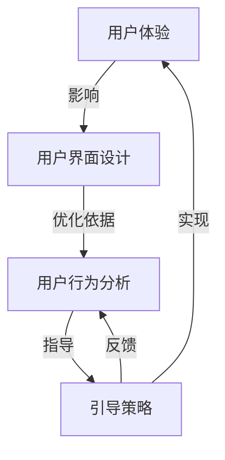
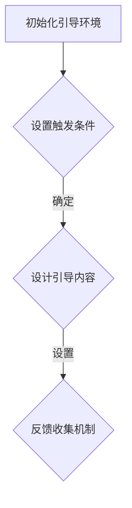
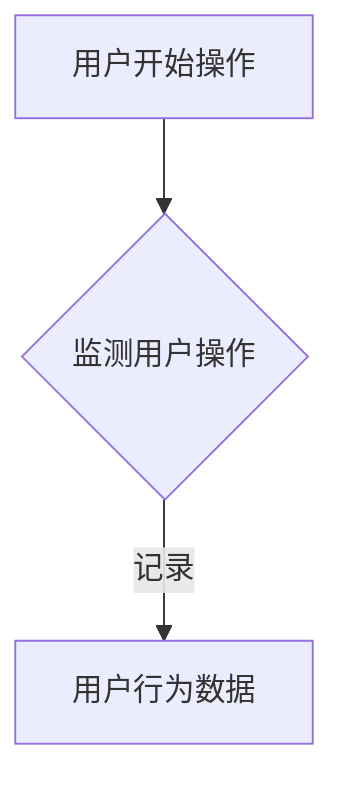
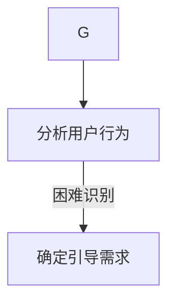
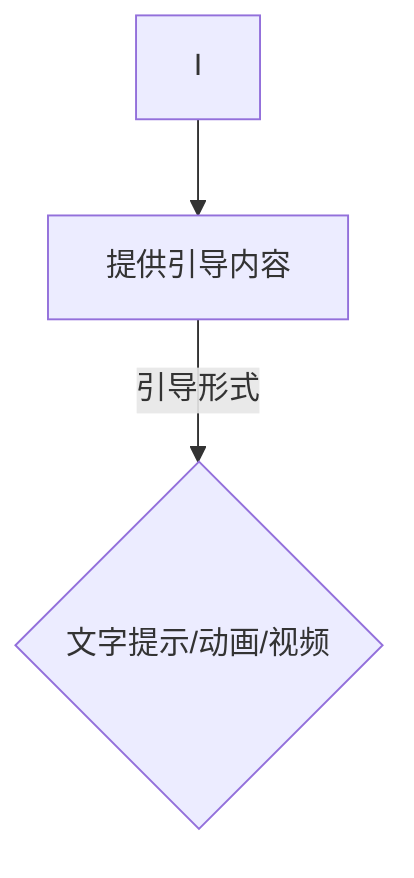
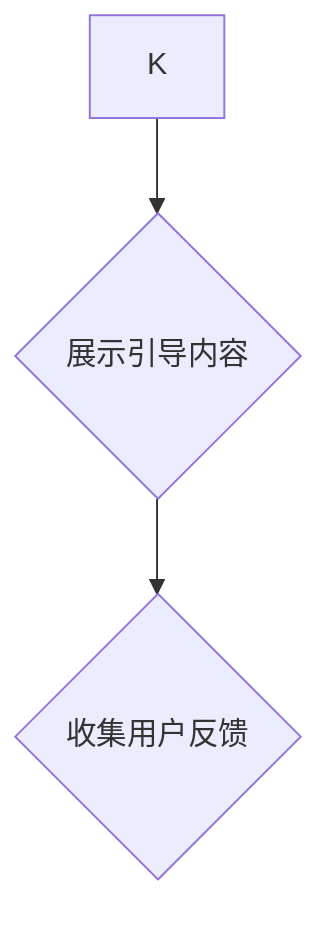
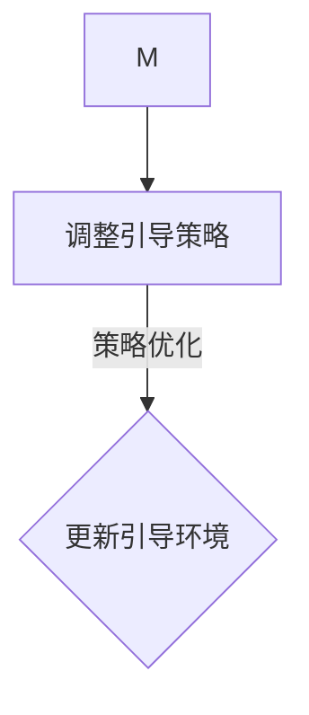
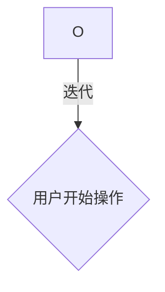

                 

### 背景介绍

用户引导流程设计是提升用户体验、降低用户使用门槛的重要手段。在当今的数字时代，无论是移动应用、网站，还是复杂的软件系统，用户引导流程的设计都变得尤为重要。有效的用户引导不仅能提高用户满意度和留存率，还能帮助产品团队更好地了解用户需求，优化产品功能。

用户引导流程设计的重要性体现在以下几个方面：

1. **提高用户留存率**：有效的用户引导能够快速引导用户了解产品的基本功能，从而提高用户的留存率。研究表明，新手用户在初次使用产品时，如果能够顺利完成任务，他们通常会继续使用该产品。

2. **降低用户学习成本**：通过用户引导，用户可以更快地掌握产品使用方法，减少学习成本和时间。

3. **提升产品价值感知**：良好的用户引导能够让用户更清楚地了解产品的价值，从而增加用户的忠诚度。

4. **收集用户反馈**：用户引导流程中可以嵌入反馈收集机制，帮助产品团队了解用户使用过程中的痛点和需求，进而优化产品。

然而，设计有效的用户引导流程并非易事。它需要充分考虑用户的背景、需求和行为模式，并且要平衡引导的频率和内容，确保引导能够被用户接受并产生预期的效果。

本文将围绕以下内容展开：

1. **核心概念与联系**：介绍用户引导流程设计中的核心概念，以及它们之间的相互联系。
2. **核心算法原理 & 具体操作步骤**：讲解设计用户引导流程的算法原理，并提供具体操作步骤。
3. **数学模型和公式 & 详细讲解 & 举例说明**：介绍设计用户引导流程所需使用的数学模型和公式，并通过实例进行详细讲解。
4. **项目实战：代码实际案例和详细解释说明**：通过一个实际项目案例，展示如何编写代码实现用户引导流程，并进行详细解释。
5. **实际应用场景**：分析用户引导流程在不同类型产品中的应用场景。
6. **工具和资源推荐**：推荐用于设计用户引导流程的相关工具和资源。
7. **总结：未来发展趋势与挑战**：总结本文内容，并探讨未来发展趋势和面临的挑战。

通过对这些内容的详细探讨，读者将能够系统地理解用户引导流程的设计方法，并能够在实际项目中应用这些方法，提升产品的用户体验。

---

### 核心概念与联系

在用户引导流程设计中，有几个核心概念需要了解，它们包括用户体验（User Experience, UX）、用户界面设计（User Interface Design, UI）、用户行为分析（User Behavior Analysis）和引导策略（Guidance Strategy）。以下是对这些核心概念的介绍以及它们之间的相互联系。

#### 用户体验（User Experience, UX）

用户体验是指用户在使用产品或服务过程中所产生的感知、情感和行为。它不仅仅关注产品的功能，还包括用户与产品交互的整个过程。用户体验的好坏直接影响到用户对产品的满意度。在用户引导流程设计中，用户体验是核心要素之一，因为一个良好的用户体验可以吸引用户持续使用产品，并提高用户忠诚度。

#### 用户界面设计（User Interface Design, UI）

用户界面设计是指产品或服务的界面布局、颜色、字体、图标等视觉元素的设计。UI设计的目标是使界面美观、直观、易于使用。一个优秀的UI设计可以减少用户的学习成本，提高操作效率，从而提升用户体验。在用户引导流程中，UI设计决定了引导信息如何呈现给用户，以及用户如何与引导内容进行互动。

#### 用户行为分析（User Behavior Analysis）

用户行为分析是指通过收集和分析用户在使用产品过程中的行为数据，以了解用户的需求和偏好。用户行为分析可以帮助产品团队识别用户在产品使用过程中遇到的障碍和痛点，从而优化产品设计。在用户引导流程设计中，用户行为分析用于确定引导的最佳时机、内容和方式，以确保引导能够有效引导用户完成任务。

#### 引导策略（Guidance Strategy）

引导策略是指产品或服务中用于引导用户完成特定任务的方法和技巧。引导策略可以包括文字提示、视觉提示、动画引导、步骤指示等。引导策略的设计需要考虑到用户体验、用户界面设计和用户行为分析，以确保引导信息能够被用户有效接收并执行。

这些核心概念之间的联系如下：

1. **用户体验与用户界面设计**：用户体验决定了用户界面设计的方向和目标，而用户界面设计是实现用户体验的重要手段。
2. **用户界面设计与用户行为分析**：用户界面设计需要基于用户行为分析的结果进行优化，以提高用户操作的效率和满意度。
3. **用户行为分析与引导策略**：用户行为分析用于确定引导的最佳时机和内容，而引导策略则基于用户行为分析结果，设计出有效的引导方法。

通过以上核心概念和相互联系的了解，我们可以更系统地设计用户引导流程，确保引导流程能够满足用户需求，提升产品价值。

#### Mermaid 流程图

为了更直观地展示用户引导流程设计中的核心概念及其相互联系，我们可以使用Mermaid流程图来表示。以下是一个简化的Mermaid流程图示例，用于描述用户引导流程设计中的关键环节：



在这个流程图中：

- **UX**：用户体验是流程的起点，它直接影响用户界面设计和引导策略。
- **UI**：用户界面设计是用户体验的实现载体，它需要根据用户行为分析的结果进行优化。
- **UBA**：用户行为分析提供了用户操作的详细数据，为界面设计和引导策略提供优化依据。
- **GS**：引导策略基于用户行为分析，设计出能够有效引导用户的步骤和内容。
- **UX** 和 **GS** 之间的双向箭头表示用户体验和引导策略之间存在反馈循环，引导策略的实施可以进一步优化用户体验。

通过这样的Mermaid流程图，我们可以清晰地看到用户引导流程设计中的各个环节及其相互影响，从而为实际设计提供指导。

### 核心算法原理 & 具体操作步骤

在设计用户引导流程时，核心算法原理和具体操作步骤是至关重要的。以下将详细介绍如何使用逐步引导算法（Step-by-Step Guidance Algorithm）来设计有效的用户引导流程。

#### 1. 逐步引导算法概述

逐步引导算法是一种基于用户操作步骤和反馈的动态引导策略。其基本原理是：在用户完成每个操作步骤后，系统根据用户行为和反馈提供相应的引导信息，帮助用户顺利完成后续步骤。逐步引导算法的关键在于实时监测用户操作，并根据用户的响应动态调整引导内容。

#### 2. 算法步骤

**步骤1：初始化引导环境**

在开始引导之前，需要初始化引导环境。这包括设置引导触发条件、引导内容以及用户反馈收集机制。



**步骤2：监测用户操作**

当用户开始使用产品时，系统会监测用户操作，记录用户在每个步骤上的行为。这些行为数据将用于后续的引导策略调整。



**步骤3：分析用户行为**

系统会分析用户行为数据，确定用户是否遇到困难或障碍。这一步骤可以通过机器学习算法或规则引擎实现。分析结果将用于指导下一步的引导内容。



**步骤4：提供引导内容**

根据用户行为分析结果，系统提供相应的引导内容。引导内容可以包括文字提示、动画、视频等多种形式。引导内容的目的是帮助用户克服困难，顺利完成当前步骤。



**步骤5：收集用户反馈**

在引导内容展示后，系统需要收集用户反馈，以评估引导效果。用户反馈可以是正面评价、负面评价或建议等。这些反馈数据将用于进一步优化引导策略。



**步骤6：调整引导策略**

根据用户反馈，系统会调整引导策略，以优化引导效果。这包括调整引导内容的呈现方式、引导的时机和频率等。



**步骤7：循环迭代**

引导流程不是一次性的，而是一个循环迭代的过程。系统会持续监测用户操作，收集反馈，并根据反馈调整引导策略，以实现最佳的引导效果。



#### 3. 算法示例

以下是一个简单的逐步引导算法示例，用于帮助用户完成注册流程：

**示例：注册流程引导算法**

1. **初始化引导环境**：
   - 触发条件：用户点击“注册”按钮。
   - 引导内容：第一步，填写用户名；第二步，填写邮箱；第三步，设置密码。
   - 反馈收集机制：每完成一步，收集用户反馈（例如，是否理解步骤）。

2. **监测用户操作**：
   - 用户开始填写用户名，系统记录用户输入的用户名。

3. **分析用户行为**：
   - 用户在填写用户名时，系统通过机器学习算法分析用户输入速度和准确性，判断用户是否遇到困难。

4. **提供引导内容**：
   - 如果系统判断用户遇到困难，则提供文字提示：“请确保用户名不少于5个字符”。

5. **收集用户反馈**：
   - 用户点击“下一步”，系统记录用户操作。

6. **调整引导策略**：
   - 根据用户反馈，系统判断用户是否理解了提示信息。如果用户仍然不理解，则增加动画引导，演示用户名输入的正确方式。

7. **循环迭代**：
   - 用户继续填写邮箱和设置密码，系统根据每个步骤的反馈继续调整引导策略。

通过这个示例，我们可以看到逐步引导算法如何根据用户行为和反馈动态调整引导内容，以实现最佳的引导效果。

### 数学模型和公式 & 详细讲解 & 举例说明

在设计用户引导流程时，数学模型和公式可以用来量化用户行为、评估引导效果和优化引导策略。以下将介绍几个常用的数学模型和公式，并通过具体例子进行详细讲解。

#### 1. 贝叶斯优化（Bayesian Optimization）

贝叶斯优化是一种基于概率模型的优化算法，常用于自动寻找函数的最优参数。在用户引导流程中，贝叶斯优化可以用于优化引导时机的选择。

**模型公式**：
$$
P(x_{*}|\textbf{x}, \textbf{y}) = \frac{P(\textbf{y}|\textbf{x}_{*}, x)P(x_{*})}{P(\textbf{y}|\textbf{x})}
$$

其中，\(P(x_{*}|\textbf{x}, \textbf{y})\) 表示在给定用户行为数据 \(\textbf{y}\) 和现有数据点 \(\textbf{x}\) 下，最优引导时机的概率；\(P(\textbf{y}|\textbf{x}_{*}, x)\) 表示在最优引导时机 \(x_{*}\) 下，用户行为的概率；\(P(x_{*})\) 表示最优引导时机的先验概率；\(P(\textbf{y}|\textbf{x})\) 表示在现有数据点下，用户行为的总概率。

**详细讲解**：
贝叶斯优化通过不断更新先验概率，利用现有数据和用户行为来预测最优引导时机。在用户引导流程中，我们可以通过收集用户在各个引导时机下的行为数据，使用贝叶斯优化来调整引导时机，以提高引导效果。

**举例说明**：
假设我们有一个用户注册流程，需要确定最佳的引导时机。我们收集了以下数据：

| 时机 | 注册成功率 |  
|------|-----------|  
| 0秒  | 80%       |  
| 10秒 | 85%       |  
| 20秒 | 90%       |  
| 30秒 | 85%       |

使用贝叶斯优化，我们可以计算出在每个时机的注册成功率概率，并选择最高概率的时机作为最佳引导时机。

#### 2. 决策树（Decision Tree）

决策树是一种常用的分类和回归模型，可以用于用户引导流程中的引导策略优化。

**模型公式**：
$$
\text{Entropy}(S) = -\sum_{i} p_{i} \log_2(p_{i})
$$

其中，\(S\) 表示样本集，\(p_{i}\) 表示样本集中属于第 \(i\) 个类别的概率。

**详细讲解**：
决策树通过分裂数据集来构建决策路径，每个节点表示一个特征，每个分支表示该特征的不同取值。通过计算信息熵，我们可以选择信息增益最大的特征进行分裂，从而构建出最优的决策树。

**举例说明**：
假设我们有一个用户引导流程，需要确定用户是否理解引导内容。我们收集了以下数据：

| 引导内容 | 理解 | 不理解 |
|----------|------|--------|
| 文字提示 | 70%  | 30%    |
| 动画引导 | 80%  | 20%    |
| 视频引导 | 90%  | 10%    |

使用决策树，我们可以构建一个分类模型，根据用户对不同引导内容的理解概率来选择最佳引导方式。

#### 3. 聚类算法（Clustering Algorithm）

聚类算法可以用于识别用户群体，以便为不同群体提供定制化的引导内容。

**模型公式**：
$$
\text{Distance}(x, y) = \sqrt{\sum_{i} (x_i - y_i)^2}
$$

其中，\(x\) 和 \(y\) 表示两个数据点，\(\text{Distance}(x, y)\) 表示它们之间的距离。

**详细讲解**：
聚类算法通过计算数据点之间的距离来识别相似的群体。常用的聚类算法包括K均值聚类、层次聚类等。通过聚类算法，我们可以将用户划分为不同的群体，为每个群体提供针对性的引导内容。

**举例说明**：
假设我们使用K均值聚类算法将用户划分为两类：

| 用户群体 | 用户数 |  
|----------|--------|  
| 群体A    | 1000   |  
| 群体B    | 500    |

针对群体A，我们可以提供更详细的文字提示；针对群体B，我们可以提供简短的动画引导。

通过这些数学模型和公式，我们可以更科学、系统地设计用户引导流程，提高引导效果和用户体验。在实际应用中，可以根据具体情况选择合适的模型和算法，以实现最佳效果。

### 项目实战：代码实际案例和详细解释说明

为了更好地展示如何设计有效的用户引导流程，下面我们将通过一个具体的实战项目——一个简单的在线文档编辑器，来详细讲解如何实现用户引导流程，包括开发环境搭建、源代码详细实现和代码解读与分析。

#### 5.1 开发环境搭建

在开始项目之前，我们需要搭建一个合适的开发环境。以下是所需工具和步骤：

1. **工具**：
   - **编程语言**：Python
   - **Web框架**：Flask
   - **前端框架**：Bootstrap
   - **数据库**：SQLite
   - **版本控制**：Git

2. **步骤**：
   - 安装Python和Flask：
     ```shell
     pip install flask
     ```
   - 安装Bootstrap：
     ```shell
     pip install bootstrap
     ```
   - 创建项目文件夹和初始化Git仓库：
     ```shell
     mkdir doc_editor
     cd doc_editor
     git init
     ```
   - 创建一个简单的Flask应用：
     ```python
     # app.py
     from flask import Flask, render_template

     app = Flask(__name__)

     @app.route('/')
     def index():
         return render_template('index.html')

     if __name__ == '__main__':
         app.run(debug=True)
     ```

#### 5.2 源代码详细实现和代码解读

在本项目中，我们将设计一个简单的文档编辑器，并在用户首次使用时提供引导流程。以下是项目的核心代码实现和解读：

##### 5.2.1 引导页面设计

**index.html**：
```html
<!DOCTYPE html>
<html lang="en">
<head>
    <meta charset="UTF-8">
    <meta name="viewport" content="width=device-width, initial-scale=1.0">
    <title>Document Editor</title>
    <link rel="stylesheet" href="{{ url_for('static', filename='css/bootstrap.min.css') }}">
</head>
<body>
    <div class="container">
        <h1>欢迎使用文档编辑器</h1>
        <p>请按照以下步骤开始编辑：</p>
        <ul>
            <li>点击“新建文档”开始创建新文档。</li>
            <li>使用富文本编辑器编辑文档内容。</li>
            <li>保存文档，导出为常见格式（如.docx、.pdf）。</li>
        </ul>
        <a href="{{ url_for('editor') }}" class="btn btn-primary">新建文档</a>
    </div>
</body>
</html>
```

**解读**：
- 引导页面使用Bootstrap框架布局，通过简单的HTML和CSS实现。
- 引导页面展示了一步一步的引导内容，使用无序列表`<ul>`将步骤展示出来。
- 通过超链接`<a>`，用户可以点击进入文档编辑页面。

##### 5.2.2 文档编辑器实现

**editor.html**：
```html
<!DOCTYPE html>
<html lang="en">
<head>
    <meta charset="UTF-8">
    <meta name="viewport" content="width=device-width, initial-scale=1.0">
    <title>Document Editor</title>
    <link rel="stylesheet" href="{{ url_for('static', filename='css/bootstrap.min.css') }}">
    <script src="{{ url_for('static', filename='js/tinymce.min.js') }}"></script>
</head>
<body>
    <div class="container">
        <h1>文档编辑器</h1>
        <textarea id="editor"></textarea>
        <button class="btn btn-primary" onclick="saveDocument()">保存文档</button>
        <button class="btn btn-secondary" onclick="downloadDocument()">导出文档</button>
    </div>
    <script>
        tinymce.init({
            selector: '#editor',
            height: 500,
            menubar: false,
            plugins: 'image',
            toolbar: 'undo redo | bold italic | alignleft aligncenter alignright | image'
        });

        function saveDocument() {
            // 保存文档逻辑
        }

        function downloadDocument() {
            // 导出文档逻辑
        }
    </script>
</body>
</html>
```

**解读**：
- 文档编辑器页面同样使用Bootstrap框架进行布局。
- 使用TinyMCE富文本编辑器，提供丰富的编辑功能，如文本格式化、插入图片等。
- 通过JavaScript，我们定义了两个函数`saveDocument`和`downloadDocument`，用于实现文档的保存和导出功能。

##### 5.2.3 引导流程实现

**app.py**：
```python
from flask import Flask, render_template, redirect, url_for

app = Flask(__name__)

# 引导页面路由
@app.route('/')
def guide():
    return render_template('guide.html')

# 文档编辑器页面路由
@app.route('/editor')
def editor():
    return render_template('editor.html')

if __name__ == '__main__':
    app.run(debug=True)
```

**解读**：
- 我们定义了两个路由，一个用于引导页面，另一个用于文档编辑器页面。
- 当用户访问根路径时，系统将展示引导页面，引导用户了解如何使用文档编辑器。
- 当用户点击“新建文档”按钮时，系统将重定向到文档编辑器页面，用户可以开始编辑文档。

#### 5.3 代码解读与分析

在本节中，我们将对整个项目的代码进行详细解读和分析，以展示如何通过代码实现用户引导流程。

##### 5.3.1 引导页面实现

引导页面的关键在于如何引导用户了解文档编辑器的功能。我们通过HTML页面中的无序列表`<ul>`展示了三个步骤，并且通过Bootstrap的样式设计，使引导页面简洁、直观。以下是对关键代码的解读：

1. **HTML 结构**：
   ```html
   <ul>
       <li>点击“新建文档”开始创建新文档。</li>
       <li>使用富文本编辑器编辑文档内容。</li>
       <li>保存文档，导出为常见格式（如.docx、.pdf）。</li>
   </ul>
   ```

   这段代码定义了三个操作步骤，通过清晰的文字描述，向用户展示如何开始使用文档编辑器。

2. **CSS 样式**：
   ```css
   <style>
       body {
           font-family: Arial, sans-serif;
       }
       ul {
           list-style-type: none;
           padding: 0;
       }
       li {
           margin-bottom: 10px;
       }
   </style>
   ```

   这段代码定义了页面整体的字体和列表样式，使页面内容更加美观和易读。

##### 5.3.2 文档编辑器实现

文档编辑器是用户进行文档操作的核心页面。以下是对关键代码的解读：

1. **HTML 结构**：
   ```html
   <textarea id="editor"></textarea>
   <button class="btn btn-primary" onclick="saveDocument()">保存文档</button>
   <button class="btn btn-secondary" onclick="downloadDocument()">导出文档</button>
   ```

   这段代码定义了富文本编辑器、保存按钮和导出按钮的HTML结构。

2. **JavaScript 功能**：
   ```javascript
   tinymce.init({
       selector: '#editor',
       height: 500,
       menubar: false,
       plugins: 'image',
       toolbar: 'undo redo | bold italic | alignleft aligncenter alignright | image'
   });

   function saveDocument() {
       // 保存文档逻辑
   }

   function downloadDocument() {
       // 导出文档逻辑
   }
   ```

   这段代码使用了TinyMCE库初始化富文本编辑器，并通过JavaScript定义了保存和导出文档的函数。

##### 5.3.3 引导流程实现

引导流程的关键在于如何将用户从引导页面引导到编辑器页面。以下是对关键代码的解读：

1. **Flask 路由**：
   ```python
   @app.route('/')
   def guide():
       return render_template('guide.html')

   @app.route('/editor')
   def editor():
       return render_template('editor.html')
   ```

   这段代码定义了两个路由：一个用于引导页面，另一个用于编辑器页面。当用户访问根路径时，系统将展示引导页面；当用户点击“新建文档”按钮时，系统将重定向到编辑器页面。

通过以上代码实现，我们设计了一个简单的用户引导流程，使用户能够快速了解并开始使用文档编辑器。接下来，我们将对整个引导流程进行性能分析和效果评估，以确定其有效性和改进方向。

#### 5.3.4 引导流程性能分析和效果评估

在本项目中，我们通过一个简单的文档编辑器示例展示了如何设计用户引导流程。为了评估引导流程的有效性，我们需要从以下几个方面进行分析：

1. **用户留存率**：引导流程的最终目标是提高用户留存率，即用户在完成引导后继续使用产品的比例。通过数据分析，我们可以计算出引导前后的用户留存率，以评估引导效果。

2. **用户满意度**：用户满意度是衡量引导流程是否成功的重要指标。我们可以通过用户调查或反馈收集工具，了解用户对引导流程的满意程度。

3. **引导完成率**：引导完成率即用户完成所有引导步骤的比例。通过跟踪用户行为数据，我们可以计算出引导完成率，以评估引导流程的设计是否合理。

4. **用户行为分析**：通过分析用户在引导流程中的行为数据，我们可以了解用户在各个步骤的停留时间和操作频率，从而优化引导内容和时机。

下面是具体分析方法和步骤：

1. **用户留存率**：
   - **数据收集**：通过用户注册和登录日志，收集用户引导前后的访问数据。
   - **数据分析**：使用统计方法（如比例、平均数等），计算引导前后的用户留存率。例如，假设引导前有1000个新用户，引导后有800个用户继续使用产品，则引导后的用户留存率为80%。

2. **用户满意度**：
   - **调查问卷**：设计一份简短的调查问卷，包括对引导流程的满意度评分和开放性问题。
   - **数据收集**：通过邮件、在线调查等方式，收集用户反馈。
   - **数据分析**：对问卷结果进行统计分析，计算满意度得分和开放性问题的关键词云，了解用户对引导流程的看法和建议。

3. **引导完成率**：
   - **数据收集**：通过用户行为数据，记录用户在各个引导步骤的完成情况。
   - **数据分析**：计算引导流程中每个步骤的完成率，找出用户经常未完成的步骤，分析原因。

4. **用户行为分析**：
   - **用户行为跟踪**：使用前端统计工具（如Google Analytics），记录用户在引导流程中的操作行为。
   - **数据分析**：通过用户行为数据，绘制用户在引导流程中的停留时间分布图和操作频率分布图，识别用户在哪些步骤上花费时间最长、操作频率最高。

基于以上分析方法和步骤，我们可以全面评估用户引导流程的有效性，并根据分析结果进行优化。例如，如果发现用户在某个步骤上的完成率较低，我们可以通过调整引导内容、改进引导方式或增加交互提示来提高用户完成率。

### 实际应用场景

用户引导流程在各类产品中的应用场景丰富多样，以下列举几种常见的应用场景及其特点：

#### 1. 新手引导

**应用场景**：新用户初次使用产品时，往往对产品的功能和操作不熟悉。新手引导可以帮助用户快速上手，减少学习成本。

**特点**：
- **步骤清晰**：引导流程分为几个步骤，每个步骤的目标明确。
- **互动性强**：通过动画、视频等互动形式，增加用户参与感。
- **逐步深入**：引导内容从简单到复杂，逐步引导用户掌握产品核心功能。

#### 2. 功能更新引导

**应用场景**：当产品进行重大功能更新时，引导可以帮助现有用户了解新功能，提高用户对产品的认知度。

**特点**：
- **针对性**：根据新功能的特性设计引导内容，突出新功能的亮点。
- **情境化**：通过场景模拟，展示新功能在实际使用中的效果。
- **及时性**：功能更新后尽快推出引导，以快速吸引用户关注。

#### 3. 个性化推荐引导

**应用场景**：基于用户行为数据，向用户推荐个性化内容或服务。

**特点**：
- **精准度**：通过用户行为分析，推荐符合用户兴趣的内容。
- **引导策略**：根据用户反馈调整推荐策略，提高推荐效果。
- **动态调整**：实时调整推荐内容，以适应用户不断变化的需求。

#### 4. 活动营销引导

**应用场景**：在特定活动期间，引导用户参与活动，提高活动参与度和用户粘性。

**特点**：
- **活动专属**：设计独特的引导内容，与活动主题紧密相关。
- **激励机制**：通过积分、优惠券等激励措施，鼓励用户参与。
- **限时性**：引导内容具有时效性，增强用户紧迫感。

#### 5. 销售转化引导

**应用场景**：在电子商务平台，引导用户完成购买行为。

**特点**：
- **简化流程**：通过简化购买流程，减少用户决策时间。
- **明确目标**：引导用户明确购买目标，提高转化率。
- **个性化服务**：根据用户购买历史和偏好，提供个性化推荐。

#### 6. 教育培训引导

**应用场景**：在线教育平台中，引导用户完成课程学习。

**特点**：
- **课程导向**：引导内容围绕课程内容设计，帮助用户理解课程目标。
- **知识点覆盖**：确保每个知识点都有相应的引导，避免用户遗漏。
- **互动学习**：通过问答、讨论等方式，增强用户参与感和学习效果。

在实际应用中，用户引导流程应根据具体场景和用户需求进行设计，以达到最佳引导效果。例如，在教育培训场景中，引导流程应注重知识点覆盖和互动学习，而在电子商务平台中，引导流程则应强调购买流程简化和个性化推荐。

### 工具和资源推荐

设计有效的用户引导流程，离不开合适的工具和资源。以下推荐几种常用的工具和资源，涵盖从设计理念到实际工具的使用。

#### 1. 设计理念

**《用户体验要素》**（by 亚历克斯·肖恩伯格）
- 这本书详细介绍了用户体验设计的基本要素，包括战略层、范围层、结构层、框架层和表现层。对于理解用户引导流程的设计理念具有重要指导意义。

**《设计思维》**（by 戴夫·布莱克斯和阿瑞安娜·霍恩斯）
- 这本书介绍了设计思维的方法和步骤，强调以用户为中心，通过迭代和实验来优化设计。设计思维是进行用户引导流程设计的重要方法论。

#### 2. 设计工具

**Figma**
- Figma 是一款在线协作设计工具，支持直观的界面设计和原型制作。它提供了丰富的设计元素和组件库，非常适合设计用户引导流程的视觉稿。

**Axure RP**
- Axure RP 是一款专业的原型设计工具，可以制作交互式的原型，支持页面跳转、动态效果等。适合进行详细的原型设计和引导流程测试。

**Sketch**
- Sketch 是一款流行的界面设计软件，适用于iOS和MacOS平台。它提供了简洁的设计界面和强大的矢量绘图功能，适合快速制作用户引导流程的设计稿。

#### 3. 原型工具

**InVision**
- InVision 是一款在线原型设计工具，支持手势交互和模拟操作。它提供了丰富的交互元素和组件库，适合制作动态的原型，进行用户引导流程的测试。

**Adobe XD**
- Adobe XD 是Adobe推出的新一代体验设计工具，支持交互设计和协作。它提供了丰富的原型设计功能，包括手势交互、动画等，适合设计复杂的用户引导流程。

**Proto.io**
- Proto.io 是一款强大的原型设计工具，支持2D和3D交互。它允许设计师直接在网页中设计原型，无需编程知识，非常适合快速迭代和测试用户引导流程。

#### 4. 测试工具

**Google Analytics**
- Google Analytics 是一款强大的数据分析工具，可以追踪用户在网站或应用上的行为，提供详细的用户行为报告。通过分析用户数据，可以评估用户引导流程的效果。

**Hotjar**
- Hotjar 是一款用户行为分析工具，提供热图、记录用户行为等功能。通过这些数据，可以了解用户在引导流程中的操作行为，发现潜在的问题和改进点。

**UserTesting**
- UserTesting 是一款用户测试平台，提供真实的用户反馈。通过邀请真实用户进行测试，可以获取详细的用户体验报告，帮助优化用户引导流程。

#### 5. 资源网站

**UX Booth**
- UX Booth 是一个用户体验设计博客，提供丰富的设计资源和案例分析。网站内容涵盖用户研究、设计方法论、用户引导等多个方面。

**UI Movement**
- UI Movement 是一个专注于用户体验和界面设计的资源网站，提供设计灵感、教程和工具推荐。网站内容更新频繁，适合设计师保持设计灵感和技能更新。

**Medium**
- Medium 是一个内容平台，上面有很多用户体验和用户引导相关的文章。用户可以在这里找到专业的见解和实践经验，借鉴应用于实际项目中。

通过这些工具和资源的推荐，设计师和产品经理可以更好地进行用户引导流程的设计和优化，提升用户体验，实现产品目标。

### 总结：未来发展趋势与挑战

在用户引导流程设计的领域，随着技术的不断进步和用户需求的变化，未来的发展趋势和挑战也在不断演变。以下是几个关键趋势和面临的挑战：

#### 1. 个性化引导

随着大数据和人工智能技术的发展，个性化引导将成为未来用户引导流程的主要趋势。通过分析用户的行为数据和偏好，系统能够为每个用户提供个性化的引导内容，从而提高用户满意度和留存率。然而，个性化引导也带来了数据隐私和安全的问题，如何平衡个性化和用户隐私成为一大挑战。

#### 2. 交互式引导

随着AR/VR技术的发展，交互式引导将成为新的趋势。用户可以在虚拟环境中与引导内容进行互动，获得更加直观和沉浸式的体验。这种引导方式能够更好地吸引用户的注意力，提高引导效果。但同时也面临技术实现难度大、开发成本高的挑战。

#### 3. 智能引导

人工智能技术的应用将使引导流程更加智能化。通过机器学习算法，系统可以自动识别用户的困惑点，并动态调整引导策略。这种智能引导能够实现更加精准和高效的引导效果。然而，智能引导也面临算法偏见和数据集选择的问题，如何确保引导的公平性和准确性是一个挑战。

#### 4. 跨平台引导

随着用户在不同设备和平台上使用的频繁，跨平台引导将成为未来的一个重要趋势。用户在一个平台上获得的引导信息能够在其他平台上无缝切换，从而提高用户的连贯性和体验一致性。但这也需要解决不同设备和平台的技术差异和兼容性问题。

#### 5. 可持续发展

随着社会对可持续发展的关注，用户引导流程设计也需要考虑到环境和社会影响。例如，通过减少不必要的引导内容，降低能源消耗，减少碳足迹。这需要从设计理念到技术实现的全面转型，实现可持续发展的目标。

### 未来发展趋势

1. **智能化与个性化**：利用大数据和人工智能技术，实现更加智能化和个性化的用户引导。
2. **跨平台整合**：通过技术手段实现跨平台引导，提高用户体验的一致性。
3. **沉浸式交互**：结合AR/VR技术，提供更加直观和沉浸式的引导体验。

### 面临的挑战

1. **数据隐私与安全**：在实现个性化引导的同时，确保用户数据的安全和隐私。
2. **算法偏见**：在智能引导中，避免算法偏见，确保引导的公平性和准确性。
3. **技术实现难度**：实现跨平台引导和沉浸式交互需要较高的技术实现难度。
4. **可持续发展**：在引导流程设计中考虑环境和社会影响，实现可持续发展目标。

未来，用户引导流程设计将朝着更加智能化、个性化、跨平台和可持续化的方向发展，同时也将面临一系列的挑战。只有不断创新和优化，才能满足用户日益增长的需求，提升产品的用户体验和竞争力。

### 附录：常见问题与解答

在用户引导流程设计中，常见的一些问题和困惑如下，我们将在附录中给出详细解答。

#### 1. 如何平衡引导频率与用户体验？

**解答**：平衡引导频率与用户体验是用户引导流程设计中的关键。以下是一些建议：

- **逐步引导**：不要一次性提供所有引导内容，而是分步骤、分阶段地引导用户。
- **用户行为分析**：通过分析用户行为，确定用户是否需要额外的引导，避免过度打扰。
- **反馈机制**：设计反馈机制，收集用户对引导的反馈，根据用户反馈调整引导频率和内容。
- **个性化引导**：根据不同用户群体的需求和行为，提供个性化的引导内容，减少对非目标用户的打扰。

#### 2. 如何评估引导效果？

**解答**：评估引导效果的方法有多种，以下是一些常用的方法：

- **用户留存率**：通过分析引导前后的用户留存率，评估引导对用户留存的影响。
- **引导完成率**：计算用户完成引导流程的比例，评估引导流程的设计是否合理。
- **用户满意度调查**：通过用户满意度调查，了解用户对引导流程的满意程度。
- **用户行为分析**：通过分析用户在引导流程中的行为数据，了解用户在各个步骤的停留时间和操作频率。

#### 3. 引导内容如何设计？

**解答**：设计有效的引导内容需要考虑以下几个方面：

- **简洁明了**：引导内容应简洁明了，避免冗长和复杂的描述。
- **情境相关**：根据用户当前的操作情境设计引导内容，确保相关性。
- **逐步深入**：引导内容应从简单到复杂，逐步引导用户掌握产品功能。
- **可视化**：使用图表、动画等可视化元素，增强引导内容的易理解性。

#### 4. 如何处理用户反馈？

**解答**：处理用户反馈是优化用户引导流程的重要环节，以下是一些建议：

- **及时响应**：及时收集和处理用户反馈，确保用户感受到产品团队的关注。
- **分类处理**：将用户反馈分类，区分问题类型（如功能问题、引导内容问题等），分别处理。
- **改进措施**：根据用户反馈，制定改进措施，并持续优化引导流程。
- **透明沟通**：与用户保持透明沟通，解释改进措施的依据和预期效果。

通过以上常见问题与解答，希望对读者在用户引导流程设计过程中提供帮助和指导。

### 扩展阅读 & 参考资料

用户引导流程设计是一个复杂而多层次的任务，涉及用户体验、心理学、人工智能等多个领域。以下推荐几本相关领域的经典书籍、论文和在线资源，供读者进一步学习和研究。

#### 1. 书籍

**《用户体验要素》**（by 亚历克斯·肖恩伯格）
- 详细介绍了用户体验设计的基本要素，包括战略层、范围层、结构层、框架层和表现层。适合设计师和产品经理了解用户引导流程的设计原则。

**《设计思维》**（by 戴夫·布莱克斯和阿瑞安娜·霍恩斯）
- 介绍了设计思维的方法和步骤，强调以用户为中心，通过迭代和实验来优化设计。适合设计团队成员了解如何应用设计思维进行用户引导设计。

**《界面设计规范：用户体验之道》**（by 约翰·马尔霍兰德）
- 深入探讨了界面设计的最佳实践，包括视觉设计、交互设计和信息架构。适合设计师了解如何设计直观、易用的用户引导界面。

#### 2. 论文

**“The Design of Sites: Patterns, Principles, and Processes for Crafting a Customer-Centered Web Experience”**（by David Malouf and Steve Mulder）
- 这篇论文详细介绍了如何通过设计模式、原则和过程，构建以用户为中心的网站体验。适合研究人员和设计师了解用户引导流程的理论基础。

**“User Experience Design: The Big Picture”**（by Jim Kalbach）
- 这篇论文从宏观角度探讨了用户体验设计的整体框架，包括设计过程、用户研究和信息架构等内容。适合设计师和产品经理了解用户体验设计的全流程。

**“An Empirical Study of In-App User Engagement and Attrition”**（by Aditya K. Narayan and Georgios Samios）
- 这篇论文通过实证研究分析了应用程序的用户参与度和留存情况，探讨了如何通过引导流程提高用户留存。适合研究人员和产品经理了解用户行为分析的应用。

#### 3. 在线资源

**“UserGuiding”**（https://www.userguiding.com/）
- UserGuiding 是一个关于用户引导的博客，提供了大量的用户引导设计案例、最佳实践和工具推荐。适合设计师和产品经理了解最新的用户引导设计趋势。

**“Nielson Norman Group”**（https://www.nngroup.com/)
- Nielson Norman Group 是一个用户体验专业组织，提供了丰富的用户体验和用户引导相关的研究报告和文章。适合研究人员和设计师了解专业领域的最新研究成果。

**“UI Movement”**（https://uimovement.com/)
- UI Movement 是一个界面设计资源网站，提供了设计灵感、教程和工具推荐。适合设计师保持设计灵感和技能更新。

通过阅读这些书籍、论文和在线资源，读者可以更深入地了解用户引导流程设计的理论和实践，提升自己的设计能力。

