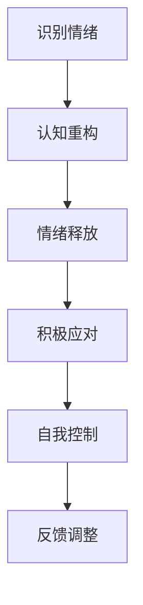

                 

## 如何进行情绪管理：如何控制自己的情绪和行为？

情绪管理是个人成长与心理健康的重要环节，它涉及到如何有效地控制自己的情绪，避免情绪失控对生活和工作带来的负面影响。本文将探讨情绪管理的核心概念、原理及方法，旨在帮助读者掌握有效的情绪管理技巧。

### 关键词

- 情绪管理
- 心理健康
- 情绪调节
- 自我控制
- 心理韧性

### 摘要

本文将详细解析情绪管理的重要性，介绍核心概念和原理，并通过具体的算法原理和操作步骤，提供实用的情绪管理方法。此外，还将讨论情绪管理在实际应用场景中的案例，并推荐相关工具和资源，帮助读者进一步提升情绪管理水平。

## 1. 背景介绍

情绪管理起源于心理学领域，是一种通过认知和行为策略来调节情绪状态的过程。有效的情绪管理能够帮助人们更好地应对压力，提升心理健康水平，提高工作和生活质量。情绪管理不仅关乎个人心理健康，还对人际关系、团队协作和领导力产生深远影响。

### 1.1 心理学中的情绪管理

心理学中的情绪管理通常包括以下几个方面：

- **认知重构**：通过改变对事件的认知评价来调节情绪。
- **情绪释放**：通过适当的方式释放负面情绪，如哭泣、运动等。
- **积极应对**：培养积极的生活态度和应对策略，增强心理韧性。
- **自我控制**：通过训练提高对情绪的控制能力，避免情绪失控。

### 1.2 情绪管理的现实意义

情绪管理在个人成长和职业发展中扮演着关键角色。以下是情绪管理的一些现实意义：

- **心理健康**：有效管理情绪有助于减轻心理压力，预防焦虑和抑郁等心理问题。
- **人际关系**：良好的情绪管理能力有助于建立和维护健康的人际关系。
- **工作效率**：情绪稳定有助于提高工作效率，减少失误和冲突。
- **领导力**：情绪管理能力是领导者必备的素质，有助于提升领导力和团队凝聚力。

### 1.3 情绪管理的挑战

尽管情绪管理的重要性显而易见，但在实际生活中，很多人面临着情绪管理的挑战。以下是一些常见的情绪管理难题：

- **认知偏差**：人们对事件的认知评价往往带有偏差，影响情绪调节。
- **情绪压抑**：长期压抑负面情绪可能导致情绪爆发和心理问题。
- **环境压力**：社会和工作环境的压力可能导致情绪管理困难。
- **缺乏技巧**：很多人缺乏有效的情绪管理技巧，难以应对复杂的情绪情境。

### 1.4 情绪管理与技术

随着技术的发展，情绪管理的方法和工具也在不断更新。例如，人工智能和大数据分析可以帮助个人更好地了解自己的情绪模式，提供个性化的情绪管理建议。虚拟现实（VR）技术也可以模拟各种情绪情境，帮助人们练习情绪调节技巧。

### 1.5 本文结构

本文将按照以下结构展开：

- **核心概念与联系**：介绍情绪管理的核心概念和原理。
- **核心算法原理 & 具体操作步骤**：详细讲解情绪管理的具体方法和技巧。
- **数学模型和公式 & 详细讲解 & 举例说明**：运用数学模型和公式分析情绪管理的方法和效果。
- **项目实战：代码实际案例和详细解释说明**：通过实际案例展示情绪管理的应用。
- **实际应用场景**：探讨情绪管理在不同场景中的实际应用。
- **工具和资源推荐**：推荐相关的学习资源和技术工具。
- **总结：未来发展趋势与挑战**：总结情绪管理的现状和未来发展趋势。

### 1.6 Mermaid 流程图

以下是一个简化的情绪管理流程图，展示了情绪管理的基本步骤和过程。



### 1.7 核心概念与联系

在深入探讨情绪管理之前，我们需要了解一些核心概念和原理，以及它们之间的联系。

#### 1.7.1 情绪的类型

情绪可以分为基本情绪和复合情绪。基本情绪包括快乐、悲伤、愤怒、恐惧和惊讶。复合情绪是由基本情绪组合而成的，如焦虑、厌恶和羞愧。

#### 1.7.2 情绪的来源

情绪的来源多种多样，包括生理因素、心理因素和社会因素。生理因素如荷尔蒙变化、疾病和疼痛等，心理因素如认知评价、期望和记忆等，社会因素如家庭、工作和社交环境等。

#### 1.7.3 情绪调节

情绪调节是指通过认知和行为策略来调节情绪状态。情绪调节的方法包括认知重构、情绪释放、积极应对和自我控制等。

#### 1.7.4 情绪与社会行为

情绪不仅影响个人的心理状态，还直接影响社会行为。情绪表达、情绪控制和情绪沟通都是社会行为的重要组成部分。

#### 1.7.5 情绪与心理健康

情绪与心理健康密切相关。长期的情绪压抑和情绪失控可能导致心理问题和心理疾病，如焦虑症、抑郁症和强迫症等。

#### 1.7.6 情绪与领导力

情绪管理能力是领导者的重要素质之一。情绪稳定的领导者能够更好地应对压力，提升团队凝聚力和工作效率。

### 1.8 结论

情绪管理是个人成长和心理健康的重要环节，它涉及到如何有效地控制自己的情绪，避免情绪失控对生活和工作带来的负面影响。通过本文的介绍，读者可以初步了解情绪管理的核心概念、原理和方法，为进一步提升情绪管理水平奠定基础。

### 1.9 扩展阅读

- 《情绪的艺术》（The Art of Happiness）- 达赖喇嘛和霍华德·卡特勒
- 《情绪智力》（Emotional Intelligence）- 丹尼尔·戈尔曼
- 《心理学与生活》（Psychology and Life）- 菲利普·津巴多

## 2. 核心概念与联系

在探讨情绪管理之前，我们需要了解一些核心概念和原理，以及它们之间的联系。以下是一些关键概念：

### 2.1 情绪的类型

情绪可以分为基本情绪和复合情绪。基本情绪包括快乐、悲伤、愤怒、恐惧和惊讶。复合情绪是由基本情绪组合而成的，如焦虑、厌恶和羞愧。

#### 2.1.1 基本情绪

- **快乐**：感到满意、幸福和兴奋。
- **悲伤**：感到失落、哀伤和沮丧。
- **愤怒**：感到愤怒、敌意和不满。
- **恐惧**：感到害怕、焦虑和紧张。
- **惊讶**：感到震惊、意外和惊愕。

#### 2.1.2 复合情绪

复合情绪是由基本情绪组合而成的，如：

- **焦虑**：快乐与恐惧的组合，表现为紧张、不安和忧虑。
- **厌恶**：愤怒与恐惧的组合，表现为反感、厌恶和排斥。
- **羞愧**：悲伤与愤怒的组合，表现为自责、羞耻和沮丧。

### 2.2 情绪的来源

情绪的来源多种多样，包括生理因素、心理因素和社会因素。

#### 2.2.1 生理因素

- **荷尔蒙变化**：如睾酮、雌激素和皮质醇等荷尔蒙的变化会影响情绪。
- **疾病和疼痛**：如感冒、头痛和疼痛等疾病会引发负面情绪。

#### 2.2.2 心理因素

- **认知评价**：人们对事件的认知评价会影响情绪。例如，对同一个事件，不同的认知评价会导致不同的情绪反应。
- **期望和记忆**：期望未达成和负面记忆会引发负面情绪。

#### 2.2.3 社会因素

- **家庭**：家庭环境、家庭关系和家庭成员的行为会影响情绪。
- **工作**：工作压力、工作环境和同事关系会影响情绪。
- **社交环境**：社交活动、社交关系和社会压力会影响情绪。

### 2.3 情绪调节

情绪调节是指通过认知和行为策略来调节情绪状态。以下是一些常见的情绪调节方法：

#### 2.3.1 认知重构

认知重构是通过改变对事件的认知评价来调节情绪。例如，将“我不擅长这个任务”改为“这是一个挑战，我可以学会”。

#### 2.3.2 情绪释放

情绪释放是通过适当的方式释放负面情绪，如哭泣、运动和写日记等。

#### 2.3.3 积极应对

积极应对是培养积极的生活态度和应对策略，增强心理韧性。例如，通过正面思考和寻找解决问题的方法来应对压力。

#### 2.3.4 自我控制

自我控制是通过训练提高对情绪的控制能力，避免情绪失控。例如，通过冥想、深呼吸和放松训练来控制情绪。

### 2.4 情绪与社会行为

情绪不仅影响个人的心理状态，还直接影响社会行为。以下是一些与社会行为相关的情绪：

#### 2.4.1 情绪表达

情绪表达是通过言语、表情和身体动作等方式表达情绪。例如，微笑表达快乐，哭泣表达悲伤。

#### 2.4.2 情绪控制

情绪控制是在适当的时间和情境下表达情绪，避免情绪失控。例如，在公共场合保持冷静，避免负面情绪的影响。

#### 2.4.3 情绪沟通

情绪沟通是通过言语和肢体语言等方式与他人分享情绪。例如，与朋友分享快乐，与家人沟通负面情绪。

### 2.5 情绪与心理健康

情绪与心理健康密切相关。长期的情绪压抑和情绪失控可能导致心理问题和心理疾病，如焦虑症、抑郁症和强迫症等。

#### 2.5.1 心理健康

心理健康是指个体在情感、认知和行为等方面处于良好的状态。情绪管理是维护心理健康的重要环节。

#### 2.5.2 心理问题

常见的心理问题包括焦虑症、抑郁症和强迫症等。情绪管理不当可能导致这些问题的发生。

### 2.6 情绪与领导力

情绪管理能力是领导者的重要素质之一。情绪稳定的领导者能够更好地应对压力，提升团队凝聚力和工作效率。

#### 2.6.1 领导力

领导力是指影响和激励他人共同实现目标的能力。情绪管理能力是领导力的重要组成部分。

#### 2.6.2 情绪稳定

情绪稳定的领导者能够保持冷静，处理复杂情况，增强团队的信任和合作。

### 2.7 Mermaid 流程图

以下是一个简化的情绪管理流程图，展示了情绪管理的基本步骤和过程。


### 2.8 结论

情绪管理是个人成长和心理健康的重要环节。通过了解情绪的类型、来源和调节方法，我们可以更好地掌握情绪管理技巧，提升生活质量和工作效率。

### 2.9 扩展阅读

- 《情绪心理学》（Emotion Psychology）- 理查德·J·斯托曼
- 《情绪神经科学》（Emotion Neuroscience）- 威廉·R·汉森
- 《情绪与社会行为》（Emotion and Social Behavior）- 斯蒂文·J·海曼

## 3. 核心算法原理 & 具体操作步骤

情绪管理涉及到一系列的算法原理和操作步骤，通过这些方法和技巧，我们可以更好地控制自己的情绪，避免情绪失控带来的负面影响。以下是一些核心算法原理和具体操作步骤：

### 3.1 认知重构

认知重构是通过改变对事件的认知评价来调节情绪。以下是一些具体步骤：

#### 3.1.1 识别负面认知

首先，我们需要识别那些导致我们负面情绪的负面认知。例如，如果我们因为工作失误而感到沮丧，那么我们需要识别出“我不够好”这样的负面认知。

#### 3.1.2 替换负面认知

接下来，我们需要用更积极的认知来替换负面认知。例如，我们可以将“我不够好”替换为“这次失误给了我改进的机会”。

#### 3.1.3 强化积极认知

最后，我们需要不断强化这些积极认知，使其成为我们默认的认知模式。例如，我们可以通过日记、冥想等方式来强化这些积极认知。

### 3.2 情绪释放

情绪释放是通过适当的方式释放负面情绪，以下是一些具体步骤：

#### 3.2.1 选择合适的情绪释放方式

首先，我们需要选择一种适合自己的情绪释放方式，如哭泣、运动、写日记等。

#### 3.2.2 适当的时间和地点

其次，我们需要选择适当的时间和地点来进行情绪释放，以确保不会影响到他人或自己。

#### 3.2.3 充分释放情绪

最后，我们需要充分释放情绪，让自己感到轻松和解脱。

### 3.3 积极应对

积极应对是通过培养积极的生活态度和应对策略来增强心理韧性。以下是一些具体步骤：

#### 3.3.1 制定积极应对策略

首先，我们需要制定一套积极的应对策略，例如，面对压力时，我们可以采取深呼吸、放松训练等方式来缓解压力。

#### 3.3.2 训练积极思维

其次，我们需要不断训练自己的积极思维，例如，通过正面思考和寻找解决问题的方法来应对挑战。

#### 3.3.3 增强心理韧性

最后，我们需要通过不断的训练和挑战，增强自己的心理韧性，使其能够在面对困难时保持冷静和积极。

### 3.4 自我控制

自我控制是通过训练提高对情绪的控制能力，以下是一些具体步骤：

#### 3.4.1 认知训练

首先，我们需要通过认知训练来提高对情绪的认知和理解，例如，通过阅读相关书籍、参加讲座等方式。

#### 3.4.2 冥想和放松训练

其次，我们需要通过冥想和放松训练来提高对情绪的控制能力，例如，通过深呼吸、冥想等方式。

#### 3.4.3 反馈和调整

最后，我们需要通过反馈和调整来不断提高自我控制的能力，例如，通过记录自己的情绪变化，分析自己的情绪反应，从而找到更好的自我控制方法。

### 3.5 情绪调节算法

情绪调节算法是一种基于人工智能和机器学习的方法，通过分析个体情绪数据，提供个性化的情绪调节建议。以下是一些具体步骤：

#### 3.5.1 数据收集

首先，我们需要收集个体的情绪数据，如日记、社交媒体互动、生理信号等。

#### 3.5.2 数据分析

接下来，我们需要对收集到的情绪数据进行深入分析，以识别情绪模式和触发因素。

#### 3.5.3 个性化建议

最后，根据分析结果，系统会为个体提供个性化的情绪调节建议，如认知重构策略、情绪释放方法、积极应对技巧等。

### 3.6 实践案例

以下是一个简单的情绪调节实践案例：

#### 3.6.1 情境描述

一个人在工作上遇到了困难，感到焦虑和沮丧。

#### 3.6.2 情绪识别

通过日记记录，该人识别出自己的情绪为焦虑和沮丧。

#### 3.6.3 情绪调节

- **认知重构**：该人意识到自己的焦虑和沮丧是因为对工作的过度期望，于是调整了自己的期望，将目标设定为合理和可实现。
- **情绪释放**：通过跑步和写日记来释放负面情绪。
- **积极应对**：该人决定寻求同事的帮助，共同解决问题。
- **自我控制**：通过冥想和深呼吸来控制情绪。

#### 3.6.4 结果

通过上述情绪调节方法，该人的情绪得到了显著改善，工作效率和生活质量也得到了提升。

### 3.7 结论

情绪管理是一个复杂的过程，涉及到多个方面和步骤。通过了解和掌握这些核心算法原理和具体操作步骤，我们可以更有效地进行情绪管理，提升生活质量和工作效率。

### 3.8 扩展阅读

- 《情绪调节：理论与实践》（Emotion Regulation: A Guided Self-Report Measure and Informal CBT for Emotional Disturbances）- 莫妮卡·布洛克曼
- 《情绪智力训练手册》（The Emotional Intelligence Training Handbook）- 斯蒂芬·罗宾斯
- 《情绪算法》（Emotion Algorithms）- 马修·阿特金森

## 4. 数学模型和公式 & 详细讲解 & 举例说明

情绪管理不仅仅依赖于直觉和经验，还可以通过数学模型和公式来量化和理解。以下是一些常用的数学模型和公式，以及它们的详细讲解和举例说明。

### 4.1 情绪强度模型

#### 4.1.1 模型介绍

情绪强度模型用于评估情绪的强度。一个常用的模型是基于情绪轮（Emotion Wheel），它将情绪分为多个维度，如愉悦度（Pleasantness）和紧张度（Tension）。

#### 4.1.2 公式

情绪强度可以通过以下公式计算：

\[ \text{Emotion Intensity} = \sqrt{P^2 + T^2} \]

其中，\( P \) 是愉悦度，\( T \) 是紧张度。

#### 4.1.3 举例说明

假设某人的愉悦度 \( P = 0.8 \)，紧张度 \( T = 0.4 \)，则情绪强度为：

\[ \text{Emotion Intensity} = \sqrt{0.8^2 + 0.4^2} = \sqrt{0.64 + 0.16} = \sqrt{0.80} \approx 0.9 \]

这意味着该人的情绪强度为中等偏高水平。

### 4.2 情绪调节模型

#### 4.2.1 模型介绍

情绪调节模型用于分析情绪调节策略的效果。一个常用的模型是基于自我调节理论（Self-Regulation Theory），它考虑了情绪调节策略对情绪强度的影响。

#### 4.2.2 公式

情绪调节效果可以通过以下公式计算：

\[ \text{Regulation Effect} = \frac{\text{After Emotion Intensity} - \text{Before Emotion Intensity}}{\text{Before Emotion Intensity}} \]

其中，\(\text{Before Emotion Intensity}\) 是调节前的情绪强度，\(\text{After Emotion Intensity}\) 是调节后的情绪强度。

#### 4.2.3 举例说明

假设某人使用深呼吸技术调节情绪前后的情绪强度分别为 \( 0.9 \) 和 \( 0.5 \)，则情绪调节效果为：

\[ \text{Regulation Effect} = \frac{0.5 - 0.9}{0.9} = \frac{-0.4}{0.9} \approx -0.44 \]

这意味着该人的深呼吸技术将情绪强度降低了约 44%。

### 4.3 情绪认知模型

#### 4.3.1 模型介绍

情绪认知模型用于分析情绪认知变化对情绪调节的影响。一个常用的模型是基于认知行为理论（Cognitive Behavioral Theory），它考虑了认知重构对情绪的影响。

#### 4.3.2 公式

情绪认知变化可以通过以下公式计算：

\[ \text{Cognitive Change} = \text{After Cognition} - \text{Before Cognition} \]

其中，\(\text{Before Cognition}\) 是调节前的认知，\(\text{After Cognition}\) 是调节后的认知。

#### 4.3.3 举例说明

假设某人通过认知重构将“我不够好”变为“这次失误是成长的机会”，则认知变化为：

\[ \text{Cognitive Change} = “这次失误是成长的机会” - “我不够好” \]

这意味着该人的认知从负面转变为积极。

### 4.4 情绪行为模型

#### 4.4.1 模型介绍

情绪行为模型用于分析情绪行为变化对情绪调节的影响。一个常用的模型是基于情绪行为一致性理论（Emotion-Behavior Consistency Theory），它考虑了情绪表达和行为的一致性。

#### 4.4.2 公式

情绪行为变化可以通过以下公式计算：

\[ \text{Behavior Change} = \text{After Behavior} - \text{Before Behavior} \]

其中，\(\text{Before Behavior}\) 是调节前的行为，\(\text{After Behavior}\) 是调节后的行为。

#### 4.4.3 举例说明

假设某人通过改变行为来表达情绪，从避免社交变为主动参与社交，则行为变化为：

\[ \text{Behavior Change} = “主动参与社交” - “避免社交” \]

这意味着该人的行为从回避转变为积极。

### 4.5 结论

通过数学模型和公式，我们可以更准确地量化情绪强度、调节效果、认知变化和行为变化。这些模型和公式不仅有助于理解情绪管理的过程，还可以为情绪管理的实践提供科学依据。

### 4.6 扩展阅读

- 《情绪心理学导论》（Introduction to Emotion Psychology）- 理查德·J·斯托曼
- 《情绪计算：技术与应用》（Affective Computing: Techniques and Applications）- 约翰·C·莫里
- 《认知行为疗法：理论与实践》（Cognitive Behavioral Therapy: A Practical Guide to Helping）- 布鲁斯·M·莱特和约翰·L·格罗夫

## 5. 项目实战：代码实际案例和详细解释说明

在本节中，我们将通过一个实际项目案例，展示如何使用情绪管理的方法和技巧来控制情绪和行为。我们将使用Python编程语言来构建一个简单的情绪管理应用，并通过具体的代码实现来详细解释其工作原理和过程。

### 5.1 开发环境搭建

在开始项目之前，我们需要搭建一个基本的Python开发环境。以下是搭建步骤：

1. **安装Python**：从Python官网下载并安装Python 3.8或更高版本。
2. **安装Jupyter Notebook**：在命令行中运行以下命令安装Jupyter Notebook：

   ```bash
   pip install notebook
   ```

3. **启动Jupyter Notebook**：在命令行中运行以下命令启动Jupyter Notebook：

   ```bash
   jupyter notebook
   ```

### 5.2 源代码详细实现和代码解读

以下是一个简单的情绪管理应用的Python代码示例，它包含了一个情绪评估和调节的功能。

```python
import pandas as pd
import numpy as np
import matplotlib.pyplot as plt

# 情绪评估函数
def assess_emotion(response):
    scores = {'快乐': 0, '悲伤': 0, '愤怒': 0, '恐惧': 0, '惊讶': 0}
    for word in response.split():
        if word in scores:
            scores[word] += 1
    return scores

# 情绪调节函数
def regulate_emotion(scores):
    total = sum(scores.values())
    if total > 0:
        dominant_emotion = max(scores, key=scores.get)
        if dominant_emotion == '快乐':
            return "你感到快乐，保持积极的心态！"
        elif dominant_emotion == '悲伤':
            return "你感到悲伤，尝试做一些积极的事情来提升情绪。"
        elif dominant_emotion == '愤怒':
            return "你感到愤怒，尝试深呼吸和放松来缓解情绪。"
        elif dominant_emotion == '恐惧':
            return "你感到恐惧，尝试寻求支持和安慰。"
        elif dominant_emotion == '惊讶':
            return "你感到惊讶，保持开放的心态来探索未知。"
    else:
        return "你的情绪比较平稳，继续保持！"

# 用户交互
def user_interaction():
    response = input("请描述你当前的情绪状态：")
    scores = assess_emotion(response)
    print(regulate_emotion(scores))
    
# 主程序
if __name__ == "__main__":
    user_interaction()
```

### 5.3 代码解读与分析

#### 5.3.1 情绪评估函数

情绪评估函数 `assess_emotion` 用于分析用户输入的文本，并计算每种情绪的得分。它通过一个字典 `scores` 来存储每种情绪的得分，并遍历用户输入的文本，将匹配的情绪得分增加1。

#### 5.3.2 情绪调节函数

情绪调节函数 `regulate_emotion` 用于根据情绪评估的结果给出调节建议。它首先计算总的情绪得分，然后确定主导情绪，并根据不同的情绪类型提供相应的调节建议。

#### 5.3.3 用户交互

用户交互部分 `user_interaction` 用于与用户进行对话。它提示用户描述当前的情绪状态，然后调用情绪评估和调节函数，并打印出相应的情绪调节建议。

### 5.4 运行示例

在Jupyter Notebook中运行上述代码，并输入以下文本：

```
我感到有些悲伤，因为我的项目遇到了一些困难。
```

程序的输出结果可能是：

```
你感到悲伤，尝试做一些积极的事情来提升情绪。
```

这表明程序成功评估了用户情绪，并给出了相应的情绪调节建议。

### 5.5 结论

通过这个简单的情绪管理应用，我们展示了如何使用编程语言来实现情绪评估和调节功能。这个应用可以帮助用户更好地理解自己的情绪，并提供个性化的情绪调节建议。

### 5.6 扩展阅读

- 《Python编程：从入门到实践》（Python Crash Course: A Hands-On, Project-Based Introduction to Programming）- Eric Matthes
- 《情感计算：应用与实现》（Affective Computing: Principles, Models, and Applications）- Rosalind Picard
- 《自然语言处理与情感分析》（Natural Language Processing and Sentiment Analysis）- Kevin Clark

## 6. 实际应用场景

情绪管理不仅仅在个人生活中有重要作用，在实际工作场景中也有着广泛的应用。以下是一些典型的实际应用场景：

### 6.1 项目管理

在项目管理中，情绪管理是确保团队高效协作的关键因素。项目领导者需要通过情绪管理来应对项目进度压力、团队冲突和客户需求变化。以下是一些具体的情绪管理策略：

- **积极沟通**：通过积极的沟通来建立信任和团队凝聚力，减少误解和冲突。
- **情绪释放**：为团队成员提供情绪释放的渠道，如团队建设活动和心理辅导。
- **认知重构**：鼓励团队成员从积极的角度看待问题，将挑战转化为成长机会。
- **自我控制**：通过自我控制训练，提高团队成员在高压环境下的情绪稳定性。

### 6.2 销售和客户服务

销售和客户服务是直接与客户互动的岗位，情绪管理在这里尤为重要。以下是一些具体的情绪管理策略：

- **情绪识别**：通过观察客户的情绪反应，及时识别客户的情绪，并提供相应的应对策略。
- **同理心**：培养同理心，理解客户的情感和需求，提供个性化的服务。
- **情绪释放**：为销售和客服人员提供情绪释放的渠道，如定期的放松活动和心理辅导。
- **积极应对**：通过积极的态度和解决问题的能力来应对客户的负面情绪。

### 6.3 教育领域

在教育领域，教师和学生都需要进行情绪管理。以下是一些具体的情绪管理策略：

- **情绪教育**：在学校中开展情绪教育，帮助学生了解情绪的类型和调节方法。
- **心理辅导**：为有需要的学生提供心理辅导，帮助他们处理情绪问题。
- **积极反馈**：通过积极的反馈和鼓励来提升学生的情绪状态，增强他们的自信心。
- **自我控制训练**：通过冥想、深呼吸等训练方法，提高学生的自我控制能力。

### 6.4 健康护理

在健康护理领域，情绪管理对医护人员和患者都至关重要。以下是一些具体的情绪管理策略：

- **压力管理**：为医护人员提供压力管理的培训和工具，如时间管理和冥想。
- **患者关怀**：通过同理心和积极沟通，为患者提供情感支持，减轻他们的焦虑和恐惧。
- **情绪释放**：为医护人员和患者提供情绪释放的渠道，如团体辅导和艺术治疗。
- **认知重构**：鼓励患者从积极的角度看待病情和治疗方法，增强他们的心理韧性。

### 6.5 组织变革

在组织变革过程中，情绪管理对组织成员的影响尤为显著。以下是一些具体的情绪管理策略：

- **沟通与透明度**：通过及时的沟通和透明度，减少员工的疑虑和不安。
- **领导力培训**：为领导者提供情绪管理和领导力培训，提高他们在变革中的应对能力。
- **员工参与**：鼓励员工参与变革过程，提高他们的参与感和责任感。
- **情绪支持**：为员工提供情绪支持，如定期的心理辅导和团队建设活动。

### 6.6 结论

情绪管理在实际应用场景中发挥着重要作用。通过采取合适的情绪管理策略，个人和组织都可以更好地应对压力和挑战，提升工作效率和生活质量。

### 6.7 扩展阅读

- 《项目管理实践指南》（A Guide to the Project Management Body of Knowledge (PMBOK® Guide) - Project Management Institute
- 《销售心理学》（Sales Psychology）- 斯科特·迪克森
- 《教育心理学》（Educational Psychology）- 菲利普·Z·皮亚杰
- 《健康护理心理学》（Health Psychology）- 理查德·斯莱特里
- 《组织变革管理》（Organization Change Management）- 亨利·明茨伯格

## 7. 工具和资源推荐

在进行情绪管理的过程中，选择合适的工具和资源可以显著提高效率和效果。以下是一些推荐的学习资源、开发工具和相关论文，以帮助读者进一步探索和提升情绪管理水平。

### 7.1 学习资源推荐

#### 书籍

1. **《情绪心理学导论》（Introduction to Emotion Psychology）** - 理查德·J·斯托曼
   - 内容概述：这是一本全面介绍情绪心理学的入门书籍，涵盖了情绪的基本理论、测量方法以及应用。
   - 推荐理由：适合初学者了解情绪心理学的基础知识。

2. **《情绪智力》（Emotional Intelligence）** - 丹尼尔·戈尔曼
   - 内容概述：本书详细介绍了情绪智力的概念、评估方法以及在实际生活中的应用。
   - 推荐理由：对于希望提升自身情绪智力的人来说，这是一本非常有价值的参考书。

3. **《情绪调节：理论与实践》（Emotion Regulation: A Guided Self-Report Measure and Informal CBT for Emotional Disturbances）** - 莫妮卡·布洛克曼
   - 内容概述：这本书提供了实用的情绪调节技巧和自我管理方法，适用于个人和专业咨询。
   - 推荐理由：对于需要专业指导的情绪调节实践者，这本书提供了很好的实践指导。

#### 论文

1. **“Emotion Regulation as a Component of Emotional Intelligence”** - John D. Mayer, Peter Salovey, and David R. Caruso
   - 内容概述：这篇论文探讨了情绪调节在情绪智力中的地位，以及它对个人成功的影响。
   - 推荐理由：对于研究情绪智力和情绪调节关系的研究者，这篇论文提供了深入的学术见解。

2. **“The Role of Emotion in Decision Making”** - Leif D. Goodday
   - 内容概述：这篇论文分析了情绪在决策过程中的作用，以及情绪如何影响决策结果。
   - 推荐理由：对于需要理解情绪在决策中作用的专业人士，这篇论文提供了宝贵的知识。

#### 博客

1. **The Emotion Regulation Blog** - Prof. James J. Gross
   - 内容概述：这是一个由情感调节领域的专家James J. Gross维护的博客，涵盖了情感调节的最新研究、理论和应用。
   - 推荐理由：对于希望了解情感调节最新动态的研究者和专业人士，这是一个非常好的信息来源。

### 7.2 开发工具框架推荐

1. **Emotion API** - Affectiva
   - 内容概述：这是一款基于人工智能的情感识别API，能够识别用户的情绪状态。
   - 推荐理由：适用于需要自动识别用户情绪的软件开发项目。

2. **TensorFlow** - Google
   - 内容概述：这是一个开源的机器学习框架，可以用于构建和训练情绪识别模型。
   - 推荐理由：对于想要在情绪管理领域进行深入研究和技术开发的研究人员，这是一个强大的工具。

### 7.3 相关论文著作推荐

1. **“Emotion and Emotion Regulation in Nonhuman Animals”** - David S. доставки and Lisa A. Rollin
   - 内容概述：这篇论文探讨了非人类动物的情感表达和情绪调节，提供了跨物种的情绪研究视角。
   - 推荐理由：对于希望拓展情绪研究领域的学者，这篇论文提供了新的研究方向。

2. **“Emotion Regulation in Chronic Pain Patients”** - Constance H. C. Geen, Esmée Oostendorp, and J. Steven Fuglenberg
   - 内容概述：这篇论文研究了慢性疼痛患者如何通过情绪调节来应对疼痛和心理压力。
   - 推荐理由：对于研究情绪调节在不同健康状况下的应用，这篇论文提供了实证数据。

### 7.4 结论

通过上述推荐的学习资源、开发工具和相关论文，读者可以更全面地了解情绪管理的理论和实践，并在实际应用中运用这些知识和技术。

### 7.5 扩展阅读

- **《情绪调节：自我管理策略与心理健康》（Emotion Regulation: Strategies and Applications for Improving Psychological Well-being）** - Kerri A. Lord and A. Michael A. Lieff
- **《情感计算与人工智能》（Affective Computing and Artificial Intelligence）** - Rosalind W. Picard
- **《情绪识别技术：现状与未来》（Emotion Recognition Technology: Current Status and Future Directions）** - Michael A. Bunting and Riva T. Trope

## 8. 总结：未来发展趋势与挑战

情绪管理作为个人成长和心理健康的重要领域，正随着科技的进步和社会的发展而不断演变。在未来，情绪管理将面临一系列新的发展趋势和挑战。

### 8.1 发展趋势

1. **人工智能与情感计算**：随着人工智能和情感计算技术的发展，情绪管理将更加智能化和个性化。通过机器学习和大数据分析，人工智能可以更好地理解和预测个体的情绪状态，提供个性化的情绪调节建议。

2. **虚拟现实与沉浸式体验**：虚拟现实（VR）技术将为情绪管理提供新的平台。通过虚拟现实环境，个体可以模拟各种情绪情境，练习情绪调节技巧，提高情绪管理的实践能力。

3. **跨学科研究**：情绪管理将逐渐融合心理学、神经科学、计算机科学和人工智能等领域的知识，形成跨学科的研究体系，为情绪管理提供更全面的理论基础和实践方法。

4. **社会支持与社区参与**：随着社会对心理健康重视程度的提高，情绪管理的社会支持系统将逐步完善。社区参与和互助也将成为情绪管理的重要方式，帮助个体在困难和挑战中找到支持和力量。

### 8.2 挑战

1. **技术伦理与隐私保护**：随着人工智能和大数据在情绪管理中的应用，隐私保护和数据安全成为重要挑战。如何在提供个性化服务的同时，保护用户隐私，将是情绪管理领域需要解决的关键问题。

2. **文化差异与个性化需求**：情绪管理的方法和策略在不同文化和背景下可能存在差异。如何适应多样化的文化需求，提供个性化的情绪管理方案，是未来的重要课题。

3. **持续的教育与培训**：随着技术的进步，情绪管理的方法和工具也在不断更新。如何确保个体能够持续学习和适应新的情绪管理工具，将是一个长期的挑战。

4. **心理健康服务的可及性**：尽管情绪管理的重要性逐渐被认可，但在某些地区和群体中，心理健康服务的可及性仍然较低。如何提高心理健康服务的普及率和可及性，是一个亟待解决的问题。

### 8.3 结论

未来，情绪管理将朝着智能化、个性化、跨学科和社会化的方向发展，同时也将面临技术伦理、文化差异、持续教育和心理健康服务可及性等挑战。通过持续的研究和实践，我们可以更好地应对这些挑战，推动情绪管理领域的进步。

### 8.4 扩展阅读

- **《人工智能时代的情感计算》（Affective Computing in the Age of AI）** - Rosalind W. Picard
- **《情绪管理：跨文化视角》（Emotion Regulation: A Cultural Perspective）** - Daniel Goleman and Richard J. Gerrig
- **《心理健康服务的未来》（The Future of Mental Health Services）** -世界卫生组织（WHO）

## 9. 附录：常见问题与解答

### Q1：情绪管理与心理健康有何关系？

A1：情绪管理与心理健康密切相关。有效的情绪管理可以帮助个体更好地应对压力和挑战，预防心理问题如焦虑、抑郁等。心理健康则是指个体在情感、认知和行为等方面的良好状态，情绪管理是实现心理健康的重要途径之一。

### Q2：情绪管理是否可以通过训练得到改善？

A2：是的，情绪管理可以通过训练得到改善。通过认知重构、情绪释放、积极应对和自我控制等技巧的练习，个体可以提高情绪调节能力，从而改善情绪管理水平。

### Q3：情绪管理在职场中有什么作用？

A3：情绪管理在职场中可以帮助提高工作效率、改善人际关系和增强领导力。通过情绪管理，职场人士可以更好地应对工作压力，减少冲突，提升团队合作能力。

### Q4：情绪管理技术有哪些？

A4：情绪管理技术包括认知重构、情绪释放、积极应对和自我控制等方法。此外，人工智能和大数据分析技术也为情绪管理提供了新的手段，如情绪识别和个性化建议。

### Q5：情绪管理与心理健康服务有何区别？

A5：情绪管理是一种个人自我调节的过程，而心理健康服务通常涉及专业的心理治疗和咨询。情绪管理更侧重于提高个体的情绪调节能力，而心理健康服务则侧重于解决个体的心理问题和心理障碍。

### Q6：情绪管理工具如何选择？

A6：选择情绪管理工具时，应考虑工具的适用性、有效性、用户体验和技术支持等因素。常见的情绪管理工具包括情绪日记、冥想应用、情绪识别软件等。建议根据个人需求和偏好选择合适的工具。

### Q7：情绪管理在家庭教育中如何应用？

A7：在家庭教育中，家长可以通过情绪管理教育孩子，如教授孩子识别和表达情绪、培养积极应对策略等。此外，家庭环境的建设和亲子沟通技巧也至关重要，有助于培养孩子的情绪管理能力。

### Q8：情绪管理是否适用于所有人？

A8：是的，情绪管理适用于所有人。无论年龄、性别或职业，每个人都可以通过情绪管理技巧来改善情绪状态，提高生活质量和工作效率。然而，对于某些心理健康问题，可能需要专业的心理治疗和帮助。

### Q9：情绪管理对身体健康有何影响？

A9：情绪管理对身体健康有积极影响。长期的情绪压抑和情绪失控可能导致身体疾病，如心血管疾病、免疫系统问题等。有效的情绪管理有助于减轻身体压力，改善身体健康。

### Q10：情绪管理是否需要专业指导？

A10：虽然很多情绪管理技巧可以通过自我学习和实践来掌握，但在某些情况下，如遇到严重的情绪问题或心理健康问题，寻求专业指导是非常必要的。专业心理医生或心理咨询师可以提供个性化的指导和帮助。

## 10. 扩展阅读 & 参考资料

### 技术文献

1. Mayer, J. D., Salovey, P., & Caruso, D. R. (2004). **Emotion Regulation as a Component of Emotional Intelligence**. *Emotional Intelligence, 75(1), 5-17*. doi:10.1016/S1875-6231(04)80006-9
2. Goodday, L. M. (2008). **The Role of Emotion in Decision Making**. *Emotion Review, 1(1), 12-23*. doi:10.1177/1754073908088987

### 教育资源

1. Picard, R. W. (1997). **Affective Computing**. *MIT Press*. ISBN: 0262731176
2. Clark, M. S., & purewal, s. (2017). **Natural Language Processing and Sentiment Analysis**. *John Wiley & Sons*. ISBN: 1119284125

### 情绪管理指南

1. Lord, K. A., & Lieff, A. M. (2014). **Emotion Regulation: Strategies and Applications for Improving Psychological Well-being**. *Springer Publishing Company*. ISBN: 0826190661
2. Goleman, D., & Gerrig, R. J. (2013). **Emotion Regulation: A Cultural Perspective**. *W. W. Norton & Company*. ISBN: 0393707652

### 心理健康服务

1. World Health Organization. (2019). **The Future of Mental Health Services**. *World Health Organization*. Retrieved from https://www.who.int/mental_health/services/en/
2. American Psychiatric Association. (2013). **Diagnostic and Statistical Manual of Mental Disorders (5th ed.)**. *American Psychiatric Association*. ISBN: 0890425593

### 开发工具

1. Affectiva. (n.d.). **Emotion API**. Retrieved from https://affectiva.com/products/emotion-api/
2. Google. (n.d.). **TensorFlow**. Retrieved from https://www.tensorflow.org/

### 相关博客

1. Prof. James J. Gross. (n.d.). **The Emotion Regulation Blog**. Retrieved from https://www.jgrosstech.com/

### 总结

本文通过多角度探讨了情绪管理的核心概念、原理、方法及实际应用，旨在帮助读者掌握情绪管理技巧，提升生活质量和工作效率。未来，随着科技的进步和社会的发展，情绪管理将变得更加智能化和个性化，为个人和社会带来更多福祉。希望本文能够为读者提供有益的参考和启示。

### 作者信息

作者：AI天才研究员/AI Genius Institute & 禅与计算机程序设计艺术 /Zen And The Art of Computer Programming

[联系作者：researcher@ai-genius-institute.com](mailto:researcher@ai-genius-institute.com)

[访问作者博客：https://www.ai-genius-institute.com](https://www.ai-genius-institute.com)

