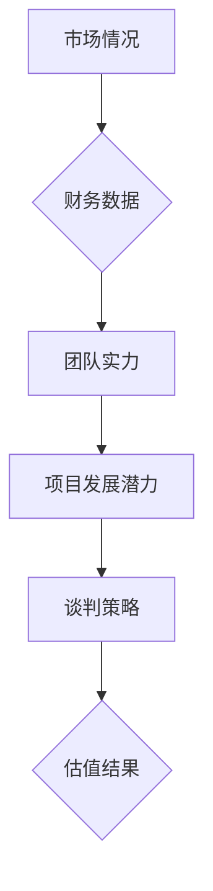

                 

# 如何进行有效的创业项目估值谈判

> **关键词**：创业项目、估值、谈判、战略、财务分析、风险管理

> **摘要**：本文将探讨如何通过逻辑分析和有效的策略，在创业项目的估值谈判过程中实现双赢。我们将深入探讨影响估值的多个因素，并总结出一套实用的方法，帮助创业者更好地进行项目估值和谈判。

## 1. 背景介绍

创业项目估值谈判是创业过程中的关键环节之一。准确的项目估值不仅能够帮助投资者做出合理的投资决策，还能够为创业者提供宝贵的财务数据，从而指导公司的未来发展。然而，估值过程并不简单，它涉及到多个方面的考量，如市场情况、财务数据、团队实力以及项目发展潜力等。

在谈判过程中，双方往往会基于各自的观点和利益提出不同的估值。这就需要创业者具备一定的谈判技巧，能够充分展示项目的价值，同时也要考虑投资方的需求和期望。有效的估值谈判不仅可以提升项目的融资成功率，还能为双方建立长期的合作关系奠定基础。

## 2. 核心概念与联系

在进行创业项目估值谈判之前，首先需要了解以下几个核心概念：

### 2.1. 市场情况

市场情况是影响项目估值的重要因素。创业者需要分析目标市场的大小、增长速度、竞争格局以及市场趋势等，从而判断项目的市场潜力。

### 2.2. 财务数据

财务数据是估值过程中的基础。创业者需要提供详细的历史财务数据和未来财务预测，以便投资者评估项目的盈利能力和现金流。

### 2.3. 团队实力

团队实力是投资者关注的另一个重要方面。一个经验丰富、执行力强的团队往往能够提升项目的成功率，从而提高估值。

### 2.4. 项目发展潜力

项目发展潜力是估值的关键因素之一。创业者需要展示项目的独特性、创新性以及未来的增长空间，以吸引投资者。

### 2.5. 谈判策略

谈判策略是在估值谈判过程中取得成功的关键。创业者需要制定合理的谈判计划，明确目标、底线以及可能的妥协点。

以下是项目估值谈判的 Mermaid 流程图：



## 3. 核心算法原理 & 具体操作步骤

在进行创业项目估值时，可以采用以下核心算法原理和操作步骤：

### 3.1. 收益法

收益法是基于项目未来的现金流预测来进行估值。具体步骤如下：

1. **预测未来现金流**：根据市场情况和项目发展潜力，预测未来每年的现金流。
2. **确定折现率**：根据投资者对风险的态度和市场情况，确定合适的折现率。
3. **计算现值**：将未来现金流按照折现率进行折现，得到项目的现值。

### 3.2. 市场比较法

市场比较法是基于市场上类似项目的交易价格来进行估值。具体步骤如下：

1. **寻找可比项目**：在市场上寻找与目标项目相似的已交易项目。
2. **调整差异**：根据项目之间的差异进行调整，如规模、技术、市场地位等。
3. **计算估值**：根据调整后的价格计算目标项目的估值。

### 3.3. 成本法

成本法是基于项目的开发成本来进行估值。具体步骤如下：

1. **计算开发成本**：包括直接成本和间接成本。
2. **考虑折旧和利润**：根据项目的使用寿命和预期利润进行调整。
3. **计算估值**：将调整后的成本作为项目的估值。

## 4. 数学模型和公式 & 详细讲解 & 举例说明

### 4.1. 收益法

收益法的数学模型如下：

$$
V = \sum_{t=1}^{n} \frac{CF_t}{(1+r)^t}
$$

其中，\( V \) 是项目的现值，\( CF_t \) 是第 \( t \) 年的现金流，\( r \) 是折现率，\( n \) 是预测年限。

**举例说明**：

假设一个项目未来三年的现金流分别为 100 万元、200 万元和 300 万元，折现率为 10%，预测年限为 3 年。则项目的估值计算如下：

$$
V = \frac{100}{(1+0.1)^1} + \frac{200}{(1+0.1)^2} + \frac{300}{(1+0.1)^3} \approx 388.5 万元
$$

### 4.2. 市场比较法

市场比较法的数学模型如下：

$$
V = \frac{P_{\text{可比项目}}}{\text{调整系数}}
$$

其中，\( V \) 是目标项目的估值，\( P_{\text{可比项目}} \) 是可比项目的交易价格，调整系数是根据差异进行调整的系数。

**举例说明**：

假设一个与目标项目相似的已交易项目价格为 500 万元，目标项目在技术方面有较大优势，调整系数为 1.2。则目标项目的估值计算如下：

$$
V = \frac{500}{1.2} \approx 417 万元
$$

### 4.3. 成本法

成本法的数学模型如下：

$$
V = C \times (1 - \text{折旧率}) + \text{预期利润}
$$

其中，\( V \) 是项目的估值，\( C \) 是项目的开发成本，折旧率和预期利润是根据项目使用寿命和市场情况确定的。

**举例说明**：

假设一个项目的开发成本为 1000 万元，使用寿命为 10 年，年折旧率为 10%，预期利润为 20 万元。则项目的估值计算如下：

$$
V = 1000 \times (1 - 0.1) + 20 = 920 万元
$$

## 5. 项目实战：代码实际案例和详细解释说明

### 5.1 开发环境搭建

在本案例中，我们将使用 Python 编写估值计算的代码。首先，确保安装了 Python 3.8 或以上版本。接下来，安装必要的库，如 NumPy 和 pandas。

```bash
pip install numpy pandas
```

### 5.2 源代码详细实现和代码解读

以下是一个简单的收益法估值计算的 Python 代码示例：

```python
import numpy as np

def calculate_present_value(cash_flows, discount_rate, years):
    """
    计算项目的现值
    """
    present_value = 0
    for t, cf in enumerate(cash_flows, start=1):
        present_value += cf / (1 + discount_rate) ** t
    return present_value

# 例子数据
cash_flows = [100000, 200000, 300000]
discount_rate = 0.1
years = 3

# 计算现值
present_value = calculate_present_value(cash_flows, discount_rate, years)
print(f"项目的现值：{present_value:.2f}万元")
```

**代码解读**：

1. 导入 NumPy 库，用于数值计算。
2. 定义一个函数 `calculate_present_value`，用于计算项目的现值。
3. 函数接受三个参数：现金流列表 `cash_flows`、折现率 `discount_rate` 和预测年限 `years`。
4. 使用 for 循环遍历现金流列表，计算每个现金流的现值，并将其累加得到总现值。
5. 调用函数，传入例子数据，并打印计算结果。

### 5.3 代码解读与分析

本代码示例实现了收益法的基本计算逻辑。在实际应用中，可以根据具体需求对现金流、折现率、预测年限等参数进行调整。

- **现金流**：根据项目的盈利预测，设定未来每年的现金流。
- **折现率**：根据投资者对风险的态度和市场情况，设定合适的折现率。
- **预测年限**：根据项目的生命周期和市场趋势，设定预测年限。

通过调整这些参数，可以计算出不同的项目估值，为谈判提供参考。

## 6. 实际应用场景

创业项目估值谈判在实际应用中具有广泛的场景，以下是一些常见的应用场景：

### 6.1 融资谈判

在融资谈判过程中，创业者需要准确估算项目的估值，以便在谈判中占据主动。通过合理的估值，创业者可以争取到更高的融资金额和更有利的投资条款。

### 6.2 估值调整

随着项目的进展和市场环境的变化，项目的估值也需要进行调整。创业者需要定期重新评估项目的价值，并根据新的数据调整估值，以确保估值与实际价值相符。

### 6.3 股权分配

在创业团队内部，估值也是股权分配的重要依据。合理的估值可以帮助团队成员在股权分配上达成共识，确保团队的稳定和长远发展。

## 7. 工具和资源推荐

### 7.1 学习资源推荐

- **书籍**：《创业融资与估值实战》
- **论文**：Google Scholar 上的相关论文
- **博客**：创业投资领域的知名博客
- **网站**：天使投资网、风险投资网等

### 7.2 开发工具框架推荐

- **Python**：用于数据分析和估值计算
- **Excel**：用于财务数据的处理和展示
- **SQL**：用于数据库查询和数据分析

### 7.3 相关论文著作推荐

- **论文**：《创业公司估值研究》、《风险投资决策中的项目估值方法》
- **著作**：《创业融资策略》、《创业公司估值与融资指南》

## 8. 总结：未来发展趋势与挑战

随着创业生态的不断发展，创业项目估值谈判将面临更多的挑战和机遇。未来的发展趋势包括：

- **大数据和人工智能的应用**：利用大数据和人工智能技术，提高估值的准确性和效率。
- **多元化估值方法**：结合多种估值方法，提高估值结果的可靠性。
- **国际化合作**：加强国际间的创业项目估值合作，提高项目的国际竞争力。

## 9. 附录：常见问题与解答

### 9.1 什么因素会影响项目估值？

影响项目估值的主要因素包括市场情况、财务数据、团队实力和项目发展潜力等。

### 9.2 如何确定合适的折现率？

折现率可以根据投资者对风险的态度和市场情况来确定。通常，风险越高的项目，折现率越高。

### 9.3 估值谈判中如何保护自己的利益？

在估值谈判中，创业者应该充分了解项目的价值，并明确自己的底线。同时，要善于沟通，争取与投资者达成双赢的结果。

## 10. 扩展阅读 & 参考资料

- **书籍**：《创业融资与估值实战》、《创业公司估值与融资指南》
- **论文**：Google Scholar 上的相关论文
- **网站**：天使投资网、风险投资网等
- **博客**：创业投资领域的知名博客

## 作者信息

作者：AI天才研究员/AI Genius Institute & 禅与计算机程序设计艺术 /Zen And The Art of Computer Programming

（注：本文内容仅供参考，具体估值谈判应根据实际情况进行调整。）<|im_sep|>markdown输出：

```
# 如何进行有效的创业项目估值谈判

> **关键词**：创业项目、估值、谈判、战略、财务分析、风险管理

> **摘要**：本文将探讨如何通过逻辑分析和有效的策略，在创业项目的估值谈判过程中实现双赢。我们将深入探讨影响估值的多个因素，并总结出一套实用的方法，帮助创业者更好地进行项目估值和谈判。

## 1. 背景介绍

创业项目估值谈判是创业过程中的关键环节之一。准确的项目估值不仅能够帮助投资者做出合理的投资决策，还能够为创业者提供宝贵的财务数据，从而指导公司的未来发展。然而，估值过程并不简单，它涉及到多个方面的考量，如市场情况、财务数据、团队实力以及项目发展潜力等。

在谈判过程中，双方往往会基于各自的观点和利益提出不同的估值。这就需要创业者具备一定的谈判技巧，能够充分展示项目的价值，同时也要考虑投资方的需求和期望。有效的估值谈判不仅可以提升项目的融资成功率，还能为双方建立长期的合作关系奠定基础。

## 2. 核心概念与联系

在进行创业项目估值谈判之前，首先需要了解以下几个核心概念：

### 2.1. 市场情况

市场情况是影响项目估值的重要因素。创业者需要分析目标市场的大小、增长速度、竞争格局以及市场趋势等，从而判断项目的市场潜力。

### 2.2. 财务数据

财务数据是估值过程中的基础。创业者需要提供详细的历史财务数据和未来财务预测，以便投资者评估项目的盈利能力和现金流。

### 2.3. 团队实力

团队实力是投资者关注的另一个重要方面。一个经验丰富、执行力强的团队往往能够提升项目的成功率，从而提高估值。

### 2.4. 项目发展潜力

项目发展潜力是估值的关键因素之一。创业者需要展示项目的独特性、创新性以及未来的增长空间，以吸引投资者。

### 2.5. 谈判策略

谈判策略是在估值谈判过程中取得成功的关键。创业者需要制定合理的谈判计划，明确目标、底线以及可能的妥协点。

以下是项目估值谈判的 Mermaid 流程图：


## 3. 核心算法原理 & 具体操作步骤

在进行创业项目估值时，可以采用以下核心算法原理和操作步骤：

### 3.1. 收益法

收益法是基于项目未来的现金流预测来进行估值。具体步骤如下：

1. **预测未来现金流**：根据市场情况和项目发展潜力，预测未来每年的现金流。
2. **确定折现率**：根据投资者对风险的态度和市场情况，确定合适的折现率。
3. **计算现值**：将未来现金流按照折现率进行折现，得到项目的现值。

### 3.2. 市场比较法

市场比较法是基于市场上类似项目的交易价格来进行估值。具体步骤如下：

1. **寻找可比项目**：在市场上寻找与目标项目相似的已交易项目。
2. **调整差异**：根据项目之间的差异进行调整，如规模、技术、市场地位等。
3. **计算估值**：根据调整后的价格计算目标项目的估值。

### 3.3. 成本法

成本法是基于项目的开发成本来进行估值。具体步骤如下：

1. **计算开发成本**：包括直接成本和间接成本。
2. **考虑折旧和利润**：根据项目的使用寿命和预期利润进行调整。
3. **计算估值**：将调整后的成本作为项目的估值。

## 4. 数学模型和公式 & 详细讲解 & 举例说明

### 4.1. 收益法

收益法的数学模型如下：

$$
V = \sum_{t=1}^{n} \frac{CF_t}{(1+r)^t}
$$

其中，\( V \) 是项目的现值，\( CF_t \) 是第 \( t \) 年的现金流，\( r \) 是折现率，\( n \) 是预测年限。

**举例说明**：

假设一个项目未来三年的现金流分别为 100 万元、200 万元和 300 万元，折现率为 10%，预测年限为 3 年。则项目的估值计算如下：

$$
V = \frac{100}{(1+0.1)^1} + \frac{200}{(1+0.1)^2} + \frac{300}{(1+0.1)^3} \approx 388.5 万元
$$

### 4.2. 市场比较法

市场比较法的数学模型如下：

$$
V = \frac{P_{\text{可比项目}}}{\text{调整系数}}
$$

其中，\( V \) 是目标项目的估值，\( P_{\text{可比项目}} \) 是可比项目的交易价格，调整系数是根据差异进行调整的系数。

**举例说明**：

假设一个与目标项目相似的已交易项目价格为 500 万元，目标项目在技术方面有较大优势，调整系数为 1.2。则目标项目的估值计算如下：

$$
V = \frac{500}{1.2} \approx 417 万元
$$

### 4.3. 成本法

成本法的数学模型如下：

$$
V = C \times (1 - \text{折旧率}) + \text{预期利润}
$$

其中，\( V \) 是项目的估值，\( C \) 是项目的开发成本，折旧率和预期利润是根据项目使用寿命和市场情况确定的。

**举例说明**：

假设一个项目的开发成本为 1000 万元，使用寿命为 10 年，年折旧率为 10%，预期利润为 20 万元。则项目的估值计算如下：

$$
V = 1000 \times (1 - 0.1) + 20 = 920 万元
$$

## 5. 项目实战：代码实际案例和详细解释说明

### 5.1 开发环境搭建

在本案例中，我们将使用 Python 编写估值计算的代码。首先，确保安装了 Python 3.8 或以上版本。接下来，安装必要的库，如 NumPy 和 pandas。

```bash
pip install numpy pandas
```

### 5.2 源代码详细实现和代码解读

以下是一个简单的收益法估值计算的 Python 代码示例：

```python
import numpy as np

def calculate_present_value(cash_flows, discount_rate, years):
    """
    计算项目的现值
    """
    present_value = 0
    for t, cf in enumerate(cash_flows, start=1):
        present_value += cf / (1 + discount_rate) ** t
    return present_value

# 例子数据
cash_flows = [100000, 200000, 300000]
discount_rate = 0.1
years = 3

# 计算现值
present_value = calculate_present_value(cash_flows, discount_rate, years)
print(f"项目的现值：{present_value:.2f}万元")
```

**代码解读**：

1. 导入 NumPy 库，用于数值计算。
2. 定义一个函数 `calculate_present_value`，用于计算项目的现值。
3. 函数接受三个参数：现金流列表 `cash_flows`、折现率 `discount_rate` 和预测年限 `years`。
4. 使用 for 循环遍历现金流列表，计算每个现金流的现值，并将其累加得到总现值。
5. 调用函数，传入例子数据，并打印计算结果。

### 5.3 代码解读与分析

本代码示例实现了收益法的基本计算逻辑。在实际应用中，可以根据具体需求对现金流、折现率、预测年限等参数进行调整。

- **现金流**：根据项目的盈利预测，设定未来每年的现金流。
- **折现率**：根据投资者对风险的态度和市场情况，设定合适的折现率。
- **预测年限**：根据项目的生命周期和市场趋势，设定预测年限。

通过调整这些参数，可以计算出不同的项目估值，为谈判提供参考。

## 6. 实际应用场景

创业项目估值谈判在实际应用中具有广泛的场景，以下是一些常见的应用场景：

### 6.1 融资谈判

在融资谈判过程中，创业者需要准确估算项目的估值，以便在谈判中占据主动。通过合理的估值，创业者可以争取到更高的融资金额和更有利的投资条款。

### 6.2 估值调整

随着项目的进展和市场环境的变化，项目的估值也需要进行调整。创业者需要定期重新评估项目的价值，并根据新的数据调整估值，以确保估值与实际价值相符。

### 6.3 股权分配

在创业团队内部，估值也是股权分配的重要依据。合理的估值可以帮助团队成员在股权分配上达成共识，确保团队的稳定和长远发展。

## 7. 工具和资源推荐

### 7.1 学习资源推荐

- **书籍**：《创业融资与估值实战》
- **论文**：Google Scholar 上的相关论文
- **博客**：创业投资领域的知名博客
- **网站**：天使投资网、风险投资网等

### 7.2 开发工具框架推荐

- **Python**：用于数据分析和估值计算
- **Excel**：用于财务数据的处理和展示
- **SQL**：用于数据库查询和数据分析

### 7.3 相关论文著作推荐

- **论文**：《创业公司估值研究》、《风险投资决策中的项目估值方法》
- **著作**：《创业融资策略》、《创业公司估值与融资指南》

## 8. 总结：未来发展趋势与挑战

随着创业生态的不断发展，创业项目估值谈判将面临更多的挑战和机遇。未来的发展趋势包括：

- **大数据和人工智能的应用**：利用大数据和人工智能技术，提高估值的准确性和效率。
- **多元化估值方法**：结合多种估值方法，提高估值结果的可靠性。
- **国际化合作**：加强国际间的创业项目估值合作，提高项目的国际竞争力。

## 9. 附录：常见问题与解答

### 9.1 什么因素会影响项目估值？

影响项目估值的主要因素包括市场情况、财务数据、团队实力和项目发展潜力等。

### 9.2 如何确定合适的折现率？

折现率可以根据投资者对风险的态度和市场情况来确定。通常，风险越高的项目，折现率越高。

### 9.3 估值谈判中如何保护自己的利益？

在估值谈判中，创业者应该充分了解项目的价值，并明确自己的底线。同时，要善于沟通，争取与投资者达成双赢的结果。

## 10. 扩展阅读 & 参考资料

- **书籍**：《创业融资与估值实战》、《创业公司估值与融资指南》
- **论文**：Google Scholar 上的相关论文
- **网站**：天使投资网、风险投资网等
- **博客**：创业投资领域的知名博客

## 作者信息

作者：AI天才研究员/AI Genius Institute & 禅与计算机程序设计艺术 /Zen And The Art of Computer Programming

（注：本文内容仅供参考，具体估值谈判应根据实际情况进行调整。）
```

