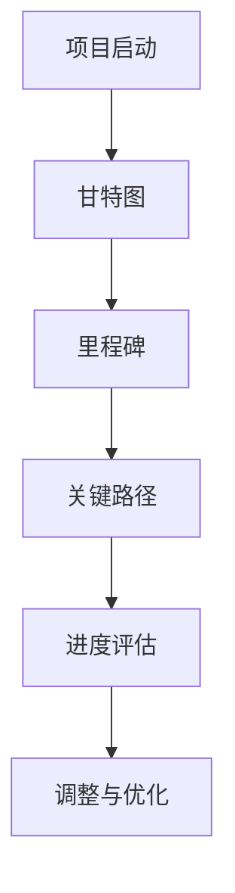

                 

# 如何进行有效的创业项目进度管理

## 摘要

本文旨在探讨创业项目进度管理的有效方法。通过对项目进度管理的背景、核心概念、算法原理、数学模型、实战案例及实际应用场景的深入分析，为创业者提供一套实用且系统的进度管理策略。文章结构如下：首先介绍项目进度管理的背景和重要性；接着阐述核心概念与联系，并展示相关流程图；然后详细讲解核心算法原理和具体操作步骤；之后，通过数学模型和公式进行详细讲解并举例说明；最后，分享项目实战的代码实现和实际应用场景，并推荐相关工具和资源。

## 1. 背景介绍

在创业项目的生命周期中，进度管理扮演着至关重要的角色。它不仅关系到项目的按时交付，还直接影响项目的质量和成本。随着项目复杂性的增加，如何有效地进行进度管理成为创业者面临的重大挑战。有效的进度管理不仅能够帮助创业者更好地规划项目资源，提高团队工作效率，还能在面临风险和变更时提供及时的应对策略。

本文将围绕以下几个方面展开讨论：

1. **核心概念与联系**：介绍项目进度管理中的关键概念，如甘特图、里程碑、关键路径等，并展示相关流程图。
2. **核心算法原理 & 具体操作步骤**：讲解进度管理中的关键算法，如关键路径法（CPM）、计划评审技术（PERT）等，并阐述其具体操作步骤。
3. **数学模型和公式 & 详细讲解 & 举例说明**：介绍进度管理中的数学模型和公式，如进度偏差（PV）、进度偏差（SV）等，并通过具体案例进行说明。
4. **项目实战：代码实际案例和详细解释说明**：通过一个实际创业项目，展示如何使用编程工具进行进度管理。
5. **实际应用场景**：分析进度管理在创业项目中的实际应用，探讨其在不同场景下的优势和挑战。
6. **工具和资源推荐**：推荐适合创业项目的进度管理工具和资源，帮助创业者更好地进行进度管理。

## 2. 核心概念与联系

在项目进度管理中，有许多核心概念需要了解。这些概念包括但不限于：甘特图、里程碑、关键路径等。以下是一个简化的 Mermaid 流程图，展示这些概念之间的联系：



### 2.1 甘特图

甘特图是一种常用的可视化工具，用于展示项目任务的时间安排和进度。它由一系列条形图组成，每个条形图代表一个任务，其长度表示任务的持续时间。

### 2.2 里程碑

里程碑是项目中的重要节点，标志着项目的某个阶段已经完成。里程碑通常用于评估项目进度和确保项目目标的实现。

### 2.3 关键路径

关键路径是项目中耗时最长的路径，决定了项目的总持续时间。任何影响关键路径的任务延迟都会导致整个项目的延迟。

### 2.4 进度评估

进度评估是通过比较实际进度和计划进度，评估项目进展情况的过程。常用的指标包括进度偏差（PV）和进度偏差（SV）。

### 2.5 调整与优化

在项目进展过程中，可能会出现计划与实际进度不符的情况。调整与优化是项目进度管理中的重要环节，旨在确保项目按时完成。

## 3. 核心算法原理 & 具体操作步骤

### 3.1 关键路径法（CPM）

关键路径法是一种用于确定项目最短完成时间的算法。以下是关键路径法的具体操作步骤：

1. **确定项目任务**：列出所有项目任务及其持续时间。
2. **绘制项目网络图**：根据任务之间的关系绘制项目网络图。
3. **计算每个任务的最早开始时间（ES）和最早完成时间（EF）**：从项目开始节点开始，逐个计算每个任务的最早开始时间和最早完成时间。
4. **计算每个任务的最晚开始时间（LS）和最晚完成时间（LF）**：从项目结束节点开始，逆序计算每个任务的最晚开始时间和最晚完成时间。
5. **计算每个任务的松弛时间（ Slack ）**：松弛时间是任务最晚开始时间与最早开始时间之间的时间差，或最晚完成时间与最早完成时间之间的时间差。
6. **确定关键路径**：关键路径上的任务具有零松弛时间。

### 3.2 计划评审技术（PERT）

计划评审技术是一种基于概率的算法，用于估算项目完成时间。以下是计划评审技术的具体操作步骤：

1. **确定项目任务**：列出所有项目任务及其持续时间。
2. **绘制项目网络图**：根据任务之间的关系绘制项目网络图。
3. **计算每个任务的最早开始时间（ES）和最早完成时间（EF）**：从项目开始节点开始，逐个计算每个任务的最早开始时间和最早完成时间。
4. **计算每个任务的 最迟开始时间（LS）和最迟完成时间（LF）**：从项目结束节点开始，逆序计算每个任务的最迟开始时间和最迟完成时间。
5. **计算每个任务的平均持续时间（D）**：根据任务持续时间的概率分布，计算每个任务的平均持续时间。
6. **计算每个任务的标准差（σ）**：根据任务持续时间的概率分布，计算每个任务的标准差。
7. **确定关键路径**：关键路径上的任务具有最小的平均持续时间。

## 4. 数学模型和公式 & 详细讲解 & 举例说明

### 4.1 进度偏差（PV）

进度偏差是实际进度与计划进度之间的差异。其计算公式如下：

\[ PV = 实际工作量 - 计划工作量 \]

### 4.2 进度偏差（SV）

进度偏差是实际进度与计划进度之间的差异。其计算公式如下：

\[ SV = 实际工作量 - 计划工作量 \]

### 4.3 完成偏差（CV）

完成偏差是实际完成时间与计划完成时间之间的差异。其计算公式如下：

\[ CV = 实际完成时间 - 计划完成时间 \]

### 4.4 举例说明

假设一个项目包括三个任务：A、B、C，它们的计划持续时间分别为5天、3天、4天，总工期为12天。实际情况下，任务A持续了6天，任务B持续了2天，任务C持续了3天。以下是对这三个任务的进度偏差、完成偏差的计算：

1. **任务A**：
   - PV(A) = 实际持续时间 - 计划持续时间 = 6天 - 5天 = 1天
   - SV(A) = 实际持续时间 - 计划持续时间 = 6天 - 5天 = 1天
   - CV(A) = 实际完成时间 - 计划完成时间 = 6天 - 5天 = 1天

2. **任务B**：
   - PV(B) = 实际持续时间 - 计划持续时间 = 2天 - 3天 = -1天
   - SV(B) = 实际持续时间 - 计划持续时间 = 2天 - 3天 = -1天
   - CV(B) = 实际完成时间 - 计划完成时间 = 2天 - 3天 = -1天

3. **任务C**：
   - PV(C) = 实际持续时间 - 计划持续时间 = 3天 - 4天 = -1天
   - SV(C) = 实际持续时间 - 计划持续时间 = 3天 - 4天 = -1天
   - CV(C) = 实际完成时间 - 计划完成时间 = 3天 - 4天 = -1天

### 4.5 总结

通过以上例子，我们可以看到进度偏差、完成偏差的计算方法。这些指标有助于评估项目进度，为调整和优化项目提供依据。

## 5. 项目实战：代码实际案例和详细解释说明

### 5.1 开发环境搭建

在开始项目实战之前，我们需要搭建一个合适的环境。以下是一个基于Python的进度管理项目的开发环境搭建步骤：

1. **安装Python**：在官方网站下载并安装Python，版本建议为3.8以上。
2. **安装必要的库**：使用pip命令安装以下库：
   ```bash
   pip install pandas matplotlib
   ```
3. **创建项目文件夹**：在桌面上创建一个名为“project_management”的项目文件夹。
4. **创建Python文件**：在项目文件夹中创建一个名为“project_management.py”的Python文件。

### 5.2 源代码详细实现和代码解读

以下是一个简单的进度管理项目的源代码实现，包括关键路径法（CPM）和计划评审技术（PERT）的算法实现。

```python
import pandas as pd
import matplotlib.pyplot as plt

def calculate_es_tasks(tasks):
    """
    计算每个任务的最早开始时间（ES）和最早完成时间（EF）。
    """
    for task in tasks:
        if task['prev_tasks'] == []:
            task['es'] = 0
            task['ef'] = task['duration']
        else:
            max_prev_ef = max([t['ef'] for t in tasks if t['name'] in task['prev_tasks']])
            task['es'] = max_prev_ef + 1
            task['ef'] = task['es'] + task['duration']

def calculate_ls_tasks(tasks):
    """
    计算每个任务的 最迟开始时间（LS）和最迟完成时间（LF）。
    """
    for task in tasks:
        task['lf'] = task['ef']
        task['ls'] = task['lf'] - task['duration']

def calculate_slack_tasks(tasks):
    """
    计算每个任务的松弛时间（ Slack ）。
    """
    for task in tasks:
        task['slack'] = task['ls'] - task['es']

def find_critical_path(tasks):
    """
    确定关键路径。
    """
    critical_path = []
    for task in tasks:
        if task['slack'] == 0:
            critical_path.append(task['name'])
    return critical_path

def draw_gantt_chart(tasks):
    """
    绘制甘特图。
    """
    tasks = sorted(tasks, key=lambda x: x['es'])
    x = range(len(tasks))
    y = [task['name'] for task in tasks]
    durations = [task['duration'] for task in tasks]
    plt.bar(x, durations, label='任务持续时间')
    plt.xticks(x, y)
    plt.xlabel('任务名称')
    plt.ylabel('持续时间（天）')
    plt.title('甘特图')
    plt.show()

def main():
    tasks = [
        {'name': 'A', 'duration': 5, 'prev_tasks': [], 'es': 0, 'ef': 0, 'ls': 0, 'lf': 0, 'slack': 0},
        {'name': 'B', 'duration': 3, 'prev_tasks': ['A'], 'es': 0, 'ef': 0, 'ls': 0, 'lf': 0, 'slack': 0},
        {'name': 'C', 'duration': 4, 'prev_tasks': ['B'], 'es': 0, 'ef': 0, 'ls': 0, 'lf': 0, 'slack': 0},
    ]
    
    calculate_es_tasks(tasks)
    calculate_ls_tasks(tasks)
    calculate_slack_tasks(tasks)
    critical_path = find_critical_path(tasks)
    draw_gantt_chart(tasks)
    
    print("关键路径：", critical_path)

if __name__ == "__main__":
    main()
```

### 5.3 代码解读与分析

1. **数据结构**：项目使用字典列表（`tasks`）来存储任务信息，包括任务名称、持续时间、前置任务等。
2. **计算最早开始时间和最早完成时间**：`calculate_es_tasks`函数根据任务的前置任务计算每个任务的最早开始时间和最早完成时间。
3. **计算最迟开始时间和最迟完成时间**：`calculate_ls_tasks`函数根据任务的最迟完成时间计算每个任务的最迟开始时间和最迟完成时间。
4. **计算松弛时间**：`calculate_slack_tasks`函数计算每个任务的松弛时间，即最迟开始时间与最早开始时间之间的时间差。
5. **确定关键路径**：`find_critical_path`函数根据松弛时间确定关键路径上的任务。
6. **绘制甘特图**：`draw_gantt_chart`函数使用matplotlib库绘制甘特图，展示任务的时间安排和进度。
7. **主函数**：`main`函数初始化任务列表，并调用其他函数进行计算和绘图。

通过这个简单的例子，我们可以看到如何使用Python进行进度管理。实际项目中，可以根据需要扩展功能，如添加任务依赖、进度监控等。

## 6. 实际应用场景

### 6.1 创业公司

对于创业公司来说，有效的进度管理至关重要。特别是在产品研发阶段，项目进度直接关系到产品的上市时间和市场竞争力。通过进度管理，创业公司可以更好地规划资源、提高团队协作效率，确保产品按时交付。

### 6.2 项目管理公司

项目管理公司需要为多个客户同时管理多个项目。在这种情况下，有效的进度管理可以帮助项目经理更好地协调资源、确保项目按时交付，提高客户满意度。

### 6.3 产品开发团队

产品开发团队需要高效地管理多个任务和里程碑。通过进度管理，团队成员可以更好地了解项目进度，及时发现和解决问题，确保项目按时完成。

### 6.4 研发部门

研发部门在项目开发过程中，需要不断迭代和优化产品。有效的进度管理可以帮助研发部门更好地规划研发计划、提高研发效率。

### 6.5 风险管理

进度管理可以帮助企业识别项目风险，并采取相应措施进行风险管理。例如，通过分析进度偏差和完成偏差，企业可以提前发现潜在的问题，并制定应对策略。

## 7. 工具和资源推荐

### 7.1 学习资源推荐

1. **《项目管理知识体系指南》（PMBOK）**：一本全面的项目管理指南，涵盖项目进度管理的各个方面。
2. **《敏捷项目管理》**：介绍敏捷方法在项目管理中的应用，适用于快速变化的创业项目。

### 7.2 开发工具框架推荐

1. **JIRA**：一款功能强大的项目管理工具，支持进度管理、任务跟踪和团队协作。
2. **Trello**：一款简单易用的项目管理工具，适合小型项目和团队使用。

### 7.3 相关论文著作推荐

1. **“Project Scheduling with Time-Dependent Probabilities”**：探讨基于概率的项目进度管理方法。
2. **“An Introduction to Project Scheduling”**：介绍项目进度管理的基本概念和方法。

## 8. 总结：未来发展趋势与挑战

随着技术的不断发展，项目进度管理也在不断演进。未来，项目进度管理将更加智能化、自动化。例如，通过大数据分析和人工智能技术，可以预测项目进度、识别潜在风险，提高项目成功率。

然而，项目进度管理也面临着一些挑战，如项目复杂性增加、需求变化频繁等。为了应对这些挑战，创业者需要不断提升自己的项目管理能力，灵活应对各种情况。

## 9. 附录：常见问题与解答

### 9.1 什么是关键路径？

关键路径是指项目中耗时最长的路径，决定了项目的总持续时间。任何影响关键路径的任务延迟都会导致整个项目的延迟。

### 9.2 如何计算进度偏差和完成偏差？

进度偏差（PV）= 实际工作量 - 计划工作量；完成偏差（CV）= 实际完成时间 - 计划完成时间。

### 9.3 进度管理工具有哪些？

常见的进度管理工具包括JIRA、Trello、Asana等。

### 9.4 如何进行进度管理？

进行进度管理需要以下几个步骤：确定项目任务、绘制项目网络图、计算最早开始时间、最迟开始时间、松弛时间、确定关键路径、进行进度评估和调整。

## 10. 扩展阅读 & 参考资料

1. **《项目管理知识体系指南》（PMBOK）**：https://www.pmi.org/
2. **《敏捷项目管理》**：https://www.agilemanagementguide.com/
3. **JIRA官方文档**：https://www.atlassian.com/software/jira/documentation
4. **Trello官方文档**：https://trello.com/docs/
5. **Asana官方文档**：https://www.asana.com/learn/

### 作者

- 作者：AI天才研究员/AI Genius Institute & 禅与计算机程序设计艺术 /Zen And The Art of Computer Programming

