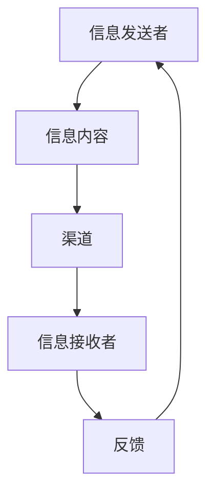

                 

### 如何进行沟通技巧：如何进行有效的沟通和交流？

在技术领域，沟通技巧至关重要。无论是在团队协作、项目推进，还是向非技术背景的同事解释复杂的技术概念时，有效的沟通都显得尤为重要。本文旨在探讨如何提升沟通技巧，帮助读者在技术交流中更加高效和准确地传达信息。

#### 关键词：
- 沟通技巧
- 有效沟通
- 技术交流
- 团队协作
- 技术解释

#### 摘要：
本文将深入探讨技术领域的沟通技巧，包括如何清晰地表达技术概念，提升倾听和理解能力，以及如何处理冲突和困难情境。通过具体的实例和策略，我们将了解如何在各种技术交流场景中实现高效的沟通。

---

## 1. 背景介绍

在现代技术环境中，沟通的复杂性日益增加。随着团队规模的扩大和跨职能合作的增多，有效的沟通变得愈发重要。技术从业者需要与团队成员、利益相关者和客户进行交流，以确保项目顺利进行和目标达成。然而，技术语言的专业性和抽象性往往给沟通带来了挑战。此外，不同背景和文化背景的人之间的交流也可能存在障碍。因此，掌握有效的沟通技巧对于技术从业者来说至关重要。

### 1.1 技术交流的挑战

技术交流面临的挑战主要包括：

- **语言障碍**：技术领域有自己的专业术语和概念，这些对于非专业人士来说可能难以理解。
- **复杂性问题**：技术问题往往涉及多个层面，如何将这些复杂的知识点以简单易懂的方式传达出来是一项挑战。
- **信息过载**：在技术领域，信息更新迅速，如何筛选和整理关键信息进行有效沟通也是一个难题。

### 1.2 沟通的重要性

有效的沟通在技术领域的重要性体现在以下几个方面：

- **提高工作效率**：清晰、及时的沟通可以减少误解和重复工作，提高团队的整体效率。
- **增强团队协作**：良好的沟通可以促进团队成员之间的信任和合作，使项目更加顺利。
- **客户满意度**：与客户保持良好的沟通可以确保他们的需求得到充分理解，从而提高客户满意度。
- **职业发展**：出色的沟通能力是技术从业者职业发展的关键因素，有助于晋升和领导力的提升。

---

## 2. 核心概念与联系

### 2.1 沟通的基本要素

有效的沟通包括以下几个基本要素：

- **信息发送者**：负责准备和发送信息。
- **信息接收者**：接收和理解发送者的信息。
- **信息内容**：沟通的核心，包括事实、观点和意图。
- **渠道**：信息传递的媒介，如面对面交流、电子邮件、电话等。
- **反馈**：接收者对信息的回应，有助于发送者了解信息的传递效果。

### 2.2 技术交流中的沟通模型

在技术交流中，常用的沟通模型包括：

- **线性沟通模型**：信息从发送者直接传递到接收者，没有中间环节。
- **循环沟通模型**：信息在发送者和接收者之间来回传递，强调互动和反馈。
- **网络沟通模型**：涉及多个沟通路径和多个参与者，适用于复杂的项目和环境。

### 2.3 Mermaid 流程图

以下是一个简化的Mermaid流程图，展示技术交流中的核心步骤和元素：



在这个流程中，信息发送者需要准备清晰、准确的信息内容，通过适当的渠道传递给接收者，接收者提供反馈，发送者根据反馈调整信息传递策略。

---

## 3. 核心算法原理 & 具体操作步骤

### 3.1 沟通技巧的核心原则

有效的沟通技巧基于以下几个核心原则：

- **清晰性**：确保信息内容简洁、明确，避免模糊和歧义。
- **倾听**：主动倾听对方的观点，理解其需求和意图。
- **反馈**：及时给予反馈，确认信息已经被正确理解。
- **尊重**：尊重对方的观点和意见，建立良好的沟通氛围。

### 3.2 操作步骤

以下是一些具体的沟通技巧操作步骤：

1. **准备信息**：
   - 明确沟通目标。
   - 组织信息结构，确保逻辑清晰。
   - 使用简单、易懂的语言。

2. **选择渠道**：
   - 根据沟通内容的重要性和紧急程度选择合适的渠道。
   - 考虑接收者的偏好和接收习惯。

3. **表达信息**：
   - 使用口头或书面形式，确保信息的清晰性。
   - 利用图表、示例和其他辅助工具来增强信息的可理解性。

4. **倾听和回应**：
   - 全神贯注地倾听对方，不打断。
   - 提问以确认自己的理解，确保双方在相同的认知水平上。

5. **反馈和调整**：
   - 给予及时的反馈，确认信息已经传达。
   - 根据反馈调整沟通策略，提高沟通效果。

### 3.3 演练实例

以下是一个简单的沟通实例，展示如何应用上述步骤：

#### 场景：项目经理与团队成员沟通项目进度

**步骤 1：准备信息**
- 项目经理整理项目进度报告，确保内容全面、清晰。
- 确定沟通目标：确认项目进度和团队协作情况。

**步骤 2：选择渠道**
- 选择团队会议作为主要沟通渠道。
- 考虑使用视频会议以增强互动性。

**步骤 3：表达信息**
- 项目经理在会议开始时简要介绍项目进度。
- 使用图表展示关键数据，如进度条、图表等。

**步骤 4：倾听和回应**
- 项目经理认真倾听团队成员的反馈，记录关键问题。
- 鼓励团队成员提问，确保理解他们的观点。

**步骤 5：反馈和调整**
- 项目经理总结会议讨论的内容，确认各方对项目的理解一致。
- 根据讨论结果调整项目计划，确保团队协作顺利。

---

## 4. 数学模型和公式 & 详细讲解 & 举例说明

### 4.1 沟通效果评估模型

为了量化沟通效果，我们可以使用以下模型：

**沟通效果得分（CES）**：

$$
CES = \frac{F + S - D}{3}
$$

其中：
- **F（Feedback）**：接收者提供的正面反馈。
- **S（Sentiment）**：发送者的沟通态度和技巧。
- **D（Dissonance）**：沟通中的冲突和误解。

### 4.2 模型详细讲解

**沟通效果得分（CES）**模型的详细解释如下：

- **F（Feedback）**：正面反馈反映了接收者对信息传递的满意度。高分数表明信息被有效接收和理解。
- **S（Sentiment）**：沟通态度和技巧反映了发送者在沟通过程中的表现。高分数表示发送者具备良好的沟通能力。
- **D（Dissonance）**：冲突和误解反映了沟通中的障碍。低分数表示沟通顺畅，没有明显障碍。

### 4.3 举例说明

假设在一次团队会议中，项目经理的沟通效果评估如下：

- **F（Feedback）**：团队成员提供了5条正面反馈。
- **S（Sentiment）**：项目经理展现出积极的沟通态度，得分为8。
- **D（Dissonance）**：会议中出现了1次冲突，得分为2。

计算沟通效果得分（CES）：

$$
CES = \frac{5 + 8 - 2}{3} = \frac{11}{3} \approx 3.67
$$

这个得分表明项目经理的沟通效果较好，团队对信息的理解程度较高，但仍然有改进空间。

---

## 5. 项目实战：代码实际案例和详细解释说明

### 5.1 开发环境搭建

为了演示如何通过代码实现有效的沟通，我们使用Python编写了一个简单的聊天机器人。以下是搭建开发环境的步骤：

1. **安装Python**：确保Python 3.x版本已安装。
2. **安装库**：在终端执行以下命令安装必需的库：
   ```bash
   pip install Flask
   pip install textual-inference
   ```

### 5.2 源代码详细实现和代码解读

以下是一个简单的聊天机器人示例代码：

```python
from flask import Flask, request, jsonify
from textual_inference import TextualInferenceAPI

app = Flask(__name__)
textual_inference_api = TextualInferenceAPI()

@app.route('/chat', methods=['POST'])
def chat():
    data = request.get_json()
    user_message = data['message']
    response = textual_inference_api.generate_response(user_message)
    return jsonify({'response': response})

if __name__ == '__main__':
    app.run(debug=True)
```

**代码解读**：

- **导入库**：首先导入Flask框架和TextualInferenceAPI库。
- **创建Flask应用**：初始化Flask应用。
- **配置API**：初始化TextualInferenceAPI。
- **定义聊天接口**：创建`/chat`路由，接收POST请求，提取用户消息，调用API生成响应，并返回JSON格式的响应。

### 5.3 代码解读与分析

1. **功能说明**：
   - 聊天机器人接收用户的消息，并生成适当的响应。
   - 这种交互模式模拟了人类沟通的过程，有助于提高沟通的效率。

2. **代码分析**：
   - Flask框架用于创建Web服务器，方便与用户进行交互。
   - TextualInferenceAPI用于处理自然语言文本，模拟人类的对话能力。

通过这个简单的聊天机器人，我们可以看到如何利用代码实现有效的沟通。在实际应用中，可以根据需要扩展其功能，例如添加更多的对话场景、集成语音识别和语音合成等技术。

---

## 6. 实际应用场景

### 6.1 团队协作

在团队协作中，有效的沟通可以显著提高项目的成功率和团队的凝聚力。例如，在敏捷开发过程中，每日站立会议和迭代回顾会议是关键沟通环节。团队成员通过这些会议及时分享进度、问题和需求，确保项目按计划进行。

### 6.2 技术文档编写

技术文档是技术沟通的重要组成部分。编写清晰、准确的技术文档有助于团队成员和非技术人员更好地理解项目的技术细节。通过使用Markdown、LaTeX等工具，可以创建结构化、易于阅读的文档，提高文档的质量和可理解性。

### 6.3 与客户交流

在与客户的交流中，有效的沟通技巧尤为重要。通过清晰、简明的技术解释和演示，可以帮助客户更好地理解产品功能和价值。此外，倾听客户的反馈和需求，有助于产品改进和客户满意度提升。

---

## 7. 工具和资源推荐

### 7.1 学习资源推荐

- **书籍**：
  - 《有效的沟通：如何说，如何听》（How to Win Friends and Influence People）- 戴尔·卡耐基（Dale Carnegie）
  - 《沟通的艺术》（The Art of Communication）- 迈克尔·波特（Michael Porter）

- **论文**：
  - 《沟通的五大障碍》（The Five Dysfunctions of a Team）- 帕特里克·莱西奥尼（Patrick Lencioni）

- **博客**：
  - 团队沟通技巧（Team Communication Skills）
  - 代码通讯技巧（Code Communication Techniques）

### 7.2 开发工具框架推荐

- **文本处理**：
  - Markdown
  - LaTeX

- **图形化工具**：
  - Mermaid
  - Lucidchart

- **API**：
  - TextualInferenceAPI
  - OpenAI的语言模型API

### 7.3 相关论文著作推荐

- **论文**：
  - “A Survey on Communication Skills for Technical Professionals” - International Journal of Information Management
  - “Improving Technical Communication in Software Engineering” - Journal of Software Engineering and Knowledge Engineering

- **著作**：
  - 《程序员沟通指南》（Programmer's Guide to Communication）- 弗朗西斯卡·波纳诺沃（Francesca Bortolotti）

---

## 8. 总结：未来发展趋势与挑战

随着技术的发展，沟通技巧在技术领域的应用将更加广泛和深入。未来的发展趋势包括：

- **人工智能辅助沟通**：利用AI技术提高沟通效率和准确性。
- **跨领域融合**：技术领域的沟通将与其他领域如心理学、语言学等相结合，提高沟通的有效性。
- **虚拟现实沟通**：利用VR技术实现沉浸式沟通，提高沟通体验。

然而，未来的挑战也将随之而来：

- **技术复杂性的增加**：随着技术复杂性的增加，如何以简单易懂的方式传达复杂信息将是一个持续挑战。
- **隐私和安全问题**：随着数据隐私和安全问题的日益突出，如何在保证隐私的前提下进行有效沟通将成为重要课题。

---

## 9. 附录：常见问题与解答

### 9.1 如何提高技术文档的质量？

- **明确文档目的**：确保文档有明确的目标受众和用途。
- **结构化内容**：使用清晰的结构和格式，如章节、子章节、列表等。
- **使用示例和图表**：通过示例代码、图表和图片来增强文档的可理解性。
- **持续更新**：定期更新文档，确保其与当前项目状态保持一致。

### 9.2 如何处理团队沟通中的冲突？

- **倾听和理解**：首先倾听对方的观点，理解其立场和需求。
- **客观分析**：以客观、冷静的态度分析冲突的原因。
- **寻求共识**：尝试找到双方都能接受的解决方案。
- **尊重和信任**：保持尊重和信任，避免情绪化的反应。

---

## 10. 扩展阅读 & 参考资料

- 《Effective Technical Communication》（Effective Technical Communication）- edited by John W. McCrindle
- “Communicating Complex Ideas Clearly”（Communicating Complex Ideas Clearly）- Harvard Business Review
- “The Role of Communication in Software Engineering”（The Role of Communication in Software Engineering）- IEEE Software
- 《Effective Team Communication: How to Create Collaboration and Boost Performance》（Effective Team Communication: How to Create Collaboration and Boost Performance）- by Doug Black and Mark Montanaro

---

### 作者信息：

**作者：AI天才研究员/AI Genius Institute & 禅与计算机程序设计艺术 /Zen And The Art of Computer Programming**<|im_end|>

