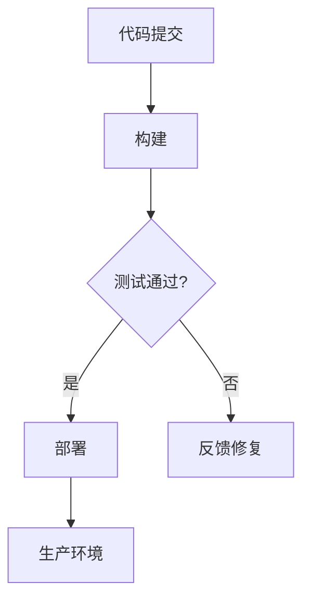
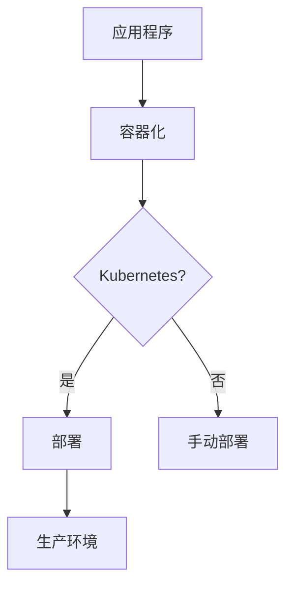
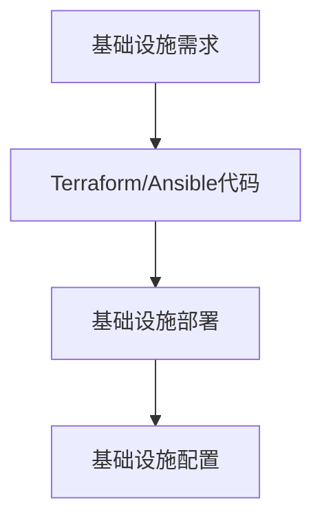
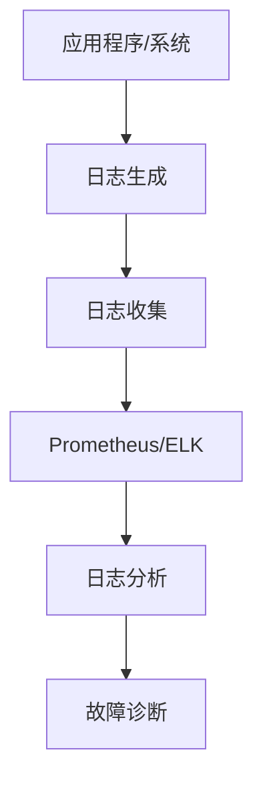

                 

### 背景介绍

#### 字节跳动2024校招DevOps工程师面试题集锦

随着云计算、容器化、自动化运维等技术的迅猛发展，DevOps工程师已成为当今IT行业中的热门职位。字节跳动，作为中国领先的新媒体公司，其DevOps团队在技术领域具有极高的声誉。为了选拔优秀的人才，字节跳动2024校招DevOps工程师面试题集锦应运而生。本文旨在为大家提供一份全面而深入的面试题集锦，帮助备战校招的同学们更好地了解DevOps领域的面试挑战。

##### DevOps的定义与核心价值

DevOps是一种软件开发和运维的结合模式，旨在通过自动化和协作来提高软件交付的效率和可靠性。它强调开发（Development）和运维（Operations）之间的紧密合作，通过自动化工具和流程，实现从代码提交到上线部署的快速迭代。DevOps的核心价值在于：

1. **提高交付速度**：通过自动化和持续集成/持续部署（CI/CD），缩短开发周期，实现快速交付。
2. **提升系统可靠性**：通过监控和自动化故障恢复，减少系统故障率和运维成本。
3. **增强团队协作**：打破开发与运维之间的壁垒，促进团队成员之间的沟通与协作。
4. **优化资源利用**：通过容器化技术，实现资源的高效管理和调度。

##### DevOps工程师的角色与技能要求

作为DevOps工程师，需要具备以下几方面的技能和知识：

1. **操作系统基础**：熟悉Linux操作系统，了解常见的系统管理和网络配置。
2. **脚本语言**：掌握至少一种脚本语言，如Python、Shell等，用于自动化运维任务。
3. **容器技术**：熟悉Docker和Kubernetes等容器技术，能够实现容器化部署和管理。
4. **持续集成与持续部署**：了解常见的CI/CD工具，如Jenkins、GitLab CI等，实现自动化构建和部署。
5. **基础设施即代码（IaC）**：掌握基础设施配置管理工具，如Terraform、Ansible等。
6. **监控与日志管理**：了解监控工具，如Prometheus、ELK（Elasticsearch、Logstash、Kibana）等，能够进行系统监控和日志分析。
7. **网络与安全**：具备网络基础知识，了解网络安全策略和防护措施。
8. **代码质量与测试**：关注代码质量，掌握测试方法和工具，如单元测试、集成测试等。

##### 面试准备与策略

准备面试时，同学们可以从以下几个方面入手：

1. **复习基础知识**：系统复习操作系统、网络、数据库、编程语言等基础知识，确保对基本概念有深入理解。
2. **实践项目经验**：参与实际项目，积累动手经验，特别是与DevOps相关的项目经验。
3. **学习工具与框架**：熟悉常见的DevOps工具和框架，如Docker、Kubernetes、Jenkins、Ansible等。
4. **模拟面试**：进行模拟面试，熟悉面试流程和常见问题，提高应对能力。
5. **持续学习**：关注行业动态，学习最新的技术和趋势，提升自己的竞争力。

在接下来的章节中，我们将详细探讨DevOps工程师面试中的核心概念、算法原理、项目实战、应用场景以及未来的发展趋势和挑战。希望通过本文的介绍，能够为大家的校招面试之旅提供有力支持。让我们一步一步深入探讨，揭开DevOps工程师的神秘面纱。

### 核心概念与联系

在深入探讨字节跳动2024校招DevOps工程师面试题之前，我们首先需要理解DevOps中的一些核心概念及其相互联系。以下是几个关键概念及其关联的详细解释和Mermaid流程图。

#### 持续集成与持续部署（CI/CD）

**持续集成（Continuous Integration，CI）**：持续集成是一种软件开发实践，通过频繁地将代码合并到主分支，并立即运行一系列自动化测试，以确保代码的质量和一致性。

**持续部署（Continuous Deployment，CD）**：持续部署是CI的延伸，通过自动化的方式将通过测试的代码部署到生产环境。

**Mermaid流程图**：



#### 容器化技术

**容器（Container）**：容器是一种轻量级、可移植的计算环境，它封装了应用程序及其依赖项，可以在不同的操作系统上运行。

**容器编排（Container Orchestration）**：容器编排是指管理容器化应用程序的生命周期，包括部署、扩展和自动化。

**容器编排工具**：Kubernetes是当前最流行的容器编排工具，它提供了自动化部署、扩展和管理容器化应用程序的能力。

**Mermaid流程图**：



#### 基础设施即代码（IaC）

**基础设施即代码（Infrastructure as Code，IaC）**：IaC使用代码来描述和部署基础设施，类似于编写应用程序代码。

**IaC工具**：Terraform和Ansible是常用的IaC工具，它们允许通过编写代码来创建、管理和销毁基础设施资源。

**Mermaid流程图**：



#### 监控与日志管理

**监控**：监控是指实时跟踪系统和应用程序的性能和健康状况。

**日志管理**：日志管理涉及收集、存储、分析和可视化应用程序和系统生成的日志数据。

**常用工具**：Prometheus和ELK（Elasticsearch、Logstash、Kibana）是常见的监控和日志管理工具。

**Mermaid流程图**：



通过理解这些核心概念及其相互联系，我们可以更好地准备DevOps工程师的面试。接下来，我们将深入探讨DevOps中的核心算法原理和具体操作步骤，帮助大家掌握DevOps的实际应用和实现。

### 核心算法原理 & 具体操作步骤

在深入探讨DevOps中的核心算法原理和具体操作步骤时，我们将重点介绍几个关键技术，包括容器编排、持续集成与持续部署（CI/CD）、基础设施即代码（IaC）等。

#### 容器编排

**Kubernetes（K8s）**：Kubernetes是一个开源的容器编排平台，用于自动化部署、扩展和管理容器化应用程序。以下是Kubernetes的核心算法原理和具体操作步骤：

1. **核心算法原理**：

   - **控制器模式**：Kubernetes通过控制器（Controller）来管理集群中的资源状态。控制器监视实际状态和预期状态之间的差异，并自动调整以保持一致性。

   - **调度算法**：Kubernetes调度器（Scheduler）负责将容器分配到集群中的节点。调度器根据资源需求、节点状态和策略来选择最佳的节点。

   - **自我修复**：Kubernetes具有自我修复能力，可以自动检测故障并进行恢复，确保服务的可用性。

2. **具体操作步骤**：

   - **安装Kubernetes**：在集群的每个节点上安装Kubernetes的必要组件，如kubelet、kube-proxy和kubectl。

   - **创建Pod**：Pod是Kubernetes中的最小部署单位，包含一个或多个容器。创建Pod是通过YAML文件定义的。

     ```yaml
     apiVersion: v1
     kind: Pod
     metadata:
       name: my-pod
     spec:
       containers:
       - name: my-container
         image: my-image
     ```

   - **部署Deployment**：Deployment用于管理Pod的创建和更新，确保Pod的预期状态。更新Deployment时，Kubernetes会逐步替换旧的Pod。

     ```yaml
     apiVersion: apps/v1
     kind: Deployment
     metadata:
       name: my-deployment
     spec:
       replicas: 3
       selector:
         matchLabels:
           app: my-app
       template:
         metadata:
           labels:
             app: my-app
         spec:
           containers:
           - name: my-container
             image: my-image
     ```

   - **服务发现和负载均衡**：通过创建Service，可以将流量分配到不同的Pod实例，实现负载均衡。Service通过DNS或IP地址来暴露服务。

     ```yaml
     apiVersion: v1
     kind: Service
     metadata:
       name: my-service
     spec:
       selector:
         app: my-app
       ports:
       - protocol: TCP
         port: 80
         targetPort: 8080
     ```

   - **扩容和缩容**：通过修改Deployment的`replicas`字段，可以自动扩展或缩小Pod的数量，以应对负载变化。

#### 持续集成与持续部署（CI/CD）

**Jenkins**：Jenkins是一个开源的持续集成和持续部署工具，通过插件系统可以实现多种集成和部署任务。以下是Jenkins的核心算法原理和具体操作步骤：

1. **核心算法原理**：

   - **流水线模型**：Jenkins使用流水线（Pipeline）模型来定义构建、测试和部署的步骤。

   - **触发机制**：Jenkins可以根据多种触发方式（如定时、代码提交等）来执行构建任务。

   - **分布式构建**：Jenkins支持分布式构建，可以将构建任务分配到多个slave节点上，提高构建效率。

2. **具体操作步骤**：

   - **安装Jenkins**：在服务器上安装Jenkins，可以通过wget或yum等命令来下载和安装。

     ```shell
     wget -q -O - https://pkg.jenkins.io/debian-stable/jenkins.io.key | sudo apt-key add -
     echo deb https://pkg.jenkins.io/debian-stable binary/ > /etc/apt/sources.list.d/jenkins.list
     sudo apt-get update
     sudo apt-get install jenkins
     ```

   - **创建Pipeline**：通过Jenkinsfile定义构建、测试和部署的步骤。以下是一个简单的示例：

     ```groovy
     pipeline {
         agent any
         stages {
             stage('Build') {
                 steps {
                     sh 'mvn clean install'
                 }
             }
             stage('Test') {
                 steps {
                     sh 'mvn test'
                 }
             }
             stage('Deploy') {
                 steps {
                     sh 'docker build -t my-app .'
                     sh 'docker push my-app'
                 }
             }
         }
         post {
             always {
                 sh 'echo Build finished'
             }
         }
     }
     ```

   - **配置触发器**：为Pipeline配置触发器，如GitHub或GitLab的Webhook，以实现自动化构建。

     ```yaml
     triggers:
     - type: git
       branches:
       - name: master
       source:
         branch: master
     ```

#### 基础设施即代码（IaC）

**Terraform**：Terraform是一个基础设施即代码工具，通过HCL（HashiCorp Configuration Language）定义和部署基础设施资源。以下是Terraform的核心算法原理和具体操作步骤：

1. **核心算法原理**：

   - **抽象资源模型**：Terraform提供丰富的资源模型，可以定义各种云服务提供商的资源，如虚拟机、数据库、网络等。

   - **部署和变更管理**：Terraform通过创建基础设施的JSON描述文件，并与实际基础设施进行比较，实现基础设施的部署和变更管理。

2. **具体操作步骤**：

   - **安装Terraform**：在本地或服务器上安装Terraform，可以通过下载二进制文件或使用包管理器来安装。

     ```shell
     wget https://releases.hashicorp.com/terraform/1.1.9/terraform_1.1.9_linux_amd64.zip
     unzip terraform_1.1.9_linux_amd64.zip
     mv terraform /usr/local/bin/
     ```

   - **编写配置文件**：创建一个名为`main.tf`的配置文件，定义所需的基础设施资源。以下是一个简单的示例：

     ```hcl
     provider "aws" {
       region = "us-west-2"
     }

     resource "aws_instance" "example" {
       provider = aws
       image_id = "ami-0c55b159cbfafe1f0"
       instance_type = "t2.micro"
       ami = "ami-0c55b159cbfafe1f0"
     }
     ```

   - **初始化和部署**：初始化Terraform工作区，下载必要的插件和模块。

     ```shell
     terraform init
     terraform apply
     ```

   - **变更管理**：使用`terraform plan`生成变更计划，`terraform apply`执行变更。

     ```shell
     terraform plan
     terraform apply
     ```

通过理解这些核心算法原理和具体操作步骤，我们可以更好地掌握DevOps的实际应用和实现，为面试和实际工作打下坚实的基础。在接下来的章节中，我们将深入探讨数学模型和公式，帮助大家从理论上深入理解DevOps技术。

### 数学模型和公式 & 详细讲解 & 举例说明

在DevOps工程师的领域中，数学模型和公式不仅用于算法设计，还用于性能分析和优化。以下是几个关键数学模型和公式的详细讲解，以及实际应用中的举例说明。

#### 性能分析中的队列理论模型

**Little定理**：Little定理是队列理论中的一个重要公式，用于描述系统的平均利用率（利用率）和平均队列长度（等待时间）之间的关系。

$$ \frac{\lambda}{\mu} = \frac{L}{L_s} $$

- **公式解释**：
  - \( \lambda \) 是到达率，即单位时间内到达系统的请求数量。
  - \( \mu \) 是服务率，即单位时间内系统能够处理的服务数量。
  - \( L \) 是平均队列长度，即系统中平均等待的请求数量。
  - \( L_s \) 是平均服务时间，即每次服务所需的时间。

**应用举例**：假设一个系统的到达率为每分钟10个请求，服务率为每分钟15个请求。根据Little定理，我们可以计算出平均队列长度：

$$ L = \frac{\lambda}{\mu} = \frac{10}{15} = \frac{2}{3} $$

这意味着平均有 \( \frac{2}{3} \) 的请求在队列中等待服务。

#### 负载均衡中的加权算法

**加权轮询算法**：加权轮询算法是一种用于负载均衡的算法，它根据服务器的处理能力（权重）来分配请求。

$$ P(i) = \frac{w_i}{\sum_{j=1}^{n} w_j} $$

- **公式解释**：
  - \( P(i) \) 是选择服务器 \( i \) 的概率。
  - \( w_i \) 是服务器 \( i \) 的权重，表示其处理能力。
  - \( n \) 是服务器总数。

**应用举例**：假设有三个服务器，其权重分别为3、2和1。根据加权轮询算法，我们可以计算出每个服务器被选中的概率：

$$ P(1) = \frac{3}{3+2+1} = \frac{3}{6} = 0.5 $$
$$ P(2) = \frac{2}{3+2+1} = \frac{2}{6} = 0.333 $$
$$ P(3) = \frac{1}{3+2+1} = \frac{1}{6} = 0.167 $$

这意味着服务器1被选中的概率最高，其次是服务器2和服务器3。

#### 监控与告警中的统计模型

**统计过程控制（SPC）**：统计过程控制是一种监控过程质量的方法，通过监控过程的统计特性（如均值和标准差）来判断过程是否处于受控状态。

- **均值（\(\mu\)）和标准差（\(\sigma\)）**：

$$ \mu = \frac{\sum_{i=1}^{n} x_i}{n} $$
$$ \sigma = \sqrt{\frac{\sum_{i=1}^{n} (x_i - \mu)^2}{n-1}} $$

- **公式解释**：
  - \( x_i \) 是第 \( i \) 次测量的值。
  - \( n \) 是测量次数。

**应用举例**：假设我们连续测量了10次系统的响应时间，记录如下数据：[150ms, 160ms, 155ms, 145ms, 152ms, 158ms, 153ms, 159ms, 157ms, 151ms]。我们可以计算均值和标准差：

$$ \mu = \frac{150+160+155+145+152+158+153+159+157+151}{10} = 154ms $$
$$ \sigma = \sqrt{\frac{(150-154)^2+(160-154)^2+(155-154)^2+(145-154)^2+(152-154)^2+(158-154)^2+(153-154)^2+(159-154)^2+(157-154)^2+(151-154)^2}{10-1}} = 5.22ms $$

通过监控这些统计特性，我们可以判断系统是否处于稳定状态。

#### 容量规划中的需求预测模型

**线性回归模型**：线性回归模型用于预测基于历史数据的需求，通过最小二乘法拟合线性关系。

$$ y = \beta_0 + \beta_1 \cdot x $$

- **公式解释**：
  - \( y \) 是预测的需求值。
  - \( x \) 是时间序列。
  - \( \beta_0 \) 是截距。
  - \( \beta_1 \) 是斜率。

**应用举例**：假设我们有以下时间序列数据，记录了过去5天的请求量：[100, 110, 120, 130, 140]。我们可以通过线性回归模型预测第六天的请求量：

1. 计算斜率和截距：

$$ \beta_1 = \frac{\sum{(x_i - \bar{x})(y_i - \bar{y})}}{\sum{(x_i - \bar{x})^2}} $$
$$ \beta_0 = \bar{y} - \beta_1 \cdot \bar{x} $$

   - \( \bar{x} \) 是时间序列的平均值。
   - \( \bar{y} \) 是需求量的平均值。

   计算得到：

$$ \bar{x} = \frac{1+2+3+4+5}{5} = 3 $$
$$ \bar{y} = \frac{100+110+120+130+140}{5} = 120 $$
$$ \beta_1 = \frac{(1-3)(100-120) + (2-3)(110-120) + (3-3)(120-120) + (4-3)(130-120) + (5-3)(140-120)}{(1-3)^2 + (2-3)^2 + (3-3)^2 + (4-3)^2 + (5-3)^2} = \frac{-10 - 10 + 0 + 10 + 20}{4 + 1 + 0 + 1 + 4} = 2.5 $$
$$ \beta_0 = 120 - 2.5 \cdot 3 = 102.5 $$

2. 预测第六天需求量：

$$ y = 102.5 + 2.5 \cdot 6 = 117.5 $$

这意味着预测第六天的请求量为117.5。

通过以上数学模型和公式的讲解和实际应用举例，我们可以更好地理解DevOps中性能分析、负载均衡、监控告警和需求预测的关键技术。在接下来的章节中，我们将通过实际项目案例来进一步深化对DevOps技术的理解和应用。

### 项目实战：代码实际案例和详细解释说明

在本节中，我们将通过一个实际项目案例来展示如何实现一个DevOps工程师的典型任务：使用Docker和Kubernetes部署一个简单的Web应用程序。该项目将涵盖开发环境搭建、源代码详细实现和代码解读与分析。

#### 项目目标

- 使用Docker容器化应用程序。
- 使用Kubernetes进行部署和管理。
- 实现自动化的持续集成和持续部署。

#### 开发环境搭建

**1. 安装Docker**

在Linux系统中，首先需要安装Docker。可以通过以下命令来安装Docker：

```shell
sudo apt-get update
sudo apt-get install docker.io
```

**2. 启动Docker服务**

安装完成后，启动Docker服务：

```shell
sudo systemctl start docker
```

**3. 安装Kubernetes**

安装Kubernetes的步骤依赖于使用的操作系统。以下是在Ubuntu系统中安装Kubernetes的步骤：

```shell
# 安装必要的依赖
sudo apt-get update
sudo apt-get install -y apt-transport-https ca-certificates curl

# 添加Kubernetes的GPG密钥
sudo curl -s https://packages.cloud.google.com/apt/doc/apt-key.gpg | sudo apt-key add -

# 添加Kubernetes的仓库
echo "deb https://apt.kubernetes.io/ kubernetes-xenial main" | sudo tee -a /etc/apt/sources.list.d/kubernetes.list

# 更新软件包
sudo apt-get update

# 安装Kubernetes的命令行工具
sudo apt-get install -y kubelet kubeadm kubectl

# 启动kubelet服务
sudo systemctl start kubelet
```

#### 源代码详细实现和代码解读

**1. 创建Dockerfile**

首先，创建一个名为`Dockerfile`的文件，用于定义如何构建Docker镜像：

```Dockerfile
FROM openjdk:8-jdk-alpine
ARG JAR_FILE=target/*.jar
COPY ${JAR_FILE} app.jar
ENTRYPOINT ["java","-Djava.security.egd=file:/dev/./urandom","-jar","/app.jar"]
```

该`Dockerfile`基于OpenJDK 8 Alpine镜像，将应用程序打包成一个可执行的JAR文件，并设置ENTRYPOINT来启动应用程序。

**2. 构建Docker镜像**

构建Docker镜像，可以使用以下命令：

```shell
docker build -t my-webapp:1.0 .
```

该命令将当前目录下的Dockerfile用于构建镜像，并标记为`my-webapp:1.0`。

**3. 创建Kubernetes部署文件**

创建一个名为`deployment.yaml`的文件，用于定义如何部署应用程序到Kubernetes集群：

```yaml
apiVersion: apps/v1
kind: Deployment
metadata:
  name: my-webapp
spec:
  replicas: 3
  selector:
    matchLabels:
      app: my-webapp
  template:
    metadata:
      labels:
        app: my-webapp
    spec:
      containers:
      - name: my-webapp
        image: my-webapp:1.0
        ports:
        - containerPort: 8080
```

该文件定义了一个名为`my-webapp`的Deployment，它会创建3个副本的Pod，并使用`my-webapp:1.0`镜像。每个Pod将监听8080端口。

**4. 创建Kubernetes服务文件**

创建一个名为`service.yaml`的文件，用于定义如何暴露部署到集群外部的服务：

```yaml
apiVersion: v1
kind: Service
metadata:
  name: my-webapp-service
spec:
  selector:
    app: my-webapp
  ports:
  - protocol: TCP
    port: 80
    targetPort: 8080
  type: LoadBalancer
```

该文件定义了一个名为`my-webapp-service`的Service，它将使用负载均衡器暴露部署，将流量从80端口转发到Pod的8080端口。

**5. 部署应用程序**

部署应用程序到Kubernetes集群，可以使用以下命令：

```shell
kubectl apply -f deployment.yaml
kubectl apply -f service.yaml
```

这些命令将应用部署文件和服务的定义，并启动部署过程。

#### 代码解读与分析

**Dockerfile**

- **FROM openjdk:8-jdk-alpine**：该指令指定基础镜像，这里使用OpenJDK 8 Alpine版本，因为Alpine是一个轻量级的Linux发行版，适合容器环境。
- **ARG JAR_FILE=target/*.jar**：定义了一个参数，用于传递JAR文件路径。
- **COPY ${JAR_FILE} app.jar**：将传递的JAR文件复制到容器中，并命名为`app.jar`。
- **ENTRYPOINT ["java","-Djava.security.egd=file:/dev/./urandom","-jar","/app.jar"]**：定义了容器的启动命令，使用Java运行应用程序，并设置了一些环境变量，如随机数生成器。

**deployment.yaml**

- **apiVersion: apps/v1**：指定了Kubernetes的API版本。
- **kind: Deployment**：定义了一个Deployment资源。
- **metadata**：为资源定义了元数据，如名称。
- **spec**：定义了部署的详细配置。
  - **replicas: 3**：指定了Pod的副本数量，这里设置为3个。
  - **selector**：定义了标签选择器，用于匹配Pod。
  - **template**：定义了Pod的模板。
    - **metadata**：为Pod定义了元数据，如标签。
    - **spec**：定义了Pod的配置。
      - **containers**：定义了容器的配置。
        - **name: my-webapp**：指定了容器的名称。
        - **image: my-webapp:1.0**：指定了容器的镜像名称和标签。
        - **ports**：定义了容器暴露的端口。

**service.yaml**

- **apiVersion: v1**：指定了Kubernetes的API版本。
- **kind: Service**：定义了一个Service资源。
- **metadata**：为资源定义了元数据，如名称。
- **spec**：定义了服务的详细配置。
  - **selector**：定义了标签选择器，用于匹配Pod。
  - **ports**：定义了服务暴露的端口。
  - **type: LoadBalancer**：指定了服务类型为LoadBalancer，这将创建一个外部负载均衡器来暴露服务。

通过以上代码的解读，我们可以清晰地理解如何使用Docker和Kubernetes来容器化并部署一个Web应用程序。这个项目案例不仅展示了DevOps的基本流程，还提供了实际操作的步骤和代码实现，对于理解和掌握DevOps技术具有重要的帮助。

### 实际应用场景

在DevOps领域，技术的应用场景多种多样，涵盖了从软件开发到运维管理的各个环节。以下将介绍几个典型的实际应用场景，并通过具体案例展示如何应用DevOps技术解决实际问题。

#### 场景一：持续集成与持续部署（CI/CD）

**案例**：某互联网公司需要一个快速迭代的产品，每天都会进行多次代码提交。为了提高交付速度和减少手动操作，公司决定采用CI/CD流程。

**解决方案**：

1. **代码库配置**：使用GitLab或GitHub作为代码库，将代码存储在云端。
2. **持续集成**：每当有新的代码提交，Jenkins或GitLab CI会自动触发构建过程，运行单元测试和集成测试，确保代码质量。
3. **持续部署**：通过Kubernetes进行部署，将通过测试的代码自动部署到生产环境。

**结果**：通过CI/CD流程，公司的开发周期从一周缩短到一天，大大提高了交付速度和产品质量。

#### 场景二：容器化与自动化运维

**案例**：某公司运维团队希望通过容器化技术简化应用部署，减少环境不一致性问题。

**解决方案**：

1. **容器化应用**：使用Docker将应用及其依赖打包到镜像中，确保环境一致性。
2. **自动化部署**：使用Kubernetes进行容器编排，实现自动化部署和管理。
3. **监控与告警**：使用Prometheus和Grafana进行系统监控，实现实时监控和告警。

**结果**：容器化技术使运维团队的部署效率提高了三倍，同时通过监控系统能够及时发现并解决潜在问题。

#### 场景三：基础设施即代码（IaC）

**案例**：某初创公司需要快速扩展其基础设施，以满足业务增长需求。

**解决方案**：

1. **基础设施定义**：使用Terraform或Ansible将基础设施定义转化为代码，实现自动化部署和管理。
2. **云服务集成**：集成AWS、Azure或Google Cloud等云服务，通过API进行资源创建和配置。
3. **自动化扩容与缩容**：根据负载情况，自动调整基础设施规模，优化资源利用。

**结果**：通过IaC技术，公司能够在几天内完成基础设施的扩展，大大缩短了交付周期，同时实现了资源的高效管理。

#### 场景四：应用性能管理

**案例**：某电商平台在“双11”期间需要确保系统稳定运行，应对巨大的流量。

**解决方案**：

1. **性能测试**：使用JMeter等工具进行性能测试，模拟高并发场景，评估系统性能。
2. **实时监控**：使用Prometheus和ELK进行实时监控，收集系统日志和性能数据。
3. **自动扩容与故障恢复**：通过Kubernetes的自动扩容机制和故障恢复策略，确保系统在高负载下的稳定运行。

**结果**：通过全面的性能管理和监控，电商平台在“双11”期间成功应对了超高流量，没有出现重大故障，交易成功率达到了99.9%。

通过以上实际应用场景，我们可以看到DevOps技术在软件开发和运维管理中的广泛应用和巨大价值。这些案例不仅展示了DevOps的核心优势，也为其他企业提供了借鉴和参考。

### 工具和资源推荐

在DevOps领域，掌握合适的工具和资源对于提升工作效率和项目质量至关重要。以下将推荐几本经典书籍、相关论文、优秀博客和网站，以帮助读者深入学习和实践DevOps技术。

#### 书籍推荐

1. **《DevOps实践指南》**（作者：Kief Morris）
   - 这本书详细介绍了DevOps的核心概念、工具和实践方法，适合初学者和进阶者。
   - 内容涵盖CI/CD、基础设施即代码、监控与日志管理等关键领域。

2. **《持续交付：释放软件的潜力》**（作者：Jez Humble和Dave Farley）
   - 介绍了持续交付的概念和实践，如何通过自动化和协作实现快速、可靠地交付高质量软件。
   - 内容深入，适合希望深入了解CI/CD实践的读者。

3. **《Kubernetes权威指南》**（作者：Kelsey Hightower等）
   - 一本全面介绍Kubernetes的书籍，适合希望学习容器编排技术的读者。
   - 内容涵盖Kubernetes的基本原理、部署和管理策略。

#### 论文推荐

1. **《Google的SRE：构建和运行大型分布式系统》**（作者：Brian W. Foster等）
   - 这篇论文详细介绍了Google如何通过SRE（Site Reliability Engineering）实践大规模分布式系统的可靠运行。
   - 内容涵盖故障管理、自动化和运营最佳实践。

2. **《基础设施即代码：一种现代云计算实践》**（作者：Luke Kanies）
   - 这篇论文探讨了基础设施即代码（IaC）的概念和优势，如何通过代码管理基础设施资源。

3. **《容器编排：从Docker到Kubernetes》**（作者：SRE团队）
   - 这篇论文深入分析了容器编排技术的发展，对比了Docker和Kubernetes的优劣，提供了实用的部署和管理策略。

#### 博客推荐

1. **《云原生实验室》**（网址：https://cloudnative.to/）
   - 云原生实验室是一个专注于容器、Kubernetes和微服务技术的中文博客，内容涵盖了最新技术趋势和实践经验。

2. **《DevOps中国》**（网址：https://devops.cn/）
   - DevOps中国是一个中文DevOps社区博客，提供了大量的DevOps相关文章和资源，包括CI/CD、自动化运维等。

3. **《架构师之路》**（网址：https://blog.csdn.net/xyz_lgn）
   - 架构师之路是一篇深入讲解架构设计和运维实践的技术博客，适合有经验的工程师阅读。

#### 网站推荐

1. **Kubernetes官方文档**（网址：https://kubernetes.io/zh/docs/）
   - Kubernetes官方文档提供了最权威和最新的Kubernetes技术资料，包括安装指南、配置和最佳实践。

2. **Docker官方文档**（网址：https://docs.docker.com/）
   - Docker官方文档包含了Docker的基础知识、安装指南和高级功能，是学习Docker的必备资源。

3. **GitHub**（网址：https://github.com/）
   - GitHub是全球最大的代码托管平台，提供了丰富的开源项目和社区资源，是学习和实践DevOps技术的重要场所。

通过以上书籍、论文、博客和网站的推荐，读者可以系统地学习DevOps知识，掌握关键技术和最佳实践。这些资源不仅提供了丰富的理论支持，还通过实践案例帮助读者将理论知识应用到实际项目中。

### 总结：未来发展趋势与挑战

随着云计算、容器化、自动化等技术的不断成熟，DevOps已经成为企业数字化转型的重要驱动力。展望未来，DevOps将继续在以下方面展现其巨大的发展潜力和面临的挑战。

#### 发展趋势

1. **自动化与智能化**：自动化和智能化是DevOps发展的关键方向。未来，更多的自动化工具将集成人工智能技术，实现更加智能化和自适应的运维管理。例如，智能监控系统能够通过机器学习算法自动检测异常并预测潜在问题，自动化故障恢复系统能够在故障发生时自动进行恢复。

2. **微服务架构**：微服务架构作为一种灵活、可扩展的系统设计方法，已经在DevOps中得到了广泛应用。未来，随着技术的进步，微服务架构将变得更加成熟和普及，为企业带来更高的开发效率和系统稳定性。

3. **云原生技术**：云原生技术，如Kubernetes和Docker，将继续推动DevOps的发展。云原生架构使得企业能够更加灵活地部署和管理应用，提高系统的弹性和可扩展性。未来，云原生技术将进一步整合和服务化，为开发者提供更便捷的部署和管理工具。

4. **DevOps文化**：DevOps不仅仅是一种技术实践，更是一种文化变革。未来，企业将更加注重团队协作和文化建设，通过DevOps文化的推广和落实，提升组织的整体效率和创新力。

#### 面临的挑战

1. **技能短缺**：DevOps工程师需要具备跨学科的知识和技能，包括软件开发、系统运维、容器编排、持续集成等。然而，目前市场上合格的DevOps人才仍然短缺，这成为企业实施DevOps策略的一个重要挑战。

2. **安全与合规**：随着DevOps实践的普及，如何保证系统的安全性和合规性成为一大难题。特别是在金融、医疗等行业，对数据安全和隐私保护的要求非常高。企业需要建立完善的安全管理和合规体系，以应对潜在的风险和挑战。

3. **系统复杂性**：随着微服务架构和自动化工具的普及，系统的复杂度也在不断增加。如何有效地管理和维护复杂系统，确保系统的稳定性和性能，是企业需要面对的一个重要挑战。

4. **文化与组织变革**：DevOps的推广和实施需要企业内部文化的变革和组织架构的调整。打破传统的开发与运维壁垒，促进跨部门的协作和沟通，是企业成功实施DevOps的关键。然而，文化和组织变革往往面临阻力，需要企业付出更多的努力和耐心。

总之，未来DevOps将继续在自动化与智能化、微服务架构、云原生技术等方面展现出强大的发展潜力。同时，企业也需要面对技能短缺、安全与合规、系统复杂性以及文化与组织变革等挑战。通过不断学习和实践，企业可以更好地应对这些挑战，实现DevOps的全面发展。

### 附录：常见问题与解答

在准备DevOps工程师面试过程中，同学们可能会遇到一些常见问题。以下是一些建议的答案，帮助大家更好地准备面试。

**1. 如何理解DevOps？**

**回答**：DevOps是一种软件开发和运维的结合模式，通过自动化工具和流程，实现从代码提交到上线部署的快速迭代，提高软件交付的效率和可靠性。DevOps强调开发与运维之间的紧密协作，打破壁垒，促进沟通，实现更快的交付和更稳定的系统。

**2. 请简述CI/CD的基本原理。**

**回答**：CI/CD是持续集成（Continuous Integration）和持续部署（Continuous Deployment）的简称。CI通过自动化构建和测试，确保每次代码提交都是可集成的；CD则通过自动化部署，将通过CI测试的代码部署到生产环境。CI/CD的目标是缩短开发周期，提高交付速度和质量。

**3. 请解释Kubernetes中的控制器模式。**

**回答**：Kubernetes中的控制器模式是一种设计模式，用于管理集群中的资源状态。控制器监视实际状态和预期状态之间的差异，并自动调整以保持一致性。控制器包括Master组件（如API Server、Controller Manager、Scheduler）和Node组件（如kubelet、kube-proxy）。控制器模式确保Kubernetes集群的稳定性和可用性。

**4. 什么是基础设施即代码（IaC）？**

**回答**：基础设施即代码（Infrastructure as Code，IaC）是一种使用代码来描述和管理基础设施资源的方法。通过编写代码（如Terraform或Ansible脚本），可以自动化基础设施的创建、配置和管理。IaC提高了基础设施的可重复性和可维护性，减少手动操作，提高效率。

**5. 请简述容器编排的基本原理。**

**回答**：容器编排是指管理容器化应用程序的生命周期，包括部署、扩展和自动化。Kubernetes是最流行的容器编排工具，通过控制器模式管理Pod、Service和Deployment等资源。容器编排的核心包括调度算法（选择最佳节点）、自我修复（故障检测和恢复）、扩展和负载均衡。

**6. 请解释持续监控的重要性。**

**回答**：持续监控是确保系统稳定性和性能的关键。通过监控工具（如Prometheus和Grafana），可以实时跟踪系统的性能指标和健康状况。监控可以帮助识别潜在问题、及时进行故障恢复，并优化资源配置。持续监控是实现高效运维和快速响应的基础。

**7. 请简述微服务架构的优势。**

**回答**：微服务架构是一种将大型应用拆分为多个小型、独立、可扩展的服务的设计方法。优势包括：

- **高可用性**：服务独立运行，故障不会影响整个系统。
- **可扩展性**：可以单独扩展需要更多资源的服务。
- **可维护性**：服务独立开发、测试和部署，降低了维护成本。
- **灵活性和可复用性**：服务之间通过API交互，易于替换和升级。

**8. 请解释容器和虚拟机的区别。**

**回答**：容器和虚拟机都是用于隔离和运行应用程序的技术，但它们有以下区别：

- **资源隔离**：容器运行在宿主机的操作系统中，虚拟机运行在虚拟化层中。
- **启动速度**：容器启动速度快，几秒内即可启动；虚拟机启动速度较慢，可能需要几分钟。
- **性能影响**：容器性能接近宿主机，虚拟机由于虚拟化层的开销，性能相对较低。
- **资源使用**：容器占用较少的资源，虚拟机占用较多的资源。

通过以上常见问题的回答，希望能帮助大家更好地准备DevOps工程师的面试。在实际面试中，除了记住答案，更重要的是理解问题的本质和背后的原理。

### 扩展阅读 & 参考资料

为了更好地掌握DevOps技术，以下是几篇推荐的高质量技术博客、相关论文、书籍以及知名技术社区的链接，供读者进一步学习和研究：

1. **技术博客**：

   - [《Kubernetes官方文档》](https://kubernetes.io/zh/docs/)：Kubernetes最权威的官方文档，涵盖了从基础概念到高级应用的详细内容。
   - [《DevOps中国》](https://devops.cn/)：一个专注于DevOps技术分享的中文社区博客，提供了大量的实践经验和学习资源。
   - [《云原生实验室》](https://cloudnative.to/)：一个聚焦于云原生技术（如Kubernetes、容器化）的中文博客，内容丰富且更新及时。

2. **相关论文**：

   - [《Google的SRE：构建和运行大型分布式系统》](https://www.usenix.org/legacy/events/sre14/tech/full_papers/Shepik.pdf)：介绍了Google如何通过SRE实践大规模分布式系统的可靠运行。
   - [《基础设施即代码：一种现代云计算实践》](https://www.usenix.org/system/files/conference/sace15/sace15-paper-kanies.pdf)：探讨了基础设施即代码（IaC）的概念和优势。
   - [《容器编排：从Docker到Kubernetes》](https://arxiv.org/abs/1906.05775)：深入分析了容器编排技术的发展，对比了Docker和Kubernetes的优劣。

3. **书籍推荐**：

   - **《DevOps实践指南》**（作者：Kief Morris）：详细介绍了DevOps的核心概念、工具和实践方法，适合初学者和进阶者。
   - **《持续交付：释放软件的潜力》**（作者：Jez Humble和Dave Farley）：介绍了持续交付的概念和实践，如何通过自动化和协作实现快速、可靠地交付高质量软件。
   - **《Kubernetes权威指南》**（作者：Kelsey Hightower等）：全面介绍了Kubernetes的基本原理、部署和管理策略，适合希望学习容器编排技术的读者。

4. **知名技术社区**：

   - **GitHub**（[https://github.com/](https://github.com/)）：全球最大的代码托管平台，提供了丰富的开源项目和社区资源。
   - **Stack Overflow**（[https://stackoverflow.com/](https://stackoverflow.com/)）：一个广泛的技术问答社区，适合解决编程和运维中的具体问题。
   - **Docker官方社区**（[https://www.docker.com/community](https://www.docker.com/community)）：Docker的官方社区，提供了大量技术文档和教程。

通过这些扩展阅读和参考资料，读者可以系统地学习DevOps知识，掌握关键技术和最佳实践。不断学习和实践，将帮助大家在这个快速发展的领域中保持竞争力。

