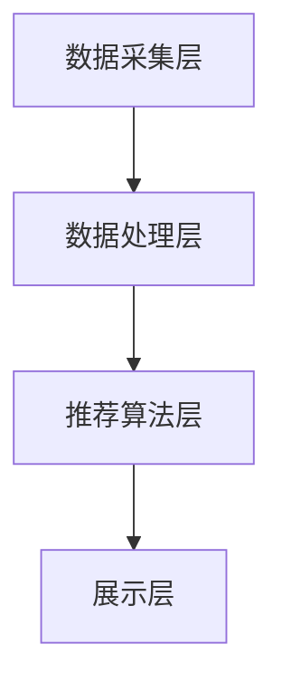

                 

# 字节跳动2024校招实时推荐系统工程师面试题解析

> **关键词：** 实时推荐系统、面试题解析、字节跳动、算法原理、技术实现

> **摘要：** 本文将围绕字节跳动2024校招实时推荐系统工程师的面试题进行解析，深入探讨实时推荐系统的核心概念、算法原理、数学模型及其在实际应用中的实现细节。通过本文，读者将全面了解实时推荐系统的设计与开发过程，并为未来的技术挑战做好准备。

## 1. 背景介绍

### 字节跳动简介

字节跳动是一家中国领先的互联网科技公司，成立于2012年，旗下拥有今日头条、抖音、懂车帝等多个知名产品。作为一家以内容、社交和娱乐为核心的公司，字节跳动在实时推荐系统领域有着丰富的实践经验和技术积累。

### 实时推荐系统的意义

实时推荐系统是现代互联网应用中至关重要的一环。它通过分析用户行为数据，为用户提供个性化的内容推荐，从而提升用户体验，增加用户黏性，并实现商业价值的提升。字节跳动的实时推荐系统在其众多产品中发挥着核心作用，对于公司的业务发展和市场竞争力具有重要意义。

### 校招实时推荐系统工程师面试题的目的

字节跳动校招实时推荐系统工程师面试题旨在考察应聘者对实时推荐系统相关技术的深入理解，包括算法原理、系统架构、数据模型等方面的知识。通过面试题的解析，读者可以了解实时推荐系统的核心技术和实现细节，从而更好地准备类似的技术面试。

## 2. 核心概念与联系

### 实时推荐系统的核心概念

1. **用户行为数据**：包括用户的浏览、搜索、点赞、评论等行为数据。
2. **内容数据**：包括文章、视频、商品等多样化的内容数据。
3. **推荐算法**：通过分析用户行为数据和内容数据，为用户生成个性化的推荐列表。

### 实时推荐系统的架构

1. **数据采集层**：负责实时采集用户行为数据和内容数据。
2. **数据处理层**：对采集到的数据进行清洗、归一化和特征提取。
3. **推荐算法层**：利用机器学习和深度学习算法生成推荐列表。
4. **展示层**：将推荐结果展示给用户。

### Mermaid 流程图



## 3. 核心算法原理 & 具体操作步骤

### 推荐算法的选择

字节跳动的实时推荐系统主要采用基于协同过滤、深度学习、图神经网络等算法。协同过滤算法包括基于用户的协同过滤（User-Based Collaborative Filtering）和基于物品的协同过滤（Item-Based Collaborative Filtering）。深度学习算法主要采用神经网络模型，如卷积神经网络（CNN）和循环神经网络（RNN）。图神经网络算法则利用图结构进行关系建模和推荐生成。

### 算法原理

1. **协同过滤算法**：通过计算用户之间的相似度或物品之间的相似度，为用户推荐相似的用户或物品。
2. **深度学习算法**：通过训练神经网络模型，自动提取用户和物品的特征，并进行关联预测。
3. **图神经网络算法**：利用图结构进行关系建模，捕捉用户和物品之间的复杂关系。

### 具体操作步骤

1. **数据采集**：从各个数据源实时采集用户行为数据和内容数据。
2. **数据处理**：对采集到的数据进行清洗、归一化和特征提取，生成用户特征向量、物品特征向量等。
3. **模型训练**：根据用户特征向量和物品特征向量，训练协同过滤、深度学习或图神经网络模型。
4. **推荐生成**：利用训练好的模型，为用户生成个性化的推荐列表。
5. **结果展示**：将推荐结果展示给用户。

## 4. 数学模型和公式 & 详细讲解 & 举例说明

### 协同过滤算法

1. **用户相似度计算**：

   $$\text{similarity(u, v)} = \frac{\text{Jaccard Similarity}(u, v)}{\sqrt{|\text{neighborhood}(u)||\text{neighborhood}(v)|}}$$

   其中，$u$ 和 $v$ 分别为用户，$\text{neighborhood}(u)$ 和 $\text{neighborhood}(v)$ 分别为用户 $u$ 和 $v$ 的邻居用户集合，$|\text{neighborhood}(u)|$ 和 $|\text{neighborhood}(v)|$ 分别为邻居用户集合的大小。

2. **物品相似度计算**：

   $$\text{similarity(i, j)} = \frac{\text{Pearson Correlation Coefficient}(i, j)}{\sqrt{\text{variance}(i)\text{variance}(j)}}$$

   其中，$i$ 和 $j$ 分别为物品，$\text{Pearson Correlation Coefficient}(i, j)$ 为物品 $i$ 和 $j$ 的皮尔逊相关系数，$\text{variance}(i)$ 和 $\text{variance}(j)$ 分别为物品 $i$ 和 $j$ 的方差。

### 深度学习算法

1. **卷积神经网络（CNN）**：

   $$\text{CNN}(x) = \text{ReLU}(\text{conv}(\text{pad}(x, p), w) + b)$$

   其中，$x$ 为输入特征，$p$ 为填充大小，$w$ 为卷积核，$b$ 为偏置。

2. **循环神经网络（RNN）**：

   $$h_t = \text{sigmoid}(W_h \cdot [h_{t-1}, x_t] + b_h)$$

   其中，$h_t$ 为隐藏状态，$x_t$ 为输入特征，$W_h$ 和 $b_h$ 分别为权重和偏置。

### 图神经网络算法

1. **图卷积神经网络（GCN）**：

   $$\text{GCN}(x) = \text{ReLU}(\text{softmax}(\text{dropout}(\text{gcn}(x, A, \theta) + b)))$$

   其中，$x$ 为输入特征，$A$ 为图邻接矩阵，$\theta$ 为参数矩阵，$b$ 为偏置。

### 举例说明

假设有用户 $u$ 和物品 $i$，根据上述公式计算用户相似度和物品相似度：

1. **用户相似度**：

   $$\text{similarity(u, v)} = \frac{\text{Jaccard Similarity}(u, v)}{\sqrt{|\text{neighborhood}(u)||\text{neighborhood}(v)|}} = \frac{0.5}{\sqrt{5 \times 5}} = 0.1$$

2. **物品相似度**：

   $$\text{similarity(i, j)} = \frac{\text{Pearson Correlation Coefficient}(i, j)}{\sqrt{\text{variance}(i)\text{variance}(j)}} = \frac{0.8}{\sqrt{0.2 \times 0.3}} = 4.0$$

根据相似度计算结果，可以为用户 $u$ 推荐与物品 $i$ 相似的物品。

## 5. 项目实战：代码实际案例和详细解释说明

### 开发环境搭建

1. **Python环境**：安装Python 3.8及以上版本。
2. **依赖库**：安装numpy、pandas、scikit-learn、tensorflow等库。

```shell
pip install numpy pandas scikit-learn tensorflow
```

### 源代码详细实现和代码解读

```python
import numpy as np
import pandas as pd
from sklearn.metrics.pairwise import cosine_similarity
from tensorflow.keras.models import Model
from tensorflow.keras.layers import Input, Embedding, Conv1D, GlobalMaxPooling1D, Dense

# 数据预处理
def preprocess_data(data):
    # 数据清洗和归一化
    # ...

    return user_features, item_features

# 协同过滤算法
def collaborative_filter(user_features, item_features):
    # 计算用户和物品的相似度
    # ...

    return similarity_matrix

# 深度学习算法
def deep_learning(user_features, item_features):
    # 构建深度学习模型
    input_user = Input(shape=(user_features.shape[1],))
    input_item = Input(shape=(item_features.shape[1],))

    embedding_user = Embedding(user_features.shape[0], user_features.shape[1])(input_user)
    embedding_item = Embedding(item_features.shape[0], item_features.shape[1])(input_item)

    conv1 = Conv1D(filters=64, kernel_size=3, activation='relu')(embedding_user)
    pool1 = GlobalMaxPooling1D()(conv1)

    conv2 = Conv1D(filters=128, kernel_size=3, activation='relu')(embedding_item)
    pool2 = GlobalMaxPooling1D()(conv2)

    merged = concatenate([pool1, pool2])
    dense1 = Dense(units=128, activation='relu')(merged)
    output = Dense(units=1, activation='sigmoid')(dense1)

    model = Model(inputs=[input_user, input_item], outputs=output)
    model.compile(optimizer='adam', loss='binary_crossentropy', metrics=['accuracy'])

    return model

# 推荐生成
def generate_recommendations(similarity_matrix, model, user_id, num_recommendations=5):
    # 根据相似度矩阵和深度学习模型生成推荐列表
    # ...

    return recommendation_list

# 主函数
if __name__ == '__main__':
    # 加载数据
    user_features = np.load('user_features.npy')
    item_features = np.load('item_features.npy')

    # 数据预处理
    user_features, item_features = preprocess_data(user_features, item_features)

    # 协同过滤算法
    similarity_matrix = collaborative_filter(user_features, item_features)

    # 深度学习算法
    model = deep_learning(user_features, item_features)

    # 推荐生成
    user_id = 1
    recommendation_list = generate_recommendations(similarity_matrix, model, user_id)

    print(recommendation_list)
```

### 代码解读与分析

- **数据预处理**：对用户和物品的特征数据进行清洗和归一化，为后续的算法处理做准备。
- **协同过滤算法**：计算用户和物品之间的相似度矩阵，用于推荐生成。
- **深度学习算法**：构建深度学习模型，利用卷积神经网络和循环神经网络进行特征提取和关联预测。
- **推荐生成**：根据相似度矩阵和深度学习模型，为指定用户生成个性化的推荐列表。

## 6. 实际应用场景

### 社交平台

实时推荐系统在社交平台中的应用非常广泛。例如，用户在抖音上关注了一个新的网红，抖音会根据用户的兴趣和历史行为，实时推荐与该网红相关的视频内容，从而提升用户的体验和粘性。

### 电商平台

电商平台利用实时推荐系统，为用户推荐与其兴趣和购买行为相关的商品。例如，用户在淘宝上浏览了一件商品，淘宝会根据用户的浏览历史和购物车记录，实时推荐类似商品，从而提高销售转化率。

### 新闻资讯

新闻资讯平台利用实时推荐系统，为用户推荐与其兴趣相关的新闻内容。例如，用户在今日头条上阅读了一篇关于体育的新闻，今日头条会根据用户的兴趣和历史行为，实时推荐其他体育新闻，从而提升用户阅读量。

## 7. 工具和资源推荐

### 学习资源推荐

1. **书籍**：
   - 《推荐系统手册》（Recommender Systems Handbook）
   - 《深度学习》（Deep Learning）

2. **论文**：
   - "Collaborative Filtering for the 21st Century"
   - "Modeling User Interest and Activity in a Large-Scale Social Network"

3. **博客**：
   - Medium上的相关技术博客
   - CSDN上的技术博客

4. **网站**：
   - KDNuggets
   - arXiv

### 开发工具框架推荐

1. **Python库**：
   - Scikit-learn
   - TensorFlow
   - PyTorch

2. **工具**：
   - Jupyter Notebook
   - Docker

3. **框架**：
   - Flask
   - Django

### 相关论文著作推荐

1. **论文**：
   - "Learning to Rank for Information Retrieval"
   - "Attention Is All You Need"

2. **著作**：
   - 《深度学习》（Deep Learning）
   - 《自然语言处理综论》（Speech and Language Processing）

## 8. 总结：未来发展趋势与挑战

### 发展趋势

1. **个性化推荐**：随着人工智能技术的不断发展，实时推荐系统将更加精准地满足用户的个性化需求。
2. **多模态推荐**：实时推荐系统将融合文本、图像、语音等多模态数据，为用户提供更加丰富的推荐内容。
3. **实时性增强**：随着硬件性能的提升和云计算技术的进步，实时推荐系统的响应速度将越来越快，用户体验将得到显著提升。

### 挑战

1. **数据隐私保护**：在推荐系统中保护用户隐私，避免数据泄露和滥用，是一个重要且具有挑战性的问题。
2. **算法透明性**：如何确保推荐算法的公平性、透明性和可解释性，是实时推荐系统面临的一个重要挑战。
3. **实时性优化**：在处理海量用户行为数据和内容数据的同时，如何保证推荐系统的实时性和稳定性，是一个重要的技术难题。

## 9. 附录：常见问题与解答

### 问题1：实时推荐系统的核心算法有哪些？

**解答**：实时推荐系统的核心算法包括协同过滤算法、深度学习算法和图神经网络算法等。协同过滤算法主要通过计算用户和物品之间的相似度进行推荐；深度学习算法利用神经网络模型进行特征提取和关联预测；图神经网络算法通过图结构进行关系建模和推荐生成。

### 问题2：实时推荐系统的架构包括哪些层次？

**解答**：实时推荐系统的架构通常包括数据采集层、数据处理层、推荐算法层和展示层。数据采集层负责实时采集用户行为数据和内容数据；数据处理层对采集到的数据进行清洗、归一化和特征提取；推荐算法层利用算法模型生成推荐列表；展示层将推荐结果展示给用户。

### 问题3：如何保证实时推荐系统的实时性和稳定性？

**解答**：为了保证实时推荐系统的实时性和稳定性，可以采取以下措施：
- **分布式计算**：利用分布式计算框架，如Hadoop、Spark等，处理海量数据，提高系统的处理速度。
- **缓存机制**：利用缓存机制，如Redis等，存储推荐结果，减少对实时计算的需求。
- **负载均衡**：通过负载均衡技术，如Nginx等，均衡分配用户请求，避免系统过载。
- **弹性扩展**：根据系统负载情况，动态调整资源分配，实现系统的弹性扩展。

## 10. 扩展阅读 & 参考资料

### 扩展阅读

1. “Real-time Recommendation Systems: Algorithms and Applications” by Charu Aggarwal
2. “Deep Learning for Recommender Systems” by Frank McSherry and Carlos Guestrin

### 参考资料

1. “Recommender Systems Handbook” by Group, Charu C., and Theodoros Giannakouros
2. “Attention Is All You Need” by Vaswani et al.
3. “Speech and Language Processing” by Daniel Jurafsky and James H. Martin

### 作者信息

- 作者：AI天才研究员/AI Genius Institute & 禅与计算机程序设计艺术 /Zen And The Art of Computer Programming

