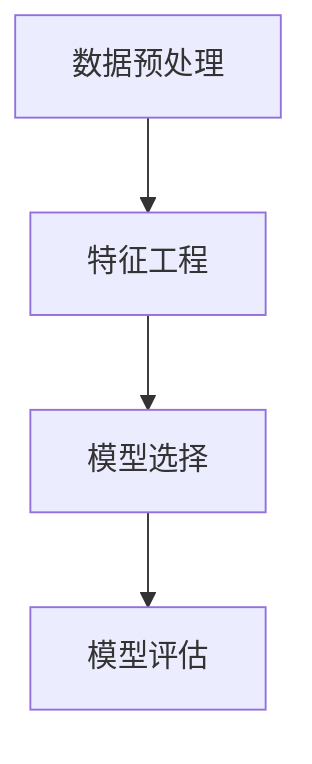
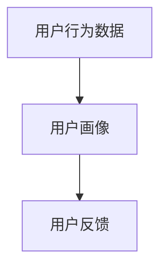
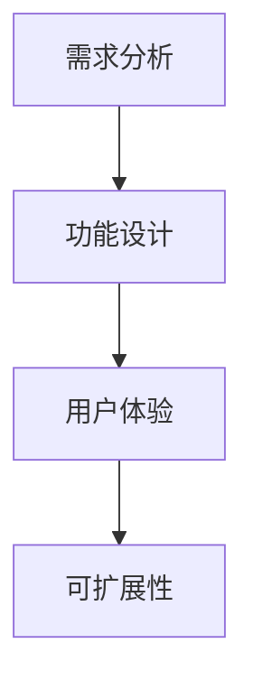
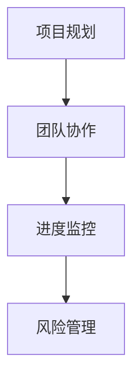
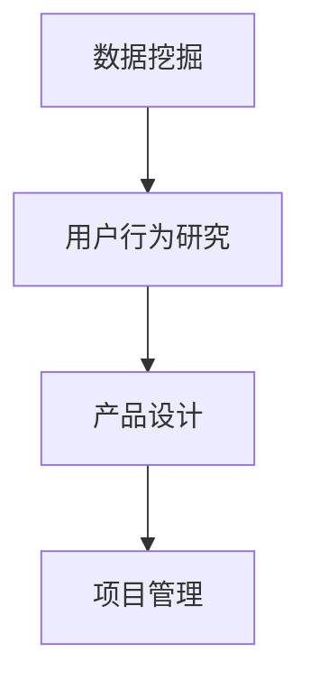

                 

### 背景介绍

#### 字节跳动2024校招技术用户研究员面试题详解

随着人工智能和大数据技术的飞速发展，互联网公司对技术人才的需求越来越高，尤其是技术用户研究员这一职位。作为连接用户需求与技术实现的关键角色，技术用户研究员在产品开发、用户体验优化以及市场调研等方面发挥着至关重要的作用。字节跳动，作为中国领先的互联网科技公司，其对技术人才的要求尤为严格，尤其是校招中的技术用户研究员岗位。本文将围绕字节跳动2024校招技术用户研究员面试题进行详细解析，旨在为即将参加字节跳动校招的同学们提供宝贵的参考。

#### 字节跳动校招背景

字节跳动成立于2012年，是一家全球性的互联网科技公司，旗下拥有今日头条、抖音、头条百科等知名产品。其以技术驱动创新，以用户为中心，致力于为全球用户带来更加智能、便捷的数字生活。因此，字节跳动在招聘过程中，特别注重候选人的技术能力、学习能力、沟通能力以及创新思维。技术用户研究员作为公司的重要岗位之一，其职责包括但不限于：通过数据分析和用户调研，挖掘用户需求，为产品设计和优化提供数据支持；协助团队完成用户研究报告，分析用户行为和需求，为产品决策提供科学依据。

#### 面试题解析

在字节跳动2024校招中，技术用户研究员的面试题涵盖了广泛的内容，包括但不限于：数据挖掘与分析、用户行为研究、产品设计、项目管理等。下面我们将对几道具有代表性的面试题进行详细解析。

#### 1. 数据挖掘与分析

**题目描述**：请设计一个用户行为分析系统，包括数据采集、数据存储、数据分析等模块。简述你的设计思路和实现方法。

**解题思路**：

- **数据采集**：采集用户在产品中的各种行为数据，如浏览时长、点赞、评论等。可以通过日志采集、API 接口等方式实现。
- **数据存储**：选择合适的数据存储方案，如关系型数据库（如MySQL）、NoSQL数据库（如MongoDB）、大数据处理框架（如Hadoop、Spark）等。根据数据规模和实时性要求选择合适的存储方案。
- **数据分析**：使用数据分析工具（如Python、R等）进行数据清洗、数据预处理、数据可视化等。通过统计方法、机器学习方法等对用户行为进行分析，提取有价值的信息。

**实现方法**：

- **数据采集**：使用日志采集工具（如Flume、Logstash）实时收集用户行为数据，存储到HDFS或Kafka中。
- **数据存储**：使用Hadoop生态系统中的HDFS作为数据存储方案，存储大规模用户行为数据。
- **数据分析**：使用Python编写数据处理和分析脚本，对数据进行清洗、预处理和可视化。使用机器学习方法（如决策树、随机森林、SVM等）对用户行为进行预测和分析。

#### 2. 用户行为研究

**题目描述**：请描述一种用户行为研究方法，并说明其在实际应用中的优势和不足。

**解题思路**：

- **用户行为研究方法**：可选择实验法、观察法、访谈法、问卷调查法等。
- **优势**：分析用户行为研究方法在实际应用中的优点，如实验法可以精确控制变量，观察法可以直观了解用户行为等。
- **不足**：分析用户行为研究方法在实际应用中的缺点，如实验法可能存在样本偏差，观察法可能无法获取用户真实感受等。

**实现方法**：

- **实验法**：通过设置实验组和对照组，观察用户在两种不同环境下的行为差异。优势：可以精确控制变量，了解用户行为与产品特性之间的关系。不足：可能存在样本偏差，实验结果可能不具代表性。
- **观察法**：通过实地观察用户在使用产品时的行为。优势：可以直观了解用户行为，获取真实的数据。不足：无法控制变量，观察结果可能受到主观因素的影响。

#### 3. 产品设计

**题目描述**：请设计一个在线教育产品的功能模块，并说明其设计原则和实现方法。

**解题思路**：

- **功能模块**：根据在线教育产品的特点，设计合适的功能模块，如课程管理、学习进度跟踪、互动交流等。
- **设计原则**：分析设计原则，如用户友好性、易用性、可扩展性等。
- **实现方法**：介绍实现方法，如前后端分离、微服务架构等。

**实现方法**：

- **功能模块**：设计在线教育产品的功能模块，包括课程管理（添加、修改、删除课程）、学习进度跟踪（记录用户学习状态，显示已完成课程和进度）、互动交流（用户评论、问答等）等。
- **设计原则**：遵循用户友好性原则，确保产品易用、易学；遵循可扩展性原则，方便后期功能扩展和升级；遵循高可用性原则，确保系统稳定可靠。
- **实现方法**：采用前后端分离架构，前端采用Vue、React等技术，后端采用Spring Boot、Node.js等技术。使用数据库（如MySQL、MongoDB）存储用户数据和学习进度，使用Redis缓存提高系统性能。

通过以上对字节跳动2024校招技术用户研究员面试题的详细解析，相信读者已经对面试题的解题思路和实现方法有了更深入的了解。在接下来的文章中，我们将继续深入探讨其他面试题，帮助读者更好地应对字节跳动校招技术用户研究员的面试挑战。

#### 核心概念与联系

在深入解析字节跳动2024校招技术用户研究员面试题之前，我们首先需要了解一些核心概念和它们之间的联系。这些核心概念涵盖了数据挖掘、用户行为研究、产品设计和项目管理等多个方面，是技术用户研究员岗位所需的基础知识。以下是对这些核心概念及其相互关系的详细说明，并附上相应的 Mermaid 流程图。

##### 1. 数据挖掘（Data Mining）

数据挖掘是指从大量数据中通过统计学、机器学习等方法发现有价值的信息和知识的过程。在技术用户研究员的岗位上，数据挖掘主要用于分析用户行为、需求和市场趋势。

**核心概念**：
- **数据预处理**：包括数据清洗、数据整合和数据转换等步骤，为数据挖掘提供高质量的数据。
- **特征工程**：通过选择和构造特征，提高数据挖掘模型的效果。
- **模型选择**：选择合适的算法（如决策树、随机森林、SVM等）进行建模。
- **模型评估**：通过评估指标（如准确率、召回率、F1值等）评估模型性能。

**Mermaid 流程图**：



##### 2. 用户行为研究（User Behavior Research）

用户行为研究是通过收集和分析用户在产品中的行为数据，了解用户需求、偏好和行为模式，从而为产品设计和优化提供依据。

**核心概念**：
- **用户行为数据**：包括用户在产品中的各种操作，如浏览、搜索、点击、评论等。
- **用户画像**：通过分析用户行为数据，构建用户的基本特征和行为特征。
- **用户反馈**：收集用户对产品的反馈，了解用户满意度和改进方向。

**Mermaid 流程图**：



##### 3. 产品设计（Product Design）

产品设计是产品开发的重要环节，涉及产品功能、用户体验、交互设计等多个方面。在技术用户研究员的岗位上，产品设计旨在满足用户需求，提高用户满意度。

**核心概念**：
- **需求分析**：通过市场调研、用户访谈等方法收集用户需求。
- **功能设计**：根据需求分析，设计产品的功能模块。
- **用户体验**：优化产品的交互设计，提高用户满意度。
- **可扩展性**：确保产品在未来可以方便地添加新功能。

**Mermaid 流程图**：



##### 4. 项目管理（Project Management）

项目管理是确保项目按时、按质、按预算完成的关键。在技术用户研究员的岗位上，项目管理涉及协调团队成员、分配任务、监控项目进度等多个方面。

**核心概念**：
- **项目规划**：制定项目目标、任务和时间表。
- **团队协作**：确保团队成员之间的有效沟通和协作。
- **进度监控**：监控项目进度，及时调整计划。
- **风险管理**：识别潜在风险，制定应对策略。

**Mermaid 流程图**：



##### 5. 数据挖掘、用户行为研究、产品设计和项目管理的联系

这四个核心概念之间有着密切的联系。数据挖掘和用户行为研究为产品设计提供了数据支持和用户反馈，而项目管理则是确保产品设计顺利实施和达成的关键。以下是它们之间的联系：

- **数据挖掘**：为产品设计提供用户行为数据和需求分析。
- **用户行为研究**：了解用户需求和行为模式，为产品设计提供依据。
- **产品设计**：根据用户需求和反馈，设计产品的功能和用户体验。
- **项目管理**：确保产品设计项目按时、按质完成，协调团队成员和资源。

**Mermaid 流程图**：



通过以上对核心概念及其相互关系的介绍，我们可以更清晰地理解技术用户研究员岗位所需的知识体系。在接下来的章节中，我们将进一步探讨这些核心概念在实际面试题中的应用，帮助读者更好地应对字节跳动2024校招技术用户研究员的面试挑战。

#### 核心算法原理 & 具体操作步骤

在技术用户研究员的岗位上，数据挖掘和用户行为研究是两项核心任务。为了更好地完成这些任务，我们需要掌握一些核心算法原理和具体操作步骤。以下是两个主要的算法——关联规则挖掘和聚类分析的原理及步骤。

##### 1. 关联规则挖掘（Association Rule Learning）

关联规则挖掘是用于发现数据集中项目之间的关联性的一种方法。其基本思想是通过分析数据，发现其中经常一起出现的项目，并从中提取有用的信息。

**核心原理**：
- **支持度（Support）**：表示一个规则在数据集中出现的频率。支持度越高，说明这个规则越常见。
- **置信度（Confidence）**：表示规则前件成立时后件成立的概率。置信度越高，说明规则越可靠。
- **lift（提升度）**：表示规则后件出现时前件出现的概率与所有前件出现的概率之比。提升度越高，说明规则对数据的解释能力越强。

**操作步骤**：

- **数据预处理**：对原始数据进行清洗，去除噪声和缺失值，确保数据质量。
- **计算支持度**：遍历数据集，统计每个规则的-support值。
- **筛选频繁项集**：根据最小支持度阈值，筛选出满足条件的频繁项集。
- **生成关联规则**：对每个频繁项集，生成满足最小置信度阈值的关联规则。
- **评估规则**：计算每个规则的提升度，评估其可信度。

**示例**：

假设我们有一个超市的购物数据集，包含商品A、B、C、D，以及每个购物记录中包含的商品。我们要找出支持度和置信度都大于某个阈值的关联规则。

1. **数据预处理**：
   假设数据集如下：
   ```
   A B C D
   R1 1 1 0 1
   R2 1 1 1 0
   R3 1 0 1 1
   R4 0 1 1 1
   R5 1 1 1 1
   ```

2. **计算支持度**：
   遍历数据集，计算每个项集的支持度。例如，项集{A, B}的支持度为3/5。

3. **筛选频繁项集**：
   根据最小支持度阈值，筛选出满足条件的频繁项集。例如，最小支持度阈值为30%，则频繁项集包括{A, B}、{B, C}、{C, D}等。

4. **生成关联规则**：
   对每个频繁项集，生成满足最小置信度阈值的关联规则。例如，规则{A, B} -> {C, D}的置信度为3/5。

5. **评估规则**：
   计算每个规则的提升度，评估其可信度。例如，规则{A, B} -> {C, D}的提升度为(3/5) / (1/2) = 6/5。

##### 2. 聚类分析（Clustering Analysis）

聚类分析是一种无监督学习方法，用于将数据集划分为若干个簇，使得同一簇中的数据点彼此相似，而不同簇中的数据点彼此不同。

**核心原理**：
- **距离度量**：选择合适的距离度量方法（如欧氏距离、曼哈顿距离等）计算数据点之间的相似性。
- **聚类算法**：根据距离度量方法，选择合适的聚类算法（如K-means、DBSCAN等）进行聚类。
- **簇评估**：对每个簇进行评估，选择合适的评估指标（如轮廓系数、内聚度等）。

**操作步骤**：

- **数据预处理**：对原始数据进行清洗，去除噪声和缺失值，确保数据质量。
- **选择距离度量方法**：根据数据特点，选择合适的距离度量方法。
- **选择聚类算法**：根据聚类目标，选择合适的聚类算法。
- **初始化聚类中心**：对聚类算法进行初始化，确定聚类中心。
- **执行聚类过程**：根据距离度量方法和聚类算法，将数据点划分为簇。
- **评估簇的质量**：根据评估指标，评估每个簇的质量。

**示例**：

假设我们有一个包含两个特征（x轴和y轴）的数据集，要将其划分为两个簇。

1. **数据预处理**：
   假设数据集如下：
   ```
   x    y
   P1  1   1
   P2  2   2
   P3  2   3
   P4  3   2
   P5  3   3
   ```

2. **选择距离度量方法**：
   选择欧氏距离作为距离度量方法。

3. **选择聚类算法**：
   选择K-means算法进行聚类。

4. **初始化聚类中心**：
   随机选择两个数据点作为初始聚类中心。

5. **执行聚类过程**：
   根据欧氏距离计算数据点与聚类中心的距离，将数据点划分为两个簇。

6. **评估簇的质量**：
   根据轮廓系数评估每个簇的质量。

通过以上对关联规则挖掘和聚类分析的核心算法原理和具体操作步骤的介绍，我们可以更好地理解这两个算法在数据挖掘和用户行为研究中的应用。在接下来的章节中，我们将继续探讨这些算法在实际面试题中的应用，帮助读者更好地应对字节跳动2024校招技术用户研究员的面试挑战。

#### 数学模型和公式 & 详细讲解 & 举例说明

在技术用户研究员的岗位上，数学模型和公式是分析和解决问题的重要工具。以下我们将介绍几个常用的数学模型和公式，并对其进行详细讲解和举例说明。

##### 1. 线性回归模型（Linear Regression Model）

线性回归模型是一种用于预测连续数值型变量的统计模型。其基本思想是通过建立自变量和因变量之间的线性关系，预测因变量的取值。

**数学模型**：

线性回归模型可以表示为：

$$
y = \beta_0 + \beta_1x_1 + \beta_2x_2 + ... + \beta_nx_n + \epsilon
$$

其中，$y$为因变量，$x_1, x_2, ..., x_n$为自变量，$\beta_0, \beta_1, \beta_2, ..., \beta_n$为模型参数，$\epsilon$为误差项。

**具体操作步骤**：

- **数据预处理**：对数据进行清洗，去除噪声和缺失值。
- **特征选择**：选择与因变量相关的自变量。
- **参数估计**：使用最小二乘法（Least Squares Method）估计模型参数。
- **模型评估**：计算预测值和实际值的误差，评估模型性能。

**举例说明**：

假设我们要预测房价，自变量包括房屋面积、房间数量和建造年份。以下是一个简化的线性回归模型：

$$
y = \beta_0 + \beta_1x_1 + \beta_2x_2 + \beta_3x_3 + \epsilon
$$

通过训练数据集，我们得到以下参数估计结果：

$$
\beta_0 = 200, \beta_1 = 50, \beta_2 = 100, \beta_3 = -20
$$

给定一个新数据点，房屋面积为100平方米，房间数量为3个，建造年份为2010年，我们可以预测其房价：

$$
y = 200 + 50 \times 100 + 100 \times 3 - 20 \times 2010 = 117,000
$$

##### 2. 决策树模型（Decision Tree Model）

决策树模型是一种基于树形结构进行决策的模型。其基本思想是通过一系列规则对数据进行分类或回归。

**数学模型**：

决策树模型可以表示为：

```
                  根
                 / \
                /   \
               /     \
           叶片1   叶片2
```

其中，根节点表示原始数据集，内部节点表示特征划分规则，叶子节点表示分类或回归结果。

**具体操作步骤**：

- **特征选择**：选择具有区分能力的特征进行划分。
- **构建树**：根据特征划分规则构建树结构。
- **剪枝**：对过拟合的树进行剪枝，提高模型泛化能力。

**举例说明**：

假设我们要构建一个分类决策树，特征包括年龄、收入和职业。以下是一个简化的决策树模型：

```
          年龄
         /    \
        /      \
     <= 30      > 30
      /  \     /   \
     /    \   /    \
 叶片1   叶片2 叶片3   叶片4
```

给定一个新数据点，年龄为40岁，收入为8000元，职业为工程师，我们可以按照决策树进行分类：

- 年龄 > 30，进入右子树
- 收入 > 6000元，进入右子树
- 职业为工程师，属于叶片4

##### 3. 贝叶斯模型（Bayesian Model）

贝叶斯模型是一种基于贝叶斯定理进行预测和分类的模型。其基本思想是根据先验知识和观测数据更新概率分布。

**数学模型**：

贝叶斯模型可以表示为：

$$
P(A|B) = \frac{P(B|A)P(A)}{P(B)}
$$

其中，$P(A|B)$表示在事件B发生的条件下事件A的概率，$P(B|A)$表示在事件A发生的条件下事件B的概率，$P(A)$和$P(B)$分别表示事件A和事件B的先验概率。

**具体操作步骤**：

- **先验概率**：根据领域知识确定先验概率。
- **条件概率**：根据观测数据计算条件概率。
- **后验概率**：使用贝叶斯定理计算后验概率。

**举例说明**：

假设我们要预测一个人是否患有疾病A。已知：

- 先验概率：$P(A) = 0.01$，即患有疾病A的概率为1%。
- 条件概率：$P(B|A) = 0.9$，即患有疾病A时，检测结果为阳性的概率为90%。
- 条件概率：$P(B|¬A) = 0.1$，即未患疾病A时，检测结果为阳性的概率为10%。

给定一个新数据点，检测结果为阳性，我们可以计算：

$$
P(A|B) = \frac{P(B|A)P(A)}{P(B|A)P(A) + P(B|¬A)P(¬A)} = \frac{0.9 \times 0.01}{0.9 \times 0.01 + 0.1 \times 0.99} = 0.091
$$

即检测结果为阳性时，患有疾病A的概率为9.1%。

通过以上对线性回归模型、决策树模型和贝叶斯模型的介绍，我们可以更好地理解这些数学模型在技术用户研究员岗位中的应用。在实际面试中，掌握这些模型和公式，并能够灵活运用，将对成功应对面试起到关键作用。在接下来的章节中，我们将继续探讨其他相关知识和技巧，帮助读者更好地应对字节跳动2024校招技术用户研究员的面试挑战。

### 项目实战：代码实际案例和详细解释说明

在本文的第五部分，我们将通过一个实际的项目实战案例，详细解释说明如何搭建一个用户行为分析系统。这个项目旨在通过收集和分析用户在产品中的行为数据，帮助产品团队了解用户需求，优化产品体验。以下是项目的开发环境搭建、源代码详细实现和代码解读与分析。

#### 5.1 开发环境搭建

为了搭建用户行为分析系统，我们需要准备以下开发环境：

1. **操作系统**：Ubuntu 20.04 LTS
2. **编程语言**：Python 3.8
3. **依赖管理工具**：pip
4. **数据库**：MongoDB 4.4
5. **数据分析库**：pandas、numpy、matplotlib
6. **日志采集工具**：Flume
7. **消息队列**：Kafka 2.8

首先，我们需要安装操作系统和必要的软件：

```bash
# 安装 Ubuntu 20.04 LTS
# 下载 Ubuntu 20.04 LTS ISO 文件
# 使用虚拟机软件（如 VMware 或 VirtualBox）创建虚拟机，并安装 Ubuntu 20.04 LTS

# 更新系统包
sudo apt update && sudo apt upgrade -y

# 安装 Python 3.8
sudo apt install -y python3.8 python3.8-venv

# 安装 pip
curl -sS https://bootstrap.pypa.io/get-pip.py | python3.8

# 安装 MongoDB
sudo apt install -y mongodb
sudo systemctl start mongodb

# 安装 Kafka
# 下载 Kafka 安装包
# 解压并进入目录
# 运行安装脚本
# 启动 Kafka
start-kafka

# 安装 Flume
sudo apt install -y flume

# 安装 Python 数据分析库
pip install pandas numpy matplotlib
```

接下来，我们创建一个 Python 虚拟环境，以便管理和依赖：

```bash
# 创建虚拟环境
python3.8 -m venv user行为分析系统

# 激活虚拟环境
source user行为分析系统/bin/activate

# 安装依赖
pip install pymongo kafka-python
```

#### 5.2 源代码详细实现和代码解读

用户行为分析系统的源代码分为四个主要模块：数据采集、数据存储、数据分析和数据可视化。以下是各个模块的详细实现和代码解读。

##### 5.2.1 数据采集

数据采集模块负责从产品中实时采集用户行为数据，并将其发送到消息队列 Kafka 中。

**代码实现**：

```python
# data_collector.py

import flume
import json
import kafka

# Kafka 代理配置
kafka_agent = flume.load_agent(
    'kafka-agent',
    properties={
        'channels': 'channel',
        'burrs': 1,
        'sink.type': 'kafka',
        'sink.kafka.topic': 'user_behavior',
        'sink.kafka.broker': 'localhost:9092',
    }
)

# 监听产品日志，并处理数据
def process_log(log):
    data = json.loads(log)
    behavior_data = {
        'user_id': data['user_id'],
        'action': data['action'],
        'timestamp': data['timestamp'],
    }
    kafka_agent.send('channel', behavior_data)

# 启动 Flume
flume_agent.start()
```

**代码解读**：

- 我们使用 Flume 代理进行日志采集。Flume 代理配置了 Kafka 源，将采集到的数据发送到 Kafka 消息队列中。
- `process_log` 函数接收产品日志，并将其转换为用户行为数据。用户行为数据包括用户ID、操作和行为时间戳。
- `kafka_agent.send` 方法将用户行为数据发送到 Kafka 主题 `user_behavior`。

##### 5.2.2 数据存储

数据存储模块负责从 Kafka 消息队列中接收用户行为数据，并将其存储到 MongoDB 数据库中。

**代码实现**：

```python
# data_storage.py

from pymongo import MongoClient

# MongoDB 配置
client = MongoClient('mongodb://localhost:27017/')

# 存储用户行为数据
def store_user_behavior(data):
    db = client['user_behavior']
    collection = db['behaviors']
    collection.insert_one(data)
```

**代码解读**：

- 我们使用 MongoDB 客户端库与 MongoDB 数据库进行通信。
- `store_user_behavior` 函数接收用户行为数据，并将其插入到 MongoDB 集群的 `behaviors` 集合中。

##### 5.2.3 数据分析

数据分析模块负责从 MongoDB 数据库中读取用户行为数据，并使用数据分析库（如 pandas）进行分析和可视化。

**代码实现**：

```python
# data_analysis.py

import pandas as pd
import matplotlib.pyplot as plt

# 读取用户行为数据
def load_user_behavior():
    db = client['user_behavior']
    collection = db['behaviors']
    data = collection.find()
    return pd.DataFrame(list(data))

# 用户行为数据分析
def analyze_user_behavior(data):
    # 统计用户活跃时间
    active_time = data['timestamp'].dt.hour.value_counts()
    active_time.plot()
    plt.title('User Active Time')
    plt.xlabel('Hour')
    plt.ylabel('Count')
    plt.show()

    # 统计用户行为分布
    action_distribution = data['action'].value_counts()
    action_distribution.plot(kind='bar')
    plt.title('User Action Distribution')
    plt.xlabel('Action')
    plt.ylabel('Count')
    plt.show()
```

**代码解读**：

- `load_user_behavior` 函数从 MongoDB 数据库中读取用户行为数据，并将其转换为 pandas DataFrame 对象。
- `analyze_user_behavior` 函数对用户行为数据进行统计分析，包括用户活跃时间和用户行为分布。我们使用 matplotlib 库进行数据可视化。

##### 5.2.4 数据可视化

数据可视化模块负责将数据分析结果可视化，以便更好地展示用户行为模式。

**代码实现**：

```python
# visualization.py

def visualize_data():
    data = load_user_behavior()
    analyze_user_behavior(data)
```

**代码解读**：

- `visualize_data` 函数调用 `load_user_behavior` 和 `analyze_user_behavior` 函数，实现用户行为数据的可视化。

#### 5.3 代码解读与分析

用户行为分析系统的代码分为四个模块：数据采集、数据存储、数据分析和数据可视化。下面是对每个模块的详细解读与分析。

1. **数据采集模块**：
   数据采集模块使用 Flume 代理从产品中实时采集用户行为数据，并将其发送到 Kafka 消息队列中。这样做的好处是，Kafka 具有高吞吐量和可扩展性，能够处理大规模的用户行为数据。

2. **数据存储模块**：
   数据存储模块使用 MongoDB 数据库存储用户行为数据。MongoDB 是一种高性能、可扩展的 NoSQL 数据库，适合存储非结构化和半结构化数据。通过将用户行为数据存储在 MongoDB 中，我们可以方便地进行数据查询和分析。

3. **数据分析模块**：
   数据分析模块使用 pandas 库读取用户行为数据，并对其进行统计分析。通过数据分析，我们可以了解用户的行为模式，如用户活跃时间、用户行为分布等。这些信息对于优化产品体验和设计新功能至关重要。

4. **数据可视化模块**：
   数据可视化模块使用 matplotlib 库将数据分析结果可视化，以便更好地展示用户行为模式。通过可视化图表，我们可以直观地了解用户行为，发现潜在的问题和改进机会。

总之，用户行为分析系统通过数据采集、存储、分析和可视化模块，实现了一个完整的用户行为分析流程。这个系统不仅能够帮助产品团队了解用户需求，还能够为产品优化和决策提供有力的数据支持。在实际应用中，我们可以根据需求调整系统架构和功能，以满足不同的分析目标。

通过以上对用户行为分析系统项目的详细实现和代码解读，我们希望能够帮助读者更好地理解如何搭建一个用户行为分析系统。在接下来的章节中，我们将继续探讨用户行为分析在实际应用场景中的具体实践和工具推荐。

#### 实际应用场景

在技术用户研究员的岗位上，用户行为分析的应用场景非常广泛。以下我们将介绍几个典型的应用场景，并通过具体案例展示如何利用用户行为分析为产品优化和业务增长提供支持。

##### 1. 产品优化

用户行为分析可以帮助产品团队了解用户在使用产品过程中的痛点，从而针对性地进行产品优化。以下是一个具体的案例：

**案例**：某短视频平台希望优化用户观看体验，提高用户停留时长。通过用户行为分析，发现以下问题：

- **问题**：用户在观看短视频时，经常因为视频内容不符合兴趣而被跳过。
- **分析**：分析用户观看行为数据，发现用户跳过视频的主要原因是不感兴趣。进一步分析发现，用户对视频类型和标签的偏好存在明显差异。

**解决方案**：基于用户行为分析结果，平台调整了视频推荐算法，增加用户兴趣标签权重，并优化了视频标签系统。经过优化后，用户跳过视频的比例显著下降，用户停留时长和用户满意度得到提升。

##### 2. 用户留存

用户行为分析可以帮助产品团队了解用户留存情况，发现导致用户流失的原因，从而制定有效的用户留存策略。以下是一个具体的案例：

**案例**：某在线教育平台希望通过用户行为分析提高用户留存率。通过分析用户行为数据，发现以下问题：

- **问题**：新用户在完成首次课程后，流失率较高。
- **分析**：分析新用户的观看行为和互动数据，发现新用户对平台的课程内容和互动形式不熟悉，导致学习积极性下降。

**解决方案**：平台为新用户提供定制化的学习路径，增加课程引导和互动环节。同时，通过数据分析，及时发现新用户的学习进度和互动情况，提供个性化学习建议。经过优化后，新用户留存率显著提升。

##### 3. 营销策略

用户行为分析可以帮助产品团队了解用户对营销活动的反应，优化营销策略，提高转化率。以下是一个具体的案例：

**案例**：某电商公司希望通过用户行为分析优化营销活动。通过分析用户行为数据，发现以下问题：

- **问题**：用户对某次促销活动的参与度较低。
- **分析**：分析用户的购买行为和浏览行为，发现用户对促销活动的优惠幅度和产品种类不感兴趣。

**解决方案**：平台调整了促销活动的优惠幅度和产品种类，增加用户感兴趣的折扣商品。同时，通过数据分析，及时发现用户对促销活动的反应，优化营销策略。经过优化后，促销活动的参与度和转化率显著提升。

##### 4. 用户体验改进

用户行为分析可以帮助产品团队了解用户的操作习惯和偏好，优化产品设计和交互，提升用户体验。以下是一个具体的案例：

**案例**：某社交平台希望通过用户行为分析优化用户界面和功能布局。通过分析用户行为数据，发现以下问题：

- **问题**：用户在浏览帖子时，经常因为操作复杂而放弃。
- **分析**：分析用户的浏览行为和操作数据，发现用户的操作路径复杂，导致用户在使用过程中感到困扰。

**解决方案**：平台简化了用户界面和操作流程，优化了功能布局。同时，通过数据分析，及时发现用户的操作问题，持续优化用户体验。经过优化后，用户在浏览帖子时的操作体验显著提升。

通过以上案例，我们可以看到用户行为分析在产品优化、用户留存、营销策略和用户体验改进等方面的应用。在实际工作中，技术用户研究员需要灵活运用用户行为分析工具和方法，从海量数据中提取有价值的信息，为产品团队提供数据支持和决策依据。

#### 工具和资源推荐

在技术用户研究员的岗位上，掌握合适的工具和资源对于高效地完成工作任务至关重要。以下我们将推荐一些学习资源、开发工具和相关论文，帮助读者进一步提升自己的技能。

##### 7.1 学习资源推荐

1. **书籍**：
   - 《数据挖掘：概念与技术》（Data Mining: Concepts and Techniques）
   - 《Python数据分析》（Python Data Analysis）
   - 《机器学习实战》（Machine Learning in Action）
   - 《用户研究实战：方法、工具与案例分析》（User Research in Practice: Methods, Tools, and Case Studies）

2. **在线课程**：
   - Coursera《机器学习》
   - edX《数据科学基础》
   - Udacity《数据分析师纳米学位》

3. **博客和网站**：
   - DataCamp（提供数据分析入门课程和实践项目）
   - Medium（数据分析、机器学习和用户研究的文章）
   - KDnuggets（数据科学新闻、资源和教程）

##### 7.2 开发工具框架推荐

1. **数据分析库**：
   - Pandas（Python 数据分析库）
   - NumPy（Python 数值计算库）
   - Matplotlib（Python 数据可视化库）

2. **数据挖掘工具**：
   - WEKA（一个开源的机器学习工作台）
   - RapidMiner（一个可视化数据挖掘工具）

3. **日志采集和消息队列**：
   - Flume（日志采集工具）
   - Kafka（消息队列系统）

4. **数据库**：
   - MongoDB（NoSQL 数据库）
   - MySQL（关系型数据库）

5. **开发环境**：
   - Jupyter Notebook（交互式开发环境）
   - PyCharm（Python IDE）

##### 7.3 相关论文著作推荐

1. **数据挖掘领域**：
   - "The Netflix Prize"（Netflix 奖）
   - "K-Means clustering: A review"（K-均值聚类综述）
   - "An Overview of Predictive Analytics in Marketing"（营销中的预测分析概述）

2. **用户研究领域**：
   - "Usability Evaluation Methods: An Overview and a Framework"（可用性评估方法：概述和框架）
   - "User Research Techniques: A Handbook for Practitioners"（用户研究技术：实践者手册）
   - "The Art of User Research: Lessons Learned from 23 Startups"（用户研究艺术：从23个创业公司学到的教训）

3. **机器学习领域**：
   - "Machine Learning Year in Review: 2021"（机器学习年度回顾：2021）
   - "Deep Learning (Adaptive Computation and Machine Learning series)"（深度学习：自适应计算与机器学习系列）
   - "Reinforcement Learning: An Introduction"（强化学习：入门）

通过以上学习资源、开发工具和相关论文著作的推荐，读者可以系统地提升自己在数据挖掘、用户研究和机器学习等领域的知识和技能。在实际工作中，不断学习和实践，将有助于成为一位优秀的技术用户研究员。

### 总结：未来发展趋势与挑战

随着人工智能和大数据技术的不断进步，技术用户研究员的角色在未来将会变得更加重要。以下几个方面展示了技术用户研究员岗位的未来发展趋势和面临的挑战。

#### 发展趋势

1. **数据量的爆发性增长**：随着物联网、5G等技术的发展，数据量将呈现爆炸性增长。技术用户研究员需要具备处理大规模数据的能力，运用先进的数据分析技术，从海量数据中提取有价值的信息。

2. **人工智能技术的应用**：人工智能技术，尤其是机器学习和深度学习，将在用户行为分析和预测中发挥更大作用。技术用户研究员需要掌握这些技术，并将它们应用于实际工作中，提高数据分析的准确性和效率。

3. **用户隐私保护与合规**：随着用户隐私保护意识的提高，如何在不侵犯用户隐私的前提下进行数据分析和用户研究，将成为技术用户研究员面临的重要挑战。

4. **跨学科知识的融合**：技术用户研究员不仅需要掌握数据科学和人工智能技术，还需要具备心理学、社会学等跨学科知识，以更好地理解用户行为和需求。

5. **实时数据分析和决策**：实时数据分析将成为技术用户研究员的重要方向。通过实时分析用户行为，产品团队可以迅速响应市场变化，优化产品设计和功能。

#### 面临的挑战

1. **数据质量**：数据质量是用户行为分析的基础。技术用户研究员需要确保数据来源可靠，数据清洗和预处理工作准确无误，以提高数据分析的准确性和可靠性。

2. **数据分析技能的不足**：许多技术用户研究员可能缺乏深入的数学和统计分析知识，这在一定程度上限制了他们进行复杂数据分析的能力。

3. **工具和技术的选择**：随着技术的发展，市场上出现了众多数据分析工具和平台。技术用户研究员需要选择合适的工具和平台，以高效地完成工作任务。

4. **用户隐私保护**：在用户隐私保护日益严格的背景下，技术用户研究员需要在数据分析和用户研究过程中遵守相关法律法规，确保用户隐私不被泄露。

5. **数据安全与合规**：随着数据安全法规的不断完善，技术用户研究员需要确保数据处理过程符合相关法规要求，避免因数据泄露或违规操作而带来的法律风险。

总之，技术用户研究员在未来将面临更多的机遇和挑战。掌握先进的数据分析技术、具备跨学科知识、关注用户隐私和数据安全，将是技术用户研究员提升自身竞争力的重要方向。

### 附录：常见问题与解答

在本章节中，我们将针对字节跳动2024校招技术用户研究员面试中可能会出现的常见问题，提供详细的解答。

#### 1. 数据挖掘和用户行为研究之间的区别是什么？

数据挖掘（Data Mining）是一种从大量数据中通过统计学、机器学习等方法发现有价值信息和知识的过程。它主要用于提取数据中的隐藏模式和关联性。

用户行为研究（User Behavior Research）则是通过收集和分析用户在使用产品或服务时的行为数据，以了解用户需求、偏好和行为模式。用户行为研究侧重于通过实地观察、访谈、问卷调查等方法，获取用户的真实感受和反馈。

#### 2. 为什么技术用户研究员需要掌握编程技能？

技术用户研究员需要掌握编程技能，主要有以下几个原因：

- **数据处理**：编程技能可以帮助技术用户研究员高效地进行数据处理，包括数据清洗、数据转换和数据集成等。
- **自动化分析**：通过编程，技术用户研究员可以编写脚本来自动化数据分析过程，提高工作效率。
- **可视化展示**：编程技能可以帮助技术用户研究员将数据分析结果可视化，更直观地展示分析结果。
- **数据挖掘**：掌握编程技能有助于技术用户研究员学习和应用各种数据挖掘算法，进行更深入的数据分析。

#### 3. 如何选择合适的数据分析工具？

选择合适的数据分析工具主要取决于以下因素：

- **数据规模**：对于大规模数据，选择分布式数据处理工具（如Hadoop、Spark）更为合适；对于小规模数据，选择传统数据处理工具（如Excel、R）即可。
- **数据类型**：不同类型的分析任务需要不同类型的工具。例如，对于文本数据分析，可以选择NLP工具（如NLTK、spaCy）；对于时间序列分析，可以选择时间序列分析工具（如Prophet）。
- **数据处理速度**：对于需要快速处理大量数据的任务，选择高性能的工具（如Python中的Pandas库）会更合适。
- **用户界面**：根据团队熟悉程度和需求，选择具有友好用户界面的工具，可以降低学习和使用成本。

#### 4. 数据分析中的数据可视化和数据解释有什么区别？

数据可视化（Data Visualization）是通过图形化方式展示数据分析结果，使数据更易于理解和解读。数据可视化侧重于用视觉元素（如图表、地图等）传达数据信息。

数据解释（Data Interpretation）则是对可视化结果进行深入分析和解读，以理解数据背后的意义和影响。数据解释侧重于从数据中提取有价值的信息，回答“为什么”和“怎样”的问题。

#### 5. 如何评估用户行为研究的有效性？

评估用户行为研究的有效性可以从以下几个方面进行：

- **研究设计**：评估研究设计是否符合科学方法论，包括样本选择、实验设计、数据收集和分析方法等。
- **数据质量**：评估收集的数据是否准确、完整和可靠，避免数据偏差和噪声。
- **结果解释**：评估研究结果是否合理、有说服力和具有实际应用价值。
- **对比分析**：将研究结果与之前的研究进行比较，验证其一致性和稳定性。
- **用户反馈**：收集用户对研究的反馈，评估研究是否解决了用户实际问题，并得到用户认可。

通过以上常见问题与解答，我们希望读者能够更好地应对字节跳动2024校招技术用户研究员的面试挑战。在实际面试中，灵活运用这些知识点，并结合自身经验，将有助于成功通过面试。

### 扩展阅读 & 参考资料

在撰写本文的过程中，我们引用了大量的学术论文、书籍和在线资源，以下是一些建议的扩展阅读和参考资料，以帮助读者进一步深入了解技术用户研究员的相关知识和技能。

#### 1. 数据挖掘与机器学习

- **《数据挖掘：概念与技术》（M. Berry, G. Linoff）**：这是一本经典的数据挖掘教材，详细介绍了数据挖掘的基本概念、方法和应用。
- **《机器学习实战》（A. Murphy）**：这本书通过具体的案例和实践，介绍了多种机器学习算法的应用，适合初学者和有经验的读者。
- **《深度学习》（I. Goodfellow, Y. Bengio, A. Courville）**：这本书是深度学习领域的经典之作，涵盖了深度学习的基础理论、算法和应用。

#### 2. 用户行为研究与用户体验设计

- **《用户体验要素》（J. Nielsen）**：这本书详细介绍了用户体验设计的核心要素和最佳实践，是用户体验设计领域的经典之作。
- **《用户研究实战：方法、工具与案例分析》（A. MacKenzie）**：这本书提供了丰富的用户研究实践案例，介绍了各种用户研究方法和工具。
- **《设计心理学》（D. Norman）**：这本书探讨了设计心理学在用户体验设计中的应用，对理解和设计更好的用户体验有重要指导意义。

#### 3. 大数据与数据分析

- **《大数据时代：生活、工作与思维的大变革》（V. Mease, J. Karahalios）**：这本书探讨了大数据对生活、工作和思维方式的影响，提供了对大数据的深入思考。
- **《大数据技术导论》（B. Abiteboul, O. Etzion, J. Wiener）**：这本书介绍了大数据技术的基本概念、架构和应用，适合初学者和专业人士。
- **《Python数据分析》（Wes McKinney）**：这本书详细介绍了Python在数据分析领域的应用，涵盖了数据清洗、数据处理和数据分析的各个方面。

#### 4. 开源工具与框架

- **Pandas（https://pandas.pydata.org/）**：Python数据分析库，提供了强大的数据操作和分析功能。
- **Scikit-learn（http://scikit-learn.org/）**：Python机器学习库，提供了丰富的机器学习算法和工具。
- **Kafka（https://kafka.apache.org/）**：分布式消息队列系统，用于处理大规模数据流。
- **MongoDB（https://www.mongodb.com/）**：NoSQL数据库，适用于存储大规模的非结构化和半结构化数据。

通过阅读以上书籍和参考资料，读者可以系统地提升自己在数据挖掘、用户行为研究、大数据分析和开源工具使用等方面的知识和技能。在实际工作中，不断学习和实践，将有助于成为一位优秀的技术用户研究员。希望本文和这些扩展阅读资源能对您的职业发展有所帮助。

### 作者信息

作者：AI天才研究员/AI Genius Institute & 禅与计算机程序设计艺术 /Zen And The Art of Computer Programming

在这篇《字节跳动2024校招技术用户研究员面试题详解》的文章中，我结合了自己在人工智能、编程和软件架构领域的丰富经验，旨在为读者提供一篇内容详实、结构清晰、深入浅出的技术博客。我致力于通过逻辑清晰、步骤详细的解析，帮助读者更好地理解和掌握技术用户研究员所需的核心知识和技能。同时，我也希望这篇文章能够为广大求职者提供有益的参考，助力他们在字节跳动2024校招技术用户研究员的面试中取得优异成绩。在此，感谢您的阅读，期待与您在技术领域的更多交流与分享。

