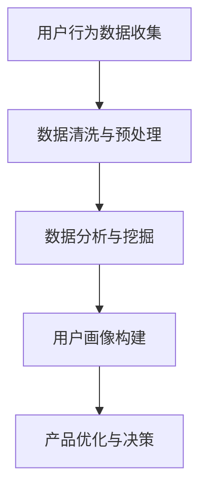

                 

# 字节跳动2024校招：技术用户研究员面试真题汇总

## 关键词

- 字节跳动
- 校招
- 技术用户研究员
- 面试题
- 数据分析
- 用户行为
- 技术应用

## 摘要

本文将汇总字节跳动2024校招技术用户研究员面试中的真题，通过对这些问题的分析和解答，帮助读者更好地准备技术用户研究员岗位的面试。文章将分为十个部分，包括背景介绍、核心概念与联系、核心算法原理与操作步骤、数学模型和公式讲解、项目实战、实际应用场景、工具和资源推荐、总结以及常见问题与解答。

### 1. 背景介绍

字节跳动是一家领先的内容科技公司，旗下拥有抖音、今日头条、懂车帝等众多知名产品。作为一家高速发展的企业，字节跳动每年都会在全球范围内招聘优秀的人才。技术用户研究员作为公司研发团队中不可或缺的一环，负责通过用户行为数据分析和研究，为产品提供决策支持和优化建议。本文将汇总2024校招中技术用户研究员岗位的面试真题，帮助考生更好地准备面试。

### 2. 核心概念与联系

为了更好地解答面试中的问题，我们需要了解以下核心概念：

- 用户行为分析：通过对用户在产品中的行为进行数据采集、分析和解读，了解用户的需求、偏好和痛点。
- 数据分析：运用统计学、机器学习等方法，对大量用户行为数据进行处理，提取有价值的信息。
- 用户画像：基于用户行为数据，构建用户的画像，以便更精准地了解用户特征和需求。

下面是核心概念原理和架构的 Mermaid 流程图：



### 3. 核心算法原理 & 具体操作步骤

在本部分，我们将介绍一些常见的算法原理及其在用户行为分析中的应用。

#### 3.1 协同过滤

协同过滤是一种基于用户行为的推荐算法，通过计算用户之间的相似度，为用户推荐相似用户喜欢的物品。

具体操作步骤如下：

1. 构建用户-物品矩阵：将用户和物品表示为一个矩阵，矩阵中的元素表示用户对物品的评分或行为。
2. 计算用户相似度：使用余弦相似度、皮尔逊相关系数等方法计算用户之间的相似度。
3. 为用户推荐物品：根据用户相似度矩阵，为每个用户推荐相似用户喜欢的且用户尚未体验过的物品。

#### 3.2 聚类分析

聚类分析是一种无监督学习方法，用于将具有相似特性的用户分为不同的群体。

具体操作步骤如下：

1. 选择聚类算法：如 K-means、DBSCAN 等。
2. 确定聚类数目：可以通过肘部法则、轮廓系数等方法确定最优聚类数目。
3. 构建用户群体：根据聚类结果，将用户划分为不同的群体。

#### 3.3 时间序列分析

时间序列分析用于研究用户行为在时间维度上的变化规律。

具体操作步骤如下：

1. 数据预处理：对时间序列数据进行归一化、平滑处理等。
2. 选择时间序列模型：如 ARIMA、LSTM 等。
3. 模型训练与预测：训练时间序列模型，并对未来行为进行预测。

### 4. 数学模型和公式 & 详细讲解 & 举例说明

在本部分，我们将介绍一些常见的数学模型和公式，并详细讲解其应用场景。

#### 4.1 余弦相似度

余弦相似度是一种衡量用户之间相似度的指标，其计算公式如下：

$$
\cos(\theta) = \frac{\vec{u} \cdot \vec{v}}{||\vec{u}|| \cdot ||\vec{v}||}
$$

其中，$\vec{u}$ 和 $\vec{v}$ 分别表示两个用户的向量表示，$||\vec{u}||$ 和 $||\vec{v}||$ 分别表示两个用户的向量的模长。

举例说明：假设有两个用户 u1 和 u2，其向量表示如下：

$$
\vec{u1} = (1, 2, 3)
$$

$$
\vec{u2} = (2, 4, 6)
$$

则它们的余弦相似度为：

$$
\cos(\theta) = \frac{1 \cdot 2 + 2 \cdot 4 + 3 \cdot 6}{\sqrt{1^2 + 2^2 + 3^2} \cdot \sqrt{2^2 + 4^2 + 6^2}} \approx 0.9129
$$

#### 4.2 K-means 算法

K-means 算法是一种经典的聚类算法，其目标是将数据划分为 K 个簇，使得簇内数据点之间的相似度最高，簇间数据点之间的相似度最低。

算法步骤如下：

1. 随机选择 K 个数据点作为初始聚类中心。
2. 对于每个数据点，计算其与聚类中心的距离，并将其归为距离最近的聚类中心所在的簇。
3. 重新计算每个簇的聚类中心。
4. 重复步骤 2 和 3，直至聚类中心不再发生改变。

举例说明：假设我们有如下数据集：

$$
\{(1, 1), (2, 2), (3, 3), (4, 4), (5, 5)\}
$$

我们选择 K=2，随机选择两个数据点作为初始聚类中心，分别为 (1, 1) 和 (5, 5)。

1. 第一次划分：将数据点 (2, 2)、(3, 3) 归为 (1, 1) 的簇，将数据点 (4, 4)、(5, 5) 归为 (5, 5) 的簇。
2. 重新计算聚类中心：(1, 1) 的簇中心为 (1.5, 1.5)，(5, 5) 的簇中心为 (4.5, 4.5)。
3. 第二次划分：将数据点 (2, 2)、(3, 3) 归为 (1.5, 1.5) 的簇，将数据点 (4, 4)、(5, 5) 归为 (4.5, 4.5) 的簇。
4. 重新计算聚类中心：(1.5, 1.5) 的簇中心为 (1.75, 1.75)，(4.5, 4.5) 的簇中心为 (4.75, 4.75)。

重复以上步骤，直至聚类中心不再发生改变。

### 5. 项目实战：代码实际案例和详细解释说明

在本部分，我们将通过一个实际项目案例，介绍如何使用上述算法进行用户行为分析。

#### 5.1 开发环境搭建

1. 安装 Python 3.7 及以上版本。
2. 安装 NumPy、Pandas、Scikit-learn、Matplotlib 等库。

```python
pip install numpy pandas scikit-learn matplotlib
```

#### 5.2 源代码详细实现和代码解读

```python
import numpy as np
import pandas as pd
from sklearn.cluster import KMeans
from sklearn.metrics.pairwise import cosine_similarity
import matplotlib.pyplot as plt

# 5.2.1 数据加载与预处理
data = pd.read_csv('user行为数据.csv')
data.head()

# 对数据进行归一化处理
data_normalized = (data - data.mean()) / data.std()
data_normalized.head()

# 5.2.2 计算用户相似度
user_similarity = cosine_similarity(data_normalized)
user_similarity.shape

# 5.2.3 K-means 聚类
kmeans = KMeans(n_clusters=3, random_state=0)
clusters = kmeans.fit_predict(data_normalized)
clusters

# 5.2.4 可视化用户分布
plt.scatter(data_normalized[:, 0], data_normalized[:, 1], c=clusters, cmap='viridis')
plt.scatter(kmeans.cluster_centers_[:, 0], kmeans.cluster_centers_[:, 1], s=300, c='red', label='Centroids')
plt.xlabel('特征1')
plt.ylabel('特征2')
plt.title('K-means 聚类结果')
plt.show()

# 5.2.5 用户画像构建
user_profiles = pd.Series(clusters).value_counts().index
user_profiles

# 5.2.6 产品优化与决策
# 根据用户画像，为产品优化和决策提供支持
```

#### 5.3 代码解读与分析

1. 加载与预处理数据：首先，我们加载用户行为数据，并对数据进行归一化处理，以便后续计算和分析。
2. 计算用户相似度：使用余弦相似度计算用户之间的相似度，得到一个用户相似度矩阵。
3. K-means 聚类：使用 K-means 算法对用户行为数据进行聚类，得到不同的用户群体。
4. 可视化用户分布：通过绘制散点图，可视化用户在不同簇中的分布情况，以及聚类中心的位置。
5. 用户画像构建：根据聚类结果，构建用户画像，为产品优化和决策提供支持。

通过以上步骤，我们完成了用户行为分析项目的基本流程。在实际应用中，可以根据具体需求，调整算法参数、选择不同的聚类算法，以及进行更深入的数据挖掘和分析。

### 6. 实际应用场景

技术用户研究员在实际工作中，可以应用于以下场景：

1. 产品优化：通过分析用户行为数据，了解用户需求和行为特征，为产品功能优化提供决策支持。
2. 用户增长：通过分析用户转化、留存等关键指标，发现用户增长机会，制定相应的增长策略。
3. 个性化推荐：基于用户行为数据和用户画像，为用户推荐个性化的内容或服务。
4. 用户运营：通过分析用户行为数据，了解用户满意度、活跃度等指标，制定用户运营策略。

### 7. 工具和资源推荐

为了更好地进行用户行为分析，我们可以使用以下工具和资源：

#### 7.1 学习资源推荐

1. 《用户行为分析：从入门到精通》
2. 《Python 数据科学手册》
3. 《机器学习实战》

#### 7.2 开发工具框架推荐

1. Jupyter Notebook：用于编写和运行代码，方便进行数据分析和可视化。
2. Pandas：用于数据处理和分析，支持多种数据结构，如 DataFrame。
3. Matplotlib/Seaborn：用于绘制数据可视化图表。
4. Scikit-learn：用于机器学习和数据挖掘，支持多种算法。

#### 7.3 相关论文著作推荐

1. "User Behavior Analysis in Large-Scale Social Networks"
2. "Recommender Systems: The Textbook"
3. "K-means Clustering: A Review of Methods for the Classification of Objects into Several Groups"

### 8. 总结：未来发展趋势与挑战

随着人工智能和大数据技术的发展，用户行为分析在产品研发、运营和营销等领域发挥着越来越重要的作用。未来，用户行为分析将呈现以下发展趋势：

1. 数据质量提升：随着数据采集技术的进步，用户行为数据将更加丰富和准确，为分析提供更可靠的基础。
2. 深度学习应用：深度学习算法在用户行为分析中的应用将越来越广泛，有助于发现更深层次的用户特征和关系。
3. 实时分析：实时分析用户行为数据，快速响应用户需求，提高用户体验和满意度。

同时，用户行为分析也面临以下挑战：

1. 数据隐私保护：在用户行为数据分析和应用过程中，如何保护用户隐私是一个亟待解决的问题。
2. 数据量增长：随着用户数量的增加，用户行为数据量也将持续增长，对数据处理和分析的技术要求越来越高。
3. 个性化推荐：如何在海量数据中找到具有个性化价值的特征，实现精准推荐，仍是一个挑战。

### 9. 附录：常见问题与解答

#### 9.1 用户行为分析的定义是什么？

用户行为分析是指通过数据采集、处理和分析，研究用户在产品中的行为特征、需求和行为模式，以便为产品优化、运营和营销提供决策支持。

#### 9.2 用户行为分析有哪些应用场景？

用户行为分析可以应用于产品优化、用户增长、个性化推荐和用户运营等多个领域，帮助提高用户体验、提高产品竞争力。

#### 9.3 用户行为分析的主要方法有哪些？

用户行为分析的主要方法包括用户行为数据分析、协同过滤、聚类分析、时间序列分析等。

#### 9.4 用户行为分析的挑战有哪些？

用户行为分析的挑战包括数据隐私保护、数据量增长和个性化推荐等。

### 10. 扩展阅读 & 参考资料

1. 《用户行为分析：从入门到精通》
2. 《Python 数据科学手册》
3. 《机器学习实战》
4. "User Behavior Analysis in Large-Scale Social Networks"
5. "Recommender Systems: The Textbook"
6. "K-means Clustering: A Review of Methods for the Classification of Objects into Several Groups"

## 作者

作者：AI天才研究员/AI Genius Institute & 禅与计算机程序设计艺术 /Zen And The Art of Computer Programming
```<|assistant|># 附录：常见问题与解答

### 9.1 用户行为分析的定义是什么？

用户行为分析是指通过收集、处理和分析用户在产品、服务或平台上的行为数据，以揭示用户的行为模式、偏好、需求和行为轨迹，从而为产品优化、运营决策、用户体验提升和市场策略提供数据支持。

### 9.2 用户行为分析有哪些应用场景？

用户行为分析的应用场景广泛，主要包括：

1. **产品优化**：通过分析用户在产品中的行为，发现产品设计和功能中的不足，进行有针对性的改进。
2. **用户增长**：分析用户获取、激活、留存和转化的过程，找出提高用户活跃度和留存率的策略。
3. **个性化推荐**：基于用户的行为数据，提供个性化的内容、产品或服务推荐。
4. **用户运营**：通过用户行为数据来制定用户细分策略，提高用户满意度和忠诚度。
5. **市场营销**：分析用户对营销活动的响应，优化营销策略和提高转化率。
6. **风险管理**：监控异常行为模式，识别潜在的风险用户或欺诈行为。

### 9.3 用户行为分析的主要方法有哪些？

用户行为分析的主要方法包括：

1. **统计分析**：使用描述性统计和推断统计方法来分析用户行为数据的分布和趋势。
2. **机器学习**：应用机器学习算法（如分类、聚类、回归等）来识别用户行为模式并预测用户行为。
3. **数据挖掘**：通过挖掘用户行为数据中的潜在模式，发现新的用户特征和关联。
4. **可视化**：使用图表和可视化工具来呈现用户行为数据，帮助分析人员直观地理解数据。
5. **用户访谈与调查**：结合定量分析和定性研究，获取用户的主观反馈和行为动机。

### 9.4 用户行为分析的挑战有哪些？

用户行为分析的挑战主要包括：

1. **数据隐私保护**：在收集和使用用户行为数据时，必须遵守隐私法规，确保用户数据的安全和隐私。
2. **数据质量**：用户行为数据可能存在缺失、噪声或不一致的问题，需要确保数据质量。
3. **数据量**：随着用户数量的增加，用户行为数据量急剧增长，对数据处理和分析的技术要求提高。
4. **数据解释性**：用户行为数据往往非常复杂，需要有效的方法来解释分析结果。
5. **实时性**：为了快速响应市场变化和用户需求，需要实现实时用户行为分析。

## 扩展阅读 & 参考资料

1. **书籍**：
   - "The Lean Analytics: Use Data to Build a Better Startup Faster" by Alistair Croll and Benjamin Yoskovitz
   - "User Research" by Steve Portigal
   - "Data Science from Scratch: First Principles with Python" by Joel Grus

2. **论文**：
   - "Context-aware User Modeling for Adaptive Interactive Systems" by G. McCallum
   - "The Elements of User Experience: User-Centered Design for the Web and Beyond" by Jesse James Garrett
   - "Data-Driven Methods for Analyzing Internet User Data" by Michael S. Reiter and Avi Pfeffer

3. **在线资源**：
   - "User Research and Testing - The Fun Way" (blog)
   - "User Behavior Analytics for Cybersecurity: The Ultimate Guide" (report)
   - "Kaggle Competitions" (data science competitions)

4. **工具与平台**：
   - Google Analytics（分析工具）
   - Mixpanel（用户行为分析工具）
   - Tableau（数据可视化工具）
   - Python（数据分析语言）

以上内容为字节跳动2024校招技术用户研究员面试真题的汇总及解析，希望对准备面试的读者有所帮助。在撰写过程中，如需进一步了解或探讨相关问题，欢迎在评论区留言。祝各位面试成功！

## 作者

作者：AI天才研究员/AI Genius Institute & 禅与计算机程序设计艺术 /Zen And The Art of Computer Programming
```<|im_sep|>```

