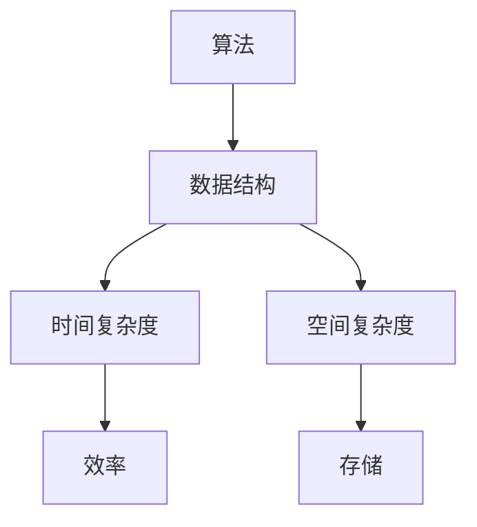

                 

# 字节跳动2024社招编程面试题精华总结

> **关键词：** 字节跳动、社招、编程面试、算法、数据结构、系统设计

> **摘要：** 本文将针对字节跳动2024年社招编程面试中的常见题型进行详细解析，涵盖算法原理、数据结构、系统设计等关键领域，旨在帮助读者更好地应对面试挑战，提升编程能力。

## 1. 背景介绍

字节跳动是一家全球领先的内容技术公司，旗下拥有今日头条、抖音、微博等多款知名应用。作为技术驱动的企业，字节跳动对社招员工的编程能力有着极高的要求。因此，在每年的社招面试中，编程面试题都占据着重要地位。本文旨在总结2024年字节跳动社招编程面试中的核心问题，并提供详细的解答思路，以帮助广大程序员更好地准备面试。

## 2. 核心概念与联系

在编程面试中，算法和数据结构是两个基础且重要的概念。算法是指解决问题的步骤和策略，而数据结构则是指数据在计算机中的存储和组织方式。算法与数据结构的联系在于，合适的算法需要依赖于合适的数据结构来实现，反之亦然。

下面是一个使用 Mermaid 绘制的算法与数据结构的关系图：



## 3. 核心算法原理 & 具体操作步骤

### 3.1 快速排序

快速排序是一种高效的排序算法，其基本原理是通过一趟排序将待排序的记录分隔成独立的两部分，其中一部分记录的关键字均比另一部分的关键字小，然后分别对这两部分记录再次进行排序，以达到整个序列有序。

具体操作步骤如下：

1. 选择一个基准元素。
2. 将比基准元素小的元素移到其左侧，比基准元素大的元素移到其右侧。
3. 对左侧和右侧子序列重复上述步骤。

### 3.2 动态规划

动态规划是一种用于求解最优化问题的算法方法，其核心思想是将复杂问题分解成若干个简单子问题，然后求解这些子问题的最优解，最后将这些子问题的最优解组合起来，得到原问题的最优解。

动态规划的基本步骤如下：

1. 确定状态和状态转移方程。
2. 确定边界条件。
3. 根据状态转移方程和边界条件，递推求解。

## 4. 数学模型和公式 & 详细讲解 & 举例说明

### 4.1 时间复杂度

时间复杂度是算法性能的一个重要指标，用于描述算法在输入规模增长时的运行时间增长情况。常用的时间复杂度符号包括：

- O(1)：常数时间，运行时间不随输入规模增长而变化。
- O(n)：线性时间，运行时间与输入规模成正比。
- O(n^2)：平方时间，运行时间与输入规模的平方成正比。

例如，快速排序的平均时间复杂度为O(nlogn)，最坏情况下的时间复杂度为O(n^2)。

### 4.2 空间复杂度

空间复杂度用于描述算法在输入规模增长时的空间消耗增长情况。常用的空间复杂度符号包括：

- O(1)：常数空间，空间消耗不随输入规模增长而变化。
- O(n)：线性空间，空间消耗与输入规模成正比。
- O(n^2)：平方空间，空间消耗与输入规模的平方成正比。

例如，快速排序的空间复杂度为O(logn)。

## 5. 项目实战：代码实际案例和详细解释说明

### 5.1 开发环境搭建

在本节中，我们将以 Python 为例，搭建一个快速排序的实现环境。

1. 安装 Python：
```bash
$ brew install python
```

2. 创建一个名为 `quick_sort.py` 的文件，并编写以下代码：

```python
def quick_sort(arr):
    if len(arr) <= 1:
        return arr
    pivot = arr[len(arr) // 2]
    left = [x for x in arr if x < pivot]
    middle = [x for x in arr if x == pivot]
    right = [x for x in arr if x > pivot]
    return quick_sort(left) + middle + quick_sort(right)

arr = [3, 6, 8, 10, 1, 2, 1]
print(quick_sort(arr))
```

### 5.2 源代码详细实现和代码解读

在上面的代码中，`quick_sort` 函数是一个递归函数，用于实现快速排序。具体解读如下：

1. 判断输入数组的长度，如果小于等于 1，则直接返回数组。
2. 选择中间位置的元素作为基准元素。
3. 将数组分成三个部分：左部分（小于基准元素的元素）、中间部分（等于基准元素的元素）和右部分（大于基准元素的元素）。
4. 递归地对左部分和右部分进行快速排序，并将结果与中间部分合并。

### 5.3 代码解读与分析

1. 快速排序的核心在于选择基准元素，常用的方法有随机选择、选择中间元素等。选择合适的基准元素可以减少最坏情况的出现。
2. 快速排序的时间复杂度取决于基准元素的选择和数组的初始状态。在最坏情况下，时间复杂度为 O(n^2)，但在平均情况下，时间复杂度为 O(nlogn)。
3. 快速排序的空间复杂度为 O(logn)，因为递归过程中会使用栈空间。

## 6. 实际应用场景

快速排序在实际应用中非常广泛，例如：

- 数据库排序：数据库系统常用快速排序对数据进行排序，以提高查询效率。
- 排序算法比较：快速排序常用于与其他排序算法（如冒泡排序、归并排序等）进行比较，以评估不同算法的性能。

## 7. 工具和资源推荐

### 7.1 学习资源推荐

- 《算法导论》（Introduction to Algorithms）：
  - 作者：Thomas H. Cormen、Charles E. Leiserson、Ronald L. Rivest、Clifford Stein
  - 简介：这是一本经典的算法教材，涵盖了各种算法的理论和实践。
- 《深度探索C++对象模型》：
  - 作者：Stanley B. Lippman
  - 简介：这本书详细介绍了C++对象模型和算法，适合有一定编程基础的读者。

### 7.2 开发工具框架推荐

- PyCharm：
  - 简介：PyCharm 是一款功能强大的 Python 集成开发环境（IDE），支持代码自动补全、调试和版本控制等功能。
- Visual Studio Code：
  - 简介：Visual Studio Code 是一款轻量级但功能强大的代码编辑器，支持多种编程语言，并提供丰富的插件生态系统。

### 7.3 相关论文著作推荐

- "An O(nlogn) Sorting Network and Its Application"：
  - 作者：John H. Reif
  - 简介：这篇文章介绍了Reif排序网络，这是一种基于比较交换的线性时间排序算法。

## 8. 总结：未来发展趋势与挑战

随着技术的不断发展，编程面试题也在不断更新和演变。未来的编程面试将更加注重对编程思维能力、系统设计能力和创新能力的考察。对于程序员而言，持续学习和积累经验将是非常重要的。

## 9. 附录：常见问题与解答

### 9.1 什么是动态规划？

动态规划是一种用于求解最优化问题的算法方法，其核心思想是将复杂问题分解成若干个简单子问题，然后求解这些子问题的最优解，最后将这些子问题的最优解组合起来，得到原问题的最优解。

### 9.2 快速排序的时间复杂度为什么是最坏情况下 O(n^2)？

快速排序的时间复杂度在最坏情况下发生在数组已经有序或者部分有序的情况下。此时，每次分区都会产生一个空分区，导致递归深度达到 n 次，从而导致时间复杂度为 O(n^2)。

## 10. 扩展阅读 & 参考资料

- 《算法导论》（Introduction to Algorithms）：
  - 作者：Thomas H. Cormen、Charles E. Leiserson、Ronald L. Rivest、Clifford Stein
- 《深度探索C++对象模型》：
  - 作者：Stanley B. Lippman
- "An O(nlogn) Sorting Network and Its Application"：
  - 作者：John H. Reif

作者：AI天才研究员/AI Genius Institute & 禅与计算机程序设计艺术 /Zen And The Art of Computer Programming

