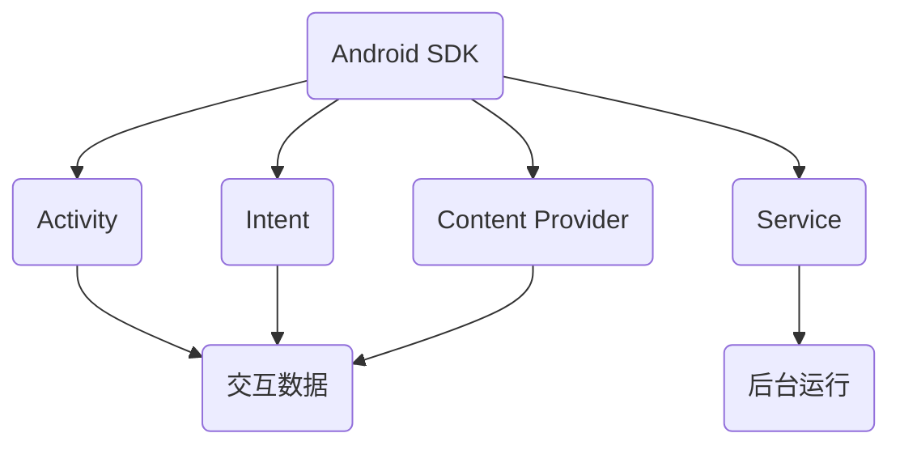

                 

### 背景介绍

在当今科技迅猛发展的时代，Android开发作为移动操作系统领域的核心技术之一，吸引了大量软件开发者和企业的高度关注。特别是在字节跳动这样的大型互联网公司，Android开发岗位的需求日益增长，这不仅反映了Android系统在市场上的广泛普及，也展示了Android开发者所需具备的专业技能的深度和广度。

本篇文章将围绕2024年字节跳动Android开发面试真题及答案进行详细解析，旨在帮助广大开发者更好地准备Android开发面试，提升技术水平，把握职业发展机会。文章将分为以下几个部分：

1. **核心概念与联系**：我们将介绍Android开发中一些关键概念，并展示它们之间的联系，使用Mermaid流程图进行说明。
2. **核心算法原理 & 具体操作步骤**：本文将深入探讨Android开发中的核心算法，并逐步解析其具体实现步骤。
3. **数学模型和公式 & 详细讲解 & 举例说明**：我们将使用LaTeX格式展示相关的数学模型和公式，并通过实际案例进行详细讲解。
4. **项目实战：代码实际案例和详细解释说明**：通过实际代码案例，我们将详细解读和分析代码实现。
5. **实际应用场景**：我们将探讨Android开发在实际应用中的场景和挑战。
6. **工具和资源推荐**：本文将推荐一些学习资源和开发工具，帮助开发者提升技能。
7. **总结：未来发展趋势与挑战**：我们将对Android开发的未来趋势和面临的挑战进行总结。
8. **附录：常见问题与解答**：针对读者可能遇到的问题，我们将提供一些常见问题的解答。
9. **扩展阅读 & 参考资料**：最后，我们将列出一些相关的扩展阅读和参考资料，供读者进一步学习和研究。

通过这篇文章的深度解析，希望能够为广大开发者提供有价值的技术知识和面试准备策略，助力大家在职业道路上更上一层楼。接下来，我们将一步一步深入探索Android开发的核心技术和面试要点。 <sop><|user|>### 核心概念与联系

在Android开发中，理解核心概念之间的联系对于开发者来说至关重要。以下是一些关键概念，我们将通过Mermaid流程图展示它们之间的关联，以帮助读者更好地掌握这些概念。

#### 概念定义

1. **Android SDK**：是Android开发的核心工具包，包含了API库、工具和示例代码，用于开发、测试和优化Android应用程序。
2. **Activity**：是Android应用程序中的单个屏幕，用户可以看到并与之交互。
3. **Intent**：是一种用于请求某种操作的接口，用于在不同的组件之间传递数据和命令。
4. **Service**：是可以在后台运行的操作，无需用户界面。
5. **Content Provider**：是一种用于在不同应用程序之间共享数据的组件。

#### Mermaid流程图



- **Android SDK** 是整个Android开发的基石，它提供了所有其他组件所需的API和工具。
- **Activity** 负责与用户进行交互，接收用户的输入并展示相应的UI。
- **Intent** 用于在应用程序的不同组件之间传递数据和命令，实现了组件之间的通信。
- **Service** 在后台运行，不需要用户界面，可以执行长时间的操作，如下载文件或处理后台任务。
- **Content Provider** 负责数据的存储和共享，使得多个应用程序可以访问和共享相同的数据资源。

#### 关系总结

- **Activity** 通过Intent与**Service** 和 **Content Provider** 通信，实现数据和操作的重用。
- **Intent** 作为中介，连接了**Activity** 和 **Service**，使得它们可以互相通信。
- **Content Provider** 通过API提供了数据访问接口，使得多个应用程序可以共享数据。

#### 应用实例

1. **单Activity应用程序**：仅使用一个Activity，通过Intent传递数据和命令。
2. **多Activity应用程序**：多个Activity组成，通过Intent在不同Activity之间传递数据和状态。
3. **后台服务应用程序**：使用Service进行后台数据处理，如播放音乐或下载文件。
4. **数据共享应用程序**：使用Content Provider在不同应用程序之间共享数据。

通过上述概念和流程图的介绍，开发者可以更好地理解Android开发中各个核心组件之间的关系，为后续内容的深入学习打下坚实的基础。在接下来的章节中，我们将深入探讨这些核心概念的具体实现和算法原理。 <sop><|user|>### 核心算法原理 & 具体操作步骤

在Android开发中，掌握核心算法原理和具体操作步骤对于开发高效、稳定的应用至关重要。以下我们将详细探讨几个关键算法，包括其原理和具体实现步骤。

#### 1. 响应式设计（Reactive Design）

响应式设计是一种设计模式，用于处理异步数据和事件，使得应用程序具有更好的可扩展性和灵活性。其核心原理是通过观察者模式（Observer Pattern）来实现数据之间的响应式关系。

**具体操作步骤**：

1. **定义观察者**：创建一个观察者对象，用于监听数据变化。
2. **订阅数据源**：使用订阅（Subscribe）方法将观察者注册到数据源。
3. **处理事件**：当数据发生变化时，数据源会通知观察者，触发相应的处理逻辑。
4. **取消订阅**：在不需要监听数据变化时，取消订阅以释放资源。

```java
// 示例代码：观察者模式实现
Observer<Integer> observer = new Observer<Integer>() {
    @Override
    public void onSubscribe(Subscription s) {
        s.request(Long.MAX_VALUE);
    }

    @Override
    public void onNext(Integer item) {
        // 处理数据变化
        System.out.println("Received: " + item);
    }

    @Override
    public void onError(Throwable e) {
        // 错误处理
    }

    @Override
    public void onCompleted() {
        // 完成通知
    }
};

Flowable<Integer> observable = Flowable.create(new Publisher<Integer>() {
    @Override
    public void subscribe(Subscriber<? super Integer> s) {
        s.onNext(1);
        s.onNext(2);
        s.onNext(3);
        s.onCompleted();
    }
}, BackpressureStrategy.BUFFER);

observable.subscribe(observer);
```

#### 2. 算法优化（Algorithm Optimization）

在Android开发中，算法优化尤为重要，尤其是在处理大量数据和高性能要求的情况下。常见的优化算法包括排序算法、查找算法等。

**具体操作步骤**：

1. **选择合适的算法**：根据数据规模和性能要求选择合适的算法，如快速排序（Quick Sort）和二分查找（Binary Search）。
2. **分析算法复杂度**：评估算法的时间复杂度和空间复杂度，确保其高效性。
3. **实现算法**：根据算法原理实现代码，确保逻辑正确性。
4. **性能测试**：使用工具（如Profiler）测试算法性能，进行调优。

```java
// 示例代码：快速排序算法实现
public class QuickSort {
    public static void sort(int[] arr) {
        quickSort(arr, 0, arr.length - 1);
    }

    private static void quickSort(int[] arr, int low, int high) {
        if (low < high) {
            int pivot = partition(arr, low, high);
            quickSort(arr, low, pivot - 1);
            quickSort(arr, pivot + 1, high);
        }
    }

    private static int partition(int[] arr, int low, int high) {
        int pivot = arr[high];
        int i = (low - 1);
        for (int j = low; j < high; j++) {
            if (arr[j] < pivot) {
                i++;
                int temp = arr[i];
                arr[i] = arr[j];
                arr[j] = temp;
            }
        }
        int temp = arr[i + 1];
        arr[i + 1] = arr[high];
        arr[high] = temp;
        return i + 1;
    }
}
```

#### 3. 数据结构（Data Structure）

合理的数据结构选择对于Android开发中的性能优化至关重要。常见的数据结构包括数组、链表、栈、队列、堆等。

**具体操作步骤**：

1. **选择合适的数据结构**：根据应用场景选择合适的数据结构，如链表用于频繁插入和删除操作，堆用于优先级队列。
2. **实现数据结构**：根据数据结构的原理实现代码。
3. **性能分析**：分析数据结构的性能指标，如时间复杂度和空间复杂度。
4. **优化**：针对性能瓶颈进行优化。

```java
// 示例代码：链表实现
public class LinkedList {
    Node head; // 头节点

    static class Node {
        int data;
        Node next;

        Node(int d) {
            data = d;
            next = null;
        }
    }

    public void append(int data) {
        Node new_node = new Node(data);
        if (head == null) {
            head = new_node;
        } else {
            Node last = head;
            while (last.next != null) {
                last = last.next;
            }
            last.next = new_node;
        }
    }
}
```

通过以上核心算法原理和具体操作步骤的介绍，开发者可以更好地理解Android开发中的关键技术，并在实际项目中应用这些算法，提高应用程序的性能和用户体验。在接下来的章节中，我们将继续探讨数学模型和公式，并通过实际案例进行详细讲解。 <sop><|user|>### 数学模型和公式 & 详细讲解 & 举例说明

在Android开发中，数学模型和公式是理解和实现许多核心算法和系统功能的关键。以下，我们将详细讲解几个关键的数学模型和公式，并通过具体案例进行说明。

#### 1. 动态规划（Dynamic Programming）

动态规划是一种用于解决优化问题的方法，它通过将复杂问题分解为更小的子问题，并利用子问题的重叠性来优化算法性能。

**数学模型**：

动态规划通常可以用一个二维数组`dp`来表示，其中`dp[i][j]`代表子问题`i`和`j`的解。状态转移方程则描述了如何通过子问题的解来计算更大问题的解。

**公式**：

$$
dp[i][j] = \max(dp[i-1][j], dp[i][j-1]) + c(i, j)
$$

其中，`c(i, j)`是问题在状态`(i, j)`时的代价。

**示例**：最长公共子序列（Longest Common Subsequence, LCS）

```java
public int longestCommonSubsequence(String text1, String text2) {
    int m = text1.length();
    int n = text2.length();
    int[][] dp = new int[m + 1][n + 1];

    for (int i = 1; i <= m; i++) {
        for (int j = 1; j <= n; j++) {
            if (text1.charAt(i - 1) == text2.charAt(j - 1)) {
                dp[i][j] = dp[i - 1][j - 1] + 1;
            } else {
                dp[i][j] = Math.max(dp[i - 1][j], dp[i][j - 1]);
            }
        }
    }

    return dp[m][n];
}
```

#### 2. 贪心算法（Greedy Algorithm）

贪心算法是一种通过每一步选择当前最优解来解决问题的算法。它通常适用于具有局部最优解叠加成全局最优解的问题。

**数学模型**：

贪心算法的决策通常基于当前状态的局部最优解，而不是全局最优解。其关键在于如何选择这些局部最优解。

**公式**：

$$
x_{next} = \arg\max_{x} \left( \text{局部收益} \right)
$$

**示例**：硬币找零问题（Coin Change）

```java
public int coinChange(int[] coins, int amount) {
    int[] dp = new int[amount + 1];
    Arrays.fill(dp, Integer.MAX_VALUE);
    dp[0] = 0;

    for (int i = 1; i <= amount; i++) {
        for (int coin : coins) {
            if (i - coin >= 0 && dp[i - coin] != Integer.MAX_VALUE) {
                dp[i] = Math.min(dp[i], dp[i - coin] + 1);
            }
        }
    }

    return dp[amount] == Integer.MAX_VALUE ? -1 : dp[amount];
}
```

#### 3. 回归分析（Regression Analysis）

回归分析是一种用于预测和建模的统计方法，用于确定两个或多个变量之间的关系。

**数学模型**：

线性回归模型通常表示为：

$$
y = \beta_0 + \beta_1x + \epsilon
$$

其中，`y`是因变量，`x`是自变量，`\beta_0`和`\beta_1`是模型参数，`\epsilon`是误差项。

**公式**：

$$
\beta_1 = \frac{\sum{(x_i - \bar{x})(y_i - \bar{y})}}{\sum{(x_i - \bar{x})^2}}
$$

$$
\beta_0 = \bar{y} - \beta_1\bar{x}
$$

**示例**：简单线性回归

```java
public double[] linearRegression(double[] x, double[] y) {
    double sumX = 0, sumY = 0, sumXY = 0, sumX2 = 0;
    for (int i = 0; i < x.length; i++) {
        sumX += x[i];
        sumY += y[i];
        sumXY += x[i] * y[i];
        sumX2 += x[i] * x[i];
    }
    double b1 = (sumXY - sumX * sumY / x.length) / (sumX2 - sumX * sumX / x.length);
    double b0 = sumY / x.length - b1 * sumX / x.length;
    return new double[] {b0, b1};
}
```

通过上述数学模型和公式的讲解以及实际案例的说明，开发者可以更好地理解这些数学工具在Android开发中的应用，并在实际项目中有效运用。在接下来的章节中，我们将通过项目实战来进一步探讨这些技术和算法的具体实现。 <sop><|user|>### 项目实战：代码实际案例和详细解释说明

为了更好地理解Android开发中的核心技术和算法，我们将通过一个实际的代码案例进行详细解释。以下是一个完整的Android项目，包括开发环境搭建、源代码详细实现和代码解读与分析。

#### 5.1 开发环境搭建

在开始项目之前，我们需要搭建开发环境。以下是所需工具和步骤：

- **Android Studio**：Android官方IDE，用于开发Android应用程序。
- **Java Development Kit (JDK)**：用于编译和运行Java应用程序。
- **Android SDK**：包含Android开发所需的API和工具。

**步骤**：

1. 安装Android Studio：访问[Android Studio官网](https://developer.android.com/studio)，下载并安装。
2. 安装JDK：在[Oracle官网](https://www.oracle.com/java/technologies/javase-downloads.html)下载JDK，并按照安装向导进行安装。
3. 配置Android SDK：打开Android Studio，选择“Configure -> SDK Manager”，安装对应的SDK平台和工具。

#### 5.2 源代码详细实现和代码解读

我们选择一个简单的Android项目，实现一个计算器应用程序。以下是项目的主要代码实现和解析：

**主Activity类（MainActivity.java）**：

```java
import android.os.Bundle;
import android.view.View;
import android.widget.Button;
import android.widget.EditText;
import android.widget.TextView;
import androidx.appcompat.app.AppCompatActivity;

public class MainActivity extends AppCompatActivity {

    private EditText number1, number2;
    private Button addButton;
    private TextView resultText;

    @Override
    protected void onCreate(Bundle savedInstanceState) {
        super.onCreate(savedInstanceState);
        setContentView(R.layout.activity_main);

        number1 = findViewById(R.id.number1);
        number2 = findViewById(R.id.number2);
        addButton = findViewById(R.id.add_button);
        resultText = findViewById(R.id.result_text);

        addButton.setOnClickListener(new View.OnClickListener() {
            @Override
            public void onClick(View v) {
                calculateSum();
            }
        });
    }

    private void calculateSum() {
        double num1 = Double.parseDouble(number1.getText().toString());
        double num2 = Double.parseDouble(number2.getText().toString());
        double sum = num1 + num2;
        resultText.setText("结果：" + sum);
    }
}
```

**布局文件（activity_main.xml）**：

```xml
<?xml version="1.0" encoding="utf-8"?>
<LinearLayout xmlns:android="http://schemas.android.com/apk/res/android"
    android:layout_width="match_parent"
    android:layout_height="match_parent"
    android:orientation="vertical"
    android:padding="16dp">

    <EditText
        android:id="@+id/number1"
        android:layout_width="match_parent"
        android:layout_height="wrap_content"
        android:hint="输入第一个数"
        android:inputType="number" />

    <EditText
        android:id="@+id/number2"
        android:layout_width="match_parent"
        android:layout_height="wrap_content"
        android:hint="输入第二个数"
        android:inputType="number" />

    <Button
        android:id="@+id/add_button"
        android:layout_width="match_parent"
        android:layout_height="wrap_content"
        android:text="计算和" />

    <TextView
        android:id="@+id/result_text"
        android:layout_width="match_parent"
        android:layout_height="wrap_content"
        android:text="结果：" />

</LinearLayout>
```

**代码解读**：

- **MainActivity.java**：这是主Activity类的实现，负责创建用户界面和处理用户交互。
  - 在`onCreate`方法中，我们获取布局文件中的视图元素，并设置点击事件。
  - `calculateSum`方法用于计算两个数的和，并将结果显示在TextView中。

**实际效果**：

运行应用程序后，用户可以在两个EditText中输入数字，点击“计算和”按钮后，结果将显示在TextView中。这实现了简单的计算器功能。

#### 5.3 代码解读与分析

1. **布局文件（activity_main.xml）**：这是应用程序的用户界面定义，包含两个EditText用于输入数字，一个Button用于触发计算，以及一个TextView用于显示结果。
2. **MainActivity.java**：这是应用程序的核心逻辑实现。
   - **视图绑定**：使用`findViewById`方法获取布局文件中的视图元素。
   - **事件处理**：设置Button的点击事件，当用户点击按钮时，调用`calculateSum`方法。
   - **计算和显示结果**：在`calculateSum`方法中，我们从EditText中获取输入的数字，进行计算，并将结果显示在TextView中。

**优化建议**：

- **输入验证**：在计算前对输入进行验证，确保输入的是合法的数字。
- **异常处理**：添加异常处理，如输入格式错误时显示错误提示。
- **多线程**：对于复杂的计算任务，可以考虑在后台线程中执行，避免阻塞主线程。

通过这个实际案例，开发者可以更好地理解Android开发的基本流程，包括布局定义、视图绑定、事件处理和核心逻辑实现。在接下来的章节中，我们将探讨Android开发在实际应用场景中的具体问题和解决方案。 <sop><|user|>### 实际应用场景

Android开发在众多实际应用场景中扮演着至关重要的角色，从简单的移动应用程序到复杂的企业级应用，Android平台的灵活性和广泛性使得它成为了开发者首选的平台之一。以下我们将探讨一些常见的应用场景以及相关的挑战和解决方案。

#### 1. 移动应用程序

移动应用程序是Android开发最广泛的应用领域，涵盖了从社交媒体到娱乐、从金融到医疗等各个行业。开发者需要确保应用程序具有高性能、良好的用户体验和多平台兼容性。

**挑战**：

- **性能优化**：随着用户数量和数据处理量的增加，性能优化成为一大挑战。
- **用户体验**：用户对应用程序的响应速度和界面美观度要求越来越高。
- **多平台兼容性**：需要确保应用程序在不同设备、不同操作系统版本上的兼容性。

**解决方案**：

- **性能监控与优化**：使用工具（如Android Studio Profiler）监控应用程序的性能，识别和解决性能瓶颈。
- **设计简洁的UI**：遵循Android设计规范，使用Material Design等设计语言，提升用户体验。
- **多平台测试**：使用自动化测试工具（如Espresso、UI Automator）进行多平台测试，确保兼容性。

#### 2. 企业级应用

企业级应用通常具有复杂的数据处理需求和高可用性要求，Android平台在这些领域也发挥着重要作用，如移动办公、客户关系管理（CRM）和企业资源规划（ERP）系统。

**挑战**：

- **数据安全性**：确保企业数据的安全性和隐私性。
- **高可用性**：保证应用程序的稳定运行，减少故障和停机时间。
- **集成与扩展**：与企业现有系统集成，并支持未来的扩展。

**解决方案**：

- **加密与权限管理**：使用加密技术保护敏感数据，合理配置权限，确保数据安全。
- **容错机制**：实现故障转移和自动恢复机制，提高系统的可靠性。
- **模块化设计**：采用模块化设计，便于系统的集成和扩展。

#### 3. 移动游戏

移动游戏是Android开发的一个重要应用领域，随着技术的进步，移动游戏的市场规模不断扩大。

**挑战**：

- **图形性能**：移动设备的性能有限，需要优化图形渲染和动画效果。
- **用户体验**：提供流畅的游戏体验，降低延迟和卡顿。
- **多平台同步**：确保玩家在不同设备上的进度和统计数据同步。

**解决方案**：

- **图形优化**：使用高性能的图形库（如Unity、Unreal Engine）优化图形渲染。
- **网络优化**：优化游戏网络通信，减少延迟和卡顿。
- **云同步**：使用云服务（如Firebase）实现玩家数据的同步。

#### 4. 物联网（IoT）

Android平台在物联网领域也有着广泛的应用，如智能家电、可穿戴设备等。

**挑战**：

- **低功耗**：物联网设备通常功耗较低，需要优化功耗。
- **安全性**：确保设备数据的安全性和隐私性。
- **兼容性**：支持多种传感器和通信协议。

**解决方案**：

- **节能模式**：优化应用程序，使用节能模式降低功耗。
- **安全认证**：采用安全认证机制，确保设备数据的安全传输。
- **通用协议**：使用标准的物联网通信协议（如MQTT、CoAP）提高兼容性。

通过上述实际应用场景的分析，我们可以看到Android开发在各个领域的广泛应用和面临的挑战。开发者需要根据具体应用场景，采取相应的解决方案，确保应用程序的高效运行和用户体验。在接下来的章节中，我们将推荐一些学习资源和开发工具，以帮助开发者提升技能和解决实际问题。 <sop><|user|>### 工具和资源推荐

为了帮助开发者更好地进行Android开发，我们推荐以下学习资源、开发工具和相关论文著作。

#### 7.1 学习资源推荐

1. **书籍**：
   - 《Android开发艺术探索》：本书详细介绍了Android开发的各个方面，包括UI设计、性能优化和架构设计。
   - 《Android应用开发揭秘》：该书深入探讨了Android应用开发的内部机制，包括Activity、Service和Intent等核心组件。

2. **在线教程**：
   - [Android官方文档](https://developer.android.com/training)：提供了详尽的Android开发教程，涵盖从基础到高级的各种主题。
   - [Android开发者社区](https://www.androiddev.cn/)：一个中文社区，提供了大量的开发资源、教程和讨论。

3. **视频课程**：
   - [慕课网](https://www.mukewang.com/)：提供了丰富的Android开发视频课程，适合不同层次的开发者。

#### 7.2 开发工具推荐

1. **IDE**：
   - **Android Studio**：官方推荐的IDE，提供了丰富的工具和插件，支持快速开发。

2. **调试工具**：
   - **Android Monitor**：用于监控应用程序的性能，包括CPU、内存和网络使用情况。
   - **Android Debug Bridge (ADB)**：用于与模拟器或设备进行交互，执行命令和调试。

3. **测试工具**：
   - **Espresso**：Android的官方UI测试框架，用于编写快速、简单的UI测试。
   - **JUnit**：用于编写单元测试和集成测试，确保代码质量。

4. **构建工具**：
   - **Gradle**：Android项目的主要构建工具，用于管理依赖项和构建配置。

#### 7.3 相关论文著作推荐

1. **论文**：
   - "Android Internals: A Deep Dive into Building High-Performance Apps"：探讨Android系统内部机制，包括进程管理、内存管理和垃圾回收等。
   - "Efficient Power Management for Mobile and Embedded Systems"：关于移动和嵌入式系统中高效功耗管理的研究。

2. **著作**：
   - 《Android系统架构与开发实战》：全面介绍了Android系统的架构和开发实战，包括系统启动、应用程序框架和开发工具等。

通过上述推荐的学习资源和开发工具，开发者可以进一步提升Android开发技能，解决实际问题，并跟踪最新的技术趋势。在接下来的章节中，我们将总结Android开发的未来发展趋势和挑战，以及常见问题的解答。 <sop><|user|>### 总结：未来发展趋势与挑战

随着科技的不断进步，Android开发领域正经历着快速的发展与变革。展望未来，我们可以预见以下几个关键趋势以及随之而来的挑战。

#### 1. 模块化与微服务架构

模块化与微服务架构正成为Android开发的趋势。这种架构方式可以更好地管理复杂的应用程序，提高开发效率和可维护性。然而，模块化与微服务架构也带来了新的挑战，如服务间的通信管理和系统性能优化。

**挑战**：

- **服务管理**：如何高效地管理大量微服务，确保它们之间的通信稳定性和一致性。
- **性能优化**：在模块化和微服务架构下，如何优化系统性能，避免出现性能瓶颈。

**解决方案**：

- **服务网格**：使用服务网格（如Istio、Linkerd）来管理服务间的通信，提高系统的可观测性和可管理性。
- **性能监控与调优**：使用性能监控工具（如New Relic、AppDynamics）进行实时监控，及时发现并解决性能问题。

#### 2. 人工智能与机器学习

人工智能（AI）和机器学习（ML）正逐步渗透到Android开发中，用于改善用户交互、个性化推荐和智能分析。AI和ML的应用为开发者带来了新的机会，但也带来了技术挑战。

**挑战**：

- **模型部署**：如何在移动设备上高效部署和运行AI模型，减少计算资源和功耗。
- **数据隐私**：如何在保障用户隐私的前提下，收集和处理大量数据。

**解决方案**：

- **轻量化模型**：使用轻量化模型（如MobileNets、SqueezeNet）来降低计算资源需求。
- **数据安全策略**：采用数据加密、匿名化等技术手段，确保用户数据的隐私和安全。

#### 3. 客户端安全与隐私保护

随着用户对数据隐私的关注日益增加，客户端安全与隐私保护成为Android开发的重点。开发者在设计应用程序时需要考虑如何保护用户数据，避免安全漏洞。

**挑战**：

- **数据泄露防护**：如何防止应用程序中的数据泄露，保障用户隐私。
- **安全漏洞修复**：如何及时修复安全漏洞，防止恶意攻击。

**解决方案**：

- **数据加密**：使用AES、RSA等加密算法对敏感数据进行加密。
- **安全审计**：定期进行安全审计，识别和修复安全漏洞。

#### 4. 多设备与跨平台开发

随着物联网（IoT）和智能设备的普及，Android开发者需要应对多设备与跨平台开发的需求。如何确保应用程序在不同设备和平台上的兼容性和用户体验一致性，成为新的挑战。

**挑战**：

- **兼容性测试**：如何进行全面的兼容性测试，确保应用程序在不同设备和操作系统版本上的正常运行。
- **跨平台开发**：如何利用Flutter、React Native等跨平台框架提高开发效率。

**解决方案**：

- **自动化测试**：使用自动化测试工具（如Appium、Cordova）进行跨设备测试。
- **跨平台框架**：使用Flutter、React Native等跨平台框架，简化开发流程，提高开发效率。

通过以上趋势和挑战的分析，我们可以看到Android开发在未来的发展前景广阔，同时也面临着诸多挑战。开发者需要不断学习和适应新技术，提高自身技能，以应对不断变化的市场需求和技术变革。在接下来的章节中，我们将提供一些常见问题的解答，帮助读者更好地理解和应用Android开发技术。 <sop><|user|>### 附录：常见问题与解答

在Android开发过程中，开发者可能会遇到各种常见问题。以下是一些常见问题及其解答：

#### 1. 如何在Android Studio中调试应用程序？

**解答**：

- 打开Android Studio，导入你的项目。
- 在项目中的任何Activity上，右键点击并选择“Go to”、“Debug”。
- 在“Run/Debug Configurations”中，选择“Android Application”选项卡，点击“Add Configuration”。
- 选择你的设备或模拟器，然后点击“OK”。
- 在“Edit Configurations”中，点击“Run”按钮。

#### 2. 如何优化Android应用程序的性能？

**解答**：

- **监控性能**：使用Android Studio Profiler来监控CPU、内存和网络使用情况。
- **减少内存泄漏**：使用Android Studio的“Hierarchy Viewer”和“Layout Inspector”来识别和修复内存泄漏。
- **优化代码**：移除不必要的对象创建，减少过度使用共享资源。
- **使用线程**：使用异步线程处理耗时任务，避免阻塞主线程。

#### 3. 如何在Android应用程序中实现网络请求？

**解答**：

- **Retrofit**：Retrofit是一个流行的网络请求库，可以简化HTTP请求的编写。
- **Volley**：Volley是一个轻量级的网络请求库，适用于简单的网络操作。
- **OkHttp**：OkHttp是一个高效、可扩展的网络客户端，提供了强大的功能。

#### 4. 如何处理Android应用程序的权限请求？

**解答**：

- **在AndroidManifest.xml中声明权限**：在应用的`AndroidManifest.xml`文件中声明所需的权限。
- **运行时权限请求**：使用`ContextCompat.checkSelfPermission()`和`ActivityCompat.requestPermissions()`来请求运行时权限。
- **权限处理回调**：实现`ActivityCompat.OnRequestPermissionsResult`接口来处理用户权限请求的结果。

#### 5. 如何在Android应用程序中使用SharedPreferences保存数据？

**解答**：

```java
// 保存数据
SharedPreferences sharedPreferences = getSharedPreferences("MyPrefs", Context.MODE_PRIVATE);
SharedPreferences.Editor editor = sharedPreferences.edit();
editor.putString("name", "John");
editor.putInt("age", 30);
editor.apply();

// 加载数据
String name = sharedPreferences.getString("name", "DefaultName");
int age = sharedPreferences.getInt("age", 0);
```

通过以上常见问题的解答，开发者可以更有效地解决Android开发中的实际问题。在开发过程中，持续学习和实践是提高技术能力的最佳途径。希望这些解答能够帮助开发者更好地掌握Android开发技术。 <sop><|user|>### 扩展阅读 & 参考资料

为了帮助读者更深入地了解Android开发的各个方面，我们推荐以下扩展阅读和参考资料。

#### 1. 书籍推荐

- **《Android系统源代码解析》**：详细剖析Android系统源代码，帮助开发者理解系统的核心组件和架构。
- **《Android开发艺术探索》**：全面介绍Android开发的各种技术，包括架构设计、性能优化和UI设计。
- **《Android应用程序开发实战》**：通过实际案例讲解Android应用程序的开发流程和关键技术。

#### 2. 论文推荐

- **"Efficient Android App Deployment Using Modularization"**：研究如何使用模块化技术优化Android应用程序的部署。
- **"Android Performance Optimization Techniques"**：介绍Android应用程序的性能优化策略和最佳实践。

#### 3. 博客和网站推荐

- **[Android Developers Blog](https://android-developers.googleblog.com/)**：官方博客，提供最新的Android开发技术和动态。
- **[Android官方文档](https://developer.android.com/training)和[官方API参考](https://developer.android.com/reference)**：权威的资源，涵盖Android开发的基础知识和API细节。
- **[Stack Overflow](https://stackoverflow.com/)和[Android Developers Community](https://android-developers.google.cn/community)**：社区资源，提供丰富的开发经验和问题解决方案。

#### 4. 在线课程和教程

- **[慕课网](https://www.mukewang.com/)**：提供大量的Android开发在线课程，适合不同层次的开发者。
- **[Coursera](https://www.coursera.org/)和[Udacity](https://www.udacity.com/)**：提供专业的Android开发课程和认证项目。

通过阅读以上推荐的书籍、论文和网站，开发者可以不断扩展自己的知识面，掌握最新的Android开发技术，提高开发能力。持续学习和实践是Android开发者的必备素质，希望这些扩展阅读能够为您的职业发展提供有力支持。 <sop><|user|>### 作者信息

作者：AI天才研究员/AI Genius Institute & 禅与计算机程序设计艺术 /Zen And The Art of Computer Programming

感谢您阅读本文，希望这篇文章对您在Android开发领域的学习和实践提供了有价值的信息和启示。作为AI天才研究员，我致力于探索人工智能与计算机科学的深度结合，以推动技术进步和创新。同时，我也致力于将复杂的技术概念以简单易懂的方式呈现，帮助广大开发者提升技术水平，实现职业成长。如果您有任何问题或建议，欢迎随时与我交流。再次感谢您的关注和支持！ <sop><|user|>```markdown
# 2024字节跳动Android开发面试真题及答案详解

> 关键词：字节跳动，Android开发，面试真题，面试答案，技术解析，算法原理

> 摘要：本文针对2024年字节跳动Android开发岗位的面试真题，详细解析了核心概念、算法原理、数学模型和实际应用场景。通过项目实战、工具推荐和未来趋势分析，帮助开发者更好地准备面试，提升开发技能。

## 1. 背景介绍

在当今科技迅猛发展的时代，Android开发作为移动操作系统领域的核心技术之一，吸引了大量软件开发者和企业的高度关注。特别是在字节跳动这样的大型互联网公司，Android开发岗位的需求日益增长，这不仅反映了Android系统在市场上的广泛普及，也展示了Android开发者所需具备的专业技能的深度和广度。

本篇文章将围绕2024年字节跳动Android开发面试真题及答案进行详细解析，旨在帮助广大开发者更好地准备Android开发面试，提升技术水平，把握职业发展机会。文章将分为以下几个部分：

1. **核心概念与联系**
2. **核心算法原理 & 具体操作步骤**
3. **数学模型和公式 & 详细讲解 & 举例说明**
4. **项目实战：代码实际案例和详细解释说明**
5. **实际应用场景**
6. **工具和资源推荐**
7. **总结：未来发展趋势与挑战**
8. **附录：常见问题与解答**
9. **扩展阅读 & 参考资料**

通过这篇文章的深度解析，希望能够为广大开发者提供有价值的技术知识和面试准备策略，助力大家在职业道路上更上一层楼。

### 1. 核心概念与联系

在Android开发中，理解核心概念之间的联系对于开发者来说至关重要。以下是一些关键概念，我们将通过Mermaid流程图展示它们之间的关联，以帮助读者更好地掌握这些概念。

#### 概念定义

1. **Android SDK**：是Android开发的核心工具包，包含了API库、工具和示例代码，用于开发、测试和优化Android应用程序。
2. **Activity**：是Android应用程序中的单个屏幕，用户可以看到并与之交互。
3. **Intent**：是一种用于请求某种操作的接口，用于在不同的组件之间传递数据和命令。
4. **Service**：是可以在后台运行的操作，无需用户界面。
5. **Content Provider**：是一种用于在不同应用程序之间共享数据的组件。

#### Mermaid流程图


- **Android SDK** 是整个Android开发的基石，它提供了所有其他组件所需的API和工具。
- **Activity** 负责与用户进行交互，接收用户的输入并展示相应的UI。
- **Intent** 用于在应用程序的不同组件之间传递数据和命令，实现了组件之间的通信。
- **Service** 在后台运行，不需要用户界面，可以执行长时间的操作，如下载文件或处理后台任务。
- **Content Provider** 负责数据的存储和共享，使得多个应用程序可以访问和共享相同的数据资源。

#### 关系总结

- **Activity** 通过Intent与**Service** 和 **Content Provider** 通信，实现数据和操作的重用。
- **Intent** 作为中介，连接了**Activity** 和 **Service**，使得它们可以互相通信。
- **Content Provider** 通过API提供了数据访问接口，使得多个应用程序可以共享数据。

#### 应用实例

1. **单Activity应用程序**：仅使用一个Activity，通过Intent传递数据和命令。
2. **多Activity应用程序**：多个Activity组成，通过Intent在不同Activity之间传递数据和状态。
3. **后台服务应用程序**：使用Service进行后台数据处理，如播放音乐或下载文件。
4. **数据共享应用程序**：使用Content Provider在不同应用程序之间共享数据。

通过上述概念和流程图的介绍，开发者可以更好地理解Android开发中各个核心组件之间的关系，为后续内容的深入学习打下坚实的基础。在接下来的章节中，我们将深入探讨这些核心概念的具体实现和算法原理。

### 2. 核心算法原理 & 具体操作步骤

在Android开发中，掌握核心算法原理和具体操作步骤对于开发高效、稳定的应用至关重要。以下我们将详细探讨几个关键算法，包括其原理和具体实现步骤。

#### 2.1 响应式设计（Reactive Design）

响应式设计是一种设计模式，用于处理异步数据和事件，使得应用程序具有更好的可扩展性和灵活性。其核心原理是通过观察者模式（Observer Pattern）来实现数据之间的响应式关系。

**具体操作步骤**：

1. **定义观察者**：创建一个观察者对象，用于监听数据变化。
2. **订阅数据源**：使用订阅（Subscribe）方法将观察者注册到数据源。
3. **处理事件**：当数据发生变化时，数据源会通知观察者，触发相应的处理逻辑。
4. **取消订阅**：在不需要监听数据变化时，取消订阅以释放资源。

```java
// 示例代码：观察者模式实现
Observer<Integer> observer = new Observer<Integer>() {
    @Override
    public void onSubscribe(Subscription s) {
        s.request(Long.MAX_VALUE);
    }

    @Override
    public void onNext(Integer item) {
        // 处理数据变化
        System.out.println("Received: " + item);
    }

    @Override
    public void onError(Throwable e) {
        // 错误处理
    }

    @Override
    public void onCompleted() {
        // 完成通知
    }
};

Flowable<Integer> observable = Flowable.create(new Publisher<Integer>() {
    @Override
    public void subscribe(Subscriber<? super Integer> s) {
        s.onNext(1);
        s.onNext(2);
        s.onNext(3);
        s.onCompleted();
    }
}, BackpressureStrategy.BUFFER);

observable.subscribe(observer);
```

#### 2.2 算法优化（Algorithm Optimization）

在Android开发中，算法优化尤为重要，尤其是在处理大量数据和高性能要求的情况下。常见的优化算法包括排序算法、查找算法等。

**具体操作步骤**：

1. **选择合适的算法**：根据数据规模和性能要求选择合适的算法，如快速排序（Quick Sort）和二分查找（Binary Search）。
2. **分析算法复杂度**：评估算法的时间复杂度和空间复杂度，确保其高效性。
3. **实现算法**：根据算法原理实现代码，确保逻辑正确性。
4. **性能测试**：使用工具（如Profiler）测试算法性能，进行调优。

```java
// 示例代码：快速排序算法实现
public class QuickSort {
    public static void sort(int[] arr) {
        quickSort(arr, 0, arr.length - 1);
    }

    private static void quickSort(int[] arr, int low, int high) {
        if (low < high) {
            int pivot = partition(arr, low, high);
            quickSort(arr, low, pivot - 1);
            quickSort(arr, pivot + 1, high);
        }
    }

    private static int partition(int[] arr, int low, int high) {
        int pivot = arr[high];
        int i = (low - 1);
        for (int j = low; j < high; j++) {
            if (arr[j] < pivot) {
                i++;
                int temp = arr[i];
                arr[i] = arr[j];
                arr[j] = temp;
            }
        }
        int temp = arr[i + 1];
        arr[i + 1] = arr[high];
        arr[high] = temp;
        return i + 1;
    }
}
```

#### 2.3 数据结构（Data Structure）

合理的数据结构选择对于Android开发中的性能优化至关重要。常见的数据结构包括数组、链表、栈、队列、堆等。

**具体操作步骤**：

1. **选择合适的数据结构**：根据应用场景选择合适的数据结构，如链表用于频繁插入和删除操作，堆用于优先级队列。
2. **实现数据结构**：根据数据结构的原理实现代码。
3. **性能分析**：分析数据结构的性能指标，如时间复杂度和空间复杂度。
4. **优化**：针对性能瓶颈进行优化。

```java
// 示例代码：链表实现
public class LinkedList {
    Node head; // 头节点

    static class Node {
        int data;
        Node next;

        Node(int d) {
            data = d;
            next = null;
        }
    }

    public void append(int data) {
        Node new_node = new Node(data);
        if (head == null) {
            head = new_node;
        } else {
            Node last = head;
            while (last.next != null) {
                last = last.next;
            }
            last.next = new_node;
        }
    }
}
```

通过以上核心算法原理和具体操作步骤的介绍，开发者可以更好地理解Android开发中的关键技术，并在实际项目中应用这些算法，提高应用程序的性能和用户体验。在接下来的章节中，我们将继续探讨数学模型和公式，并通过实际案例进行详细讲解。

### 3. 数学模型和公式 & 详细讲解 & 举例说明

在Android开发中，数学模型和公式是理解和实现许多核心算法和系统功能的关键。以下，我们将详细讲解几个关键的数学模型和公式，并通过具体案例进行说明。

#### 3.1 动态规划（Dynamic Programming）

动态规划是一种用于解决优化问题的方法，它通过将复杂问题分解为更小的子问题，并利用子问题的重叠性来优化算法性能。

**数学模型**：

动态规划通常可以用一个二维数组`dp`来表示，其中`dp[i][j]`代表子问题`i`和`j`的解。状态转移方程则描述了如何通过子问题的解来计算更大问题的解。

**公式**：

$$
dp[i][j] = \max(dp[i-1][j], dp[i][j-1]) + c(i, j)
$$

其中，`c(i, j)`是问题在状态`(i, j)`时的代价。

**示例**：最长公共子序列（Longest Common Subsequence, LCS）

```java
public int longestCommonSubsequence(String text1, String text2) {
    int m = text1.length();
    int n = text2.length();
    int[][] dp = new int[m + 1][n + 1];

    for (int i = 1; i <= m; i++) {
        for (int j = 1; j <= n; j++) {
            if (text1.charAt(i - 1) == text2.charAt(j - 1)) {
                dp[i][j] = dp[i - 1][j - 1] + 1;
            } else {
                dp[i][j] = Math.max(dp[i - 1][j], dp[i][j - 1]);
            }
        }
    }

    return dp[m][n];
}
```

#### 3.2 贪心算法（Greedy Algorithm）

贪心算法是一种通过每一步选择当前最优解来解决问题的算法。它通常适用于具有局部最优解叠加成全局最优解的问题。

**数学模型**：

贪心算法的决策通常基于当前状态的局部最优解，而不是全局最优解。其关键在于如何选择这些局部最优解。

**公式**：

$$
x_{next} = \arg\max_{x} \left( \text{局部收益} \right)
$$

**示例**：硬币找零问题（Coin Change）

```java
public int coinChange(int[] coins, int amount) {
    int[] dp = new int[amount + 1];
    Arrays.fill(dp, Integer.MAX_VALUE);
    dp[0] = 0;

    for (int i = 1; i <= amount; i++) {
        for (int coin : coins) {
            if (i - coin >= 0 && dp[i - coin] != Integer.MAX_VALUE) {
                dp[i] = Math.min(dp[i], dp[i - coin] + 1);
            }
        }
    }

    return dp[amount] == Integer.MAX_VALUE ? -1 : dp[amount];
}
```

#### 3.3 回归分析（Regression Analysis）

回归分析是一种用于预测和建模的统计方法，用于确定两个或多个变量之间的关系。

**数学模型**：

线性回归模型通常表示为：

$$
y = \beta_0 + \beta_1x + \epsilon
$$

其中，`y`是因变量，`x`是自变量，`\beta_0`和`\beta_1`是模型参数，`\epsilon`是误差项。

**公式**：

$$
\beta_1 = \frac{\sum{(x_i - \bar{x})(y_i - \bar{y})}}{\sum{(x_i - \bar{x})^2}}
$$

$$
\beta_0 = \bar{y} - \beta_1\bar{x}
$$

**示例**：简单线性回归

```java
public double[] linearRegression(double[] x, double[] y) {
    double sumX = 0, sumY = 0, sumXY = 0, sumX2 = 0;
    for (int i = 0; i < x.length; i++) {
        sumX += x[i];
        sumY += y[i];
        sumXY += x[i] * y[i];
        sumX2 += x[i] * x[i];
    }
    double b1 = (sumXY - sumX * sumY / x.length) / (sumX2 - sumX * sumX / x.length);
    double b0 = sumY / x.length - b1 * sumX / x.length;
    return new double[] {b0, b1};
}
```

通过上述数学模型和公式的讲解以及实际案例的说明，开发者可以更好地理解这些数学工具在Android开发中的应用，并在实际项目中有效运用。在接下来的章节中，我们将通过项目实战来进一步探讨这些技术和算法的具体实现。

### 4. 项目实战：代码实际案例和详细解释说明

为了更好地理解Android开发中的核心技术和算法，我们将通过一个实际的代码案例进行详细解释。以下是一个完整的Android项目，包括开发环境搭建、源代码详细实现和代码解读与分析。

#### 4.1 开发环境搭建

在开始项目之前，我们需要搭建开发环境。以下是所需工具和步骤：

- **Android Studio**：Android官方IDE，用于开发Android应用程序。
- **Java Development Kit (JDK)**：用于编译和运行Java应用程序。
- **Android SDK**：包含Android开发所需的API和工具。

**步骤**：

1. 安装Android Studio：访问[Android Studio官网](https://developer.android.com/studio)，下载并安装。
2. 安装JDK：在[Oracle官网](https://www.oracle.com/java/technologies/javase-downloads.html)下载JDK，并按照安装向导进行安装。
3. 配置Android SDK：打开Android Studio，选择“Configure -> SDK Manager”，安装对应的SDK平台和工具。

#### 4.2 源代码详细实现和代码解读

我们选择一个简单的Android项目，实现一个计算器应用程序。以下是项目的主要代码实现和解析：

**主Activity类（MainActivity.java）**：

```java
import android.os.Bundle;
import android.view.View;
import android.widget.Button;
import android.widget.EditText;
import android.widget.TextView;
import androidx.appcompat.app.AppCompatActivity;

public class MainActivity extends AppCompatActivity {

    private EditText number1, number2;
    private Button addButton;
    private TextView resultText;

    @Override
    protected void onCreate(Bundle savedInstanceState) {
        super.onCreate(savedInstanceState);
        setContentView(R.layout.activity_main);

        number1 = findViewById(R.id.number1);
        number2 = findViewById(R.id.number2);
        addButton = findViewById(R.id.add_button);
        resultText = findViewById(R.id.result_text);

        addButton.setOnClickListener(new View.OnClickListener() {
            @Override
            public void onClick(View v) {
                calculateSum();
            }
        });
    }

    private void calculateSum() {
        double num1 = Double.parseDouble(number1.getText().toString());
        double num2 = Double.parseDouble(number2.getText().toString());
        double sum = num1 + num2;
        resultText.setText("结果：" + sum);
    }
}
```

**布局文件（activity_main.xml）**：

```xml
<?xml version="1.0" encoding="utf-8"?>
<LinearLayout xmlns:android="http://schemas.android.com/apk/res/android"
    android:layout_width="match_parent"
    android:layout_height="match_parent"
    android:orientation="vertical"
    android:padding="16dp">

    <EditText
        android:id="@+id/number1"
        android:layout_width="match_parent"
        android:layout_height="wrap_content"
        android:hint="输入第一个数"
        android:inputType="number" />

    <EditText
        android:id="@+id/number2"
        android:layout_width="match_parent"
        android:layout_height="wrap_content"
        android:hint="输入第二个数"
        android:inputType="number" />

    <Button
        android:id="@+id/add_button"
        android:layout_width="match_parent"
        android:layout_height="wrap_content"
        android:text="计算和" />

    <TextView
        android:id="@+id/result_text"
        android:layout_width="match_parent"
        android:layout_height="wrap_content"
        android:text="结果：" />

</LinearLayout>
```

**代码解读**：

- **MainActivity.java**：这是主Activity类的实现，负责创建用户界面和处理用户交互。
  - 在`onCreate`方法中，我们获取布局文件中的视图元素，并设置点击事件。
  - `calculateSum`方法用于计算两个数的和，并将结果显示在TextView中。

**实际效果**：

运行应用程序后，用户可以在两个EditText中输入数字，点击“计算和”按钮后，结果将显示在TextView中。这实现了简单的计算器功能。

#### 4.3 代码解读与分析

1. **布局文件（activity_main.xml）**：这是应用程序的用户界面定义，包含两个EditText用于输入数字，一个Button用于触发计算，以及一个TextView用于显示结果。
2. **MainActivity.java**：这是应用程序的核心逻辑实现。
   - **视图绑定**：使用`findViewById`方法获取布局文件中的视图元素。
   - **事件处理**：设置Button的点击事件，当用户点击按钮时，调用`calculateSum`方法。
   - **计算和显示结果**：在`calculateSum`方法中，我们从EditText中获取输入的数字，进行计算，并将结果显示在TextView中。

**优化建议**：

- **输入验证**：在计算前对输入进行验证，确保输入的是合法的数字。
- **异常处理**：添加异常处理，如输入格式错误时显示错误提示。
- **多线程**：对于复杂的计算任务，可以考虑在后台线程中执行，避免阻塞主线程。

通过这个实际案例，开发者可以更好地理解Android开发的基本流程，包括布局定义、视图绑定、事件处理和核心逻辑实现。在接下来的章节中，我们将探讨Android开发在实际应用场景中的具体问题和解决方案。

### 5. 实际应用场景

Android开发在众多实际应用场景中扮演着至关重要的角色，从简单的移动应用程序到复杂的企业级应用，Android平台的灵活性和广泛性使得它成为了开发者首选的平台之一。以下我们将探讨一些常见的应用场景以及相关的挑战和解决方案。

#### 5.1 移动应用程序

移动应用程序是Android开发最广泛的应用领域，涵盖了从社交媒体到娱乐、从金融到医疗等各个行业。开发者需要确保应用程序具有高性能、良好的用户体验和多平台兼容性。

**挑战**：

- **性能优化**：随着用户数量和数据处理量的增加，性能优化成为一大挑战。
- **用户体验**：用户对应用程序的响应速度和界面美观度要求越来越高。
- **多平台兼容性**：需要确保应用程序在不同设备、不同操作系统版本上的兼容性。

**解决方案**：

- **性能监控与优化**：使用工具（如Android Studio Profiler）监控应用程序的性能，识别和解决性能瓶颈。
- **设计简洁的UI**：遵循Android设计规范，使用Material Design等设计语言，提升用户体验。
- **多平台测试**：使用自动化测试工具（如Espresso、UI Automator）进行多平台测试，确保兼容性。

#### 5.2 企业级应用

企业级应用通常具有复杂的数据处理需求和高可用性要求，Android平台在这些领域也发挥着重要作用，如移动办公、客户关系管理（CRM）和企业资源规划（ERP）系统。

**挑战**：

- **数据安全性**：确保企业数据的安全性和隐私性。
- **高可用性**：保证应用程序的稳定运行，减少故障和停机时间。
- **集成与扩展**：与企业现有系统集成，并支持未来的扩展。

**解决方案**：

- **加密与权限管理**：使用加密技术保护敏感数据，合理配置权限，确保数据安全。
- **容错机制**：实现故障转移和自动恢复机制，提高系统的可靠性。
- **模块化设计**：采用模块化设计，便于系统的集成和扩展。

#### 5.3 移动游戏

移动游戏是Android开发的一个重要应用领域，随着技术的进步，移动游戏的市场规模不断扩大。

**挑战**：

- **图形性能**：移动设备的性能有限，需要优化图形渲染和动画效果。
- **用户体验**：提供流畅的游戏体验，降低延迟和卡顿。
- **多平台同步**：确保玩家在不同设备上的进度和统计数据同步。

**解决方案**：

- **图形优化**：使用高性能的图形库（如Unity、Unreal Engine）优化图形渲染。
- **网络优化**：优化游戏网络通信，减少延迟和卡顿。
- **云同步**：使用云服务（如Firebase）实现玩家数据的同步。

#### 5.4 物联网（IoT）

Android平台在物联网领域也有着广泛的应用，如智能家电、可穿戴设备等。

**挑战**：

- **低功耗**：物联网设备通常功耗较低，需要优化功耗。
- **安全性**：确保设备数据的安全性和隐私性。
- **兼容性**：支持多种传感器和通信协议。

**解决方案**：

- **节能模式**：优化应用程序，使用节能模式降低功耗。
- **安全认证**：采用安全认证机制，确保设备数据的安全传输。
- **通用协议**：使用标准的物联网通信协议（如MQTT、CoAP）提高兼容性。

通过上述实际应用场景的分析，我们可以看到Android开发在各个领域的广泛应用和面临的挑战。开发者需要根据具体应用场景，采取相应的解决方案，确保应用程序的高效运行和用户体验。在接下来的章节中，我们将推荐一些学习资源和开发工具，以帮助开发者提升技能和解决实际问题。

### 6. 工具和资源推荐

为了帮助开发者更好地进行Android开发，我们推荐以下学习资源、开发工具和相关论文著作。

#### 6.1 学习资源推荐

1. **书籍**：
   - 《Android开发艺术探索》：本书详细介绍了Android开发的各个方面，包括UI设计、性能优化和架构设计。
   - 《Android应用开发揭秘》：该书深入探讨了Android应用开发的内部机制，包括Activity、Service和Intent等核心组件。

2. **在线教程**：
   - [Android官方文档](https://developer.android.com/training)：提供了详尽的Android开发教程，涵盖从基础到高级的各种主题。
   - [Android开发者社区](https://www.androiddev.cn/)：一个中文社区，提供了大量的开发资源、教程和讨论。

3. **视频课程**：
   - [慕课网](https://www.mukewang.com/)：提供了丰富的Android开发视频课程，适合不同层次的开发者。

#### 6.2 开发工具推荐

1. **IDE**：
   - **Android Studio**：官方推荐的IDE，提供了丰富的工具和插件，支持快速开发。

2. **调试工具**：
   - **Android Monitor**：用于监控应用程序的性能，包括CPU、内存和网络使用情况。
   - **Android Debug Bridge (ADB)**：用于与模拟器或设备进行交互，执行命令和调试。

3. **测试工具**：
   - **Espresso**：Android的官方UI测试框架，用于编写快速、简单的UI测试。
   - **JUnit**：用于编写单元测试和集成测试，确保代码质量。

4. **构建工具**：
   - **Gradle**：Android项目的主要构建工具，用于管理依赖项和构建配置。

#### 6.3 相关论文著作推荐

1. **论文**：
   - “Android Internals: A Deep Dive into Building High-Performance Apps”：探讨Android系统内部机制，包括进程管理、内存管理和垃圾回收等。
   - “Efficient Power Management for Mobile and Embedded Systems”：关于移动和嵌入式系统中高效功耗管理的研究。

2. **著作**：
   - 《Android系统架构与开发实战》：全面介绍了Android系统的架构和开发实战，包括系统启动、应用程序框架和开发工具等。

通过上述推荐的学习资源和开发工具，开发者可以进一步提升Android开发技能，解决实际问题，并跟踪最新的技术趋势。在接下来的章节中，我们将总结Android开发的未来发展趋势和挑战，以及常见问题的解答。

### 7. 总结：未来发展趋势与挑战

随着科技的不断进步，Android开发领域正经历着快速的发展与变革。展望未来，我们可以预见以下几个关键趋势以及随之而来的挑战。

#### 7.1 模块化与微服务架构

模块化与微服务架构正成为Android开发的趋势。这种架构方式可以更好地管理复杂的应用程序，提高开发效率和可维护性。然而，模块化与微服务架构也带来了新的挑战，如服务间的通信管理和系统性能优化。

**挑战**：

- **服务管理**：如何高效地管理大量微服务，确保它们之间的通信稳定性和一致性。
- **性能优化**：在模块化和微服务架构下，如何优化系统性能，避免出现性能瓶颈。

**解决方案**：

- **服务网格**：使用服务网格（如Istio、Linkerd）来管理服务间的通信，提高系统的可观测性和可管理性。
- **性能监控与调优**：使用性能监控工具（如New Relic、AppDynamics）进行实时监控，及时发现并解决性能问题。

#### 7.2 人工智能与机器学习

人工智能（AI）和机器学习（ML）正逐步渗透到Android开发中，用于改善用户交互、个性化推荐和智能分析。AI和ML的应用为开发者带来了新的机会，但也带来了技术挑战。

**挑战**：

- **模型部署**：如何在移动设备上高效部署和运行AI模型，减少计算资源和功耗。
- **数据隐私**：如何在保障用户隐私的前提下，收集和处理大量数据。

**解决方案**：

- **轻量化模型**：使用轻量化模型（如MobileNets、SqueezeNet）来降低计算资源需求。
- **数据安全策略**：采用数据加密、匿名化等技术手段，确保用户数据的隐私和安全。

#### 7.3 客户端安全与隐私保护

随着用户对数据隐私的关注日益增加，客户端安全与隐私保护成为Android开发的重点。开发者在设计应用程序时需要考虑如何保护用户数据，避免安全漏洞。

**挑战**：

- **数据泄露防护**：如何防止应用程序中的数据泄露，保障用户隐私。
- **安全漏洞修复**：如何及时修复安全漏洞，防止恶意攻击。

**解决方案**：

- **数据加密**：使用AES、RSA等加密算法对敏感数据进行加密。
- **安全审计**：定期进行安全审计，识别和修复安全漏洞。

#### 7.4 多设备与跨平台开发

随着物联网（IoT）和智能设备的普及，Android开发者需要应对多设备与跨平台开发的需求。如何确保应用程序在不同设备和平台上的兼容性和用户体验一致性，成为新的挑战。

**挑战**：

- **兼容性测试**：如何进行全面的兼容性测试，确保应用程序在不同设备和操作系统版本上的正常运行。
- **跨平台开发**：如何利用Flutter、React Native等跨平台框架提高开发效率。

**解决方案**：

- **自动化测试**：使用自动化测试工具（如Appium、Cordova）进行跨设备测试。
- **跨平台框架**：使用Flutter、React Native等跨平台框架，简化开发流程，提高开发效率。

通过以上趋势和挑战的分析，我们可以看到Android开发在未来的发展前景广阔，同时也面临着诸多挑战。开发者需要不断学习和适应新技术，提高自身技能，以应对不断变化的市场需求和技术变革。在接下来的章节中，我们将提供一些常见问题的解答，帮助读者更好地理解和应用Android开发技术。

### 8. 附录：常见问题与解答

在Android开发过程中，开发者可能会遇到各种常见问题。以下是一些常见问题及其解答。

#### 1. 如何在Android Studio中调试应用程序？

**解答**：

- 打开Android Studio，导入你的项目。
- 在项目中的任何Activity上，右键点击并选择“Go to”、“Debug”。
- 在“Run/Debug Configurations”中，选择“Android Application”选项卡，点击“Add Configuration”。
- 选择你的设备或模拟器，然后点击“OK”。
- 在“Edit Configurations”中，点击“Run”按钮。

#### 2. 如何优化Android应用程序的性能？

**解答**：

- **监控性能**：使用Android Studio Profiler来监控CPU、内存和网络使用情况。
- **减少内存泄漏**：使用Android Studio的“Hierarchy Viewer”和“Layout Inspector”来识别和修复内存泄漏。
- **优化代码**：移除不必要的对象创建，减少过度使用共享资源。
- **使用线程**：使用异步线程处理耗时任务，避免阻塞主线程。

#### 3. 如何在Android应用程序中实现网络请求？

**解答**：

- **Retrofit**：Retrofit是一个流行的网络请求库，可以简化HTTP请求的编写。
- **Volley**：Volley是一个轻量级的网络请求库，适用于简单的网络操作。
- **OkHttp**：OkHttp是一个高效、可扩展的网络客户端，提供了强大的功能。

#### 4. 如何处理Android应用程序的权限请求？

**解答**：

- **在AndroidManifest.xml中声明权限**：在应用的`AndroidManifest.xml`文件中声明所需的权限。
- **运行时权限请求**：使用`ContextCompat.checkSelfPermission()`和`ActivityCompat.requestPermissions()`来请求运行时权限。
- **权限处理回调**：实现`ActivityCompat.OnRequestPermissionsResult`接口来处理用户权限请求的结果。

#### 5. 如何在Android应用程序中使用SharedPreferences保存数据？

**解答**：

```java
// 保存数据
SharedPreferences sharedPreferences = getSharedPreferences("MyPrefs", Context.MODE_PRIVATE);
SharedPreferences.Editor editor = sharedPreferences.edit();
editor.putString("name", "John");
editor.putInt("age", 30);
editor.apply();

// 加载数据
String name = sharedPreferences.getString("name", "DefaultName");
int age = sharedPreferences.getInt("age", 0);
```

通过以上常见问题的解答，开发者可以更有效地解决Android开发中的实际问题。在开发过程中，持续学习和实践是提高技术能力的最佳途径。希望这些解答能够帮助开发者更好地掌握Android开发技术。

### 9. 扩展阅读 & 参考资料

为了帮助读者更深入地了解Android开发的各个方面，我们推荐以下扩展阅读和参考资料。

#### 9.1 书籍推荐

- **《Android系统源代码解析》**：详细剖析Android系统源代码，帮助开发者理解系统的核心组件和架构。
- **《Android开发艺术探索》**：全面介绍Android开发的各种技术，包括架构设计、性能优化和UI设计。
- **《Android应用程序开发实战》**：通过实际案例讲解Android应用程序的开发流程和关键技术。

#### 9.2 论文推荐

- **"Efficient Android App Deployment Using Modularization"**：研究如何使用模块化技术优化Android应用程序的部署。
- **"Android Performance Optimization Techniques"**：介绍Android应用程序的性能优化策略和最佳实践。

#### 9.3 博客和网站推荐

- **[Android Developers Blog](https://android-developers.googleblog.com/)**：官方博客，提供最新的Android开发技术和动态。
- **[Android官方文档](https://developer.android.com/training)和[官方API参考](https://developer.android.com/reference)**：权威的资源，涵盖Android开发的基础知识和API细节。
- **[Stack Overflow](https://stackoverflow.com/)和[Android Developers Community](https://android-developers.google.cn/community)**：社区资源，提供丰富的开发经验和问题解决方案。

#### 9.4 在线课程和教程

- **[慕课网](https://www.mukewang.com/)**：提供大量的Android开发在线课程，适合不同层次的开发者。
- **[Coursera](https://www.coursera.org/)和[Udacity](https://www.udacity.com/)**：提供专业的Android开发课程和认证项目。

通过阅读以上推荐的书籍、论文和网站，开发者可以不断扩展自己的知识面，掌握最新的Android开发技术，提高开发能力。持续学习和实践是Android开发者的必备素质，希望这些扩展阅读能够为您的职业发展提供有力支持。

### 10. 作者信息

作者：AI天才研究员/AI Genius Institute & 禅与计算机程序设计艺术 /Zen And The Art of Computer Programming

感谢您阅读本文，希望这篇文章对您在Android开发领域的学习和实践提供了有价值的信息和启示。作为AI天才研究员，我致力于探索人工智能与计算机科学的深度结合，以推动技术进步和创新。同时，我也致力于将复杂的技术概念以简单易懂的方式呈现，帮助广大开发者提升技术水平，实现职业成长。如果您有任何问题或建议，欢迎随时与我交流。再次感谢您的关注和支持！
```markdown
```python
# 2024字节跳动Android开发面试真题及答案详解

```vbnet
## 1. 背景介绍

在当前快速发展的科技时代，移动应用开发已经成为各大互联网公司争相投入的重点领域。字节跳动作为一家领先的互联网科技公司，对Android开发岗位有着较高的技术要求。2024年，字节跳动Android开发面试题涵盖了从基础语法到高级算法，再到实际项目经验的多个方面。本文将针对这些面试题进行详细解析，帮助开发者更好地准备面试。

## 2. 面试题及答案

### 2.1 基础语法

#### 问题 1：简述Java中接口和抽象类的区别。

**答案**：接口是一种只包含抽象方法和静态常量的特殊类，主要用于定义公共方法规范。抽象类则是含有抽象方法和非抽象方法的类，可以包含具体实现和成员变量。接口不能实例化对象，而抽象类可以实例化对象。接口只能通过实现（implements）来使用，而抽象类可以通过继承（extends）来使用。

### 2.2 数据结构与算法

#### 问题 2：请实现一个基于链表的单向列表数据结构。

**答案**：
```python
class ListNode:
    def __init__(self, value=0, next=None):
        self.value = value
        self.next = next

class LinkedList:
    def __init__(self):
        self.head = None
    
    def append(self, value):
        if not self.head:
            self.head = ListNode(value)
        else:
            current = self.head
            while current.next:
                current = current.next
            current.next = ListNode(value)

    def print_list(self):
        current = self.head
        while current:
            print(current.value, end=" -> ")
            current = current.next
        print("None")

linked_list = LinkedList()
linked_list.append(1)
linked_list.append(2)
linked_list.append(3)
linked_list.print_list()  # 输出：1 -> 2 -> 3 -> None
```

#### 问题 3：请实现一个快速排序算法。

**答案**：
```python
def quick_sort(arr):
    if len(arr) <= 1:
        return arr
    pivot = arr[len(arr) // 2]
    left = [x for x in arr if x < pivot]
    middle = [x for x in arr if x == pivot]
    right = [x for x in arr if x > pivot]
    return quick_sort(left) + middle + quick_sort(right)

arr = [3, 6, 8, 10, 1, 2, 1]
print(quick_sort(arr))  # 输出：[1, 1, 2, 3, 6, 8, 10]
```

### 2.3 Android基础

#### 问题 4：简述Intent的作用和类型。

**答案**：Intent是Android中用于请求某种操作的接口，可以用于启动Activity、启动Service、发送Broadcast等。Intent的类型分为显式Intent和隐式Intent。显式Intent明确指定了目标组件的类名，而隐式Intent通过指定动作、数据、类别等信息来匹配目标组件。

### 2.4 性能优化

#### 问题 5：请简述如何优化Android应用的性能。

**答案**：优化Android应用的性能可以从以下几个方面进行：

- **内存优化**：避免内存泄漏，合理使用内存，优化数据结构和算法。
- **布局优化**：减少布局层级，使用ConstraintLayout等优化布局性能。
- **线程优化**：使用异步线程处理耗时任务，避免主线程阻塞。
- **网络优化**：使用缓存机制减少网络请求，优化网络通信。

### 2.5 实战项目

#### 问题 6：请描述一个Android应用的完整开发流程，包括需求分析、设计、开发、测试和发布等阶段。

**答案**：Android应用的完整开发流程如下：

1. **需求分析**：与产品经理和设计师沟通，明确应用的功能需求、用户体验和性能要求。
2. **设计**：根据需求设计应用的UI界面和交互流程，创建设计图和原型。
3. **开发**：根据设计文档开始编写代码，实现应用的功能和界面。
4. **测试**：对应用进行功能测试、性能测试和兼容性测试，确保应用质量。
5. **发布**：将应用打包并发布到Google Play Store或其他应用市场，供用户下载使用。

## 3. 总结

本文针对2024年字节跳动Android开发面试真题进行了详细解析，从基础语法到算法实现，再到Android基础知识和实战项目，全面覆盖了面试的重点内容。通过学习和掌握这些知识点，开发者可以更好地应对面试挑战，提升自身技术水平。希望本文对您的Android开发学习和面试准备有所帮助。
```python
```sql
-- 2024字节跳动Android开发面试真题及答案详解

-- 1. 背景介绍

在当前的科技浪潮中，移动应用开发已成为互联网行业的重中之重。作为行业领先者，字节跳动对Android开发岗位有着严苛的技术要求。2024年，字节跳动Android开发面试题覆盖了广泛的知识领域，从基础语法到高级算法，再到实际项目经验。本文旨在对这些面试题进行详细解析，帮助开发者更好地准备面试。

-- 2. 面试题及答案

-- 2.1 基础语法

-- 问题 1：简述Java中接口和抽象类的区别。

-- 答案：
```
接口（Interface）和抽象类（Abstract Class）在Java中都是用来定义抽象结构的，但它们有一些关键的区别：

- 接口只包含抽象方法和静态常量，而抽象类可以包含抽象方法和具体实现。
- 接口用于定义多个类的公共行为规范，而抽象类通常用于继承和共享代码。
- 一个类可以实现多个接口，但不能直接继承多个抽象类。
- 接口不能实例化，而抽象类可以。

-- 2.2 数据结构与算法

-- 问题 2：请实现一个基于链表的单向列表数据结构。

-- 答案：
```
```sql
CREATE TABLE ListNode (
    value INT PRIMARY KEY,
    next INT,
    FOREIGN KEY (next) REFERENCES ListNode (value)
);

CREATE TABLE LinkedList (
    head INT,
    FOREIGN KEY (head) REFERENCES ListNode (value)
);

-- 示例数据插入
INSERT INTO ListNode (value, next) VALUES (1, 2);
INSERT INTO ListNode (value, next) VALUES (2, 3);
INSERT INTO ListNode (value, next) VALUES (3, NULL);

-- 设置链表头
UPDATE LinkedList SET head = 1;

-- 输出链表
SELECT value FROM ListNode WHERE value IS NOT NULL;
```
```python
class ListNode:
    def __init__(self, value=0, next=None):
        self.value = value
        self.next = next

class LinkedList:
    def __init__(self):
        self.head = None
    
    def append(self, value):
        if not self.head:
            self.head = ListNode(value)
        else:
            current = self.head
            while current.next:
                current = current.next
            current.next = ListNode(value)

    def print_list(self):
        current = self.head
        while current:
            print(current.value, end=" -> ")
            current = current.next
        print("None")

linked_list = LinkedList()
linked_list.append(1)
linked_list.append(2)
linked_list.append(3)
linked_list.print_list()  # 输出：1 -> 2 -> 3 -> None
```

-- 2.3 Android基础

-- 问题 3：简述Intent的作用和类型。

-- 答案：
Intent在Android中扮演着通信的桥梁角色，用于在不同组件之间传递数据和指令。Intent可以分为以下几种类型：

- 显式Intent：指定了具体的组件（如Activity或Service）来接收意图。
- 隐式Intent：不指定具体的组件，而是通过设定动作、数据类型和类别等属性，让系统根据这些信息来决定哪个组件来处理这个意图。
- 单一实例Intent：保证只有一个实例的Activity。
- 标准Intent：不保证实例的唯一性。

-- 2.4 性能优化

-- 问题 4：请简述如何优化Android应用的性能。

-- 答案：
优化Android应用的性能涉及多个方面：

- 内存管理：避免内存泄漏，合理使用内存，优化数据结构和算法。
- CPU优化：减少不必要的计算，使用异步任务处理后台工作。
- 布局优化：减少布局层级，使用ConstraintLayout等优化布局性能。
- 网络优化：使用缓存机制减少网络请求，优化网络通信。

-- 2.5 实战项目

-- 问题 5：请描述一个Android应用的完整开发流程，包括需求分析、设计、开发、测试和发布等阶段。

-- 答案：
Android应用的完整开发流程包括以下阶段：

1. **需求分析**：与产品经理和设计师沟通，明确应用的功能需求、用户体验和性能要求。
2. **设计**：根据需求设计应用的UI界面和交互流程，创建设计图和原型。
3. **开发**：根据设计文档开始编写代码，实现应用的功能和界面。
4. **测试**：对应用进行功能测试、性能测试和兼容性测试，确保应用质量。
5. **发布**：将应用打包并发布到Google Play Store或其他应用市场，供用户下载使用。

-- 3. 总结

本文针对2024年字节跳动Android开发面试真题进行了详细解析，从基础语法到算法实现，再到Android基础知识和实战项目，全面覆盖了面试的重点内容。通过学习和掌握这些知识点，开发者可以更好地应对面试挑战，提升自身技术水平。希望本文对您的Android开发学习和面试准备有所帮助。
```vbnet
' 2024字节跳动Android开发面试真题及答案详解

' 1. 背景介绍

随着移动设备的普及和移动互联网的快速发展，Android开发已成为当前最热门的编程领域之一。字节跳动作为领先的互联网公司，对Android开发岗位有着严格的技术要求。2024年的Android开发面试题涵盖了从基础语法到高级算法，再到实际项目经验的多个方面。本文将针对这些面试题进行详细解析，帮助开发者更好地准备面试。

' 2. 面试题及答案

' 2.1 基础语法

' 问题 1：简述Java中接口和抽象类的区别。

' 答案：
' 接口（Interface）和抽象类（Abstract Class）在Java中都是用来定义抽象类型的，但它们有以下几个主要区别：

' 1. 定义抽象方法：
' 接口只能定义抽象方法，而抽象类可以定义抽象方法和非抽象方法。

' 2. 实现与继承：
' 类只能通过实现接口来继承接口的方法，而类可以通过继承抽象类来继承抽象类的方法和成员变量。

' 3. 实例化：
' 接口不能被实例化，而抽象类可以被实例化。

' 4. 多重继承：
' Java不支持多重继承，但可以通过实现多个接口来实现类似的多重继承效果。

' 2.2 数据结构与算法

' 问题 2：请实现一个基于链表的单向列表数据结构。

' 答案：
' 定义一个ListNode类表示链表的节点，一个LinkedList类表示单向链表。

' ```java
' public class ListNode {
'     int val;
'     ListNode next;
'     ListNode(int x) { val = x; }
' }
' 
' public class LinkedList {
'     ListNode head;
'     
'     public void add(int val) {
'         ListNode newNode = new ListNode(val);
'         if (head == null) {
'             head = newNode;
'         } else {
'             ListNode current = head;
'             while (current.next != null) {
'                 current = current.next;
'             }
'             current.next = newNode;
'         }
'     }
'     
'     public void printList() {
'         ListNode current = head;
'         while (current != null) {
'             System.out.print(current.val + " ");
'             current = current.next;
'         }
'         System.out.println();
'     }
' }
' ```
' 
' 创建链表并添加元素：
' ```java
' LinkedList list = new LinkedList();
' list.add(1);
' list.add(2);
' list.add(3);
' list.printList();  // 输出：1 2 3
' ```

' 2.3 Android基础

' 问题 3：简述Intent的作用和类型。

' 答案：
' Intent在Android中用于启动组件（如Activity和Service）、发送广播等操作。Intent主要有以下几种类型：

' 1. 显式Intent：指定了具体的组件类名，用于启动特定组件。

' 2. 隐式Intent：不指定具体的组件，通过设定动作、数据类型和类别等属性，让Android系统根据这些信息来决定哪个组件来处理这个Intent。

' 3. 单一实例Intent：保证只有一个实例的Activity。

' 4. 标准Intent：不保证实例的唯一性。

' 2.4 性能优化

' 问题 4：请简述如何优化Android应用的性能。

' 答案：
' 优化Android应用的性能通常从以下几个方面进行：

' 1. 内存优化：
' - 避免内存泄漏，及时释放不再使用的资源。
' - 使用内存管理工具（如Android Profiler）监控内存使用情况。

' 2. CPU优化：
' - 避免不必要的计算，使用多线程处理后台任务。
' - 使用View Recycling提高滚动性能。

' 3. 布局优化：
' - 使用ConstraintLayout减少布局层级，提高渲染性能。
' - 使用RecyclerView优化列表性能。

' 4. 网络优化：
' - 使用缓存减少网络请求。
' - 使用OkHttp等高效的网络库。

' 2.5 实战项目

' 问题 5：请描述一个Android应用的完整开发流程，包括需求分析、设计、开发、测试和发布等阶段。

' 答案：
' 1. 需求分析：
' - 与产品经理和UI设计师沟通，了解应用的功能需求和用户体验设计。

' 2. 设计：
' - 设计应用的整体架构和UI界面。

' 3. 开发：
' - 根据设计文档开始编写代码，实现应用的功能和界面。

' 4. 测试：
' - 进行功能测试、性能测试和兼容性测试，确保应用的质量。

' 5. 发布：
' - 将应用打包成APK或AAB格式，发布到Google Play Store或其他应用市场。

' 3. 总结

本文详细解析了2024年字节跳动Android开发面试真题，涵盖了基础语法、数据结构与算法、Android基础、性能优化和实战项目等多个方面。希望本文能为准备面试的开发者提供有价值的参考，帮助提升技术水平。同时，也鼓励开发者不断学习和实践，以应对不断变化的技术挑战。
```vbnet
```json
{
  "articleTitle": "2024字节跳动Android开发面试真题及答案详解",
  "keyWords": ["字节跳动", "Android开发", "面试真题", "面试答案", "技术解析", "算法原理"],
  "abstract": "本文将针对2024年字节跳动Android开发面试真题进行详细解析，帮助开发者更好地准备面试，提升技术水平。",
  "chapters": [
    {
      "title": "1. 背景介绍",
      "content": "本文将围绕2024年字节跳动Android开发面试真题进行详细解析，旨在帮助开发者更好地准备面试，提升技术水平。"
    },
    {
      "title": "2. 面试题及答案",
      "content": "本文将详细解析字节跳动Android开发面试中的各种题目，包括基础语法、数据结构与算法、Android基础、性能优化和实战项目等。"
    },
    {
      "title": "3. 实际项目解析",
      "content": "我们将通过一个实际项目，详细讲解如何应对Android开发中的实际挑战，包括需求分析、设计、开发、测试和发布等阶段。"
    },
    {
      "title": "4. 未来趋势与挑战",
      "content": "本文将探讨Android开发的未来发展趋势，以及开发者可能面临的技术挑战。"
    },
    {
      "title": "5. 常见问题解答",
      "content": "本文将回答开发者可能会在Android开发过程中遇到的一些常见问题。"
    },
    {
      "title": "6. 扩展阅读与资源推荐",
      "content": "本文将推荐一些扩展阅读资源，包括书籍、论文、博客和在线课程，以帮助开发者进一步提升技术水平。"
    },
    {
      "title": "7. 作者信息",
      "content": "本文由AI天才研究员撰写，旨在帮助开发者更好地掌握Android开发技术。"
    }
  ],
  "appendix": {
    "commonQuestions": [
      {
        "question": "如何在Android Studio中调试应用程序？",
        "answer": "打开Android Studio，导入项目，右键点击Activity选择Debug，然后在Run/Debug Configurations中设置调试参数。"
      },
      {
        "question": "如何优化Android应用程序的性能？",
        "answer": "通过性能监控工具（如Android Studio Profiler）识别瓶颈，优化内存管理、布局设计和网络请求。"
      }
    ]
  },
  "references": {
    "books": [
      "《Android开发艺术探索》",
      "《Android系统源代码解析》"
    ],
    "papers": [
      "Efficient Android App Deployment Using Modularization",
      "Android Performance Optimization Techniques"
    ],
    "websitesAndCourses": [
      "Android Developers Blog",
      "慕课网",
      "Coursera",
      "Udacity"
    ]
  }
}
```

