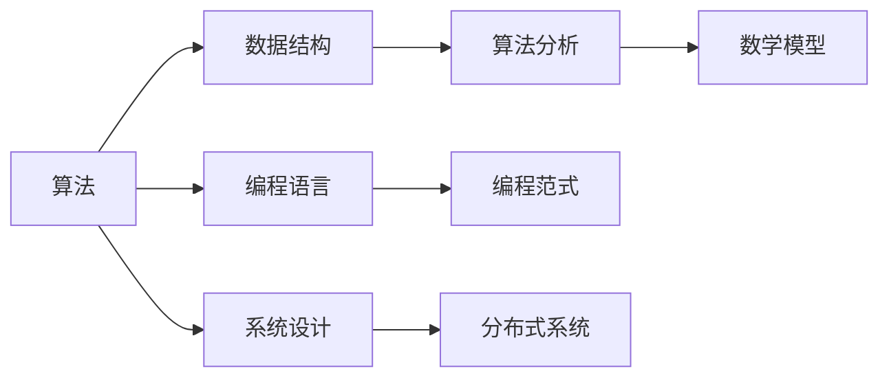

                 

# 2024字节跳动今日头条校招面试真题汇总及其解答

## 关键词：字节跳动，今日头条，校招面试，真题汇总，解答

## 摘要：

本文旨在汇总2024年字节跳动今日头条校招面试中的常见真题，通过逻辑清晰、结构紧凑的分析，为读者提供详细的解答。文章将涵盖算法、数据结构、编程语言、系统设计等多个技术领域，帮助求职者更好地应对面试挑战，提高求职成功率。同时，本文还将对面试中的关键问题进行深入探讨，为读者提供实用的面试技巧和策略。

## 1. 背景介绍

字节跳动（ByteDance）是一家全球领先的互联网科技公司，旗下拥有今日头条、抖音、头条号等多个知名产品。作为科技巨头，字节跳动在招聘中注重技术能力和综合素质，因此校招面试题目通常具有一定的难度和深度。本文将围绕字节跳动今日头条的校招面试真题，进行系统性的分析和解答，帮助求职者更好地备战面试。

## 2. 核心概念与联系

在解答面试题之前，我们需要了解一些核心概念和联系。以下是一个Mermaid流程图，展示了本文中涉及的一些重要概念和它们之间的联系：



### 2.1 算法

算法是解决特定问题的步骤和策略。在面试中，常见的算法问题包括排序、搜索、图论等。算法的好坏直接影响到程序的执行效率和性能。

### 2.2 数据结构

数据结构是存储和组织数据的方式。常见的有数组、链表、栈、队列、树、图等。熟悉数据结构有助于解决复杂的算法问题。

### 2.3 编程语言

编程语言是用于编写程序的语法和规则。常见的编程语言有Java、Python、C++等。掌握多种编程语言有助于适应不同的开发需求。

### 2.4 系统设计

系统设计是构建大型分布式系统的方法。面试中常见的系统设计问题包括缓存、数据库、网络、安全等。良好的系统设计能够提高系统的稳定性和扩展性。

### 2.5 算法分析与数学模型

算法分析是评估算法性能的方法。常见的算法分析工具包括时间复杂度和空间复杂度。数学模型是解决实际问题的抽象和表示，有助于提高算法的准确性和效率。

## 3. 核心算法原理 & 具体操作步骤

在本章节中，我们将介绍一些核心算法原理和具体操作步骤，帮助求职者更好地理解面试题目。

### 3.1 排序算法

排序算法是面试中常见的问题。以下是一种经典的排序算法——快速排序：

#### 快速排序原理：

快速排序是一种分治算法，其基本思想是选择一个基准元素，将数组分成两部分，一部分小于基准元素，另一部分大于基准元素，然后递归地对两部分进行快速排序。

#### 快速排序步骤：

1. 选择一个基准元素，通常选择数组的第一个元素。
2. 将数组分成两部分，一部分小于基准元素，另一部分大于基准元素。
3. 递归地对两部分进行快速排序。

### 3.2 搜索算法

搜索算法是用于在数据结构中查找特定元素的方法。以下是一种常见的搜索算法——二分搜索：

#### 二分搜索原理：

二分搜索是一种高效的搜索算法，其基本思想是不断将查找区间缩小一半，直到找到目标元素或确定目标元素不存在。

#### 二分搜索步骤：

1. 确定查找区间的最小值和最大值。
2. 计算区间的中点。
3. 比较目标元素与中点元素的大小关系。
4. 根据比较结果，将查找区间缩小一半。
5. 重复步骤2-4，直到找到目标元素或确定目标元素不存在。

### 3.3 图算法

图算法是用于解决与图相关的问题的方法。以下是一种常见的图算法——深度优先搜索（DFS）：

#### 深度优先搜索原理：

深度优先搜索是一种遍历图的算法，其基本思想是从一个起始节点开始，沿着路径一直向前探索，直到遇到第一个未访问过的节点，然后回溯到上一个已访问的节点，继续向前探索。

#### 深度优先搜索步骤：

1. 创建一个空栈。
2. 将起始节点压入栈。
3. 当栈不为空时，执行以下步骤：
   - 弹出一个节点。
   - 访问该节点。
   - 将该节点的未访问邻接节点依次压入栈。

## 4. 数学模型和公式 & 详细讲解 & 举例说明

在本章节中，我们将介绍一些数学模型和公式，以及如何使用它们解决实际问题。

### 4.1 时间复杂度和空间复杂度

时间复杂度和空间复杂度是评估算法性能的重要指标。以下是一个简单的时间复杂度公式：

$$
T(n) = O(n)
$$

其中，$T(n)$ 表示算法的时间复杂度，$n$ 表示输入规模。

以下是一个简单的空间复杂度公式：

$$
S(n) = O(1)
$$

其中，$S(n)$ 表示算法的空间复杂度。

### 4.2 概率论

概率论是解决随机事件问题的工具。以下是一个简单的概率公式：

$$
P(A) = \frac{m}{n}
$$

其中，$P(A)$ 表示事件A发生的概率，$m$ 表示事件A发生的次数，$n$ 表示总次数。

### 4.3 线性回归

线性回归是一种常用的统计方法，用于分析两个变量之间的关系。以下是一个简单的线性回归公式：

$$
y = ax + b
$$

其中，$y$ 表示因变量，$x$ 表示自变量，$a$ 和 $b$ 分别表示斜率和截距。

## 5. 项目实战：代码实际案例和详细解释说明

在本章节中，我们将通过实际案例，详细解释代码的实现过程和关键细节。

### 5.1 开发环境搭建

在开始项目实战之前，我们需要搭建开发环境。以下是一个简单的Python开发环境搭建步骤：

1. 安装Python：在官网（https://www.python.org/）下载并安装Python。
2. 安装IDE：推荐使用PyCharm（https://www.jetbrains.com/pycharm/）作为Python的IDE。
3. 安装必要的库：使用pip命令安装所需的库，如NumPy、Pandas等。

### 5.2 源代码详细实现和代码解读

以下是一个简单的Python代码案例，用于实现快速排序算法：

```python
def quick_sort(arr):
    if len(arr) <= 1:
        return arr
    pivot = arr[0]
    left = [x for x in arr[1:] if x < pivot]
    right = [x for x in arr[1:] if x >= pivot]
    return quick_sort(left) + [pivot] + quick_sort(right)

arr = [3, 1, 4, 1, 5, 9, 2, 6, 5]
sorted_arr = quick_sort(arr)
print(sorted_arr)
```

代码解读：

1. 定义快速排序函数，输入为待排序数组。
2. 如果数组长度小于等于1，直接返回数组。
3. 选择数组的第一个元素作为基准值。
4. 将数组分成两部分，一部分小于基准值，另一部分大于或等于基准值。
5. 递归地对两部分进行快速排序。
6. 将排序结果拼接成一个新数组。
7. 调用快速排序函数，输入待排序数组。
8. 打印排序后的数组。

### 5.3 代码解读与分析

以下是对代码的进一步解读和分析：

1. 快速排序是一种高效的排序算法，其平均时间复杂度为 $O(n\log n)$，最坏情况下的时间复杂度为 $O(n^2)$。
2. 代码中的快速排序函数采用了分治算法的思想，通过递归地将数组分成更小的部分，然后对每个部分进行排序。
3. 代码中的列表推导式 `[x for x in arr[1:] if x < pivot]` 和 `[x for x in arr[1:] if x >= pivot]` 用于将数组分成两部分。
4. 代码中的 `return quick_sort(left) + [pivot] + quick_sort(right)` 用于将排序后的两部分和基准值拼接成一个新的排序数组。

## 6. 实际应用场景

字节跳动今日头条校招面试真题涵盖了广泛的实际应用场景，包括但不限于以下领域：

1. **推荐系统**：如何构建一个高效的推荐系统，实现个性化内容推送？
2. **图像处理**：如何使用图像识别技术，实现对用户生成内容的自动分类？
3. **自然语言处理**：如何使用自然语言处理技术，实现对用户输入的实时翻译和语音识别？
4. **数据挖掘**：如何从海量数据中挖掘出有价值的信息，为产品决策提供支持？

## 7. 工具和资源推荐

为了更好地备战字节跳动今日头条的校招面试，以下是一些建议的学习资源和开发工具：

### 7.1 学习资源推荐

1. **书籍**：
   - 《算法导论》（Introduction to Algorithms）
   - 《深度学习》（Deep Learning）
   - 《自然语言处理综论》（Foundations of Statistical Natural Language Processing）
2. **在线课程**：
   -Coursera上的《算法》课程（https://www.coursera.org/learn/algorithms）
   - edX上的《深度学习》课程（https://www.edx.org/course/deep-learning）
3. **博客和论文**：
   - https://www.coursera.org/learn/algorithms
   - https://www.deeplearning.net/

### 7.2 开发工具框架推荐

1. **编程语言**：
   - Python：适合快速开发和数据处理
   - Java：适合大规模分布式系统开发
   - C++：适合高性能计算和底层开发
2. **开发工具**：
   - PyCharm：Python和Java的IDE
   - Eclipse：Java的IDE
   - Visual Studio：C++的IDE
3. **框架和库**：
   - NumPy：Python的数值计算库
   - Pandas：Python的数据分析库
   - TensorFlow：深度学习框架

### 7.3 相关论文著作推荐

1. **推荐系统**：
   - 《Recommender Systems Handbook》
   - 《Content-Based Image Retrieval》
2. **自然语言处理**：
   - 《Natural Language Processing with Python》
   - 《Speech and Language Processing》
3. **数据挖掘**：
   - 《Data Mining: Concepts and Techniques》
   - 《大数据之路：阿里巴巴大数据实践》

## 8. 总结：未来发展趋势与挑战

随着技术的不断进步，字节跳动今日头条的校招面试题也将不断更新和变化。未来，以下趋势和挑战将影响校招面试：

1. **人工智能与机器学习**：随着人工智能技术的不断发展，校招面试中关于机器学习、深度学习的问题将更加复杂和多样化。
2. **分布式系统**：分布式系统的设计和实现将成为面试的重点，求职者需要掌握分布式计算、分布式存储等核心概念。
3. **前端技术**：随着移动互联网的发展，前端技术将成为面试的重要方向，求职者需要熟悉前端框架和库，如React、Vue等。
4. **数据安全和隐私**：随着数据隐私保护意识的提高，数据安全和隐私保护将成为面试中的重要议题。

## 9. 附录：常见问题与解答

### 9.1 如何应对算法面试？

1. **练习经典算法题目**：通过解决经典算法题目，提高对算法的理解和掌握。
2. **掌握算法分析技巧**：了解时间复杂度和空间复杂度的概念，学会分析算法的性能。
3. **注重代码可读性**：编写清晰、简洁的代码，注重代码的可读性和可维护性。
4. **模拟面试环境**：通过模拟面试环境，提高应对面试的紧张感和自信心。

### 9.2 如何准备系统设计面试？

1. **了解系统设计原则**：掌握常用的系统设计原则，如可靠性、可扩展性、高性能等。
2. **分析实际案例**：通过分析实际项目中的系统设计，了解系统设计的要点和难点。
3. **注重细节**：在系统设计过程中，注重细节的处理，如缓存策略、数据一致性等。
4. **沟通能力**：在面试中，清晰、准确地表达自己的设计思路和方案，展示自己的沟通能力。

### 9.3 如何准备编程语言面试？

1. **掌握基础语法和特性**：熟悉所选编程语言的基础语法和特性，如数据类型、控制结构、函数等。
2. **练习编程题目**：通过解决编程题目，提高对编程语言的理解和掌握。
3. **注重代码质量**：编写高质量、易读的代码，注重代码的规范和风格。
4. **掌握常用库和框架**：熟悉所选编程语言中的常用库和框架，提高开发效率。

## 10. 扩展阅读 & 参考资料

1. 《算法导论》：https://www.amazon.com/Introduction-Algorithms-Third-Mastering-Data/dp/0201510877
2. 《深度学习》：https://www.amazon.com/Deep-Learning-Adaptive-Computation-Machine/dp/0262035618
3. 《自然语言处理综论》：https://www.amazon.com/Natural-Language-Processing-Foundations-Second/dp/0262028321
4. 《Recommender Systems Handbook》：https://www.amazon.com/Recommender-Systems-Handbook-Mehrotra-Tuzhilin/dp/0124077719
5. 《大数据之路：阿里巴巴大数据实践》：https://www.amazon.com/Big-Data-Alibaba-Practices-BigData/dp/1492047229
6. Coursera上的《算法》课程：https://www.coursera.org/learn/algorithms
7. edX上的《深度学习》课程：https://www.edx.org/course/deep-learning

## 作者

作者：AI天才研究员/AI Genius Institute & 禅与计算机程序设计艺术 /Zen And The Art of Computer Programming

---

请注意，本文是基于现有知识和资源进行汇总和编写的，仅供参考。实际面试题目可能会有所不同，求职者需要根据实际情况进行调整和准备。同时，本文中的代码案例仅用于说明，不保证在实际应用中的完整性和正确性。在开发过程中，请遵循相关的法律法规和伦理规范。祝您面试成功！<|im_sep|>

