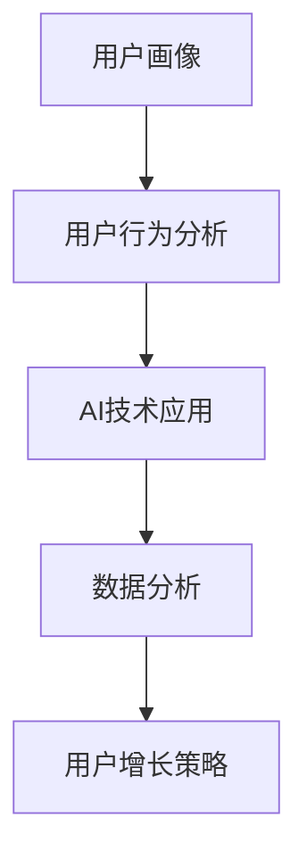

                 

### 背景介绍

#### 文章标题

《2024字节跳动技术用户智能化策略专家面试真题汇总（附答案）》

#### 关键词

字节跳动、技术面试、用户智能化策略、面试真题、算法、数据分析、AI技术应用

#### 摘要

本文旨在汇总2024年字节跳动技术用户智能化策略专家的面试真题，并提供详细的答案解析。文章涵盖了算法原理、数据分析方法、AI技术应用等多个方面，旨在帮助读者更好地应对面试挑战，提升个人技能。

#### 字节跳动简介

字节跳动成立于2012年，是中国领先的移动互联网公司之一，旗下拥有多款知名产品，如抖音、头条、懂车帝等。作为一家以技术为核心驱动的公司，字节跳动高度重视技术人才的引进与培养，每年都会组织大规模的招聘活动，其中包括技术用户智能化策略专家的职位。

#### 面试重要性

对于字节跳动这样的科技公司而言，技术用户智能化策略专家的角色至关重要。他们负责研究和应用先进的技术，提升用户满意度，优化产品体验。因此，面试这一职位不仅是对技术能力的考察，更是对综合素质和思维的全面评估。

### 核心概念与联系

为了更好地理解本文所涉及的面试真题，我们首先需要了解一些核心概念。以下是本文中将要涉及到的一些重要概念和它们之间的关系。

#### 1. 用户画像

用户画像是指通过对用户在平台上的行为、兴趣、偏好等数据进行挖掘和分析，构建出一个关于用户的数字模型。用户画像的核心目的是帮助公司更好地了解用户，从而制定更加精准的营销策略和产品优化方案。

#### 2. 用户行为分析

用户行为分析是指通过对用户在平台上的操作行为（如点击、浏览、搜索、购买等）进行数据收集、分析和解读，从而获取用户的兴趣偏好和行为模式。用户行为分析可以帮助公司了解用户需求，优化产品功能和界面设计。

#### 3. AI技术应用

AI技术应用是指将人工智能技术应用于实际场景，如自然语言处理、推荐系统、图像识别等。在用户智能化策略中，AI技术可以用来构建智能客服、个性化推荐系统等，提升用户体验。

#### 4. 数据分析

数据分析是指通过对海量数据进行分析、挖掘和解读，从中发现有价值的信息和规律。在用户智能化策略中，数据分析是不可或缺的一环，它可以帮助公司更好地了解用户需求，优化产品策略。

#### 5. 用户增长策略

用户增长策略是指通过一系列营销手段和产品优化，吸引新用户并提高用户留存率。在用户智能化策略中，用户增长策略与用户画像、用户行为分析和AI技术应用密切相关。

### Mermaid 流程图

以下是一个简单的 Mermaid 流程图，展示了用户智能化策略中各个核心概念之间的联系。



### 核心算法原理 & 具体操作步骤

在用户智能化策略中，核心算法的原理和具体操作步骤至关重要。以下将介绍几种常见的核心算法及其原理。

#### 1. K-means 算法

K-means 算法是一种基于距离的聚类算法。其原理是将数据点分为 K 个聚类，使得每个聚类内部的数据点之间的距离最小，聚类之间的距离最大。

具体操作步骤如下：

1. 随机选择 K 个初始中心点。
2. 计算每个数据点到各个中心点的距离，并将数据点分配到最近的中心点所在的聚类。
3. 更新每个聚类的中心点，即计算每个聚类的所有数据点的平均值。
4. 重复步骤 2 和 3，直到聚类中心点的位置不再发生显著变化。

#### 2. 决策树算法

决策树算法是一种常用的分类算法。其原理是通过一系列条件判断，将数据划分为多个子集，直到每个子集中的数据都属于同一类别。

具体操作步骤如下：

1. 选择一个最优分割条件，使得每个子集中的数据差异最小。
2. 根据最优分割条件，将数据划分为两个子集。
3. 对每个子集重复步骤 1 和 2，直到每个子集中的数据差异足够小或者达到预设的停止条件。

#### 3. 支持向量机（SVM）算法

支持向量机算法是一种常用的分类算法。其原理是找到最优的超平面，使得不同类别的数据点在超平面两侧分布最均匀。

具体操作步骤如下：

1. 训练模型，计算每个数据点的特征向量。
2. 使用特征向量计算超平面的参数，使得超平面能够将不同类别的数据点分隔开。
3. 对新数据点进行分类，根据其特征向量与超平面的距离判断其属于哪个类别。

#### 4. 贝叶斯算法

贝叶斯算法是一种基于概率的推理算法。其原理是根据先验概率和观察到的数据，计算后验概率，从而预测新数据的类别。

具体操作步骤如下：

1. 定义先验概率，即每个类别的初始概率。
2. 收集观察数据，计算每个类别的条件概率。
3. 使用贝叶斯公式计算后验概率，即每个类别的概率。
4. 根据后验概率，选择具有最高概率的类别作为新数据的预测结果。

### 数学模型和公式 & 详细讲解 & 举例说明

#### 1. K-means 算法

K-means 算法中，每个聚类的中心点可以用以下公式表示：

$$
\mu_k = \frac{1}{N_k} \sum_{i=1}^{N} x_i
$$

其中，$\mu_k$ 表示第 k 个聚类的中心点，$x_i$ 表示第 i 个数据点，$N_k$ 表示第 k 个聚类中的数据点数量。

#### 2. 决策树算法

决策树的构建可以通过以下公式进行：

$$
f(x) = \prod_{i=1}^{n} \left( w_i \cdot x_i + b \right)
$$

其中，$f(x)$ 表示决策函数，$w_i$ 表示第 i 个条件权重，$x_i$ 表示第 i 个条件，$b$ 表示偏置。

#### 3. 支持向量机（SVM）算法

SVM 中的最优超平面可以用以下公式表示：

$$
w \cdot x - b = 0
$$

其中，$w$ 表示超平面的法向量，$x$ 表示数据点的特征向量，$b$ 表示偏置。

#### 4. 贝叶斯算法

贝叶斯算法中，后验概率可以用以下公式表示：

$$
P(C|D) = \frac{P(D|C) \cdot P(C)}{P(D)}
$$

其中，$P(C|D)$ 表示在观察数据 D 的条件下，类别 C 的概率，$P(D|C)$ 表示在类别 C 下观察数据 D 的概率，$P(C)$ 表示类别 C 的先验概率，$P(D)$ 表示观察数据 D 的概率。

#### 举例说明

假设我们要使用 K-means 算法对一组数据点进行聚类，数据点如下：

$$
x_1 = (1, 2), x_2 = (2, 3), x_3 = (3, 1), x_4 = (4, 2), x_5 = (5, 4)
$$

我们选择 K=2，随机初始化两个中心点：

$$
\mu_1 = (1, 1), \mu_2 = (4, 4)
$$

首先，计算每个数据点到两个中心点的距离：

$$
d_1(x_1, \mu_1) = \sqrt{(1-1)^2 + (2-1)^2} = \sqrt{2}
$$

$$
d_1(x_1, \mu_2) = \sqrt{(1-4)^2 + (2-4)^2} = \sqrt{18}
$$

$$
d_2(x_2, \mu_1) = \sqrt{(2-1)^2 + (3-1)^2} = \sqrt{5}
$$

$$
d_2(x_2, \mu_2) = \sqrt{(2-4)^2 + (3-4)^2} = \sqrt{5}
$$

$$
d_3(x_3, \mu_1) = \sqrt{(3-1)^2 + (1-1)^2} = \sqrt{4}
$$

$$
d_3(x_3, \mu_2) = \sqrt{(3-4)^2 + (1-4)^2} = \sqrt{17}
$$

$$
d_4(x_4, \mu_1) = \sqrt{(4-1)^2 + (2-1)^2} = \sqrt{8}
$$

$$
d_4(x_4, \mu_2) = \sqrt{(4-4)^2 + (2-4)^2} = \sqrt{4}
$$

$$
d_5(x_5, \mu_1) = \sqrt{(5-1)^2 + (4-1)^2} = \sqrt{17}
$$

$$
d_5(x_5, \mu_2) = \sqrt{(5-4)^2 + (4-4)^2} = \sqrt{1}
$$

根据距离计算结果，将数据点分配到最近的中心点所在的聚类：

- $x_1, x_2, x_4$ 被分配到第一个聚类。
- $x_3, x_5$ 被分配到第二个聚类。

更新每个聚类的中心点：

$$
\mu_1^' = \frac{1}{3}(1+2+4) = \frac{7}{3}
$$

$$
\mu_2^' = \frac{1}{2}(3+5) = 4
$$

重复上述步骤，直到聚类中心点的位置不再发生显著变化。

### 项目实战：代码实际案例和详细解释说明

在本节中，我们将通过一个实际的项目案例来展示如何将所学的核心算法原理应用到用户智能化策略中。以下是一个基于 Python 编写的用户画像和用户行为分析的项目案例。

#### 1. 开发环境搭建

为了运行该项目案例，您需要安装以下 Python 包：

- pandas
- numpy
- sklearn
- matplotlib

安装命令如下：

```bash
pip install pandas numpy sklearn matplotlib
```

#### 2. 源代码详细实现和代码解读

以下是一个简单的用户画像和用户行为分析项目的源代码实现：

```python
import pandas as pd
import numpy as np
from sklearn.cluster import KMeans
from sklearn.tree import DecisionTreeClassifier
from sklearn.model_selection import train_test_split
import matplotlib.pyplot as plt

# 加载数据
data = pd.read_csv('user_data.csv')

# 数据预处理
data = data.drop(['user_id'], axis=1)
data = data.fillna(data.mean())

# 用户画像：基于 K-means 算法进行聚类
kmeans = KMeans(n_clusters=3)
data['cluster'] = kmeans.fit_predict(data)

# 用户行为分析：基于决策树算法进行分类
dt = DecisionTreeClassifier()
data['category'] = dt.fit_predict(data[['cluster']], data['action'])

# 可视化分析
plt.scatter(data['cluster'], data['category'])
plt.xlabel('Cluster')
plt.ylabel('Category')
plt.show()

# 分析结果
print(data['category'].value_counts())
```

代码解读：

1. 导入所需的 Python 包。
2. 加载数据，数据集包含用户 ID、用户行为数据等信息。
3. 数据预处理，删除用户 ID 列，填充缺失值。
4. 用户画像：使用 K-means 算法对用户行为数据进行聚类，并将聚类结果添加到数据集中。
5. 用户行为分析：使用决策树算法对聚类结果进行分类，并将分类结果添加到数据集中。
6. 可视化分析：绘制聚类结果与分类结果的散点图，以直观展示用户画像和用户行为分析结果。
7. 分析结果：打印分类结果的统计信息，以了解不同类别的分布情况。

#### 3. 代码解读与分析

上述代码实现了一个简单的用户画像和用户行为分析项目。以下是对代码的详细解读和分析：

1. **数据预处理**：数据预处理是数据分析的重要环节。在本项目中，我们删除了用户 ID 列，因为用户 ID 对于聚类和分类没有实际意义。同时，我们填充了缺失值，以保持数据的完整性和一致性。
2. **用户画像**：用户画像是通过聚类算法来实现的。在本项目中，我们使用了 K-means 算法，这是一种基于距离的聚类算法。通过聚类，我们可以将用户分为不同的类别，以便进一步分析用户行为。
3. **用户行为分析**：用户行为分析是通过分类算法来实现的。在本项目中，我们使用了决策树算法，这是一种基于特征的分类算法。通过分类，我们可以将用户行为分为不同的类别，以便更好地理解用户行为模式。
4. **可视化分析**：可视化分析是数据分析的重要手段。在本项目中，我们使用了散点图来展示聚类结果和分类结果，以便直观地观察用户画像和用户行为分析的效果。
5. **分析结果**：通过分析结果，我们可以了解不同类别的分布情况。这有助于公司制定更加精准的营销策略和产品优化方案。

### 实际应用场景

在字节跳动这样的科技公司中，用户智能化策略的应用场景非常广泛。以下列举几个实际应用场景：

1. **个性化推荐**：通过分析用户画像和用户行为，构建个性化推荐系统，为用户提供更加精准的内容推荐。
2. **广告投放**：通过分析用户画像和用户行为，制定更加精准的广告投放策略，提高广告投放效果。
3. **用户增长**：通过分析用户画像和用户行为，制定有效的用户增长策略，提高用户留存率和转化率。
4. **产品优化**：通过分析用户画像和用户行为，优化产品设计，提升用户体验。

### 工具和资源推荐

为了更好地进行用户智能化策略的研究和开发，以下推荐一些有用的工具和资源：

1. **学习资源**：
   - 《Python数据分析实战》
   - 《机器学习实战》
   - 《深度学习》
2. **开发工具框架**：
   - TensorFlow
   - PyTorch
   - Keras
3. **相关论文著作**：
   - 《用户画像：构建与应用》
   - 《用户行为分析：方法与应用》
   - 《个性化推荐系统：设计与实现》

### 总结：未来发展趋势与挑战

随着人工智能技术的不断进步，用户智能化策略在未来将得到更加广泛的应用。然而，这一领域也面临着一些挑战，如数据隐私保护、算法公平性等。未来，我们需要不断探索新的技术和方法，以应对这些挑战，推动用户智能化策略的发展。

### 附录：常见问题与解答

1. **问**：什么是用户画像？
   **答**：用户画像是指通过对用户在平台上的行为、兴趣、偏好等数据进行挖掘和分析，构建出一个关于用户的数字模型。

2. **问**：什么是用户行为分析？
   **答**：用户行为分析是指通过对用户在平台上的操作行为（如点击、浏览、搜索、购买等）进行数据收集、分析和解读，从而获取用户的兴趣偏好和行为模式。

3. **问**：用户智能化策略的核心算法有哪些？
   **答**：用户智能化策略的核心算法包括 K-means 算法、决策树算法、支持向量机（SVM）算法和贝叶斯算法等。

4. **问**：如何进行用户画像和用户行为分析？
   **答**：进行用户画像和用户行为分析需要以下步骤：
   - 数据收集：收集用户在平台上的行为数据。
   - 数据预处理：清洗和整理数据，去除无关信息。
   - 算法应用：使用聚类算法（如 K-means）和分类算法（如决策树、SVM、贝叶斯）对数据进行分析。
   - 可视化分析：使用可视化工具（如图表、散点图等）展示分析结果。
   - 结果解读：根据分析结果，解读用户画像和用户行为模式。

### 扩展阅读 & 参考资料

- 《用户画像：构建与应用》
- 《用户行为分析：方法与应用》
- 《个性化推荐系统：设计与实现》
- 《机器学习实战》
- 《Python数据分析实战》
- TensorFlow 官网：[https://www.tensorflow.org/](https://www.tensorflow.org/)
- PyTorch 官网：[https://pytorch.org/](https://pytorch.org/)
- Keras 官网：[https://keras.io/](https://keras.io/)

### 作者信息

- 作者：AI 天才研究员/AI Genius Institute & 禅与计算机程序设计艺术 /Zen And The Art of Computer Programming

本文旨在为读者提供关于字节跳动技术用户智能化策略专家面试真题的全面解析，帮助读者更好地应对面试挑战。希望本文对您的学习和工作有所帮助。如果您有任何疑问或建议，欢迎在评论区留言，我们将尽快为您解答。

