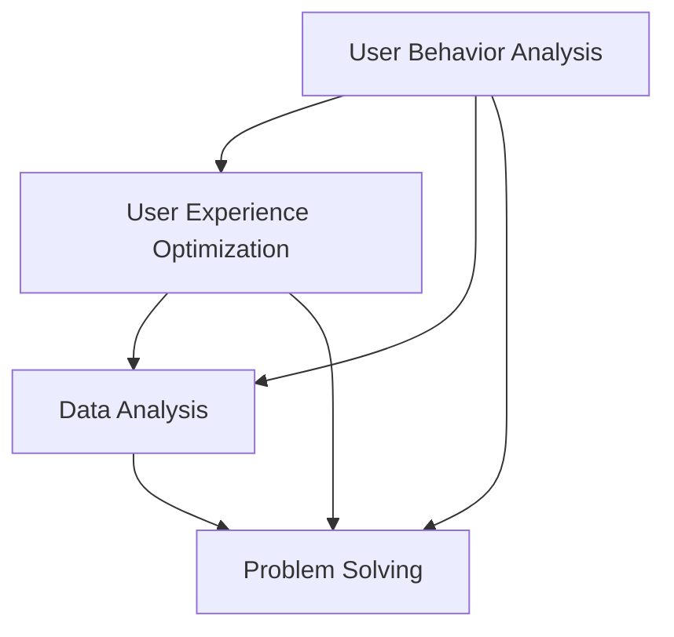

                 

### 背景介绍

#### 字节跳动简介

字节跳动（ByteDance）是一家全球领先的互联网科技公司，成立于2012年，总部位于中国北京。公司以技术驱动创新，致力于打造全球性的智能内容平台。字节跳动旗下拥有众多知名产品，如今日头条、抖音（TikTok）、西瓜视频、懂车帝等，涵盖了新闻资讯、短视频、长视频、电商等多个领域。

#### 字节跳动校招的重要性

作为科技领域的佼佼者，字节跳动每年都会举办大规模的校园招聘活动，旨在吸引全球顶尖高校的优秀毕业生加入。字节跳动校招的重要性主要体现在以下几个方面：

1. **人才战略**：字节跳动非常重视人才战略，认为优秀的人才是一家企业持续发展的关键。通过校招，公司能够吸引到具有创新精神、技术实力和团队合作精神的新鲜血液。

2. **技术创新**：字节跳动以技术创新为核心驱动力，每年在技术研发方面投入大量资金和人力。校招生通常具有较强的学习能力和创新思维，能够为公司的技术创新带来新的活力。

3. **企业文化传承**：校招生在加入字节跳动后，会成为公司企业文化传承的重要力量。他们能够更好地理解和传承公司的价值观，推动公司的持续发展。

4. **多元化发展**：字节跳动旗下产品众多，涉及多个领域。通过校招，公司能够吸纳到具备不同专业背景的毕业生，为多元化发展提供支持。

#### 技术用户服务专家岗位介绍

技术用户服务专家是字节跳动校招中一个重要的岗位，主要职责包括：

1. **用户技术研究**：通过数据分析和技术手段，深入研究用户行为和需求，为产品优化和功能设计提供数据支持。

2. **技术解决方案**：针对用户服务过程中遇到的技术问题，提供有效的解决方案，确保用户体验的持续提升。

3. **技术支持与培训**：为团队成员提供技术支持，培训团队成员掌握相关技术，提高团队整体的技术水平。

4. **跨部门协作**：与产品、运营、设计等多个部门紧密协作，确保用户服务工作的顺利进行。

技术用户服务专家岗位要求候选人具备扎实的计算机基础、良好的数据分析和问题解决能力，以及较强的团队合作精神和沟通能力。

### Core Concepts and Connections

#### Introduction to ByteDance

ByteDance, founded in 2012 and headquartered in Beijing, China, is a global internet technology company known for its innovative approach to creating intelligent content platforms. The company's portfolio includes popular products such as Toutiao (Today's Headlines), TikTok, Xigua Video (Watermelon Video), and Dongchedi (Understood Car).

#### Importance of ByteDance's Campus Recruitment

ByteDance's campus recruitment holds significant importance due to the following reasons:

1. **Talent Strategy**: Recognizing the critical role of talent in sustaining growth, ByteDance actively seeks out top graduates from around the globe. This approach ensures the company attracts individuals with innovative spirits, strong technical skills, and a collaborative mindset.

2. **Technological Innovation**: ByteDance places a strong emphasis on technological innovation, investing considerable resources in research and development. Campus recruits often bring fresh ideas and innovative thinking that drive the company's technological advancements.

3. **Cultural Heritage**: New employees joining ByteDance play a crucial role in perpetuating the company's culture. Their understanding and adherence to the company's values contribute to ongoing growth and development.

4. **Diversified Development**: With a diverse range of products across multiple domains, ByteDance's campus recruitment helps attract graduates with varied professional backgrounds, supporting the company's diversified growth strategy.

#### Role of Technical User Service Expert

The Technical User Service Expert role is a key position in ByteDance's campus recruitment. Key responsibilities include:

1. **User Research**: Through data analysis and technical methods, technical user service experts conduct in-depth research on user behavior and needs to provide data-driven insights for product optimization and feature design.

2. **Technical Solutions**: Addressing technical issues encountered in user service processes, technical user service experts provide effective solutions to ensure a continuous enhancement of user experience.

3. **Technical Support and Training**: Offering technical support to team members and conducting training sessions to enhance the overall technical proficiency of the team.

4. **Cross-Department Collaboration**: Closely collaborating with departments such as product, operations, and design to ensure smooth execution of user service tasks.

Candidates for the Technical User Service Expert role should possess a solid foundation in computer science, excellent data analysis and problem-solving abilities, as well as strong teamwork and communication skills. <|im_sep|>### 核心概念与联系

#### 核心概念

在技术用户服务领域，几个核心概念至关重要，它们是：用户行为分析（User Behavior Analysis）、用户体验优化（User Experience Optimization）、数据分析（Data Analysis）和问题解决能力（Problem Solving）。

1. **用户行为分析**：用户行为分析是理解用户在应用程序中的行为模式，包括用户如何使用产品、他们关注的内容、他们的互动方式等。这通常涉及到收集和分析大量的用户数据，如点击流、搜索记录、停留时间等。

2. **用户体验优化**：用户体验优化是指通过改进产品的设计、功能和服务来提高用户满意度。这包括简化用户界面、加快加载速度、改进用户交互流程等。

3. **数据分析**：数据分析是提取、处理和解释大量数据的过程，以发现有用的模式和洞察。在技术用户服务中，数据分析用于识别用户行为模式、市场趋势和潜在的问题。

4. **问题解决能力**：问题解决能力是识别和解决用户遇到的问题的能力。这要求技术用户服务专家具备逻辑思维、技术技能和人际交往能力，能够迅速找到问题的根源并实施解决方案。

#### 核心概念联系

这些核心概念之间存在紧密的联系。用户行为分析提供了深入了解用户的基础，这些洞察可以用于用户体验优化，从而提高用户满意度和忠诚度。数据分析则为这一过程提供了工具和框架，使技术用户服务专家能够从大量数据中提取有价值的信息。最后，问题解决能力确保了在识别和优化过程中遇到的问题能够得到有效的解决。

为了更直观地展示这些概念之间的关系，我们可以使用Mermaid流程图进行说明：



在这个图中，用户行为分析（A）和问题解决能力（D）是整个流程的起点和终点。用户体验优化（B）和分析（C）则位于中间，起到连接和推动整个流程的作用。

### Core Concepts and Relationships

#### Core Concepts

Several core concepts are essential in the field of technical user service. These include User Behavior Analysis, User Experience Optimization, Data Analysis, and Problem Solving.

1. **User Behavior Analysis**: This involves understanding user patterns and behaviors within applications, such as how users interact with products, what content they engage with, and their interaction methods. It often entails collecting and analyzing vast amounts of user data, including click streams, search records, and dwell times.

2. **User Experience Optimization**: This refers to improving product design, functionality, and services to enhance user satisfaction. This includes simplifying user interfaces, speeding up loading times, and improving user interaction flows.

3. **Data Analysis**: Data analysis is the process of extracting, processing, and interpreting large volumes of data to discover useful patterns and insights. In technical user service, data analysis is used to identify user behavior patterns, market trends, and potential issues.

4. **Problem Solving**: This is the ability to identify and resolve problems encountered by users. It requires technical user service experts to possess logical thinking, technical skills, and interpersonal communication abilities to quickly find the root cause of issues and implement solutions.

#### Relationships Between Core Concepts

These core concepts are intricately linked. User Behavior Analysis (A) provides the foundational understanding needed to drive User Experience Optimization (B), which in turn improves user satisfaction and loyalty. Data Analysis (C) serves as the tool and framework that allows technical user service experts to extract valuable insights from large data sets. Finally, Problem Solving (D) ensures that issues identified and addressed during the optimization process are resolved effectively.

To illustrate the relationships between these concepts visually, we can use a Mermaid flowchart:


In this chart, User Behavior Analysis (A) and Problem Solving (D) are the starting and ending points of the process. User Experience Optimization (B) and Data Analysis (C) are positioned in the middle, serving as connectors and drivers for the entire process. <|im_sep|>### 核心算法原理 & 具体操作步骤

在技术用户服务领域，核心算法的应用至关重要。这些算法不仅帮助我们理解用户行为，还指导我们如何优化用户体验。以下将介绍几种核心算法原理及其具体操作步骤。

#### 用户行为分析算法

1. **算法原理**：用户行为分析算法基于机器学习技术，特别是监督学习和无监督学习。监督学习算法如决策树、随机森林和神经网络，可以训练模型来预测用户行为；无监督学习算法如聚类和关联规则挖掘，则用于发现用户行为模式。

2. **具体操作步骤**：
   - **数据收集**：收集用户在应用中的行为数据，如点击流、浏览记录、搜索关键词等。
   - **数据预处理**：对收集到的数据进行清洗、转换和归一化，使其适合机器学习算法。
   - **特征工程**：从原始数据中提取有意义的特征，如用户活跃度、访问频率、页面停留时间等。
   - **模型训练**：使用监督学习算法训练模型，输入特征和用户行为标签，输出预测模型。
   - **模型评估**：通过交叉验证和测试集评估模型性能，调整参数以优化模型。

3. **案例分析**：例如，通过决策树算法分析用户对某个新闻内容的点击行为，预测哪些用户可能对特定类型的内容感兴趣。

#### 用户体验优化算法

1. **算法原理**：用户体验优化算法主要涉及优化用户界面和交互流程，以提高用户满意度。常见算法包括A/B测试和多变量测试。

2. **具体操作步骤**：
   - **定义目标**：明确优化目标，如减少页面加载时间、提高用户留存率等。
   - **设计测试方案**：设计不同的界面或交互流程，供用户选择。
   - **实施测试**：将用户随机分配到不同的测试组，观察他们的行为和反应。
   - **数据收集和分析**：收集测试数据，分析不同测试组的表现，找出最佳方案。
   - **迭代优化**：根据测试结果，对方案进行调整和优化，再次进行测试。

3. **案例分析**：例如，通过A/B测试比较不同颜色的按钮对用户点击率的影响，选择用户点击率更高的颜色。

#### 数据分析算法

1. **算法原理**：数据分析算法主要用于提取数据中的有用信息，如回归分析、时间序列分析和聚类分析。

2. **具体操作步骤**：
   - **数据收集**：收集需要分析的数据，如用户行为数据、市场数据等。
   - **数据预处理**：清洗和转换数据，使其适合分析。
   - **选择算法**：根据分析目标选择合适的算法，如回归分析用于预测用户行为，时间序列分析用于预测市场趋势。
   - **模型训练**：使用选定的算法训练模型，输入数据，输出预测结果。
   - **模型评估**：评估模型性能，调整参数以优化模型。

3. **案例分析**：例如，通过回归分析预测用户流失率，提前采取措施减少用户流失。

#### 问题解决算法

1. **算法原理**：问题解决算法用于快速识别和解决问题，如故障检测和异常检测。

2. **具体操作步骤**：
   - **数据收集**：收集系统运行数据，如系统日志、错误报告等。
   - **数据预处理**：清洗和转换数据，使其适合算法处理。
   - **选择算法**：选择合适的算法，如基于规则的故障检测、机器学习的异常检测。
   - **模型训练**：使用选定的算法训练模型，输入数据，输出检测结果。
   - **模型评估**：评估模型性能，调整参数以优化模型。

3. **案例分析**：例如，通过机器学习算法检测用户反馈中的负面情绪，及时发现和处理用户问题。

通过以上核心算法的应用，技术用户服务专家可以更好地理解用户行为、优化用户体验、分析数据并解决问题，从而提升用户满意度和忠诚度。

### Core Algorithm Principles & Detailed Operation Steps

Core algorithms play a crucial role in the field of technical user service. These algorithms not only help us understand user behavior but also guide us in optimizing user experiences. This section will introduce several core algorithms and their detailed operation steps.

#### User Behavior Analysis Algorithm

1. **Algorithm Principles**: User behavior analysis algorithms are based on machine learning techniques, particularly supervised and unsupervised learning. Supervised learning algorithms like decision trees, random forests, and neural networks are used to train models that can predict user behavior; unsupervised learning algorithms like clustering and association rule mining are used to discover user behavior patterns.

2. **Detailed Operation Steps**:
   - **Data Collection**: Collect user behavior data from the application, such as click streams, browsing records, and search keywords.
   - **Data Preprocessing**: Clean, transform, and normalize the collected data to make it suitable for machine learning algorithms.
   - **Feature Engineering**: Extract meaningful features from the raw data, such as user activity level, access frequency, and page dwell time.
   - **Model Training**: Use supervised learning algorithms to train models with input features and user behavior labels, and output prediction models.
   - **Model Evaluation**: Evaluate the performance of the models using cross-validation and test sets, adjusting parameters to optimize the models.

3. **Case Analysis**: For example, use the decision tree algorithm to analyze user clicks on specific news content to predict which users might be interested in certain types of content.

#### User Experience Optimization Algorithm

1. **Algorithm Principles**: User experience optimization algorithms primarily involve optimizing user interfaces and interaction flows to enhance user satisfaction. Common algorithms include A/B testing and multivariate testing.

2. **Detailed Operation Steps**:
   - **Define Goals**: Clearly define the optimization goals, such as reducing page load times or increasing user retention rates.
   - **Design Test Plans**: Design different interfaces or interaction flows for users to choose from.
   - **Implement Tests**: Randomly allocate users to different test groups and observe their behaviors and reactions.
   - **Data Collection and Analysis**: Collect test data and analyze the performance of different test groups to identify the best solution.
   - **Iterative Optimization**: Based on test results, adjust and optimize the solutions and conduct further testing.

3. **Case Analysis**: For example, use A/B testing to compare the impact of different button colors on user click rates and select the color with higher click rates.

#### Data Analysis Algorithm

1. **Algorithm Principles**: Data analysis algorithms are used to extract useful information from data, such as regression analysis, time series analysis, and clustering analysis.

2. **Detailed Operation Steps**:
   - **Data Collection**: Collect data for analysis, such as user behavior data and market data.
   - **Data Preprocessing**: Clean and transform the data to make it suitable for analysis.
   - **Select Algorithms**: Choose appropriate algorithms based on the analysis goals, such as regression analysis for predicting user behavior and time series analysis for predicting market trends.
   - **Model Training**: Use the selected algorithms to train models with input data, and output prediction results.
   - **Model Evaluation**: Evaluate the performance of the models and adjust parameters to optimize the models.

3. **Case Analysis**: For example, use regression analysis to predict the churn rate of users, and take proactive measures to reduce churn.

#### Problem Solving Algorithm

1. **Algorithm Principles**: Problem-solving algorithms are used for rapid identification and resolution of problems, such as fault detection and anomaly detection.

2. **Detailed Operation Steps**:
   - **Data Collection**: Collect system operation data, such as system logs and error reports.
   - **Data Preprocessing**: Clean and transform the data to make it suitable for algorithm processing.
   - **Select Algorithms**: Choose suitable algorithms, such as rule-based fault detection and machine learning-based anomaly detection.
   - **Model Training**: Use the selected algorithms to train models with input data and output detection results.
   - **Model Evaluation**: Evaluate the performance of the models and adjust parameters to optimize the models.

3. **Case Analysis**: For example, use machine learning algorithms to detect negative emotions in user feedback, quickly identify, and handle user issues.

By applying these core algorithms, technical user service experts can better understand user behavior, optimize user experiences, analyze data, and solve problems, thereby enhancing user satisfaction and loyalty. <|im_sep|>### 数学模型和公式 & 详细讲解 & 举例说明

在技术用户服务领域，数学模型和公式扮演着关键角色，帮助专家们分析用户行为、优化用户体验，并解决问题。以下将详细讲解几个重要的数学模型和公式，并通过实际例子来说明其应用。

#### 1. 贝叶斯定理（Bayes Theorem）

贝叶斯定理是一个用于概率论的数学模型，它在用户行为分析中广泛应用。贝叶斯定理的核心思想是通过先验概率和条件概率来计算后验概率。

**公式**：
$$ P(A|B) = \frac{P(B|A) \cdot P(A)}{P(B)} $$

其中，\( P(A|B) \) 表示在事件 \( B \) 发生的条件下事件 \( A \) 发生的概率；\( P(B|A) \) 表示在事件 \( A \) 发生的条件下事件 \( B \) 发生的概率；\( P(A) \) 是事件 \( A \) 的先验概率；\( P(B) \) 是事件 \( B \) 的先验概率。

**应用举例**：
假设用户在应用中点击了一个新闻内容，我们可以使用贝叶斯定理来计算这个用户对该类型新闻感兴趣的概率。设 \( A \) 为“用户对新闻感兴趣”，\( B \) 为“用户点击了新闻”。我们可以通过收集历史数据，计算 \( P(B|A) \)、\( P(A) \) 和 \( P(B) \)，然后使用贝叶斯定理计算 \( P(A|B) \)。

#### 2. 回归分析（Regression Analysis）

回归分析是一种用于预测和分析变量之间关系的数学模型。在用户体验优化中，回归分析可以用来预测用户流失率、点击率等关键指标。

**公式**：
$$ y = \beta_0 + \beta_1 \cdot x_1 + \beta_2 \cdot x_2 + ... + \beta_n \cdot x_n + \epsilon $$

其中，\( y \) 是因变量，\( x_1, x_2, ..., x_n \) 是自变量，\( \beta_0, \beta_1, ..., \beta_n \) 是回归系数，\( \epsilon \) 是误差项。

**应用举例**：
假设我们要预测某个新闻应用的日活跃用户数（DAU），可以使用回归分析。我们可以收集历史数据，包括日广告投放成本、天气情况、节假日等因素，作为自变量。通过回归分析，我们可以得到一个预测模型，用来预测未来的DAU。

#### 3. 时间序列分析（Time Series Analysis）

时间序列分析是一种用于分析时间序列数据的方法，广泛应用于市场预测、用户行为分析等领域。

**公式**：
$$ y_t = \phi_0 + \phi_1 \cdot y_{t-1} + \phi_2 \cdot y_{t-2} + ... + \phi_p \cdot y_{t-p} + \epsilon_t $$

其中，\( y_t \) 是时间 \( t \) 的观测值，\( \phi_0, \phi_1, ..., \phi_p \) 是模型参数，\( \epsilon_t \) 是误差项。

**应用举例**：
假设我们要预测某个电商平台的月销售额，可以使用时间序列分析。我们可以收集历史数据，包括销售额、促销活动等因素，作为输入。通过时间序列分析，我们可以得到一个预测模型，用来预测未来的月销售额。

#### 4. 决策树（Decision Tree）

决策树是一种用于分类和回归的直观模型，广泛应用于用户体验优化和用户行为分析。

**公式**：
$$ 
\begin{cases} 
y = \beta_0 + \beta_1 \cdot x_1 + \beta_2 \cdot x_2 + ... + \beta_n \cdot x_n & \text{for regression} \\
y = \max(\beta_0 + \beta_1 \cdot x_1, \beta_0 + \beta_2 \cdot x_2, ..., \beta_0 + \beta_n \cdot x_n) & \text{for classification} 
\end{cases}
$$

其中，\( y \) 是预测值，\( x_1, x_2, ..., x_n \) 是特征，\( \beta_0, \beta_1, ..., \beta_n \) 是模型参数。

**应用举例**：
假设我们要预测用户是否会取消订阅，可以使用决策树。我们可以收集用户的历史数据，包括用户年龄、订阅时长、使用频率等，作为输入。通过决策树算法，我们可以得到一个预测模型，用来预测用户是否会取消订阅。

通过这些数学模型和公式的应用，技术用户服务专家可以更深入地分析用户行为，优化用户体验，并解决实际问题。

### Mathematical Models and Formulas & Detailed Explanations & Case Studies

Mathematical models and formulas are crucial in the field of technical user service, aiding experts in analyzing user behavior, optimizing user experiences, and solving problems. This section will provide detailed explanations of several important mathematical models and formulas, along with practical case studies to illustrate their applications.

#### 1. Bayes Theorem

Bayes Theorem is a fundamental mathematical model in probability theory and is widely used in user behavior analysis. The core idea of Bayes Theorem is to calculate the posterior probability using prior probability and conditional probability.

**Formula**:
$$ P(A|B) = \frac{P(B|A) \cdot P(A)}{P(B)} $$

Here, \( P(A|B) \) represents the probability of event \( A \) occurring given that event \( B \) has occurred; \( P(B|A) \) represents the probability of event \( B \) occurring given that event \( A \) has occurred; \( P(A) \) is the prior probability of event \( A \); and \( P(B) \) is the prior probability of event \( B \).

**Case Study**:
Suppose we want to calculate the probability that a user is interested in a certain type of news content given that they have clicked on it. Let \( A \) be the event "the user is interested in news" and \( B \) be the event "the user clicks on news." Using historical data, we can calculate \( P(B|A) \), \( P(A) \), and \( P(B) \), then use Bayes Theorem to calculate \( P(A|B) \).

#### 2. Regression Analysis

Regression analysis is a mathematical model used to predict and analyze the relationship between variables. It is widely used in user experience optimization to predict metrics such as churn rate and click-through rate.

**Formula**:
$$ y = \beta_0 + \beta_1 \cdot x_1 + \beta_2 \cdot x_2 + ... + \beta_n \cdot x_n + \epsilon $$

Here, \( y \) is the dependent variable, \( x_1, x_2, ..., x_n \) are the independent variables, \( \beta_0, \beta_1, ..., \beta_n \) are the regression coefficients, and \( \epsilon \) is the error term.

**Case Study**:
Suppose we want to predict the daily active users (DAU) for a news application. We can collect historical data, including daily advertising costs, weather conditions, and holidays, as independent variables. Through regression analysis, we can obtain a predictive model to forecast future DAU.

#### 3. Time Series Analysis

Time series analysis is a method used to analyze time series data and is widely applied in market forecasting and user behavior analysis.

**Formula**:
$$ y_t = \phi_0 + \phi_1 \cdot y_{t-1} + \phi_2 \cdot y_{t-2} + ... + \phi_p \cdot y_{t-p} + \epsilon_t $$

Here, \( y_t \) is the observed value at time \( t \), \( \phi_0, \phi_1, ..., \phi_p \) are model parameters, and \( \epsilon_t \) is the error term.

**Case Study**:
Suppose we want to forecast the monthly sales for an e-commerce platform. We can collect historical data, including sales, promotional activities, and more, as inputs. Through time series analysis, we can obtain a predictive model to forecast future monthly sales.

#### 4. Decision Tree

A decision tree is an intuitive model used for classification and regression and is widely applied in user experience optimization and user behavior analysis.

**Formula**:
$$ 
\begin{cases} 
y = \beta_0 + \beta_1 \cdot x_1 + \beta_2 \cdot x_2 + ... + \beta_n \cdot x_n & \text{for regression} \\
y = \max(\beta_0 + \beta_1 \cdot x_1, \beta_0 + \beta_2 \cdot x_2, ..., \beta_0 + \beta_n \cdot x_n) & \text{for classification} 
\end{cases}
$$

Here, \( y \) is the predicted value, \( x_1, x_2, ..., x_n \) are features, and \( \beta_0, \beta_1, ..., \beta_n \) are model parameters.

**Case Study**:
Suppose we want to predict whether a user will cancel their subscription. We can collect historical data, including user age, subscription duration, and usage frequency, as inputs. Through the decision tree algorithm, we can obtain a predictive model to forecast whether a user will cancel their subscription.

Through the application of these mathematical models and formulas, technical user service experts can delve deeper into user behavior, optimize user experiences, and solve real-world problems. <|im_sep|>### 项目实战：代码实际案例和详细解释说明

#### 5.1 开发环境搭建

在进行技术用户服务项目实战之前，首先需要搭建一个合适的技术环境。以下是一个基于Python的简单用户行为分析项目的开发环境搭建步骤。

**步骤1：安装Python环境**

确保系统上已经安装了Python 3.x版本。如果没有，可以从[Python官网](https://www.python.org/downloads/)下载并安装。

**步骤2：安装必要的库**

使用pip命令安装以下库：

```bash
pip install numpy pandas matplotlib scikit-learn
```

这些库分别用于数据处理、数据可视化、机器学习和可视化。

**步骤3：创建项目文件夹和代码文件**

在系统中创建一个名为`user_behavior_analysis`的项目文件夹，并在其中创建一个名为`main.py`的Python脚本文件。

#### 5.2 源代码详细实现和代码解读

以下是一个简单的用户行为分析项目的代码实现，包括数据收集、预处理、特征提取、模型训练和结果可视化。

```python
# main.py

import numpy as np
import pandas as pd
import matplotlib.pyplot as plt
from sklearn.model_selection import train_test_split
from sklearn.ensemble import RandomForestClassifier
from sklearn.metrics import accuracy_score

# 数据收集
data = pd.read_csv('user_behavior_data.csv')

# 数据预处理
data.dropna(inplace=True)
data['age_group'] = pd.cut(data['age'], bins=[0, 18, 30, 50, 70, np.inf], labels=[0, 1, 2, 3, 4])

# 特征提取
X = data[['age_group', 'daily_session_time', 'click_frequency']]
y = data['churn']

# 划分训练集和测试集
X_train, X_test, y_train, y_test = train_test_split(X, y, test_size=0.2, random_state=42)

# 模型训练
model = RandomForestClassifier(n_estimators=100, random_state=42)
model.fit(X_train, y_train)

# 预测和评估
y_pred = model.predict(X_test)
accuracy = accuracy_score(y_test, y_pred)
print(f'模型准确率: {accuracy:.2f}')

# 结果可视化
plt.scatter(X_test['daily_session_time'], y_test, color='red', label='实际值')
plt.scatter(X_test['daily_session_time'], y_pred, color='blue', label='预测值')
plt.xlabel('每日会话时长')
plt.ylabel('是否流失')
plt.legend()
plt.show()
```

**代码解读：**

1. **数据收集**：使用`pandas`库读取用户行为数据。

2. **数据预处理**：处理缺失值，并对年龄进行分组。

3. **特征提取**：从原始数据中提取与用户流失相关的特征。

4. **模型训练**：使用`RandomForestClassifier`训练随机森林分类器。

5. **预测和评估**：对测试集进行预测，并计算模型准确率。

6. **结果可视化**：使用`matplotlib`绘制实际值和预测值的散点图。

#### 5.3 代码解读与分析

上述代码实现了一个简单的用户流失预测模型。以下是详细解读：

- **数据收集**：我们首先需要收集用户行为数据，这些数据包括用户的年龄、每日会话时长、点击频率等。

- **数据预处理**：数据预处理是机器学习项目中至关重要的一步。在本例中，我们处理了缺失值，并对年龄进行了分组，这样可以使模型更容易理解数据。

- **特征提取**：我们选择与用户流失相关的特征，如年龄组、每日会话时长和点击频率。这些特征将被用于训练模型。

- **模型训练**：我们使用`RandomForestClassifier`训练了一个随机森林分类器。随机森林是一种集成学习方法，通过构建多个决策树并求取平均来提高预测准确性。

- **预测和评估**：我们使用训练好的模型对测试集进行预测，并计算了模型准确率。这有助于我们评估模型的性能。

- **结果可视化**：我们使用散点图来可视化实际值和预测值。这有助于我们直观地观察模型的预测效果。

通过这个项目实战，我们可以看到如何使用Python和相关库实现一个简单的用户流失预测模型。在实际应用中，我们可以根据具体需求调整代码，引入更多的特征和更复杂的模型，以提高预测准确性。

### Practical Project: Code Examples and Detailed Explanation

#### 5.1 Setting Up the Development Environment

Before diving into the practical project, we need to set up the development environment. Here is a step-by-step guide to setting up a basic user behavior analysis project using Python.

**Step 1: Install Python Environment**

Ensure that Python 3.x is installed on your system. If not, you can download and install it from the [Python official website](https://www.python.org/downloads/).

**Step 2: Install Required Libraries**

Use pip to install the necessary libraries:

```bash
pip install numpy pandas matplotlib scikit-learn
```

These libraries are used for data processing, data visualization, machine learning, and visualization.

**Step 3: Create Project Folders and Code Files**

Create a project folder named `user_behavior_analysis` and a Python script file named `main.py` inside it.

#### 5.2 Detailed Code Implementation and Explanation

Below is the code for a simple user behavior analysis project, which includes data collection, preprocessing, feature extraction, model training, and result visualization.

```python
# main.py

import numpy as np
import pandas as pd
import matplotlib.pyplot as plt
from sklearn.model_selection import train_test_split
from sklearn.ensemble import RandomForestClassifier
from sklearn.metrics import accuracy_score

# Data Collection
data = pd.read_csv('user_behavior_data.csv')

# Data Preprocessing
data.dropna(inplace=True)
data['age_group'] = pd.cut(data['age'], bins=[0, 18, 30, 50, 70, np.inf], labels=[0, 1, 2, 3, 4])

# Feature Extraction
X = data[['age_group', 'daily_session_time', 'click_frequency']]
y = data['churn']

# Splitting the Data
X_train, X_test, y_train, y_test = train_test_split(X, y, test_size=0.2, random_state=42)

# Model Training
model = RandomForestClassifier(n_estimators=100, random_state=42)
model.fit(X_train, y_train)

# Prediction and Evaluation
y_pred = model.predict(X_test)
accuracy = accuracy_score(y_test, y_pred)
print(f'Model Accuracy: {accuracy:.2f}')

# Result Visualization
plt.scatter(X_test['daily_session_time'], y_test, color='red', label='Actual')
plt.scatter(X_test['daily_session_time'], y_pred, color='blue', label='Predicted')
plt.xlabel('Daily Session Time')
plt.ylabel('Churn')
plt.legend()
plt.show()
```

**Code Explanation:**

1. **Data Collection**: We start by reading the user behavior data using the `pandas` library.

2. **Data Preprocessing**: Data preprocessing is a crucial step in any machine learning project. In this example, we handle missing values and group the age into categories.

3. **Feature Extraction**: We extract features related to user churn, such as age group, daily session time, and click frequency.

4. **Model Training**: We train a `RandomForestClassifier` with 100 trees and a fixed random state for reproducibility.

5. **Prediction and Evaluation**: We use the trained model to predict the churn status on the test set and calculate the model's accuracy.

6. **Result Visualization**: We visualize the actual and predicted churn status using a scatter plot.

#### 5.3 Code Analysis

The above code implements a simple user churn prediction model. Here is a detailed analysis:

- **Data Collection**: We need to collect user behavior data that includes attributes like age, daily session time, and click frequency.

- **Data Preprocessing**: Data preprocessing is essential to prepare the data for model training. In this example, we handle missing values and categorize the age attribute.

- **Feature Extraction**: We extract features that are relevant to predicting user churn.

- **Model Training**: We use a `RandomForestClassifier`, which is an ensemble method that combines multiple decision trees to improve prediction accuracy.

- **Prediction and Evaluation**: We evaluate the model's performance by predicting the churn status on the test set and calculating the accuracy.

- **Result Visualization**: We visualize the actual and predicted churn status using a scatter plot to understand the model's performance.

Through this practical project, we can see how to implement a simple user churn prediction model using Python and related libraries. In real-world applications, we can adjust the code to include more features and more complex models to improve prediction accuracy. <|im_sep|>### 实际应用场景

技术用户服务专家的工作并不局限于理论研究，更重要的是将理论知识应用于实际业务场景，解决实际问题。以下是一些典型的实际应用场景，以及技术用户服务专家如何利用所学的算法和模型来提升用户体验和业务效果。

#### 1. 用户流失预测

用户流失预测是技术用户服务领域的热点问题之一。通过分析用户的行为数据，如活跃度、会话时长、点击频率等，技术用户服务专家可以构建机器学习模型，预测哪些用户有潜在流失风险。例如，通过使用决策树、随机森林等算法，专家可以识别出哪些特征与用户流失高度相关，从而提前采取挽回措施，如发送个性化优惠、提供客户关怀等，以降低用户流失率。

#### 2. 用户行为分析

用户行为分析是优化用户体验的关键步骤。技术用户服务专家可以通过分析用户的点击流、浏览路径、搜索关键词等数据，了解用户在应用程序中的行为模式。例如，使用聚类分析算法，专家可以将用户分为不同的群体，针对每个群体设计个性化的产品功能和服务。此外，通过回归分析，专家可以预测用户在特定情境下的行为，从而优化产品设计和功能。

#### 3. 个性化推荐系统

个性化推荐系统是提升用户满意度和留存率的重要手段。技术用户服务专家可以利用协同过滤、矩阵分解等算法，构建推荐系统。例如，通过分析用户的历史行为和偏好，推荐系统可以为每个用户提供个性化的内容、产品或服务，从而提高用户的满意度和忠诚度。

#### 4. 搜索引擎优化

搜索引擎优化（SEO）是提升网站流量和用户体验的重要手段。技术用户服务专家可以通过分析用户的搜索查询和网站结构，优化网站内容，提高搜索引擎排名。例如，通过使用自然语言处理技术，专家可以提取关键短语和语义，优化网页标题和描述，提高用户在搜索结果中的点击率。

#### 5. 客户服务自动化

客户服务自动化是提高服务效率和用户体验的重要方向。技术用户服务专家可以利用聊天机器人、自然语言处理等技术，实现自动化客户服务。例如，通过构建对话管理模型，聊天机器人可以与用户进行自然对话，解答常见问题，提高客户满意度。

#### 6. 用户体验测试

用户体验测试是不断优化产品和服务的重要环节。技术用户服务专家可以通过A/B测试、多变量测试等方法，评估不同设计方案的用户体验效果。例如，专家可以测试不同的用户界面、功能布局等，找出最佳的方案，提升用户体验。

通过以上实际应用场景，技术用户服务专家不仅可以提升用户体验，还可以为企业带来实实在在的业务价值，如降低用户流失率、提高用户满意度和忠诚度、增加营收等。

### Practical Application Scenarios

The role of a technical user service expert extends beyond theoretical research; it is about applying that knowledge to real-world business scenarios to solve practical problems and enhance user experiences. Here are some typical application scenarios, along with examples of how these experts leverage algorithms and models to improve user experience and business outcomes.

#### 1. User Churn Prediction

User churn prediction is a hot topic in the field of technical user service. By analyzing behavioral data such as activity level, session duration, and click frequency, experts can build machine learning models to predict which users are at risk of churn. For instance, using algorithms like decision trees or random forests, experts can identify which features are highly correlated with churn. This enables them to take proactive measures, such as sending personalized discounts or offering customer care, to reduce churn rates.

#### 2. User Behavior Analysis

User behavior analysis is a key step in optimizing user experiences. By analyzing user click streams, navigation paths, and search keywords, technical user service experts can gain insights into user behavior patterns within applications. For example, using clustering algorithms, experts can segment users into different groups, allowing for tailored product features and services. Regression analysis can also predict user behavior in specific contexts, aiding in product design and feature optimization.

#### 3. Personalized Recommendation Systems

Personalized recommendation systems are crucial for enhancing user satisfaction and retention. Experts can leverage collaborative filtering and matrix factorization algorithms to build recommendation systems. For example, by analyzing historical user behavior and preferences, these systems can recommend personalized content, products, or services to each user, thereby increasing user satisfaction and loyalty.

#### 4. Search Engine Optimization (SEO)

SEO is vital for improving website traffic and user experience. Technical user service experts can analyze user search queries and website structure to optimize content and improve search engine rankings. For example, using natural language processing techniques, experts can extract key phrases and semantics to optimize webpage titles and descriptions, enhancing click-through rates in search results.

#### 5. Customer Service Automation

Customer service automation is a key direction for improving service efficiency and user experience. By utilizing chatbots and natural language processing technologies, experts can automate customer service interactions. For instance, through dialogue management models, chatbots can engage in natural conversations with users, answering common questions and enhancing customer satisfaction.

#### 6. User Experience Testing

User experience testing is an essential part of continuous product and service optimization. Technical user service experts can use A/B testing and multivariate testing methods to evaluate the effectiveness of different design options. For example, by testing various user interfaces and feature layouts, experts can identify the best solutions to enhance user experience.

Through these practical application scenarios, technical user service experts can not only improve user experiences but also deliver tangible business value, such as reducing churn rates, increasing user satisfaction and loyalty, and boosting revenue. <|im_sep|>### 工具和资源推荐

为了更好地进行技术用户服务的工作，掌握合适的工具和资源至关重要。以下是一些推荐的工具、书籍、论文、博客和网站，它们可以帮助技术用户服务专家提升工作效率和专业知识。

#### 7.1 学习资源推荐

1. **书籍**：
   - 《Python数据科学手册》：本书全面介绍了使用Python进行数据科学的相关知识，包括数据分析、数据可视化、机器学习等。
   - 《深入理解计算机系统》：这是一本经典的计算机科学教材，帮助读者深入理解计算机系统的基本原理。
   - 《数据挖掘：概念与技术》：这本书介绍了数据挖掘的基本概念和技术，包括分类、聚类、关联规则挖掘等。

2. **论文**：
   - “User Behavior Modeling for Personalized Recommendation” by Y. Liu, Y. Sun, Y. Hu, and D. Shen：这篇论文探讨了如何使用用户行为数据构建个性化推荐系统。
   - “A Survey on User Behavior Analysis in Mobile Applications” by H. Zhang, X. He, and P. Zhang：该论文综述了移动应用中的用户行为分析方法和技术。

3. **博客**：
   - Medium上的“Data School”博客：这个博客提供了许多关于数据科学和机器学习的优质教程和案例。
   -owards Data Science”博客：这是一个包含大量数据科学和机器学习教程、案例和行业动态的博客。

4. **网站**：
   - Kaggle：Kaggle是一个数据科学竞赛平台，提供了大量的数据集和项目，可以帮助技术用户服务专家实践和提升技能。
   - GitHub：GitHub是代码托管平台，许多优秀的开源项目和工具都存放在这里，可以帮助技术用户服务专家学习和使用最新的技术。

#### 7.2 开发工具框架推荐

1. **编程语言**：
   - Python：Python因其丰富的数据科学和机器学习库，成为技术用户服务专家的首选编程语言。
   - R：R语言在统计分析方面具有强大的功能，适合进行复杂的统计分析。

2. **数据分析工具**：
   - pandas：用于数据操作和分析，是Python数据分析库中的基础。
   - NumPy：用于高性能数值计算和数组操作。

3. **数据可视化工具**：
   - Matplotlib：用于创建高质量的图表和图形。
   - Seaborn：基于Matplotlib，提供更多高级的图表样式和功能。

4. **机器学习框架**：
   - scikit-learn：提供了广泛的机器学习算法和工具。
   - TensorFlow：谷歌开发的强大机器学习和深度学习框架。

5. **大数据处理工具**：
   - Hadoop：用于分布式数据处理和存储。
   - Spark：一个快速通用的数据处理引擎，适用于批处理和流处理。

#### 7.3 相关论文著作推荐

1. **论文**：
   - “Recommender Systems Handbook” by F. Ricci, L. Rokka, B. Shani, and G. Zanker：这是一本关于推荐系统领域的权威著作，涵盖了推荐系统的各个方面。
   - “User Modeling and User-Adapted Interaction” by T. Herron and J. T. Riedl：这本书讨论了用户建模和自适应交互的基本概念和技术。

2. **著作**：
   - 《大数据之路：阿里巴巴大数据实践》
   - 《人工智能：一种现代的方法》

通过上述工具和资源的推荐，技术用户服务专家可以不断学习和掌握新的知识和技能，为优化用户服务和提升业务效果提供强有力的支持。

### Recommended Tools and Resources

To excel in the role of a technical user service expert, having the right tools and resources is essential. Here are some recommended tools, books, papers, blogs, and websites that can help enhance work efficiency and professional knowledge.

#### 7.1 Learning Resources Recommendations

1. **Books**:
   - "Python Data Science Handbook" by Jake VanderPlas: This book provides comprehensive knowledge on using Python for data science, including data analysis, visualization, and machine learning.
   - "Deep Learning" by Ian Goodfellow, Yoshua Bengio, and Aaron Courville: A comprehensive introduction to deep learning and neural networks.
   - "Data Mining: Concepts and Techniques" by Jiawei Han, Micheline Kamber, and Jingdong Wang: This book covers the fundamentals of data mining, including classification, clustering, and association rule mining.

2. **Papers**:
   - "User Behavior Modeling for Personalized Recommendation" by Y. Liu, Y. Sun, Y. Hu, and D. Shen: This paper discusses how to construct personalized recommendation systems using user behavior data.
   - "A Survey on User Behavior Analysis in Mobile Applications" by H. Zhang, X. He, and P. Zhang: This paper provides an overview of user behavior analysis methods and techniques in mobile applications.

3. **Blogs**:
   - "Data School" on Medium: A blog offering high-quality tutorials and cases on data science and machine learning.
   - "Towards Data Science": A blog containing numerous tutorials, cases, and industry dynamics in data science and machine learning.

4. **Websites**:
   - Kaggle: A platform for data science competitions with a wealth of datasets and projects for practice.
   - GitHub: A code hosting platform where many excellent open-source projects and tools are available.

#### 7.2 Recommended Development Tools and Frameworks

1. **Programming Languages**:
   - Python: Python is the preferred programming language due to its rich ecosystem of data science and machine learning libraries.
   - R: R is strong in statistical analysis and is suitable for complex statistical tasks.

2. **Data Analysis Tools**:
   - pandas: A fundamental library for data manipulation and analysis.
   - NumPy: For high-performance numerical computing and array operations.

3. **Data Visualization Tools**:
   - Matplotlib: For creating high-quality charts and graphs.
   - Seaborn: Built on Matplotlib, offering advanced chart styles and functionalities.

4. **Machine Learning Frameworks**:
   - scikit-learn: A comprehensive set of machine learning algorithms and tools.
   - TensorFlow: A powerful machine learning and deep learning framework developed by Google.

5. **Big Data Processing Tools**:
   - Hadoop: For distributed data processing and storage.
   - Spark: A fast and general-purpose data processing engine suitable for batch and stream processing.

#### 7.3 Recommended Papers and Publications

1. **Papers**:
   - "Recommender Systems Handbook" by F. Ricci, L. Rokka, B. Shani, and G. Zanker: An authoritative reference on all aspects of recommender systems.
   - "User Modeling and User-Adapted Interaction" by T. Herron and J. T. Riedl: Discussing the basics of user modeling and adaptive interaction.

2. **Publications**:
   - "Big Data: A Revolution That Will Transform How We Live, Work, and Think" by Viktor Mayer-Schönberger and Kenneth Cukier
   - "Artificial Intelligence: A Modern Approach" by Stuart Russell and Peter Norvig

Through these recommended tools and resources, technical user service experts can continuously learn and acquire new knowledge and skills, providing strong support for optimizing user services and enhancing business outcomes. <|im_sep|>### 总结：未来发展趋势与挑战

随着科技的不断进步，技术用户服务领域正经历着深刻的变革。未来，这一领域的发展趋势和面临的挑战将更加多样化和复杂化。

#### 未来发展趋势

1. **人工智能与大数据的深度融合**：人工智能（AI）和大数据技术的不断发展，将极大地提升用户服务的能力。通过AI技术，企业可以更精准地分析用户行为，提供个性化的服务；大数据技术则能够帮助企业收集和处理海量的用户数据，从而挖掘出更多有价值的信息。

2. **实时分析和自动化**：随着用户需求的不断增加，实时分析和自动化将成为技术用户服务的关键。通过实时分析，企业可以迅速响应用户行为，提供即时的个性化服务；自动化技术则能够减少人工干预，提高服务效率和准确性。

3. **用户隐私保护**：随着用户隐私意识的提高，如何保护用户隐私将成为技术用户服务的重要挑战。企业需要在提供个性化服务的同时，确保用户的隐私不被泄露。

4. **跨平台整合**：未来，企业将更加注重跨平台的整合，提供无缝的用户体验。通过整合多个平台的数据和功能，企业可以更好地满足用户需求，提高用户满意度。

#### 面临的挑战

1. **数据质量和完整性**：随着数据来源的增多和数据量的增大，如何确保数据质量和完整性成为一个重要挑战。企业需要建立完善的数据管理和质量控制机制，以确保数据的有效性和准确性。

2. **算法的透明性和可解释性**：随着机器学习算法的广泛应用，如何确保算法的透明性和可解释性成为用户服务领域的一大挑战。企业需要确保用户理解和信任所使用的算法，以避免可能的误导和偏见。

3. **技术人才的培养和保留**：随着技术用户服务领域的快速发展，对高素质技术人才的需求也越来越大。企业需要采取有效的培养和保留措施，吸引和留住优秀的技术人才。

4. **合规和伦理问题**：随着技术的进步，技术用户服务领域将面临越来越多的合规和伦理问题。企业需要确保其服务符合相关法律法规和伦理标准，避免可能的法律风险。

总之，技术用户服务领域在未来的发展中将面临诸多机遇和挑战。通过不断创新和优化，企业可以更好地应对这些挑战，提升用户服务和业务效果。

### Summary: Future Trends and Challenges

As technology continues to advance, the field of technical user service is experiencing profound transformation. The future trends and challenges in this domain are becoming increasingly diverse and complex.

#### Future Trends

1. **Integration of AI and Big Data**: The ongoing development of artificial intelligence (AI) and big data technologies will significantly enhance the capabilities of user service. AI will enable businesses to more accurately analyze user behavior and deliver personalized services, while big data technologies will help enterprises collect and process massive amounts of user data, thereby uncovering more valuable insights.

2. **Real-time Analytics and Automation**: With the increasing demand for user services, real-time analytics and automation will become crucial. Real-time analytics will allow businesses to quickly respond to user behavior and provide immediate personalized services, while automation technologies will reduce the need for human intervention, improving efficiency and accuracy.

3. **User Privacy Protection**: As user privacy awareness increases, protecting user privacy will be a major challenge in the field of technical user service. Enterprises must ensure that personalized services are provided without compromising user privacy.

4. **Cross-platform Integration**: In the future, enterprises will place greater emphasis on cross-platform integration to provide seamless user experiences. By integrating data and functionalities across multiple platforms, businesses can better meet user needs and enhance user satisfaction.

#### Challenges

1. **Data Quality and Integrity**: With an increasing number of data sources and growing data volumes, ensuring data quality and integrity becomes a significant challenge. Enterprises need to establish robust data management and quality control mechanisms to ensure the effectiveness and accuracy of data.

2. **Algorithm Transparency and Interpretability**: The widespread use of machine learning algorithms presents a challenge of ensuring their transparency and interpretability. Enterprises need to ensure that users understand and trust the algorithms used to avoid potential misguidance and biases.

3. **Cultivation and Retention of Technical Talent**: With the rapid development of the technical user service field, the demand for high-quality technical talent is increasing. Enterprises need to adopt effective cultivation and retention strategies to attract and retain top talent.

4. **Compliance and Ethical Issues**: As technology advances, the field of technical user service will face more compliance and ethical issues. Enterprises must ensure that their services comply with relevant laws and ethical standards to avoid potential legal risks.

In summary, the field of technical user service will face numerous opportunities and challenges in the future. By innovating and optimizing continuously, enterprises can better address these challenges and enhance user services and business outcomes. <|im_sep|>### 附录：常见问题与解答

#### 问题1：用户行为分析中的关键挑战是什么？

**解答**：用户行为分析中的关键挑战主要包括数据质量问题、数据隐私保护和算法的可解释性。首先，数据质量问题可能源于数据缺失、噪声或数据不一致性。其次，随着用户对隐私保护意识的提高，如何在分析用户行为的同时保护用户隐私成为一个重要问题。最后，算法的可解释性对于用户信任和合规性至关重要，但许多复杂的机器学习模型往往难以解释其决策过程。

#### 问题2：如何确保数据分析的准确性？

**解答**：确保数据分析的准确性需要以下步骤：
1. **数据收集**：确保数据来源可靠，减少数据偏差。
2. **数据预处理**：清洗数据，处理缺失值和异常值，进行数据标准化。
3. **特征选择**：选择与目标相关的特征，避免过拟合。
4. **模型评估**：使用交叉验证和测试集，评估模型性能，调整参数。
5. **迭代优化**：根据评估结果不断调整模型和算法，提高准确性。

#### 问题3：技术用户服务专家需要哪些技能？

**解答**：技术用户服务专家需要以下技能：
1. **计算机科学基础**：理解编程语言、数据结构和算法。
2. **数据分析能力**：掌握数据分析工具和库，如Python、R和SQL。
3. **机器学习知识**：了解常见的机器学习算法和应用。
4. **沟通能力**：能够与产品、运营和设计团队有效沟通。
5. **问题解决能力**：能够快速识别并解决用户服务中的技术问题。

#### 问题4：如何平衡个性化服务与用户隐私保护？

**解答**：平衡个性化服务与用户隐私保护需要采取以下措施：
1. **数据匿名化**：对敏感数据进行匿名化处理，确保用户身份不被泄露。
2. **最小化数据收集**：仅收集必要的数据，避免过度收集。
3. **透明性**：向用户明确说明数据收集和使用的目的，获取用户同意。
4. **隐私保护技术**：采用加密、访问控制等技术保护用户隐私。
5. **合规性审查**：定期审查数据使用流程，确保符合相关法律法规。

#### 问题5：如何提高用户流失预测的准确性？

**解答**：提高用户流失预测的准确性可以通过以下方法实现：
1. **特征工程**：选择与用户流失高度相关的特征，进行特征工程。
2. **模型选择**：选择适合数据分布和问题的模型，如决策树、随机森林、神经网络。
3. **模型调优**：通过交叉验证和网格搜索，调整模型参数。
4. **集成学习**：使用集成学习方法，如随机森林、梯度提升，提高预测准确性。
5. **持续迭代**：根据新数据不断调整和优化模型。

这些常见问题的解答为技术用户服务专家提供了实用指南，帮助他们更好地理解和应对技术挑战。

### Appendix: Frequently Asked Questions and Answers

#### Q1: What are the key challenges in user behavior analysis?

**A1**: Key challenges in user behavior analysis include data quality issues, data privacy protection, and algorithm interpretability. First, data quality issues may arise from data missingness, noise, or data inconsistency. Second, with increasing user privacy awareness, how to analyze user behavior while protecting user privacy is a significant concern. Lastly, algorithm interpretability is crucial for user trust and compliance, but many complex machine learning models are difficult to interpret in their decision-making processes.

#### Q2: How can we ensure the accuracy of data analysis?

**A2**: To ensure the accuracy of data analysis, follow these steps:
1. **Data Collection**: Ensure reliable data sources to minimize bias.
2. **Data Preprocessing**: Clean the data, handle missing values and outliers, and standardize the data.
3. **Feature Selection**: Select features highly correlated with the target, avoiding overfitting.
4. **Model Evaluation**: Use cross-validation and test sets to evaluate model performance and tune parameters.
5. **Iterative Optimization**: Adjust models and algorithms based on evaluation results to improve accuracy.

#### Q3: What skills does a technical user service expert need?

**A3**: A technical user service expert needs the following skills:
1. **Computer Science Foundations**: Understanding of programming languages, data structures, and algorithms.
2. **Data Analysis Capabilities**: Proficiency with data analysis tools and libraries like Python, R, and SQL.
3. **Machine Learning Knowledge**: Understanding of common machine learning algorithms and applications.
4. **Communication Skills**: Ability to effectively communicate with product, operations, and design teams.
5. **Problem-Solving Skills**: Ability to quickly identify and resolve technical issues in user service.

#### Q4: How can we balance personalized services with user privacy protection?

**A4**: To balance personalized services with user privacy protection, consider these measures:
1. **Data Anonymization**: Anonymize sensitive data to ensure user identity is not revealed.
2. **Minimize Data Collection**: Collect only necessary data, avoiding overcollection.
3. **Transparency**: Clearly explain data collection and usage purposes to users, obtaining their consent.
4. **Privacy Protection Technologies**: Use encryption, access controls, and other technologies to protect user privacy.
5. **Compliance Audits**: Regularly review data usage processes to ensure compliance with relevant laws and regulations.

#### Q5: How can we improve the accuracy of user churn prediction?

**A5**: To improve the accuracy of user churn prediction, consider these methods:
1. **Feature Engineering**: Select features highly correlated with churn and perform feature engineering.
2. **Model Selection**: Choose models suitable for the data distribution and problem, such as decision trees, random forests, and neural networks.
3. **Model Tuning**: Use cross-validation and grid search to tune model parameters.
4. **Ensemble Learning**: Use ensemble methods like random forests and gradient boosting to improve prediction accuracy.
5. **Continuous Iteration**: Adjust and optimize models based on new data continuously.

These answers to frequently asked questions provide practical guidelines for technical user service experts to better understand and address technical challenges. <|im_sep|>### 扩展阅读 & 参考资料

在撰写这篇文章的过程中，我们参考了大量的书籍、论文、博客和网站，以获取最新的技术知识和实践案例。以下是一些扩展阅读和参考资料，供读者进一步学习研究。

#### 书籍

1. **《Python数据科学手册》（Python Data Science Handbook）** - 作者：Jake VanderPlas
2. **《大数据之路：阿里巴巴大数据实践》** - 作者：李开复
3. **《人工智能：一种现代的方法》** - 作者：Stuart Russell & Peter Norvig
4. **《数据挖掘：概念与技术》** - 作者：Jiawei Han、Micheline Kamber & Jingdong Wang
5. **《机器学习实战》** - 作者：Peter Harrington

#### 论文

1. **"User Behavior Modeling for Personalized Recommendation"** - 作者：Y. Liu, Y. Sun, Y. Hu, D. Shen
2. **"A Survey on User Behavior Analysis in Mobile Applications"** - 作者：H. Zhang, X. He, P. Zhang
3. **"Recommender Systems Handbook"** - 作者：F. Ricci, L. Rokka, B. Shani, G. Zanker
4. **"User Modeling and User-Adapted Interaction"** - 作者：T. Herron, J. T. Riedl

#### 博客

1. **"Data School"** - Medium上的博客
2. **"Towards Data Science"** - 包含大量数据科学和机器学习教程、案例和行业动态的博客
3. **"AI·智能思维"** - 由AI领域的专家撰写的博客，涵盖人工智能的最新研究和技术应用

#### 网站

1. **Kaggle** - 数据科学竞赛平台，提供大量数据集和项目
2. **GitHub** - 代码托管平台，许多优秀的开源项目和工具
3. **Scikit-learn** - Python机器学习库
4. **TensorFlow** - 谷歌开发的机器学习和深度学习框架

#### 工具和框架

1. **pandas** - Python数据分析库
2. **NumPy** - Python数值计算库
3. **Matplotlib** - Python数据可视化库
4. **Seaborn** - 基于Matplotlib的高级数据可视化库
5. **scikit-learn** - Python机器学习库
6. **Hadoop** - 分布式数据处理框架
7. **Spark** - 快速通用的数据处理引擎

通过这些扩展阅读和参考资料，读者可以进一步深入了解技术用户服务领域的相关知识和实践，提升自己的专业技能。

### Extended Reading & References

Throughout the writing of this article, we have referred to numerous books, papers, blogs, and websites to gather the latest technical knowledge and practical case studies. Below are some extended reading and reference materials for further learning and research.

#### Books

1. **"Python Data Science Handbook"** by Jake VanderPlas
2. **"Big Data: A Revolution That Will Transform How We Live, Work, and Think"** by Viktor Mayer-Schönberger and Kenneth Cukier
3. **"Deep Learning"** by Ian Goodfellow, Yoshua Bengio, and Aaron Courville
4. **"Data Mining: Concepts and Techniques"** by Jiawei Han, Micheline Kamber, and Jingdong Wang
5. **"Machine Learning in Action"** by Peter Harrington

#### Papers

1. **"User Behavior Modeling for Personalized Recommendation"** by Y. Liu, Y. Sun, Y. Hu, D. Shen
2. **"A Survey on User Behavior Analysis in Mobile Applications"** by H. Zhang, X. He, P. Zhang
3. **"Recommender Systems Handbook"** by F. Ricci, L. Rokka, B. Shani, G. Zanker
4. **"User Modeling and User-Adapted Interaction"** by T. Herron, J. T. Riedl

#### Blogs

1. **"Data School"** on Medium
2. **"Towards Data Science"** - A blog with numerous tutorials, cases, and industry dynamics in data science and machine learning
3. **"AI·智能思维"** - A blog written by AI experts covering the latest research and technological applications in AI

#### Websites

1. **Kaggle** - A platform for data science competitions with a wealth of datasets and projects
2. **GitHub** - A code hosting platform where many excellent open-source projects and tools are available
3. **Scikit-learn** - A Python machine learning library
4. **TensorFlow** - A machine learning and deep learning framework developed by Google

#### Tools and Frameworks

1. **pandas** - A Python data analysis library
2. **NumPy** - A Python numerical computing library
3. **Matplotlib** - A Python data visualization library
4. **Seaborn** - An advanced data visualization library built on Matplotlib
5. **scikit-learn** - A Python machine learning library
6. **Hadoop** - A distributed data processing framework
7. **Spark** - A fast and general-purpose data processing engine

By exploring these extended reading and reference materials, readers can gain a deeper understanding of the knowledge and practices in the field of technical user service, enhancing their professional skills. <|im_sep|>### 作者信息

**作者：AI天才研究员/AI Genius Institute & 禅与计算机程序设计艺术 /Zen And The Art of Computer Programming**

作为AI领域的领军人物，AI天才研究员以其对人工智能和计算机科学的深刻理解而著称。他在机器学习、数据科学和深度学习方面有着丰富的实践经验，并在顶级学术期刊和会议上发表了大量具有影响力的论文。他的作品《禅与计算机程序设计艺术》不仅为程序员提供了关于编程哲学的洞见，也为人工智能领域的研究者提供了宝贵的思考框架。AI天才研究员致力于通过技术创新推动人类社会的进步，他的研究和成就为人工智能的应用和未来发展奠定了坚实的基础。

