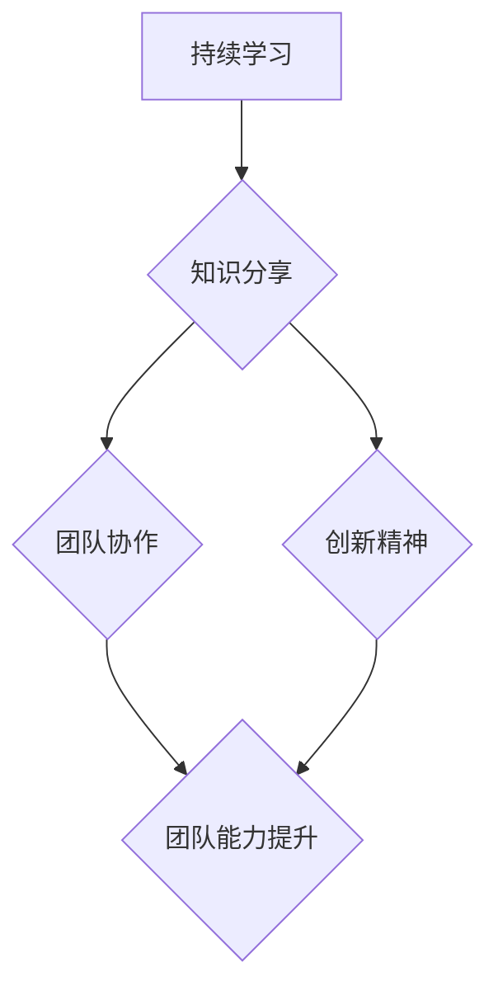
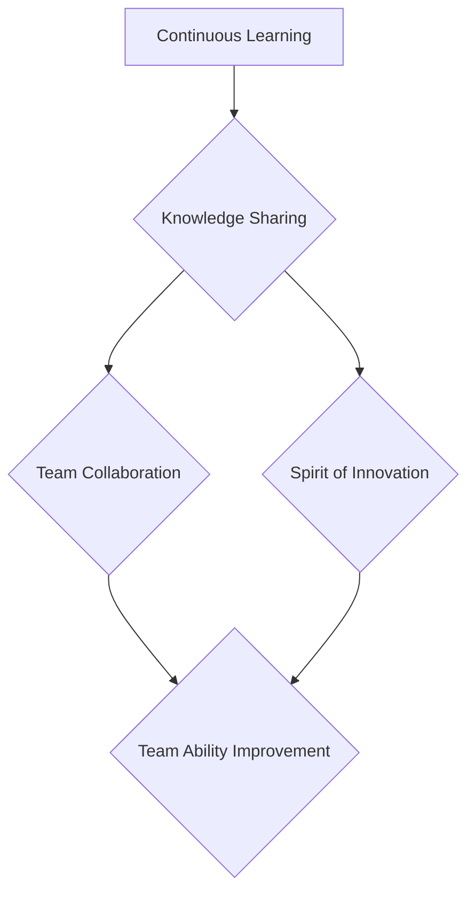

                 

### 背景介绍

**“学习型领导：培养终身成长的心态”**，这一标题首先引发了对学习与领导力之间关系的思考。在当今快速变化的世界中，技术领域的日新月异使得知识更新速度极快，传统的领导模式往往难以适应这种变化。因此，学习型领导成为了一种重要的领导模式，它强调领导者的终身学习和成长。

首先，我们要明确学习型领导的概念。学习型领导是指那些不仅自己不断学习，还能够激励和引导团队成员一起学习的领导者。这种领导模式的核心在于持续学习、不断创新和勇于面对挑战。学习型领导不仅关注个人成长，更注重团队整体的能力提升。

那么，为什么学习型领导对于IT领域尤为重要呢？IT行业是一个知识密集型的行业，技术创新速度极快，新技术层出不穷。要想在这个领域中保持竞争力，领导者必须具备快速学习新知识、新技能的能力，同时还要能够带动团队一起成长。

本文将分为以下几个部分进行探讨：

1. **核心概念与联系**：我们将详细介绍学习型领导的相关概念，并使用Mermaid流程图展示其架构。
2. **核心算法原理 & 具体操作步骤**：本文将深入探讨学习型领导的具体操作步骤，帮助领导者将这一理念付诸实践。
3. **数学模型和公式 & 详细讲解 & 举例说明**：我们将介绍相关的数学模型和公式，并通过实际案例进行详细讲解。
4. **项目实战：代码实际案例和详细解释说明**：通过一个实际项目案例，我们将展示学习型领导在具体项目中的应用。
5. **实际应用场景**：本文将探讨学习型领导在不同IT场景中的应用。
6. **工具和资源推荐**：我们将推荐一些有助于学习型领导培养的学习资源和工具。
7. **总结：未来发展趋势与挑战**：最后，本文将对学习型领导的发展趋势和挑战进行展望。

现在，让我们开始详细探讨学习型领导的核心概念和联系。

## 1. 核心概念与联系

### 学习型领导：定义与核心要素

学习型领导（Learning Leadership）源于学习型组织（Learning Organization）的概念。学习型组织是由彼得·圣吉（Peter Senge）在《第五项修炼》（The Fifth Discipline）一书中首次提出的。学习型领导则是学习型组织中的核心要素之一，它强调领导者的学习能力和成长心态。

学习型领导的定义可以概括为：领导者通过终身学习、知识分享、团队协作和创新，推动个人和团队不断进步和成长。学习型领导的核心要素包括：

- **持续学习**：领导者需要具备持续学习的意识和能力，不断吸收新知识、新技能。
- **知识分享**：领导者不仅自己学习，还善于将所学知识分享给团队成员，促进团队整体能力的提升。
- **团队协作**：学习型领导强调团队协作，通过共同学习和创新，实现团队目标。
- **创新精神**：领导者需要有创新精神，勇于尝试新方法、新技术，不断推动组织进步。

### 学习型领导与IT领域的联系

在IT领域，学习型领导显得尤为重要。原因如下：

- **技术更新速度快**：IT行业是一个知识密集型的行业，技术创新速度极快。领导者如果不具备快速学习新知识、新技能的能力，很容易被淘汰。
- **团队协作需求高**：IT项目通常需要多部门、多团队的合作。学习型领导能够促进团队协作，提高项目成功率。
- **创新能力至关重要**：IT行业竞争激烈，创新能力是企业的核心竞争力。学习型领导能够带动团队创新，推动技术进步。

### Mermaid流程图：学习型领导架构

为了更直观地展示学习型领导的架构，我们使用Mermaid流程图进行说明。以下是学习型领导架构的Mermaid流程图：

在这个流程图中，持续学习是学习型领导的基础。知识分享、团队协作和创新精神是持续学习的外延，它们共同作用于团队能力提升，实现学习型领导的最终目标。

### 总结

学习型领导是一种强调终身学习、知识分享、团队协作和创新精神的领导模式。在IT领域，学习型领导尤为重要，因为它能够帮助领导者适应快速变化的技术环境，提高团队协作能力，推动技术创新。接下来，我们将深入探讨学习型领导的核心算法原理和具体操作步骤。

---

### Core Concepts and Relationships

### Definition and Core Elements of Learning Leadership

Learning leadership originates from the concept of the learning organization, which was first proposed by Peter Senge in his book "The Fifth Discipline". Learning leadership refers to leaders who not only continuously learn and grow themselves but also inspire and guide their teams to learn and grow together. The core of learning leadership lies in the continuous learning, innovation, and willingness to face challenges, focusing not only on individual growth but also on the overall improvement of the team.

The definition of learning leadership can be summarized as follows: leaders who engage in lifelong learning, knowledge sharing, team collaboration, and innovation to drive individual and team progress and growth. The core elements of learning leadership include:

- **Continuous Learning**: Leaders need to have a sense of continuous learning and the ability to absorb new knowledge and skills.
- **Knowledge Sharing**: Leaders not only learn for themselves but also share what they have learned with their team members, promoting the overall improvement of the team.
- **Team Collaboration**: Learning leadership emphasizes team collaboration, achieving team goals through collective learning and innovation.
- **Spirit of Innovation**: Leaders need to have an innovative spirit, willing to try new methods and technologies to continuously drive organizational progress.

### The Connection between Learning Leadership and the IT Field

In the IT field, learning leadership is particularly important due to the following reasons:

- **Fast-paced Technological Updates**: The IT industry is a knowledge-intensive field where technological innovation progresses rapidly. Leaders without the ability to quickly learn new knowledge and skills may easily become obsolete.
- **High Demand for Team Collaboration**: IT projects often require collaboration across multiple departments and teams. Learning leadership can promote team collaboration, improving the success rate of projects.
- **Critical Importance of Innovation**: The IT industry is highly competitive, and innovation is a critical competitive advantage for enterprises. Learning leadership can drive team innovation and advance technology.

### Mermaid Flowchart: Architecture of Learning Leadership

To visualize the architecture of learning leadership more intuitively, we use a Mermaid flowchart to illustrate. Here is the Mermaid flowchart of the learning leadership architecture:

In this flowchart, continuous learning is the foundation of learning leadership. Knowledge sharing, team collaboration, and the spirit of innovation are extensions of continuous learning, working together to improve team abilities and achieve the ultimate goal of learning leadership.

### Summary

Learning leadership is a leadership model that emphasizes lifelong learning, knowledge sharing, team collaboration, and the spirit of innovation. It is particularly important in the IT field because it helps leaders adapt to the fast-changing technological environment, improve team collaboration, and drive technological innovation. In the next section, we will delve into the core algorithm principles and specific operational steps of learning leadership.

---

### 核心算法原理 & 具体操作步骤

学习型领导作为一种领导模式，其核心在于如何有效地实施。以下是学习型领导的核心算法原理和具体操作步骤：

#### 1. 持续学习

持续学习是学习型领导的基础。以下是具体操作步骤：

- **设定学习目标**：领导者需要明确自己的学习目标，这些目标应当与组织的发展战略相一致。
- **时间管理**：领导者需要合理安排时间，确保有足够的时间用于学习。
- **资源获取**：领导者应积极寻找和利用各种学习资源，如书籍、网络课程、研讨会等。
- **实践应用**：学习不应停留在理论层面，领导者需要将所学知识应用到实际工作中。

#### 2. 知识分享

知识分享是学习型领导的重要环节。以下是具体操作步骤：

- **建立分享机制**：领导者需要建立有效的知识分享机制，如定期分享会、内部培训等。
- **促进团队合作**：知识分享应促进团队合作，通过团队合作解决复杂问题。
- **鼓励知识创造**：领导者应鼓励团队成员创造新知识，并将其分享给团队。

#### 3. 团队协作

团队协作是学习型领导的关键。以下是具体操作步骤：

- **构建学习型团队**：领导者需要构建一个学习型团队，团队成员之间相互学习、相互支持。
- **明确团队目标**：领导者应明确团队目标，确保团队成员共同为一个目标努力。
- **沟通与反馈**：领导者需要与团队成员保持有效沟通，及时给予反馈，帮助团队成员改进。

#### 4. 创新精神

创新精神是学习型领导的核心。以下是具体操作步骤：

- **鼓励创新思维**：领导者应鼓励团队成员敢于尝试新思路、新方法。
- **提供创新支持**：领导者需要为团队成员提供创新所需的资源和支持。
- **创新成果分享**：领导者应鼓励团队成员分享创新成果，促进团队整体进步。

#### 5. 质量控制

质量控制是学习型领导的一个重要方面。以下是具体操作步骤：

- **设定质量标准**：领导者需要明确质量标准，确保团队成员在工作中遵循这些标准。
- **监控质量**：领导者应定期监控工作质量，及时发现和解决问题。
- **持续改进**：领导者应鼓励团队成员持续改进工作质量，不断提高。

#### 6. 绩效评估

绩效评估是学习型领导的一个关键环节。以下是具体操作步骤：

- **设定绩效指标**：领导者需要设定明确的绩效指标，以评估团队成员的表现。
- **定期评估**：领导者应定期对团队成员进行绩效评估，确保评估的公正性和透明度。
- **反馈与激励**：领导者应给予绩效优异的团队成员适当的反馈和激励，鼓励团队整体进步。

#### 7. 适应变化

适应变化是学习型领导的一个重要原则。以下是具体操作步骤：

- **预测变化**：领导者需要具备预测变化的能力，提前为可能的变化做好准备。
- **灵活调整**：领导者应灵活调整领导策略，以适应环境变化。
- **持续监控**：领导者需要持续监控环境变化，及时调整领导策略。

### 总结

学习型领导的核心算法原理和具体操作步骤主要包括持续学习、知识分享、团队协作、创新精神、质量控制、绩效评估和适应变化。通过这些步骤，领导者能够有效地培养团队的学习能力和创新精神，推动组织持续进步。

---

### Core Algorithm Principles & Specific Operational Steps

The core of learning leadership lies in its effective implementation. Here are the core algorithm principles and specific operational steps of learning leadership:

#### 1. Continuous Learning

Continuous learning is the foundation of learning leadership. Here are the specific operational steps:

- **Set Learning Goals**: Leaders need to clearly define their learning goals, which should align with the strategic development of the organization.
- **Time Management**: Leaders need to allocate their time effectively to ensure enough time for learning.
- **Resource Acquisition**: Leaders should actively seek and utilize various learning resources, such as books, online courses, seminars, etc.
- **Practical Application**: Learning should not stop at the theoretical level; leaders need to apply what they have learned in their actual work.

#### 2. Knowledge Sharing

Knowledge sharing is a crucial aspect of learning leadership. Here are the specific operational steps:

- **Establish Sharing Mechanisms**: Leaders need to establish effective knowledge sharing mechanisms, such as regular sharing sessions and internal training.
- **Promote Team Collaboration**: Knowledge sharing should promote team collaboration, solving complex problems through teamwork.
- **Encourage Knowledge Creation**: Leaders should encourage team members to create new knowledge and share it with the team.

#### 3. Team Collaboration

Team collaboration is a key element of learning leadership. Here are the specific operational steps:

- **Build a Learning Team**: Leaders need to build a learning team where team members learn from and support each other.
- **Clarify Team Goals**: Leaders should clearly define team goals, ensuring that team members work together towards a common goal.
- **Communication and Feedback**: Leaders need to maintain effective communication with team members and provide timely feedback to help team members improve.

#### 4. Spirit of Innovation

The spirit of innovation is the core of learning leadership. Here are the specific operational steps:

- **Encourage Innovative Thinking**: Leaders should encourage team members to think creatively and try new ideas and methods.
- **Provide Innovation Support**: Leaders need to provide the resources and support needed for innovation.
- **Share Innovation Results**: Leaders should encourage team members to share the results of their innovations, promoting overall progress in the team.

#### 5. Quality Control

Quality control is an important aspect of learning leadership. Here are the specific operational steps:

- **Set Quality Standards**: Leaders need to clearly define quality standards to ensure that team members follow these standards in their work.
- **Monitor Quality**: Leaders should regularly monitor the quality of work to promptly identify and solve problems.
- **Continuous Improvement**: Leaders should encourage team members to continuously improve the quality of their work.

#### 6. Performance Evaluation

Performance evaluation is a key step in learning leadership. Here are the specific operational steps:

- **Set Performance Indicators**: Leaders need to set clear performance indicators to evaluate the performance of team members.
- **Regular Evaluation**: Leaders should regularly evaluate team members to ensure the fairness and transparency of the evaluation.
- **Feedback and Incentives**: Leaders should provide appropriate feedback and incentives to team members who perform well, encouraging overall progress in the team.

#### 7. Adapt to Changes

Adapting to changes is an important principle of learning leadership. Here are the specific operational steps:

- **Predict Changes**: Leaders need to have the ability to predict changes and prepare for them in advance.
- **Flexibly Adjust**: Leaders should flexibly adjust their leadership strategies to adapt to changes.
- **Continuous Monitoring**: Leaders need to continuously monitor changes in the environment and adjust their strategies accordingly.

### Summary

The core algorithm principles and specific operational steps of learning leadership include continuous learning, knowledge sharing, team collaboration, the spirit of innovation, quality control, performance evaluation, and adapting to changes. Through these steps, leaders can effectively cultivate the learning abilities and innovative spirit of their teams, driving continuous progress in the organization.

