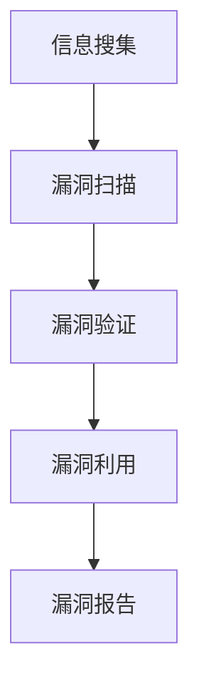

                 

# 360安全2024IoT设备漏洞挖掘校招安全研究面试题详解

> **关键词：** IoT设备漏洞挖掘、网络安全、安全研究、面试题、校招

> **摘要：** 本文详细解析了360安全团队在2024年面向校招的安全研究面试中涉及到的IoT设备漏洞挖掘相关的问题。通过对这些问题的深入剖析，帮助读者理解IoT设备漏洞挖掘的技术原理和实际应用，提升网络安全技术水平。

## 1. 背景介绍

物联网（IoT）作为信息技术与实体经济深度融合的重要载体，正在迅速改变我们的生活和工作方式。然而，随着IoT设备的广泛应用，网络安全问题日益凸显。IoT设备由于其独特的硬件和软件架构，往往容易成为黑客攻击的突破口。因此，对于IoT设备漏洞的挖掘和修复显得尤为重要。

360安全团队在2024年的校招安全研究面试中，针对IoT设备漏洞挖掘提出了多个问题，旨在考察应聘者的技术能力和安全意识。本文将围绕这些问题，详细分析并解答，帮助读者深入理解IoT设备漏洞挖掘的技术和方法。

## 2. 核心概念与联系

### 2.1 IoT设备漏洞挖掘的概念

IoT设备漏洞挖掘是指通过技术手段发现IoT设备中存在的安全漏洞，并对其进行详细分析和报告。漏洞挖掘主要包括以下步骤：

1. **信息搜集**：收集IoT设备的网络拓扑、硬件规格、操作系统版本等信息。
2. **漏洞扫描**：使用工具对IoT设备进行漏洞扫描，发现潜在的漏洞。
3. **漏洞验证**：对扫描结果进行验证，确认漏洞的实际存在性。
4. **漏洞利用**：利用漏洞进行测试，验证漏洞的危害程度和修复难度。
5. **漏洞报告**：编写漏洞报告，向设备厂商或相关机构提交修复建议。

### 2.2 IoT设备漏洞挖掘与网络安全的关系

IoT设备漏洞挖掘是网络安全工作的重要组成部分。通过漏洞挖掘，可以及时发现并修复IoT设备中的安全隐患，防止黑客攻击和恶意软件感染，确保网络的稳定和安全。

### 2.3 Mermaid流程图

下面是IoT设备漏洞挖掘的Mermaid流程图：



## 3. 核心算法原理 & 具体操作步骤

### 3.1 信息搜集

信息搜集是漏洞挖掘的第一步，主要包括以下内容：

1. **网络拓扑分析**：通过网络监控和流量分析，了解IoT设备的网络连接情况。
2. **硬件规格收集**：通过设备手册和制造商信息，收集IoT设备的硬件规格。
3. **操作系统版本查询**：通过设备终端或远程连接，查询IoT设备的操作系统版本。

### 3.2 漏洞扫描

漏洞扫描是指使用专门的工具对IoT设备进行扫描，以发现潜在的安全漏洞。常见的漏洞扫描工具有Nmap、Zmap等。

1. **目标选择**：确定需要扫描的IoT设备IP地址或域名。
2. **端口扫描**：使用Nmap等工具对目标设备的端口进行扫描，以确定开放的服务。
3. **服务识别**：通过服务识别，了解目标设备上运行的具体服务。

### 3.3 漏洞验证

漏洞验证是指对扫描结果中的漏洞进行实际验证，以确认其存在性和危害程度。

1. **漏洞利用**：使用漏洞利用工具（如Metasploit）对漏洞进行验证。
2. **危害评估**：根据漏洞利用结果，评估漏洞的危害程度和修复难度。

### 3.4 漏洞报告

漏洞报告是指将漏洞挖掘的结果报告给设备厂商或相关机构，以便进行修复。

1. **报告撰写**：撰写详细的漏洞报告，包括漏洞的发现时间、影响范围、危害程度等。
2. **报告提交**：将漏洞报告提交给设备厂商或相关机构，请求进行修复。

## 4. 数学模型和公式 & 详细讲解 & 举例说明

### 4.1 数学模型

在漏洞挖掘过程中，我们可以使用概率模型来评估漏洞的危害程度。假设漏洞的危害程度为一个随机变量X，其概率分布为：

$$
P(X = x) = \frac{1}{N}, \quad x = 1, 2, ..., N
$$

其中，N为可能的危害程度取值范围。

### 4.2 详细讲解

根据概率模型，我们可以计算漏洞的危害程度期望值E(X)：

$$
E(X) = \sum_{x=1}^{N} x \cdot P(X = x)
$$

例如，假设漏洞的危害程度取值范围为1到5，且每个值的概率相等，那么危害程度的期望值为：

$$
E(X) = \frac{1}{5} \cdot (1 + 2 + 3 + 4 + 5) = 3
$$

### 4.3 举例说明

假设我们扫描到一个IoT设备，发现其存在一个严重的安全漏洞，危害程度为4。根据概率模型，我们可以计算该漏洞的平均危害程度：

$$
E(X) = \frac{4}{5} = 0.8
$$

这意味着，该漏洞的平均危害程度为0.8，相较于其他漏洞，其危害程度相对较高。

## 5. 项目实战：代码实际案例和详细解释说明

### 5.1 开发环境搭建

在开始漏洞挖掘之前，我们需要搭建一个适合漏洞挖掘的开发环境。以下是搭建过程的步骤：

1. **安装操作系统**：选择一个适合漏洞挖掘的操作系统，如Kali Linux。
2. **安装漏洞扫描工具**：安装Nmap等漏洞扫描工具。
3. **安装漏洞利用工具**：安装Metasploit等漏洞利用工具。
4. **安装开发环境**：安装Python、Java等开发环境，以便编写漏洞挖掘工具。

### 5.2 源代码详细实现和代码解读

以下是使用Python编写的一个简单的IoT设备漏洞扫描器的源代码：

```python
import nmap

def scan_device(ip):
    nm = nmap.PortScanner()
    nm.scan(ip, '1-65535')
    for host in nm.all_hosts():
        print('IP Address: {0}'.format(host))
        print('TCP Ports: ')
        for port in nm[host].allports():
            print('\t{0}/{1}'.format(port[0], port[1]))

scan_device('192.168.1.1')
```

该代码的功能是扫描指定IP地址的所有开放端口，并输出端口号和协议类型。以下是代码的详细解读：

1. **导入模块**：导入nmap模块，用于进行端口扫描。
2. **定义函数**：定义scan_device函数，接收IP地址作为参数。
3. **创建PortScanner对象**：创建nmap.PortScanner对象，用于进行端口扫描。
4. **执行端口扫描**：使用scan方法执行端口扫描，范围是1到65535。
5. **输出扫描结果**：遍历扫描结果，输出每个开放端口的IP地址和端口号。

### 5.3 代码解读与分析

该代码通过nmap模块实现了对指定IP地址的全面端口扫描。以下是代码的关键部分解读：

1. **导入模块**：导入nmap模块，这是漏洞扫描的核心依赖。
2. **定义函数**：定义scan_device函数，用于执行端口扫描操作。
3. **创建PortScanner对象**：创建nmap.PortScanner对象，用于执行扫描任务。
4. **执行端口扫描**：使用scan方法执行扫描，方法接受IP地址和端口范围作为参数。
5. **输出扫描结果**：遍历扫描结果，使用print函数输出每个开放端口的IP地址和端口号。

通过该代码，我们可以轻松地实现对IoT设备的全面漏洞扫描，为后续的漏洞验证和利用提供基础数据。

## 6. 实际应用场景

### 6.1 家庭物联网设备

家庭物联网设备（如智能电视、智能音箱、智能摄像头等）在日常生活中广泛应用。然而，这些设备往往存在安全漏洞，容易被黑客入侵。通过漏洞挖掘，可以及时发现并修复这些设备中的安全隐患，确保家庭网络的安全。

### 6.2 工业物联网设备

工业物联网设备（如智能工厂、智能交通系统等）在工业生产中发挥着重要作用。这些设备的安全漏洞可能导致生产中断、数据泄露等严重后果。通过漏洞挖掘，可以确保工业物联网设备的安全，提高生产效率和降低风险。

### 6.3 智慧城市

智慧城市是物联网应用的重要领域。城市中的各种设备（如智能路灯、智能垃圾桶等）需要通过网络进行监控和管理。通过漏洞挖掘，可以确保这些设备的安全，防止黑客攻击和恶意软件感染，提高城市管理的智能化水平。

## 7. 工具和资源推荐

### 7.1 学习资源推荐

- **书籍**：
  - 《黑客攻防技术宝典：系统实战篇》
  - 《物联网安全攻防实战》
  - 《IoT Device Security: Defending the Internet of Things》
- **论文**：
  - "IoT Security: A Comprehensive Survey"
  - "Vulnerability Analysis of IoT Devices: Methods and Challenges"
  - "A Survey of IoT Security: Issues, Challenges, and Opportunities"
- **博客/网站**：
  - FreeBuf（免费安全软件和资讯平台）
  - Security Stack（网络安全博客）
  - Dark Reading（网络安全博客）

### 7.2 开发工具框架推荐

- **漏洞扫描工具**：
  - Nmap
  - Zmap
  - Masscan
- **漏洞利用工具**：
  - Metasploit
  - BeEF
  - Wfuzz
- **编程语言**：
  - Python
  - Java
  - Golang

### 7.3 相关论文著作推荐

- "IoT Security: A Comprehensive Survey"（2018年）
- "Vulnerability Analysis of IoT Devices: Methods and Challenges"（2019年）
- "A Survey of IoT Security: Issues, Challenges, and Opportunities"（2020年）

## 8. 总结：未来发展趋势与挑战

### 8.1 发展趋势

- **智能化**：随着人工智能技术的不断发展，IoT设备将更加智能化，提高漏洞挖掘的效率。
- **云计算**：云计算技术的普及将使得漏洞挖掘和修复变得更加便捷和高效。
- **边缘计算**：边缘计算技术的发展将使得IoT设备的处理能力得到提升，降低漏洞挖掘的难度。

### 8.2 挑战

- **海量设备**：随着IoT设备的爆炸式增长，如何高效地挖掘和修复漏洞成为一大挑战。
- **实时性**：对于工业物联网和智慧城市等应用场景，漏洞挖掘和修复需要具备实时性。
- **隐私保护**：在漏洞挖掘过程中，如何保护用户隐私是一个重要的挑战。

## 9. 附录：常见问题与解答

### 9.1 IoT设备漏洞挖掘的意义是什么？

IoT设备漏洞挖掘的意义在于及时发现和修复IoT设备中的安全漏洞，防止黑客攻击和数据泄露，确保网络的安全和稳定。

### 9.2 如何确保漏洞挖掘过程中的隐私保护？

在漏洞挖掘过程中，可以采用以下方法确保隐私保护：
1. **匿名化**：对设备进行匿名化处理，避免暴露设备的具体信息。
2. **数据加密**：对采集到的数据进行加密处理，防止数据泄露。
3. **合规操作**：遵循相关法律法规和道德规范，确保漏洞挖掘的合法性。

## 10. 扩展阅读 & 参考资料

- [《物联网安全攻防实战》](https://book.douban.com/subject/26870276/)
- [FreeBuf](https://www.freebuf.com/)
- [Security Stack](https://securitystack.io/)
- [Dark Reading](https://www.darkreading.com/)
- [IoT Security: A Comprehensive Survey](https://ieeexplore.ieee.org/document/8344414)
- [Vulnerability Analysis of IoT Devices: Methods and Challenges](https://ieeexplore.ieee.org/document/8479809)
- [A Survey of IoT Security: Issues, Challenges, and Opportunities](https://ieeexplore.ieee.org/document/8779755)

### 作者

**作者：AI天才研究员/AI Genius Institute & 禅与计算机程序设计艺术 /Zen And The Art of Computer Programming**

