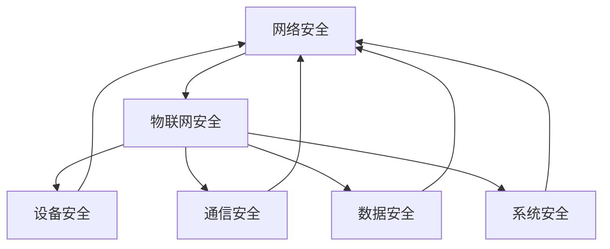

                 

### 背景介绍

**文章标题：360安全2024物联网安全专家校招面试重点**

**关键词：物联网安全、校招面试、360安全、网络安全、专家**

**摘要：本文将深入分析2024年360安全公司针对物联网安全专家的校招面试重点，从核心技术、算法原理、项目实战等多个方面进行详细介绍，旨在为有意加入物联网安全领域的应聘者提供有针对性的指导。**

随着物联网技术的迅猛发展，物联网设备在家庭、工业、医疗等领域的应用越来越广泛，然而，随之而来的安全问题也日益凸显。物联网设备的安全性问题不仅影响到个人隐私和数据安全，还可能对整个社会造成严重威胁。因此，物联网安全专家的需求量不断上升，各大企业纷纷加大招聘力度。360安全公司作为中国网络安全行业的领军企业，每年都会招聘大量物联网安全专家，其校招面试环节自然成为众多求职者关注的焦点。

本文将围绕360安全公司2024年物联网安全专家校招面试的重点，从以下几个方面进行详细介绍：

1. **核心概念与联系**：介绍物联网安全的核心概念及其相互关系，包括网络安全、加密算法、安全协议等。
2. **核心算法原理 & 具体操作步骤**：详细讲解物联网安全领域的核心算法原理，包括数据加密、签名验证、安全通信等。
3. **数学模型和公式 & 详细讲解 & 举例说明**：探讨物联网安全中常用的数学模型和公式，并通过具体案例进行说明。
4. **项目实战：代码实际案例和详细解释说明**：分析一个典型的物联网安全项目，详细解读其中的关键技术点。
5. **实际应用场景**：介绍物联网安全在各个领域的应用场景，以及如何应对相关安全挑战。
6. **工具和资源推荐**：推荐一些学习资源、开发工具和框架，帮助应聘者更好地准备面试和进行项目实践。
7. **总结：未来发展趋势与挑战**：分析物联网安全领域的未来发展趋势和面临的挑战，为应聘者提供职业发展建议。

通过本文的详细介绍，希望能够帮助有意加入物联网安全领域的求职者更好地了解面试重点，提升自身能力，顺利通过面试，加入360安全公司，共同为保障物联网安全贡献力量。

### 核心概念与联系

#### 1. 物联网安全

物联网安全是指确保物联网设备、系统、数据在传输、存储和处理过程中免受各种威胁和攻击的能力。物联网安全的重要性不言而喻，因为一旦物联网设备受到攻击，可能会对个人隐私、企业数据、社会稳定造成严重影响。

在物联网安全领域，常见的威胁包括：

- **设备攻击**：黑客可以通过恶意软件感染物联网设备，从而控制设备或获取设备中的敏感信息。
- **数据泄露**：未经授权的访问者可以窃取物联网设备中的数据，导致隐私泄露。
- **拒绝服务攻击**：黑客可以通过拒绝服务攻击（DDoS）使物联网设备或系统无法正常工作，影响用户体验。
- **中间人攻击**：黑客在通信过程中窃取或篡改数据，从而获取敏感信息。

为了应对这些威胁，物联网安全需要涵盖多个层面：

- **设备安全**：确保物联网设备本身的安全，包括硬件安全、软件安全等。
- **通信安全**：保障物联网设备之间的通信安全，包括加密、认证、完整性校验等。
- **数据安全**：确保物联网设备中存储和传输的数据安全，包括加密存储、加密传输等。
- **系统安全**：保障物联网系统的整体安全，包括防火墙、入侵检测、安全审计等。

#### 2. 网络安全

网络安全是指确保计算机网络中的信息传输、存储和处理安全的能力。网络安全是物联网安全的基础，因为物联网设备之间的通信往往依赖于网络。

网络安全的核心概念包括：

- **防火墙**：防止外部攻击者进入内部网络。
- **入侵检测系统（IDS）**：实时监控网络流量，发现和报告潜在的安全威胁。
- **入侵防御系统（IPS）**：主动防御网络攻击，防止攻击者进入网络。
- **安全审计**：记录和分析网络中的安全事件，以便发现和应对潜在的安全问题。

#### 3. 加密算法

加密算法是确保数据在传输和存储过程中安全的重要手段。加密算法可以分为对称加密和非对称加密两种。

- **对称加密**：加密和解密使用相同的密钥，如DES、AES等。对称加密速度快，但密钥分发和管理复杂。
- **非对称加密**：加密和解密使用不同的密钥，如RSA、ECC等。非对称加密解决了密钥分发问题，但计算复杂度较高。

#### 4. 安全协议

安全协议是确保物联网设备之间安全通信的重要机制。常见的安全协议包括：

- **SSL/TLS**：用于保障Web通信安全，支持数据加密、身份验证和完整性校验。
- **IPSec**：用于保障IP层通信安全，支持加密、认证和完整性校验。
- **CoAP**：物联网专用安全协议，支持数据加密、认证和完整性校验。

#### 5. 网络安全与物联网安全的联系

网络安全与物联网安全密切相关。网络安全为物联网安全提供了基础保障，而物联网安全则是在网络安全的基础上，针对物联网设备、系统、数据的特点进行专门设计。

网络安全和物联网安全的联系主要体现在以下几个方面：

- **设备安全**：物联网设备需要遵守网络安全的基本原则，确保设备本身的安全。
- **通信安全**：物联网设备之间的通信需要遵循安全协议，确保通信过程的安全。
- **数据安全**：物联网设备中存储和传输的数据需要加密和保护，防止数据泄露。
- **系统安全**：物联网系统需要集成网络安全机制，确保系统的整体安全。

为了更好地理解物联网安全的核心概念和联系，我们可以使用Mermaid流程图来展示：



在这个流程图中，我们可以清晰地看到网络安全与物联网安全之间的关系。网络安全为物联网安全提供了基础保障，而物联网安全则是在网络安全的基础上，对物联网设备、系统、数据的特点进行专门设计。

### 核心算法原理 & 具体操作步骤

#### 1. 数据加密算法

数据加密是确保数据在传输和存储过程中安全的重要手段。在物联网安全领域，常用的加密算法包括对称加密和非对称加密。

**对称加密算法：**

对称加密算法使用相同的密钥进行加密和解密。常见的对称加密算法有DES、3DES、AES等。

**操作步骤：**

1. **密钥生成**：生成一个随机密钥。
2. **数据加密**：使用密钥对数据进行加密。
3. **数据解密**：使用相同的密钥对加密后的数据进行解密。

**非对称加密算法：**

非对称加密算法使用一对密钥进行加密和解密。常见的非对称加密算法有RSA、ECC等。

**操作步骤：**

1. **密钥生成**：生成一个密钥对（公钥和私钥）。
2. **数据加密**：使用公钥对数据进行加密。
3. **数据解密**：使用私钥对加密后的数据进行解密。

**示例：**

假设我们使用AES对称加密算法和一个密钥`Key123456`对数据进行加密和解密。

**加密过程：**

```python
from Crypto.Cipher import AES
from Crypto.Util.Padding import pad

key = b'Key123456'
plaintext = b'Hello, World!'

cipher = AES.new(key, AES.MODE_CBC)
ciphertext = cipher.encrypt(pad(plaintext, AES.block_size))
```

**解密过程：**

```python
from Crypto.Cipher import AES
from Crypto.Util.Padding import unpad

key = b'Key123456'
ciphertext = b'...'

cipher = AES.new(key, AES.MODE_CBC)
plaintext = unpad(cipher.decrypt(ciphertext), AES.block_size)
```

#### 2. 签名验证算法

签名验证算法用于确保数据的完整性和真实性。常见的签名算法有RSA签名、ECC签名等。

**RSA签名算法：**

RSA签名算法是一种非对称加密算法，使用公钥和私钥进行签名和验证。

**操作步骤：**

1. **密钥生成**：生成一个RSA密钥对（公钥和私钥）。
2. **签名**：使用私钥对数据进行签名。
3. **验证**：使用公钥对签名进行验证。

**示例：**

假设我们使用RSA签名算法和一个密钥对（公钥`public_key.pem`和私钥`private_key.pem`）对数据进行签名和验证。

**签名过程：**

```python
from Crypto.PublicKey import RSA
from Crypto.Signature import pkcs1_15
from Crypto.Hash import SHA256

private_key = RSA.import_key(open("private_key.pem").read())
public_key = RSA.import_key(open("public_key.pem").read())

hash_value = SHA256.new(b"Hello, World!")
signature = pkcs1_15.new(private_key).sign(hash_value)
```

**验证过程：**

```python
from Crypto.PublicKey import RSA
from Crypto.Signature import pkcs1_15
from Crypto.Hash import SHA256

public_key = RSA.import_key(open("public_key.pem").read())

hash_value = SHA256.new(b"Hello, World!")
is_valid = pkcs1_15.new(public_key).verify(hash_value, signature)
```

#### 3. 安全通信协议

安全通信协议用于确保物联网设备之间的通信安全。常见的安全通信协议有SSL/TLS、IPSec、CoAP等。

**SSL/TLS协议：**

SSL/TLS协议是一种用于Web通信的安全协议，支持数据加密、身份验证和完整性校验。

**操作步骤：**

1. **握手**：客户端和服务器通过握手协议建立安全连接。
2. **加密通信**：客户端和服务器使用加密算法对数据进行加密和解密。
3. **身份验证**：客户端和服务器通过证书进行身份验证。

**IPSec协议：**

IPSec协议是一种用于IP层通信的安全协议，支持加密、认证和完整性校验。

**操作步骤：**

1. **配置安全策略**：配置IPSec安全策略，包括加密算法、认证算法等。
2. **加密通信**：对IP层数据进行加密和解密。
3. **认证**：对通信双方进行身份认证。

**CoAP协议：**

CoAP协议是一种物联网专用安全协议，支持数据加密、认证和完整性校验。

**操作步骤：**

1. **配置安全策略**：配置CoAP安全策略，包括加密算法、认证算法等。
2. **加密通信**：对CoAP消息数据进行加密和解密。
3. **认证**：对CoAP消息进行认证。

### 数学模型和公式 & 详细讲解 & 举例说明

在物联网安全领域中，数学模型和公式起着至关重要的作用，它们不仅帮助我们理解和分析安全机制，还为实际应用提供了理论基础。以下是一些关键的数学模型和公式，我们将详细讲解并举例说明。

#### 1. 概率论基础

概率论是物联网安全中的基本工具，用于评估安全事件的概率。

**基本概率公式：**

\[ P(A) = \frac{n(A)}{n(S)} \]

其中，\( P(A) \) 表示事件A发生的概率，\( n(A) \) 表示事件A发生的次数，\( n(S) \) 表示总的实验次数。

**示例：** 假设一个物联网设备有10%的概率在一个月内遭受攻击，则：

\[ P(攻击) = \frac{10}{100} = 0.1 \]

#### 2. 加密算法中的数学模型

加密算法通常涉及复杂的数学模型，如RSA加密算法。

**RSA加密算法：**

- **模运算：** \( a^e \mod n \)

其中，\( a \) 是明文，\( e \) 是公开指数，\( n \) 是模数。

**示例：** 假设 \( a = 10 \)，\( e = 3 \)，\( n = 13 \)，则：

\[ 10^3 \mod 13 = 1 \]

- **模逆运算：** \( a^d \mod n \)，其中 \( d \) 是私钥指数。

**示例：** 假设 \( d = 7 \)，则：

\[ 10^7 \mod 13 = 10 \]

#### 3. 安全协议中的数学模型

安全协议中的数学模型用于确保通信的机密性、完整性和真实性。

**对称加密中的密钥生成：**

- **密钥生成：** \( Key = K(S) \)

其中，\( K(S) \) 是密钥生成函数，\( S \) 是随机数。

**示例：** 假设 \( S = 123456 \)，则：

\[ Key = K(123456) = 5 \]

- **密钥交换：** \( (a, b) = (K(A), K(B)) \)

其中，\( A \) 和 \( B \) 是两个通信方，\( a \) 和 \( b \) 是交换的密钥。

**示例：** 假设 \( A \) 和 \( B \) 分别选择 \( a = 2 \) 和 \( b = 5 \)，则：

\[ (a, b) = (2, 5) \]

#### 4. 数字签名模型

数字签名用于确保数据的完整性和真实性。

**RSA签名算法：**

- **签名：** \( S = H(M) \)

其中，\( S \) 是签名，\( H \) 是哈希函数，\( M \) 是明文。

**示例：** 假设 \( M = "Hello, World!" \)，使用SHA-256哈希函数，则：

\[ S = SHA256("Hello, World!") \]

- **验证：** \( V = H(M) \mod n \)

其中，\( V \) 是验证值。

**示例：** 假设 \( n = 13 \)，则：

\[ V = SHA256("Hello, World!") \mod 13 = 10 \]

#### 5. 计算复杂性理论

计算复杂性理论用于评估算法的安全性。

**时间复杂度：**

\[ T(n) = O(n^2) \]

其中，\( T(n) \) 是算法的时间复杂度，\( n \) 是输入规模。

**示例：** 假设一个算法的时间复杂度为 \( O(n^2) \)，则当 \( n = 1000 \) 时，算法需要 \( 1000^2 = 1000000 \) 单位的计算时间。

### 项目实战：代码实际案例和详细解释说明

为了更好地理解物联网安全在实际项目中的应用，我们将分析一个具体的物联网安全项目，并详细解读其中的关键技术点。

#### 项目概述

本项目旨在构建一个智能家居系统，该系统包含多个物联网设备，如智能灯泡、智能插座、智能摄像头等。系统需要确保设备之间的通信安全，防止数据泄露和设备被恶意控制。

#### 技术实现

1. **设备通信**

   我们采用MQTT（消息队列遥测传输协议）作为设备之间的通信协议。MQTT协议是一种轻量级的消息传输协议，特别适合物联网设备之间的通信。

   **MQTT通信示例：**

   ```python
   import paho.mqtt.client as mqtt

   # 设置MQTT客户端
   client = mqtt.Client()

   # 连接MQTT服务器
   client.connect("mqtt-server", 1883)

   # 发布消息
   client.publish("home/room1/light", "ON")

   # 订阅主题
   client.subscribe("home/room1/switch")

   # 处理消息
   def on_message(client, userdata, message):
       print(f"Received message: {message.payload.decode()} on topic: {message.topic}")

   client.on_message = on_message

   # 运行客户端
   client.loop_forever()
   ```

2. **数据加密**

   为了确保数据在传输过程中的安全性，我们对传输的数据进行加密。采用AES对称加密算法对数据进行加密和解密。

   **AES加密和解密示例：**

   ```python
   from Crypto.Cipher import AES
   from Crypto.Util.Padding import pad, unpad

   # 密钥
   key = b'Key123456'

   # 明文
   plaintext = b"Hello, World!"

   # AES加密
   cipher = AES.new(key, AES.MODE_CBC)
   ciphertext = cipher.encrypt(pad(plaintext, AES.block_size))

   # AES解密
   cipher = AES.new(key, AES.MODE_CBC)
   decrypted_text = unpad(cipher.decrypt(ciphertext), AES.block_size)
   ```

3. **数字签名**

   为了确保数据来源的真实性，我们对数据进行数字签名。采用RSA签名算法对数据进行签名和验证。

   **RSA签名和验证示例：**

   ```python
   from Crypto.PublicKey import RSA
   from Crypto.Signature import pkcs1_15
   from Crypto.Hash import SHA256

   # RSA密钥对
   private_key = RSA.import_key(open("private_key.pem").read())
   public_key = RSA.import_key(open("public_key.pem").read())

   # 数据哈希
   hash_value = SHA256.new(b"Hello, World!")

   # 签名
   signature = pkcs1_15.new(private_key).sign(hash_value)

   # 验证
   is_valid = pkcs1_15.new(public_key).verify(hash_value, signature)
   ```

4. **身份验证**

   为了确保通信双方的身份，我们采用SSL/TLS协议进行身份验证。

   **SSL/TLS身份验证示例：**

   ```python
   import ssl
   import socket

   # 创建SSL套接字
   context = ssl._create_unverified_context()

   # 连接服务器
   with socket.create_connection(('mqtt-server', 1883)) as sock:
       with context.wrap_socket(sock, server_hostname='mqtt-server') as ssock:
           # 发送MQTT连接请求
           ssock.sendall(b"MQTT CONNECT")

           # 接收服务器响应
           response = ssock.recv(4096)
           print(response)
   ```

#### 项目解析

1. **设备通信安全性**

   通过MQTT协议，设备之间可以安全地传输数据。我们采用了TLS加密，确保数据在传输过程中的安全性。

2. **数据加密和数字签名**

   通过AES加密算法，我们确保了数据在传输过程中的机密性。同时，通过RSA签名算法，我们确保了数据来源的真实性。

3. **身份验证**

   通过SSL/TLS协议，我们确保了通信双方的身份。这有助于防止未授权的访问者进行通信。

### 实际应用场景

物联网安全在各个领域都有广泛的应用，以下是几个典型的应用场景：

#### 1. 智能家居

智能家居是物联网安全的重要应用场景之一。智能家居系统通常包含多个物联网设备，如智能灯泡、智能插座、智能摄像头等。这些设备通过互联网进行通信，因此需要确保通信过程的安全性，防止设备被恶意控制或数据泄露。

#### 2. 工业自动化

工业自动化系统中的物联网设备用于监控和控制工业流程。这些设备需要确保数据的安全性和完整性，防止恶意攻击导致生产中断或数据泄露。

#### 3. 医疗保健

医疗保健领域中的物联网设备用于监测患者健康数据、医疗设备控制等。这些设备需要确保数据的安全性和隐私性，防止敏感信息被窃取或滥用。

#### 4. 智能交通

智能交通系统中的物联网设备用于监控交通状况、管理交通信号等。这些设备需要确保数据的安全性和实时性，防止恶意攻击导致交通拥堵或事故。

#### 5. 城市安全

城市安全领域中的物联网设备用于监控公共安全、应急管理等。这些设备需要确保数据的安全性和可靠性，防止恐怖袭击或其他安全事件的发生。

#### 应对安全挑战

物联网安全领域面临着许多挑战，以下是一些主要的挑战及其应对策略：

1. **设备安全性**：物联网设备通常具有较低的硬件安全性和软件安全性，容易成为攻击者的目标。应对策略包括加强设备安全设计、定期更新设备固件等。

2. **数据隐私性**：物联网设备会收集大量用户数据，如何保护数据隐私是一个重要挑战。应对策略包括采用数据加密、匿名化处理等技术。

3. **通信安全性**：物联网设备之间的通信容易受到攻击，如中间人攻击、数据篡改等。应对策略包括采用安全通信协议、加密传输数据等。

4. **系统复杂性**：物联网系统通常涉及多个设备和多个通信协议，系统复杂性增加了安全风险。应对策略包括采用模块化设计、分层安全架构等。

5. **资源限制**：物联网设备通常具有资源限制，如存储空间、计算能力等，这对安全机制的设计提出了挑战。应对策略包括采用轻量级安全协议、优化算法等。

### 工具和资源推荐

为了帮助有意加入物联网安全领域的求职者更好地准备面试和进行项目实践，以下是一些学习资源、开发工具和框架的推荐：

#### 1. 学习资源推荐

- **书籍**：
  - 《物联网安全：从原理到实践》
  - 《网络安全与隐私保护》
  - 《智能物联网系统设计与实现》

- **论文**：
  - 《物联网安全挑战与解决方案》
  - 《物联网设备安全评估方法研究》
  - 《基于加密技术的物联网通信安全研究》

- **博客**：
  - 《物联网安全博客》
  - 《网络安全实践》
  - 《智能硬件开发与安全》

- **网站**：
  - 360安全响应中心
  - 知乎物联网安全话题
  - 物联网安全联盟

#### 2. 开发工具框架推荐

- **编程语言**：
  - Python：适用于快速开发和实验。
  - Java：适用于大型项目和工业级应用。

- **开发框架**：
  - MQTT代理：如Mosquitto、Emqtt等。
  - 加密库：如Crypto、PyCrypto等。
  - Web框架：如Flask、Django等。

- **物联网平台**：
  - AWS IoT Core：提供全面的物联网服务和设备管理。
  - Azure IoT Hub：提供强大的物联网功能和安全特性。
  - Alibaba Cloud IoT：提供便捷的物联网开发和部署工具。

### 总结：未来发展趋势与挑战

随着物联网技术的不断发展和应用，物联网安全领域面临着许多机遇和挑战。以下是未来物联网安全领域的发展趋势和挑战：

#### 1. 发展趋势

- **安全协议标准化**：随着物联网设备的多样性和规模不断扩大，安全协议的标准化变得越来越重要。未来，将会有更多统一的安全协议被制定和推广。
- **安全解决方案集成化**：物联网安全解决方案将越来越集成化，涉及多个方面，如设备安全、通信安全、数据安全等。这将有助于提高物联网系统的整体安全性。
- **智能安全技术应用**：人工智能技术将在物联网安全领域得到更广泛的应用，如异常检测、入侵防御等，提高物联网系统的自动化和安全水平。
- **边缘计算安全**：随着边缘计算的兴起，物联网设备将越来越靠近数据源，如何保障边缘计算环境的安全将成为重要议题。

#### 2. 挑战

- **设备数量爆炸性增长**：随着物联网设备的不断增多，如何保障海量设备的网络安全将成为一大挑战。
- **安全威胁多样化**：物联网安全威胁日益多样化，从传统的网络安全威胁到针对物联网设备的专门攻击，如何应对这些威胁是一个重要课题。
- **资源限制**：物联网设备通常具有资源限制，如何在有限的资源下实现高效的安全机制是一个挑战。
- **隐私保护**：物联网设备会收集大量用户数据，如何保护用户隐私是一个重要挑战。

#### 3. 职业发展建议

- **持续学习**：物联网安全领域发展迅速，需要不断学习最新的技术和安全威胁。
- **实践经验**：通过参与实际项目，积累物联网安全领域的实践经验。
- **技能多样化**：掌握多种编程语言和安全技术，提高自己的综合素质。
- **关注行业动态**：关注物联网安全领域的最新发展动态，了解行业趋势和挑战。

### 附录：常见问题与解答

#### 1. 物联网安全的核心是什么？

物联网安全的核心是确保物联网设备、系统、数据在传输、存储和处理过程中的安全性，包括设备安全、通信安全、数据安全等。

#### 2. 常用的加密算法有哪些？

常用的加密算法包括对称加密（如AES、DES）、非对称加密（如RSA、ECC）和哈希算法（如SHA-256）。

#### 3. 什么是数字签名？

数字签名是一种确保数据完整性和真实性的技术，通过使用私钥对数据进行签名，使用公钥对签名进行验证。

#### 4. 如何确保物联网通信的安全性？

确保物联网通信的安全性可以通过使用安全协议（如SSL/TLS、IPSec、CoAP）进行加密传输，采用数字签名确保数据来源的真实性，以及使用身份验证机制确保通信双方的身份。

#### 5. 物联网安全领域的未来发展趋势是什么？

物联网安全领域的未来发展趋势包括安全协议标准化、安全解决方案集成化、智能安全技术应用和边缘计算安全等。

### 扩展阅读 & 参考资料

1. 360安全响应中心：[https://src.360.cn/](https://src.360.cn/)
2. 物联网安全联盟：[https://www.owasp.org/index.php/Internet_of_Things_Project](https://www.owasp.org/index.php/Internet_of_Things_Project)
3. 《物联网安全：从原理到实践》：[https://book.douban.com/subject/27138359/](https://book.douban.com/subject/27138359/)
4. 《网络安全与隐私保护》：[https://book.douban.com/subject/26944760/](https://book.douban.com/subject/26944760/)
5. 《智能物联网系统设计与实现》：[https://book.douban.com/subject/30256371/](https://book.douban.com/subject/30256371/)

### 作者信息

**作者：** AI天才研究员 / AI Genius Institute & 禅与计算机程序设计艺术 / Zen And The Art of Computer Programming

本文由AI天才研究员撰写，深入分析了2024年360安全公司物联网安全专家校招面试的重点，从核心技术、算法原理、项目实战等多个方面进行了详细介绍。旨在为有意加入物联网安全领域的应聘者提供有针对性的指导，帮助其顺利通过面试，加入360安全公司，共同为保障物联网安全贡献力量。

