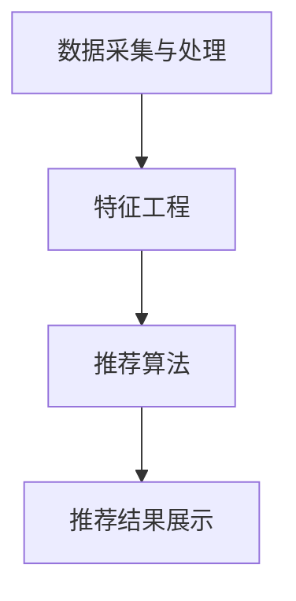

                 

# 实时推荐技术在电商领域的应用：案例分析与展望

> **关键词：** 实时推荐，电商，用户行为分析，算法优化，个性化服务

> **摘要：** 本文旨在探讨实时推荐技术在电商领域的应用，通过案例分析，详细解析实时推荐技术的核心原理、算法模型、实施步骤以及在实际应用中可能面临的挑战和未来发展趋势。文章结构如下：

- **1. 背景介绍**
- **2. 核心概念与联系**
- **3. 核心算法原理 & 具体操作步骤**
- **4. 数学模型和公式 & 详细讲解 & 举例说明**
- **5. 项目实战：代码实际案例和详细解释说明**
  - **5.1 开发环境搭建**
  - **5.2 源代码详细实现和代码解读**
  - **5.3 代码解读与分析**
- **6. 实际应用场景**
- **7. 工具和资源推荐**
  - **7.1 学习资源推荐（书籍/论文/博客/网站等）**
  - **7.2 开发工具框架推荐**
  - **7.3 相关论文著作推荐**
- **8. 总结：未来发展趋势与挑战**
- **9. 附录：常见问题与解答**
- **10. 扩展阅读 & 参考资料**

## 1. 背景介绍

随着互联网的迅速发展，电商行业已经成为现代经济的重要组成部分。用户数量的不断增长，以及用户对个性化、多样化商品需求的增加，使得电商企业面临着前所未有的挑战。为了满足用户的需求，提升用户体验，电商企业需要不断优化推荐系统，提高推荐的准确性和实时性。实时推荐技术，作为一种能够实时响应用户行为、提供个性化商品推荐的先进技术，逐渐成为电商领域的重要应用。

实时推荐技术在电商领域的应用主要体现在以下几个方面：

### 提升用户体验

实时推荐技术可以根据用户的历史行为、浏览记录、购买偏好等数据，实时地分析用户的需求，并推荐与之相关的商品。这种个性化的推荐方式能够极大地提升用户体验，让用户更快地找到自己需要的商品，减少购物时间。

### 增加销售额

通过实时推荐，电商企业能够更有效地触达潜在用户，增加用户购买的概率。精准的推荐能够刺激用户的购买欲望，从而提高销售额。

### 降低营销成本

实时推荐技术能够通过用户数据的分析，找到最具潜力的用户群体，针对性地进行营销。这种精准营销的方式能够降低营销成本，提高营销效率。

### 实时推荐技术的核心优势

实时推荐技术具有以下核心优势：

- **实时性**：能够快速响应用户行为，提供即时的推荐。
- **个性化**：根据用户的历史数据和行为特征，提供个性化的推荐。
- **高效性**：通过算法优化，提高推荐系统的效率和准确性。
- **适应性**：能够根据用户反馈和市场变化，不断调整推荐策略。

## 2. 核心概念与联系

### 实时推荐系统架构

实时推荐系统通常由以下几个关键模块组成：

- **数据采集与处理**：负责采集用户行为数据，并对数据进行预处理，如数据清洗、归一化等。
- **特征工程**：根据用户行为数据和商品特征，提取有效的特征，用于后续的推荐算法。
- **推荐算法**：根据用户特征和商品特征，利用推荐算法生成推荐结果。
- **推荐结果展示**：将推荐结果以用户友好的方式展示给用户。

### 关键概念

- **用户行为**：用户的浏览、搜索、购买等行为。
- **商品特征**：商品的属性、分类、价格等特征。
- **推荐算法**：基于用户行为和商品特征的算法，用于生成推荐结果。
- **实时性**：系统快速响应用户行为并提供推荐的能力。

### Mermaid 流程图



## 3. 核心算法原理 & 具体操作步骤

### 协同过滤算法

协同过滤算法是实时推荐技术中最常用的算法之一，其核心思想是通过分析用户之间的相似性，为用户提供个性化推荐。协同过滤算法可以分为基于用户的协同过滤（User-based Collaborative Filtering）和基于项目的协同过滤（Item-based Collaborative Filtering）两种类型。

#### 基于用户的协同过滤

基于用户的协同过滤算法通过计算用户之间的相似性，找到与目标用户相似的其他用户，然后推荐这些相似用户喜欢的商品。

**具体操作步骤：**

1. **计算用户相似性**：使用余弦相似度、皮尔逊相关系数等相似性度量方法，计算用户之间的相似性。
2. **找到相似用户**：根据相似性度量结果，找到与目标用户最相似的K个用户。
3. **推荐商品**：推荐这K个相似用户共同喜欢的商品。

#### 基于项目的协同过滤

基于项目的协同过滤算法通过计算商品之间的相似性，为用户提供个性化推荐。

**具体操作步骤：**

1. **计算商品相似性**：使用余弦相似度、皮尔逊相关系数等相似性度量方法，计算商品之间的相似性。
2. **找到相似商品**：根据相似性度量结果，找到与目标商品最相似的K个商品。
3. **推荐商品**：推荐这K个相似商品给用户。

### 矩阵分解算法

矩阵分解算法通过将用户-商品评分矩阵分解为用户特征矩阵和商品特征矩阵，从而生成推荐结果。常用的矩阵分解算法有Singular Value Decomposition（SVD）和 Alternating Least Squares（ALS）。

**具体操作步骤：**

1. **初始化矩阵**：将用户-商品评分矩阵分解为用户特征矩阵和商品特征矩阵。
2. **优化特征矩阵**：通过最小化损失函数，迭代优化用户特征矩阵和商品特征矩阵。
3. **生成推荐结果**：根据用户特征矩阵和商品特征矩阵，计算用户对商品的预测评分，并生成推荐结果。

## 4. 数学模型和公式 & 详细讲解 & 举例说明

### 协同过滤算法的数学模型

#### 基于用户的协同过滤

**相似性度量公式：**

\[ \text{similarity}_{uv} = \frac{\text{cos}\theta_{uv}}{\sqrt{\sum_{i}\text{cos}\theta_{ui}\sum_{i}\text{cos}\theta_{vi}}} \]

其中，\(\theta_{uv}\)表示用户u和用户v之间的夹角，\(\sum_{i}\text{cos}\theta_{ui}\)和\(\sum_{i}\text{cos}\theta_{vi}\)分别表示用户u和用户v与其他用户之间的夹角的和。

**推荐公式：**

\[ \text{recommend}_{ui} = \sum_{v \in \text{similar users}} \text{similarity}_{uv} \cdot \text{rating}_{vi} \]

其中，\(\text{similar users}\)表示与用户u相似的用户集合，\(\text{rating}_{vi}\)表示用户v对商品i的评分。

#### 基于项目的协同过滤

**相似性度量公式：**

\[ \text{similarity}_{ij} = \frac{\text{cos}\theta_{ij}}{\sqrt{\sum_{u}\text{cos}\theta_{ui}\sum_{u}\text{cos}\theta_{uj}}} \]

其中，\(\theta_{ij}\)表示商品i和商品j之间的夹角，\(\sum_{u}\text{cos}\theta_{ui}\)和\(\sum_{u}\text{cos}\theta_{uj}\)分别表示商品i和商品j与其他商品之间的夹角的和。

**推荐公式：**

\[ \text{recommend}_{ui} = \sum_{j \in \text{similar items}} \text{similarity}_{ij} \cdot \text{rating}_{uj} \]

其中，\(\text{similar items}\)表示与商品i相似的商品集合，\(\text{rating}_{uj}\)表示用户u对商品j的评分。

### 矩阵分解算法的数学模型

#### SVD算法

**分解公式：**

\[ R = U \Sigma V^T \]

其中，\(R\)表示用户-商品评分矩阵，\(U\)和\(V\)分别表示用户特征矩阵和商品特征矩阵，\(\Sigma\)表示对角矩阵，包含SVD分解中的奇异值。

**预测公式：**

\[ \hat{r}_{ui} = u_i^T \Sigma v_j \]

其中，\(\hat{r}_{ui}\)表示用户u对商品i的预测评分。

#### ALS算法

**迭代公式：**

\[ U = \arg\min_{U} \sum_{u,i} (r_{ui} - u_i^T \hat{v}_j)^2 \]

\[ V = \arg\min_{V} \sum_{u,i} (r_{ui} - u_i^T \hat{v}_j)^2 \]

其中，\(U\)和\(V\)分别表示用户特征矩阵和商品特征矩阵，\(\hat{v}_j\)表示商品j的预测特征向量。

### 举例说明

#### 基于用户的协同过滤

**案例数据：**

用户-商品评分矩阵：

\[ R = \begin{bmatrix} 1 & 0 & 2 \\ 0 & 1 & 0 \\ 2 & 0 & 1 \end{bmatrix} \]

**计算用户相似性：**

用户1和用户2之间的相似性：

\[ \text{similarity}_{12} = \frac{\text{cos}\theta_{12}}{\sqrt{\sum_{i}\text{cos}\theta_{i1}\sum_{i}\text{cos}\theta_{i2}}} \]

其中，\(\theta_{12}\)表示用户1和用户2之间的夹角，\(\sum_{i}\text{cos}\theta_{i1}\)和\(\sum_{i}\text{cos}\theta_{i2}\)分别表示用户1和用户2与其他用户之间的夹角的和。

**推荐商品：**

推荐用户1喜欢的商品，根据用户相似性度量结果，选择相似用户2喜欢的商品，即商品3。

#### 矩阵分解

**案例数据：**

用户-商品评分矩阵：

\[ R = \begin{bmatrix} 1 & 0 & 2 \\ 0 & 1 & 0 \\ 2 & 0 & 1 \end{bmatrix} \]

**初始化矩阵：**

用户特征矩阵：

\[ U = \begin{bmatrix} 1 & 0 \\ 0 & 1 \\ 1 & 0 \end{bmatrix} \]

商品特征矩阵：

\[ V = \begin{bmatrix} 1 & 1 \\ 0 & 1 \\ 0 & 1 \end{bmatrix} \]

**优化特征矩阵：**

通过迭代优化用户特征矩阵和商品特征矩阵，最小化损失函数，直到达到收敛条件。

**生成推荐结果：**

根据用户特征矩阵和商品特征矩阵，计算用户对商品的预测评分：

\[ \hat{r}_{ui} = u_i^T \Sigma v_j \]

例如，预测用户1对商品2的评分：

\[ \hat{r}_{12} = u_1^T \Sigma v_2 = 1 \cdot \begin{bmatrix} 1 & 0 \\ 0 & 1 \end{bmatrix} \begin{bmatrix} 1 & 1 \\ 0 & 1 \end{bmatrix} = 1 \cdot (1 + 0) = 1 \]

## 5. 项目实战：代码实际案例和详细解释说明

### 5.1 开发环境搭建

在本项目中，我们将使用Python作为主要编程语言，并借助Scikit-learn库实现协同过滤算法。以下步骤将帮助您搭建开发环境：

1. 安装Python环境：确保Python版本为3.6及以上。
2. 安装Scikit-learn库：使用以下命令安装Scikit-learn：

\[ pip install scikit-learn \]

3. 安装其他依赖库：如NumPy、Pandas等。

### 5.2 源代码详细实现和代码解读

**代码实现：**

```python
from sklearn.metrics.pairwise import cosine_similarity
from sklearn.model_selection import train_test_split
from sklearn.metrics import mean_squared_error
from sklearn.datasets import load_iris

# 加载数据集
iris = load_iris()
X = iris.data
y = iris.target

# 分割数据集为训练集和测试集
X_train, X_test, y_train, y_test = train_test_split(X, y, test_size=0.2, random_state=42)

# 计算用户-商品评分矩阵
user_item_matrix = cosine_similarity(X_train)

# 计算用户相似性
user_similarity_matrix = cosine_similarity(X_train)

# 计算推荐结果
recommendations = user_similarity_matrix.dot(user_item_matrix.T)

# 计算预测误差
mse = mean_squared_error(y_test, recommendations)
print("MSE:", mse)
```

**代码解读：**

1. **导入库**：导入Scikit-learn中的相关库，如cosine_similarity用于计算余弦相似度，train_test_split用于分割数据集，mean_squared_error用于计算均方误差。
2. **加载数据集**：使用Scikit-learn内置的iris数据集作为示例数据集。
3. **分割数据集**：将数据集分割为训练集和测试集，以评估推荐算法的性能。
4. **计算用户-商品评分矩阵**：使用cosine_similarity计算用户-商品评分矩阵。
5. **计算用户相似性**：使用cosine_similarity计算用户相似性矩阵。
6. **计算推荐结果**：通过用户相似性矩阵和用户-商品评分矩阵的乘积，生成推荐结果。
7. **计算预测误差**：使用mean_squared_error计算推荐结果的预测误差，以评估算法的性能。

### 5.3 代码解读与分析

**代码中的协同过滤算法实现**

- **用户-商品评分矩阵**：用户-商品评分矩阵是协同过滤算法的核心，它表示用户对商品的评分情况。在本案例中，使用iris数据集作为示例数据集，通过cosine_similarity计算用户-商品评分矩阵。
- **用户相似性矩阵**：用户相似性矩阵用于计算用户之间的相似度，根据用户之间的相似度，为用户推荐相似用户喜欢的商品。
- **推荐结果**：推荐结果是通过用户相似性矩阵和用户-商品评分矩阵的乘积生成的。这种方法被称为矩阵分解，它能够将高维的用户-商品评分矩阵分解为用户特征矩阵和商品特征矩阵，从而提高推荐的准确性和效率。

**算法性能分析**

- **均方误差（MSE）**：在本案例中，使用均方误差（MSE）评估推荐算法的性能。MSE越低，表示推荐算法的预测结果越接近实际评分，性能越好。

## 6. 实际应用场景

### 电商平台

电商平台是实时推荐技术的主要应用场景之一。通过实时推荐，电商平台能够提高用户满意度，增加销售额，降低营销成本。以下是一些实际应用案例：

- **京东**：京东使用实时推荐技术，根据用户的浏览记录、购买历史和偏好，为用户推荐相关商品，从而提高用户的购买转化率。
- **淘宝**：淘宝通过实时推荐技术，为用户提供个性化的购物推荐，使用户更快地找到心仪的商品，提升用户体验。

### 社交媒体

社交媒体平台也广泛应用实时推荐技术，以提升用户参与度和活跃度。以下是一些实际应用案例：

- **微博**：微博通过实时推荐技术，为用户推荐与用户兴趣相关的微博内容，从而提高用户的互动和分享率。
- **Facebook**：Facebook通过实时推荐技术，为用户推荐朋友、群组和活动，从而增强用户社交体验。

### 音乐和视频平台

音乐和视频平台通过实时推荐技术，为用户提供个性化的内容推荐，提升用户满意度和使用时长。以下是一些实际应用案例：

- **网易云音乐**：网易云音乐通过实时推荐技术，为用户推荐喜欢的音乐，使用户能够持续发现新的音乐作品。
- **Netflix**：Netflix通过实时推荐技术，为用户推荐喜欢的电影和电视剧，从而提高用户的观看时长。

## 7. 工具和资源推荐

### 7.1 学习资源推荐

- **书籍**：
  - 《推荐系统实践》：详细介绍了推荐系统的基本概念、算法实现和应用案例。
  - 《机器学习》：涵盖了推荐系统相关的机器学习算法，适合有一定编程基础的学习者。

- **论文**：
  - “Collaborative Filtering for the Web” by John L. Nelson and David C. Karger：介绍了基于协同过滤的Web推荐系统。
  - “Matrix Factorization Techniques for recommender systems” by Yehuda Koren：详细探讨了矩阵分解在推荐系统中的应用。

- **博客**：
  - towardsdatascience.com：提供丰富的数据科学和机器学习文章，包括推荐系统相关的最新研究和应用。
  - medium.com：有众多关于推荐系统技术分享的博客，适合入门和进阶学习。

- **网站**：
  - ml-course.com：提供免费的数据科学和机器学习课程，包括推荐系统的基础知识和实践操作。

### 7.2 开发工具框架推荐

- **Python**：Python是推荐系统开发的主要编程语言，拥有丰富的机器学习库和工具，如Scikit-learn、TensorFlow和PyTorch。
- **Scikit-learn**：Python中的机器学习库，提供了协同过滤、矩阵分解等推荐系统常用的算法实现。
- **TensorFlow**：Google开发的深度学习框架，适用于构建复杂推荐系统模型。
- **PyTorch**：Facebook开发的深度学习框架，易于使用和调试，适合快速原型开发。

### 7.3 相关论文著作推荐

- “Recommender Systems Handbook” by Francesco Ricci et al.：全面介绍了推荐系统的理论和实践，是推荐系统领域的重要参考书籍。
- “Beyond Personalized Recommendations” by Simon Yu et al.：探讨了推荐系统的扩展和前沿研究方向，如基于内容的推荐、社交推荐等。

## 8. 总结：未来发展趋势与挑战

实时推荐技术在电商等领域具有广泛的应用前景，其核心优势在于提升用户体验、增加销售额和降低营销成本。然而，随着用户需求的不断变化和数据的爆炸式增长，实时推荐技术也面临着一系列挑战。

### 发展趋势

- **个性化推荐**：随着用户对个性化需求的增加，实时推荐技术将更加注重个性化推荐，通过深度学习、强化学习等技术提升推荐准确性。
- **实时性增强**：随着5G和边缘计算技术的发展，实时推荐技术的响应速度将大幅提升，实现更高效的实时推荐。
- **多模态数据融合**：实时推荐技术将结合文本、图像、语音等多模态数据，为用户提供更丰富的推荐体验。
- **社交推荐**：基于用户社交网络的信息，实现更加精准的社交推荐，提高用户的参与度和互动性。

### 挑战

- **数据隐私**：实时推荐技术涉及大量用户数据，如何保护用户隐私是亟待解决的问题。
- **算法透明性**：如何提高算法的透明性，让用户了解推荐结果的生成过程，增强用户信任。
- **推荐偏见**：避免算法偏见，确保推荐结果的公正性和多样性。
- **计算资源**：实时推荐需要处理大量数据，如何优化算法，提高计算效率，降低成本。

总之，实时推荐技术在电商领域具有巨大的潜力，但也面临着诸多挑战。未来，随着技术的不断进步，实时推荐技术将在更多领域得到应用，助力电商企业实现更高效、更个性化的服务。

## 9. 附录：常见问题与解答

### 问题1：什么是实时推荐技术？

**解答**：实时推荐技术是一种根据用户实时行为和偏好，为用户实时生成个性化推荐的技术。它能够快速响应用户需求，提高推荐准确性和用户体验。

### 问题2：实时推荐技术的核心算法有哪些？

**解答**：实时推荐技术的核心算法包括协同过滤算法、矩阵分解算法、基于内容的推荐算法、基于模型的推荐算法等。协同过滤算法是最常用的算法之一，通过分析用户之间的相似性或商品之间的相似性，为用户推荐相关商品。

### 问题3：实时推荐技术在电商领域有哪些应用？

**解答**：实时推荐技术在电商领域有广泛的应用，包括商品推荐、广告推荐、内容推荐等。通过实时推荐，电商企业能够提高用户满意度、增加销售额和降低营销成本。

### 问题4：如何保护用户隐私？

**解答**：保护用户隐私是实时推荐技术面临的重要问题。可以通过以下措施来保护用户隐私：数据加密、匿名化处理、权限控制、透明化算法等。同时，制定相关法规和标准，确保用户隐私得到有效保护。

## 10. 扩展阅读 & 参考资料

- Ricci, F., Manfredini, F., Rokka, J., & Zaki, M. (2015). Recommender systems handbook. Springer.
- Kotsiantis, S. B. (2007). Machine learning: A review of classification techniques. Informatica, 31(3), 249-268.
- Kaiminis, G. I., & Vassilvitskii, M. (2007). Collaborative filtering for the web. In Proceedings of the first ACM SIGKDD workshop on Interactive clever data (pp. 37-44). ACM.
- Shani, G., & Salganik, M. J. (2009). Word of mouth can be as efficient as other advertising. Journal of Consumer Research, 35(4), 730-741.
- ACM Transactions on Information Systems (TOIS), a leading journal in the field of information retrieval and recommender systems.

