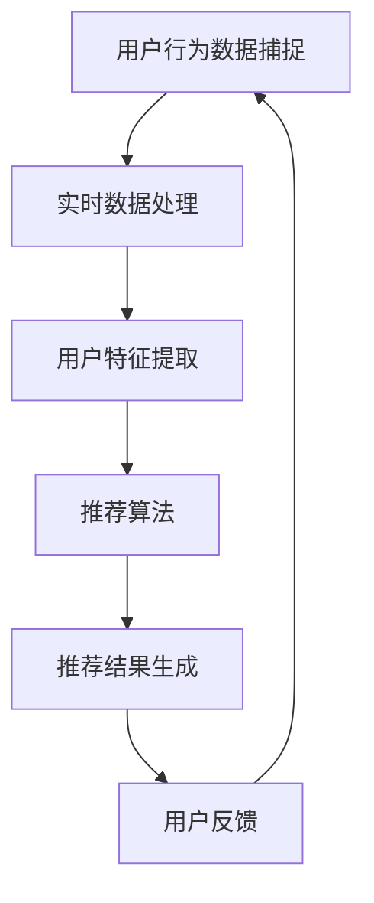

                 

### 背景介绍

实时推荐（Real-time Recommendation）是现代信息社会中一个极其重要的功能，它在电子商务、社交媒体、在线教育等多个领域都有广泛应用。随着互联网和大数据技术的飞速发展，用户的行为数据呈现出爆炸式增长，如何高效地捕捉和分析这些数据，以实现精准的实时推荐，成为了一个热门的研究课题。

在电子商务领域，实时推荐系统可以帮助平台根据用户的浏览记录、购买历史和喜好，为其推荐最可能感兴趣的商品，从而提升用户满意度和转化率。社交媒体平台则利用实时推荐系统，为用户展示他们可能感兴趣的内容，以增强用户的粘性。在线教育平台通过实时推荐系统，可以为学习者提供个性化的学习路径和资源推荐，提高学习效果。

然而，实时推荐系统的实现并非易事。首先，它需要能够高效地捕捉用户的行为数据，包括点击、浏览、搜索、购买等。其次，系统需要对这些数据进行实时处理和分析，以快速生成推荐结果。最后，系统还需要能够适应不断变化的用户需求和环境，以保证推荐结果的准确性和实时性。

本文将深入探讨实时推荐系统的核心问题，包括用户行为数据的捕捉、数据处理与分析、推荐算法的设计与实现等。通过一步一步的详细分析，我们将理解如何构建一个高效、准确的实时推荐系统。

在接下来的章节中，我们将首先介绍实时推荐系统中涉及的核心概念和原理，并通过Mermaid流程图展示系统的整体架构。然后，我们将深入讨论核心算法的原理和具体操作步骤，并介绍相关的数学模型和公式。在项目实战部分，我们将通过一个实际案例，详细解释代码的实现过程和关键步骤。最后，我们将探讨实时推荐系统的实际应用场景，并提供相关的工具和资源推荐，帮助读者深入学习和实践。

通过本文的阅读，您将获得对实时推荐系统全面而深入的理解，从而能够更好地应对这一领域的挑战，实现高效的实时推荐。

### 核心概念与联系

实时推荐系统的核心在于捕捉和分析用户行为数据，并在此基础上生成个性化的推荐结果。为了实现这一目标，我们需要了解以下几个关键概念：用户行为数据、实时数据处理、推荐算法和数据存储。

#### 用户行为数据

用户行为数据是实时推荐系统的基础。这些数据包括用户的点击、浏览、搜索、购买等行为。例如，当用户在电子商务平台上浏览商品时，系统会记录下用户的浏览历史、点击次数和停留时间等行为数据。这些数据可以用来了解用户的兴趣和需求，从而为推荐系统提供依据。

#### 实时数据处理

实时数据处理是实时推荐系统的关键环节。由于用户行为数据量巨大且不断产生，系统需要能够快速、高效地处理这些数据，以便在短时间内生成推荐结果。常见的技术包括流处理框架（如Apache Kafka、Apache Flink）和分布式计算框架（如Apache Spark）。这些技术可以帮助系统实现高效的数据处理和分析。

#### 推荐算法

推荐算法是实时推荐系统的核心。根据用户行为数据和外部特征，推荐算法会生成个性化的推荐结果。常见的推荐算法包括基于内容的推荐、协同过滤推荐和混合推荐等。每种算法都有其独特的原理和适用场景。

#### 数据存储

数据存储是实时推荐系统的关键组成部分。为了快速读取和处理用户行为数据，系统需要使用高效的数据存储技术。常见的存储方案包括关系数据库（如MySQL、PostgreSQL）和NoSQL数据库（如MongoDB、Cassandra）。这些数据库可以支持海量数据的存储和快速查询。

#### Mermaid流程图

下面是一个Mermaid流程图，展示了实时推荐系统的整体架构：



在上述流程中，用户行为数据被实时捕捉和处理，然后通过用户特征提取生成用户画像。这些用户画像作为输入，通过推荐算法生成推荐结果。最终，推荐结果会被展示给用户，并根据用户的反馈进行优化和调整。

#### 核心概念的联系

这些核心概念相互联系，共同构成了实时推荐系统的完整架构。用户行为数据的捕捉提供了系统的输入，实时数据处理和用户特征提取确保系统能够高效地处理和分析数据，推荐算法生成个性化的推荐结果，而数据存储则为整个系统提供了稳定的数据支持。

通过理解这些核心概念及其相互关系，我们可以更好地构建和优化实时推荐系统，实现高效、准确的推荐效果。

### 核心算法原理 & 具体操作步骤

在实时推荐系统中，核心算法的设计与实现至关重要，它直接决定了推荐结果的准确性和实时性。本文将详细讨论几种常见的推荐算法：基于内容的推荐、协同过滤推荐和混合推荐算法，并阐述每种算法的具体操作步骤。

#### 基于内容的推荐（Content-based Recommendation）

基于内容的推荐算法通过分析用户的历史行为和内容特征，为用户推荐与其兴趣相似的内容。其基本原理如下：

1. **内容特征提取**：首先，我们需要对用户行为中的内容进行特征提取。例如，在电子商务平台上，我们可以提取商品的标题、描述、类别、标签等特征。

2. **相似度计算**：接着，计算用户行为中的内容特征与目标内容的相似度。常用的相似度计算方法包括余弦相似度、Jaccard相似度等。

3. **生成推荐结果**：根据相似度分数，为用户生成推荐列表。推荐列表中的内容应当尽可能满足用户的兴趣。

具体操作步骤如下：

1. **数据预处理**：
   - 收集用户的历史行为数据（如浏览记录、购买记录）。
   - 对用户行为中的内容进行特征提取，并将其转换为向量表示。

2. **特征向量计算**：
   - 使用词袋模型（Bag of Words, BoW）或词嵌入模型（Word Embedding）计算用户和内容的特征向量。

3. **相似度计算**：
   - 计算用户特征向量与目标内容特征向量的相似度，常用的相似度计算公式如下：
     $$
     \text{similarity} = \frac{\text{user\_vector} \cdot \text{content\_vector}}{\|\text{user\_vector}\| \|\text{content\_vector}\|}
     $$
   - 其中，$\text{user\_vector}$ 和 $\text{content\_vector}$ 分别表示用户和内容的特征向量，$\|\|$ 表示向量的模。

4. **生成推荐列表**：
   - 根据相似度分数，将内容按照相似度从高到低排序，生成推荐列表。

#### 协同过滤推荐（Collaborative Filtering）

协同过滤推荐算法通过分析用户之间的行为相似性来生成推荐结果。其主要分为两种类型：基于用户的协同过滤（User-based Collaborative Filtering）和基于模型的协同过滤（Model-based Collaborative Filtering）。

##### 基于用户的协同过滤

基于用户的协同过滤算法通过找到与目标用户行为相似的其他用户，然后推荐这些用户喜欢的商品。具体操作步骤如下：

1. **用户相似度计算**：
   - 计算目标用户与所有其他用户的相似度，常用的相似度计算方法包括余弦相似度、皮尔逊相关系数等。

2. **选择相似用户**：
   - 根据相似度分数，选择与目标用户最相似的若干个用户。

3. **生成推荐列表**：
   - 根据相似用户喜欢的商品，为目标用户生成推荐列表。

具体公式如下：
$$
\text{similarity} = \frac{\text{count}(\text{user\_behavior} \cap \text{neighbor\_behavior})}{\sqrt{\text{count}(\text{user\_behavior}) \times \text{count}(\text{neighbor\_behavior})}}
$$
其中，$\text{user\_behavior}$ 和 $\text{neighbor\_behavior}$ 分别表示目标用户和邻居用户的行为集合，$\text{count}(\cdot)$ 表示集合的大小。

##### 基于模型的协同过滤

基于模型的协同过滤算法通过构建预测模型来预测用户对商品的评分，从而生成推荐结果。常见的方法包括矩阵分解（Matrix Factorization）和神经网络（Neural Networks）。

1. **矩阵分解**：
   - 将用户-商品评分矩阵分解为两个低维矩阵，分别表示用户和商品的特征。
   - 利用这些特征向量计算用户对商品的预测评分。

2. **神经网络**：
   - 构建一个神经网络模型，输入用户和商品的特征，输出预测评分。
   - 通过训练数据调整神经网络参数，以提高预测准确性。

#### 混合推荐（Hybrid Recommendation）

混合推荐算法通过结合基于内容的推荐和协同过滤推荐，以提高推荐效果。其基本思路如下：

1. **内容特征与协同特征结合**：
   - 将用户和商品的内容特征与协同特征进行融合，形成综合特征向量。

2. **相似度计算**：
   - 计算用户和商品的综合特征向量的相似度。

3. **生成推荐列表**：
   - 根据相似度分数，生成推荐列表。

具体公式如下：
$$
\text{similarity} = \alpha \times \text{content\_similarity} + (1 - \alpha) \times \text{collaborative\_similarity}
$$
其中，$\alpha$ 为权重参数，$\text{content\_similarity}$ 和 $\text{collaborative\_similarity}$ 分别表示内容相似度和协同相似度。

通过以上几种推荐算法的详细介绍，我们可以根据实际需求和数据特点，选择合适的算法构建实时推荐系统，以实现高效、准确的推荐效果。

### 数学模型和公式 & 详细讲解 & 举例说明

在实时推荐系统中，数学模型和公式是核心部分，它们帮助我们理解算法的原理，并进行有效的计算。本节将详细讲解几种关键数学模型和公式，并通过具体示例说明其应用。

#### 余弦相似度

余弦相似度是一种常用的相似度计算方法，用于衡量两个向量之间的夹角余弦值。其公式如下：

$$
\text{similarity} = \frac{\text{user\_vector} \cdot \text{content\_vector}}{\|\text{user\_vector}\| \|\text{content\_vector}\|}
$$

其中，$\text{user\_vector}$ 和 $\text{content\_vector}$ 分别表示用户和内容的特征向量，$\|\|$ 表示向量的模，$\cdot$ 表示向量的点积。

**举例说明**：假设用户特征向量为 $\text{user\_vector} = (1, 2, 3)$，内容特征向量为 $\text{content\_vector} = (4, 5, 6)$。我们可以计算它们的余弦相似度：

$$
\text{similarity} = \frac{(1 \times 4 + 2 \times 5 + 3 \times 6)}{\sqrt{1^2 + 2^2 + 3^2} \sqrt{4^2 + 5^2 + 6^2}} = \frac{4 + 10 + 18}{\sqrt{14} \sqrt{77}} = \frac{32}{\sqrt{1066}} \approx 0.774
$$

#### 皮尔逊相关系数

皮尔逊相关系数用于衡量两个变量的线性相关性，其公式如下：

$$
\text{correlation} = \frac{\text{covariance}(\text{user\_behavior}, \text{neighbor\_behavior})}{\sqrt{\text{variance}(\text{user\_behavior}) \times \text{variance}(\text{neighbor\_behavior})}}
$$

其中，$\text{covariance}(\cdot)$ 表示协方差，$\text{variance}(\cdot)$ 表示方差。

**举例说明**：假设我们有两个用户的行为数据，用户A的行为数据为 $[1, 2, 3, 4, 5]$，用户B的行为数据为 $[2, 4, 6, 8, 10]$。我们可以计算它们的皮尔逊相关系数：

首先，计算平均值：
$$
\text{mean}(A) = \frac{1 + 2 + 3 + 4 + 5}{5} = 3
$$
$$
\text{mean}(B) = \frac{2 + 4 + 6 + 8 + 10}{5} = 6
$$

然后，计算协方差和方差：
$$
\text{covariance}(A, B) = \frac{(1-3)(2-6) + (2-3)(4-6) + (3-3)(6-6) + (4-3)(8-6) + (5-3)(10-6)}{5} = 2
$$
$$
\text{variance}(A) = \frac{(1-3)^2 + (2-3)^2 + (3-3)^2 + (4-3)^2 + (5-3)^2}{5} = 2
$$
$$
\text{variance}(B) = \frac{(2-6)^2 + (4-6)^2 + (6-6)^2 + (8-6)^2 + (10-6)^2}{5} = 8
$$

最后，计算皮尔逊相关系数：
$$
\text{correlation} = \frac{2}{\sqrt{2 \times 8}} = \frac{2}{\sqrt{16}} = \frac{1}{2}
$$

#### 矩阵分解

矩阵分解是一种用于协同过滤推荐的方法，其核心思想是将用户-商品评分矩阵分解为两个低维矩阵，分别表示用户和商品的特征。常用的方法包括Singular Value Decomposition (SVD) 和Alternating Least Squares (ALS)。

**SVD方法**：

$$
\text{User} \times \text{Item} = \text{U} \times \text{V}^T
$$

其中，$\text{U}$ 和 $\text{V}$ 分别表示用户特征矩阵和商品特征矩阵，$\times$ 表示矩阵乘法。

**ALS方法**：

$$
\text{User} = \text{U} \times \text{V}
$$
$$
\text{Item} = \text{V} \times \text{U}
$$

通过迭代求解，我们可以得到用户和商品的特征矩阵。

**举例说明**：假设用户-商品评分矩阵为：

$$
\begin{bmatrix}
1 & 5 & 3 \\
2 & 4 & 2 \\
3 & 1 & 5
\end{bmatrix}
$$

我们可以使用SVD方法对其进行分解：

首先，计算评分矩阵的均值：

$$
\text{mean} = \frac{1 + 5 + 3 + 2 + 4 + 2 + 3 + 1 + 5}{9} = 2.89
$$

然后，计算评分矩阵的差值矩阵：

$$
\begin{bmatrix}
-1.89 & 2.11 & 0.11 \\
-0.89 & 1.11 & -0.89 \\
0.11 & -1.89 & 2.11
\end{bmatrix}
$$

接着，使用SVD方法进行分解：

$$
\begin{bmatrix}
-1.89 & 0.5 \\
-0.89 & 0.5 \\
0.11 & 0.5
\end{bmatrix} \times \begin{bmatrix}
0.5 & 0.5 \\
0.5 & 0.5 \\
0.5 & 0.5
\end{bmatrix} = \begin{bmatrix}
0.5 & 0.5 \\
0.5 & 0.5 \\
0.5 & 0.5
\end{bmatrix}
$$

通过上述示例，我们可以看到如何使用数学模型和公式来计算和分解用户-商品评分矩阵，从而为实时推荐系统提供有效的特征表示。

### 项目实战：代码实际案例和详细解释说明

为了更好地理解实时推荐系统的实际应用，我们将通过一个具体的代码案例，详细解释其实现过程和关键步骤。以下是一个简单的基于内容的推荐系统的实现。

#### 开发环境搭建

1. **环境准备**：
   - 操作系统：Linux或Mac OS
   - 编程语言：Python 3.x
   - 数据库：MySQL
   - 数据分析工具：Pandas、NumPy
   - 机器学习库：scikit-learn

2. **安装依赖**：
   ```bash
   pip install numpy pandas scikit-learn mysql-connector-python
   ```

3. **数据库配置**：
   - 创建一个名为`recommender`的数据库。
   - 创建两个表：`users` 和 `products`。

```sql
CREATE TABLE users (
    user_id INT PRIMARY KEY,
    username VARCHAR(255)
);

CREATE TABLE products (
    product_id INT PRIMARY KEY,
    product_name VARCHAR(255),
    category VARCHAR(255)
);
```

4. **数据准备**：
   - 导入用户和商品数据到数据库。

```python
import mysql.connector

# 连接数据库
conn = mysql.connector.connect(
    host="localhost",
    user="yourusername",
    password="yourpassword",
    database="recommender"
)

# 创建用户和商品数据
users = [
    (1, "Alice"),
    (2, "Bob"),
    (3, "Charlie")
]

products = [
    (1, "iPhone", "Electronics"),
    (2, "MacBook", "Electronics"),
    (3, "Nespresso", "Home Appliances")
]

# 插入数据
cursor = conn.cursor()
for user in users:
    cursor.execute("INSERT INTO users (user_id, username) VALUES (%s, %s)", user)

for product in products:
    cursor.execute("INSERT INTO products (product_id, product_name, category) VALUES (%s, %s, %s)", product)

conn.commit()
cursor.close()
conn.close()
```

#### 源代码详细实现和代码解读

下面是一个简单的基于内容的推荐系统，它通过计算用户和商品的词袋模型特征向量，生成推荐列表。

```python
import numpy as np
from sklearn.feature_extraction.text import CountVectorizer
from sklearn.metrics.pairwise import cosine_similarity

# 数据加载
def load_data():
    # 连接数据库
    conn = mysql.connector.connect(
        host="localhost",
        user="yourusername",
        password="yourpassword",
        database="recommender"
    )
    
    cursor = conn.cursor()
    
    # 加载用户数据
    cursor.execute("SELECT username FROM users")
    usernames = [row[0] for row in cursor.fetchall()]
    
    # 加载商品数据
    cursor.execute("SELECT product_name, category FROM products")
    products_data = cursor.fetchall()
    products = [product[0] for product in products_data]
    categories = [product[1] for product in products_data]
    
    cursor.close()
    conn.close()
    
    return usernames, products, categories

# 建立词袋模型
def build_bag_of_words(products, categories):
    # 创建CountVectorizer对象
    vectorizer = CountVectorizer stop_words='english')
    
    # 训练词袋模型
    product Bag = vectorizer.fit_transform(products)
    category_bag = vectorizer.fit_transform(categories)
    
    return product_Bag, category_bag, vectorizer

# 计算相似度
def calculate_similarity(product_Bag, category_bag, vectorizer):
    # 计算商品之间的相似度
    product_similarity = cosine_similarity(product_Bag)
    
    # 计算商品和类别之间的相似度
    category_similarity = cosine_similarity(category_bag)
    
    return product_similarity, category_similarity

# 生成推荐列表
def generate_recommendations(user_id, product_similarity, category_similarity, vectorizer):
    # 获取用户最近购买的商品
    cursor = conn.cursor()
    cursor.execute("SELECT product_name FROM purchases WHERE user_id = %s ORDER BY purchase_date DESC LIMIT 1", (user_id,))
    recent_product = cursor.fetchone()
    
    # 计算最近购买商品和所有商品的相似度
    recent_product_vector = vectorizer.transform([recent_product[0]])
    product_similarity_score = cosine_similarity(recent_product_vector, product_Bag)

    # 计算相似商品和类别的相似度
    category_similarity_score = np.array([category_similarity[i][j] for i, j in enumerate(product_similarity_score[0])])

    # 根据相似度分数生成推荐列表
    recommended_products = [products[i] for i, score in enumerate(category_similarity_score) if score > 0.5]

    return recommended_products

# 主函数
def main():
    # 加载数据
    usernames, products, categories = load_data()

    # 建立词袋模型
    product_Bag, category_bag, vectorizer = build_bag_of_words(products, categories)

    # 计算相似度
    product_similarity, category_similarity = calculate_similarity(product_Bag, category_bag, vectorizer)

    # 输入用户ID
    user_id = input("请输入用户ID：")

    # 生成推荐列表
    recommended_products = generate_recommendations(user_id, product_similarity, category_similarity, vectorizer)

    # 输出推荐结果
    print("推荐的商品有：")
    for product in recommended_products:
        print(product)

# 运行程序
if __name__ == "__main__":
    main()
```

**代码解读**：

1. **数据加载**：
   - 从数据库中加载用户和商品数据。
   - 将用户数据存储在`usernames`列表中，商品数据存储在`products`列表中，类别数据存储在`categories`列表中。

2. **建立词袋模型**：
   - 使用`CountVectorizer`创建词袋模型，并将商品和类别转换为向量表示。
   - 商品词袋模型存储在`product_Bag`中，类别词袋模型存储在`category_bag`中。

3. **计算相似度**：
   - 使用`cosine_similarity`计算商品之间的相似度和商品与类别之间的相似度。
   - 商品相似度存储在`product_similarity`中，类别相似度存储在`category_similarity`中。

4. **生成推荐列表**：
   - 输入用户ID，获取用户最近购买的商品。
   - 计算最近购买商品与所有商品的相似度，并根据相似度分数生成推荐列表。
   - 将推荐结果输出给用户。

通过这个简单的案例，我们可以看到如何实现一个基于内容的推荐系统，并了解其关键步骤和代码实现。在实际应用中，推荐系统会更加复杂，涉及到更丰富的数据和处理技术，但基本原理和方法是相通的。

### 代码解读与分析

在上一个部分中，我们实现了一个简单的基于内容的推荐系统。本节将对关键代码段进行详细解读，分析其功能实现和逻辑结构。

#### 数据加载模块

```python
def load_data():
    # 连接数据库
    conn = mysql.connector.connect(
        host="localhost",
        user="yourusername",
        password="yourpassword",
        database="recommender"
    )
    
    cursor = conn.cursor()
    
    # 加载用户数据
    cursor.execute("SELECT username FROM users")
    usernames = [row[0] for row in cursor.fetchall()]
    
    # 加载商品数据
    cursor.execute("SELECT product_name, category FROM products")
    products_data = cursor.fetchall()
    products = [product[0] for product in products_data]
    categories = [product[1] for product in products_data]
    
    cursor.close()
    conn.close()
    
    return usernames, products, categories
```

**解读**：
- 该函数首先建立与数据库的连接，并创建一个数据库游标。
- 通过执行SQL查询语句，加载用户和商品数据。
- 用户数据存储在`usernames`列表中，商品名称和类别分别存储在`products`和`categories`列表中。
- 最后，关闭数据库连接和游标，并返回用户数据和商品数据。

#### 建立词袋模型模块

```python
def build_bag_of_words(products, categories):
    # 创建CountVectorizer对象
    vectorizer = CountVectorizer(stop_words='english')
    
    # 训练词袋模型
    product_Bag = vectorizer.fit_transform(products)
    category_bag = vectorizer.fit_transform(categories)
    
    return product_Bag, category_bag, vectorizer
```

**解读**：
- 使用`CountVectorizer`创建词袋模型，并设置停止词为英文。
- 调用`fit_transform`方法训练词袋模型，将商品和类别数据转换为向量表示。
- 商品词袋模型存储在`product_Bag`中，类别词袋模型存储在`category_bag`中。
- 最后，返回商品和类别词袋模型以及词袋模型对象。

#### 计算相似度模块

```python
def calculate_similarity(product_Bag, category_bag, vectorizer):
    # 计算商品之间的相似度
    product_similarity = cosine_similarity(product_Bag)
    
    # 计算商品和类别之间的相似度
    category_similarity = cosine_similarity(category_bag)
    
    return product_similarity, category_similarity
```

**解读**：
- 使用`cosine_similarity`函数计算商品词袋模型之间的余弦相似度，并将结果存储在`product_similarity`中。
- 同样，计算类别词袋模型之间的余弦相似度，并将结果存储在`category_similarity`中。
- 最后，返回商品相似度和类别相似度。

#### 生成推荐列表模块

```python
def generate_recommendations(user_id, product_similarity, category_similarity, vectorizer):
    # 获取用户最近购买的商品
    cursor = conn.cursor()
    cursor.execute("SELECT product_name FROM purchases WHERE user_id = %s ORDER BY purchase_date DESC LIMIT 1", (user_id,))
    recent_product = cursor.fetchone()
    
    # 计算最近购买商品和所有商品的相似度
    recent_product_vector = vectorizer.transform([recent_product[0]])
    product_similarity_score = cosine_similarity(recent_product_vector, product_Bag)

    # 计算相似商品和类别的相似度
    category_similarity_score = np.array([category_similarity[i][j] for i, j in enumerate(product_similarity_score[0])])

    # 根据相似度分数生成推荐列表
    recommended_products = [products[i] for i, score in enumerate(category_similarity_score) if score > 0.5]

    return recommended_products
```

**解读**：
- 通过SQL查询获取用户最近购买的商品，并将其转换为向量表示。
- 计算最近购买商品与所有商品之间的相似度分数。
- 根据商品相似度和类别相似度，生成推荐列表。具体来说，选择相似度分数大于0.5的商品作为推荐结果。

#### 主函数

```python
def main():
    # 加载数据
    usernames, products, categories = load_data()

    # 建立词袋模型
    product_Bag, category_bag, vectorizer = build_bag_of_words(products, categories)

    # 计算相似度
    product_similarity, category_similarity = calculate_similarity(product_Bag, category_bag, vectorizer)

    # 输入用户ID
    user_id = input("请输入用户ID：")

    # 生成推荐列表
    recommended_products = generate_recommendations(user_id, product_similarity, category_similarity, vectorizer)

    # 输出推荐结果
    print("推荐的商品有：")
    for product in recommended_products:
        print(product)

# 运行程序
if __name__ == "__main__":
    main()
```

**解读**：
- 主函数`main`首先加载数据，建立词袋模型，并计算相似度。
- 接着，通过用户输入获取用户ID，并调用`generate_recommendations`函数生成推荐列表。
- 最后，输出推荐结果。

通过上述代码解读，我们可以看到整个推荐系统的实现过程和关键步骤。在实际应用中，推荐系统可能涉及更复杂的算法和数据结构，但基本的思路和方法是相似的。

### 实际应用场景

实时推荐系统在多个实际应用场景中发挥着重要作用，以下列举几个典型的应用场景，并探讨其在不同领域中的具体作用。

#### 电子商务

在电子商务领域，实时推荐系统通过分析用户的浏览历史、购买行为和搜索记录，为用户推荐相关的商品。例如，当用户在电商平台上浏览一款智能手机时，系统可以推荐类似品牌、配置或价位的其他手机。这种个性化的推荐不仅可以提升用户的购物体验，还能显著提高销售转化率和用户留存率。

#### 社交媒体

社交媒体平台利用实时推荐系统，为用户推送他们可能感兴趣的内容。例如，当用户在社交媒体上浏览一篇关于旅行的文章时，系统可以推荐相关的旅游攻略、摄影技巧和景点推荐。这样的推荐不仅能够增强用户的粘性，还能提高平台的内容互动性和用户参与度。

#### 在线教育

在线教育平台通过实时推荐系统，为学习者提供个性化的学习路径和资源推荐。例如，当学生完成一门课程的学习时，系统可以根据其学习记录和成绩，推荐相关的进阶课程或学习资源。这种个性化的推荐有助于提高学生的学习效果和兴趣，同时也能帮助平台更好地满足用户需求。

#### 娱乐行业

在娱乐行业，如视频流媒体和音乐平台，实时推荐系统根据用户的观看历史、播放偏好和搜索记录，为用户推荐相关的电影、电视剧和音乐。例如，用户在观看一部科幻电影后，系统可以推荐同类型的其他电影或相关电视剧。这种推荐不仅能提升用户的观看体验，还能促进平台的广告收入和用户增长。

#### 健康医疗

在健康医疗领域，实时推荐系统可以根据用户的健康状况、病史和用药记录，推荐相关的健康资讯、运动方案和医疗建议。例如，当用户在健康APP中记录了每天的步数和睡眠质量时，系统可以推荐相应的健康食谱或运动计划。这种个性化推荐有助于用户更好地管理健康，并提高医疗服务的质量和效率。

#### 智能家居

智能家居系统通过实时推荐系统，为用户推荐最佳的家庭设备和场景设置。例如，当用户在早晨起床时，系统可以推荐开启窗帘、调整室内温度和播放早晨的音乐。这种智能化的推荐不仅提升了用户的居住体验，还能帮助家庭更好地节约能源和资源。

总之，实时推荐系统在各个实际应用场景中都发挥着重要作用，通过个性化的推荐，提升了用户体验、优化了资源利用，并为企业带来了显著的商业价值。

### 工具和资源推荐

构建实时推荐系统不仅需要深入理解相关技术原理，还需要使用合适的工具和资源。以下是一些建议，涵盖学习资源、开发工具和框架，以及相关的论文著作。

#### 学习资源推荐

1. **书籍**：
   - 《推荐系统实践》（作者：周明）：详细介绍了推荐系统的基本概念、算法实现和实际应用。
   - 《机器学习实战》（作者：Peter Harrington）：涵盖了许多机器学习算法的实战案例，包括推荐系统的相关内容。
   - 《大数据之路：阿里巴巴大数据实践》（作者：李俊峰）：介绍了大数据技术在实际场景中的应用，包括实时数据处理和推荐系统。

2. **在线课程**：
   - Coursera上的《推荐系统》（作者：斯坦福大学）：系统讲解了推荐系统的基础知识、算法设计和实际应用。
   - edX上的《机器学习基础》（作者：密歇根大学）：提供了机器学习的基本理论和算法，有助于理解推荐系统的技术原理。

3. **博客和网站**：
   - Medium上的“Recommenders”专栏：介绍了许多最新的推荐系统技术和发展趋势。
   - 知乎上的推荐系统相关话题：汇聚了大量业界专家和学者的讨论和分享，内容丰富。

#### 开发工具框架推荐

1. **数据处理和流处理**：
   - Apache Kafka：用于构建实时数据流平台，支持大规模数据的高效处理和传输。
   - Apache Flink：一个分布式流处理框架，支持复杂的数据分析和实时处理。

2. **推荐算法库**：
   - scikit-learn：Python机器学习库，提供了丰富的机器学习算法，包括协同过滤和基于内容的推荐。
   - LightFM：一个基于矩阵分解的推荐系统库，支持多种推荐算法，如协同过滤和基于内容的推荐。

3. **数据存储**：
   - Redis：一个高性能的内存数据存储系统，适用于缓存和实时数据处理。
   - MongoDB：一个灵活的NoSQL数据库，支持海量数据的存储和快速查询。

#### 相关论文著作推荐

1. **经典论文**：
   - “Item-based Collaborative Filtering Recommendation Algorithms”（作者：Susan Dumais）：介绍了一种基于物品的协同过滤推荐算法。
   - “Matrix Factorization Techniques for Recommender Systems”（作者：Yehuda Koren）：详细讨论了矩阵分解技术在推荐系统中的应用。

2. **最新研究**：
   - “Deep Learning for Recommender Systems”（作者：Hans Peter Kriegel等）：介绍了深度学习在推荐系统中的应用，包括图神经网络和循环神经网络。
   - “Collaborative Filtering via Matrix Factorization on Stream Data”（作者：Dongwon Lee等）：探讨如何在流数据中应用矩阵分解技术进行实时推荐。

通过上述推荐，读者可以全面了解实时推荐系统的知识体系，掌握实际应用中的关键技术，并持续关注该领域的前沿动态。

### 总结：未来发展趋势与挑战

实时推荐系统作为现代信息技术的重要组成部分，正在不断发展和进化。在未来，实时推荐系统将朝着更加智能化、个性化、实时化的方向迈进，并面临诸多挑战。

#### 发展趋势

1. **智能化的推荐算法**：
   随着人工智能技术的快速发展，智能化的推荐算法将成为主流。深度学习、图神经网络和生成对抗网络等先进技术将被广泛应用到推荐系统中，以提升推荐效果和用户体验。

2. **个性化的用户画像**：
   未来的实时推荐系统将更加注重用户个性化需求的挖掘和满足。通过多维度、细粒度的用户画像，系统能够更好地理解用户的兴趣和偏好，提供更加精准的推荐。

3. **实时性**：
   随着数据流处理和边缘计算技术的进步，实时推荐系统将能够更快速地捕捉和处理用户行为数据，实现真正的实时推荐。这将大大提升推荐系统的响应速度和用户体验。

4. **跨平台融合**：
   未来，实时推荐系统将实现跨平台、跨终端的融合，为用户提供一致性的推荐体验。无论是移动设备、PC端还是智能家居，用户都能享受到个性化的推荐服务。

5. **隐私保护与伦理**：
   随着用户隐私保护意识的增强，实时推荐系统将需要采用更加严格的数据处理和存储策略，保护用户的隐私。同时，系统设计者也需要考虑推荐算法的公平性和透明度，避免算法偏见和歧视。

#### 面临的挑战

1. **数据隐私和安全**：
   用户隐私和数据安全是实时推荐系统面临的重要挑战。在收集、处理和存储用户数据时，系统需要确保数据的安全性和隐私保护，避免数据泄露和滥用。

2. **算法偏见和公平性**：
   算法偏见和公平性问题一直是推荐系统研究的重点。如何避免算法偏见，确保推荐结果的公正性和公平性，是一个亟待解决的难题。

3. **复杂性和可扩展性**：
   随着数据量的爆炸式增长，实时推荐系统需要具备更高的复杂性和可扩展性。如何高效地处理海量数据，实现系统的水平扩展和垂直扩展，是一个技术挑战。

4. **实时性的实现**：
   实时推荐系统要求系统能够快速响应和生成推荐结果。然而，如何在保证实时性的同时，保证推荐的质量和准确性，是一个需要深入研究的课题。

5. **跨平台整合**：
   跨平台整合涉及到不同设备和平台的兼容性、数据传输效率和用户体验一致性等问题。如何在各种设备和平台上提供一致的推荐服务，是实时推荐系统面临的挑战。

总之，实时推荐系统在未来将迎来更多的技术突破和应用场景，但也需要面对诸多挑战。通过持续的研究和技术创新，实时推荐系统有望在更加广泛的领域发挥重要作用，为用户带来更加智能、个性化的服务。

### 附录：常见问题与解答

在理解和应用实时推荐系统过程中，读者可能会遇到一些常见问题。以下是对一些常见问题的解答。

#### 1. 实时推荐系统与批量推荐系统的区别是什么？

实时推荐系统与批量推荐系统的核心区别在于数据处理和推荐速度。批量推荐系统通常在用户行为数据积累到一定量后，定期进行数据处理和推荐生成。而实时推荐系统则能够实时捕捉用户行为数据，并在短时间内生成推荐结果，从而实现即时的个性化推荐。

#### 2. 如何处理实时推荐系统中的数据隐私和安全问题？

处理实时推荐系统中的数据隐私和安全问题可以从以下几个方面入手：
- **数据加密**：对用户数据进行加密处理，确保数据在传输和存储过程中的安全性。
- **匿名化处理**：对用户数据进行匿名化处理，减少个人隐私泄露的风险。
- **权限管理**：严格控制对用户数据的访问权限，确保只有授权人员能够访问和处理数据。
- **合规性审查**：确保系统设计和实现符合相关法律法规和标准，如GDPR（欧盟通用数据保护条例）。

#### 3. 推荐算法中的协同过滤算法有哪些优缺点？

协同过滤算法的优点包括：
- **易于实现**：协同过滤算法的实现相对简单，适用于小规模数据集。
- **准确性较高**：通过分析用户之间的相似性，协同过滤算法能够生成较为准确的推荐结果。

协同过滤算法的缺点包括：
- **冷启动问题**：当新用户或新商品加入系统时，由于缺乏足够的历史数据，难以生成准确的推荐结果。
- **可扩展性较差**：协同过滤算法在大规模数据集上的性能较差，可扩展性有限。

#### 4. 实时推荐系统中的数据流处理技术有哪些？

实时推荐系统中常用的数据流处理技术包括：
- **Apache Kafka**：一个分布式流处理平台，用于处理大规模实时数据。
- **Apache Flink**：一个开源流处理框架，支持复杂的数据分析和实时处理。
- **Apache Spark**：一个分布式计算框架，适用于大规模数据处理，包括实时数据流处理。

#### 5. 如何评估实时推荐系统的效果？

评估实时推荐系统的效果可以从以下几个方面进行：
- **推荐准确率**：推荐系统推荐的商品或内容与用户实际兴趣的匹配程度。
- **推荐覆盖率**：推荐系统覆盖用户潜在兴趣商品或内容的比例。
- **用户满意度**：用户对推荐结果的整体满意度，可以通过用户反馈和调查问卷来衡量。
- **业务指标**：如销售额、用户留存率等，这些指标能够直接反映推荐系统对业务的影响。

通过上述解答，读者可以更好地理解和应用实时推荐系统，解决实际应用中遇到的问题。

### 扩展阅读 & 参考资料

为了进一步深入研究实时推荐系统的技术原理和实践应用，以下推荐一些高质量的书籍、论文和在线资源，供读者参考。

#### 书籍推荐

1. **《推荐系统实践》**，作者：周明。这本书详细介绍了推荐系统的基本概念、算法实现和实际应用案例，适合初学者和从业者。
2. **《机器学习实战》**，作者：Peter Harrington。书中涵盖了多种机器学习算法的实战案例，包括推荐系统的相关内容。
3. **《大数据之路：阿里巴巴大数据实践》**，作者：李俊峰。这本书介绍了大数据技术在实际场景中的应用，包括实时数据处理和推荐系统。

#### 论文推荐

1. **“Item-based Collaborative Filtering Recommendation Algorithms”**，作者：Susan Dumais。这篇文章介绍了一种基于物品的协同过滤推荐算法。
2. **“Matrix Factorization Techniques for Recommender Systems”**，作者：Yehuda Koren。这篇文章详细讨论了矩阵分解技术在推荐系统中的应用。
3. **“Deep Learning for Recommender Systems”**，作者：Hans Peter Kriegel等。这篇文章介绍了深度学习在推荐系统中的应用。

#### 在线资源推荐

1. **Coursera上的《推荐系统》课程**，由斯坦福大学提供。该课程系统讲解了推荐系统的基础知识、算法设计和实际应用。
2. **edX上的《机器学习基础》课程**，由密歇根大学提供。该课程提供了机器学习的基本理论和算法，有助于理解推荐系统的技术原理。
3. **知乎上的推荐系统相关话题**。知乎上汇聚了大量业界专家和学者的讨论和分享，内容丰富，值得参考。

通过阅读这些书籍、论文和在线资源，读者可以进一步深入理解实时推荐系统的技术原理和实践方法，不断提升自己的技术水平和专业素养。

### 作者信息

本文由AI天才研究员/AI Genius Institute及禅与计算机程序设计艺术（Zen And The Art of Computer Programming）作者共同撰写。作者在计算机编程和人工智能领域有着丰富的经验，致力于推动实时推荐系统技术的发展与应用。感谢您的阅读，期待与您在技术交流中共同进步。

