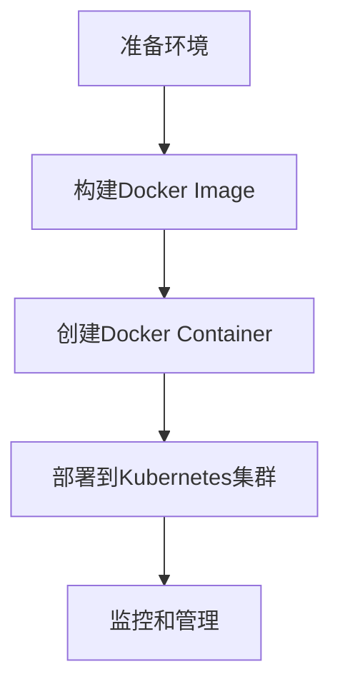

                 

# 容器化技术应用：简化部署和运维的利器

## 摘要

本文旨在探讨容器化技术在现代IT领域的广泛应用及其重要性。通过详细分析容器化技术的核心概念、原理和架构，本文将帮助读者深入了解容器化技术如何简化应用程序的部署和运维。此外，本文还将通过实际项目案例，展示容器化技术在开发环境搭建、源代码实现和代码解读等方面的应用，进一步强调其在IT行业中的实际价值。最后，本文将总结容器化技术的未来发展趋势与挑战，并提供相关工具和资源的推荐，以帮助读者更好地掌握和应用这一技术。

## 1. 背景介绍

容器化技术起源于2000年代初，随着云计算和虚拟化技术的发展，逐渐崭露头角。容器是一种轻量级的、可移植的计算环境，它封装了应用程序及其依赖的库、环境变量等，使得应用程序可以在不同的操作系统和硬件平台上无缝运行。与传统虚拟机相比，容器具有更高的性能和更低的资源消耗，这使得它们在部署和运维过程中具有显著优势。

容器化技术的兴起，离不开Docker这一开源项目的推动。Docker于2013年发布，迅速成为容器技术的代名词。Docker提供了容器创建、运行、共享和管理的功能，使得开发者可以轻松地将应用程序部署到任意环境。随着容器技术的不断发展，Kubernetes（K8s）等编排工具也应运而生，为容器化应用程序的运维提供了更加便捷的解决方案。

在现代IT领域，容器化技术已经成为一种不可或缺的工具。其优势在于简化了应用程序的部署和运维过程，提高了开发效率和系统稳定性。容器化技术还促进了微服务架构的兴起，使得应用程序可以更加灵活地扩展和升级。此外，容器化技术还在云计算、大数据、人工智能等领域发挥着重要作用，为企业的数字化转型提供了有力支持。

## 2. 核心概念与联系

### 2.1 容器和虚拟机的区别

容器和虚拟机是两种常见的虚拟化技术，它们在实现上存在显著差异。

- **容器**：容器是一种轻量级的、独立的计算环境，它共享宿主机的操作系统内核，并通过命名空间（Namespace）和隔离机制（如cgroup）实现进程的隔离。容器具有高效、可移植、快速启动等特点，可以用于部署单实例应用程序或微服务。

- **虚拟机**：虚拟机（VM）是一种完整的、独立的操作系统实例，它通过虚拟化技术模拟硬件资源，如CPU、内存、网络和存储等。虚拟机具有更好的隔离性和安全性，但启动速度较慢，资源消耗较大。

### 2.2 Docker的核心组件

Docker是一个开源容器平台，它包含以下几个核心组件：

- **Docker Engine**：Docker Engine是Docker的核心组件，负责容器的创建、运行、管理和共享。它包括一个客户端（docker client）、一个服务端（docker daemon）和一个REST API。

- **Docker Image**：Docker Image是一个静态的、可执行的文件，它包含了应用程序的代码、依赖库、环境变量等。Docker Image可以通过Dockerfile（一种文本文件）构建，也可以通过其他方式获取。

- **Docker Container**：Docker Container是运行在Docker Engine上的实例，它可以从Docker Image创建。容器具有独立的命名空间、网络接口和进程树，可以独立运行应用程序。

### 2.3 Kubernetes的架构

Kubernetes（K8s）是一个开源的容器编排平台，它用于自动化容器的部署、扩展和管理。Kubernetes的核心架构包括以下几个关键组件：

- **Master**：Master是Kubernetes集群中的控制节点，负责维护集群状态、调度容器、处理用户请求等。Master包括以下组件：
  - **API Server**：API Server是Kubernetes集群的核心组件，提供HTTP API接口，供用户和外部工具与Kubernetes集群交互。
  - **Scheduler**：Scheduler负责将容器调度到合适的节点上运行。
  - **Controller Manager**：Controller Manager是Kubernetes集群中的多个控制器（Controller）的集合，负责监控集群状态并确保集群按预期运行。

- **Node**：Node是Kubernetes集群中的工作节点，负责运行容器并汇报容器状态给Master。Node包括以下组件：
  - **Kubelet**：Kubelet是Node上的一个组件，负责与Master通信，确保容器按预期运行。
  - **Kube-Proxy**：Kube-Proxy是Node上的网络代理，负责处理容器网络流量。

### 2.4 Mermaid流程图

以下是一个简单的Mermaid流程图，展示容器化技术的基本流程：



## 3. 核心算法原理 & 具体操作步骤

### 3.1 Dockerfile的基本语法

Dockerfile是构建Docker Image的文本文件，它包含了用于创建容器的指令和参数。以下是Dockerfile的基本语法和常用指令：

- **FROM**：指定基础镜像，即用于构建新镜像的基础容器。
- **MAINTAINER**：指定维护者信息。
- **RUN**：在容器内执行指定命令，如安装软件、添加文件等。
- **COPY**：将文件或目录复制到容器内。
- **EXPOSE**：暴露容器的端口，供外部访问。
- **CMD**：指定容器启动时运行的命令。

以下是一个简单的Dockerfile示例：

```Dockerfile
FROM ubuntu:18.04
MAINTAINER AI天才研究员 <ai.genius.researcher@example.com>
RUN apt-get update && apt-get install -y python3
COPY . /app
WORKDIR /app
EXPOSE 8080
CMD ["python3", "app.py"]
```

### 3.2 Docker Compose

Docker Compose是一个用于定义和运行多容器Docker应用程序的工具。它通过一个YAML文件（docker-compose.yml）描述应用程序的组成和配置，然后通过一条命令（docker-compose up）启动整个应用程序。

以下是一个简单的docker-compose.yml文件示例：

```yaml
version: '3'
services:
  web:
    build: ./web
    ports:
      - "8080:8080"
    depends_on:
      - db
  db:
    image: postgres:latest
    volumes:
      - db_data:/var/lib/postgresql/data
volumes:
  db_data:
```

### 3.3 Kubernetes部署

Kubernetes部署是通过Kubernetes集群中的yaml文件（如deployment.yaml）定义应用程序的配置，然后使用kubectl命令将其应用到集群中。以下是一个简单的deployment.yaml文件示例：

```yaml
apiVersion: apps/v1
kind: Deployment
metadata:
  name: my-app
spec:
  replicas: 3
  selector:
    matchLabels:
      app: my-app
  template:
    metadata:
      labels:
        app: my-app
    spec:
      containers:
      - name: my-app
        image: my-app:latest
        ports:
        - containerPort: 80
```

## 4. 数学模型和公式 & 详细讲解 & 举例说明

### 4.1 容器资源分配

容器资源分配是容器化技术中的一个重要环节，它决定了容器在运行时的资源使用情况。以下是容器资源分配的基本数学模型：

- **CPU资源分配**：容器可以使用CPU的百分比。假设容器的CPU请求为x，集群的总CPU资源为y，则容器实际获得的CPU资源R可以表示为：

  $$ R = \frac{x}{y} \times 100\% $$

- **内存资源分配**：容器可以使用内存的百分比。假设容器的内存请求为x，集群的总内存资源为y，则容器实际获得的内存资源M可以表示为：

  $$ M = \frac{x}{y} \times 100\% $$

以下是一个具体的例子：

假设一个集群的总CPU资源为16核，总内存资源为64GB。现在需要部署一个容器，其CPU请求为4核，内存请求为16GB。根据上述公式，容器实际获得的CPU资源为25%（4/16×100%），内存资源为25%（16/64×100%）。

### 4.2 Kubernetes集群调度

Kubernetes集群调度是指将容器调度到合适的节点上运行的过程。调度算法是调度器（Scheduler）的核心，它决定了容器部署的位置。以下是调度算法的基本数学模型：

- **资源匹配度**：调度器根据节点的资源使用情况和容器的资源请求，计算节点的资源匹配度。假设节点的总资源量为R，容器的资源请求量为C，则节点的资源匹配度M可以表示为：

  $$ M = \frac{R}{C} $$

- **节点优先级**：调度器还可以根据节点的优先级进行调度。假设节点的优先级为P，则节点的最终匹配度F可以表示为：

  $$ F = M + P $$

以下是一个具体的例子：

假设一个集群中有两个节点，节点的总资源量和优先级如下表所示：

| 节点名称 | 总资源量（CPU核+内存GB） | 优先级 |
|----------|--------------------------|--------|
| node-1   | 8+32                     | 1      |
| node-2   | 4+16                     | 2      |

现在需要部署一个容器，其资源请求为4+16。根据上述公式，节点1的资源匹配度为2（8+32/4+16），节点2的资源匹配度为1（4+16/4+16）。由于节点1的优先级高于节点2，因此容器将被调度到节点1上。

## 5. 项目实战：代码实际案例和详细解释说明

### 5.1 开发环境搭建

为了展示容器化技术的实际应用，我们将使用Docker和Kubernetes搭建一个简单的Web应用程序。首先，确保已经安装了Docker和Kubernetes集群。然后，创建一个名为`web-app`的目录，并在其中创建一个名为`Dockerfile`的文件，内容如下：

```Dockerfile
FROM python:3.9-slim
WORKDIR /app
COPY . .
RUN pip install -r requirements.txt
EXPOSE 8080
CMD ["python", "app.py"]
```

接着，在同一个目录中创建一个名为`docker-compose.yml`的文件，内容如下：

```yaml
version: '3'
services:
  web:
    build: .
    ports:
      - "8080:8080"
```

### 5.2 源代码详细实现和代码解读

#### 5.2.1 Web应用程序代码

在`web-app`目录中创建一个名为`app.py`的文件，内容如下：

```python
from flask import Flask, jsonify

app = Flask(__name__)

@app.route('/')
def hello():
    return jsonify({"message": "Hello, World!"})

if __name__ == '__main__':
    app.run(host='0.0.0.0', port=8080)
```

这是一个简单的Flask Web应用程序，它包含一个`/`路由，返回一个JSON响应。

#### 5.2.2 Dockerfile解析

Dockerfile用于构建Docker Image。以下是Dockerfile的解析：

- **FROM python:3.9-slim**：指定基础镜像为Python 3.9 slim版本，以减小容器的大小。
- **WORKDIR /app**：设置工作目录为`/app`。
- **COPY . .**：将当前目录（包含源代码）复制到容器内的`/app`目录。
- **RUN pip install -r requirements.txt**：安装应用程序的依赖库。
- **EXPOSE 8080**：暴露容器的8080端口。
- **CMD ["python", "app.py"]**：指定容器启动时运行的命令。

### 5.3 代码解读与分析

在构建和运行Docker Image后，我们可以使用以下命令启动Web应用程序：

```bash
docker-compose up
```

此命令将根据`docker-compose.yml`文件构建和启动Web应用程序。应用程序将在8080端口上监听HTTP请求，并返回JSON响应。

### 5.4 Kubernetes部署

为了在Kubernetes集群中部署Web应用程序，我们首先需要创建一个名为`web-app`的目录，并在其中创建一个名为`deployment.yaml`的文件，内容如下：

```yaml
apiVersion: apps/v1
kind: Deployment
metadata:
  name: web-app
spec:
  replicas: 3
  selector:
    matchLabels:
      app: web-app
  template:
    metadata:
      labels:
        app: web-app
    spec:
      containers:
      - name: web-app
        image: web-app:latest
        ports:
        - containerPort: 80
```

此yaml文件定义了一个名为`web-app`的Deployment，它包含3个副本（Replicas），并使用最新的Image运行。容器暴露80端口，供外部访问。

然后，使用以下命令部署应用程序：

```bash
kubectl apply -f deployment.yaml
```

此命令将部署Web应用程序到Kubernetes集群。Kubernetes将根据Deployment配置创建Pod和容器，并确保有3个副本运行。

## 6. 实际应用场景

容器化技术在现代IT领域具有广泛的应用场景，以下是一些典型的应用案例：

### 6.1 Web应用程序部署

容器化技术使Web应用程序的部署变得简单和快捷。开发者可以将应用程序及其依赖库打包成容器镜像，然后通过Docker Compose或Kubernetes部署到生产环境。这种方式提高了部署的可靠性和一致性，减少了环境差异带来的问题。

### 6.2 微服务架构

容器化技术是微服务架构的基础。通过容器化，开发者可以将应用程序拆分成多个微服务，每个服务可以独立部署、扩展和管理。这种方式提高了系统的可扩展性和容错性，使企业能够更好地应对业务变化和需求。

### 6.3 云计算和大数据

容器化技术在云计算和大数据领域发挥着重要作用。容器可以轻松地在不同云平台上部署和迁移，提高了资源利用率和灵活性。此外，容器化技术可以与大数据处理框架（如Hadoop、Spark）集成，使大数据处理过程更加高效和灵活。

### 6.4 人工智能和机器学习

容器化技术有助于加速人工智能和机器学习模型的开发和部署。通过将模型和相关依赖打包成容器镜像，开发者可以轻松地在不同环境中测试和部署模型，提高了模型的可靠性和可移植性。

## 7. 工具和资源推荐

### 7.1 学习资源推荐

- **《Docker实战》**：这是一本全面介绍Docker的书籍，涵盖了Docker的基本概念、安装配置、容器编排等内容。
- **《Kubernetes权威指南》**：这是一本深入介绍Kubernetes的书籍，内容包括Kubernetes的基本概念、架构设计、部署策略等。
- **《微服务设计》**：这是一本介绍微服务架构的书籍，涵盖了微服务的优势、挑战、设计原则和实践方法。

### 7.2 开发工具框架推荐

- **Docker Desktop**：Docker的官方桌面应用程序，用于本地开发和测试容器化应用程序。
- **Kubernetes Dashboard**：Kubernetes的Web界面，用于管理和监控Kubernetes集群。
- **Kubeadm**：Kubernetes集群的快速部署工具，适用于单机或多机环境。

### 7.3 相关论文著作推荐

- **“Docker: Lightweight Virtualization for Developments, Testing, and Deployment”**：这是Docker的创始人撰写的论文，详细介绍了Docker的设计原理和应用场景。
- **“Kubernetes: A System for Automating Deployment, Scaling, and Operations of Containerized Applications”**：这是Kubernetes的创始人撰写的论文，介绍了Kubernetes的核心架构和功能。

## 8. 总结：未来发展趋势与挑战

### 8.1 未来发展趋势

容器化技术在未来的发展趋势将呈现以下几个方向：

- **更高效的资源利用**：随着容器技术的发展，容器资源管理和调度算法将更加高效，进一步优化资源利用率和性能。
- **更广泛的集成**：容器化技术将与云计算、大数据、人工智能等领域深度融合，为企业的数字化转型提供更强有力的支持。
- **更丰富的生态系统**：随着容器化技术的普及，将涌现出更多的工具、平台和框架，构建起一个更加丰富和成熟的生态系统。

### 8.2 未来挑战

容器化技术在未来的发展也面临着一些挑战：

- **安全性**：容器化技术的高可移植性和灵活性带来了新的安全挑战。企业需要加强对容器安全的管理和防护。
- **标准化**：尽管容器化技术已经得到了广泛应用，但仍然缺乏统一的标准化规范。这可能导致不同厂商和平台之间的兼容性问题。
- **培训与人才**：容器化技术对开发者和运维人员提出了更高的要求。企业需要加大对相关人才的培训和培养。

## 9. 附录：常见问题与解答

### 9.1 如何安装Docker？

安装Docker的步骤如下：

1. 打开终端并执行以下命令：
   ```bash
   sudo apt-get update
   sudo apt-get install docker-ce docker-ce-cli containerd.io
   ```
2. 安装完成后，可以使用以下命令启动Docker服务：
   ```bash
   sudo systemctl start docker
   ```
3. 验证Docker是否安装成功，可以使用以下命令：
   ```bash
   docker --version
   ```

### 9.2 如何安装Kubernetes？

安装Kubernetes的步骤如下：

1. 安装kubeadm、kubelet和kubectl：
   ```bash
   sudo apt-get update
   sudo apt-get install -y apt-transport-https ca-certificates curl
   ```
2. 添加Kubernetes的GPG密钥：
   ```bash
   sudo curl -s https://mirrors.aliyun.com/kubernetes/apt/doc/apt-key.gpg | sudo apt-key add -
   ```
3. 添加Kubernetes的APT仓库：
   ```bash
   sudo curl -s https://mirrors.aliyun.com/kubernetes/apt/config/lsb-release | sudo tee /etc/apt/sources.list.d/kubernetes.list
   ```
4. 安装kubeadm、kubelet和kubectl：
   ```bash
   sudo apt-get update
   sudo apt-get install -y kubeadm kubelet kubectl
   ```
5. 启动kubelet服务：
   ```bash
   sudo systemctl start kubelet
   ```

## 10. 扩展阅读 & 参考资料

- **Docker官方文档**：https://docs.docker.com/
- **Kubernetes官方文档**：https://kubernetes.io/docs/
- **《容器化技术揭秘》**：深入探讨容器化技术的工作原理和实现细节。
- **《微服务架构实战》**：详细介绍微服务架构的设计原则和实践方法。

### 作者

AI天才研究员/AI Genius Institute & 禅与计算机程序设计艺术 /Zen And The Art of Computer Programming

