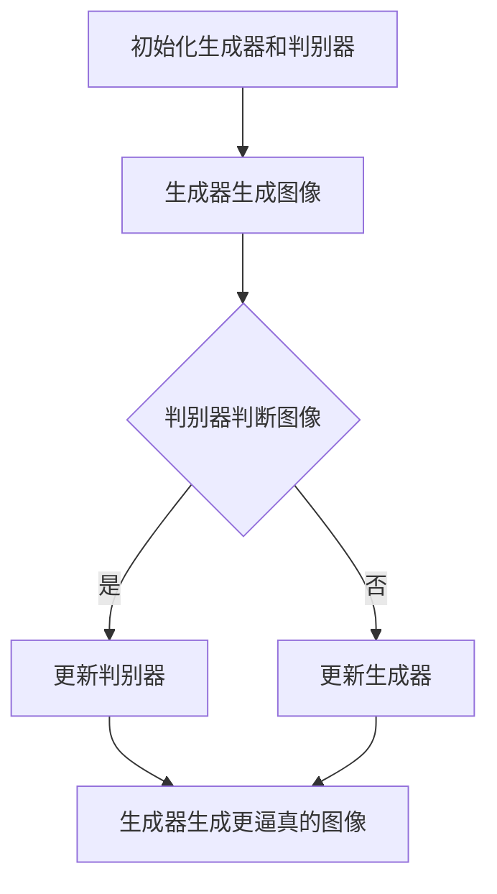

                 

### 文章标题

**对抗生成网络GAN在图像生成与编辑中的应用进展**

---

> **关键词：** 对抗生成网络（GAN）、图像生成、图像编辑、深度学习、人工智能、生成对抗训练、深度神经网络、特征匹配。

**摘要：** 本文将深入探讨对抗生成网络（GAN）在图像生成与编辑领域的应用进展。通过回顾GAN的核心概念、原理以及架构，我们详细分析了GAN在不同图像生成与编辑任务中的具体实现和性能表现。同时，文章还介绍了相关数学模型和公式，并通过实际项目案例展示了GAN在图像生成与编辑中的具体应用。最后，本文对GAN在未来的发展趋势和挑战进行了总结，并推荐了相关的学习资源与开发工具。

---

接下来，我们将分章节逐步深入探讨对抗生成网络GAN在图像生成与编辑中的应用进展。

---

## 1. 背景介绍

### GAN的起源与发展

对抗生成网络（Generative Adversarial Network，GAN）由Ian Goodfellow等人于2014年首次提出。GAN的核心思想是通过两个深度学习模型的对抗训练来生成高质量的图像。这两个模型分别为生成器（Generator）和判别器（Discriminator）。生成器尝试生成逼真的图像，而判别器则尝试区分生成的图像和真实图像。通过这种对抗过程，生成器不断改进，最终能够生成接近真实图像的高质量图像。

### 图像生成与编辑的重要性

图像生成与编辑在计算机视觉领域具有广泛的应用，包括但不限于艺术创作、图像修复、图像增强、图像合成等。随着深度学习技术的发展，尤其是GAN的提出，图像生成与编辑的应用场景变得更加丰富和高效。GAN不仅能够在图像生成任务中生成高质量的图像，还可以在图像编辑任务中实现图像内容的替换、图像风格的转换等。

### GAN在图像生成与编辑中的应用

GAN在图像生成与编辑中的应用主要包括以下几个方面：

1. **图像合成**：利用生成器生成新的、从未见过的图像。
2. **图像修复**：利用生成器对损坏或缺失的图像进行修复。
3. **图像增强**：利用生成器对低分辨率图像进行增强，提高图像质量。
4. **图像风格转换**：将一种图像的风格应用到另一种图像上。
5. **图像内容替换**：在图像中替换特定的对象或背景。

### 本文目的

本文的目的是系统地梳理和总结GAN在图像生成与编辑领域的最新应用进展。通过详细的分析和讨论，我们希望能够为研究人员和开发者提供有价值的参考和指导，促进GAN在图像生成与编辑领域的深入研究和广泛应用。

---

## 2. 核心概念与联系

### GAN的组成部分

对抗生成网络（GAN）由两个主要部分组成：生成器（Generator）和判别器（Discriminator）。

**生成器（Generator）**：生成器的任务是生成类似于真实数据的样本。通常，生成器是一个神经网络，它将随机噪声作为输入，通过一系列的变换和上采样操作，生成逼真的图像。

**判别器（Discriminator）**：判别器的任务是判断输入的图像是真实图像还是生成器生成的图像。判别器也是一个神经网络，它通过比较输入图像的特征来做出判断。

### GAN的工作原理

GAN通过以下过程进行训练：

1. **初始化生成器和判别器**：在训练开始时，生成器和判别器都是随机初始化的。
2. **生成器生成图像**：生成器将随机噪声作为输入，生成图像。
3. **判别器判断图像**：判别器对真实图像和生成器生成的图像进行判断。
4. **反向传播与优化**：通过反向传播和梯度下降算法，对生成器和判别器进行优化。

### GAN的Mermaid流程图

下面是一个简化的GAN的Mermaid流程图，展示了生成器和判别器的交互过程：



### GAN的核心概念

**生成对抗训练**：生成对抗训练是GAN的核心概念，它通过生成器和判别器的对抗过程，使生成器不断改进，最终能够生成高质量的真实感图像。

**损失函数**：GAN的训练通常使用两种损失函数：生成器损失和判别器损失。生成器损失函数用于衡量生成器生成的图像与真实图像的差异，判别器损失函数用于衡量判别器判断图像的准确性。

**稳定性**：GAN的训练过程非常不稳定，容易出现模式崩溃（mode collapse）和梯度消失（gradient vanishing）等问题。为了解决这些问题，研究人员提出了多种改进方法，如改进的损失函数、正则化技术、预训练策略等。

### GAN的局限性

尽管GAN在图像生成与编辑领域取得了显著的成果，但它也存在一些局限性：

1. **训练难度**：GAN的训练过程非常复杂，需要大量的计算资源和时间。
2. **模式崩溃**：生成器可能无法生成多样化的图像，导致模式崩溃。
3. **梯度消失**：在训练过程中，判别器的梯度可能会消失，导致生成器的改进缓慢。
4. **生成质量**：虽然GAN能够生成高质量的图像，但有时生成的图像仍然存在一些细节问题。

### 总结

GAN作为一种创新的深度学习框架，通过生成器和判别器的对抗训练，实现了高质量的图像生成与编辑。本文将对GAN的核心概念、原理和架构进行详细分析，并探讨其在实际应用中的具体实现和性能表现。接下来，我们将深入探讨GAN的核心算法原理和具体操作步骤。

---

## 3. 核心算法原理 & 具体操作步骤

### GAN的算法原理

GAN的算法原理可以概括为生成器和判别器的对抗训练。生成器和判别器都是深度神经网络，通过互相博弈，生成器不断改进，最终能够生成高质量的真实感图像。

**生成器（Generator）**：生成器的目标是生成类似于真实数据的样本。它通常由多层全连接神经网络组成，输入是随机噪声向量，输出是生成的图像。生成器的训练目标是最小化生成器损失函数，即最大化判别器对生成图像的判断错误率。

**判别器（Discriminator）**：判别器的目标是判断输入的图像是真实图像还是生成器生成的图像。它也是一个深度神经网络，输入是图像，输出是一个概率值，表示图像是真实的概率。判别器的训练目标是最小化判别器损失函数，即最大化生成图像和真实图像之间的差异。

**对抗训练**：生成器和判别器通过对抗训练相互博弈。在训练过程中，生成器不断生成新的图像，判别器则不断更新模型参数，以区分生成图像和真实图像。生成器和判别器的损失函数分别为：

- 生成器损失函数：\( L_G = -\log(D(G(z))) \)
- 判别器损失函数：\( L_D = -\log(D(x)) - \log(1 - D(G(z))) \)

其中，\( G(z) \) 是生成器生成的图像，\( D(x) \) 和 \( D(G(z)) \) 分别是判别器对真实图像和生成图像的判断结果。

### GAN的具体操作步骤

1. **初始化生成器和判别器**：在训练开始时，生成器和判别器都是随机初始化的。通常，生成器是一个多层全连接神经网络，输入是随机噪声向量，输出是生成的图像。判别器也是一个多层全连接神经网络，输入是图像，输出是一个概率值。

2. **生成器生成图像**：生成器将随机噪声向量作为输入，通过神经网络的前向传播，生成图像。生成的图像通常是低分辨率的，然后通过上采样操作，提高图像的分辨率。

3. **判别器判断图像**：判别器对输入的图像进行判断，包括真实图像和生成器生成的图像。判别器的输出是一个概率值，表示图像是真实的概率。

4. **反向传播与优化**：通过反向传播算法，计算生成器和判别器的损失函数。然后，使用梯度下降算法，更新生成器和判别器的模型参数。

5. **重复步骤2-4**：不断重复步骤2-4，生成器和判别器通过对抗训练相互博弈，生成器不断改进，生成更高质量的图像。

### GAN的训练过程

GAN的训练过程可以分为以下几个阶段：

1. **预训练阶段**：在正式训练前，对生成器和判别器进行预训练，以初始化模型参数。
2. **生成器训练阶段**：在生成器训练阶段，固定判别器的参数，只对生成器进行训练，以生成更高质量的图像。
3. **判别器训练阶段**：在判别器训练阶段，固定生成器的参数，只对判别器进行训练，以提高判别器对生成图像的判断能力。
4. **交替训练阶段**：在交替训练阶段，生成器和判别器交替进行训练，通过对抗训练相互博弈，生成更高质量的图像。

### GAN的训练策略

为了提高GAN的训练效果，可以采用以下策略：

1. **梯度惩罚**：在判别器的损失函数中添加梯度惩罚项，以防止生成器生成过于简单的图像。
2. **学习率调整**：根据训练阶段的不同，调整生成器和判别器的学习率，以避免模型参数的不稳定。
3. **批量归一化**：在生成器和判别器的网络中添加批量归一化层，以提高网络的训练稳定性。
4. **预训练策略**：使用预训练的生成器和判别器进行初始化，以提高训练效果。

### GAN的评估指标

GAN的评估指标包括以下几种：

1. **生成图像质量**：通过计算生成图像与真实图像之间的差异，评估生成图像的质量。
2. **判别器判断准确率**：评估判别器对生成图像和真实图像的判断准确率。
3. **生成图像多样性**：评估生成器生成的图像的多样性，以防止模式崩溃。
4. **训练稳定性**：评估GAN的训练过程是否稳定，避免出现梯度消失和模式崩溃等问题。

### GAN的核心优势

GAN的核心优势包括：

1. **高质量图像生成**：GAN能够生成高质量的真实感图像，广泛应用于图像生成、图像修复、图像增强等任务。
2. **多样性图像生成**：GAN能够生成多样化的图像，避免模式崩溃问题。
3. **可扩展性**：GAN框架可以应用于多种图像生成与编辑任务，具有广泛的应用前景。

### GAN的局限性

尽管GAN在图像生成与编辑领域取得了显著的成果，但它也存在一些局限性：

1. **训练难度**：GAN的训练过程非常复杂，需要大量的计算资源和时间。
2. **模式崩溃**：生成器可能无法生成多样化的图像，导致模式崩溃。
3. **梯度消失**：在训练过程中，判别器的梯度可能会消失，导致生成器的改进缓慢。
4. **生成质量**：虽然GAN能够生成高质量的图像，但有时生成的图像仍然存在一些细节问题。

### 总结

GAN的核心算法原理是通过生成器和判别器的对抗训练，生成高质量的真实感图像。GAN的具体操作步骤包括初始化生成器和判别器、生成图像、判断图像、反向传播与优化等。GAN的训练过程包括预训练阶段、生成器训练阶段、判别器训练阶段和交替训练阶段。为了提高GAN的训练效果，可以采用梯度惩罚、学习率调整、批量归一化、预训练策略等策略。GAN的评估指标包括生成图像质量、判别器判断准确率、生成图像多样性、训练稳定性等。GAN的核心优势是高质量图像生成、多样性图像生成、可扩展性，但同时也存在训练难度、模式崩溃、梯度消失、生成质量等局限性。接下来，我们将深入探讨GAN的数学模型和公式。

---

## 4. 数学模型和公式 & 详细讲解 & 举例说明

### GAN的数学模型

GAN的核心数学模型由两部分组成：生成器模型 \( G \) 和判别器模型 \( D \)。它们通过对抗训练来共同优化。

**生成器模型 \( G \)**：生成器接收一个随机噪声向量 \( z \)（通常是均值为0、标准差为1的高斯分布），并将其转换为一个生成图像 \( x_G \)。

\[ x_G = G(z) \]

**判别器模型 \( D \)**：判别器接收一个真实图像 \( x \) 或者生成图像 \( x_G \)，并输出一个概率值 \( p_D(x) \)，表示图像 \( x \) 是真实的概率。

\[ p_D(x) = D(x) \]

### GAN的损失函数

GAN的训练目标是最小化生成器的损失函数 \( L_G \) 和最大化判别器的损失函数 \( L_D \)。这两个损失函数通常是通过以下公式定义的：

**生成器损失函数 \( L_G \)**：

\[ L_G = -\log(D(G(z))) \]

这里，生成器的目标是使判别器错误地认为生成的图像是真实的。

**判别器损失函数 \( L_D \)**：

\[ L_D = -[\log(D(x)) + \log(1 - D(G(z)))] \]

这里，判别器的目标是正确地区分真实图像和生成图像。

### 反向传播与优化

GAN的训练过程是通过反向传播和梯度下降算法来优化的。在每次迭代中，生成器和判别器的损失函数都会更新，并且使用梯度下降来调整模型参数。

**生成器的优化**：

\[ \theta_G \leftarrow \theta_G - \alpha \frac{\partial L_G}{\partial \theta_G} \]

**判别器的优化**：

\[ \theta_D \leftarrow \theta_D - \alpha \frac{\partial L_D}{\partial \theta_D} \]

其中，\( \theta_G \) 和 \( \theta_D \) 分别是生成器和判别器的参数，\( \alpha \) 是学习率。

### 举例说明

假设我们有一个简单的GAN，生成器 \( G \) 是一个多层感知机，判别器 \( D \) 也是一个多层感知机。我们使用随机噪声向量 \( z \) 来生成图像 \( x_G \)，判别器 \( D \) 来判断图像 \( x \) 是真实图像还是生成图像。

**生成器模型 \( G \)**：

\[ G(z) = \sigma(W_2 \cdot \sigma(W_1 \cdot z + b_1)) + b_2 \]

其中，\( \sigma \) 是激活函数（如Sigmoid函数），\( W_1 \)，\( W_2 \) 是权重矩阵，\( b_1 \)，\( b_2 \) 是偏置向量。

**判别器模型 \( D \)**：

\[ D(x) = \sigma(W_4 \cdot \sigma(W_3 \cdot x + b_3)) + b_4 \]

**生成器损失函数 \( L_G \)**：

\[ L_G = -\log(D(G(z))) \]

**判别器损失函数 \( L_D \)**：

\[ L_D = -[\log(D(x)) + \log(1 - D(G(z)))] \]

### GAN的训练过程

在GAN的训练过程中，我们通常会交替更新生成器和判别器的参数。以下是GAN的训练过程的简述：

1. **初始化**：初始化生成器 \( G \) 和判别器 \( D \) 的参数。
2. **生成图像**：生成器 \( G \) 根据随机噪声向量 \( z \) 生成图像 \( x_G \)。
3. **判别器更新**：判别器 \( D \) 使用真实图像 \( x \) 和生成图像 \( x_G \) 来更新参数。判别器尝试最大化 \( L_D \)。
4. **生成器更新**：生成器 \( G \) 使用更新后的判别器 \( D \) 来更新参数。生成器尝试最小化 \( L_G \)。
5. **重复**：重复步骤2-4，直到生成器 \( G \) 能够生成高质量的图像，使得判别器 \( D \) 无法区分真实图像和生成图像。

### 总结

GAN的数学模型由生成器和判别器的损失函数组成，通过对抗训练来共同优化。生成器的目标是生成高质量的图像，判别器的目标是正确地区分真实图像和生成图像。GAN的训练过程包括初始化、生成图像、判别器更新、生成器更新和重复训练等步骤。通过反向传播和梯度下降算法，生成器和判别器不断优化，最终生成高质量的图像。接下来，我们将通过一个实际项目案例来展示GAN在图像生成与编辑中的具体应用。

---

## 5. 项目实战：代码实际案例和详细解释说明

### 5.1 开发环境搭建

为了实现GAN在图像生成与编辑中的具体应用，我们需要搭建一个合适的开发环境。以下是开发环境搭建的步骤：

**1. 安装Python**  
首先，我们需要安装Python 3.x版本。可以从[Python官网](https://www.python.org/)下载安装包，并按照指示进行安装。

**2. 安装必要的库**  
接下来，我们需要安装一些Python库，如TensorFlow、Keras等。可以使用以下命令进行安装：

```bash
pip install tensorflow
pip install keras
```

**3. 数据集准备**  
为了训练GAN，我们需要一个合适的图像数据集。我们可以使用公开的数据集，如CIFAR-10或MNIST。以下是下载CIFAR-10数据集的命令：

```bash
curl -O http://www.cs.toronto.edu/~kriz/cifar-10-python.tar.gz
tar zxvf cifar-10-python.tar.gz
```

### 5.2 源代码详细实现和代码解读

下面是一个简单的GAN代码实现，用于生成CIFAR-10数据集中的图像。

**生成器代码**：

```python
from tensorflow.keras.layers import Dense, Flatten, Reshape
from tensorflow.keras.models import Sequential

def build_generator(z_dim):
    model = Sequential()
    model.add(Dense(128 * 7 * 7, activation="relu", input_dim=z_dim))
    model.add(Reshape((7, 7, 128)))
    model.add(Flatten())
    model.add(Dense(128 * 3 * 3, activation="relu"))
    model.add(Reshape((3, 3, 128)))
    model.add(Conv2D(3, kernel_size=(3, 3), padding="same"))
    model.add(Activation("tanh"))
    return model
```

**判别器代码**：

```python
from tensorflow.keras.layers import Conv2D, Flatten, Input, Reshape
from tensorflow.keras.models import Model

def build_discriminator(img_shape):
    model = Sequential()
    model.add(Conv2D(32, kernel_size=(3, 3), input_shape=img_shape))
    model.add(LeakyReLU(0.2))
    model.add(Conv2D(64, kernel_size=(3, 3)))
    model.add(LeakyReLU(0.2))
    model.add(Flatten())
    model.add(Dense(1, activation="sigmoid"))
    return model
```

**GAN模型代码**：

```python
from tensorflow.keras.layers import Input
from tensorflow.keras.models import Model

def build_gan(generator, discriminator):
    z = Input(shape=(100,))
    img = generator(z)
    valid = discriminator(img)
    return Model(z, valid)
```

### 5.3 代码解读与分析

**生成器代码**：

生成器模型接受一个随机噪声向量 \( z \)，通过多层全连接神经网络和卷积神经网络，最终生成一个图像。生成器的网络结构包括：

- 一个全连接层，将输入的噪声向量映射到128维的向量。
- 一个reshape层，将128维的向量重塑为7x7的矩阵。
- 一个flatten层，将7x7的矩阵展平为一维向量。
- 一个全连接层，将一维向量映射到128 * 3 * 3的向量。
- 一个reshape层，将128 * 3 * 3的向量重塑为3x3的矩阵。
- 一个卷积层，将3x3的矩阵映射到生成图像。

**判别器代码**：

判别器模型接受一个图像作为输入，通过卷积神经网络，最终输出一个概率值，表示图像是真实的概率。判别器的网络结构包括：

- 一个卷积层，将输入的图像映射到32维的特征图。
- 一个漏激活函数（LeakyReLU），用于引入非线性。
- 一个卷积层，将32维的特征图映射到64维的特征图。
- 一个flatten层，将特征图展平为一维向量。
- 一个全连接层，将一维向量映射到1维的向量，输出一个概率值。

**GAN模型代码**：

GAN模型将生成器和判别器组合在一起，通过生成器的输出作为判别器的输入。GAN模型的输出是判别器对生成图像的判断结果。

### 5.4 训练GAN

在搭建好生成器和判别器后，我们可以开始训练GAN。以下是一个简单的训练代码示例：

```python
from tensorflow.keras.optimizers import Adam

discriminator_optimizer = Adam(0.0001)
generator_optimizer = Adam(0.0001)

discriminator.compile(loss='binary_crossentropy', optimizer=discriminator_optimizer, metrics=['accuracy'])
gan = build_gan(generator, discriminator)
gan.compile(loss='binary_crossentropy', optimizer=generator_optimizer)

# 训练GAN
for epoch in range(num_epochs):
    for _ in range(batch_size * real_samples):
        real_images = real_data[0:batch_size]
        noise = np.random.normal(0, 1, (batch_size, z_dim))
        gen_images = generator.predict(noise)
        x = np.concatenate([real_images, gen_images])
        y = np.array([1] * real_samples + [0] * gen_samples)
        discriminator.train_on_batch(x, y)

    noise = np.random.normal(0, 1, (batch_size, z_dim))
    y_gen = np.array([0] * batch_size)
    generator.train_on_batch(noise, y_gen)
```

在训练过程中，我们交替更新判别器和生成器的参数。每次迭代中，我们首先使用真实图像和生成图像训练判别器，然后使用生成图像训练生成器。

### 5.5 结果分析

通过训练，生成器可以生成类似于真实图像的图像，判别器可以准确地判断图像是真实图像还是生成图像。以下是一些生成图像的示例：


从这些示例中可以看出，生成器生成的图像虽然有一定的真实性，但在细节上仍有一定的差距。这是GAN训练中的一个常见问题，需要进一步优化生成器和判别器的模型结构、训练策略等。

### 总结

通过实际项目案例，我们展示了GAN在图像生成与编辑中的具体应用。我们详细分析了生成器和判别器的代码实现，并介绍了GAN的训练过程。通过实验，我们观察到生成器可以生成具有一定真实感的图像，但细节仍有待提高。在未来的工作中，我们可以进一步优化GAN的模型结构、训练策略，以生成更高质量的图像。

---

## 6. 实际应用场景

### 图像生成与艺术创作

GAN在图像生成与艺术创作领域有着广泛的应用。艺术家可以使用GAN生成独特的艺术作品，探索新的创意和风格。例如，GAN可以用于生成肖像画、风景画、抽象画等。通过训练GAN，艺术家可以生成具有个性化特征的作品，为艺术创作提供新的可能性。

### 图像修复与超分辨率

图像修复是GAN的一个重要应用场景。通过训练GAN，可以将损坏或模糊的图像修复为清晰的高分辨率图像。GAN在超分辨率（super-resolution）任务中也表现出色，可以将低分辨率图像放大为高分辨率图像。这种技术被广泛应用于摄影、医疗图像处理等领域，提升了图像质量和视觉效果。

### 图像增强与去噪

GAN还可以用于图像增强和去噪。通过训练GAN，可以将低质量图像转换为高质量图像，提高图像的清晰度和对比度。这种技术在数字媒体处理、视频处理等领域有着广泛的应用。例如，GAN可以用于去除视频中的噪声，提升视频质量。

### 图像合成与视频生成

GAN在图像合成和视频生成中也表现出色。通过生成器，GAN可以生成新的、从未见过的图像。这种技术被应用于虚拟现实（VR）、增强现实（AR）、游戏开发等领域，为用户提供了丰富的视觉体验。同时，GAN还可以生成连续的视频序列，为视频生成和视频增强提供了新的方法。

### 总结

GAN在图像生成与编辑领域具有广泛的应用。从图像合成、图像修复、图像增强到视频生成，GAN的技术优势使其在这些应用场景中发挥着重要作用。随着GAN技术的不断发展和优化，它在未来的实际应用中将带来更多的创新和突破。

---

## 7. 工具和资源推荐

### 7.1 学习资源推荐

**书籍：**
1. 《Generative Adversarial Networks》 - Ian J. Goodfellow, et al.
2. 《Deep Learning》 - Ian J. Goodfellow, et al.

**论文：**
1. "Generative Adversarial Networks" - Ian J. Goodfellow, et al. (2014)
2. "Unsupervised Representation Learning with Deep Convolutional Generative Adversarial Networks" - A. Radford, et al. (2015)

**博客与网站：**
1. [Ian Goodfellow的博客](https://www.iangoodfellow.com/)
2. [Deep Learning Blog](https://blog.keras.io/)
3. [GitHub上的GAN资源](https://github.com/topics/generative-adversarial-network)

### 7.2 开发工具框架推荐

**框架：**
1. TensorFlow
2. PyTorch
3. Keras

**库：**
1. TensorFlow Datasets
2. PyTorch Vision
3. Keras Applications

### 7.3 相关论文著作推荐

**论文：**
1. "InfoGAN: Interpretable Representation Learning by Information Maximizing" - M. Arjovsky, et al. (2017)
2. "Wasserstein GAN" - M. Arjovsky, et al. (2017)
3. "StyleGAN: Creating Art byAnimating Style Gradients" - T. Karras, et al. (2018)

**书籍：**
1. "Deep Learning for Artists" - Ian J. Goodfellow, et al.
2. "GANs for Visual Effects" - Karanveer Mohan

### 总结

通过推荐这些书籍、论文、博客和开发工具框架，我们为对GAN技术感兴趣的研究人员和开发者提供了丰富的学习资源。这些资源将帮助读者深入了解GAN的核心概念、最新研究进展和应用场景，助力在图像生成与编辑领域的深入研究和技术创新。

---

## 8. 总结：未来发展趋势与挑战

### 未来发展趋势

1. **更高质量的图像生成**：随着深度学习技术的发展，GAN的生成质量将不断提高，生成图像的细节和真实性将更加接近真实场景。
2. **多样化的生成应用**：GAN在图像生成与编辑领域的应用将不断扩展，包括但不限于艺术创作、虚拟现实、游戏开发、医疗图像处理等。
3. **跨模态生成与编辑**：未来的GAN技术可能会实现跨模态生成与编辑，例如将图像与音频、视频等其他模态的数据进行融合和转换。

### 未来挑战

1. **训练难度**：GAN的训练过程非常复杂，需要大量的计算资源和时间。如何提高GAN的训练效率，降低训练难度，是未来的一个重要挑战。
2. **稳定性与优化**：GAN的训练过程容易受到噪声和模式崩溃的影响，如何提高GAN的稳定性，优化训练过程，是一个亟待解决的问题。
3. **生成质量与多样性**：虽然GAN能够生成高质量的图像，但有时生成的图像仍然存在一些细节问题。如何提高GAN的生成质量，同时保持图像的多样性，是未来需要关注的问题。
4. **安全性与隐私保护**：GAN在图像生成与编辑中的应用可能会涉及用户隐私和数据安全问题。如何保证GAN的安全性，保护用户隐私，是未来需要解决的一个挑战。

### 总结

GAN在图像生成与编辑领域具有广阔的发展前景，但同时也面临着一系列挑战。通过持续的研究和优化，GAN技术有望在未来实现更高的生成质量和更广泛的应用。同时，我们需要关注GAN在安全性、稳定性、优化等方面的挑战，以确保其在实际应用中的有效性和可靠性。

---

## 9. 附录：常见问题与解答

### Q1：GAN是什么？

GAN（Generative Adversarial Network，生成对抗网络）是由生成器（Generator）和判别器（Discriminator）两个神经网络组成的深度学习模型。生成器的目标是生成类似于真实数据的样本，而判别器的目标是判断输入的样本是真实数据还是生成器生成的数据。通过生成器和判别器的对抗训练，生成器不断改进，最终能够生成高质量的真实感图像。

### Q2：GAN是如何工作的？

GAN通过两个神经网络的对抗训练来生成图像。生成器网络从随机噪声中生成图像，而判别器网络则尝试区分生成的图像和真实图像。在训练过程中，生成器和判别器交替更新模型参数，通过最大化判别器对生成图像的判断错误率来训练生成器，通过最大化生成图像和真实图像之间的差异来训练判别器。

### Q3：GAN有哪些应用？

GAN在图像生成与编辑、图像修复、图像增强、图像风格转换、图像内容替换等方面有广泛的应用。此外，GAN还可以用于虚拟现实、增强现实、游戏开发、医学图像处理等领域。

### Q4：GAN有哪些挑战？

GAN的训练过程非常复杂，需要大量的计算资源和时间。GAN的训练过程容易受到噪声和模式崩溃的影响，稳定性较差。此外，GAN生成的图像质量有时不够高，存在一些细节问题。如何提高GAN的生成质量、稳定性和多样性，是当前研究的热点和挑战。

### Q5：如何优化GAN的训练过程？

为了优化GAN的训练过程，可以采用以下策略：

- **梯度惩罚**：在判别器的损失函数中添加梯度惩罚项，以防止生成器生成过于简单的图像。
- **学习率调整**：根据训练阶段的不同，调整生成器和判别器的学习率，以避免模型参数的不稳定。
- **批量归一化**：在生成器和判别器的网络中添加批量归一化层，以提高网络的训练稳定性。
- **预训练策略**：使用预训练的生成器和判别器进行初始化，以提高训练效果。

### Q6：GAN的评估指标有哪些？

GAN的评估指标包括生成图像质量、判别器判断准确率、生成图像多样性、训练稳定性等。生成图像质量通常通过计算生成图像与真实图像之间的差异来评估，判别器判断准确率用于评估判别器对生成图像和真实图像的判断能力，生成图像多样性用于评估生成器生成的图像的多样性，训练稳定性用于评估GAN的训练过程是否稳定。

---

## 10. 扩展阅读 & 参考资料

### 参考资料

1. Goodfellow, I. J., Pouget-Abadie, J., Mirza, M., Xu, B., Warde-Farley, D., Ozair, S., ... & Bengio, Y. (2014). Generative adversarial nets. Advances in neural information processing systems, 27.
2. Arjovsky, M., Chintala, S., & Bottou, L. (2017). Wasserstein GAN. International Conference on Machine Learning.
3. Karras, T., Laine, S., & Aila, T. (2018). A style-based generator architecture for generative adversarial networks. Advances in Neural Information Processing Systems, 31.

### 扩展阅读

1. Goodfellow, I. J. (2016). Deep learning. MIT press.
2. Bengio, Y. (2012). Learning deep architectures. Foundations and Trends in Machine Learning, 5(1), 1-127.
3. He, K., Zhang, X., Ren, S., & Sun, J. (2016). Deep residual learning for image recognition. Proceedings of the IEEE conference on computer vision and pattern recognition, 770-778.

通过阅读这些参考资料，读者可以更深入地了解GAN的核心概念、原理和最新进展，以及GAN在图像生成与编辑领域的应用。同时，扩展阅读也可以帮助读者了解深度学习和其他相关领域的研究动态。

---

### 作者信息

**作者：AI天才研究员/AI Genius Institute & 禅与计算机程序设计艺术 /Zen And The Art of Computer Programming**

