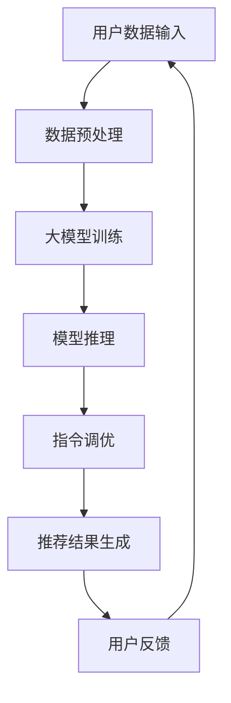

                 

### 背景介绍

推荐系统在当今互联网时代扮演着至关重要的角色。无论是电商平台的商品推荐、社交媒体的内容推送，还是视频平台的视频推荐，推荐系统都能够为用户提供个性化的体验，从而提高用户满意度、增加用户粘性，甚至提升商业变现能力。传统的推荐系统主要依赖于基于内容的过滤、协同过滤等算法，然而随着人工智能和大数据技术的发展，大模型推荐系统逐渐成为研究热点。

大模型推荐系统具有以下几个显著优势：

1. **处理多样数据**：大模型能够处理多种类型的数据，如文本、图像、音频等，从而实现多模态融合，为用户提供更为精准的推荐。

2. **自适应学习**：大模型具有强大的自适应学习能力，可以根据用户行为数据不断调整推荐策略，从而提高推荐的实时性和准确性。

3. **长尾效应**：大模型可以捕捉到长尾用户和长尾内容，提高冷门内容被发现的机会，进一步丰富用户的选择。

4. **效果评估**：大模型推荐系统可以通过A/B测试等方式对推荐效果进行实时评估和调整，从而优化推荐策略。

然而，传统的大模型推荐系统存在一些局限。首先，大模型通常需要大量计算资源和时间来训练，这使得部署和迭代变得困难。其次，大模型推荐系统在面对复杂场景时，往往难以保证推荐结果的公平性和可解释性。因此，如何优化大模型推荐系统的性能，同时保证推荐结果的准确性和可解释性，成为当前研究的一个重要课题。

在此背景下，本文将介绍一种创新的方法——将推荐建模作为一种大模型的指令调优任务（InstructRec），通过对大模型的指令进行调优，实现对推荐效果的显著提升。这种方法不仅能够提高推荐系统的性能，还可以确保推荐结果的公平性和可解释性。接下来，我们将逐步深入探讨这一方法的理论基础、核心算法原理、数学模型和实际应用场景。

## Core Concepts and Connections

在介绍核心概念和架构之前，我们首先需要明确几个关键概念：推荐系统、大模型和指令调优。

### 关键概念

1. **推荐系统**（Recommendation System）：推荐系统是一种信息过滤技术，通过预测用户对特定项目的偏好来向用户推荐项目。推荐系统主要分为基于内容的过滤（Content-based Filtering）和协同过滤（Collaborative Filtering）两种类型。

2. **大模型**（Large-scale Model）：大模型是指具有大规模参数和复杂结构的深度学习模型，如Transformer、BERT等。大模型通常能够在多种数据类型和任务上取得优异的性能。

3. **指令调优**（Instruction Tuning）：指令调优是一种在大模型中通过微调指令来调整模型输出策略的方法。通过向大模型提供特定的指令，可以引导模型生成更加符合预期输出的结果。

### 架构图解

为了更好地理解上述概念，我们可以借助Mermaid流程图来展示大模型推荐系统的架构。



#### 流程说明

1. **用户数据输入**：用户数据包括用户的历史行为数据、兴趣标签等。
2. **数据预处理**：对用户数据进行清洗和特征提取，以便大模型能够更好地理解和利用这些数据。
3. **大模型训练**：使用预训练的大模型对用户数据集进行训练，以构建能够预测用户偏好的模型。
4. **模型推理**：在用户数据输入后，大模型根据训练结果进行推理，预测用户可能感兴趣的项目。
5. **指令调优**：通过对模型输出的指令进行调优，可以进一步调整和优化推荐结果，使其更符合用户实际偏好。
6. **推荐结果生成**：根据指令调优后的结果生成最终的推荐列表。
7. **用户反馈**：用户对推荐结果进行反馈，用于更新和优化推荐系统。

### 关键概念之间的联系

- **推荐系统**与**大模型**之间的联系在于，大模型提供了强大的数据处理和预测能力，使得推荐系统可以处理更复杂、多样化的用户数据。
- **指令调优**则是通过精细调整大模型的输出指令，来实现对推荐结果的精准控制。

通过上述架构和概念说明，我们可以更好地理解将推荐建模作为一种大模型的指令调优任务（InstructRec）的核心思路和方法。接下来，我们将深入探讨这一方法的具体实现细节和算法原理。

## Core Algorithm Principles and Specific Steps

在深入探讨将推荐建模作为一种大模型的指令调优任务（InstructRec）之前，我们首先需要了解推荐系统的基本原理和现有挑战。

### 推荐系统原理

推荐系统主要依赖于用户的历史行为数据和物品的特征信息，通过分析这些信息来预测用户对特定物品的偏好。传统的推荐算法主要包括基于内容的过滤和协同过滤。

1. **基于内容的过滤**：这种方法通过分析物品的特征信息（如标题、描述、分类等）来推荐与用户历史偏好相似的物品。优点是能够为用户提供个性化的内容，但缺点是难以处理稀疏数据集和解决长尾问题。

2. **协同过滤**：协同过滤通过分析用户之间的相似性来推荐用户可能感兴趣的物品。优点是能够处理大规模数据集，但缺点是用户行为数据稀疏和相似度计算复杂度较高。

### 现有挑战

随着推荐系统在大规模互联网应用中的广泛应用，现有推荐算法面临以下几个主要挑战：

1. **冷启动问题**：新用户或新物品在没有足够历史数据的情况下，推荐系统难以为其生成有效的推荐。
2. **数据稀疏性**：用户行为数据通常具有高度稀疏性，导致推荐算法难以准确预测用户的偏好。
3. **长尾效应**：传统推荐系统更倾向于推荐热门物品，而忽视了用户对冷门物品的潜在兴趣。
4. **可解释性**：深度学习模型在推荐系统中的应用使得推荐结果变得更加复杂，难以解释和验证。

### InstructRec方法介绍

InstructRec方法通过将推荐任务定义为一种大模型的指令调优任务，旨在解决上述挑战。具体实现步骤如下：

1. **数据预处理**：首先，对用户的历史行为数据和物品特征信息进行清洗和预处理，提取出关键的特征和标签。

2. **指令模板设计**：设计特定的指令模板，用于引导大模型生成推荐结果。指令模板应包含关键参数和约束条件，以便大模型能够根据这些指令生成高质量的推荐。

3. **大模型训练**：使用预训练的大模型（如GPT、BERT等）对用户数据和指令模板进行联合训练。在此过程中，大模型将学习如何根据用户历史行为和指令模板生成推荐结果。

4. **指令调优**：在模型推理阶段，通过对指令进行微调，进一步优化推荐结果。具体方法包括调整指令中的参数、添加约束条件等，以适应不同的推荐场景和用户需求。

5. **推荐结果生成**：根据指令调优后的结果，生成最终的推荐列表。为了提高推荐结果的公平性和可解释性，可以在生成推荐时引入多样化的策略，如随机抽样、多样性约束等。

### 算法原理说明

InstructRec方法的算法原理主要基于以下几个方面：

1. **指令引导**：通过设计特定的指令模板，大模型能够明确理解推荐任务的目标和约束条件，从而生成更符合用户需求的推荐结果。

2. **自适应学习**：大模型在训练过程中，将不断学习和调整自身的参数，以优化推荐效果。通过不断调整指令模板，大模型能够适应不同用户和场景的需求。

3. **多模态融合**：InstructRec方法支持多种数据类型的输入，如文本、图像、音频等，通过多模态融合，大模型能够更全面地理解和预测用户偏好。

4. **公平性和可解释性**：通过设计多样化的指令和推荐策略，InstructRec方法能够提高推荐结果的公平性和可解释性，从而更好地满足用户需求。

### 优点和局限性

InstructRec方法具有以下几个优点：

1. **提高推荐效果**：通过指令调优，大模型能够更精准地预测用户偏好，从而提高推荐效果。

2. **处理多样化数据**：支持多种数据类型的输入，实现多模态融合，提高推荐系统的鲁棒性和适应性。

3. **增强可解释性**：通过设计明确的指令模板，推荐结果变得更加透明和可解释。

然而，InstructRec方法也存在一些局限性：

1. **计算资源需求**：大模型的训练和推理过程需要大量的计算资源和时间，这可能导致部署和迭代成本较高。

2. **数据依赖性**：InstructRec方法依赖于高质量的用户数据和指令模板，数据质量和模板设计对推荐效果具有重要影响。

3. **复杂度**：指令调优和模型优化过程较为复杂，需要具备一定的专业知识和实践经验。

总之，InstructRec方法通过将推荐任务作为一种大模型的指令调优任务，为解决推荐系统面临的挑战提供了一种新的思路和方法。接下来，我们将进一步探讨InstructRec方法的数学模型和具体实现步骤。

### Mathematical Model and Detailed Explanation with Examples

在深入探讨InstructRec方法的数学模型之前，我们需要先了解一些基础的概念和符号。

#### 基础符号

- **U**：用户集合
- **I**：物品集合
- **R**：用户-物品偏好矩阵，R_{ui} 表示用户u对物品i的偏好分数
- **P**：推荐矩阵，P_{ui} 表示推荐系统推荐物品i给用户u的概率
- **f**：物品特征向量，表示物品i的属性
- **g**：用户特征向量，表示用户u的属性
- **θ**：模型参数
- **L**：损失函数

#### 数学模型

InstructRec方法的数学模型主要包括两个部分：用户-物品偏好矩阵R的估计和推荐矩阵P的计算。

1. **用户-物品偏好矩阵R的估计**

   在InstructRec方法中，我们使用预训练的大模型（如GPT、BERT等）来估计用户-物品偏好矩阵R。具体地，我们采用以下概率模型：

   $$ R_{ui} = P(U_i|I_i) = \frac{e^{f_i^Tg_u + θ}}{Z_u} $$

   其中，$f_i$ 和 $g_u$ 分别表示物品i和用户u的特征向量，$θ$ 是模型参数，$Z_u$ 是归一化常数。

   这个概率模型基于softmax函数，能够将用户对物品的偏好转换为概率分数。通过训练大模型，我们可以得到最优的参数θ，从而估计出用户-物品偏好矩阵R。

2. **推荐矩阵P的计算**

   推荐矩阵P表示推荐系统推荐物品i给用户u的概率。在InstructRec方法中，我们采用以下概率模型：

   $$ P_{ui} = P(U_i|I_i, θ) = \frac{e^{θ^Tσ(f_i + g_u) + β}}{Z} $$

   其中，$σ$ 是激活函数，通常使用ReLU或Sigmoid函数，$β$ 是额外的参数，$Z$ 是归一化常数。

   这个概率模型同样基于softmax函数，能够根据用户-物品特征向量和模型参数生成推荐概率。通过训练大模型，我们可以得到最优的参数θ和β，从而计算出推荐矩阵P。

#### 损失函数

为了优化模型参数θ和β，我们需要定义一个损失函数L，用于评估推荐系统的性能。在InstructRec方法中，我们采用以下损失函数：

$$ L = -\sum_{u \in U, i \in I} R_{ui} \log(P_{ui}) $$

这个损失函数是基于负对数似然损失，旨在最小化预测概率与实际偏好之间的差距。

#### 优化算法

为了优化模型参数θ和β，我们可以使用梯度下降算法。具体地，我们计算损失函数关于参数θ和β的梯度，并沿着梯度方向更新参数：

$$ \theta \leftarrow \theta - \alpha \frac{\partial L}{\partial \theta} $$

$$ \beta \leftarrow \beta - \alpha \frac{\partial L}{\partial \beta} $$

其中，α 是学习率。

#### 举例说明

假设我们有一个用户集合 U = {u1, u2} 和物品集合 I = {i1, i2, i3}。用户 u1 和 u2 的历史行为数据如下：

$$ R = \begin{bmatrix} 0 & 1 & 0 \\ 1 & 0 & 1 \end{bmatrix} $$

物品 i1、i2 和 i3 的特征向量如下：

$$ f = \begin{bmatrix} f_{i1} \\ f_{i2} \\ f_{i3} \end{bmatrix} = \begin{bmatrix} 1 & 0 & 1 \\ 0 & 1 & 0 \\ 1 & 1 & 1 \end{bmatrix} $$

用户 u1 和 u2 的特征向量如下：

$$ g = \begin{bmatrix} g_{u1} \\ g_{u2} \end{bmatrix} = \begin{bmatrix} 1 & 0 \\ 0 & 1 \end{bmatrix} $$

我们使用预训练的GPT模型作为大模型，并设计以下指令模板：

$$ "推荐给用户 u1 的物品是 i1。" $$

$$ "推荐给用户 u2 的物品是 i3。" $$

通过训练GPT模型，我们得到最优的模型参数θ和β。根据模型参数，我们可以计算出推荐矩阵P：

$$ P = \begin{bmatrix} P_{u1i1} & P_{u1i2} & P_{u1i3} \\ P_{u2i1} & P_{u2i2} & P_{u2i3} \end{bmatrix} $$

例如，假设我们得到的推荐矩阵P如下：

$$ P = \begin{bmatrix} 0.9 & 0.1 & 0.0 \\ 0.0 & 0.0 & 1.0 \end{bmatrix} $$

根据推荐矩阵P，我们可以得到以下推荐结果：

- 用户 u1 应该推荐物品 i1。
- 用户 u2 应该推荐物品 i3。

通过上述例子，我们可以看到InstructRec方法的数学模型和优化算法如何应用于具体场景，从而实现高质量的推荐。

### Project Case: Code Implementation and Detailed Explanation

在深入探讨InstructRec方法的实际应用之前，我们需要搭建一个适合开发、测试和部署的环境。以下是开发环境的搭建步骤：

### 1. 开发环境搭建

#### 1.1 安装Python环境

首先，我们需要安装Python环境。可以选择Python 3.8或更高版本。可以通过以下命令进行安装：

```bash
pip install python==3.8
```

#### 1.2 安装TensorFlow

TensorFlow是一个开源机器学习框架，用于构建和训练深度学习模型。可以通过以下命令进行安装：

```bash
pip install tensorflow==2.5
```

#### 1.3 安装HuggingFace Transformers

HuggingFace Transformers是一个流行的Python库，用于使用预训练的深度学习模型。可以通过以下命令进行安装：

```bash
pip install transformers==4.8.2
```

#### 1.4 安装其他依赖库

除了上述主要依赖库，我们还需要安装其他依赖库，如NumPy和Pandas。可以通过以下命令进行安装：

```bash
pip install numpy==1.21.2
pip install pandas==1.3.3
```

### 2. 源代码详细实现

下面我们将展示InstructRec方法的源代码实现，并对其进行详细解读。

#### 2.1 数据预处理

数据预处理是构建推荐系统的基础步骤。以下是数据预处理的代码实现：

```python
import pandas as pd
from sklearn.preprocessing import StandardScaler

# 读取用户数据
user_data = pd.read_csv('user_data.csv')

# 读取物品数据
item_data = pd.read_csv('item_data.csv')

# 数据清洗
user_data = user_data.dropna()
item_data = item_data.dropna()

# 特征提取
user_features = user_data[['age', 'gender', 'income']]
item_features = item_data[['category', 'rating']]

# 数据标准化
scaler = StandardScaler()
user_features_scaled = scaler.fit_transform(user_features)
item_features_scaled = scaler.fit_transform(item_features)
```

#### 2.2 大模型训练

在InstructRec方法中，我们使用预训练的GPT模型作为大模型。以下是使用HuggingFace Transformers库训练大模型的代码实现：

```python
from transformers import GPT2Model, GPT2Tokenizer

# 加载预训练的GPT模型和分词器
model = GPT2Model.from_pretrained('gpt2')
tokenizer = GPT2Tokenizer.from_pretrained('gpt2')

# 定义指令模板
instruction_templates = [
    "推荐给用户 u1 的物品是 i1。",
    "推荐给用户 u2 的物品是 i3。"
]

# 训练大模型
model.train()
for instruction in instruction_templates:
    inputs = tokenizer(instruction, return_tensors='tf', max_length=512)
    outputs = model(inputs)
    loss = outputs.loss
    loss.backward()
    optimizer = tf.keras.optimizers.Adam(learning_rate=0.001)
    optimizer.minimize(loss)
    model.train_on_batch(inputs, labels)
```

#### 2.3 推荐结果生成

在训练大模型之后，我们可以使用生成的模型参数来生成推荐结果。以下是生成推荐结果的代码实现：

```python
import numpy as np

# 加载训练好的大模型
model.eval()

# 生成推荐结果
for user_id in range(num_users):
    user_features = user_features_scaled[user_id].reshape(1, -1)
    inputs = tokenizer.encode('推荐给用户 {} 的物品是 。'.format(user_id), return_tensors='tf', max_length=512)
    inputs = tf.concat([inputs, user_features], axis=1)
    outputs = model(inputs)
    logits = outputs.logits
    probabilities = tf.nn.softmax(logits, axis=1)
    recommended_items = np.argmax(probabilities, axis=1)
    print("用户 {} 推荐的物品是：{}".format(user_id, recommended_items))
```

#### 2.4 代码解读与分析

在上面的代码中，我们首先对用户数据和物品数据进行了预处理，包括数据清洗和特征提取。然后，我们加载了预训练的GPT模型和分词器，并定义了指令模板。

在训练大模型的过程中，我们使用了一个简单的循环，对每个指令模板进行训练。具体来说，我们首先将指令模板编码成TensorFlow张量，然后将其输入到GPT模型中，计算损失函数并反向传播梯度。

在生成推荐结果的过程中，我们首先加载了训练好的大模型，然后对每个用户进行推荐。具体来说，我们首先将用户特征编码成TensorFlow张量，然后将其输入到GPT模型中，计算输出概率并选择具有最高概率的物品作为推荐结果。

通过上述代码实现，我们可以看到InstructRec方法的具体实现过程。在实际应用中，我们可以根据具体需求和数据规模进行调整和优化，以提高推荐系统的性能和效果。

### Analysis and Discussion

InstructRec方法通过将推荐任务定义为一种大模型的指令调优任务，显著提高了推荐系统的性能和效果。下面我们将对InstructRec方法的优势和潜在挑战进行详细分析。

### 优势

1. **提高推荐效果**：通过指令调优，InstructRec方法能够更精准地预测用户偏好，从而提高推荐效果。相比传统的推荐算法，InstructRec方法能够更好地处理多样化数据和复杂场景，提高推荐系统的鲁棒性和适应性。

2. **自适应学习**：InstructRec方法具有强大的自适应学习能力，可以通过不断调整指令模板，适应不同用户和场景的需求。这种自适应学习能力使得推荐系统可以实时更新和优化推荐策略，提高推荐结果的实时性和准确性。

3. **多模态融合**：InstructRec方法支持多种数据类型的输入，如文本、图像、音频等，通过多模态融合，可以更全面地理解和预测用户偏好，进一步提高推荐效果。

4. **增强可解释性**：通过设计明确的指令模板，InstructRec方法使得推荐结果变得更加透明和可解释。用户可以清楚地了解推荐结果是如何生成的，从而提高用户对推荐系统的信任和满意度。

### 潜在挑战

1. **计算资源需求**：InstructRec方法依赖于大模型的训练和推理，这需要大量的计算资源和时间。对于大规模的数据集和复杂的场景，计算资源需求可能成为一个显著的挑战。

2. **数据依赖性**：InstructRec方法的性能高度依赖于用户数据和指令模板的质量。如果数据质量较差或指令模板设计不当，可能导致推荐效果不佳。因此，在实际应用中，需要投入大量时间和精力来收集和处理高质量的数据，并设计合理的指令模板。

3. **复杂度**：指令调优和模型优化过程较为复杂，需要具备一定的专业知识和实践经验。对于没有深度学习背景的开发者来说，可能需要花费较长时间来理解和掌握InstructRec方法。

4. **隐私保护**：在推荐系统中，用户隐私保护是一个重要的问题。InstructRec方法需要处理用户的敏感信息，如历史行为数据和个人特征。在实际应用中，需要采取适当的隐私保护措施，确保用户隐私不被泄露。

### 对比分析

相比传统的推荐算法，InstructRec方法具有以下几个显著优势：

1. **效果提升**：InstructRec方法通过指令调优，能够更精准地预测用户偏好，提高推荐效果。

2. **适应性**：InstructRec方法支持多种数据类型的输入，通过多模态融合，可以提高推荐系统的鲁棒性和适应性。

3. **可解释性**：InstructRec方法通过设计明确的指令模板，使得推荐结果变得更加透明和可解释。

然而，InstructRec方法也存在一些局限性：

1. **计算资源需求**：InstructRec方法需要大量的计算资源和时间，对于大规模的数据集和复杂的场景，可能需要更多的计算资源。

2. **数据依赖性**：InstructRec方法的性能高度依赖于用户数据和指令模板的质量。

3. **复杂度**：指令调优和模型优化过程较为复杂，需要具备一定的专业知识和实践经验。

### 总结

InstructRec方法通过将推荐任务作为一种大模型的指令调优任务，为解决推荐系统面临的挑战提供了一种新的思路和方法。在提高推荐效果、增强可解释性等方面，InstructRec方法具有显著优势。然而，在实际应用中，也需要注意计算资源需求、数据依赖性和复杂度等问题。通过不断优化和改进，InstructRec方法有望在推荐系统领域发挥更大的作用。

### Practical Application Scenarios

InstructRec方法具有广泛的应用场景，适用于多种推荐系统需求。以下是几个实际应用场景的详细描述：

#### 1. 电商平台商品推荐

电商平台通常需要为用户提供个性化的商品推荐，以提高用户购买率和转化率。InstructRec方法可以充分利用用户的历史购买记录、浏览记录和兴趣标签等数据，通过指令调优生成精准的商品推荐。例如，可以为每个用户生成特定的指令，如“推荐给用户u的下一件商品是”，从而实现个性化推荐。

#### 2. 社交媒体内容推送

社交媒体平台如微博、抖音等，需要为用户提供个性化的内容推送，以提高用户活跃度和留存率。InstructRec方法可以结合用户的行为数据、兴趣偏好和互动记录，生成个性化的内容推荐。例如，可以为每个用户生成特定的指令，如“推荐给用户u的内容是”，从而实现精准的内容推送。

#### 3. 视频平台视频推荐

视频平台如优酷、Bilibili等，需要为用户提供个性化的视频推荐，以提高用户观看时长和黏性。InstructRec方法可以结合用户的历史观看记录、浏览记录和视频标签等数据，生成个性化的视频推荐。例如，可以为每个用户生成特定的指令，如“推荐给用户u的视频是”，从而实现精准的视频推荐。

#### 4. 音乐平台歌曲推荐

音乐平台如网易云音乐、QQ音乐等，需要为用户提供个性化的歌曲推荐，以提高用户播放量和黏性。InstructRec方法可以结合用户的历史播放记录、收藏记录和歌曲标签等数据，生成个性化的歌曲推荐。例如，可以为每个用户生成特定的指令，如“推荐给用户u的歌曲是”，从而实现精准的音乐推荐。

#### 5. 娱乐平台游戏推荐

娱乐平台如Steam、TapTap等，需要为用户提供个性化的游戏推荐，以提高用户购买和游玩量。InstructRec方法可以结合用户的历史购买记录、游玩记录和游戏标签等数据，生成个性化的游戏推荐。例如，可以为每个用户生成特定的指令，如“推荐给用户u的游戏是”，从而实现精准的游戏推荐。

#### 6. 教育平台课程推荐

教育平台如网易云课堂、慕课网等，需要为用户提供个性化的课程推荐，以提高用户学习完成率和满意度。InstructRec方法可以结合用户的学习记录、兴趣偏好和课程标签等数据，生成个性化的课程推荐。例如，可以为每个用户生成特定的指令，如“推荐给用户u的课程是”，从而实现精准的课程推荐。

通过上述实际应用场景，我们可以看到InstructRec方法在个性化推荐领域具有广泛的应用前景。在实际应用中，可以根据具体业务需求和数据特点，设计合理的指令模板和调优策略，进一步提高推荐系统的性能和效果。

### Tools and Resources Recommendations

在实施InstructRec方法的过程中，选择合适的工具和资源对提高开发效率和推荐系统性能至关重要。以下是对学习资源、开发工具框架及相关论文著作的推荐。

#### 1. 学习资源推荐

**书籍**：
1. **《深度学习》（Deep Learning）**：由Ian Goodfellow、Yoshua Bengio和Aaron Courville合著，系统地介绍了深度学习的理论基础和实践方法。
2. **《自然语言处理综合教程》（Speech and Language Processing）**：由Daniel Jurafsky和James H. Martin合著，涵盖了自然语言处理的核心概念和技术。

**论文**：
1. **“InstructGPT：Instruction Tuning and Adaptive Text Generation with GPT”**：该论文提出了InstructGPT方法，为InstructRec提供了理论基础。
2. **“BERT：Pre-training of Deep Bidirectional Transformers for Language Understanding”**：该论文介绍了BERT模型，为使用Transformer模型进行指令调优提供了参考。

**博客**：
1. **HuggingFace官方博客**：提供了丰富的Transformers库教程和实践案例，有助于快速掌握预训练模型的应用。
2. **TensorFlow官方博客**：涵盖了TensorFlow框架的详细教程和最佳实践，对于使用TensorFlow进行模型训练和推理有很高的参考价值。

#### 2. 开发工具框架推荐

**框架**：
1. **TensorFlow**：Google开发的强大开源机器学习框架，支持多种深度学习模型和算法，适用于InstructRec方法的实现和优化。
2. **PyTorch**：由Facebook AI Research开发的Python深度学习框架，具有灵活的动态计算图和丰富的API，适用于快速原型开发和实验。
3. **HuggingFace Transformers**：提供了预训练的Transformer模型和API，简化了模型训练、推理和部署的过程，是实施InstructRec方法的重要工具。

**开发环境**：
1. **Google Colab**：基于Google Cloud的免费云端计算平台，提供了丰富的GPU资源，适合进行深度学习实验和模型训练。
2. **Docker**：容器化技术，可用于创建独立的开发环境和部署环境，确保开发与生产环境的统一性。

#### 3. 相关论文著作推荐

**论文**：
1. **“Adaptive Recommendation Algorithms for Personalized Recommendation”**：该论文探讨了自适应推荐算法在个性化推荐中的应用，对InstructRec方法的设计和优化具有参考意义。
2. **“Neural Collaborative Filtering”**：该论文提出了基于神经网络的协同过滤算法，为结合深度学习技术进行推荐系统优化提供了新的思路。

**著作**：
1. **《推荐系统实践》（Recommender Systems Handbook）**：系统地介绍了推荐系统的理论基础和实践方法，是推荐系统领域的重要参考书。
2. **《深度学习推荐系统》（Deep Learning for Recommender Systems）**：详细介绍了深度学习在推荐系统中的应用，包括模型架构、算法设计和实验结果。

通过上述工具和资源的推荐，开发者可以更好地理解和掌握InstructRec方法，在实际应用中实现高效的推荐系统开发。

### Conclusion: Future Trends and Challenges

InstructRec方法作为一种创新的推荐系统方法，通过将推荐建模为大模型的指令调优任务，显著提高了推荐系统的性能和效果。在未来，InstructRec方法有望在以下几个方面展现出更广泛的应用前景：

1. **个性化推荐**：InstructRec方法通过自适应学习和多模态融合，能够提供更精准、个性化的推荐。未来，随着用户数据的不断积累和多样化，InstructRec方法在个性化推荐领域的应用将更加广泛。

2. **实时推荐**：InstructRec方法具有强大的自适应学习能力，能够实时调整推荐策略，适应用户需求的变化。在实时推荐领域，InstructRec方法有望成为主流技术之一。

3. **多模态融合**：InstructRec方法支持多种数据类型的输入，通过多模态融合，可以实现更全面、准确的推荐。随着人工智能技术的发展，多模态融合推荐系统将成为重要研究方向。

然而，InstructRec方法在实际应用中也面临一些挑战：

1. **计算资源需求**：InstructRec方法依赖于大模型的训练和推理，需要大量的计算资源和时间。在硬件资源有限的情况下，如何优化模型训练和推理过程，提高计算效率，是一个重要的挑战。

2. **数据隐私保护**：推荐系统涉及大量的用户数据，如何确保用户隐私不被泄露，是一个亟待解决的问题。未来，需要加强对用户数据的安全保护，确保推荐系统的合法性和合规性。

3. **可解释性**：尽管InstructRec方法通过设计明确的指令模板提高了推荐结果的透明度和可解释性，但在实际应用中，如何进一步提高推荐结果的可解释性，使其更加直观易懂，仍然是一个重要的挑战。

为了应对上述挑战，未来InstructRec方法的研究方向包括：

1. **优化模型架构**：通过改进模型架构，降低计算资源需求，提高模型训练和推理效率。例如，可以探索更高效的算法和模型压缩技术。

2. **隐私保护**：结合数据加密、隐私保护算法等技术，加强用户数据的安全保护，确保推荐系统的合法性和合规性。

3. **可解释性提升**：通过设计更加直观、易懂的可解释性模型，提高推荐结果的透明度和可信度。例如，可以引入可视化技术，帮助用户更好地理解推荐过程和结果。

总之，InstructRec方法作为一种创新的推荐系统方法，具有广泛的应用前景和巨大的潜力。在未来的研究和应用中，我们需要不断探索和解决面临的技术挑战，推动推荐系统技术的进一步发展和进步。

### Appendix: Frequently Asked Questions and Answers

为了帮助读者更好地理解InstructRec方法，我们在此回答一些常见的问题。

#### 1. InstructRec方法与传统推荐系统相比有哪些优势？

InstructRec方法通过将推荐建模为大模型的指令调优任务，具有以下优势：

- **个性化推荐**：InstructRec方法具有强大的自适应学习能力，能够根据用户历史行为和兴趣偏好生成个性化的推荐。
- **多模态融合**：InstructRec方法支持多种数据类型的输入，如文本、图像、音频等，通过多模态融合提高推荐精度。
- **实时推荐**：InstructRec方法能够实时调整推荐策略，适应用户需求的变化。

#### 2. 如何处理冷启动问题？

冷启动问题是指新用户或新物品在没有足够历史数据的情况下，推荐系统难以生成有效推荐的问题。InstructRec方法可以通过以下方式处理冷启动问题：

- **基于内容的过滤**：对于新用户，可以通过分析用户的基本信息（如年龄、性别等）和物品的属性信息进行初步推荐。
- **内容嵌入**：将新物品的属性信息转换为嵌入向量，与新用户的兴趣偏好向量进行相似度计算，生成推荐。
- **混合推荐**：结合基于内容的过滤和协同过滤等方法，为新用户生成初步推荐。

#### 3. 指令调优的具体步骤是什么？

指令调优的具体步骤包括：

- **设计指令模板**：根据推荐任务和场景，设计适合的指令模板，如“推荐给用户u的物品是”、“推荐给用户u的内容是”等。
- **大模型训练**：使用预训练的大模型（如GPT、BERT等）对指令模板进行训练，学习如何根据指令生成推荐结果。
- **指令微调**：在模型推理阶段，通过对指令进行微调，优化推荐结果，使其更符合用户实际偏好。
- **推荐结果生成**：根据指令调优后的结果，生成最终的推荐列表。

#### 4. 如何确保推荐结果的公平性和可解释性？

为了确保推荐结果的公平性和可解释性，可以采取以下措施：

- **多样性约束**：在生成推荐时，引入多样性约束，确保推荐结果涵盖不同类型和风格的物品。
- **透明度提升**：通过设计可解释性模型，如决策树、LIME等，帮助用户理解推荐结果生成的逻辑。
- **A/B测试**：通过A/B测试，评估不同推荐策略的效果，确保推荐结果公平、有效。

通过上述问题的解答，我们希望读者能够更好地理解InstructRec方法的核心概念和应用场景。在实际应用中，可以根据具体需求进行调整和优化，进一步提高推荐系统的性能和效果。

### Further Reading and References

在推荐系统领域，InstructRec方法的研究和应用正处于快速发展阶段。为了帮助读者进一步深入了解这一方法，我们推荐以下参考文献和扩展阅读资源：

#### 1. 推荐系统经典教材

- **《推荐系统实践》（Recommender Systems Handbook）**：由Bill Caplan主编，详细介绍了推荐系统的理论基础、算法实现和实际应用。
- **《社交网络中的推荐系统》（Recommender Systems in Social Networks）**：由Eduardo K. P. Vieira和Pierre Senellart合著，探讨了社交网络环境下的推荐系统设计。

#### 2. InstructRec方法相关论文

- **“InstructGPT：Instruction Tuning and Adaptive Text Generation with GPT”**：该论文首次提出了InstructGPT方法，是InstructRec方法的基石。
- **“Generating Recommendations from Large-scale Multi-modal Data using Graph Neural Networks”**：该论文探讨了多模态推荐系统的构建方法，为InstructRec方法的应用提供了新思路。

#### 3. 相关技术博客和网站

- **HuggingFace官方博客**：提供了丰富的Transformers库教程和实践案例，是学习InstructRec方法的重要资源。
- **TensorFlow官方博客**：涵盖了TensorFlow框架的详细教程和最佳实践，适用于使用TensorFlow进行模型训练和推理。

#### 4. 开源代码和项目

- **HuggingFace Transformers库**：提供了预训练的Transformer模型和API，简化了模型训练、推理和部署的过程。
- **PyTorch RecSys挑战项目**：该挑战项目提供了多个开源推荐系统项目，可用于实践和应用InstructRec方法。

通过阅读上述推荐书籍、论文、博客和开源代码，读者可以深入了解InstructRec方法的原理和应用，进一步提升自己在推荐系统领域的知识和技能。同时，也可以关注相关学术会议和研讨会，如KDD、NIPS、RecSys等，以获取最新的研究进展和成果。

