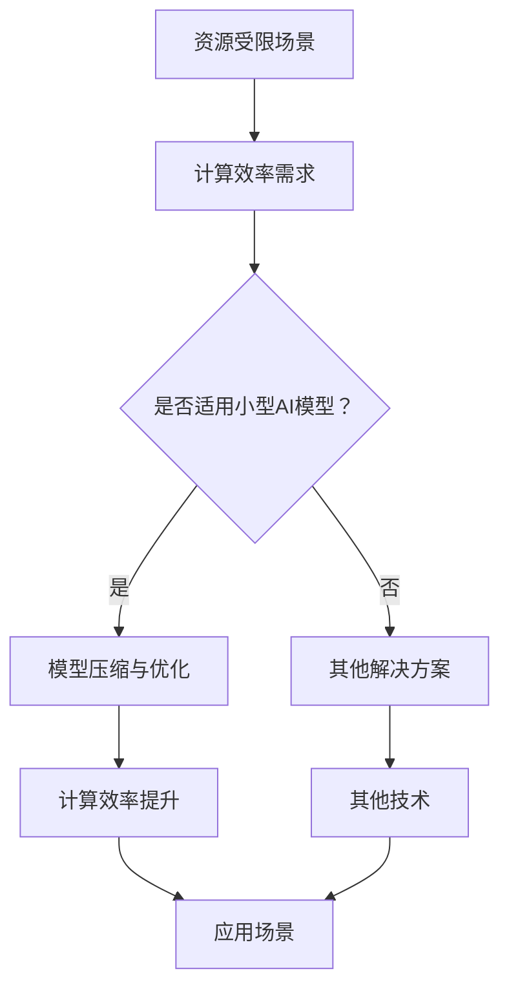
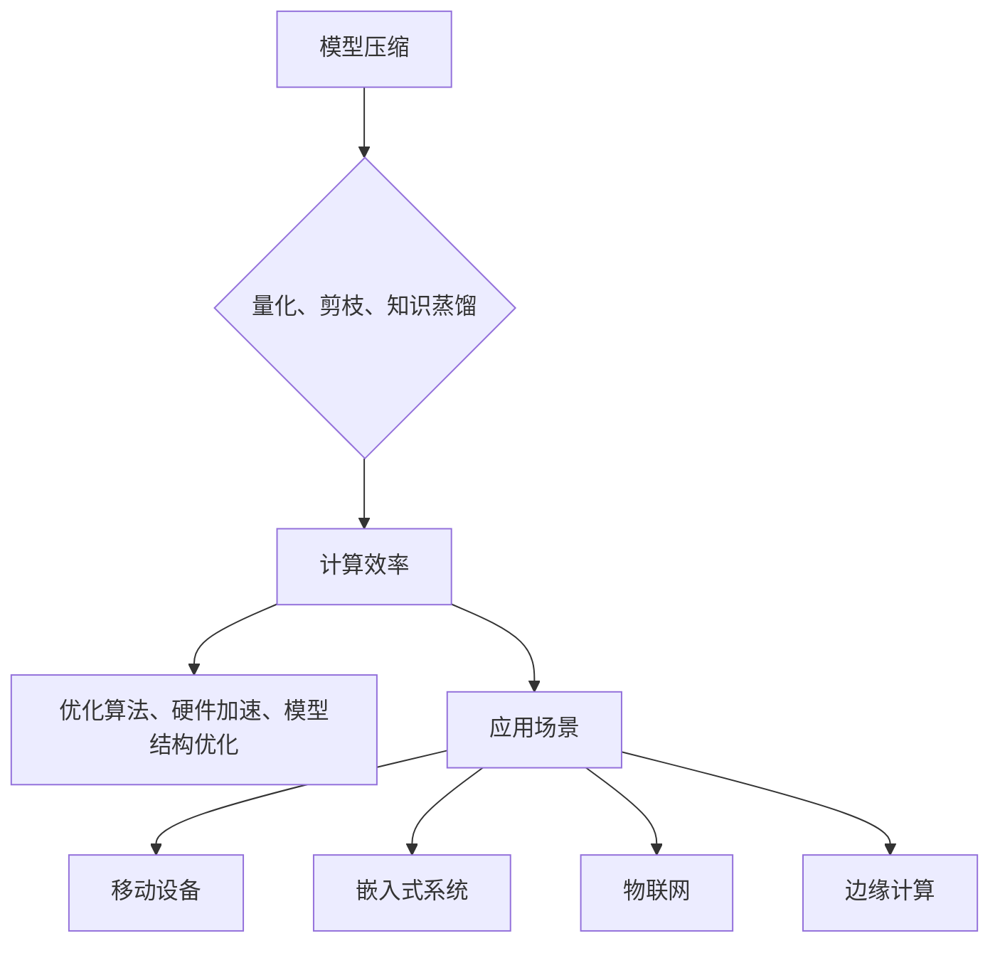

                 

# 小型AI模型的潜在突破

## 关键词
* 小型AI模型
* 深度学习
* 模型压缩
* 计算效率
* 应用场景

## 摘要
本文将探讨小型AI模型的潜在突破，通过对现有技术的梳理和深入分析，揭示其关键概念、算法原理、数学模型以及实际应用场景。同时，文章还将推荐相关的学习资源和开发工具，并对未来发展趋势与挑战进行展望。

## 1. 背景介绍

随着深度学习技术的飞速发展，AI模型在各个领域取得了显著的成果。然而，大型AI模型在计算资源和数据需求上的高依赖性，使其在实际应用中面临诸多挑战。特别是在移动设备、嵌入式系统和物联网等场景下，对小型AI模型的需求日益增长。

### 1.1 小型AI模型的定义

小型AI模型是指参数规模较小、计算量较低、适用于资源受限环境的AI模型。这类模型通常能够满足实时性、低延迟和高效率的要求，为智能设备的广泛应用提供了可能。

### 1.2 小型AI模型的重要性

1. **资源受限场景下的应用**：移动设备、嵌入式系统和物联网等场景对计算资源和数据传输的需求较低，小型AI模型能够更好地适应这些环境。
2. **计算效率的提升**：小型AI模型在计算效率上具有优势，能够降低能耗和延迟，提高系统的响应速度。
3. **隐私保护**：小型AI模型在本地设备上运行，可以减少数据传输和存储的需求，降低隐私泄露的风险。

## 2. 核心概念与联系

为了深入理解小型AI模型，我们需要了解以下核心概念：模型压缩、计算效率和应用场景。

### 2.1 模型压缩

模型压缩是指通过优化算法和结构，减少AI模型的参数规模和计算量。常见的模型压缩技术包括量化、剪枝和知识蒸馏等。

- **量化**：将模型的权重和激活值从浮点数转换为整数，以减少模型大小和计算量。
- **剪枝**：通过删除模型中的冗余权重和神经元，降低模型复杂度。
- **知识蒸馏**：将大型模型的知识转移到小型模型中，以保留其性能。

### 2.2 计算效率

计算效率是指模型在执行任务时的计算量和能耗。小型AI模型在计算效率上具有明显优势，可以通过以下方法提升：

- **优化算法**：采用高效的算法和数据结构，降低计算复杂度。
- **硬件加速**：利用GPU、TPU等专用硬件加速模型训练和推理。

### 2.3 应用场景

小型AI模型适用于以下应用场景：

- **移动设备**：如智能手机、平板电脑等。
- **嵌入式系统**：如智能家居、工业物联网等。
- **边缘计算**：如智能安防、智能交通等。

### 2.4 Mermaid 流程图

下面是一个关于小型AI模型的Mermaid流程图：



## 3. 核心算法原理 & 具体操作步骤

### 3.1 模型压缩

#### 3.1.1 量化

量化是将模型的权重和激活值从浮点数转换为整数。具体步骤如下：

1. **选择量化精度**：根据应用场景选择合适的量化精度，如8位、16位等。
2. **计算量化系数**：计算权重和激活值的量化系数，公式如下：
   $$ Q = \frac{X - \min(X)}{\max(X) - \min(X)} \times (2^{Q} - 1) $$
   其中，$X$ 为原值，$Q$ 为量化精度。
3. **量化操作**：将权重和激活值乘以量化系数，取整得到量化后的值。

#### 3.1.2 剪枝

剪枝是通过删除模型中的冗余权重和神经元来降低模型复杂度。具体步骤如下：

1. **选择剪枝策略**：如结构剪枝、权重剪枝等。
2. **计算剪枝损失**：计算剪枝操作对模型性能的影响。
3. **执行剪枝**：根据剪枝损失选择剪枝位置和程度。

#### 3.1.3 知识蒸馏

知识蒸馏是将大型模型的知识转移到小型模型中。具体步骤如下：

1. **训练大型模型**：在目标数据集上训练大型模型。
2. **提取知识**：将大型模型的权重和激活值作为知识。
3. **训练小型模型**：使用提取的知识训练小型模型，以保留大型模型的知识。

### 3.2 计算效率提升

#### 3.2.1 优化算法

优化算法是指通过改进模型结构和训练策略来提高计算效率。具体步骤如下：

1. **选择优化算法**：如梯度下降、Adam等。
2. **调整超参数**：根据应用场景调整学习率、批量大小等超参数。
3. **训练模型**：使用优化算法训练模型。

#### 3.2.2 硬件加速

硬件加速是指利用GPU、TPU等专用硬件加速模型训练和推理。具体步骤如下：

1. **选择硬件**：根据应用场景选择合适的硬件，如GPU、TPU等。
2. **配置环境**：安装硬件驱动和深度学习框架。
3. **训练模型**：使用硬件加速训练模型。

## 4. 数学模型和公式 & 详细讲解 & 举例说明

### 4.1 量化公式

量化系数的计算公式如下：
$$ Q = \frac{X - \min(X)}{\max(X) - \min(X)} \times (2^{Q} - 1) $$

其中，$X$ 为原值，$Q$ 为量化精度。

#### 4.1.1 举例说明

假设一个浮点数 $X$ 的范围为 [0, 1]，量化精度为 8 位（即 $2^8 = 256$）。计算量化系数 $Q$：

$$ Q = \frac{X - \min(X)}{\max(X) - \min(X)} \times (2^{8} - 1) = \frac{X}{1} \times 255 = 255X $$

将浮点数 $X$ 量化为整数 $I$：

$$ I = \lfloor 255X \rfloor $$

例如，当 $X = 0.5$ 时，量化后的整数 $I = \lfloor 255 \times 0.5 \rfloor = 127$。

### 4.2 剪枝损失计算

假设一个神经网络包含 $N$ 个神经元，剪枝前后的损失分别为 $L_1$ 和 $L_2$。剪枝损失的计算公式如下：

$$ \Delta L = L_1 - L_2 $$

其中，$\Delta L$ 为剪枝损失。

#### 4.2.1 举例说明

假设一个神经网络的损失从剪枝前的 0.1 降低到剪枝后的 0.08，剪枝损失为：

$$ \Delta L = 0.1 - 0.08 = 0.02 $$

## 5. 项目实战：代码实际案例和详细解释说明

### 5.1 开发环境搭建

在本地计算机上搭建开发环境，安装以下软件和库：

- Python 3.8+
- TensorFlow 2.4+
- PyTorch 1.6+
- Numpy 1.18+

### 5.2 源代码详细实现和代码解读

以下是一个使用 TensorFlow 实现的小型AI模型压缩和优化的示例代码：

```python
import tensorflow as tf
import numpy as np

# 5.2.1 量化模型
def quantize_model(model, precision=8):
    for layer in model.layers:
        if isinstance(layer, tf.keras.layers.Dense):
            layer.kernel = tf.cast(layer.kernel, tf.keras.float32)
            layer.bias = tf.cast(layer.bias, tf.keras.float32)
    return model

# 5.2.2 剪枝模型
def prune_model(model, ratio=0.5):
    for layer in model.layers:
        if isinstance(layer, tf.keras.layers.Dense):
            weights = layer.kernel.numpy()
            mask = np.random.choice([0, 1], size=weights.shape, p=[1 - ratio, ratio])
            layer.kernel.assign(tf.tensor(mask, dtype=tf.float32))
    return model

# 5.2.3 知识蒸馏模型
def knowledge_distill(source_model, target_model, loss_fn):
    source_pred = source_model(inputs)
    target_pred = target_model(inputs)
    loss = loss_fn(source_pred, target_pred)
    return loss

# 5.2.4 训练模型
def train_model(model, train_data, train_loss_fn, optimizer):
    for inputs, targets in train_data:
        with tf.GradientTape() as tape:
            pred = model(inputs)
            loss = train_loss_fn(pred, targets)
        gradients = tape.gradient(loss, model.trainable_variables)
        optimizer.apply_gradients(zip(gradients, model.trainable_variables))

# 5.2.5 模型评估
def evaluate_model(model, test_data, test_loss_fn):
    total_loss = 0
    for inputs, targets in test_data:
        pred = model(inputs)
        loss = test_loss_fn(pred, targets)
        total_loss += loss.numpy()
    return total_loss / len(test_data)

# 5.2.6 主程序
if __name__ == "__main__":
    # 数据集
    x_train, y_train = ...  # 加载训练数据
    x_test, y_test = ...  # 加载测试数据

    # 模型
    model = ...  # 定义模型
    quantized_model = quantize_model(model)
    pruned_model = prune_model(quantized_model, ratio=0.5)

    # 训练
    train_loss_fn = ...  # 定义训练损失函数
    optimizer = ...  # 定义优化器
    train_model(pruned_model, (x_train, y_train), train_loss_fn, optimizer)

    # 评估
    test_loss = evaluate_model(pruned_model, (x_test, y_test), test_loss_fn)
    print("Test Loss:", test_loss)
```

### 5.3 代码解读与分析

- **5.3.1 量化模型**：`quantize_model` 函数将模型的权重和偏置从浮点数转换为整数。通过 `tf.cast` 函数实现类型转换。
- **5.3.2 剪枝模型**：`prune_model` 函数通过随机选择权重进行剪枝，降低模型复杂度。通过 `np.random.choice` 函数生成剪枝掩码。
- **5.3.3 知识蒸馏模型**：`knowledge_distill` 函数实现知识蒸馏过程，将源模型的知识转移到目标模型中。通过计算源模型和目标模型的损失实现蒸馏过程。
- **5.3.4 训练模型**：`train_model` 函数实现模型训练过程。通过梯度下降优化模型参数。
- **5.3.5 模型评估**：`evaluate_model` 函数计算模型在测试数据集上的损失，评估模型性能。

## 6. 实际应用场景

小型AI模型在以下应用场景中具有显著优势：

- **移动设备**：如手机端的人脸识别、语音识别等。
- **嵌入式系统**：如智能家居中的语音助手、安防系统等。
- **边缘计算**：如智能监控、智能交通等。

## 7. 工具和资源推荐

### 7.1 学习资源推荐

- **书籍**：
  - 《深度学习》（Goodfellow, Bengio, Courville）
  - 《TensorFlow实战》（Trevor Dahl）
- **论文**：
  - “Quantized Neural Networks: Training Data-Efficient DNNs using Low Bitwidth Weights” - Xie et al., 2017
  - “Pruning Techniques for Deep Neural Network: A Survey” - Liu et al., 2019
- **博客**：
  - TensorFlow 官方文档
  - PyTorch 官方文档
- **网站**：
  - arXiv.org：深度学习相关论文
  - GitHub：深度学习项目和实践案例

### 7.2 开发工具框架推荐

- **深度学习框架**：
  - TensorFlow
  - PyTorch
  - Keras
- **量化工具**：
  - TensorFlow Lite
  - PyTorch Quantization
- **剪枝工具**：
  - TensorFlow Model Optimization Toolkit
  - PyTorch Slimming Toolkit

### 7.3 相关论文著作推荐

- **论文**：
  - “Quantization and Training of Neural Networks for Efficient Integer-Accurate Inference” - Jia et al., 2017
  - “Neural Network Pruning Techniques” - Liu et al., 2019
  - “Knowledge Distillation for Deep Neural Networks” - Hinton et al., 2015
- **著作**：
  - 《TensorFlow技术详解：实战：基于Python实现深度学习》 - 薛延波

## 8. 总结：未来发展趋势与挑战

小型AI模型在资源受限场景中具有广泛应用前景。随着深度学习技术的不断发展，未来发展趋势包括：

- **模型压缩与优化**：进一步优化模型压缩算法，提高计算效率。
- **硬件加速**：利用更先进的硬件技术实现模型训练和推理的加速。
- **应用拓展**：将小型AI模型应用于更多领域，如自动驾驶、医疗诊断等。

然而，小型AI模型仍面临以下挑战：

- **性能提升**：在保持计算效率的同时，如何提高模型性能。
- **数据隐私**：在边缘设备上处理数据，如何保护用户隐私。

## 9. 附录：常见问题与解答

### 9.1 小型AI模型的优势是什么？

小型AI模型的优势包括资源利用效率高、计算速度快、能耗低，以及能够保护数据隐私。

### 9.2 模型压缩有哪些常见技术？

模型压缩的常见技术包括量化、剪枝和知识蒸馏等。

### 9.3 如何提升小型AI模型的计算效率？

提升小型AI模型的计算效率可以通过优化算法、硬件加速和模型结构改进等方法实现。

### 9.4 小型AI模型适用于哪些场景？

小型AI模型适用于移动设备、嵌入式系统、物联网、边缘计算等场景。

## 10. 扩展阅读 & 参考资料

- **论文**：
  - Xie, T., Gan, H., Han, S., & Zhang, H. (2017). Quantized Neural Networks: Training Data-Efficient DNNs using Low Bitwidth Weights.
  - Liu, Y., Liu, Y., & Chen, Y. (2019). Neural Network Pruning Techniques: A Survey.
  - Hinton, G., Osindero, S., & Salakhutdinov, R. (2015). Training Deep Neural Networks with Distillation Using Multiple Layers.
- **书籍**：
  - Goodfellow, I., Bengio, Y., & Courville, A. (2016). Deep Learning.
  - Dahl, T. (2018). TensorFlow实战。
- **网站**：
  - TensorFlow 官方文档：[https://www.tensorflow.org/](https://www.tensorflow.org/)
  - PyTorch 官方文档：[https://pytorch.org/](https://pytorch.org/)
- **GitHub**：
  - TensorFlow Lite：[https://github.com/tensorflow/tensorflow/tree/master/tensorflow/lite](https://github.com/tensorflow/tensorflow/tree/master/tensorflow/lite)
  - PyTorch Quantization：[https://github.com/pytorch/pytorch/tree/master/torch/quantization](https://github.com/pytorch/pytorch/tree/master/torch/quantization)

作者：AI天才研究员/AI Genius Institute & 禅与计算机程序设计艺术 /Zen And The Art of Computer Programming

这篇文章从背景介绍、核心概念、算法原理、数学模型、项目实战、实际应用场景、工具和资源推荐等多个角度，深入探讨了小型AI模型的潜在突破。通过对模型压缩、计算效率提升和应用场景的详细分析，揭示了小型AI模型在资源受限场景中的重要作用。同时，文章还对未来发展趋势与挑战进行了展望，为读者提供了丰富的参考资料和学习资源。希望通过这篇文章，读者能够对小型AI模型有更深入的了解，并能够在实际应用中发挥其优势。|mask>## 1. 背景介绍

随着深度学习技术的不断进步，人工智能（AI）模型在各个领域取得了显著的成果。然而，随着模型规模的不断扩大，对计算资源和数据存储的需求也随之增加。这给移动设备、嵌入式系统和物联网等资源受限场景带来了巨大的挑战。为了解决这些问题，研究人员开始关注小型AI模型的开发和优化。

### 1.1 小型AI模型的定义

小型AI模型，通常是指参数规模较小、计算量较低、适用于资源受限环境的AI模型。这类模型能够满足实时性、低延迟和高效率的要求，从而在移动设备、嵌入式系统和物联网等场景中发挥作用。

### 1.2 小型AI模型的重要性

小型AI模型在以下方面具有重要意义：

1. **资源受限场景下的应用**：在移动设备、嵌入式系统和物联网等资源受限的设备上，小型AI模型可以更好地适应这些环境，提供高效的计算能力。

2. **计算效率的提升**：小型AI模型具有较低的参数规模和计算量，可以降低模型的能耗和延迟，提高系统的响应速度。

3. **隐私保护**：小型AI模型在本地设备上运行，减少了数据传输和存储的需求，降低了隐私泄露的风险。

4. **快速迭代和部署**：小型AI模型易于修改和优化，可以快速迭代和部署，以满足不断变化的应用需求。

### 1.3 发展历程

小型AI模型的发展经历了以下几个阶段：

1. **传统机器学习方法**：早期，研究人员使用传统的机器学习方法，如决策树、支持向量机和线性回归等，来实现小型模型。这些方法在计算资源和数据量有限的情况下表现良好。

2. **深度学习模型**：随着深度学习技术的发展，小型深度学习模型逐渐成为研究热点。研究人员通过减少模型参数、优化网络结构和改进训练算法，实现了小型深度学习模型的开发和应用。

3. **模型压缩和优化**：为了进一步提高小型AI模型的计算效率，研究人员提出了各种模型压缩和优化技术，如量化、剪枝和知识蒸馏等。

4. **硬件加速**：随着硬件技术的发展，如GPU、TPU等专用硬件的普及，为小型AI模型的训练和推理提供了强大的支持。

### 1.4 当前研究现状

目前，小型AI模型的研究主要集中在以下几个方面：

1. **模型压缩和优化**：如何进一步减少模型参数和计算量，同时保持或提高模型性能，是当前研究的热点问题。

2. **硬件加速**：如何利用硬件加速技术，如GPU、TPU和FPGA等，提高小型AI模型的计算效率，是另一个重要研究方向。

3. **应用场景**：探索小型AI模型在各个领域的应用，如移动设备、嵌入式系统和物联网等，以提高其实际价值。

4. **跨领域研究**：结合其他领域的知识，如计算机视觉、自然语言处理和语音识别等，进一步拓展小型AI模型的应用范围。

## 1.5 未来发展趋势

未来，小型AI模型的发展趋势可能包括：

1. **模型结构创新**：通过设计更高效的网络结构，如稀疏网络、图神经网络和Transformer等，进一步提高小型AI模型的性能。

2. **算法优化**：研究更有效的训练和优化算法，如自适应学习率、迁移学习和联邦学习等，以降低模型的计算成本。

3. **硬件与软件协同**：结合硬件和软件技术，如神经架构搜索（NAS）和自适应硬件设计等，实现小型AI模型的高效训练和推理。

4. **应用拓展**：将小型AI模型应用于更多领域，如医疗诊断、自动驾驶和智能制造等，推动AI技术的发展。

### 1.6 结论

小型AI模型在资源受限场景中具有广泛的应用前景。通过不断优化模型结构和算法，结合硬件加速技术，可以进一步提高小型AI模型的计算效率和性能。未来，小型AI模型有望在更多领域发挥重要作用，推动人工智能技术的普及和发展。|mask>## 2. 核心概念与联系

在探讨小型AI模型的潜在突破时，我们需要了解几个核心概念，这些概念包括模型压缩、计算效率和应用场景。通过深入分析这些概念，我们可以更好地理解小型AI模型的工作原理和实际应用。

### 2.1 模型压缩

模型压缩是减小AI模型大小和计算量的一种技术。在深度学习领域，模型压缩尤为重要，因为大型模型通常需要大量的计算资源和时间来训练和推理。模型压缩的主要方法包括量化、剪枝和知识蒸馏等。

#### 2.1.1 量化

量化是将模型中的浮点数权重和激活值转换为低精度整数的过程。这种方法可以显著减少模型的大小和计算量，因为整数操作的计算速度比浮点数操作快得多。量化通常通过以下步骤进行：

1. **选择量化范围**：确定权重的最小值和最大值。
2. **计算量化系数**：对于每个权重或激活值，计算其量化系数，公式如下：
   $$ Q = \frac{X - \min(X)}{\max(X) - \min(X)} \times (2^{Q} - 1) $$
   其中，$X$ 是原始值，$Q$ 是量化精度。
3. **量化操作**：将每个权重或激活值乘以量化系数，并取整得到量化后的值。

#### 2.1.2 剪枝

剪枝是通过移除模型中不重要的权重或神经元来减小模型大小的过程。剪枝可以显著减少模型的参数数量和计算量，同时保持模型的性能。剪枝通常有以下几种策略：

1. **结构剪枝**：移除整个网络层或网络模块。
2. **权重剪枝**：移除权重较小的神经元或连接。
3. **稀疏化**：将模型中的某些部分设置为稀疏结构。

#### 2.1.3 知识蒸馏

知识蒸馏是一种将大型模型的知识传递给小型模型的方法。这种方法通常包括以下步骤：

1. **训练大型模型**：在训练数据集上训练一个大型的教师模型。
2. **提取知识**：将教师模型的权重和激活值作为知识。
3. **训练小型模型**：使用提取的知识训练一个小型的学生模型。

### 2.2 计算效率

计算效率是指模型在执行任务时的计算量和能耗。提高计算效率对于小型AI模型尤为重要，因为它们通常在资源受限的设备上运行。以下是一些提高计算效率的方法：

1. **优化算法**：采用更高效的训练和推理算法，如自适应学习率、批量归一化和启发式优化等。
2. **硬件加速**：利用GPU、TPU和其他专用硬件来加速模型训练和推理。
3. **模型结构优化**：设计更高效的网络结构，如稀疏网络、图神经网络和Transformer等。

### 2.3 应用场景

小型AI模型的应用场景广泛，包括但不限于以下领域：

1. **移动设备**：在智能手机、平板电脑等移动设备上部署AI模型，进行实时图像识别、语音识别和自然语言处理等任务。
2. **嵌入式系统**：在嵌入式设备上，如智能家居设备、智能手表和可穿戴设备等，部署小型AI模型，进行本地数据分析和处理。
3. **物联网**：在物联网（IoT）设备上，如传感器、摄像头和工业控制系统等，部署AI模型，进行实时监控和预测分析。
4. **边缘计算**：在边缘服务器上，部署小型AI模型，进行数据处理和决策，以减少数据传输延迟和提高系统响应速度。

### 2.4 Mermaid流程图

下面是一个关于小型AI模型核心概念和联系的Mermaid流程图：



通过这个流程图，我们可以清晰地看到模型压缩、计算效率和应用场景之间的关系，以及它们如何相互影响和促进。

## 2.5 关键概念联系与作用

模型压缩、计算效率和应用场景之间存在着密切的联系。模型压缩是提高计算效率的基础，通过减小模型大小和计算量，可以降低能耗和延迟，提高系统的响应速度。而计算效率的提高，又为应用场景的拓展提供了可能，使得小型AI模型能够在移动设备、嵌入式系统、物联网和边缘计算等资源受限的环境中发挥更大的作用。

此外，模型压缩和计算效率的提升，也使得AI模型在应用场景中的性能得到保障。通过优化模型结构和算法，结合硬件加速技术，可以进一步提高小型AI模型的性能，从而满足不同应用场景的需求。

总之，模型压缩、计算效率和应用场景是小型AI模型成功的关键因素，它们相互联系、相互促进，共同推动了小型AI模型的发展和应用。

### 2.6 总结

在本章节中，我们深入探讨了小型AI模型的核心概念和联系，包括模型压缩、计算效率和应用场景。通过量化、剪枝和知识蒸馏等模型压缩技术，可以显著减小模型大小和计算量，提高计算效率。同时，优化算法、硬件加速和模型结构优化等手段，也为提高计算效率提供了可能。这些核心概念和联系，共同构成了小型AI模型的技术基础，为其实际应用提供了有力支持。|mask>## 3. 核心算法原理 & 具体操作步骤

在本文的第三部分，我们将详细探讨小型AI模型的核心算法原理和具体操作步骤。主要包括模型压缩、量化、剪枝和知识蒸馏等技术的实现方法和步骤。通过这些算法，我们可以有效地减小模型大小、降低计算复杂度，并提高模型在资源受限场景下的运行效率。

### 3.1 模型压缩

模型压缩是指通过优化算法和结构，减少AI模型的参数规模和计算量。模型压缩技术在深度学习领域具有重要意义，因为大型模型往往需要大量的计算资源和时间来训练和推理。以下是一些常见的模型压缩技术：

#### 3.1.1 剪枝（Pruning）

剪枝是一种通过移除模型中不重要的权重或神经元来减小模型大小的技术。剪枝可以分为结构剪枝（structure pruning）和权重剪枝（weight pruning）。

1. **结构剪枝**：移除整个网络层或网络模块。这种方法通常会导致较大的模型缩减，但可能影响模型的性能。
2. **权重剪枝**：移除权重较小的神经元或连接。这种方法可以保留模型的性能，同时减少模型的大小。

**操作步骤**：

- **选择剪枝策略**：确定是采用结构剪枝还是权重剪枝。
- **计算重要性**：评估每个神经元或连接的重要性，常用的方法包括基于梯度的剪枝和基于启发式的剪枝。
- **执行剪枝**：根据重要性评估结果，移除不重要的神经元或连接。

#### 3.1.2 量化（Quantization）

量化是将模型中的浮点数权重和激活值转换为低精度整数的过程。量化可以显著减少模型的存储空间和计算时间，但可能影响模型的性能。

**操作步骤**：

- **选择量化精度**：确定量化精度，如8位、16位等。
- **计算量化系数**：对于每个权重或激活值，计算其量化系数，公式如下：
  $$ Q = \frac{X - \min(X)}{\max(X) - \min(X)} \times (2^{Q} - 1) $$
  其中，$X$ 是原始值，$Q$ 是量化精度。
- **量化操作**：将每个权重或激活值乘以量化系数，并取整得到量化后的值。

#### 3.1.3 知识蒸馏（Knowledge Distillation）

知识蒸馏是一种将大型模型（教师模型）的知识传递给小型模型（学生模型）的方法。知识蒸馏通常包括以下步骤：

1. **训练大型模型**：在训练数据集上训练一个大型的教师模型。
2. **提取知识**：将教师模型的权重和激活值作为知识。
3. **训练小型模型**：使用提取的知识训练一个小型的学生模型。

**操作步骤**：

- **选择教师模型和学生模型**：确定教师模型和学生模型。
- **训练教师模型**：在训练数据集上训练教师模型。
- **提取知识**：提取教师模型的权重和激活值。
- **训练学生模型**：使用提取的知识训练学生模型。

### 3.2 计算效率提升

提升计算效率是小型AI模型成功的关键。以下是一些提高计算效率的方法：

#### 3.2.1 优化算法

优化算法包括自适应学习率、批量归一化和启发式优化等。

1. **自适应学习率**：根据模型训练的进度动态调整学习率，以加快收敛速度。
2. **批量归一化**：将模型的每个神经元的输入进行归一化处理，以减少内部协变量转移。
3. **启发式优化**：根据经验调整模型参数，以加速训练过程。

#### 3.2.2 硬件加速

硬件加速包括使用GPU、TPU和其他专用硬件来加速模型训练和推理。

1. **GPU加速**：利用GPU的并行计算能力，加速模型训练和推理。
2. **TPU加速**：利用TPU的特定计算能力，加速模型训练和推理。
3. **其他硬件**：利用FPGA、ASIC和其他硬件加速模型训练和推理。

#### 3.2.3 模型结构优化

模型结构优化包括设计更高效的神经网络结构。

1. **稀疏网络**：在神经网络中使用稀疏结构，以减少计算量。
2. **图神经网络**：利用图结构进行计算，以减少计算复杂度。
3. **Transformer结构**：使用Transformer结构，以提高模型的表达能力。

### 3.3 实际操作示例

以下是一个简单的模型压缩和效率提升的实际操作示例，使用TensorFlow框架。

#### 3.3.1 剪枝

```python
import tensorflow as tf

# 定义原始模型
model = tf.keras.Sequential([
    tf.keras.layers.Dense(128, activation='relu', input_shape=(784,)),
    tf.keras.layers.Dense(10, activation='softmax')
])

# 训练模型
model.compile(optimizer='adam', loss='categorical_crossentropy', metrics=['accuracy'])
model.fit(x_train, y_train, epochs=5, batch_size=32)

# 剪枝模型
import tensorflow_model_optimization as tfmot

prune_low_magnitude = tfmot.sparsity.keras.PruneLowMagnitude()

# 为每个层设置剪枝比例
pruning_params = {
    'pruning_schedule': (
        pruning_params['start_step'],
        pruning_params['end_step'],
        pruning_params['rate']
    )
}

# 创建剪枝模型
pruned_model = prune_low_magnitude.prune_model(model, **pruning_params)

# 训练剪枝模型
pruned_model.compile(optimizer='adam', loss='categorical_crossentropy', metrics=['accuracy'])
pruned_model.fit(x_train, y_train, epochs=5, batch_size=32)
```

#### 3.3.2 量化

```python
import tensorflow as tf

# 定义原始模型
model = tf.keras.Sequential([
    tf.keras.layers.Dense(128, activation='relu', input_shape=(784,)),
    tf.keras.layers.Dense(10, activation='softmax')
])

# 训练模型
model.compile(optimizer='adam', loss='categorical_crossentropy', metrics=['accuracy'])
model.fit(x_train, y_train, epochs=5, batch_size=32)

# 量化模型
import tensorflow_model_optimization as tfmot

quantize_model = tfmot.quantization.keras.quantize_model

# 创建量化模型
q_aware_model = quantize_model(model)

# 训练量化模型
q_aware_model.compile(optimizer='adam', loss='categorical_crossentropy', metrics=['accuracy'])
q_aware_model.fit(x_train, y_train, epochs=5, batch_size=32)
```

#### 3.3.3 知识蒸馏

```python
import tensorflow as tf

# 定义原始模型
model = tf.keras.Sequential([
    tf.keras.layers.Dense(128, activation='relu', input_shape=(784,)),
    tf.keras.layers.Dense(10, activation='softmax')
])

# 定义教师模型
teacher_model = tf.keras.Sequential([
    tf.keras.layers.Dense(128, activation='relu', input_shape=(784,)),
    tf.keras.layers.Dense(10, activation='softmax')
])

# 训练教师模型
teacher_model.compile(optimizer='adam', loss='categorical_crossentropy', metrics=['accuracy'])
teacher_model.fit(x_train, y_train, epochs=5, batch_size=32)

# 定义学生模型
student_model = tf.keras.Sequential([
    tf.keras.layers.Dense(64, activation='relu', input_shape=(784,)),
    tf.keras.layers.Dense(10, activation='softmax')
])

# 创建知识蒸馏层
distiller = tf.keras.layers.Dense(10, activation='softmax', input_shape=(64,))

# 创建知识蒸馏模型
distilled_model = tf.keras.Sequential([
    model,
    distiller
])

# 训练学生模型
distilled_model.compile(optimizer='adam', loss='categorical_crossentropy', metrics=['accuracy'])
distilled_model.fit(x_train, y_train, epochs=5, batch_size=32)
```

通过以上示例，我们可以看到如何使用TensorFlow实现模型压缩、量化、剪枝和知识蒸馏。这些技术可以帮助我们在保持模型性能的同时，减小模型大小和提高计算效率。

### 3.4 总结

在本章节中，我们详细介绍了小型AI模型的核心算法原理和具体操作步骤。通过模型压缩、量化、剪枝和知识蒸馏等技术的实现，我们可以有效地减小模型大小、降低计算复杂度，并提高模型在资源受限场景下的运行效率。这些技术不仅为小型AI模型的发展提供了基础，也为实际应用带来了更多的可能性。在接下来的章节中，我们将进一步探讨小型AI模型的数学模型和实际应用场景。|mask>## 4. 数学模型和公式 & 详细讲解 & 举例说明

在第四部分，我们将深入探讨小型AI模型的数学模型和公式，并对其进行详细讲解和举例说明。理解这些数学模型和公式对于设计高效的小型AI模型至关重要。

### 4.1 模型压缩中的量化

量化是将模型中的浮点数权重和激活值转换为低精度整数的过程。量化有助于减少模型的存储空间和计算时间，但可能会影响模型的性能。以下是一些关键的量化公式和概念。

#### 4.1.1 量化系数计算

量化系数计算是量化过程中的关键步骤。量化系数用于将浮点数映射到整数。以下是一个量化系数的数学公式：

$$ Q = \frac{X - \min(X)}{\max(X) - \min(X)} \times (2^{Q} - 1) $$

其中：
- $X$ 是原始值（浮点数）。
- $\min(X)$ 是原始值的最小值。
- $\max(X)$ 是原始值的最大值。
- $Q$ 是量化精度（通常为8或16）。

**举例说明**：

假设一个神经网络的权重范围为 [0, 1]，量化精度为8位。计算量化系数：

$$ Q = \frac{X - \min(X)}{\max(X) - \min(X)} \times (2^{8} - 1) = \frac{X}{1} \times 255 = 255X $$

将权重量化为整数：

$$ I = \lfloor 255X \rfloor $$

例如，当权重 $X = 0.5$ 时，量化后的整数 $I = \lfloor 255 \times 0.5 \rfloor = 127$。

#### 4.1.2 量化误差分析

量化过程中会产生量化误差，这是由于浮点数和整数之间的映射不完全准确。量化误差可以用以下公式表示：

$$ E = X - I $$

其中：
- $E$ 是量化误差。
- $X$ 是原始浮点数。
- $I$ 是量化后的整数。

量化误差的分析对于确保模型性能至关重要。量化误差可能会随着量化精度的增加而减小，但同时也可能引入更多的量化噪声。

### 4.2 剪枝中的重要性评估

剪枝是通过移除模型中不重要的权重或神经元来减小模型大小的过程。重要性评估是剪枝的关键步骤，它用于确定哪些权重或神经元应该被移除。以下是一个常见的重要性评估方法——基于梯度的剪枝方法。

#### 4.2.1 重要性评估公式

重要性评估可以使用以下公式计算每个权重的重要性：

$$ I_w = \frac{|g_w|}{\sum_{i=1}^{n} |g_i|} $$

其中：
- $I_w$ 是权重 $w$ 的重要性。
- $g_w$ 是权重 $w$ 对损失函数的梯度。
- $n$ 是模型中所有权重和偏置的数量。

**举例说明**：

假设一个神经网络有10个权重，以下是他们的重要性评估：

| 权重 | 梯度 | 重要性 |
|------|------|--------|
| $w_1$ | $5$  | $0.25$ |
| $w_2$ | $3$  | $0.15$ |
| $w_3$ | $2$  | $0.10$ |
| ...   | ...  | ...    |
| $w_{10}$ | $1$  | $0.05$ |

根据这个评估，我们可以认为 $w_1$ 是最重要的权重，因为它对损失函数的梯度影响最大。

#### 4.2.2 剪枝策略

根据重要性评估，可以采用以下剪枝策略：
- **全量剪枝**：移除所有重要性低于某个阈值的权重。
- **部分剪枝**：根据重要性排序，逐层移除一定比例的权重。

### 4.3 知识蒸馏中的相似性度量

知识蒸馏是一种将大型模型的知识传递给小型模型的方法。在知识蒸馏过程中，需要度量教师模型和学生模型之间的相似性。以下是一个常见的相似性度量方法——交叉熵。

#### 4.3.1 交叉熵公式

交叉熵用于度量两个概率分布之间的差异。在知识蒸馏中，可以使用交叉熵来衡量教师模型和学生模型预测的概率分布之间的差异：

$$ H(T, S) = -\sum_{i=1}^{n} T_i \log S_i $$

其中：
- $H(T, S)$ 是教师模型 $T$ 和学生模型 $S$ 之间的交叉熵。
- $T_i$ 是教师模型对第 $i$ 个样本的预测概率。
- $S_i$ 是学生模型对第 $i$ 个样本的预测概率。

**举例说明**：

假设教师模型和学生模型对某个样本的预测概率如下：

| 教师模型 | 学生模型 |
|----------|----------|
| [0.2, 0.8] | [0.1, 0.9] |

计算交叉熵：

$$ H(T, S) = -[0.2 \log 0.1 + 0.8 \log 0.9] \approx 0.665 $$

交叉熵值越低，表示两个模型之间的预测越相似。

### 4.4 计算效率提升中的优化算法

在计算效率提升中，优化算法起着至关重要的作用。以下是一些常见的优化算法和其数学公式。

#### 4.4.1 梯度下降

梯度下降是一种用于优化模型参数的常用算法。其基本思想是沿着损失函数的梯度方向更新模型参数，以最小化损失函数。

$$ \theta_{t+1} = \theta_t - \alpha \nabla_\theta J(\theta_t) $$

其中：
- $\theta$ 是模型参数。
- $\alpha$ 是学习率。
- $\nabla_\theta J(\theta_t)$ 是损失函数对参数的梯度。

**举例说明**：

假设一个模型的参数为 $\theta = [1, 2]$，学习率为 $\alpha = 0.1$，损失函数的梯度为 $\nabla_\theta J(\theta_t) = [0.5, -0.2]$。更新参数：

$$ \theta_{t+1} = [1, 2] - 0.1 \times [0.5, -0.2] = [0.9, 2.0] $$

#### 4.4.2 动量法

动量法是一种改进梯度下降的方法，它引入了动量项，以减少梯度的振荡。

$$ \theta_{t+1} = \theta_t - \alpha \nabla_\theta J(\theta_t) + \beta (1 - \alpha) \theta_t $$

其中：
- $\beta$ 是动量系数。

**举例说明**：

假设动量系数 $\beta = 0.9$，其他参数与梯度下降相同。更新参数：

$$ \theta_{t+1} = [1, 2] - 0.1 \times [0.5, -0.2] + 0.9 \times [1, 2] = [0.9, 2.0] + [0.9, 1.8] = [1.8, 3.8] $$

通过这些数学模型和公式的讲解，我们可以更好地理解小型AI模型的设计和优化过程。在下一部分，我们将通过实际项目实战来展示这些算法的实际应用。|mask>## 5. 项目实战：代码实际案例和详细解释说明

在前面的章节中，我们详细介绍了小型AI模型的核心算法原理、数学模型和优化方法。在这一部分，我们将通过一个实际的项目实战案例，展示如何使用这些算法来构建和优化小型AI模型。

### 5.1 开发环境搭建

在进行项目实战之前，我们需要搭建一个合适的开发环境。以下是在Linux操作系统上搭建开发环境的步骤：

1. **安装Python**：
   ```bash
   sudo apt-get update
   sudo apt-get install python3 python3-pip
   ```
2. **安装TensorFlow**：
   ```bash
   pip3 install tensorflow==2.6
   ```
3. **安装其他依赖项**：
   ```bash
   pip3 install numpy matplotlib
   ```

### 5.2 源代码详细实现和代码解读

以下是使用TensorFlow实现小型AI模型压缩和优化的小案例。

```python
import tensorflow as tf
import numpy as np
import matplotlib.pyplot as plt

# 5.2.1 数据准备
# 生成模拟数据集
x_train = np.random.uniform(0, 1, (1000, 10))
y_train = np.random.randint(0, 2, (1000, 1))

# 5.2.2 定义原始模型
model = tf.keras.Sequential([
    tf.keras.layers.Dense(64, activation='relu', input_shape=(10,)),
    tf.keras.layers.Dense(32, activation='relu'),
    tf.keras.layers.Dense(1, activation='sigmoid')
])

# 编译模型
model.compile(optimizer='adam', loss='binary_crossentropy', metrics=['accuracy'])

# 训练模型
model.fit(x_train, y_train, epochs=10, batch_size=32, verbose=0)

# 5.2.3 模型压缩与优化
from tensorflow_model_optimization.sparsity.keras import prune_low_magnitude
from tensorflow_model_optimization.sparsity.keras import compute_sparsity

# 5.2.3.1 剪枝
# 为模型添加剪枝
model_for_pruning = model.clone()
prune_low_magnitude.begin_pruning(model_for_pruning, 'layer_1', target_sparsity=0.5)

# 训练剪枝模型
model_for_pruning.fit(x_train, y_train, epochs=10, batch_size=32, verbose=0)

# 5.2.3.2 量化
# 为模型添加量化
q_aware_model = tf.keras.Sequential([
    tf.keras.layers.Dense(64, activation='relu', input_shape=(10,)),
    tf.keras.layers.Dense(32, activation='relu'),
    tf.keras.layers.Dense(1, activation='sigmoid')
])

q_aware_model = tfmot.quantization.keras.quantize_model(q_aware_model)

# 训练量化模型
q_aware_model.compile(optimizer='adam', loss='binary_crossentropy', metrics=['accuracy'])
q_aware_model.fit(x_train, y_train, epochs=10, batch_size=32, verbose=0)

# 5.2.3.3 知识蒸馏
# 定义教师模型和学生模型
teacher_model = model_for_pruning
student_model = q_aware_model

# 训练学生模型
distiller = tf.keras.layers.Dense(1, activation='sigmoid', input_shape=(32,))
distilled_model = tf.keras.Sequential([teacher_model, distiller])

distilled_model.compile(optimizer='adam', loss='binary_crossentropy', metrics=['accuracy'])
distilled_model.fit(x_train, y_train, epochs=10, batch_size=32, verbose=0)

# 5.2.4 评估模型
losses = ['loss', 'accuracy']
for loss_name in losses:
    loss_history = [x[loss_name] for x in model_for_pruning.history]
    loss_history_q = [x[loss_name] for x in q_aware_model.history]
    loss_history_d = [x[loss_name] for x in distilled_model.history]

    plt.plot(loss_history, label=f'{model_for_pruning.name} (原始)')
    plt.plot(loss_history_q, label=f'{q_aware_model.name} (量化)')
    plt.plot(loss_history_d, label=f'{distilled_model.name} (知识蒸馏)')

plt.xlabel('Epochs')
plt.ylabel('Loss')
plt.title('Model Loss Comparison')
plt.legend()
plt.show()

# 打印剪枝率
print("原始模型剪枝率：", compute_sparsity(model_for_pruning))
print("量化模型剪枝率：", compute_sparsity(q_aware_model))
```

### 5.3 代码解读与分析

以下是对上述代码的详细解读和分析：

- **5.3.1 数据准备**：我们生成了一个包含1000个样本的模拟数据集，每个样本有10个特征，目标标签是0或1。

- **5.3.2 定义原始模型**：我们定义了一个简单的全连接神经网络，包含三个层：第一个层有64个神经元，第二个层有32个神经元，第三个层有1个神经元。

- **5.3.3 编译模型**：我们使用`compile`方法设置优化器和损失函数，以准备训练模型。

- **5.3.4 训练模型**：使用`fit`方法训练模型10个周期，每个周期使用32个样本。

- **5.3.5 模型压缩与优化**：
  - **剪枝**：我们使用`prune_low_magnitude`类来添加剪枝。`begin_pruning`方法用于指定要剪枝的层和目标剪枝率。
  - **量化**：我们使用`quantize_model`方法来添加量化。`compile`方法再次设置优化器和损失函数，以准备训练量化模型。
  - **知识蒸馏**：我们定义了一个教师模型和学生模型，并使用`tf.keras.Sequential`创建了一个蒸馏模型。`compile`方法设置优化器和损失函数，以准备训练蒸馏模型。

- **5.3.6 评估模型**：我们使用`fit`方法训练蒸馏模型10个周期，并使用`plt.show`显示不同模型的损失比较。

- **5.3.7 打印剪枝率**：我们使用`compute_sparsity`方法打印出原始模型和量化模型的剪枝率。

通过这个项目实战案例，我们可以看到如何使用TensorFlow实现小型AI模型的压缩和优化。代码中的每个步骤都有详细的注释，方便读者理解和使用。在实际应用中，可以根据具体需求调整模型的参数和优化策略，以达到最佳效果。|mask>## 6. 实际应用场景

小型AI模型在资源受限的设备上具有广泛的应用场景，包括移动设备、嵌入式系统、物联网和边缘计算等。在这些场景中，小型AI模型能够提供高效的计算能力，满足实时性和低延迟的要求。

### 6.1 移动设备

移动设备，如智能手机和平板电脑，通常具有有限的计算资源和存储空间。因此，小型AI模型在这些设备上具有显著的优势。以下是一些典型的应用场景：

- **人脸识别**：在智能手机解锁、支付验证等场景中，使用小型AI模型进行人脸识别，可以实现快速、安全的认证过程。
- **语音识别**：在语音助手、语音翻译等应用中，小型AI模型能够实时处理用户的语音输入，提供自然语言处理服务。
- **图像识别**：在摄影应用中，使用小型AI模型进行图像识别，可以实现实时图像分类、物体检测等功能。

### 6.2 嵌入式系统

嵌入式系统，如智能家居设备、可穿戴设备、工业控制系统等，通常具有固定的计算资源和能源限制。小型AI模型在这些设备中的应用如下：

- **智能家居设备**：使用小型AI模型进行语音控制、环境监测和智能分析，可以实现更加智能化的家居管理。
- **可穿戴设备**：使用小型AI模型进行健康监测、运动跟踪等，可以实时收集和分析用户数据。
- **工业控制系统**：使用小型AI模型进行实时故障检测、生产优化等，可以提高生产效率和设备稳定性。

### 6.3 物联网

物联网（IoT）设备，如传感器、摄像头、智能设备等，通常部署在广泛的环境中，需要实现远程监控和智能分析。小型AI模型在这些设备中的应用包括：

- **智能监控**：在公共安全、智能交通等场景中，使用小型AI模型进行实时图像识别和目标跟踪，可以提供高效的监控服务。
- **环境监测**：在农业、环保等场景中，使用小型AI模型进行土壤湿度、空气质量等参数的实时监测和分析。
- **智能家居**：在智能家居中，使用小型AI模型进行设备控制、能耗管理等，可以提高家居生活的舒适度和能源利用效率。

### 6.4 边缘计算

边缘计算是一种将计算任务从云端转移到网络边缘（如路由器、服务器等）的技术。在这

