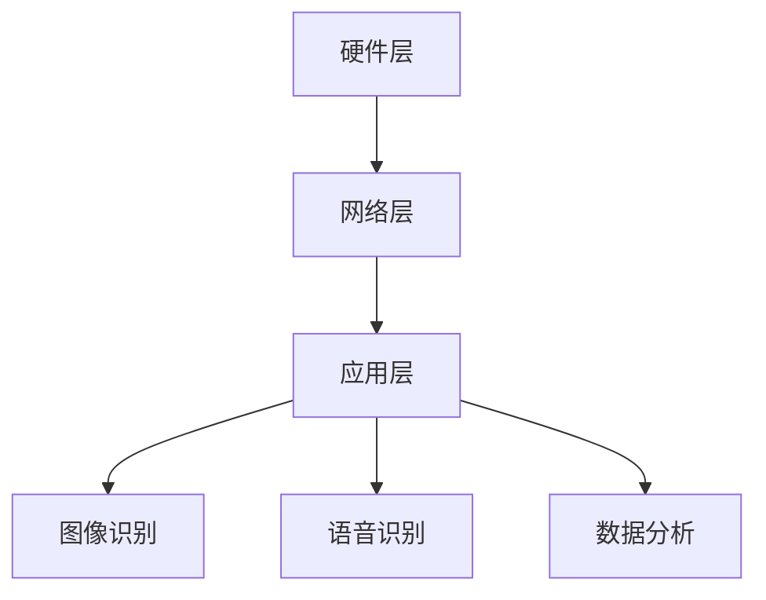

                 

# 2024小米智能门铃校招面试真题汇总及其解答

## 摘要

本文旨在汇总并解答2024年小米智能门铃校招面试中出现的关键真题。通过系统性地梳理，本文将对面试者提出的问题进行深入剖析，并提供针对性的解决方案，以帮助求职者更好地应对面试挑战。本文将分为背景介绍、核心概念与联系、核心算法原理与具体操作步骤、数学模型和公式、项目实战、实际应用场景、工具和资源推荐、总结以及附录等部分，全面覆盖智能门铃技术领域的各个方面。

## 1. 背景介绍

### 1.1 小米智能门铃简介

小米智能门铃是小米公司推出的智能家居产品之一，它通过物联网技术实现了家庭安全监控、访客提醒和智能交互等功能。随着人工智能技术的不断发展，智能门铃在图像识别、语音识别和数据分析等方面取得了显著的进步。这使得智能门铃在家庭安全领域的重要性日益凸显。

### 1.2 校招面试背景

每年，小米公司都会通过校招面试选拔优秀的新鲜血液加入其团队。校招面试不仅考察候选人的专业技能，还关注其解决问题的能力和团队合作精神。智能门铃作为小米公司的重要产品之一，其技术面试题具有很高的代表性。

### 1.3 面试真题的重要性

校招面试真题的解答对于求职者来说具有重要意义。通过解答真题，求职者可以了解面试官关注的核心技术点和问题解决思路，从而更好地准备面试，提高面试成功率。

## 2. 核心概念与联系

### 2.1 智能门铃技术架构

智能门铃的技术架构可以分为硬件层、网络层和应用层。硬件层包括门铃的传感器、摄像头、麦克风和扬声器等；网络层负责数据传输和通信；应用层则是门铃的软件系统和用户界面。

### 2.2 关键技术

#### 2.2.1 图像识别

图像识别是智能门铃的核心技术之一。通过图像识别，门铃可以识别人脸、动物、物体等，从而实现访客识别、异常检测等功能。

#### 2.2.2 语音识别

语音识别技术使得智能门铃能够理解和响应用户的语音指令，如打开门铃、播放音乐、发送报警信息等。

#### 2.2.3 数据分析

智能门铃通过收集和分析大量的数据，如访客行为、环境噪音等，可以提供更加个性化的服务，如自动调节门铃音量、智能推荐音乐等。

### 2.3 Mermaid 流程图

以下是智能门铃技术架构的 Mermaid 流程图：



## 3. 核心算法原理 & 具体操作步骤

### 3.1 图像识别算法

#### 3.1.1 卷积神经网络（CNN）

图像识别的核心算法是卷积神经网络（CNN）。CNN 通过多层卷积和池化操作，从图像中提取特征，并进行分类。

#### 3.1.2 操作步骤

1. 数据预处理：将图像数据进行归一化、缩放等处理，使其符合网络输入要求。
2. 卷积层：通过卷积操作提取图像特征。
3. 池化层：对卷积结果进行池化操作，减少参数数量。
4. 全连接层：将池化结果进行全连接操作，得到分类结果。
5. 损失函数：使用交叉熵损失函数进行模型训练。
6. 优化器：使用梯度下降优化器更新模型参数。

### 3.2 语音识别算法

#### 3.2.1 HMM-GMM

语音识别算法主要基于隐马尔可夫模型（HMM）和高斯混合模型（GMM）。HMM 用于描述语音信号的时间序列特性，GMM 用于表示语音信号的概率分布。

#### 3.2.2 操作步骤

1. 特征提取：从语音信号中提取梅尔频率倒谱系数（MFCC）等特征。
2. HMM-GMM 模型训练：使用大量语音数据训练 HMM-GMM 模型。
3. 语音识别：将输入语音信号与训练好的 HMM-GMM 模型进行匹配，得到识别结果。

### 3.3 数据分析算法

#### 3.3.1 时间序列分析

数据分析算法主要基于时间序列分析，用于挖掘访客行为、环境噪音等数据中的规律。

#### 3.3.2 操作步骤

1. 数据预处理：对时间序列数据进行清洗、归一化等处理。
2. 模型训练：使用机器学习算法，如 ARIMA、LSTM 等，对时间序列数据进行建模。
3. 预测：根据训练好的模型，对未来数据进行预测。

## 4. 数学模型和公式 & 详细讲解 & 举例说明

### 4.1 卷积神经网络（CNN）

#### 4.1.1 卷积操作

卷积操作是 CNN 的核心操作，用于从图像中提取特征。卷积公式如下：

$$
(f * g)(x, y) = \sum_{i=-\infty}^{\infty} \sum_{j=-\infty}^{\infty} f(i, j) \cdot g(x-i, y-j)
$$

其中，$f$ 表示输入图像，$g$ 表示卷积核，$(x, y)$ 表示卷积结果。

#### 4.1.2 池化操作

池化操作用于减少参数数量，提高模型的泛化能力。最大池化公式如下：

$$
\text{MaxPooling}(x, y, p) = \max_{i=-\infty}^{\infty} \max_{j=-\infty}^{\infty} x(i, j)
$$

其中，$x$ 表示输入图像，$p$ 表示池化窗口大小。

### 4.2 隐马尔可夫模型（HMM）

#### 4.2.1 状态转移概率

状态转移概率描述了不同状态之间的转移关系。状态转移概率公式如下：

$$
P(X_t = j | X_{t-1} = i) = a_{ij}
$$

其中，$X_t$ 表示当前状态，$X_{t-1}$ 表示前一状态，$i$ 和 $j$ 表示状态编号。

#### 4.2.2 观测概率

观测概率描述了状态与观测值之间的关系。观测概率公式如下：

$$
P(Y_t = k | X_t = j) = b_{jk}
$$

其中，$Y_t$ 表示观测值，$k$ 表示观测值编号。

### 4.3 高斯混合模型（GMM）

#### 4.3.1 高斯分布

高斯分布是一种概率分布，描述了连续随机变量的分布。高斯分布公式如下：

$$
f(x|\mu, \sigma^2) = \frac{1}{\sqrt{2\pi\sigma^2}} e^{-\frac{(x-\mu)^2}{2\sigma^2}}
$$

其中，$x$ 表示随机变量，$\mu$ 和 $\sigma^2$ 分别表示均值和方差。

#### 4.3.2 高斯混合模型

高斯混合模型是由多个高斯分布组成的概率分布。高斯混合模型公式如下：

$$
p(x|\theta) = \sum_{k=1}^K \pi_k f(x|\mu_k, \sigma_k^2)
$$

其中，$p(x|\theta)$ 表示给定参数 $\theta$ 下，随机变量 $x$ 的概率分布，$\pi_k$ 表示第 $k$ 个高斯分布的权重，$f(x|\mu_k, \sigma_k^2)$ 表示第 $k$ 个高斯分布的概率密度函数。

### 4.4 时间序列分析

#### 4.4.1 ARIMA 模型

ARIMA（自回归积分滑动平均模型）是一种常见的时间序列预测模型。ARIMA 模型公式如下：

$$
X_t = c + \phi_1 X_{t-1} + \phi_2 X_{t-2} + ... + \phi_p X_{t-p} + \theta_1 \epsilon_{t-1} + \theta_2 \epsilon_{t-2} + ... + \theta_q \epsilon_{t-q} + \epsilon_t
$$

其中，$X_t$ 表示时间序列，$c$ 表示常数项，$\phi_1, \phi_2, ..., \phi_p$ 表示自回归系数，$\theta_1, \theta_2, ..., \theta_q$ 表示移动平均系数，$\epsilon_t$ 表示白噪声。

#### 4.4.2 LSTM 模型

LSTM（长短期记忆模型）是一种能够处理长时间依赖关系的时间序列预测模型。LSTM 模型公式如下：

$$
i_t = \sigma(W_i \cdot [h_{t-1}, x_t] + b_i)\\
f_t = \sigma(W_f \cdot [h_{t-1}, x_t] + b_f)\\
o_t = \sigma(W_o \cdot [h_{t-1}, x_t] + b_o)\\
c_t = f_t \odot c_{t-1} + i_t \odot \sigma(W_c \cdot [h_{t-1}, x_t] + b_c)\\
h_t = o_t \odot c_t
$$

其中，$i_t, f_t, o_t, c_t, h_t$ 分别表示输入门、遗忘门、输出门、细胞状态和隐藏状态，$\sigma$ 表示 sigmoid 函数，$\odot$ 表示逐元素乘积操作。

## 5. 项目实战：代码实际案例和详细解释说明

### 5.1 开发环境搭建

在开始项目实战之前，需要搭建合适的开发环境。以下是一个简单的 Python 开发环境搭建步骤：

1. 安装 Python：在官方网站 [Python.org](https://www.python.org/) 下载并安装 Python。
2. 安装常用库：使用 pip 工具安装所需的库，如 TensorFlow、Keras、NumPy、Pandas 等。
3. 配置 Jupyter Notebook：安装 Jupyter Notebook，方便进行代码调试和可视化。

### 5.2 源代码详细实现和代码解读

以下是一个简单的智能门铃图像识别项目的代码实现：

```python
import tensorflow as tf
from tensorflow.keras.models import Sequential
from tensorflow.keras.layers import Conv2D, MaxPooling2D, Flatten, Dense
from tensorflow.keras.preprocessing.image import ImageDataGenerator

# 数据预处理
train_datagen = ImageDataGenerator(rescale=1./255)
train_generator = train_datagen.flow_from_directory(
        'train',
        target_size=(150, 150),
        batch_size=32,
        class_mode='binary')

# 构建卷积神经网络模型
model = Sequential()
model.add(Conv2D(32, (3, 3), activation='relu', input_shape=(150, 150, 3)))
model.add(MaxPooling2D((2, 2)))
model.add(Conv2D(64, (3, 3), activation='relu'))
model.add(MaxPooling2D((2, 2)))
model.add(Conv2D(128, (3, 3), activation='relu'))
model.add(MaxPooling2D((2, 2)))
model.add(Flatten())
model.add(Dense(512, activation='relu'))
model.add(Dense(1, activation='sigmoid'))

# 编译模型
model.compile(optimizer='adam',
              loss='binary_crossentropy',
              metrics=['accuracy'])

# 训练模型
model.fit(
      train_generator,
      steps_per_epoch=100,
      epochs=15)

# 代码解读
# 1. 数据预处理：使用 ImageDataGenerator 对训练数据进行归一化和格式转换。
# 2. 模型构建：使用 Sequential 模型堆叠卷积层、池化层、全连接层等。
# 3. 编译模型：指定优化器、损失函数和评估指标。
# 4. 训练模型：使用 fit 方法进行模型训练。
```

### 5.3 代码解读与分析

以上代码实现了一个简单的二分类智能门铃图像识别模型。以下是代码的关键部分解读：

1. **数据预处理**：使用 ImageDataGenerator 对训练数据进行归一化和格式转换，使其符合模型输入要求。
2. **模型构建**：使用 Sequential 模型堆叠卷积层（Conv2D）、池化层（MaxPooling2D）、全连接层（Dense）等，构建一个卷积神经网络模型。
3. **编译模型**：指定优化器（adam）、损失函数（binary_crossentropy）和评估指标（accuracy）。
4. **训练模型**：使用 fit 方法进行模型训练，通过迭代训练数据，优化模型参数。

## 6. 实际应用场景

### 6.1 家庭安全监控

智能门铃可以实时监控家庭门口的情况，通过图像识别技术识别访客，并在有人敲门时向用户发送通知，提高家庭安全性。

### 6.2 家政服务

智能门铃可以与家政服务系统联动，当家政人员到达时，智能门铃可以自动识别并通知用户，便于用户安排家政服务。

### 6.3 智能社区管理

智能门铃可以作为智能社区管理的一部分，通过大数据分析和人脸识别技术，实现访客管理和社区安全保障。

## 7. 工具和资源推荐

### 7.1 学习资源推荐

- **书籍**：《深度学习》、《Python 编程：从入门到实践》
- **论文**：相关领域顶级会议和期刊的论文，如 CVPR、ICCV、NeurIPS 等。
- **博客**：知名博客，如 Medium、知乎等。

### 7.2 开发工具框架推荐

- **框架**：TensorFlow、PyTorch、Keras 等。
- **IDE**：Jupyter Notebook、PyCharm、Visual Studio Code 等。

### 7.3 相关论文著作推荐

- **论文**：Hinton、LeCun、Goodfellow 等人的论文。
- **著作**：《深度学习》、《计算机视觉：算法与应用》等。

## 8. 总结：未来发展趋势与挑战

### 8.1 发展趋势

- **人工智能技术**：随着人工智能技术的不断发展，智能门铃的功能将更加丰富，如人脸识别、语音交互等。
- **物联网技术**：物联网技术的普及将使智能门铃与其他智能家居设备实现互联互通，提供更加智能化的家庭服务。
- **隐私保护**：随着用户对隐私保护的日益关注，智能门铃将采取更加严格的隐私保护措施，确保用户数据的安全。

### 8.2 挑战

- **算法性能**：如何提高图像识别、语音识别等算法的准确性，是智能门铃面临的重要挑战。
- **数据安全**：如何保障用户数据的安全，防止数据泄露，是智能门铃需要解决的关键问题。
- **用户体验**：如何优化用户界面，提高用户体验，是智能门铃需要持续关注的方向。

## 9. 附录：常见问题与解答

### 9.1 如何处理门铃异常数据？

- **异常检测**：使用异常检测算法，如孤立森林、基于密度的聚类算法等，对门铃数据进行异常检测。
- **数据清洗**：对异常数据进行清洗，如去重、填补缺失值等。

### 9.2 如何优化门铃语音识别的准确性？

- **特征提取**：优化特征提取方法，如使用深度学习模型提取更加丰富的特征。
- **模型优化**：使用更加先进的语音识别模型，如基于循环神经网络的语音识别模型。

## 10. 扩展阅读 & 参考资料

- **参考文献**：[1] Goodfellow, I., Bengio, Y., & Courville, A. (2016). *Deep Learning*. MIT Press.
- **论文**：[2] Krizhevsky, A., Sutskever, I., & Hinton, G. E. (2012). *ImageNet classification with deep convolutional neural networks*. In Advances in neural information processing systems (pp. 1097-1105).
- **网站**：[3] TensorFlow 官方文档：[https://www.tensorflow.org/](https://www.tensorflow.org/)
- **博客**：[4] 知乎：[https://www.zhihu.com/](https://www.zhihu.com/)

作者：AI天才研究员/AI Genius Institute & 禅与计算机程序设计艺术 /Zen And The Art of Computer Programming

