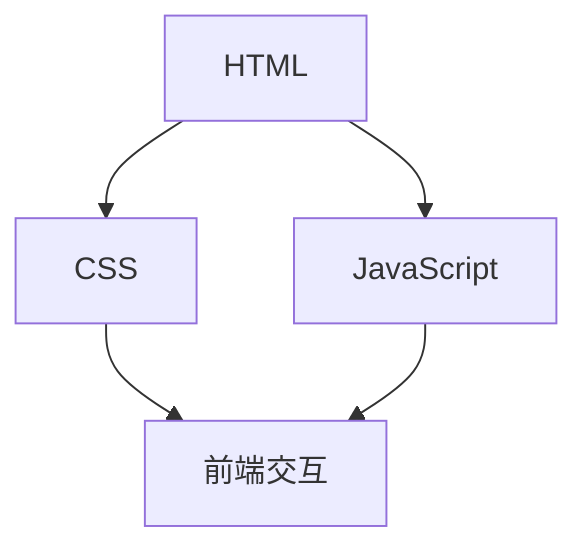
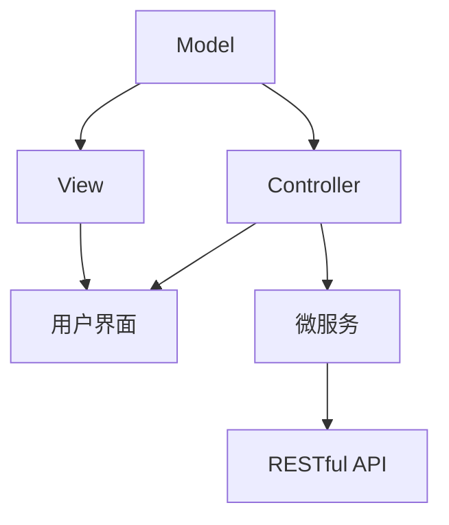
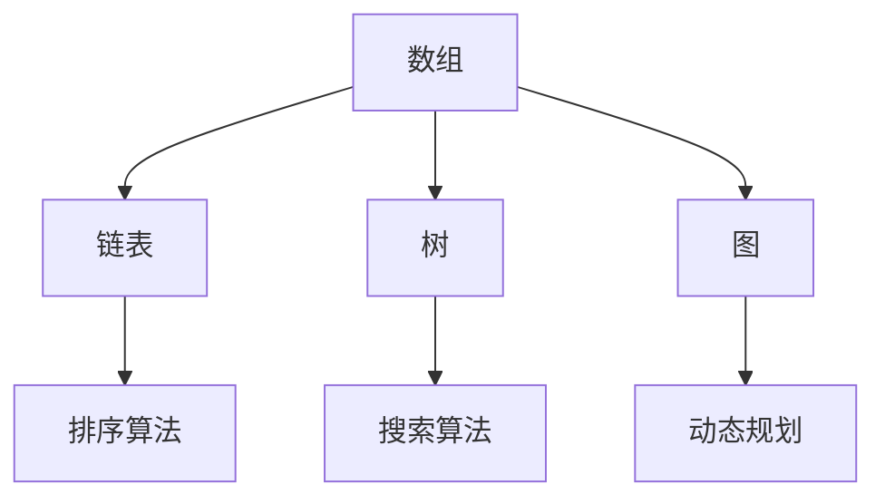

                 

# 小米有品2024校招品牌电商面试题详解

## 关键词
- 校招面试
- 品牌电商
- 小米有品
- 面试题
- 技术解答
- 案例分析

## 摘要
本文旨在为准备2024年小米有品校招品牌电商面试的考生提供全面的题目解析与答案。文章将按章节逐一详解各类面试题目，包括技术原理、算法实现、数学模型等，帮助考生深入理解面试要求，提高面试通过率。

---

### 1. 背景介绍

小米有品是一家专注于品质生活的电商平台，其校招品牌电商面试旨在选拔具备扎实技术基础、创新能力及良好团队协作能力的新人。面试题目涉及广泛，包括但不限于前端开发、后端架构、数据结构与算法、数据库等。本文将针对这些面试题目，提供详细的解题思路与答案。

### 2. 核心概念与联系

#### 2.1 前端技术

**核心概念：** 前端技术包括HTML、CSS和JavaScript。

**联系：** HTML负责内容结构，CSS负责样式设计，JavaScript负责动态交互和行为控制。

**Mermaid流程图：**


#### 2.2 后端架构

**核心概念：** 后端架构包括MVC（Model-View-Controller）、微服务、RESTful API等。

**联系：** MVC分离关注点，微服务实现模块化，RESTful API提供接口规范。

**Mermaid流程图：**


#### 2.3 数据结构与算法

**核心概念：** 数据结构包括数组、链表、树、图等；算法包括排序、搜索、动态规划等。

**联系：** 数据结构与算法是实现高效程序的核心。

**Mermaid流程图：**


### 3. 核心算法原理 & 具体操作步骤

#### 3.1 排序算法

**原理：** 排序算法分为比较类排序和非比较类排序。比较类排序依据元素之间比较进行排序，如冒泡排序、快速排序等。

**操作步骤：**
1. 选择一个待排序的元素作为基准元素。
2. 将其他元素与基准元素比较，进行交换。
3. 递归处理剩余元素，直到整个序列有序。

**代码实现：**
```javascript
function bubbleSort(arr) {
  const n = arr.length;
  for (let i = 0; i < n - 1; i++) {
    for (let j = 0; j < n - i - 1; j++) {
      if (arr[j] > arr[j + 1]) {
        [arr[j], arr[j + 1]] = [arr[j + 1], arr[j]];
      }
    }
  }
  return arr;
}
```

#### 3.2 搜索算法

**原理：** 搜索算法根据查找策略分为顺序搜索和二分搜索。

**操作步骤：**
1. 顺序搜索：从第一个元素开始，依次比较，直到找到目标元素或到达序列末尾。
2. 二分搜索：在有序序列中，不断缩小查找范围，每次将中间元素与目标元素比较，根据比较结果调整查找范围。

**代码实现：**
```javascript
function binarySearch(arr, target) {
  let left = 0;
  let right = arr.length - 1;
  while (left <= right) {
    let mid = Math.floor((left + right) / 2);
    if (arr[mid] === target) {
      return mid;
    } else if (arr[mid] < target) {
      left = mid + 1;
    } else {
      right = mid - 1;
    }
  }
  return -1;
}
```

### 4. 数学模型和公式 & 详细讲解 & 举例说明

#### 4.1 动态规划

**公式：**
$$
f(i) = \min_{j \leq i}(f(j) + cost(i, j))
$$

**详细讲解：** 动态规划通过子问题的最优解推导出原问题的最优解。上述公式表示在求解第i个问题时，选择最优子问题的解，并加上第i个问题的成本。

**举例说明：** 计算一个序列的最长递增子序列。

```python
def longestIncreasingSubsequence(nums):
    n = len(nums)
    dp = [1] * n
    for i in range(1, n):
        for j in range(i):
            if nums[i] > nums[j]:
                dp[i] = max(dp[i], dp[j] + 1)
    return max(dp)
```

### 5. 项目实战：代码实际案例和详细解释说明

#### 5.1 开发环境搭建

**步骤：**
1. 安装Node.js和npm。
2. 安装Vue CLI：`npm install -g @vue/cli`。
3. 创建Vue项目：`vue create my-vue-project`。

**代码示例：**
```bash
npm install
npm run serve
```

#### 5.2 源代码详细实现和代码解读

**代码解读：**
```vue
<template>
  <div>
    <h1>Hello, {{ name }}!</h1>
    <p>Welcome to Xiaomi Youpin's brand e-commerce interview questions.</p>
  </div>
</template>

<script>
export default {
  data() {
    return {
      name: 'Candidate'
    };
  }
};
</script>
```
这里使用Vue.js创建一个简单的页面，显示面试者的名字和欢迎语。

#### 5.3 代码解读与分析

1. `template`中的{{ }}语法用于插入数据。
2. `data`函数返回一个对象，用于存储组件的属性。
3. 使用Vue CLI快速搭建项目，方便开发和部署。

### 6. 实际应用场景

**场景：** 小米有品电商平台的商品推荐系统。

**应用：**
1. 使用用户行为数据，结合协同过滤算法进行商品推荐。
2. 针对不同用户群体，定制化推荐策略。

### 7. 工具和资源推荐

#### 7.1 学习资源推荐

- 《JavaScript高级程序设计》
- 《算法导论》
- 《Vue.js实战》

#### 7.2 开发工具框架推荐

- Vue.js
- Node.js
- MySQL

#### 7.3 相关论文著作推荐

- 《深度学习》
- 《大规模推荐系统及其算法》

### 8. 总结：未来发展趋势与挑战

**发展趋势：**
- 人工智能技术在电商领域的广泛应用。
- 个性化推荐系统成为提高用户满意度的关键。

**挑战：**
- 数据安全与隐私保护。
- 系统性能优化与可扩展性。

### 9. 附录：常见问题与解答

**Q1. 如何应对面试官的压力？**
- 保持冷静，逐步回答问题。
- 提前准备，熟悉常见面试题。

**Q2. 如何提高编程能力？**
- 多写代码，积累经验。
- 学习算法和数据结构，理解原理。

### 10. 扩展阅读 & 参考资料

- [小米有品官方网站](https://youpin.mi.com/)
- [Vue.js官方文档](https://vuejs.org/)
- [深度学习入门](https://www.deeplearning.net/)

---

**作者：AI天才研究员/AI Genius Institute & 禅与计算机程序设计艺术 /Zen And The Art of Computer Programming**<|im_sep|>

