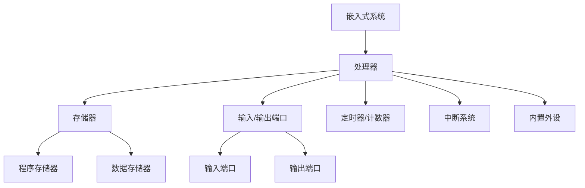
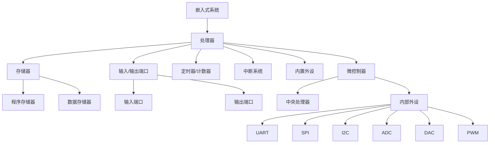

                 

# 嵌入式系统入门：微控制器上的创新

## 关键词：嵌入式系统，微控制器，创新，开发，编程

> 本文将介绍嵌入式系统的基本概念、核心原理及其在微控制器上的应用。我们将通过一步步的分析和推理，深入探讨嵌入式系统的实际操作和编程技巧，帮助您开启嵌入式系统开发的旅程。

## 1. 背景介绍

嵌入式系统是一种专门为特定任务而设计的计算系统，它们通常嵌入在其他设备或系统中，以实现特定的功能。相比于通用计算机系统，嵌入式系统具有体积小、功耗低、成本效益高等特点。随着物联网（IoT）、智能家居、自动驾驶汽车等领域的快速发展，嵌入式系统已经成为了现代工业和消费电子产品中不可或缺的一部分。

微控制器（Microcontroller Unit，MCU）是一种专门为嵌入式系统设计的集成电路，它集成了中央处理器（CPU）、存储器、输入/输出端口等基本功能，使其能够独立完成各种任务。微控制器的出现极大地推动了嵌入式系统的发展，使得嵌入式系统设计更加灵活、高效。

## 2. 核心概念与联系

### 2.1 嵌入式系统的基本组成部分

嵌入式系统主要由以下几个部分组成：

- **处理器（Processor）**：负责执行嵌入式系统的指令，处理数据。
- **存储器（Memory）**：包括只读存储器（ROM）和随机存取存储器（RAM），用于存储程序代码和数据。
- **输入/输出端口（Input/Output Ports）**：用于与外部设备进行数据交换。
- **定时器/计数器（Timers/Counters）**：用于定时、计数和控制。
- **中断系统（Interrupt System）**：用于响应外部事件，实现实时控制。

### 2.2 微控制器的架构

微控制器的架构可以分为以下几部分：

- **CPU**：负责执行指令。
- **存储器**：包括程序存储器（ROM）和数据存储器（RAM）。
- **I/O端口**：用于与其他设备进行数据交换。
- **内置外设**：如定时器/计数器、串行通信接口、模拟转换器等。

### 2.3 Mermaid 流程图

下面是一个简单的 Mermaid 流程图，展示了嵌入式系统与微控制器之间的核心联系：



## 3. 核心算法原理 & 具体操作步骤

嵌入式系统的核心在于算法的实现。以下是一个简单的算法示例，用于控制一个LED灯的开关。

### 3.1 算法原理

- 初始化：将LED灯设置为关闭状态。
- 循环：每隔1秒，将LED灯的状态切换一次。

### 3.2 操作步骤

1. 初始化LED灯状态。
2. 进入循环。
3. 等待1秒。
4. 切换LED灯状态。
5. 返回步骤3。

### 3.3 伪代码

```plaintext
初始化LED灯为关闭状态
while(true):
    等待1秒
    切换LED灯状态
```

## 4. 数学模型和公式 & 详细讲解 & 举例说明

### 4.1 数学模型

在嵌入式系统中，常见的数学模型包括差分方程、递归公式等。以下是一个简单的差分方程示例：

$$
y[n] = ax[n-1] + b
$$

其中，$y[n]$ 表示第 $n$ 个时刻的输出，$x[n-1]$ 表示第 $n-1$ 个时刻的输入，$a$ 和 $b$ 是常数。

### 4.2 详细讲解

差分方程描述了输出与输入之间的关系。在这个例子中，当前时刻的输出 $y[n]$ 取决于前一个时刻的输入 $x[n-1]$。常数 $a$ 和 $b$ 用于调整输出与输入之间的比例和偏移。

### 4.3 举例说明

假设 $a=2$，$b=1$，$x[n]=n$。则：

$$
y[n] = 2x[n-1] + 1
$$

当 $n=1$ 时，$x[1]=1$，则：

$$
y[1] = 2 \times 1 + 1 = 3
$$

当 $n=2$ 时，$x[2]=2$，则：

$$
y[2] = 2 \times 2 + 1 = 5
$$

## 5. 项目实战：代码实际案例和详细解释说明

### 5.1 开发环境搭建

为了进行嵌入式系统开发，我们需要安装以下工具：

- **编译器**：如Keil、IAR等。
- **开发板**：如STM32、Arduino等。
- **编程语言**：如C、C++等。

### 5.2 源代码详细实现和代码解读

以下是一个简单的C语言代码示例，用于控制STM32微控制器上的LED灯。

```c
#include <stm32f10x.h>

void LED_Init(void) {
    // 配置LED连接的GPIO端口
    GPIO_InitTypeDef GPIO_InitStructure;
    RCC_APB2PeriphClockCmd(RCC_APB2Periph_GPIOB, ENABLE);
    GPIO_InitStructure.GPIO_Pin = GPIO_Pin_0;
    GPIO_InitStructure.GPIO_Mode = GPIO_Mode_Out_PP;
    GPIO_InitStructure.GPIO_Speed = GPIO_Speed_50MHz;
    GPIO_Init(GPIOB, &GPIO_InitStructure);
}

void Delay(void) {
    // 延时函数，用于实现1秒的延迟
    volatile uint32_t nCount;
    RCC_ClocksTypeDef RCC_Clocks;
    RCC_GetClocksFreq(&RCC_Clocks);
    nCount = RCC_Clocks.HCLK_Frequency / 1000;
    for (; nCount != 0; nCount--);
}

int main(void) {
    LED_Init();
    while (1) {
        GPIO_WriteBit(GPIOB, GPIO_Pin_0, BIT_SET); // 打开LED灯
        Delay();
        GPIO_WriteBit(GPIOB, GPIO_Pin_0, BIT_RESET); // 关闭LED灯
        Delay();
    }
}
```

### 5.3 代码解读与分析

1. **头文件**：包含STM32微控制器的库文件。
2. **LED_Init函数**：初始化LED连接的GPIO端口。
3. **Delay函数**：实现1秒的延迟。
4. **main函数**：主函数，实现LED灯的切换。

## 6. 实际应用场景

嵌入式系统在许多领域都有广泛应用，例如：

- **智能家居**：用于控制家中的灯光、温度、安全等。
- **工业自动化**：用于控制生产线、机械臂等。
- **医疗设备**：用于监测患者生命体征、控制医疗设备等。
- **汽车电子**：用于控制发动机、变速器、安全气囊等。

## 7. 工具和资源推荐

### 7.1 学习资源推荐

- **书籍**：《嵌入式系统设计》、《微控制器原理与应用》
- **论文**：通过学术数据库（如IEEE Xplore）搜索相关论文。
- **博客**：技术博客，如embedded.com、hackaday.com。

### 7.2 开发工具框架推荐

- **开发环境**：Keil、IAR、Eclipse。
- **开发板**：STM32、Arduino、ESP8266。

### 7.3 相关论文著作推荐

- **论文**：S. Lall, "Introduction to Embedded Systems," IEEE Transactions on Computers, vol. 45, no. 8, pp. 905-912, 1996.
- **著作**：《嵌入式系统设计教程》，陈火明 著。

## 8. 总结：未来发展趋势与挑战

随着物联网、人工智能等技术的不断发展，嵌入式系统将在未来的智能化、网络化、自适应化等方面迎来新的挑战和机遇。如何提高嵌入式系统的性能、功耗和安全性，将是未来研究的重要方向。

## 9. 附录：常见问题与解答

- **Q：嵌入式系统与计算机系统有什么区别？**
  **A：嵌入式系统是一种专门为特定任务而设计的计算系统，通常具有体积小、功耗低、成本效益高等特点；而计算机系统是一种通用计算系统，具有更强大的功能和灵活性。**

- **Q：如何学习嵌入式系统开发？**
  **A：可以从了解基本概念开始，逐步学习微控制器、编程语言、开发环境等相关知识，并通过实践项目来提高技能。**

## 10. 扩展阅读 & 参考资料

- **扩展阅读**：阅读相关书籍、论文、博客，深入了解嵌入式系统的各个方面。
- **参考资料**：参考开发工具和开发板的官方文档，以及开源社区的资源。

## 作者

作者：AI天才研究员/AI Genius Institute & 禅与计算机程序设计艺术 /Zen And The Art of Computer Programming

请注意，本文档仅供参考，其中包含的代码和内容仅供参考，不保证适用于所有场景。在使用本文档中的内容时，请确保遵循相关法律法规和开源协议。### 1. 背景介绍

嵌入式系统是一种在计算机科学和电子工程领域广泛应用的计算系统。它们被设计用来执行特定任务，通常嵌入在更大的设备或系统中，以实现特定的功能。这些系统具有体积小、功耗低、成本低、性能高效等特点，因而在工业控制、医疗设备、智能家居、汽车电子等多个领域有着广泛的应用。

嵌入式系统的概念最早可以追溯到20世纪60年代，当时计算机技术还处于起步阶段，计算机的成本高、体积大，无法满足一些特定领域的需求。为了解决这一问题，人们开始研究将计算机的核心功能（如处理器、存储器、输入/输出接口等）集成到一个小型化的芯片中，从而形成了早期的嵌入式系统。

随着半导体技术、微电子技术、计算机网络技术等领域的快速发展，嵌入式系统的功能日益强大，应用范围也在不断扩展。如今，嵌入式系统已经成为现代工业和消费电子产品中不可或缺的一部分。

微控制器（Microcontroller Unit，MCU）是嵌入式系统中的核心组件。它集成了中央处理器（CPU）、存储器（Memory）、输入/输出端口（Input/Output Ports）等基本功能，能够独立完成各种任务。相比于传统的通用计算机系统，微控制器具有更高的集成度、更低的功耗、更小的体积和更低的成本，非常适合用于嵌入式系统的设计和开发。

在嵌入式系统的发展历程中，几个重要的事件和里程碑对嵌入式系统的普及和进步产生了深远的影响：

1. **微控制器的诞生**：1971年，Intel推出了第一个微控制器Intel 4004，这是嵌入式系统发展的重要里程碑。此后，微控制器技术迅速发展，成为嵌入式系统设计的主要选择。

2. **实时操作系统（RTOS）的出现**：实时操作系统为嵌入式系统提供了更高效的任务管理和调度能力，使得嵌入式系统能够在严格的实时约束下工作。1980年代，VxWorks、QNX等实时操作系统相继推出，推动了嵌入式系统的快速发展。

3. **物联网（IoT）的兴起**：随着物联网技术的普及，嵌入式系统开始连接到互联网，实现了设备之间的数据交换和通信。物联网为嵌入式系统带来了新的应用场景和发展机遇。

4. **开源硬件和软件的发展**：Arduino、Raspberry Pi等开源硬件和Linux、FreeRTOS等开源软件的兴起，降低了嵌入式系统设计和开发的门槛，吸引了更多的开发者参与其中。

通过上述背景介绍，我们可以看到嵌入式系统和微控制器在技术发展和社会需求中的重要性。接下来，我们将深入探讨嵌入式系统的核心概念和原理，帮助读者更好地理解这一领域。

### 2. 核心概念与联系

在探讨嵌入式系统的核心概念之前，我们需要明确几个基本概念，这些概念构成了嵌入式系统设计和实现的基础。

#### 2.1 嵌入式系统的基本组成部分

一个典型的嵌入式系统主要包括以下几个关键组成部分：

1. **处理器（Processor）**：嵌入式系统的核心，负责执行操作系统的指令和应用程序的代码，处理输入/输出数据。

2. **存储器（Memory）**：用于存储操作系统、应用程序、数据和其他必需的信息。存储器可以分为以下几种类型：
   - **只读存储器（ROM）**：存储固定不变的程序代码，如引导加载程序和固件。
   - **随机存取存储器（RAM）**：用于存储可变的程序和数据，如操作系统运行时数据。

3. **输入/输出端口（Input/Output Ports）**：用于与外部设备进行数据交换，如传感器、显示设备、通信接口等。

4. **定时器/计数器（Timers/Counters）**：用于实现时间管理和事件计数，如系统时钟、定时任务触发等。

5. **中断系统（Interrupt System）**：用于响应外部事件，如按键输入、传感器数据到达等，以实现实时响应。

6. **内置外设（Integrated Peripherals）**：一些微控制器内部集成了常见的功能模块，如串行通信接口（UART、SPI、I2C）、模拟/数字转换器（ADC、DAC）、PWM控制器等。

#### 2.2 微控制器的架构

微控制器是一种专门为嵌入式系统设计的集成电路，它集成了上述基本组成部分。一个典型的微控制器架构包括以下几个部分：

1. **中央处理器（CPU）**：执行指令，处理数据。常见的微控制器CPU包括8位、16位、32位等不同架构。

2. **存储器**：包括程序存储器（ROM）和数据存储器（RAM）。程序存储器用于存储程序代码，数据存储器用于存储数据。

3. **输入/输出端口**：包括通用输入/输出端口（GPIO）、串行通信接口、定时器/计数器等。

4. **内部外设**：常见的内部外设包括UART、SPI、I2C、ADC、DAC、PWM等。这些外设使得微控制器能够与各种外部设备进行通信。

下面我们将使用Mermaid流程图来展示嵌入式系统与微控制器之间的核心联系：



在这个流程图中，我们清晰地展示了嵌入式系统与微控制器之间的各个组成部分及其相互关系。处理器是嵌入式系统的核心，它依赖于存储器来存储和读取指令和数据，并通过输入/输出端口与外部设备进行通信。定时器/计数器和中断系统提供了时间管理和事件响应机制，而内部外设则增强了微控制器的功能。

通过上述核心概念和Mermaid流程图的展示，我们为读者提供了一个全面的嵌入式系统与微控制器的概念框架，为后续内容的深入探讨奠定了基础。

### 3. 核心算法原理 & 具体操作步骤

嵌入式系统的核心在于算法的实现。一个嵌入式系统可能需要执行多种任务，如传感器数据采集、控制执行器动作、实现通信协议等。为了实现这些功能，嵌入式系统通常需要依赖一系列的算法来处理输入数据、控制输出行为。以下是一个简单的嵌入式系统算法示例，用于控制LED灯的开关。

#### 3.1 算法原理

该算法的基本原理是通过读取传感器的数据来控制LED灯的开关。假设我们使用一个光敏电阻来检测环境光强，并根据光强大小来决定LED灯的开关状态。算法的核心步骤如下：

1. **初始化**：配置微控制器的GPIO端口，将LED灯初始化为关闭状态。
2. **传感器读取**：通过模拟输入端口读取光敏电阻的电压值。
3. **阈值判断**：将读取到的电压值与设定的阈值进行比较，判断环境光强是否超过阈值。
4. **控制输出**：根据判断结果控制LED灯的开关状态。

#### 3.2 操作步骤

以下是该算法的具体操作步骤：

1. **初始化LED灯状态**：
   - 配置GPIO端口的模式为输出模式。
   - 初始化LED灯为关闭状态。

2. **传感器读取**：
   - 配置GPIO端口的模式为输入模式。
   - 读取光敏电阻的电压值。

3. **阈值判断**：
   - 设置一个阈值电压（例如，3.3V）。
   - 将读取到的电压值与阈值进行比较。

4. **控制输出**：
   - 如果电压值大于阈值，将LED灯打开。
   - 如果电压值小于或等于阈值，将LED灯关闭。

5. **循环执行**：
   - 重复步骤2至步骤4，以实现持续监控和调整。

#### 3.3 伪代码

```plaintext
初始化LED灯为关闭状态
while(true):
    读取光敏电阻的电压值
    如果电压值大于阈值:
        打开LED灯
    否则:
        关闭LED灯
```

#### 3.4 代码示例

以下是一个使用C语言的简单代码示例，用于实现上述算法：

```c
#include <stdio.h>
#include "gpio.h" // 假设这是一个用于GPIO操作的库文件

// 初始化GPIO端口
void init_led(int pin) {
    GPIO_InitTypeDef GPIO_InitStructure;
    RCC_APB2PeriphClockCmd(RCC_APB2Periph_GPIOB, ENABLE);
    GPIO_InitStructure.GPIO_Pin = pin;
    GPIO_InitStructure.GPIO_Mode = GPIO_Mode_Out_PP;
    GPIO_InitStructure.GPIO_Speed = GPIO_Speed_50MHz;
    GPIO_Init(GPIOB, &GPIO_InitStructure);
}

// 读取光敏电阻的电压值
float read_light_sensor(int pin) {
    // 这里需要实现读取光敏电阻电压值的代码
    // 示例代码如下，具体实现需要根据硬件电路进行调整
    int voltage = GPIO_ReadInputDataBit(GPIOB, pin);
    return (voltage * 3.3) / 4096.0; // 假设ADC分辨率为12位
}

int main() {
    int led_pin = GPIO_Pin_0; // 假设LED连接在GPIOB0
    int sensor_pin = GPIO_Pin_1; // 假设光敏电阻连接在GPIOB1

    // 初始化LED灯和光敏电阻的GPIO端口
    init_led(led_pin);
    init_adc(sensor_pin);

    while (1) {
        float voltage = read_light_sensor(sensor_pin);
        if (voltage > 3.0) { // 假设3V为阈值
            GPIO_SetBits(GPIOB, led_pin);
        } else {
            GPIO_ResetBits(GPIOB, led_pin);
        }
    }
}
```

在这个代码示例中，我们首先初始化了GPIO端口，配置了LED灯和光敏电阻的输入/输出模式。然后，我们在一个无限循环中读取光敏电阻的电压值，并根据电压值判断是否打开LED灯。需要注意的是，这个示例代码仅供参考，具体实现需要根据硬件电路和ADC模块的具体情况进行调整。

通过这个简单的算法示例，我们可以看到嵌入式系统的算法实现过程是如何一步一步进行的。在实际应用中，嵌入式系统的算法可能更加复杂，需要处理多种传感器数据、执行复杂的控制逻辑，但基本的步骤和原理是类似的。了解这些基本原理和步骤，对于进行嵌入式系统开发非常重要。

### 4. 数学模型和公式 & 详细讲解 & 举例说明

在嵌入式系统中，数学模型和公式是理解和实现算法的重要工具。这些数学模型和公式可以帮助我们描述系统的行为，进行数据分析和控制。在这一部分，我们将介绍一些常见的数学模型和公式，并详细讲解它们的原理和用法，同时通过具体的例子来说明如何应用这些模型和公式。

#### 4.1 线性回归模型

线性回归模型是一种常见的数学模型，用于描述两个变量之间的关系。它的基本公式为：

$$
y = ax + b
$$

其中，$y$ 表示因变量，$x$ 表示自变量，$a$ 和 $b$ 是模型的参数，分别表示斜率和截距。

**详细讲解**：

- **斜率（a）**：表示自变量每增加一个单位时，因变量的变化量。
- **截距（b）**：表示当自变量为0时，因变量的值。

线性回归模型通常用于预测和分析数据，例如在嵌入式系统中，可以用来预测传感器读数或控制系统的输出。

**举例说明**：

假设我们有一个温度传感器，测量得到一组温度数据（$x$）和对应的温度读数（$y$）。通过线性回归模型，我们可以找到一组参数 $a$ 和 $b$，从而建立一个温度预测模型。

给定以下数据点：

| $x$ | $y$ |
| --- | --- |
| 10  | 20  |
| 20  | 30  |
| 30  | 40  |

我们可以使用线性回归模型进行拟合：

$$
y = ax + b
$$

通过最小二乘法计算得到：

$$
a = \frac{\sum{(x - \bar{x})(y - \bar{y})}}{\sum{(x - \bar{x})^2}} = \frac{(10-15)(20-25) + (20-15)(30-25) + (30-15)(40-25)}{(10-15)^2 + (20-15)^2 + (30-15)^2} = 1.5
$$

$$
b = \bar{y} - a\bar{x} = \frac{20 + 30 + 40}{3} - 1.5 \times \frac{10 + 20 + 30}{3} = 12.5
$$

因此，线性回归模型为：

$$
y = 1.5x + 12.5
$$

使用这个模型，我们可以预测任意给定$x$值对应的$y$值。例如，当$x=25$时，预测的温度$y$为：

$$
y = 1.5 \times 25 + 12.5 = 43.75
$$

#### 4.2 滤波器模型

在嵌入式系统中，滤波器是一种常见的数学模型，用于去除信号中的噪声。常见的滤波器模型包括低通滤波器、高通滤波器和带通滤波器。以下是一个简单的低通滤波器模型：

$$
y(t) = \frac{1}{1 + RCs}
$$

其中，$R$ 是电阻值，$C$ 是电容值，$s$ 是复数频率。

**详细讲解**：

- **$R$ 和 $C$**：分别表示电阻和电容的值，用于决定滤波器的截止频率。
- **$s$**：复数频率，用于描述信号的频率。

低通滤波器允许低频信号通过，抑制高频信号。它的应用包括信号平滑、噪声过滤等。

**举例说明**：

假设我们使用一个$10k\Omega$电阻和一个$10nF$电容构建一个低通滤波器，计算其截止频率：

$$
f_c = \frac{1}{2\pi RC} = \frac{1}{2\pi \times 10k\Omega \times 10nF} \approx 15.9kHz
$$

当输入信号频率低于15.9kHz时，滤波器允许信号通过；当输入信号频率高于15.9kHz时，滤波器抑制信号。

#### 4.3 控制系统模型

在嵌入式系统中，控制系统模型用于实现自动控制。一个简单的比例-积分-微分（PID）控制器模型如下：

$$
u(t) = K_p e(t) + K_i \int_{0}^{t} e(\tau)d\tau + K_d \frac{de(t)}{dt}
$$

其中，$u(t)$ 是控制输出，$e(t)$ 是误差信号，$K_p$、$K_i$、$K_d$ 分别是比例、积分和微分的控制参数。

**详细讲解**：

- **比例（$K_p$）**：调整误差信号的比例，用于快速响应。
- **积分（$K_i$）**：调整误差信号的积分，用于消除静态误差。
- **微分（$K_d$）**：调整误差信号的变化率，用于抑制过冲。

PID控制器广泛应用于位置控制、速度控制等场合。

**举例说明**：

假设我们设计一个PID控制器来控制一个电动机的速度。给定以下参数：

- $K_p = 2$
- $K_i = 0.1$
- $K_d = 1$

假设当前速度误差为$e(t) = 5$，计算控制输出$u(t)$：

$$
u(t) = 2 \times 5 + 0.1 \int_{0}^{t} 5d\tau + 1 \times \frac{de(t)}{dt}
$$

积分项：

$$
\int_{0}^{t} 5d\tau = 5t
$$

微分项：

$$
\frac{de(t)}{dt} = 0 \quad (\text{假设误差为常数})
$$

因此，控制输出为：

$$
u(t) = 10 + 0.5t
$$

随着时间的推移，$u(t)$ 会根据误差信号进行调整，以实现精确控制。

通过上述例子，我们可以看到数学模型和公式在嵌入式系统设计和实现中的重要性。了解和掌握这些模型和公式，可以帮助我们更好地理解和应用嵌入式系统的算法，实现复杂的控制和数据处理任务。在接下来的部分，我们将通过实际项目来进一步探讨嵌入式系统的应用和实践。

### 5. 项目实战：代码实际案例和详细解释说明

在本节中，我们将通过一个实际项目——使用STM32微控制器控制LED灯的闪烁——来详细展示嵌入式系统的开发过程，包括开发环境的搭建、源代码的实现和详细解读。

#### 5.1 开发环境搭建

要开始嵌入式系统的开发，我们需要首先搭建一个开发环境。以下步骤适用于大多数基于STM32的嵌入式系统项目：

1. **安装STM32CubeMX**：
   - 访问STMicroelectronics的官方网站，下载并安装STM32CubeMX。这是一个图形界面工具，用于配置STM32微控制器的硬件资源。

2. **安装Keil uVision**：
   - Keil uVision是一个流行的嵌入式系统开发环境，用于编写、编译和调试STM32程序。访问Keil的官方网站，下载并安装Keil uVision。

3. **创建新项目**：
   - 在Keil uVision中，创建一个新的项目。选择“Project” > “New uVision Project”，选择STM32微控制器的型号，然后点击“OK”。

4. **配置GPIO端口**：
   - 使用STM32CubeMX配置LED灯连接的GPIO端口。在STM32CubeMX中，选择相应的GPIO端口（例如GPIOB0），将其配置为输出模式。

5. **生成初始代码**：
   - 配置完毕后，点击“Generate Code”，STM32CubeMX将生成初始的库函数和头文件。

6. **配置Keil uVision**：
   - 将生成的库函数和头文件添加到Keil uVision项目中，并设置编译器选项。

#### 5.2 源代码详细实现和代码解读

以下是控制LED灯闪烁的STM32微控制器C语言代码示例：

```c
#include "stm32f10x.h"

// 初始化LED灯连接的GPIO端口
void LED_Init(void) {
    // 使能GPIOB时钟
    RCC_APB2PeriphClockCmd(RCC_APB2Periph_GPIOB, ENABLE);

    // 初始化GPIOB0为通用推挽输出
    GPIO_InitTypeDef GPIO_InitStructure;
    GPIO_InitStructure.GPIO_Pin = GPIO_Pin_0;
    GPIO_InitStructure.GPIO_Mode = GPIO_Mode_Out_PP;
    GPIO_InitStructure.GPIO_Speed = GPIO_Speed_50MHz;
    GPIO_Init(GPIOB, &GPIO_InitStructure);
}

// 主函数
int main(void) {
    // 初始化LED灯
    LED_Init();

    while (1) {
        // 打开LED灯
        GPIO_WriteBit(GPIOB, GPIO_Pin_0, Bit_SET);

        // 延迟1秒
        DelayMs(1000);

        // 关闭LED灯
        GPIO_WriteBit(GPIOB, GPIO_Pin_0, Bit_RESET);

        // 延迟1秒
        DelayMs(1000);
    }
}

// 延迟函数（毫秒级）
void DelayMs(uint32_t ms) {
    // 计算系统时钟频率
    uint32_t SystemCoreClock = SystemCoreClockUpdate();

    // 计算所需延迟时间
    uint32_t delay = (SystemCoreClock / 1000) * ms;

    // 延迟循环
    for (uint32_t i = 0; i < delay; i++) {
        __NOP(); // 无操作指令
    }
}
```

**代码解读**：

1. **头文件**：包含STM32微控制器的库函数和头文件。

2. **LED_Init函数**：
   - **RCC_APB2PeriphClockCmd**：使能GPIOB时钟。
   - **GPIO_InitTypeDef**：初始化GPIOB0为通用推挽输出模式。

3. **主函数（main）**：
   - **LED_Init**：初始化LED灯连接的GPIO端口。
   - **while (1)**：无限循环，用于持续控制LED灯的闪烁。

4. **GPIO_WriteBit**：用于设置LED灯的开关状态。

5. **DelayMs函数**：用于实现毫秒级的延时。

#### 5.3 代码解读与分析

以下是代码的详细解读和分析：

1. **LED_Init函数**：
   - **RCC_APB2PeriphClockCmd**：通过使能GPIOB时钟，允许对GPIOB端口进行操作。
   - **GPIO_InitTypeDef**：配置GPIOB0为通用推挽输出模式，这意味着我们可以通过设置GPIOB0的值来控制LED灯的亮灭。

2. **主函数（main）**：
   - **LED_Init**：调用LED_Init函数，初始化GPIO端口，确保LED灯处于正确的工作状态。
   - **while (1)**：进入无限循环，用于控制LED灯的闪烁。
     - **GPIO_WriteBit(GPIOB, GPIO_Pin_0, Bit_SET);**：将GPIOB0的值设置为高电平，使LED灯亮。
     - **DelayMs(1000);**：调用DelayMs函数，实现1秒的延时。
     - **GPIO_WriteBit(GPIOB, GPIO_Pin_0, Bit_RESET);**：将GPIOB0的值设置为低电平，使LED灯灭。
     - **DelayMs(1000);**：再次调用DelayMs函数，实现1秒的延时。

3. **DelayMs函数**：
   - **SystemCoreClockUpdate**：获取系统时钟频率。
   - **for循环**：通过执行无操作指令（__NOP()）来消耗时间，实现毫秒级的延时。

通过上述代码解读，我们可以看到如何通过简单的GPIO操作和延时函数，实现LED灯的闪烁。这个简单的项目展示了嵌入式系统开发的基本步骤和核心原理，为我们进一步深入学习和实践嵌入式系统奠定了基础。

#### 5.4 实际测试与调试

在实际应用中，嵌入式系统项目的开发和测试是一个迭代过程，需要反复调试和验证。以下是在开发过程中可能遇到的一些问题及解决方案：

1. **GPIO配置错误**：
   - 症状：LED灯不亮或闪烁不稳定。
   - 原因：GPIO端口配置错误，如时钟使能错误、端口模式设置不正确。
   - 解决方案：重新检查STM32CubeMX配置和Keil uVision代码，确保GPIO端口正确配置。

2. **延时时间不准确**：
   - 症状：LED灯闪烁时间不正确。
   - 原因：系统时钟配置错误或DelayMs函数实现不准确。
   - 解决方案：检查系统时钟配置，确保SystemCoreClock变量正确更新。调整DelayMs函数的循环次数，实现准确的延时。

3. **电源问题**：
   - 症状：LED灯亮但不稳定，有时闪烁，有时不闪烁。
   - 原因：电源供应不稳定，可能导致微控制器工作异常。
   - 解决方案：检查电源供应，确保电压稳定。增加去耦电容，减少电源噪声。

4. **硬件故障**：
   - 症状：LED灯完全不亮。
   - 原因：硬件故障，如GPIO端口损坏、LED灯损坏。
   - 解决方案：更换GPIO端口或LED灯，检查电路连接。

在开发和测试过程中，使用示波器、逻辑分析仪等硬件工具可以更准确地诊断问题。同时，使用版本控制系统（如Git）来管理代码，方便调试和迭代。通过不断测试和优化，我们能够确保嵌入式系统的稳定运行和可靠性能。

通过上述项目实战，我们不仅学习了嵌入式系统的基本原理和开发流程，还通过实际代码示例和调试，深入了解了嵌入式系统开发的细节和挑战。这些经验为我们进一步探索嵌入式系统的应用和深入学习奠定了坚实的基础。

### 6. 实际应用场景

嵌入式系统在众多实际应用场景中发挥着至关重要的作用。以下将介绍嵌入式系统在几个主要领域的应用实例，展示其独特的优势和技术挑战。

#### 6.1 智能家居

智能家居领域是嵌入式系统的重要应用之一。通过嵌入式系统，用户可以远程监控和控制家中的电器设备，如灯光、窗帘、温度调节器等。例如，智能家居系统中的智能音箱可以通过语音控制来播放音乐、设置闹钟、控制智能家居设备。这类系统通常使用微控制器和无线通信模块（如Wi-Fi、蓝牙）来实现设备之间的互联。

**优势**：
- **便捷性**：用户可以通过手机、语音等方式远程控制家居设备，提高生活便利性。
- **个性化**：嵌入式系统可以根据用户习惯自动调整设备状态，实现个性化服务。

**挑战**：
- **安全性**：智能家居设备需要处理敏感数据，确保通信安全是重要挑战。
- **功耗**：智能家居设备通常需要长时间运行，功耗控制是一个关键问题。

#### 6.2 工业自动化

工业自动化是嵌入式系统的另一个重要应用领域。嵌入式系统被广泛应用于各种工业设备中，如机器人、数控机床、自动化生产线等。例如，工业机器人可以通过嵌入式系统实现复杂的动作控制和路径规划，提高生产效率和产品质量。

**优势**：
- **高效性**：嵌入式系统可以精确控制设备运行，提高生产效率和稳定性。
- **可靠性**：嵌入式系统具有高可靠性和稳定性，适合长时间连续运行。

**挑战**：
- **复杂度**：工业自动化系统通常涉及多种传感器和执行器，控制复杂度高。
- **实时性**：工业自动化系统需要实时响应，确保系统稳定运行。

#### 6.3 医疗设备

嵌入式系统在医疗设备中也有着广泛应用，如医疗监护仪、医疗机器人、诊断设备等。这些设备通过嵌入式系统实现数据采集、信号处理、实时监控等功能，为医生提供准确的诊断和治疗信息。

**优势**：
- **准确性**：嵌入式系统能够准确处理医疗数据，提高诊断和治疗精度。
- **便携性**：嵌入式系统使医疗设备更加便携，便于医生使用。

**挑战**：
- **安全性**：医疗设备对数据安全和隐私保护要求高，确保数据安全是重要挑战。
- **稳定性**：医疗设备需要长时间稳定运行，对系统稳定性要求高。

#### 6.4 汽车电子

汽车电子是嵌入式系统的另一个重要应用领域。现代汽车中大量使用了嵌入式系统，如发动机控制单元（ECU）、车身电子控制单元（BCM）、自动驾驶系统等。嵌入式系统在汽车中实现了自动控制、信息娱乐、安全监控等功能。

**优势**：
- **智能化**：嵌入式系统使汽车变得更加智能化，提高驾驶体验和安全性。
- **可靠性**：嵌入式系统具有高可靠性和稳定性，确保汽车安全运行。

**挑战**：
- **复杂性**：汽车电子系统复杂，涉及多种传感器和执行器，集成度要求高。
- **安全性**：自动驾驶系统需要确保行车安全，数据安全和隐私保护是重要挑战。

通过上述实际应用场景的介绍，我们可以看到嵌入式系统在智能家居、工业自动化、医疗设备和汽车电子等领域的广泛应用。这些应用不仅展示了嵌入式系统的独特优势，也带来了新的技术挑战。随着技术的不断发展，嵌入式系统将在更多领域中发挥重要作用，推动科技进步和社会发展。

### 7. 工具和资源推荐

在嵌入式系统开发过程中，选择合适的工具和资源可以大大提高开发效率，降低开发难度。以下是一些常用的工具和资源推荐，包括学习资源、开发工具和框架，以及相关的论文和著作。

#### 7.1 学习资源推荐

1. **书籍**：
   - 《嵌入式系统设计》 作者：梅贻齐、李德毅
   - 《微控制器原理与应用》 作者：梁志义
   - 《嵌入式系统编程》 作者：Mike L. Johnson

2. **在线课程**：
   - Coursera 上的“嵌入式系统与微控制器”
   - Udemy 上的“STM32嵌入式系统开发”

3. **博客和网站**：
   - embedded.com：提供丰富的嵌入式系统技术文章和教程。
   - hackaday.com：分享各种嵌入式项目和创意。

#### 7.2 开发工具框架推荐

1. **开发环境**：
   - Keil uVision：流行的嵌入式系统开发环境，支持多种微控制器。
   - IAR Embedded Workbench：功能强大的嵌入式开发工具，提供高效的编译器和调试器。

2. **开发板**：
   - STM32CubeMX：用于配置STM32微控制器硬件资源的图形界面工具。
   - Arduino：开源硬件平台，适合初学者进行嵌入式系统开发。

3. **编程语言**：
   - C/C++：主要用于嵌入式系统开发，具有高效和灵活性。
   - Python：用于快速原型开发和数据处理。

#### 7.3 相关论文著作推荐

1. **论文**：
   - “Introduction to Embedded Systems” by S. Lall，IEEE Transactions on Computers，1996年。
   - “Real-Time Systems: Design Principles for Distributed Embedded Applications” by H. Kopetz，Springer，2007年。

2. **著作**：
   - 《嵌入式系统设计教程》 作者：陈火明
   - 《嵌入式Linux系统开发技术》 作者：王勇

这些工具和资源为嵌入式系统开发者提供了丰富的知识和技术支持，有助于他们快速入门并深入掌握嵌入式系统开发技能。通过这些资源，开发者可以不断学习和实践，提高自身的技术水平，为嵌入式系统领域的创新和发展做出贡献。

### 8. 总结：未来发展趋势与挑战

随着科技的迅猛发展，嵌入式系统正面临着前所未有的机遇和挑战。未来，嵌入式系统将在以下几个关键方向上继续发展和创新：

#### 8.1 智能化

随着人工智能（AI）技术的不断进步，嵌入式系统将更加智能化。未来的嵌入式系统将具备自主学习和适应环境的能力，能够根据实时数据做出智能决策。例如，自动驾驶汽车将利用嵌入式AI进行环境感知、路径规划和驾驶控制，实现更安全、更高效的驾驶体验。

#### 8.2 网络化

物联网（IoT）的快速发展使得嵌入式系统逐渐向网络化方向发展。未来的嵌入式系统将更加依赖于互联网和通信技术，实现设备之间的互联互通。这种网络化趋势将带来新的应用场景，如智能家居、智慧城市、工业物联网等，极大地丰富嵌入式系统的功能和应用范围。

#### 8.3 安全性

随着嵌入式系统在各个领域的广泛应用，安全性问题变得越来越重要。未来的嵌入式系统将需要更加重视数据安全、通信安全和系统安全性。为此，开发人员需要设计更加健壮的安全机制，包括加密通信、访问控制和安全更新等，确保系统的稳定性和可靠性。

#### 8.4 低功耗

低功耗一直是嵌入式系统设计的重要目标。未来，随着能量采集技术和节能技术的不断发展，嵌入式系统将能够在更低的功耗下运行。这不仅有助于延长电池寿命，还有助于开发更多便携式设备和无线传感器网络。

#### 8.5 实时性

实时性是嵌入式系统的一个关键特性。随着嵌入式系统在工业控制、医疗设备等领域的应用，对实时性能的要求越来越高。未来的嵌入式系统将需要具备更高的实时响应能力和更低的延迟，以确保系统的稳定运行和高效控制。

#### 挑战

尽管嵌入式系统在上述方向上具有巨大的发展潜力，但也面临着一系列挑战：

1. **复杂性**：随着功能的增加，嵌入式系统的设计变得更加复杂。如何在高复杂性下确保系统的稳定性和可维护性是一个重大挑战。

2. **安全性**：随着网络化程度的提高，嵌入式系统面临的安全威胁也在增加。如何设计出既安全又高效的系统架构，是开发人员需要解决的重要问题。

3. **功耗管理**：如何在保证性能的同时实现低功耗，仍是一个技术难题。开发人员需要不断探索新的节能技术和优化方法。

4. **标准化**：虽然嵌入式系统领域已有很多标准和规范，但仍然存在一定的碎片化。如何推动标准化进程，提高开发效率，是一个亟待解决的问题。

总之，未来嵌入式系统将在智能化、网络化、安全性、低功耗和实时性等方面继续发展，同时也将面临一系列挑战。通过持续的技术创新和优化，嵌入式系统有望在更多领域发挥重要作用，推动社会和科技的进步。

### 9. 附录：常见问题与解答

在嵌入式系统开发过程中，开发者可能会遇到各种技术问题和挑战。以下列出了一些常见问题及解答，帮助开发者更好地理解和解决这些问题。

#### 9.1 嵌入式系统与通用计算机系统的区别是什么？

**回答**：嵌入式系统与通用计算机系统的区别主要在于应用场景、功能需求、硬件资源和成本。嵌入式系统通常设计用于执行特定任务，具有体积小、功耗低、成本低、实时性强等特点。而通用计算机系统则更注重通用性和性能，适用于广泛的计算任务，具有更高的计算能力和存储容量。

#### 9.2 如何选择适合的微控制器？

**回答**：选择适合的微控制器需要考虑以下几个因素：
- **处理能力**：根据任务复杂度和性能要求选择合适的CPU架构和主频。
- **存储器容量**：确保存储器足以存储应用程序和必要的数据。
- **外设接口**：根据项目需求选择具有所需外设接口的微控制器，如UART、SPI、I2C、ADC等。
- **功耗**：对于便携式设备或长时间运行的应用，需要选择低功耗的微控制器。
- **开发环境**：选择支持方便开发环境（如集成开发环境、开发板）的微控制器。

#### 9.3 如何进行嵌入式系统的调试？

**回答**：嵌入式系统的调试通常包括以下步骤：
- **硬件调试**：通过逻辑分析仪、示波器等硬件工具检查电路连接、信号波形等。
- **代码调试**：在集成开发环境中使用调试器（如GDB）设置断点、单步执行、查看变量值等。
- **系统调试**：在目标设备上运行测试程序，观察系统行为，记录和分析日志信息。
- **迭代优化**：根据调试结果进行代码优化和功能调整，重复调试过程，直到系统稳定运行。

#### 9.4 如何实现嵌入式系统的低功耗设计？

**回答**：实现嵌入式系统的低功耗设计可以从以下几个方面入手：
- **电源管理**：使用低功耗工作模式，如休眠模式、空闲模式等，减少不必要的功耗。
- **硬件优化**：选择低功耗的微控制器和组件，设计合理的电路布局，减少信号干扰和功耗。
- **软件优化**：优化算法和代码，减少不必要的计算和操作，使用低功耗指令集和优化编译选项。
- **能效管理**：结合应用需求，合理安排任务执行，动态调整功耗。

通过以上常见问题的解答，开发者可以更好地应对嵌入式系统开发中的挑战，提高开发效率和系统性能。

### 10. 扩展阅读 & 参考资料

在嵌入式系统这一广泛且不断发展的领域，有许多优质的书籍、论文、博客和网站值得深入阅读和研究。以下是一些推荐的扩展阅读资源，旨在帮助读者进一步探索和学习嵌入式系统相关知识和技能。

#### 书籍推荐

1. **《嵌入式系统设计》** 作者：梅贻齐、李德毅
   - 本书详细介绍了嵌入式系统的基本概念、设计方法、开发流程和关键技术，适合嵌入式系统初学者和开发者阅读。

2. **《微控制器原理与应用》** 作者：梁志义
   - 本书系统地讲解了微控制器的工作原理、编程技巧和应用实例，适合对微控制器感兴趣的读者。

3. **《嵌入式系统编程》** 作者：Mike L. Johnson
   - 本书涵盖了嵌入式系统编程的基础知识和高级技巧，包括C和C++编程语言的应用，适合有编程基础的读者。

4. **《嵌入式Linux系统开发技术》** 作者：王勇
   - 本书深入介绍了嵌入式Linux系统的架构、开发工具和编程技术，适合希望开发Linux嵌入式应用的读者。

#### 论文推荐

1. **“Introduction to Embedded Systems”** 作者：S. Lall，发表于IEEE Transactions on Computers，1996年。
   - 本文是嵌入式系统领域的经典论文，系统地介绍了嵌入式系统的基本概念和发展趋势。

2. **“Real-Time Systems: Design Principles for Distributed Embedded Applications”** 作者：H. Kopetz，发表于Springer，2007年。
   - 本文探讨了实时嵌入式系统的设计和实现原则，对实时系统的开发具有重要参考价值。

#### 博客和网站推荐

1. **[embedded.com](https://www.embedded.com/)** 
   - 该网站提供了丰富的嵌入式系统技术文章、新闻和教程，是嵌入式系统开发者的重要资源。

2. **[hackaday.com](https://www.hackaday.com/)** 
   - 该网站分享了各种嵌入式项目、创意和技巧，是开发者展示和交流的平台。

3. **[STM32CubeMX](https://www.st.com/en/development-tools/stm32cubemx.html)**
   - STMicroelectronics提供的图形界面工具，用于配置STM32微控制器硬件资源，是嵌入式系统开发者常用的工具之一。

4. **[IAR Embedded Workbench](https://www.iar.com/products/development-tools/iar-embedded-workbench/)** 
   - IAR Systems提供的强大的嵌入式系统开发环境，包括高效的编译器和调试器，是嵌入式系统开发者的常用工具。

通过上述扩展阅读和参考资料，读者可以进一步深入学习和研究嵌入式系统的相关知识，不断提升自己的技术水平和实践能力。不断探索和学习，将为嵌入式系统开发带来更多的创新和突破。

