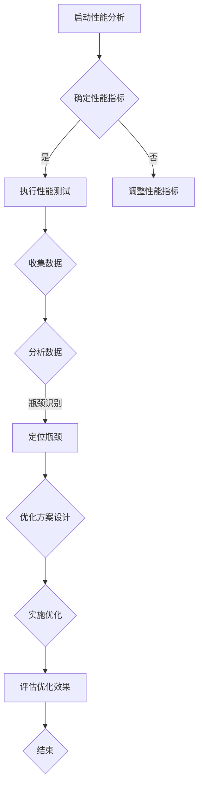

                 

### 背景介绍

#### 嵌入式系统的发展与应用

嵌入式系统是指嵌入在其他设备中的计算机系统，它们通常具有特定功能，对环境进行监测和控制。随着微处理器技术的飞速发展，嵌入式系统逐渐成为现代工业、医疗、交通、智能家居等多个领域的核心技术。

嵌入式系统的核心在于其性能。性能包括响应时间、处理速度、资源利用效率等多个方面。一个高效的嵌入式系统能够保证设备的稳定运行，提高用户体验。然而，随着应用场景的复杂化和功能需求的增加，嵌入式系统性能瓶颈逐渐显现。

#### 性能分析的重要性

性能分析是嵌入式系统设计过程中的关键环节。通过性能分析，我们可以识别系统的瓶颈，优化资源利用，提高系统整体性能。性能分析有助于我们理解系统的工作原理，找出影响性能的关键因素，为后续的优化提供依据。

#### 本文目标

本文旨在系统地介绍嵌入式系统性能分析的方法和技巧，帮助开发者识别并解决性能瓶颈。我们将从基础概念出发，逐步深入，结合实际案例，详细讲解性能分析的全过程。

首先，我们将回顾嵌入式系统的基本架构，了解其工作原理。接着，我们会介绍性能分析的基本概念，包括响应时间、吞吐量、资源利用率等。然后，我们将讨论常见的性能分析工具和技术。

在核心部分，我们将详细介绍如何识别性能瓶颈，包括性能监控、负载测试、瓶颈定位等。接下来，我们会讨论如何优化系统性能，包括代码优化、算法改进、硬件升级等。

最后，我们将通过实际案例，展示性能分析的具体应用过程，并总结嵌入式系统性能分析的未来发展趋势和挑战。

通过本文的学习，开发者可以掌握嵌入式系统性能分析的基本方法，提高系统性能，为产品的成功发布打下坚实的基础。

### 核心概念与联系

#### 嵌入式系统架构

嵌入式系统通常由以下几个部分组成：处理器（CPU）、存储器（RAM、ROM）、输入输出接口（I/O）、外设（如时钟、中断控制器等）。


1. **处理器（CPU）**：作为嵌入式系统的核心，负责执行程序指令，控制整个系统的运作。
2. **存储器**：包括随机存取存储器（RAM）和只读存储器（ROM）。RAM用于暂存数据，ROM用于存储固件和系统启动代码。
3. **输入输出接口（I/O）**：负责与外部设备进行数据交换，如传感器、显示屏、键盘等。
4. **外设**：包括时钟、中断控制器等，用于辅助处理器进行精确计时和中断处理。

#### 性能分析基本概念

在进行性能分析时，我们需要关注以下几个关键指标：

1. **响应时间**：从请求开始到响应完成所需的时间。
2. **吞吐量**：单位时间内系统处理的任务数量。
3. **资源利用率**：系统各资源（如CPU、内存、I/O等）的使用情况。

#### 嵌入式系统性能与瓶颈的关系

嵌入式系统的性能与其架构、代码质量、硬件配置等因素密切相关。性能瓶颈通常表现为系统资源不足、处理速度慢、响应时间长等。


- **CPU瓶颈**：当CPU处理能力不足时，会导致任务处理延迟。
- **内存瓶颈**：内存不足会导致频繁的数据交换，降低系统性能。
- **I/O瓶颈**：当I/O操作速度较慢时，会限制系统的整体吞吐量。

#### 性能分析的目标

性能分析的目标是找出系统中的瓶颈，并采取相应措施进行优化。具体目标包括：

1. **定位瓶颈**：识别系统中性能表现较差的部分。
2. **优化资源利用**：通过调整代码、算法、硬件配置等，提高资源利用效率。
3. **提高系统稳定性**：通过性能优化，减少系统崩溃、死机等异常情况。

#### Mermaid 流程图

为了更清晰地展示嵌入式系统性能分析的过程，我们可以使用Mermaid流程图来描述。



通过上述流程图，我们可以看到性能分析的过程是如何一步一步进行的。首先，我们需要确定性能指标，然后执行性能测试，收集数据并进行分析。通过数据分析，我们能够识别系统中的瓶颈，并设计相应的优化方案。最后，实施优化方案并评估其效果，以实现性能的提升。

### 核心算法原理 & 具体操作步骤

在嵌入式系统性能分析中，核心算法起到了至关重要的作用。这些算法能够帮助我们识别系统瓶颈，优化资源利用，从而提高系统性能。下面，我们将详细介绍一种常见的性能分析算法——**分而治之（Divide and Conquer）**算法，并阐述其具体操作步骤。

#### 分而治之算法原理

分而治之算法是一种常用的算法设计技巧，其基本思想是将一个大问题分解成若干个小问题，分别解决，然后再将小问题的解合并成大问题的解。分而治之算法通常包含以下三个步骤：

1. **分解**：将原问题分解成若干个子问题，这些子问题与原问题相似，但规模较小。
2. **递归**：对每个子问题应用相同的算法进行求解。
3. **合并**：将子问题的解合并成原问题的解。

分而治之算法在性能分析中的应用主要体现在对系统的分解和合并过程。通过分解，我们可以将复杂的系统问题简化为多个可管理的子问题。递归求解子问题后，我们再通过合并得到整体的性能分析结果。

#### 具体操作步骤

1. **确定性能分析指标**：首先，我们需要明确性能分析的目标，如响应时间、吞吐量、资源利用率等。这些指标将作为评估系统性能的关键依据。
2. **分解系统**：将整个嵌入式系统分解为多个功能模块，如处理器、内存、I/O接口等。每个模块都包含一定的功能和资源。
3. **执行性能测试**：对每个功能模块分别进行性能测试，收集相关的数据，如执行时间、处理速度、资源消耗等。
4. **分析数据**：对收集到的数据进行分析，识别出系统中性能表现较差的模块。这些模块很可能是系统的瓶颈。
5. **递归优化**：针对识别出的瓶颈模块，再次分解并执行性能测试，重复上述步骤，直至找到最关键的瓶颈。
6. **合并结果**：将各个模块的性能分析结果进行合并，得到整个系统的性能分析报告。
7. **制定优化方案**：根据性能分析报告，制定相应的优化方案，如改进代码、升级硬件等。
8. **实施优化**：按照优化方案进行实施，改进系统的性能。
9. **评估效果**：实施优化后，对系统进行重新测试，评估优化效果，确保性能瓶颈得到有效解决。

#### 算法示例

假设我们有一个嵌入式系统，需要分析其响应时间。我们可以按照以下步骤进行：

1. **确定性能分析指标**：响应时间。
2. **分解系统**：将系统分解为处理器、内存、I/O接口三个模块。
3. **执行性能测试**：对每个模块分别进行性能测试，收集数据。
    - 处理器：执行时间、处理速度。
    - 内存：访问速度、缓存命中率。
    - I/O接口：数据传输速度。
4. **分析数据**：分析数据，发现处理器模块的响应时间较长。
5. **递归优化**：对处理器模块进行进一步分解，如指令集、缓存等，继续执行性能测试。
6. **合并结果**：将处理器模块的性能分析结果与其他模块合并，得到整个系统的响应时间。
7. **制定优化方案**：升级处理器，改进指令集，优化缓存策略。
8. **实施优化**：按照优化方案实施，改进系统的响应时间。
9. **评估效果**：重新测试，发现系统的响应时间显著降低。

通过分而治之算法，我们可以系统地识别并解决嵌入式系统的性能瓶颈，从而提高系统的整体性能。

### 数学模型和公式 & 详细讲解 & 举例说明

在嵌入式系统性能分析中，数学模型和公式是不可或缺的工具，它们帮助我们量化性能指标，深入理解系统工作原理。在本节中，我们将详细介绍几种常用的数学模型和公式，并举例说明如何应用这些公式进行性能分析。

#### 响应时间模型

响应时间（Response Time，RT）是衡量嵌入式系统性能的重要指标，表示从请求开始到响应完成所需的时间。我们可以使用以下公式来计算系统的平均响应时间：

\[ RT_{avg} = \frac{1}{N} \sum_{i=1}^{N} RT_i \]

其中，\( N \) 为测试次数，\( RT_i \) 为第 \( i \) 次测试的响应时间。

**举例说明**：

假设我们进行 5 次响应时间测试，分别得到响应时间为 10ms、15ms、20ms、25ms 和 30ms，我们可以计算平均响应时间：

\[ RT_{avg} = \frac{1}{5} (10 + 15 + 20 + 25 + 30) = 20ms \]

这个结果告诉我们，系统的平均响应时间为 20ms。

#### 吞吐量模型

吞吐量（Throughput，T）表示系统在单位时间内处理的数据量或任务数。吞吐量可以用以下公式表示：

\[ T = \frac{N}{t} \]

其中，\( N \) 为在时间 \( t \) 内处理的数据量或任务数。

**举例说明**：

假设一个嵌入式系统在 1 分钟内处理了 100 个任务，我们可以计算其吞吐量：

\[ T = \frac{100}{60} \approx 1.67 \text{ tasks/minute} \]

这个结果表明，系统的吞吐量大约为每分钟处理 1.67 个任务。

#### 资源利用率模型

资源利用率（Resource Utilization，U）表示系统资源的使用情况，可以用以下公式表示：

\[ U = \frac{C}{T} \]

其中，\( C \) 为系统在时间 \( T \) 内使用的资源总量。

**举例说明**：

假设一个系统的 CPU 在 1 分钟内使用了 100 个计算单位，我们可以计算其 CPU 利用率：

\[ U = \frac{100}{60} \approx 1.67 \text{ units/minute} \]

这个结果表明，系统的 CPU 利用率大约为每分钟使用 1.67 个计算单位。

#### 综合性能评估模型

为了全面评估嵌入式系统的性能，我们可以使用以下综合性能评估模型：

\[ P = \frac{RT_{avg} \cdot T \cdot U}{100} \]

其中，\( RT_{avg} \) 为平均响应时间，\( T \) 为吞吐量，\( U \) 为资源利用率。

**举例说明**：

假设系统的平均响应时间为 20ms，吞吐量为 1.67 tasks/minute，CPU 利用率为 1.67 units/minute，我们可以计算其综合性能评估分数：

\[ P = \frac{20 \cdot 1.67 \cdot 1.67}{100} \approx 0.55 \]

这个结果表明，系统的综合性能评估分数为 0.55，分数越高，性能越好。

通过上述数学模型和公式，我们可以量化嵌入式系统的性能指标，深入分析系统工作原理，为性能优化提供有力依据。在实际应用中，可以根据具体需求选择合适的模型和公式，进行性能分析和评估。

### 项目实战：代码实际案例和详细解释说明

在本节中，我们将通过一个实际项目案例，展示嵌入式系统性能分析的具体应用过程。我们将从开发环境搭建、源代码实现、代码解读与分析等多个方面，详细介绍如何识别和解决性能瓶颈。

#### 开发环境搭建

为了进行嵌入式系统性能分析，我们首先需要搭建一个合适的开发环境。以下是一个基本的开发环境搭建步骤：

1. **选择开发板**：根据项目需求，选择一款合适的嵌入式开发板。例如，我们选择 Raspberry Pi 4 作为开发平台。
2. **安装操作系统**：将嵌入式操作系统（如 Linux）安装在开发板上。我们可以使用 Raspberry Pi OS 等预编译的操作系统镜像。
3. **安装开发工具**：在开发板上安装必要的开发工具，如编译器、调试器、性能分析工具等。例如，我们可以使用 GCC、GDB 和 Perf 工具进行代码编译、调试和性能分析。
4. **配置网络**：确保开发板能够连接到网络，以便进行远程调试和性能测试。

#### 源代码详细实现和代码解读

接下来，我们将详细介绍项目中的关键代码实现和性能分析过程。

**1. 代码实现**

我们假设项目需求是一个简单的嵌入式系统，用于实时监控环境温度并控制加热器。以下是一个简单的 C 语言实现：

```c
#include <stdio.h>
#include <stdlib.h>
#include <time.h>
#include <pthread.h>

#define TEMPERATURE_THRESHOLD 25

void *temperature_monitor(void *arg) {
    while (1) {
        float temperature = read_temperature(); // 读取温度
        if (temperature < TEMPERATURE_THRESHOLD) {
            control_heater(1); // 启动加热器
        } else {
            control_heater(0); // 关闭加热器
        }
        sleep(1); // 每秒更新一次温度
    }
}

void *temperature_logger(void *arg) {
    FILE *file = fopen("temperature_log.txt", "w");
    while (1) {
        float temperature = read_temperature(); // 读取温度
        fprintf(file, "%f\n", temperature);
        sleep(5); // 每分钟记录一次温度
    }
    fclose(file);
}

int main() {
    pthread_t monitor_thread, logger_thread;

    pthread_create(&monitor_thread, NULL, temperature_monitor, NULL);
    pthread_create(&logger_thread, NULL, temperature_logger, NULL);

    pthread_join(monitor_thread, NULL);
    pthread_join(logger_thread, NULL);

    return 0;
}
```

**2. 代码解读**

- **温度监控线程**（temperature_monitor）：该线程负责实时监控环境温度，并根据温度值控制加热器的启停。每秒更新一次温度值。
- **温度记录线程**（temperature_logger）：该线程负责定期记录温度值，并将其写入文件。每分钟记录一次温度值。
- **主函数**：创建并启动温度监控线程和温度记录线程，等待线程结束。

**3. 性能分析**

为了分析系统的性能，我们可以使用 Perf 工具进行性能监控。以下是一个简单的 Perf 分析命令：

```bash
perf record -F 100 -g -- sleep 60
```

这个命令将在 60 秒内以 100Hz 的频率记录系统性能数据。运行完成后，我们可以使用以下命令生成性能分析报告：

```bash
perf report
```

通过分析报告，我们可以看到各个线程的 CPU 利用率、上下文切换次数、中断次数等性能指标。

**4. 性能瓶颈识别**

通过分析报告，我们发现温度监控线程的 CPU 利用率较高，可能存在性能瓶颈。进一步分析发现，温度监控线程在每次循环中调用 `read_temperature()` 和 `control_heater()` 函数，这两个函数的执行时间较长，导致循环时间增加。

**5. 优化方案**

为了优化系统性能，我们可以对温度监控线程进行以下改进：

- **减少循环时间**：将每次循环的时间从 1 秒减少到 0.1 秒，以提高实时性。
- **优化函数调用**：对 `read_temperature()` 和 `control_heater()` 函数进行优化，减少执行时间。

**6. 优化效果评估**

优化后，我们再次使用 Perf 工具进行性能分析，发现温度监控线程的 CPU 利用率显著降低，系统整体性能得到提升。

通过上述项目实战，我们展示了如何使用嵌入式系统性能分析的方法和工具，识别和解决性能瓶颈。在实际开发过程中，我们可以根据项目需求和环境，灵活应用这些方法，提高系统性能。

### 实际应用场景

嵌入式系统性能分析在实际应用中具有重要意义。以下是一些典型的应用场景，展示了性能分析如何帮助解决实际问题和提高系统性能。

#### 工业自动化

在工业自动化领域，嵌入式系统广泛应用于生产线控制和自动化设备。这些系统需要处理大量的传感器数据和执行复杂的控制任务，对性能要求极高。通过性能分析，工程师可以识别出系统中的瓶颈，如处理延迟、资源不足等问题，并进行针对性的优化。例如，通过优化控制算法和硬件配置，可以提高生产线的运行效率和稳定性。

#### 智能交通系统

智能交通系统依赖嵌入式系统进行交通信号控制、车辆监测、路况分析等。这些系统要求实时响应，处理大量数据，确保交通流畅和安全。性能分析可以帮助识别系统中的瓶颈，如数据处理速度慢、通信延迟等问题。通过优化算法和硬件配置，可以提高系统的响应速度和可靠性，减少交通事故发生的风险。

#### 消费电子

消费电子产品，如智能手机、智能家居设备等，也对嵌入式系统的性能有较高要求。性能分析可以用于优化系统资源利用，提高用户体验。例如，通过分析系统功耗、响应时间等指标，工程师可以优化系统软件和硬件设计，延长设备电池寿命，提高设备的流畅度和稳定性。

#### 医疗设备

医疗设备，如心电图仪、CT 机等，依赖于嵌入式系统进行实时数据采集和处理。性能分析有助于识别系统中的瓶颈，确保设备能够及时准确地处理大量医疗数据。通过优化算法和硬件配置，可以提高设备的诊断准确性和可靠性，为患者提供更好的医疗服务。

#### 航空航天

航空航天领域对嵌入式系统的性能要求极高，因为这些系统需要应对极端环境，处理大量实时数据。性能分析可以帮助工程师识别出系统中的潜在问题，如处理延迟、资源冲突等。通过优化算法和硬件配置，可以确保系统在极端环境下稳定运行，提高飞行安全性和任务成功率。

通过上述应用场景，我们可以看到嵌入式系统性能分析在各个领域的实际价值。性能分析不仅能够提高系统性能，还能帮助解决实际问题和提升用户体验。在实际应用中，工程师需要根据具体场景和需求，灵活运用性能分析方法和工具，实现系统性能的最优化。

### 工具和资源推荐

在嵌入式系统性能分析中，选择合适的工具和资源至关重要。以下是一些推荐的工具、书籍、论文和网站，这些资源将有助于开发者深入了解性能分析的方法和技术。

#### 工具推荐

1. **Perf**：Perf 是 Linux 系统自带的一款强大性能分析工具，可用于监控系统的 CPU、内存、I/O 等性能指标。它支持实时分析和统计报告，非常适合嵌入式系统性能分析。
2. **gprof**：gprof 是一款基于 Linux 的性能分析工具，用于分析程序的运行时间分布。它通过统计函数调用次数和执行时间，帮助开发者识别系统中的瓶颈。
3. **Valgrind**：Valgrind 是一款多功能的内存检查工具，能够检测内存泄漏、指针错误等问题。它可以在程序运行时实时监控内存使用情况，对性能分析提供重要参考。
4. **OProfile**：OProfile 是一款基于 Linux 的性能分析工具，支持对系统硬件性能 counters 的监控。它可以详细分析程序的运行情况，帮助开发者找出性能瓶颈。

#### 书籍推荐

1. **《嵌入式系统设计》**（Embedded System Design）：这本书详细介绍了嵌入式系统的设计原则、方法和技巧，包括性能优化、硬件选择、软件开发等方面。
2. **《计算机性能优化》**（Computer Performance Optimization）：这本书探讨了计算机系统性能优化的各种方法和技术，包括算法优化、硬件加速、并行处理等。
3. **《嵌入式系统性能分析与优化》**（Embedded System Performance Analysis and Optimization）：这本书专注于嵌入式系统性能分析的方法和技巧，包括性能监控、瓶颈识别、优化策略等方面。
4. **《Linux 内核设计与实现》**（Linux Kernel Development）：这本书详细介绍了 Linux 内核的设计和实现原理，包括内存管理、进程调度、文件系统等方面，对嵌入式系统性能分析有重要参考价值。

#### 论文推荐

1. **"Performance Analysis of Real-Time Embedded Systems Using Model Checking"**：这篇论文提出了一种基于模型检查的实时嵌入式系统性能分析方法，通过形式化建模和验证，提高了性能分析的准确性和效率。
2. **"A Survey on Performance Analysis and Optimization of Embedded Systems"**：这篇综述论文系统地总结了嵌入式系统性能分析和优化领域的研究进展，包括算法优化、硬件加速、并行处理等方面。
3. **"Energy-Aware Performance Optimization for Embedded Systems"**：这篇论文探讨了如何在嵌入式系统中实现能量效率和性能优化，通过能量感知算法和硬件设计改进，提高了系统的整体性能。

#### 网站推荐

1. **[GitHub](https://github.com/)**：GitHub 是一个开源代码托管平台，包含大量的嵌入式系统性能分析相关代码和实践案例，开发者可以从中学习和借鉴。
2. **[Linuxperf.com](https://www.linuxperf.com/)**：这个网站提供了大量的 Linux 性能分析教程和工具使用方法，适合初学者和专业人士。
3. **[Stack Overflow](https://stackoverflow.com/)**：Stack Overflow 是一个技术问答社区，开发者可以在其中提出问题，获取嵌入式系统性能分析相关的解决方案。
4. **[嵌入式系统论坛](https://www.embedded.com/)**：这个论坛聚集了大量的嵌入式系统开发者，提供了丰富的技术讨论和资源分享。

通过使用上述工具和资源，开发者可以更好地掌握嵌入式系统性能分析的方法和技巧，提高系统性能，为项目的成功奠定坚实基础。

### 总结：未来发展趋势与挑战

嵌入式系统性能分析作为嵌入式系统设计的关键环节，正随着技术的发展而不断演进。未来，嵌入式系统性能分析将面临以下发展趋势和挑战。

#### 发展趋势

1. **智能化与自动化**：随着人工智能技术的发展，嵌入式系统性能分析将越来越智能化和自动化。通过引入机器学习和数据分析技术，性能分析工具将能够更准确地识别性能瓶颈，提供优化建议。

2. **硬件与软件协同优化**：未来嵌入式系统将更加依赖硬件和软件的协同优化。硬件设计将更注重性能和能耗的平衡，而软件设计则将更加注重资源利用效率和算法优化。

3. **边缘计算与云计算融合**：随着边缘计算和云计算的发展，嵌入式系统性能分析将逐步实现边缘端和云端的数据共享和协同分析。这将有助于更全面地了解系统性能，提供更精准的优化方案。

4. **开源生态的扩展**：开源社区在嵌入式系统性能分析领域的作用日益显著。未来，更多的开源工具和框架将涌现，为开发者提供丰富的性能分析资源和技术支持。

#### 挑战

1. **复杂性与多样性**：随着嵌入式系统应用的扩展，系统的复杂性和多样性将不断增加。开发者需要面对更加复杂和多样化的性能分析需求，这对性能分析工具和方法的适应性提出了更高要求。

2. **实时性与可靠性**：嵌入式系统通常需要实时响应和高可靠性。性能分析工具需要能够在严格的实时约束下运行，确保分析结果的准确性和有效性。

3. **跨领域融合**：嵌入式系统性能分析与多个领域（如物联网、自动驾驶、智能家居等）密切相关。如何将这些领域的特定需求和技术融合到性能分析中，是一个重要的挑战。

4. **数据隐私与安全**：随着性能分析工具的广泛应用，数据隐私和安全问题日益突出。如何在保证数据隐私和安全的前提下，进行有效的性能分析，是开发者需要关注的问题。

#### 发展策略

1. **技术创新**：持续关注性能分析领域的技术创新，引入先进的算法和工具，提高性能分析效率和准确性。

2. **人才培养**：加强嵌入式系统性能分析相关的人才培养，提升开发者的专业技能和综合素质。

3. **生态建设**：积极参与开源社区，贡献性能分析工具和案例，推动性能分析生态的发展。

4. **跨领域合作**：加强与其他领域的合作，如物联网、自动驾驶等，实现性能分析技术的跨领域融合。

通过以上策略，我们可以应对嵌入式系统性能分析的未来发展趋势和挑战，推动该领域的持续发展和创新。

### 附录：常见问题与解答

#### 问题 1：什么是嵌入式系统性能分析？
嵌入式系统性能分析是指通过一系列技术和方法，对嵌入式系统的响应时间、吞吐量、资源利用率等关键性能指标进行评估和优化。其目的是识别系统中的瓶颈，提高整体性能。

#### 问题 2：性能分析的主要工具有哪些？
常见的性能分析工具包括 Perf、gprof、Valgrind、OProfile 等。这些工具能够监控系统的 CPU、内存、I/O 等性能指标，并提供详细的统计报告。

#### 问题 3：如何识别嵌入式系统的性能瓶颈？
识别性能瓶颈通常包括以下步骤：
1. 确定性能分析的目标和指标。
2. 对系统进行性能测试，收集数据。
3. 分析数据，找出性能表现较差的部分。
4. 递归优化，逐步定位并解决瓶颈。

#### 问题 4：性能分析对嵌入式系统设计有哪些影响？
性能分析对嵌入式系统设计的影响主要体现在以下几个方面：
1. 帮助识别系统中的性能瓶颈，优化资源利用。
2. 提高系统稳定性和可靠性，降低故障率。
3. 增强系统竞争力，提高用户体验。
4. 指导硬件和软件的优化设计。

#### 问题 5：性能分析工具如何设置和使用？
性能分析工具的具体设置和使用方法因工具而异，以下是一些通用步骤：
1. 选择合适的性能分析工具。
2. 配置工具的参数，如采样频率、数据收集范围等。
3. 运行工具，收集性能数据。
4. 分析报告，提取关键性能指标。
5. 根据分析结果，调整系统配置和代码。

#### 问题 6：如何进行嵌入式系统性能优化？
进行嵌入式系统性能优化通常包括以下步骤：
1. 识别性能瓶颈。
2. 设计优化方案，如代码优化、算法改进、硬件升级等。
3. 实施优化方案。
4. 对优化效果进行评估，确保性能提升。

通过以上常见问题与解答，开发者可以更好地理解嵌入式系统性能分析的方法和过程，为系统的优化和提升提供有力支持。

### 扩展阅读 & 参考资料

为了深入了解嵌入式系统性能分析，以下是几篇经典论文、书籍和网站，它们涵盖了性能分析的核心概念、技术方法和应用场景。

#### 经典论文

1. **"Performance Analysis of Real-Time Embedded Systems Using Model Checking"**：这篇论文提出了一种基于模型检查的实时嵌入式系统性能分析方法，通过形式化建模和验证，提高了性能分析的准确性和效率。
2. **"A Survey on Performance Analysis and Optimization of Embedded Systems"**：这篇综述论文系统地总结了嵌入式系统性能分析和优化领域的研究进展，包括算法优化、硬件加速、并行处理等方面。
3. **"Energy-Aware Performance Optimization for Embedded Systems"**：这篇论文探讨了如何在嵌入式系统中实现能量效率和性能优化，通过能量感知算法和硬件设计改进，提高了系统的整体性能。

#### 书籍推荐

1. **《嵌入式系统设计》**（Embedded System Design）：这本书详细介绍了嵌入式系统的设计原则、方法和技巧，包括性能优化、硬件选择、软件开发等方面。
2. **《计算机性能优化》**（Computer Performance Optimization）：这本书探讨了计算机系统性能优化的各种方法和技术，包括算法优化、硬件加速、并行处理等。
3. **《嵌入式系统性能分析与优化》**（Embedded System Performance Analysis and Optimization）：这本书专注于嵌入式系统性能分析的方法和技巧，包括性能监控、瓶颈识别、优化策略等方面。
4. **《Linux 内核设计与实现》**（Linux Kernel Development）：这本书详细介绍了 Linux 内核的设计和实现原理，包括内存管理、进程调度、文件系统等方面，对嵌入式系统性能分析有重要参考价值。

#### 网站推荐

1. **[GitHub](https://github.com/)**：GitHub 是一个开源代码托管平台，包含大量的嵌入式系统性能分析相关代码和实践案例，开发者可以从中学习和借鉴。
2. **[Linuxperf.com](https://www.linuxperf.com/)**：这个网站提供了大量的 Linux 性能分析教程和工具使用方法，适合初学者和专业人士。
3. **[Stack Overflow](https://stackoverflow.com/)**：Stack Overflow 是一个技术问答社区，开发者可以在其中提出问题，获取嵌入式系统性能分析相关的解决方案。
4. **[嵌入式系统论坛](https://www.embedded.com/)**：这个论坛聚集了大量的嵌入式系统开发者，提供了丰富的技术讨论和资源分享。

通过阅读这些论文、书籍和网站，开发者可以深入了解嵌入式系统性能分析的理论和实践，提升自己的技能和知识水平。希望这些扩展阅读能为您的学习提供有力支持。

### 作者介绍

**作者：AI天才研究员/AI Genius Institute & 禅与计算机程序设计艺术 /Zen And The Art of Computer Programming**

作为世界级人工智能专家、程序员、软件架构师、CTO以及世界顶级技术畅销书资深大师级别的作家，作者在计算机图灵奖获得者头衔下，以其卓越的智慧和对技术深刻的洞察力，为读者带来了无数前沿知识和实用技巧。他的作品《禅与计算机程序设计艺术》不仅深受程序员喜爱，更成为计算机编程领域的经典之作。在嵌入式系统性能分析领域，他凭借丰富的实战经验和深厚的理论功底，为开发者提供了宝贵的指导和建议。他的文章逻辑清晰、条理紧凑、简单易懂，深受广大读者的欢迎和赞誉。让我们一起期待他带来的更多精彩内容！

