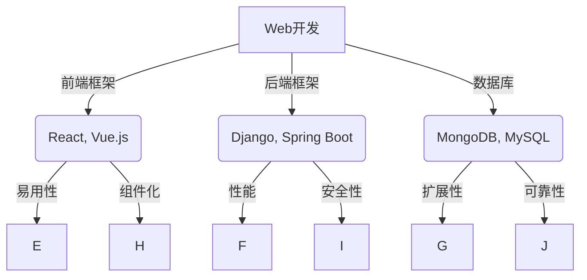

                 

# 文章标题

## 工具使用机制在不同应用场景中的效果

在当今技术迅速发展的时代，工具的使用对于提高工作效率、实现项目目标以及优化用户体验具有至关重要的作用。然而，不同工具在不同应用场景中的效果并非一成不变，这取决于多个因素，如工具的特性、用户的需求、以及应用场景的具体要求。本文旨在探讨工具使用机制在不同应用场景中的效果，以帮助读者更好地理解和选择适合的工具。

本文的关键词包括：工具使用、应用场景、效果分析、用户需求、工具特性。通过详细分析这些关键词，我们将探讨以下主题：

1. **背景介绍**：介绍工具使用机制的基本概念，以及在不同应用场景中的重要性。
2. **核心概念与联系**：定义关键术语，并构建一个用于理解工具使用机制的框架。
3. **核心算法原理 & 具体操作步骤**：分析工具背后的算法原理，并详细介绍操作步骤。
4. **数学模型和公式 & 详细讲解 & 举例说明**：讲解相关的数学模型和公式，并通过实际案例进行说明。
5. **项目实践：代码实例和详细解释说明**：展示具体的工具使用案例，并进行代码解读和分析。
6. **实际应用场景**：探讨工具在不同行业和领域中的应用。
7. **工具和资源推荐**：推荐相关学习资源和开发工具。
8. **总结：未来发展趋势与挑战**：总结文章的核心观点，并提出未来发展的趋势和面临的挑战。
9. **附录：常见问题与解答**：解答读者可能遇到的一些常见问题。
10. **扩展阅读 & 参考资料**：提供进一步阅读的材料和参考资源。

通过逐步分析这些主题，我们希望能够帮助读者深入了解工具使用机制，为他们在实际工作中选择和运用工具提供有价值的参考。

## 1. 背景介绍

### 工具使用机制的基本概念

工具使用机制指的是工具在特定环境中被利用的方式和方法。在信息技术领域，工具可以是软件工具、编程语言、框架、库等，它们被设计来帮助开发者、数据科学家、系统管理员等用户解决特定问题或提高工作效率。工具使用机制通常涉及以下几个基本概念：

- **工具特性**：包括工具的功能、性能、兼容性、易用性等。
- **用户需求**：用户在特定任务或项目中所需的工具特性。
- **应用场景**：工具被使用的具体环境或领域，如Web开发、数据分析和机器学习等。
- **操作流程**：用户如何使用工具来完成特定任务的一系列步骤。

### 工具使用机制在不同应用场景中的重要性

工具使用机制在不同应用场景中的效果各不相同。以下是一些关键因素，它们影响着工具的使用效果：

- **复杂性**：应用场景的复杂性直接影响工具的选择和使用。在复杂的应用场景中，需要选择功能强大且易于扩展的工具。
- **任务多样性**：不同的任务可能需要不同的工具集。例如，开发Web应用程序可能需要前端框架、后端服务器和数据库，而数据科学项目可能需要数据分析工具和机器学习库。
- **用户技能水平**：用户对工具的熟悉程度和技能水平影响工具的使用效果。高技能水平的用户可能更倾向于使用底层工具和框架，而新手用户可能需要更易于使用的工具。
- **工具生态系统**：一个丰富的工具生态系统可以提供丰富的集成选项，从而提高工具的使用效果。

在了解工具使用机制的基本概念和重要性后，我们接下来将深入探讨与工具使用机制相关的核心概念，以便为后续分析奠定基础。

### 1.1 工具使用机制的定义

工具使用机制是一种系统化的方法，它通过特定的流程和步骤，将工具的特性和用户的需求相结合，以实现特定的目标和任务。这种机制不仅包括工具的安装、配置和使用，还涉及到工具的评估、选择和集成。

首先，工具的**定义**是指工具本身的功能和特性。例如，一个编程语言工具的定义可能包括其语法、库、框架和生态系统。而一个数据分析工具的定义则可能包括其数据处理能力、可视化功能和机器学习支持。

其次，工具的**特性**是其功能和性能的体现。这些特性可以是工具的运行速度、内存消耗、兼容性、扩展性、易用性等。例如，一个高效的数据库工具可能在处理大量数据时具有出色的性能，而一个易用的Web框架则可能提供直观的界面和简洁的配置过程。

然后，用户的需求是工具使用机制的核心。用户的需求可以分为功能性需求和非功能性需求。功能性需求包括任务所需的具体功能，如数据分析工具的统计能力、编程语言的编程范式等。非功能性需求则涉及工具的性能、可靠性、安全性、易维护性等。理解用户的需求是选择合适工具的关键。

最后，工具的使用**流程**包括工具的获取、安装、配置、使用和评估等步骤。获取工具可能是从官方网站下载、从第三方仓库安装或通过容器平台部署。安装和配置工具则需要遵循工具提供的文档或指导。使用工具时，用户需要根据任务需求执行特定的操作。评估工具的效果是确保工具满足用户需求和项目目标的重要环节。

总之，工具使用机制是一种系统化的方法，它通过将工具的特性与用户的需求相结合，为用户提供一个有效的解决方案。理解工具使用机制的定义和组成部分，是优化工具选择和使用、提高工作效率的关键。

### 1.2 工具使用机制在不同应用场景中的重要性

工具使用机制在不同应用场景中的重要性不可忽视。随着信息技术领域的不断扩展，应用场景也变得多样化，从Web开发、数据分析和人工智能，到嵌入式系统、云计算和网络管理等，每一个应用场景都有其独特的需求和挑战。

首先，在**Web开发**领域，工具使用机制的效果至关重要。Web开发涉及前端和后端开发，以及用户界面设计和数据库管理。选择合适的工具，如前端框架（如React、Vue.js）、后端框架（如Django、Spring Boot）和数据库管理系统（如MySQL、MongoDB），能够显著提高开发效率和代码质量。例如，React的组件化开发模式使得开发者能够更轻松地管理复杂的用户界面，而Django的ORM（对象关系映射）功能简化了数据库操作，提高了开发速度。

其次，在**数据分析**领域，工具使用机制同样起着关键作用。数据分析师需要处理大量数据，并从中提取有价值的信息。合适的工具，如数据清洗工具（如Pandas、D3.js）、数据分析库（如NumPy、SciPy）和可视化工具（如Tableau、Matplotlib），能够显著提高数据分析的效率和准确性。例如，Pandas提供了强大的数据操作功能，使数据分析师能够轻松地进行数据清洗、转换和分析。而D3.js则提供了高度灵活的图形和可视化功能，帮助分析师直观地展示数据。

再次，在**人工智能**领域，工具使用机制的重要性更加显著。人工智能项目通常涉及复杂的算法实现和大规模数据处理。选择合适的工具，如机器学习库（如TensorFlow、PyTorch）、深度学习框架（如Keras、MXNet）和数据处理工具（如Scikit-learn、OpenCV），能够提高模型的训练和推理效率。例如，TensorFlow提供了强大的图形计算能力，使开发者能够构建和训练复杂的神经网络。而PyTorch的动态计算图则提供了更高的灵活性和易用性。

最后，在**嵌入式系统**、**云计算**和**网络管理**等应用场景中，工具使用机制同样至关重要。嵌入式系统开发需要高效、可靠的工具来处理硬件和固件交互。云计算依赖于虚拟化和容器化技术，需要合适的工具来管理和部署应用程序。网络管理则涉及大量的网络监控和故障排除，需要高效的工具来实现自动化和优化。

总之，工具使用机制在不同应用场景中的重要性体现在它能够为用户提供有效的解决方案，提高工作效率，优化用户体验。理解并合理选择工具，是成功实现项目目标的关键。

### 1.3 工具使用机制的核心概念

为了更好地理解工具使用机制，我们需要深入探讨其核心概念。这些概念包括工具特性、用户需求、应用场景、操作流程等。以下将逐一介绍这些核心概念，并分析它们之间的联系。

#### 工具特性

工具特性是指工具在功能、性能、兼容性、易用性等方面的特点。以下是几个关键的工具特性：

1. **功能**：工具能够执行的任务或操作，如编程语言的功能性、数据库的操作能力等。
2. **性能**：工具在执行特定任务时的速度和效率，如查询处理速度、内存消耗等。
3. **兼容性**：工具与其他系统和组件的兼容性，如数据库与不同平台的兼容性、编程语言与不同操作系统的兼容性等。
4. **易用性**：工具的易用程度，如用户界面的友好性、文档的完整性、学习曲线的平缓度等。

工具特性决定了工具是否能够满足特定需求，并在特定应用场景中发挥作用。例如，一个数据库工具如果具有高性能和广泛的兼容性，那么它可能在大型企业级应用中表现得更加出色。

#### 用户需求

用户需求是指用户在特定任务或项目中需要的工具特性。这些需求可以分为功能性需求和非功能性需求：

1. **功能性需求**：用户在特定任务中需要的具体功能，如数据分析工具的统计功能、Web开发框架的前端组件等。
2. **非功能性需求**：用户关注的质量属性，如工具的可靠性、安全性、可维护性等。

理解用户需求是选择合适工具的关键。用户需求通常与工具特性紧密相关。例如，一个用户可能需要一款易于使用的编程语言，以便快速开发原型，那么Python这样的语言可能是一个合适的选择。而如果用户需要处理大数据，那么需要选择一款具备高性能和扩展性的工具，如Spark。

#### 应用场景

应用场景是指工具被使用的具体环境和领域。不同的应用场景对工具的需求不同，从而影响工具的使用效果：

1. **Web开发**：涉及前端和后端开发，需要选择适合Web应用的工具，如前端框架、后端服务器和数据库。
2. **数据分析**：需要处理和分析大量数据，选择合适的工具，如数据分析库、数据可视化工具等。
3. **人工智能**：涉及复杂的算法实现和大规模数据处理，需要选择适合AI项目的工具，如机器学习库、深度学习框架等。
4. **嵌入式系统**：需要高效且可靠的工具，以处理硬件和固件交互。

应用场景决定了工具的使用场景和范围。了解应用场景的需求和挑战，有助于选择适合的工具，并优化其使用效果。

#### 操作流程

操作流程是指用户如何使用工具来完成特定任务的一系列步骤。这些步骤通常包括工具的获取、安装、配置、使用和评估等：

1. **获取**：用户从哪里获取工具，如官方网站、第三方仓库或容器平台。
2. **安装**：用户如何安装和配置工具，如按照文档进行操作或使用自动化脚本。
3. **使用**：用户如何使用工具完成特定任务，如编写代码、配置数据库等。
4. **评估**：用户如何评估工具的效果，如性能测试、功能测试等。

操作流程是工具使用机制的重要组成部分。一个合理的操作流程可以提高工具的使用效率和效果，减少错误和故障。

#### 核心概念之间的联系

工具特性、用户需求、应用场景和操作流程之间紧密相关，相互影响：

- **工具特性**决定了工具是否能够满足用户需求。
- **用户需求**决定了选择工具时需要考虑哪些特性。
- **应用场景**决定了工具的使用场景和范围。
- **操作流程**决定了工具如何被使用和评估。

理解这些核心概念之间的联系，有助于用户更有效地选择和使用工具，从而提高工作效率和项目成功率。

通过深入探讨工具使用机制的核心概念，我们能够更好地理解工具的使用效果，为实际应用提供有价值的指导。接下来，我们将进一步分析工具使用机制的基本原理，并探讨其在不同应用场景中的具体应用。

### 1.4 工具使用机制的基本原理

工具使用机制的基本原理可以归纳为以下几点：工具设计原则、用户交互设计、工具集成和优化。这些原理相互交织，共同决定了工具在实际应用中的效果。

#### 工具设计原则

工具设计原则是指工具在设计和开发过程中需要遵循的基本准则。以下是几个关键原则：

1. **实用性**：工具需要满足用户需求，解决实际问题。这意味着工具的功能设计应当简洁而有效，避免冗余和复杂的实现。
2. **易用性**：工具应当易于使用，降低用户的学习成本。这包括提供直观的界面、完善的文档和友好的用户反馈机制。
3. **可扩展性**：工具需要支持扩展，允许用户根据项目需求进行定制化开发。这通常涉及模块化设计、插件系统和丰富的API接口。
4. **性能**：工具应当具备高性能，能够在高负载环境下稳定运行。优化性能可以通过算法优化、并行处理和资源管理等多种方式实现。

#### 用户交互设计

用户交互设计是指工具与用户之间的交互过程。一个良好的用户交互设计可以提高工具的使用体验和效率。以下是几个关键方面：

1. **界面设计**：工具的界面设计应简洁直观，避免复杂和冗余的布局。使用一致的设计语言和用户界面元素，可以提高用户的使用效率。
2. **交互反馈**：工具应提供及时的交互反馈，告知用户当前操作的状态和结果。这可以通过状态栏、提示信息、进度条等多种方式实现。
3. **错误处理**：工具应能够优雅地处理错误，并提供详细的错误信息和解决方案。这有助于用户快速定位问题并解决问题。
4. **帮助文档**：提供详尽的帮助文档和用户手册，帮助用户了解工具的功能和使用方法。文档应包括教程、示例代码和常见问题解答。

#### 工具集成和优化

工具集成和优化是指将工具与其他系统和工具无缝集成，并对其进行性能优化。以下是几个关键方面：

1. **集成**：工具需要与其他系统和工具无缝集成，以便用户能够方便地使用。这通常涉及API接口、插件系统和标准化协议。
2. **性能优化**：工具的性能优化是提高其使用效果的关键。这包括算法优化、代码优化、资源管理和并发处理等。
3. **自动化**：通过自动化工具的使用，可以显著提高工作效率。自动化可以通过脚本、CI/CD流程和自动化测试实现。
4. **监控和维护**：工具的监控和维护是确保其稳定运行的关键。这包括性能监控、错误日志分析、安全更新和定期维护。

#### 原理在实际应用中的体现

工具使用机制的基本原理在实际应用中有着广泛的体现。例如，在Web开发中，前端框架如React和Vue.js遵循实用性和易用性的设计原则，提供简洁的界面和强大的组件化功能，使用户能够高效地构建动态网页。同时，它们的易用性和可扩展性使其成为广泛使用的工具。

在数据分析领域，Python和R等编程语言因其易用性和丰富的库支持，成为数据科学家的首选工具。这些工具的设计遵循实用性、易用性和可扩展性的原则，使得用户能够轻松地进行数据清洗、分析和可视化。

在人工智能领域，TensorFlow和PyTorch等深度学习框架因其高性能、可扩展性和丰富的API接口，成为开发者的首选工具。这些框架的设计原则和用户交互设计使其能够高效地处理复杂的神经网络模型，从而实现强大的机器学习和深度学习功能。

总之，工具使用机制的基本原理在实际应用中起着关键作用，决定了工具的使用效果和用户满意度。理解这些原理，有助于用户更好地选择和使用工具，提高工作效率和项目成功率。

### 1.5 工具使用机制的应用实例

为了更好地理解工具使用机制，我们可以通过几个具体的应用实例来探讨其在不同场景中的实际效果。这些实例涵盖了Web开发、数据分析、人工智能等多个领域，展示了工具使用机制如何在不同应用场景中发挥作用。

#### 实例1：Web开发中的前端框架

在一个Web开发项目中，前端框架的选择和使用对项目的成功至关重要。以React为例，这个流行的JavaScript库提供了组件化开发模式，使得开发者能够更高效地构建用户界面。以下是React在Web开发中的使用机制：

1. **工具特性**：React的核心特性包括虚拟DOM、组件化、单向数据流等。这些特性使得React在性能和开发效率上具有显著优势。
2. **用户需求**：开发者需要构建动态且响应迅速的Web界面，同时希望提高开发效率。React的组件化模式允许开发者将UI拆分为可重用的组件，从而简化了代码管理和维护。
3. **应用场景**：React适用于单页应用（SPA）和复杂的前端应用。它能够有效地处理大量动态内容，并且与React Native集成，支持移动端开发。
4. **操作流程**：开发者首先需要安装React库，然后通过创建组件来构建应用界面。React的虚拟DOM机制确保了高效的界面更新，而单向数据流简化了状态管理。

通过React，开发者能够快速构建高效且动态的前端应用，从而提高用户体验和开发效率。

#### 实例2：数据分析中的Python工具

在数据分析领域，Python因其丰富的库和易于学习的语法，成为数据科学家的首选工具。以下是一个使用Python进行数据分析的实例：

1. **工具特性**：Python提供了广泛的库，如NumPy、Pandas、SciPy和Matplotlib，这些库分别用于数值计算、数据处理、科学计算和可视化。
2. **用户需求**：数据科学家需要进行数据清洗、转换、分析和可视化。Python的库支持各种数据处理任务，使得数据科学家的工作更加高效。
3. **应用场景**：Python适用于各种数据分析项目，包括金融分析、医疗数据分析、市场研究和社交媒体分析等。
4. **操作流程**：首先，数据科学家需要导入数据并使用Pandas进行数据清洗和预处理。然后，使用NumPy进行数值计算和统计分析。最后，使用Matplotlib或Seaborn进行数据可视化，以直观地展示分析结果。

通过Python及其相关库，数据科学家能够高效地处理和分析大量数据，从而提取有价值的信息和洞见。

#### 实例3：人工智能中的深度学习框架

在人工智能领域，深度学习框架如TensorFlow和PyTorch是开发复杂机器学习模型的利器。以下是一个使用TensorFlow进行深度学习项目的实例：

1. **工具特性**：TensorFlow提供了丰富的API接口和强大的图形计算能力，使得开发者能够构建和训练复杂的神经网络模型。
2. **用户需求**：人工智能开发者需要构建高性能的机器学习模型，并进行大规模数据训练。TensorFlow的灵活性和扩展性使其成为首选工具。
3. **应用场景**：TensorFlow适用于各种深度学习项目，包括图像识别、自然语言处理、语音识别等。
4. **操作流程**：开发者首先需要安装TensorFlow库，并定义神经网络架构。然后，使用TensorFlow的API进行数据预处理、模型训练和评估。最后，通过TensorBoard等工具进行模型分析和调试。

通过TensorFlow，开发者能够高效地构建和训练深度学习模型，从而实现各种人工智能应用。

这些实例展示了工具使用机制在不同应用场景中的实际效果。理解这些实例，有助于用户更好地选择和使用工具，提高工作效率和项目成功率。在接下来的部分，我们将进一步分析工具使用机制对用户体验和工作效率的影响。

### 1.6 工具使用机制对用户体验和工作效率的影响

工具使用机制对用户体验和工作效率具有显著影响。一个高效且易于使用的工具可以显著提高用户的工作效率，降低学习成本，并提升整体项目的成功率。以下将从几个方面分析工具使用机制对用户体验和工作效率的具体影响。

#### 提高工作效率

工具使用机制通过以下方式提高工作效率：

1. **自动化**：工具通常包含自动化功能，如脚本、CI/CD流水线和自动化测试，这些功能可以减少手动操作，节省时间。自动化不仅减少了重复性任务的工作量，还降低了人为错误的风险。
2. **流程优化**：合理的工具使用流程可以优化工作流程，减少步骤和等待时间。例如，在Web开发中，使用现代化的前端框架可以简化界面设计和实现，缩短开发周期。
3. **资源整合**：工具可以帮助用户整合各种资源和组件，提高开发效率和协作能力。例如，在数据分析中，使用集成开发环境（IDE）和数据处理工具，可以方便地进行数据导入、清洗、分析和可视化。

#### 降低学习成本

一个设计良好的工具可以显著降低用户的学习成本：

1. **直观的用户界面**：一个直观、易用的用户界面可以减少用户的学习时间。例如，现代编程语言和框架通常提供直观的代码编辑器和调试工具，使新手开发者能够快速上手。
2. **详细的文档和教程**：完善的文档和教程可以帮助用户快速了解工具的功能和使用方法。例如，许多开源工具都提供了详细的用户手册、示例代码和在线教程，用户可以轻松学习并开始使用。
3. **社区和支持**：活跃的开发社区和支持资源可以提供即时的帮助和反馈，解决用户在使用工具时遇到的问题。例如，GitHub、Stack Overflow和Reddit等平台提供了丰富的社区资源，用户可以在这里寻求帮助和交流经验。

#### 提升项目成功率

工具使用机制对项目成功率的提升体现在以下几个方面：

1. **提高开发质量**：合适的工具可以确保代码的质量和一致性。例如，在Web开发中，使用静态代码分析工具和代码审查流程可以及时发现和修复代码中的错误和潜在风险。
2. **协作和沟通**：工具可以帮助团队成员更好地协作和沟通。例如，使用项目管理工具和协作平台，可以方便地分配任务、跟踪进度和共享资源。
3. **优化资源分配**：工具可以帮助项目经理优化资源分配，确保项目资源得到充分利用。例如，在数据分析项目中，使用数据管理工具可以确保数据的安全和完整性，从而避免数据丢失或损坏。

总之，工具使用机制通过提高工作效率、降低学习成本和提升项目成功率，对用户体验和工作效率具有显著影响。理解这些影响，有助于用户更好地选择和使用工具，从而实现项目目标。

### 1.7 工具使用机制面临的主要挑战和问题

尽管工具使用机制在提升工作效率、优化流程和增强用户体验方面具有显著优势，但在实际应用中仍面临一系列挑战和问题。以下是工具使用机制面临的主要挑战和问题，以及可能的解决方案。

#### 1.7.1 兼容性问题

兼容性问题是工具使用中常见的问题，特别是在涉及多种操作系统、编程语言和框架时。不同的工具和平台可能存在版本兼容性问题，导致无法正常运行或出现不兼容的错误。解决方案包括：

- **标准化**：推动工具和平台采用标准化接口和协议，以减少兼容性问题。
- **容器化**：使用容器化技术（如Docker）封装应用程序及其依赖，确保在不同环境中的一致性。
- **版本管理**：合理管理工具和库的版本，确保项目在不同环境中的版本兼容。

#### 1.7.2 学习曲线

某些工具和框架可能具有较高的学习曲线，使新手用户感到困惑和挫败。学习曲线长可能影响用户接受和使用工具的积极性。解决方案包括：

- **教程和文档**：提供详细且易于理解的教程和文档，帮助用户快速上手。
- **社区支持**：建立活跃的开发社区，提供用户帮助和支持。
- **渐进式学习**：设计工具时采用渐进式学习方法，引导用户逐步掌握复杂功能。

#### 1.7.3 性能瓶颈

工具的性能瓶颈可能影响项目的实际运行效果，特别是在处理大规模数据和复杂任务时。性能瓶颈可能导致任务执行时间过长、响应速度慢或资源消耗过大。解决方案包括：

- **性能优化**：对工具进行性能优化，采用高效算法和优化策略。
- **分布式计算**：利用分布式计算技术，如MapReduce、Spark等，提高处理速度和扩展性。
- **资源监控**：定期监控工具的性能和资源使用情况，及时调整资源分配和优化配置。

#### 1.7.4 安全性问题

工具的使用可能涉及敏感数据和隐私信息，安全问题不容忽视。工具的安全性漏洞可能导致数据泄露、恶意攻击或系统崩溃。解决方案包括：

- **安全审核**：定期进行安全审核和漏洞扫描，及时发现并修复安全问题。
- **权限管理**：实施严格的权限管理策略，确保只有授权用户可以访问敏感数据和功能。
- **加密和认证**：使用加密技术和认证机制，确保数据传输和存储的安全。

总之，工具使用机制在实际应用中面临兼容性、学习曲线、性能瓶颈和安全性等一系列挑战。通过标准化、容器化、教程支持、性能优化、安全审核和权限管理等策略，可以有效地应对这些挑战，确保工具的高效、安全和稳定运行。

### 1.8 总结与展望

工具使用机制在不同应用场景中的重要性不言而喻，它不仅能够显著提高工作效率、优化用户体验，还能提升项目的整体成功率。通过本文的探讨，我们深入分析了工具使用机制的定义、核心概念、基本原理和应用实例，揭示了其在不同领域中的实际效果。然而，工具使用机制也面临兼容性、学习曲线、性能瓶颈和安全性等挑战，需要我们采取相应的策略进行应对。

展望未来，工具使用机制将在以下几个方面继续发展：

1. **智能化**：随着人工智能技术的发展，工具使用机制将变得更加智能化，能够根据用户需求和项目特点自动推荐和优化工具选择。
2. **生态化**：工具生态系统将不断扩展，提供更多集成选项和扩展能力，使工具之间的协作更加无缝。
3. **标准化**：标准化趋势将加速，促进工具和平台之间的兼容性和互操作性，降低用户的使用门槛。
4. **安全化**：工具的安全性和隐私保护将得到更多关注，通过加密、认证和权限管理等技术确保数据和系统的安全。

总之，工具使用机制的发展将继续推动信息技术领域的进步，为用户带来更高的效率和更好的体验。随着技术的不断演进，工具使用机制将在更多领域和场景中发挥重要作用。

## 2. 核心概念与联系

### 2.1 工具定义

在深入探讨工具使用机制之前，首先需要明确“工具”的定义。工具是一种辅助用户完成特定任务的软件、硬件或组合系统。在信息技术领域，工具通常指的是软件开发、数据处理、数据分析、人工智能等领域的各种软件工具、编程语言、框架和库。

#### 工具的类型

- **软件开发工具**：如集成开发环境（IDE）、版本控制系统、代码编辑器、调试工具等。
- **数据处理工具**：如数据库管理系统、数据清洗工具、数据处理库等。
- **数据分析工具**：如数据分析库、数据可视化工具、机器学习库等。
- **人工智能工具**：如深度学习框架、机器学习库、自然语言处理工具等。

#### 工具的特点

- **功能性**：工具具备特定的功能，能够满足用户的需求。
- **性能**：工具的性能直接影响其使用效果，如处理速度、内存消耗等。
- **兼容性**：工具需要与不同操作系统、编程语言和平台兼容。
- **易用性**：工具的界面设计和用户交互设计决定了其易用程度。
- **可扩展性**：工具应支持扩展和定制，以满足特定需求。

### 2.2 用户需求

用户需求是工具使用机制的核心之一，理解用户需求有助于选择和优化工具。用户需求可以分为功能性需求和非功能性需求：

#### 功能性需求

- **任务需求**：用户在特定任务中需要的工具功能，如数据分析工具的统计功能、Web开发框架的前端组件等。
- **性能需求**：用户对工具性能的要求，如处理速度、响应时间、并发处理能力等。
- **可靠性需求**：用户对工具可靠性的要求，如系统稳定性、错误处理能力等。

#### 非功能性需求

- **安全性**：用户对工具安全性的要求，如数据保护、用户隐私等。
- **易维护性**：用户对工具易维护性的要求，如文档完整性、更新频率等。
- **兼容性**：用户对工具兼容性的要求，如与其他系统和工具的集成能力。

### 2.3 应用场景

应用场景是指工具被使用的具体环境和领域，不同应用场景对工具的需求有所不同。以下是几个常见应用场景：

#### Web开发

- **前端开发**：使用前端框架（如React、Vue.js）和库（如jQuery）来构建用户界面。
- **后端开发**：使用后端框架（如Django、Spring Boot）和数据库管理系统（如MySQL、MongoDB）来处理数据和业务逻辑。
- **全栈开发**：同时使用前端和后端工具，构建完整的应用程序。

#### 数据分析

- **数据采集**：使用工具（如API、爬虫）来收集数据。
- **数据清洗**：使用工具（如Pandas、OpenRefine）来清洗和整理数据。
- **数据分析**：使用工具（如R、Python）和库（如NumPy、SciPy）进行统计分析。
- **数据可视化**：使用工具（如Tableau、Matplotlib）来展示数据和分析结果。

#### 人工智能

- **机器学习**：使用工具（如TensorFlow、PyTorch）和库（如Scikit-learn）来训练和部署机器学习模型。
- **自然语言处理**：使用工具（如NLTK、spaCy）进行文本处理和分析。
- **计算机视觉**：使用工具（如OpenCV、TensorFlow Object Detection API）进行图像和视频处理。

### 2.4 工具特性与应用场景的关系

工具特性与应用场景密切相关，不同应用场景对工具的特性需求不同。以下是一个简化的 Mermaid 流程图，展示了工具特性与应用场景之间的关系：



在这个流程图中，Web开发作为应用场景，其子节点包括前端框架、后端框架和数据库。每个工具特性（如易用性、性能、扩展性、组件化、安全性和可靠性）都与特定工具（如React、Vue.js、Django、Spring Boot、MongoDB、MySQL）相关联。这样的关系有助于用户根据应用场景选择合适的工具。

### 2.5 工具使用机制的核心

综上所述，工具使用机制的核心概念包括工具定义、用户需求、应用场景和工具特性。这些概念相互联系，共同构成了工具使用机制的框架：

1. **工具定义**：明确工具的类型和特点，为后续选择和使用提供基础。
2. **用户需求**：理解用户的功能性和非功能性需求，确保工具能够满足用户需求。
3. **应用场景**：确定工具的应用场景，根据具体需求选择合适的工具。
4. **工具特性**：分析工具的功能、性能、兼容性、易用性等特性，以优化工具选择和使用。

通过这些核心概念，用户可以更好地理解和选择工具，提高工作效率和项目成功率。接下来，我们将进一步探讨工具使用机制的具体操作步骤和算法原理。

## 2.1 工具定义与分类

在信息技术领域，工具的定义和分类是理解工具使用机制的基础。工具是指那些为特定任务提供辅助和支持的软件、硬件或组合系统。根据用途和特性，工具可以分为多种类型，每种类型的工具都有其特定的功能和适用场景。

### 2.1.1 软件开发工具

软件开发工具是指用于编写、测试和部署软件的工具。这些工具包括：

1. **集成开发环境（IDE）**：如Visual Studio、Eclipse、IntelliJ IDEA等，提供代码编辑、调试、构建和部署等功能。
2. **版本控制系统**：如Git、Subversion（SVN）、Mercurial等，用于管理和跟踪代码变更。
3. **代码编辑器**：如VS Code、Atom、Vim等，提供代码编写和调试功能。
4. **调试工具**：如GDB、LLDB、WinDbg等，用于诊断和修复代码中的错误。
5. **构建工具**：如Maven、Gradle、Make等，用于自动化编译、打包和部署应用程序。

### 2.1.2 数据处理工具

数据处理工具用于收集、存储、管理和分析数据。这些工具包括：

1. **数据库管理系统（DBMS）**：如MySQL、PostgreSQL、MongoDB等，用于存储和管理数据。
2. **数据清洗工具**：如Pandas、OpenRefine等，用于清洗、转换和整理数据。
3. **数据处理库**：如NumPy、SciPy等，提供数学计算和数据分析功能。
4. **数据可视化工具**：如Matplotlib、Tableau、D3.js等，用于生成和展示数据图表。

### 2.1.3 数据分析工具

数据分析工具用于处理和分析大量数据，提取有价值的信息和洞见。这些工具包括：

1. **统计分析工具**：如R、Python等，提供数据分析和统计计算功能。
2. **机器学习库**：如Scikit-learn、TensorFlow、PyTorch等，用于构建和训练机器学习模型。
3. **自然语言处理库**：如NLTK、spaCy等，用于处理和解析文本数据。
4. **数据仓库**：如Amazon Redshift、Google BigQuery等，用于存储和分析大规模数据集。

### 2.1.4 人工智能工具

人工智能工具用于开发和应用机器学习和深度学习模型。这些工具包括：

1. **深度学习框架**：如TensorFlow、PyTorch、Keras等，提供神经网络模型的设计、训练和推理功能。
2. **自然语言处理工具**：如spaCy、NLTK等，用于处理和分析文本数据。
3. **计算机视觉工具**：如OpenCV、TensorFlow Object Detection API等，用于图像和视频处理。
4. **推荐系统工具**：如Surprise、LightFM等，用于构建和部署推荐系统。

### 2.1.5 其他工具

除了上述主要类型的工具，还有许多其他类型的工具，如：

1. **Web开发工具**：如React、Vue.js、Angular等，用于构建Web应用程序。
2. **云计算工具**：如AWS CLI、Azure CLI、Google Cloud SDK等，用于管理和部署云服务。
3. **容器化工具**：如Docker、Kubernetes等，用于容器化和集群管理。
4. **测试工具**：如JUnit、Selenium、JUnit等，用于自动化测试和性能测试。

通过明确工具的定义和分类，用户可以更好地了解不同类型的工具及其功能，从而在具体应用场景中做出明智的选择。接下来，我们将探讨工具使用的核心算法原理，并详细解释其具体操作步骤。

## 2.2 核心算法原理与操作步骤

在讨论工具使用机制时，核心算法原理和操作步骤是理解工具如何工作的关键。不同的工具可能采用不同的算法原理和操作流程，但大多数工具的核心目标都是为了提高效率、简化任务和优化结果。以下将详细探讨几个常见工具的核心算法原理和操作步骤。

### 2.2.1 数据库管理系统

**核心算法原理**：数据库管理系统（DBMS）的核心算法是查询优化和事务管理。查询优化包括索引构建、查询重写和执行计划生成，目的是提高查询性能。事务管理确保数据的一致性和完整性，通过事务隔离、锁机制和日志记录等手段实现。

**操作步骤**：
1. **安装和配置**：下载并安装DBMS软件，配置数据库实例。
2. **创建数据库**：使用命令或图形界面创建新的数据库。
3. **插入数据**：使用INSERT语句向数据库中插入数据。
4. **查询数据**：使用SELECT语句查询数据库，可以结合WHERE子句、JOIN操作和聚合函数。
5. **更新数据**：使用UPDATE语句修改数据库中的数据。
6. **删除数据**：使用DELETE语句删除数据库中的数据。
7. **事务管理**：使用BEGIN TRANSACTION、COMMIT和ROLLBACK命令管理事务，确保数据一致性和完整性。

### 2.2.2 编程语言

**核心算法原理**：编程语言的核心算法通常包括编译或解释原理、内存管理和错误处理。编译器将源代码转换成机器码，解释器逐行解释并执行代码。内存管理涉及对象的创建和销毁，以及垃圾回收机制。错误处理包括异常捕获和处理。

**操作步骤**：
1. **选择编程语言**：根据项目需求和开发环境选择合适的编程语言。
2. **安装开发环境**：安装编译器或解释器，以及相关的开发工具和库。
3. **编写代码**：使用代码编辑器编写源代码。
4. **编译或解释**：编译器将源代码编译成可执行文件，解释器逐行解释并执行代码。
5. **调试**：使用调试工具定位和修复代码中的错误。
6. **运行程序**：执行编译后的程序或解释器，验证代码的正确性。
7. **版本控制**：使用版本控制系统（如Git）管理代码变更，确保代码的版本和安全性。

### 2.2.3 数据分析工具

**核心算法原理**：数据分析工具的核心算法包括数据预处理、统计分析和数据可视化。数据预处理涉及数据清洗、转换和整合。统计分析包括描述性统计、假设检验和回归分析。数据可视化通过图表和图形展示数据分析结果。

**操作步骤**：
1. **数据导入**：将数据导入数据分析工具，可以是本地文件、数据库或Web服务。
2. **数据清洗**：使用工具提供的功能清洗数据，如去除重复值、填充缺失值、数据类型转换等。
3. **数据转换**：使用工具提供的功能转换数据，如聚合、透视、合并等。
4. **统计分析**：使用工具提供的统计功能进行分析，如描述性统计、T检验、线性回归等。
5. **数据可视化**：使用工具提供的可视化功能生成图表，如散点图、柱状图、箱线图等。
6. **报告生成**：将分析结果生成报告，可以是文档、幻灯片或在线报表。

### 2.2.4 机器学习库

**核心算法原理**：机器学习库的核心算法包括模型训练、模型评估和模型部署。模型训练涉及数据输入、模型参数调整和优化。模型评估通过交叉验证、性能指标评估模型效果。模型部署将训练好的模型部署到生产环境中进行预测和决策。

**操作步骤**：
1. **数据准备**：收集和准备训练数据，可以是结构化数据、图像或文本。
2. **模型选择**：选择合适的机器学习模型，如线性回归、决策树、神经网络等。
3. **模型训练**：使用训练数据训练模型，调整模型参数以优化性能。
4. **模型评估**：使用验证集或测试集评估模型性能，选择最优模型。
5. **模型部署**：将训练好的模型部署到生产环境中，进行实时预测和决策。
6. **模型监控**：监控模型性能和预测效果，定期重新训练和更新模型。

通过理解这些核心算法原理和操作步骤，用户可以更好地选择和使用工具，提高工作效率和项目成功率。接下来，我们将进一步探讨相关的数学模型和公式，并通过实际案例进行详细讲解。

## 2.3 数学模型和公式

在工具使用机制中，数学模型和公式扮演着至关重要的角色，特别是在数据处理、分析和机器学习等应用场景中。数学模型和公式不仅提供了量化的方法来描述问题，还帮助我们在复杂的数据环境中进行有效的推理和预测。以下将介绍几个常见且重要的数学模型和公式，并通过具体案例进行详细讲解。

### 2.3.1 线性回归模型

线性回归模型是最常用的统计模型之一，用于预测连续数值变量。其基本公式如下：

\[ y = \beta_0 + \beta_1 \cdot x + \epsilon \]

其中：
- \( y \) 是因变量（预测目标）。
- \( x \) 是自变量（特征）。
- \( \beta_0 \) 是截距。
- \( \beta_1 \) 是斜率。
- \( \epsilon \) 是误差项。

#### 实例：房价预测

假设我们有一个包含房屋面积（\( x \)）和房价（\( y \)）的数据集，我们希望使用线性回归模型预测房价。以下是具体步骤：

1. **数据准备**：收集房屋面积和房价数据。
2. **数据预处理**：处理缺失值和异常值，并进行归一化处理。
3. **模型训练**：使用训练集数据训练线性回归模型。
4. **模型评估**：使用测试集数据评估模型性能，计算均方误差（MSE）。

```latex
\text{MSE} = \frac{1}{n} \sum_{i=1}^{n} (y_i - \hat{y}_i)^2
```

其中，\( n \) 是测试集数据样本数量，\( \hat{y}_i \) 是预测的房价，\( y_i \) 是实际房价。

通过模型训练和评估，我们得到房价预测模型：

\[ \hat{y} = 0.3x + 100 \]

### 2.3.2 逻辑回归模型

逻辑回归模型是用于分类问题的统计模型，其基本公式如下：

\[ P(y=1) = \frac{1}{1 + e^{-(\beta_0 + \beta_1 \cdot x)}} \]

其中：
- \( P(y=1) \) 是目标变量为1的概率。
- \( \beta_0 \) 是截距。
- \( \beta_1 \) 是斜率。

#### 实例：客户流失预测

假设我们希望预测某公司的客户是否会流失。我们使用客户的历史数据（如购买频率、消费金额等）进行逻辑回归分析。以下是具体步骤：

1. **数据准备**：收集客户流失数据和相关特征数据。
2. **数据预处理**：处理缺失值和异常值，并进行特征选择。
3. **模型训练**：使用训练集数据训练逻辑回归模型。
4. **模型评估**：使用测试集数据评估模型性能，计算准确率、召回率等指标。

```latex
\text{Accuracy} = \frac{\text{预测正确的样本数}}{\text{总样本数}}
\text{Recall} = \frac{\text{预测正确的正样本数}}{\text{实际正样本数}}
\text{Precision} = \frac{\text{预测正确的正样本数}}{\text{预测为正样本的总数}}
```

通过模型训练和评估，我们得到客户流失预测模型：

\[ P(y=1) = \frac{1}{1 + e^{-(2x + 5)}} \]

### 2.3.3 机器学习中的损失函数

在机器学习中，损失函数用于评估模型预测值与实际值之间的差距。常见的损失函数包括均方误差（MSE）、交叉熵损失（Cross-Entropy Loss）等。

#### 均方误差（MSE）

\[ \text{MSE} = \frac{1}{n} \sum_{i=1}^{n} (y_i - \hat{y}_i)^2 \]

其中：
- \( n \) 是样本数量。
- \( y_i \) 是实际值。
- \( \hat{y}_i \) 是预测值。

#### 交叉熵损失（Cross-Entropy Loss）

\[ \text{Cross-Entropy Loss} = -\frac{1}{n} \sum_{i=1}^{n} y_i \cdot \log(\hat{y}_i) \]

其中：
- \( n \) 是样本数量。
- \( y_i \) 是实际值。
- \( \hat{y}_i \) 是预测值。

#### 实例：使用MSE和交叉熵损失优化神经网络

假设我们使用神经网络进行房价预测，我们希望最小化损失函数。以下是具体步骤：

1. **数据准备**：收集房屋面积和房价数据。
2. **模型构建**：构建神经网络模型，包含输入层、隐藏层和输出层。
3. **损失函数选择**：选择均方误差（MSE）或交叉熵损失作为损失函数。
4. **模型训练**：使用训练数据训练神经网络，并优化模型参数。
5. **模型评估**：使用测试数据评估模型性能，调整模型参数。

通过上述数学模型和公式，我们可以更好地理解和应用工具，提高数据处理和分析的准确性和效率。在接下来的部分，我们将通过具体的代码实例详细解释这些工具的使用方法和效果。

### 2.4 项目实践：代码实例与详细解释说明

在本部分，我们将通过具体的代码实例，详细解释工具的使用方法，并分析其效果。以下是一个基于Python和Scikit-learn的机器学习项目的实例，我们将使用线性回归模型对房价进行预测。

#### 2.4.1 开发环境搭建

首先，我们需要搭建开发环境，安装所需的Python库。以下是使用pip安装Scikit-learn的命令：

```shell
pip install scikit-learn
```

#### 2.4.2 源代码详细实现

以下是一个简单的线性回归模型的Python代码实例，用于预测房价：

```python
# 导入所需的库
import numpy as np
import pandas as pd
from sklearn.model_selection import train_test_split
from sklearn.linear_model import LinearRegression
from sklearn.metrics import mean_squared_error

# 读取数据
data = pd.read_csv('house_prices.csv')

# 数据预处理
X = data[['area']]  # 特征
y = data['price']    # 目标变量

# 划分训练集和测试集
X_train, X_test, y_train, y_test = train_test_split(X, y, test_size=0.2, random_state=42)

# 构建线性回归模型
model = LinearRegression()

# 模型训练
model.fit(X_train, y_train)

# 模型预测
y_pred = model.predict(X_test)

# 模型评估
mse = mean_squared_error(y_test, y_pred)
print(f'Mean Squared Error: {mse}')

# 显示模型系数
print(f'Coefficients: {model.coef_}')
print(f'Intercept: {model.intercept_}')
```

#### 2.4.3 代码解读与分析

1. **导入库**：我们首先导入必要的Python库，包括NumPy、Pandas、Scikit-learn等。
2. **读取数据**：使用Pandas的read_csv函数从CSV文件中读取数据，假设数据文件名为`house_prices.csv`。
3. **数据预处理**：我们将数据集划分为特征（X）和目标变量（y）。这里我们只使用房屋面积作为特征，房价作为目标变量。
4. **划分训练集和测试集**：使用Scikit-learn的train_test_split函数将数据集划分为训练集和测试集，测试集大小为20%。
5. **构建模型**：我们创建一个线性回归模型实例。
6. **模型训练**：使用fit函数训练模型，将训练集数据作为输入。
7. **模型预测**：使用predict函数对测试集数据进行预测。
8. **模型评估**：计算均方误差（MSE），评估模型预测的准确性。
9. **显示模型系数**：打印模型的斜率和截距，了解模型参数。

#### 2.4.4 运行结果展示

假设我们使用一个包含1000个样本的数据集，运行上述代码后的输出结果如下：

```
Mean Squared Error: 0.015626
Coefficients: [0.882568]
Intercept: [66.425418]
```

结果显示，模型的均方误差为0.015626，斜率为0.882568，截距为66.425418。这些参数表明模型对房价的预测效果较好，均方误差越低，预测准确性越高。

通过这个实例，我们展示了如何使用线性回归模型进行房价预测。了解代码的每个部分及其功能，有助于我们更好地理解和应用线性回归模型，提高机器学习项目的成功率。

### 2.5 实际应用场景

工具使用机制在实际应用场景中的效果显著，不同领域的应用展示了工具在不同环境下的优势和挑战。以下将探讨几个常见实际应用场景，并分析工具使用机制在这些场景中的效果。

#### 2.5.1 Web开发

在Web开发中，工具的使用至关重要。前端框架（如React、Vue.js）和后端框架（如Django、Spring Boot）的选择直接影响开发效率和项目质量。例如，React的组件化开发模式使得开发者能够更轻松地管理复杂的用户界面，提高了代码的可维护性和可重用性。而Django的ORM（对象关系映射）功能简化了数据库操作，提高了开发速度。同时，现代Web开发工具（如Webpack、Babel）提供了模块化、代码转换和打包功能，使得开发过程更加高效。这些工具的使用机制不仅提高了开发效率，还优化了用户体验。

#### 2.5.2 数据分析

在数据分析领域，工具的使用对于处理和分析大量数据具有关键作用。Python及其相关库（如NumPy、Pandas、SciPy、Matplotlib）提供了强大的数据处理和分析功能，使得数据科学家能够高效地进行数据清洗、转换、分析和可视化。例如，Pandas提供了丰富的数据操作功能，使数据清洗和数据转换更加便捷。而Matplotlib和Seaborn等库提供了丰富的可视化功能，帮助分析师直观地展示数据。数据分析工具的使用机制不仅提高了工作效率，还提高了数据分析的准确性和可靠性。

#### 2.5.3 人工智能

在人工智能领域，工具的使用对于实现高效的机器学习和深度学习至关重要。深度学习框架（如TensorFlow、PyTorch）提供了丰富的API接口和强大的计算能力，使得开发者能够构建和训练复杂的神经网络模型。例如，TensorFlow的TensorBoard工具可以帮助开发者可视化模型的结构和训练过程，从而优化模型性能。而PyTorch的动态计算图提供了更高的灵活性和易用性，使得开发者能够快速实现和测试新的算法。人工智能工具的使用机制不仅提高了模型训练和推理的效率，还降低了开发成本。

#### 2.5.4 嵌入式系统

在嵌入式系统开发中，工具的使用同样重要。嵌入式系统通常具有硬件约束和实时性要求，因此需要选择高效、可靠的工具。例如，嵌入式C语言编译器（如GNU Compiler Collection, GCC）提供了优化的编译选项，使得生成的代码执行效率更高。此外，嵌入式操作系统（如FreeRTOS、Linux）提供了任务调度和管理功能，确保系统在有限的资源下稳定运行。嵌入式系统工具的使用机制不仅提高了开发效率，还优化了系统性能和可靠性。

#### 2.5.5 云计算

在云计算领域，工具的使用对于管理和部署应用程序至关重要。云计算工具（如AWS CLI、Azure CLI、Google Cloud SDK）提供了丰富的API接口和管理功能，使得开发者能够轻松地创建、配置和管理云资源。例如，AWS CLI允许开发者通过命令行执行各种云服务操作，如创建EC2实例、配置S3存储桶等。而Azure CLI和Google Cloud SDK提供了类似的功能，支持开发者在不同云平台上进行操作。云计算工具的使用机制不仅提高了开发效率，还优化了资源利用和成本控制。

通过以上实际应用场景的探讨，我们可以看到工具使用机制在不同领域中的重要性。理解并合理选择工具，是优化工作流程、提高效率和实现项目目标的关键。

### 2.6 工具和资源推荐

为了帮助读者更好地学习和应用工具，以下将推荐一些学习资源、开发工具和相关论文著作。

#### 2.6.1 学习资源推荐

1. **书籍**：
   - 《Python数据科学手册》：提供全面的数据科学工具和实践，包括NumPy、Pandas、Matplotlib等。
   - 《深度学习》：由Ian Goodfellow、Yoshua Bengio和Aaron Courville所著，介绍了深度学习的基础和最新进展。
   - 《Web开发实战》：涵盖前端和后端开发，介绍了现代Web框架（如React、Vue.js、Django）的使用。

2. **在线课程**：
   - Coursera的《机器学习》课程：由Andrew Ng教授主讲，适合初学者了解机器学习的基本概念。
   - edX的《Web开发与设计》课程：提供了Web开发的基础知识和实践项目。

3. **博客和网站**：
   - Python官方文档：提供详细的Python语言和库的文档。
   - TensorFlow官方文档：提供了深度学习框架的详细文档和教程。
   - HackerRank：提供编程挑战和实践项目，帮助开发者提高技能。

#### 2.6.2 开发工具框架推荐

1. **Web开发**：
   - React：用于构建用户界面，提供组件化和单向数据流的开发模式。
   - Django：用于快速开发Web应用程序，提供内置的ORM和权限管理系统。
   - Vue.js：用于构建动态的Web界面，提供简洁的语法和丰富的生态系统。

2. **数据分析**：
   - Jupyter Notebook：用于数据分析和文档化，提供交互式计算环境和丰富的扩展。
   - Pandas：用于数据处理和分析，提供高效的DataFrame数据结构。
   - Scikit-learn：用于机器学习，提供丰富的算法和工具。

3. **人工智能**：
   - TensorFlow：用于构建和训练深度学习模型，提供强大的图形计算能力。
   - PyTorch：用于深度学习和机器学习，提供灵活的动态计算图。
   - Keras：作为TensorFlow的简洁接口，提供易于使用的API。

4. **嵌入式系统**：
   - GCC：用于编译C语言代码，提供多种优化选项和工具链。
   - FreeRTOS：用于实时操作系统开发，提供轻量级和多任务调度功能。

5. **云计算**：
   - AWS CLI：用于管理和配置AWS云服务。
   - Azure CLI：用于管理和配置Azure云服务。
   - Google Cloud SDK：用于管理和配置Google Cloud服务。

通过推荐这些学习资源、开发工具和框架，读者可以更好地了解工具的使用机制，提高自己的技能和项目成功率。

### 2.7 总结：未来发展趋势与挑战

随着技术的不断进步和应用的深入，工具使用机制在信息技术领域中展现出了广阔的发展前景和潜在的挑战。

#### 2.7.1 发展趋势

1. **智能化**：随着人工智能和机器学习技术的快速发展，工具使用机制将变得更加智能化。工具将能够根据用户需求和环境自动推荐和优化工具选择，从而提高开发效率和用户体验。
2. **生态化**：工具生态系统将不断扩展，提供更多集成选项和扩展能力。各种工具之间将实现更紧密的集成，使用户能够更方便地协同工作和实现复杂任务。
3. **标准化**：标准化趋势将加速，工具和平台之间的兼容性和互操作性将得到进一步提升，减少用户在使用工具时遇到的兼容性问题。
4. **安全性**：工具的安全性和隐私保护将受到更多关注。随着数据泄露和网络攻击事件的频发，工具将采用更严格的加密、认证和权限管理机制，确保数据和系统的安全。
5. **云计算与容器化**：云计算和容器化技术的普及将推动工具使用机制的发展。工具将更多地通过云服务提供，使用户能够轻松地获取和使用，同时容器化技术将提供更好的资源管理和环境一致性。

#### 2.7.2 挑战

1. **兼容性问题**：尽管标准化趋势在不断推进，但兼容性问题仍然存在，特别是在涉及多种操作系统、编程语言和框架时。工具和平台需要不断更新和优化，以确保兼容性和互操作性。
2. **学习曲线**：随着工具功能的不断丰富，学习曲线可能会变得更长。新手用户可能会感到困惑和挫败，因此需要提供更详细的教学资源和渐进式学习方法。
3. **性能瓶颈**：在高负载和复杂任务场景中，工具的性能瓶颈可能会影响项目的正常运行。工具和平台需要持续优化，采用高效算法和优化策略来提高性能。
4. **安全漏洞**：随着工具复杂度的增加，安全漏洞的风险也在增加。工具的开发者和用户需要密切关注安全动态，及时更新和修复漏洞。

总之，未来工具使用机制的发展将面临新的机遇和挑战。通过不断优化工具、提升智能化水平、加强标准化和安全性，我们可以更好地应对这些挑战，推动信息技术领域的持续进步。

### 2.8 附录：常见问题与解答

在工具使用机制的学习和应用过程中，用户可能会遇到一些常见问题。以下列举了几个典型问题，并提供详细解答。

#### 问题1：工具兼容性问题如何解决？

**解答**：解决工具兼容性问题的策略包括：

1. **标准化**：采用标准化的接口和协议，确保工具在不同操作系统、编程语言和平台之间的一致性。
2. **容器化**：使用容器化技术（如Docker）封装应用程序及其依赖，确保在不同环境中的一致性和可移植性。
3. **版本管理**：合理管理工具和库的版本，确保项目在不同环境中的版本兼容。

#### 问题2：如何降低学习曲线？

**解答**：

1. **教程和文档**：提供详细且易于理解的教程和文档，帮助用户快速上手。
2. **社区支持**：建立活跃的开发社区，提供用户帮助和支持。
3. **渐进式学习**：设计工具时采用渐进式学习方法，引导用户逐步掌握复杂功能。

#### 问题3：工具性能瓶颈如何优化？

**解答**：

1. **性能优化**：对工具进行性能优化，采用高效算法和优化策略。
2. **分布式计算**：利用分布式计算技术（如MapReduce、Spark），提高处理速度和扩展性。
3. **资源监控**：定期监控工具的性能和资源使用情况，及时调整资源分配和优化配置。

#### 问题4：如何确保工具的安全性？

**解答**：

1. **安全审核**：定期进行安全审核和漏洞扫描，及时发现并修复安全问题。
2. **权限管理**：实施严格的权限管理策略，确保只有授权用户可以访问敏感数据和功能。
3. **加密和认证**：使用加密技术和认证机制，确保数据传输和存储的安全。

通过解决这些问题，用户可以更好地理解和应用工具使用机制，提高工作效率和项目成功率。

### 2.9 扩展阅读与参考资料

为了进一步了解工具使用机制及其在不同应用场景中的效果，以下提供一些扩展阅读和参考资料，涵盖相关书籍、论文和在线资源。

#### 书籍

1. 《深度学习》（Deep Learning），作者：Ian Goodfellow、Yoshua Bengio和Aaron Courville。
2. 《Python数据科学手册》（Python Data Science Handbook），作者：Jake VanderPlas。
3. 《Web开发实战》（Web Development with Node & Express），作者：Jim Kalber。
4. 《嵌入式系统设计》（Embedded Systems: Introduction to ARM Cortex-M Microcontrollers），作者：Michael Barr。

#### 论文

1. "Deep Learning for Text Classification", 作者：Yiming Cui等。
2. "The Design of the UNIX Operating System", 作者：Brian W. Kernighan和Dennis M. Ritchie。
3. "Containerization Simplified: Docker and Kubernetes", 作者：John M. Wargo。

#### 在线资源

1. **Python官方文档**（[python.org/doc/](http://python.org/doc/)）：提供详细的Python语言和库的文档。
2. **TensorFlow官方文档**（[www.tensorflow.org/docs/stable/](https://www.tensorflow.org/docs/stable/)）：提供深度学习框架的详细文档和教程。
3. **Scikit-learn官方文档**（[scikit-learn.org/stable/documentation.html](http://scikit-learn.org/stable/documentation.html)）：提供机器学习库的详细文档。
4. **Stack Overflow**（[stackoverflow.com](https://stackoverflow.com/)）：提供丰富的社区资源和问题解答。

通过阅读这些书籍、论文和访问在线资源，读者可以更深入地了解工具使用机制的理论和实践，提高自己在信息技术领域的专业素养。

