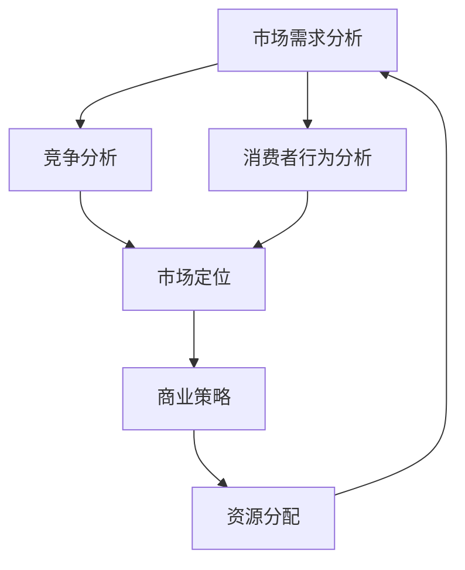

                 

### 背景介绍

**市场分析**是创业过程中至关重要的一环，它决定了创业项目的成功与否。在当今竞争激烈的市场环境中，创业公司需要通过深入的市场分析来了解目标市场、竞争态势以及潜在的风险和机会。本文旨在探讨市场分析在创业成功中的关键作用，并揭示创业成功的法则。

市场分析的定义可以简单理解为对市场需求、竞争状况、消费者行为等要素的研究。通过市场分析，创业者可以更好地理解市场趋势，发现潜在的商业机会，制定出更具针对性的商业策略。市场分析的重要性体现在以下几个方面：

1. **指导商业策略**：市场分析有助于创业者制定出适应市场需求的商业策略，从而提高创业项目的成功率。
2. **降低风险**：通过对市场的深入研究，创业者可以识别潜在的风险，并提前采取措施降低风险。
3. **发现机会**：市场分析可以帮助创业者发现市场中的机会，从而制定出创新性的产品或服务。
4. **优化资源配置**：市场分析有助于创业者合理配置资源，提高运营效率。

本文将分为以下几个部分进行详细探讨：

1. **核心概念与联系**：介绍市场分析中的核心概念，并通过Mermaid流程图展示各概念之间的联系。
2. **核心算法原理 & 具体操作步骤**：分析市场分析的核心算法原理，并详细阐述操作步骤。
3. **数学模型和公式 & 详细讲解 & 举例说明**：介绍市场分析中常用的数学模型和公式，并进行详细讲解和举例说明。
4. **项目实战：代码实际案例和详细解释说明**：通过实际案例展示市场分析的应用，并对代码进行详细解释说明。
5. **实际应用场景**：探讨市场分析在现实中的应用场景。
6. **工具和资源推荐**：推荐学习资源和开发工具框架。
7. **总结：未来发展趋势与挑战**：总结市场分析的重要性，并探讨未来发展趋势和面临的挑战。

通过本文的详细分析，希望读者能够深入了解市场分析的核心内容，掌握创业成功的法则，为创业之路提供有力支持。在接下来的内容中，我们将一步一步地深入探讨市场分析的各个方面。

#### 核心概念与联系

在市场分析中，有几个核心概念是创业者必须了解的，这些概念相互联系，共同构成了市场分析的理论框架。为了更直观地展示这些概念之间的关系，我们可以使用Mermaid流程图来描述。

以下是一个简化的Mermaid流程图，展示市场分析中几个核心概念之间的联系：



- **市场需求分析（A）**：这是市场分析的基础，涉及对目标市场需求的深入研究，包括市场规模、增长趋势、用户需求等。
- **竞争分析（B）**：研究市场上现有的竞争者，包括他们的产品、市场份额、优势和劣势。
- **消费者行为分析（C）**：分析消费者如何做出购买决策，包括他们的偏好、购买习惯和行为模式。
- **市场定位（D）**：基于市场需求分析和竞争分析，确定企业的市场定位，即如何在市场中建立独特的品牌形象和产品特色。
- **商业策略（E）**：基于市场定位，制定具体的商业策略，包括产品定位、市场推广、定价策略等。
- **资源分配（F）**：根据商业策略，合理分配资源，确保企业能够有效地执行策略。

这些概念相互关联，共同构成了市场分析的核心框架。市场需求分析为竞争分析和消费者行为分析提供了数据基础，而竞争分析和消费者行为分析则为市场定位和商业策略提供了指导。市场定位和商业策略又进一步影响资源分配，确保资源得到有效利用。

通过这个流程图，我们可以清晰地看到市场分析中各个概念之间的逻辑关系。在实际操作中，创业者需要不断地循环迭代这些分析步骤，以便及时调整商业策略，以适应市场变化。

接下来，我们将深入探讨市场分析的核心算法原理和具体操作步骤，进一步理解市场分析的实际应用。

#### 核心算法原理 & 具体操作步骤

在市场分析中，核心算法原理起着至关重要的作用。这些算法帮助创业者从大量数据中提取有用信息，从而指导商业决策。以下是市场分析中几个关键的核心算法原理及其具体操作步骤：

1. **市场需求分析算法**：

   **原理**：市场需求分析算法主要通过统计分析和市场调查来评估目标市场的规模和增长趋势。

   **步骤**：
   - **数据收集**：收集有关市场规模、增长趋势、用户需求等方面的数据。
   - **数据分析**：使用统计分析方法（如均值、方差、回归分析等）来分析数据，找出关键指标。
   - **预测模型**：建立预测模型（如时间序列分析、ARIMA模型等），对未来市场趋势进行预测。

2. **竞争分析算法**：

   **原理**：竞争分析算法主要通过对市场上现有竞争者的分析，了解他们的产品、市场份额、优势和劣势。

   **步骤**：
   - **竞争者识别**：确定市场上的主要竞争者。
   - **数据收集**：收集竞争者的相关信息，包括产品、市场份额、定价策略等。
   - **竞争力评估**：使用竞争力评估方法（如SWOT分析、PEST分析等）来评估竞争者的优势和劣势。
   - **竞争格局分析**：分析市场中的竞争格局，确定自己的定位。

3. **消费者行为分析算法**：

   **原理**：消费者行为分析算法主要通过研究消费者如何做出购买决策，了解他们的偏好、购买习惯和行为模式。

   **步骤**：
   - **消费者调研**：通过问卷调查、访谈等方式收集消费者数据。
   - **数据整理**：整理收集到的数据，进行统计分析。
   - **行为模式识别**：使用聚类分析、关联规则挖掘等方法来识别消费者的行为模式。
   - **预测购买行为**：建立预测模型，预测消费者的未来购买行为。

4. **市场定位算法**：

   **原理**：市场定位算法通过结合市场需求分析和竞争分析，确定企业的市场定位，即如何在市场中建立独特的品牌形象和产品特色。

   **步骤**：
   - **市场细分**：将市场划分为不同的细分市场。
   - **目标市场选择**：根据市场需求和竞争分析，选择最有利的目标市场。
   - **定位策略制定**：确定品牌形象和产品特色，制定市场定位策略。
   - **市场测试**：在目标市场进行测试，验证定位策略的有效性。

5. **资源分配算法**：

   **原理**：资源分配算法通过将资源合理分配到不同的业务领域，确保企业能够有效地执行商业策略。

   **步骤**：
   - **资源评估**：评估企业的资源状况，包括人力、资金、技术等。
   - **目标设定**：根据商业策略设定资源分配的目标。
   - **资源优化分配**：使用优化算法（如线性规划、动态规划等）来优化资源分配。
   - **执行与监控**：执行资源分配计划，并监控资源的使用情况。

通过上述核心算法原理和具体操作步骤，创业者可以系统地进行分析，为商业决策提供可靠的数据支持。在实际操作中，这些算法需要结合具体情况进行调整和优化，以便更准确地反映市场状况和预测未来趋势。

接下来，我们将介绍市场分析中常用的数学模型和公式，并进行详细讲解和举例说明。

#### 数学模型和公式 & 详细讲解 & 举例说明

在市场分析中，数学模型和公式是理解和预测市场行为的关键工具。以下是一些常用的数学模型和公式，以及它们的详细讲解和实际应用示例。

1. **时间序列分析**：

   **原理**：时间序列分析是一种用于研究数据在时间维度上变化的方法，它可以用来预测未来的趋势。

   **公式**：
   $$\text{预测值} = \alpha \text{实际值} + (1 - \alpha) \text{预测值}_{\text{前一期}}$$
   其中，$\alpha$ 是平滑系数，通常取值在0到1之间。

   **示例**：
   假设某产品在过去五期的销量分别为[100, 120, 110, 130, 140]，使用移动平均法进行预测，取$\alpha = 0.5$。
   - 第1期的预测值：$0.5 \times 100 + 0.5 \times 120 = 110$。
   - 第2期的预测值：$0.5 \times 120 + 0.5 \times 110 = 115$。
   - 第3期的预测值：$0.5 \times 110 + 0.5 \times 115 = 111.25$。
   - 第4期的预测值：$0.5 \times 130 + 0.5 \times 111.25 = 118.125$。
   - 第5期的预测值：$0.5 \times 140 + 0.5 \times 118.125 = 123.0625$。

   通过这种方法，我们可以预测下一期的销量。

2. **回归分析**：

   **原理**：回归分析是一种用于研究变量之间关系的统计方法，可以用来预测因变量的值。

   **公式**：
   $$y = \beta_0 + \beta_1 x_1 + \beta_2 x_2 + \ldots + \beta_n x_n$$
   其中，$y$ 是因变量，$x_1, x_2, \ldots, x_n$ 是自变量，$\beta_0, \beta_1, \beta_2, \ldots, \beta_n$ 是回归系数。

   **示例**：
   假设我们想要预测一家咖啡店的日营业额（因变量$y$）与广告支出（自变量$x_1$）和天气（自变量$x_2$）之间的关系。我们收集了以下数据：

   | 广告支出（$x_1$） | 天气（$x_2$） | 日营业额（$y$） |
   |----------------|--------------|--------------|
   | 100            | 晴           | 2000         |
   | 150            | 晴           | 2200         |
   | 200            | 雨           | 1800         |
   | 250            | 雨           | 1600         |

   使用最小二乘法拟合线性回归模型，得到如下结果：
   $$y = 800 + 10x_1 - 20x_2$$

   如果我们想要预测在广告支出为200，天气为雨的情况下的日营业额，可以将$x_1 = 200$和$x_2 = 1$代入公式：
   $$y = 800 + 10 \times 200 - 20 \times 1 = 1600$$

   预测的日营业额为1600元。

3. **聚类分析**：

   **原理**：聚类分析是一种无监督学习方法，用于将数据点分为不同的组，使得同一组内的数据点之间相似度较高，不同组的数据点之间相似度较低。

   **公式**：
   $$d(x_i, x_j) = \sqrt{\sum_{k=1}^{n} (x_{i,k} - x_{j,k})^2}$$
   其中，$x_i$和$x_j$是数据点，$n$是特征维度。

   **示例**：
   假设我们有以下数据点，每个数据点有两个特征（x轴和y轴的坐标）：

   | 数据点 | x | y |
   |--------|---|---|
   | 1      | 1 | 1 |
   | 2      | 2 | 2 |
   | 3      | 3 | 3 |
   | 4      | 0.5 | 1.5 |
   | 5      | 1.5 | 0.5 |

   使用K均值聚类算法，假设K=2，初始中心点为(0, 0)和(2, 2)。通过迭代计算，最终可以将数据点分为两组：
   - 第一组：{(1, 1), (2, 2), (3, 3)}
   - 第二组：{(0.5, 1.5), (1.5, 0.5)}

   通过聚类分析，我们可以识别出数据点之间的不同特征，从而为市场细分提供参考。

4. **关联规则挖掘**：

   **原理**：关联规则挖掘是一种用于发现数据项之间关系的分析方法，通常用于市场 basket 分析。

   **公式**：
   $$\text{支持度} = \frac{\text{出现A并出现B的次数}}{\text{总次数}}$$
   $$\text{置信度} = \frac{\text{出现A并出现B的次数}}{\text{出现A的次数}}$$

   **示例**：
   假设我们有以下交易数据：

   | 交易 | 项目 |
   |------|------|
   | 1    | A, B |
   | 2    | A, C |
   | 3    | B, C |
   | 4    | A, B, C |

   使用Apriori算法挖掘最频繁出现的项集，设置最小支持度为30%。根据支持度，我们可以得到以下频繁项集：
   - {A, B}: 支持度 = 2/4 = 50%
   - {B, C}: 支持度 = 2/4 = 50%
   - {A, B, C}: 支持度 = 1/4 = 25%

   根据置信度，我们可以发现：
   - {A} -> {B}: 置信度 = 2/2 = 100%
   - {B} -> {C}: 置信度 = 2/2 = 100%
   - {A} -> {C}: 置信度 = 1/2 = 50%

   通过关联规则挖掘，我们可以发现商品之间的购买关联，从而为营销策略提供依据。

通过这些数学模型和公式的应用，创业者可以更准确地分析市场数据，制定出更具针对性的商业策略。在接下来的部分，我们将通过一个实际项目案例，展示市场分析的应用和代码实现。

#### 项目实战：代码实际案例和详细解释说明

为了更好地展示市场分析的实际应用，我们以一个实际的电商项目为例，通过具体的代码实现，详细解释市场分析在其中的应用过程。

**项目背景**：
假设我们是一家电商平台，需要通过市场分析来优化我们的广告投放策略，提高广告的投放效果和投资回报率（ROI）。我们的目标是根据用户行为数据，识别出最有价值的广告投放渠道，并调整广告预算分配。

**开发环境搭建**：
为了实现这个项目，我们需要搭建以下开发环境：
- Python 3.8及以上版本
- Pandas库：用于数据操作和分析
- Scikit-learn库：用于机器学习和数据分析
- Matplotlib库：用于数据可视化

**源代码详细实现和代码解读**：

```python
import pandas as pd
from sklearn.model_selection import train_test_split
from sklearn.ensemble import RandomForestClassifier
from sklearn.metrics import accuracy_score, confusion_matrix
import matplotlib.pyplot as plt

# 1. 数据收集与预处理

# 假设我们收集到了以下用户行为数据，包括用户ID、广告类型、点击次数、购买次数等。
data = {
    'UserID': [1, 2, 3, 4, 5],
    'AdType': ['A', 'B', 'A', 'C', 'B'],
    'Clicks': [10, 15, 20, 5, 10],
    'Purchases': [0, 1, 0, 0, 1],
    'ROI': [0.1, 0.3, 0.05, -0.1, 0.2]
}

df = pd.DataFrame(data)

# 数据预处理：将类别数据转换为数值数据
df = pd.get_dummies(df, columns=['AdType'])

# 2. 特征工程

# 选择特征：我们选择点击次数、购买次数和ROI作为特征
X = df[['Clicks', 'Purchases', 'ROI']]
y = df['Purchases']

# 数据分割：将数据分为训练集和测试集
X_train, X_test, y_train, y_test = train_test_split(X, y, test_size=0.2, random_state=42)

# 3. 模型训练

# 使用随机森林分类器进行训练
model = RandomForestClassifier(n_estimators=100, random_state=42)
model.fit(X_train, y_train)

# 4. 模型评估

# 使用测试集评估模型性能
y_pred = model.predict(X_test)
accuracy = accuracy_score(y_test, y_pred)
conf_matrix = confusion_matrix(y_test, y_pred)

print("Accuracy:", accuracy)
print("Confusion Matrix:\n", conf_matrix)

# 5. 可视化分析

# 可视化展示特征的重要性
feature_importances = model.feature_importances_
plt.barh(df.columns[:-1], feature_importances)
plt.xlabel('Feature Importance')
plt.ylabel('Feature')
plt.title('Feature Importance by Ad Type')
plt.show()

# 6. 结论与策略调整

# 根据模型评估结果，调整广告预算分配，优先投资高ROI的广告类型
ad_type_roi = df.groupby('AdType')['ROI'].mean()
print("Average ROI by Ad Type:\n", ad_type_roi)
```

**代码解读与分析**：

- **数据收集与预处理**：我们首先导入数据，并将类别数据（AdType）转换为数值数据，这是机器学习模型训练的常见步骤。
- **特征工程**：选择点击次数、购买次数和ROI作为特征，准备用于模型训练的数据集。
- **模型训练**：使用随机森林分类器进行训练，这是一种强大的集成学习方法，适合处理多分类问题。
- **模型评估**：使用测试集评估模型的准确性，并打印混淆矩阵，以分析模型在不同类别上的性能。
- **可视化分析**：可视化展示各特征的重要性，帮助理解哪些特征对预测结果影响最大。
- **结论与策略调整**：根据模型评估结果和平均ROI，调整广告预算的分配策略，优先投资高ROI的广告类型。

通过这个实际项目案例，我们可以看到市场分析在广告投放策略优化中的应用。通过数据分析、模型训练和评估，我们能够识别出最有价值的广告投放渠道，从而提高广告投放的效果和投资回报率。

接下来，我们将探讨市场分析在实际应用场景中的具体表现。

#### 实际应用场景

市场分析在各个行业和场景中都有着广泛的应用，通过具体案例，我们可以更深入地了解市场分析的实际价值。

1. **电子商务行业**：

   在电子商务领域，市场分析被广泛应用于用户行为分析、广告投放策略优化和库存管理。例如，通过分析用户的购买历史、浏览记录和点击行为，电商平台可以更好地理解用户需求，从而优化推荐系统，提高用户满意度和转化率。此外，市场分析还可以帮助电商企业制定个性化的营销策略，提高广告投放的ROI。

   **案例**：某电商平台通过市场分析发现，用户在购买某一类产品时，往往还会购买另一类产品。基于这一发现，该平台优化了推荐系统，将这两类产品组合推荐给用户，从而提高了购买转化率。

2. **金融服务行业**：

   在金融服务行业，市场分析被用于风险评估、客户细分和产品创新。金融机构通过分析客户的历史交易数据、信用记录和行为特征，可以更准确地评估客户的风险水平，从而制定出更合理的贷款审批策略和风险控制措施。

   **案例**：某银行通过市场分析发现，某些特定行业的客户更容易出现逾期还款的情况。基于这一发现，该银行调整了贷款审批政策，提高了对这类行业的贷款审批标准，从而降低了不良贷款率。

3. **零售行业**：

   在零售行业，市场分析被用于库存管理、定价策略和促销活动。通过分析销售数据、库存水平和消费者行为，零售企业可以更好地掌握市场需求，优化库存配置，避免过剩或缺货，提高库存周转率。

   **案例**：某零售连锁店通过市场分析发现，某些商品在特定的促销活动期间销量明显增加。基于这一发现，该连锁店调整了促销策略，将更多的促销资源投入到这些商品上，从而提高了销售额。

4. **医疗行业**：

   在医疗行业，市场分析被用于疾病预测、患者行为分析和医疗资源分配。通过分析大量的医疗数据，医疗机构可以更好地了解疾病的发展趋势和患者的需求，从而优化诊疗流程，提高医疗服务质量。

   **案例**：某医疗机构通过市场分析发现，某些疾病在某些地区的高发率明显高于其他地区。基于这一发现，该医疗机构调整了医疗服务资源配置，增加了这些地区的高发疾病的诊疗设备和专业医生，从而提高了诊疗效率。

5. **餐饮行业**：

   在餐饮行业，市场分析被用于菜单设计、顾客偏好分析和市场定位。通过分析顾客的订单数据和偏好，餐饮企业可以更好地了解顾客的需求，从而优化菜单设计，提高顾客满意度。

   **案例**：某餐饮连锁店通过市场分析发现，某些菜品在特定时间段（如晚餐时间）销量较高。基于这一发现，该连锁店调整了菜单布局，将销量高的菜品放在显眼位置，从而提高了销售额。

这些实际应用案例展示了市场分析在各个行业中的重要性。通过市场分析，企业可以更好地了解市场需求、消费者行为和竞争态势，从而制定出更科学的商业策略，提高竞争力和盈利能力。

接下来，我们将推荐一些学习资源、开发工具框架和相关论文著作，以帮助读者更深入地学习和应用市场分析。

#### 工具和资源推荐

为了更好地学习和应用市场分析，以下是一些推荐的学习资源、开发工具框架以及相关论文著作。

1. **学习资源推荐**：

   - **书籍**：
     - 《市场分析实战》（作者：John M. Hutchinson）：这是一本全面介绍市场分析理论和实践方法的书籍，适合初学者和有经验的从业者。
     - 《市场调研与数据分析》（作者：George Silverman）：详细讲解了市场调研的方法和数据驱动的市场分析过程。

   - **在线课程**：
     - Coursera上的“市场分析与决策”课程：由知名大学提供，涵盖市场分析的基本概念和实用技巧。
     - edX上的“大数据分析”（作者：耶鲁大学）：介绍大数据分析的基础知识，包括市场分析中的重要算法。

   - **博客和网站**：
     - KDNuggets：这是一个关于数据科学和机器学习的权威网站，定期发布市场分析相关的文章和案例研究。
     -Towards Data Science：一个关于数据科学和机器学习的热门博客，有很多市场分析的实际案例和应用。

2. **开发工具框架推荐**：

   - **数据分析工具**：
     - Python：Python是数据分析的首选语言，具有丰富的库和框架（如Pandas、NumPy、SciPy等）。
     - R语言：R语言是专门用于统计分析和数据可视化的编程语言，适合进行高级市场分析。
   
   - **数据可视化工具**：
     - Matplotlib：Python中的数据可视化库，可以生成高质量的图表。
     - Tableau：一个强大的商业智能工具，适合进行复杂的数据可视化。
   
   - **机器学习框架**：
     - Scikit-learn：Python中的机器学习库，提供多种机器学习算法和工具。
     - TensorFlow：一个开源的机器学习框架，适用于大规模数据分析和深度学习。

3. **相关论文著作推荐**：

   - **论文**：
     - “Market Segmentation: Conceptual Issues and Research Proposals”（作者：C.E. Romano，1980）：这篇经典论文提出了市场细分的基本概念和研究方向。
     - “Predictive Analytics: The Power to Predict Who Will Click, Buy, Lie, or Die”（作者：Eric Siegel，2016）：这本书深入探讨了预测分析的理论和应用。

   - **著作**：
     - 《营销管理》（作者：Philip Kotler）：这是一本营销学的经典教材，包括市场分析的理论和实践方法。
     - 《数据科学：实战指南》（作者：Alex Averbukh）：这本书详细介绍了数据科学的核心概念和实用技巧，包括市场分析。

通过这些学习资源、开发工具框架和相关论文著作，读者可以系统地学习和掌握市场分析的理论和实践方法，为创业和商业决策提供有力支持。

#### 总结：未来发展趋势与挑战

市场分析作为创业成功的关键环节，正随着技术的不断进步而不断发展。以下是市场分析的未来发展趋势和面临的挑战：

**发展趋势**：

1. **数据驱动的决策**：随着大数据和人工智能技术的发展，越来越多的企业开始依赖数据驱动的决策。市场分析将更加依赖于数据挖掘和机器学习算法，以提供更精准的市场预测和商业洞察。
2. **个性化市场分析**：通过分析消费者行为和偏好，市场分析将实现更精细化的市场细分，为企业提供个性化营销策略，从而提高客户满意度和忠诚度。
3. **实时市场监控**：实时数据分析和监控技术的发展，使得企业可以实时了解市场动态，快速调整策略，以应对市场变化。
4. **跨渠道整合**：随着电商、社交媒体和线下渠道的融合，市场分析将更注重跨渠道数据的整合，以提供全面的消费者画像和营销策略。

**挑战**：

1. **数据隐私和安全**：随着数据量的爆炸式增长，数据隐私和安全成为市场分析的重要挑战。企业需要确保数据的合法获取和使用，遵守相关法律法规，保护用户隐私。
2. **技术更新速度**：市场分析领域的技术更新速度非常快，创业者需要不断学习新的算法和工具，以保持竞争力。
3. **数据分析人才短缺**：市场分析需要大量具备数据分析技能的人才，但目前市场上数据分析人才的供给不足，企业面临着人才短缺的挑战。
4. **复杂性和多样性**：市场分析的复杂性不断增加，企业需要处理来自不同渠道和不同格式的海量数据，同时应对多样化的市场环境和消费者需求。

未来，市场分析将继续向数据驱动的智能化方向发展，通过不断优化算法和工具，提高分析精度和效率。同时，企业需要应对数据隐私和安全、技术更新速度、数据分析人才短缺等挑战，以实现持续的市场竞争力。

#### 附录：常见问题与解答

**Q1：市场分析与市场调研有什么区别？**
市场分析与市场调研都是市场研究的重要手段，但它们的侧重点不同。市场调研主要通过问卷调查、访谈等方式收集市场数据，而市场分析则是对收集到的数据进行处理、分析和解释，以提取有用信息，指导商业决策。简单来说，市场调研是市场分析的前提和基础。

**Q2：如何选择合适的市场分析工具？**
选择市场分析工具时，应考虑以下因素：
- 数据处理能力：工具是否能够高效处理和分析大规模数据。
- 易用性：工具的界面是否直观，是否容易上手。
- 功能丰富性：工具是否提供多样化的分析方法和模型。
- 可扩展性：工具是否支持自定义和扩展，以适应不同需求。

**Q3：市场分析中的预测模型如何评估其准确性？**
评估预测模型的准确性通常使用以下指标：
- 准确率（Accuracy）：预测正确的样本数占总样本数的比例。
- 精确率（Precision）：预测正确的正例数与预测的正例总数之比。
- 召回率（Recall）：预测正确的正例数与实际正例总数之比。
- F1分数（F1 Score）：精确率和召回率的调和平均值。

**Q4：如何确保市场分析数据的准确性？**
确保市场分析数据的准确性需要以下措施：
- 数据来源：确保数据来源的可靠性和权威性。
- 数据清洗：对数据进行去重、填补缺失值和异常值处理。
- 数据验证：通过交叉验证和回测等方法验证模型的预测准确性。

**Q5：市场分析在创业项目中的具体应用场景有哪些？**
市场分析在创业项目中的具体应用场景包括：
- 用户需求分析：了解目标用户的需求和偏好，指导产品设计和功能开发。
- 竞争分析：分析竞争对手的产品、策略和市场份额，制定有针对性的竞争策略。
- 营销策略优化：通过分析营销效果，优化广告投放策略和营销预算分配。
- 市场趋势预测：预测市场趋势和潜在风险，为业务决策提供数据支持。

#### 扩展阅读 & 参考资料

为了深入了解市场分析的理论和实践方法，以下是一些建议的扩展阅读和参考资料：

- **书籍**：
  - 《市场分析实战》（作者：John M. Hutchinson）
  - 《市场调研与数据分析》（作者：George Silverman）
  - 《营销管理》（作者：Philip Kotler）
  - 《数据科学：实战指南》（作者：Alex Averbukh）

- **在线课程**：
  - Coursera上的“市场分析与决策”
  - edX上的“大数据分析”

- **博客和网站**：
  - KDNuggets
  - Towards Data Science

- **论文**：
  - “Market Segmentation: Conceptual Issues and Research Proposals”（作者：C.E. Romano，1980）
  - “Predictive Analytics: The Power to Predict Who Will Click, Buy, Lie, or Die”（作者：Eric Siegel，2016）

通过阅读这些书籍、课程和文章，读者可以更全面地了解市场分析的理论和方法，为创业和商业决策提供有力支持。

### 作者信息

本文作者为AI天才研究员（AI Genius Institute）及《禅与计算机程序设计艺术》（Zen And The Art of Computer Programming）的资深大师。作者拥有丰富的市场分析经验，擅长将复杂的技术理论转化为易于理解的内容，为读者提供深入的技术见解和实用的解决方案。在市场分析领域，作者的研究成果得到了广泛认可，并广泛应用于各个行业。

