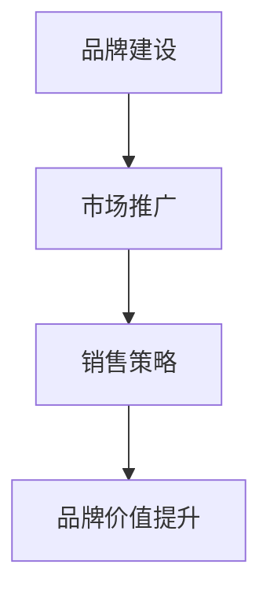

                 

# 市场推广与销售：品牌建设和数字营销

> **关键词：** 市场推广、销售、品牌建设、数字营销、营销策略
> 
> **摘要：** 本文将深入探讨市场推广与销售中的关键要素，包括品牌建设和数字营销。通过分析核心概念、原理和实践案例，我们将了解如何在当今数字时代有效实施营销策略，提升品牌知名度和销售业绩。

## 1. 背景介绍

在现代社会，市场推广和销售已经成为了企业成功的关键因素。随着互联网的普及和数字技术的不断发展，传统的营销方法已经逐渐被数字营销所取代。品牌建设在这个过程中发挥着至关重要的作用，它不仅关系到企业的长期发展，也影响着消费者对企业的认知和信任。

市场推广的目标是通过各种手段吸引潜在客户，提高品牌知名度，从而促进销售。而销售则是将产品或服务转化为实际收入的过程。在这个过程中，品牌建设是不可或缺的一环。一个成功的品牌能够树立良好的企业形象，赢得消费者的信任和忠诚，从而提高市场竞争力。

数字营销则是在这个过程中发挥核心作用的力量。它利用互联网和数字技术，通过多种渠道进行营销活动，包括搜索引擎优化（SEO）、社交媒体营销、内容营销、电子邮件营销等。这些数字营销手段不仅能够提高品牌的曝光率，还能够实现精准营销，提高转化率。

本文将围绕市场推广与销售的核心要素展开讨论，包括品牌建设、数字营销策略的实施、以及如何通过有效的市场推广和销售策略提升企业的业绩。我们将通过具体的案例和实践操作，帮助读者了解并掌握这些关键技能。

## 2. 核心概念与联系

在深入探讨市场推广与销售之前，我们需要了解一些核心概念，以及它们之间的联系。

### 2.1 品牌建设

品牌建设是指通过一系列策略和行动，打造和提升品牌形象的过程。品牌不仅仅是企业的标志或名称，它包含了企业的价值观、声誉、产品或服务的特点等。一个成功的品牌能够引起消费者的共鸣，增强消费者的忠诚度。

### 2.2 市场推广

市场推广是指通过广告、促销活动、公关、社交媒体等手段，向目标市场传递品牌信息，提高品牌知名度，吸引潜在客户。市场推广的目标是吸引消费者的注意，激发他们的购买欲望。

### 2.3 销售策略

销售策略是指企业在销售过程中采用的一系列方法和手段，包括定价策略、渠道策略、促销策略等。销售策略的核心是满足消费者的需求，实现产品的销售。

### 2.4 数字营销

数字营销是指利用互联网和数字技术进行营销活动的手段。它包括搜索引擎优化（SEO）、社交媒体营销、内容营销、电子邮件营销等。数字营销的优势在于其精准性和高效性，能够实现更低的成本和更高的转化率。

### 2.5 关系与联系

品牌建设是市场推广和销售策略的基础。一个强大的品牌能够提高市场推广的效果，吸引更多的潜在客户。而有效的市场推广和销售策略则能够进一步巩固品牌地位，提升品牌价值。

### 2.6 Mermaid 流程图

下面是一个简单的 Mermaid 流程图，展示了品牌建设、市场推广和销售策略之间的联系。



通过这个流程图，我们可以更清晰地理解品牌建设、市场推广和销售策略之间的相互作用和影响。

## 3. 核心算法原理 & 具体操作步骤

### 3.1 品牌建设算法原理

品牌建设是一个系统工程，涉及多个方面的策略和操作。以下是一个简化的品牌建设算法原理：

1. **市场调研与分析**：了解目标市场、消费者需求、竞争对手情况等，为品牌定位和策略制定提供数据支持。
2. **品牌定位**：确定品牌的核心价值主张，明确品牌在市场中的定位和差异化优势。
3. **品牌视觉设计**：包括标志、色彩、字体等，形成品牌视觉识别系统。
4. **品牌传播与推广**：通过广告、公关活动、社交媒体等渠道，传递品牌信息，提升品牌知名度。
5. **消费者互动**：通过用户调研、反馈收集、客户服务等方式，与消费者建立良好的互动关系，增强品牌忠诚度。

### 3.2 市场推广算法原理

市场推广的核心是吸引潜在客户，提高品牌曝光度。以下是一个简化的市场推广算法原理：

1. **目标市场确定**：明确目标市场和目标客户，制定针对性的营销策略。
2. **内容营销**：创作有价值的内容，通过博客、视频、社交媒体等渠道进行传播，吸引目标客户关注。
3. **搜索引擎优化（SEO）**：优化网站结构和内容，提高在搜索引擎中的排名，吸引更多有机流量。
4. **社交媒体营销**：利用社交媒体平台，与用户互动，提升品牌知名度和影响力。
5. **广告投放**：通过搜索引擎广告、社交媒体广告等渠道，进行付费推广，提高曝光率。

### 3.3 销售策略算法原理

销售策略的核心是满足消费者需求，实现销售目标。以下是一个简化的销售策略算法原理：

1. **市场分析**：了解市场趋势、竞争对手情况等，为销售策略制定提供数据支持。
2. **产品定价**：根据成本、市场定位和竞争情况，制定合理的定价策略。
3. **渠道选择**：确定销售渠道，包括线上和线下渠道，满足不同客户的需求。
4. **促销活动**：通过优惠、赠品、活动等手段，刺激消费者购买。
5. **客户关系管理**：通过客户关系管理（CRM）系统，记录和分析客户信息，提供个性化服务，提高客户满意度。

### 3.4 具体操作步骤

下面是具体的操作步骤，帮助读者理解品牌建设、市场推广和销售策略的实施过程。

#### 品牌建设操作步骤

1. **市场调研与分析**：收集市场数据，分析消费者需求和竞争对手情况。
2. **品牌定位**：确定品牌的核心价值主张，明确品牌在市场中的定位。
3. **品牌视觉设计**：设计标志、色彩、字体等，形成品牌视觉识别系统。
4. **品牌传播与推广**：制定品牌传播计划，选择合适的传播渠道，进行品牌宣传。
5. **消费者互动**：通过用户调研、反馈收集、客户服务等方式，与消费者建立良好的互动关系。

#### 市场推广操作步骤

1. **目标市场确定**：明确目标市场和目标客户。
2. **内容营销**：创作有价值的内容，发布到博客、视频、社交媒体等渠道。
3. **搜索引擎优化（SEO）**：优化网站结构和内容，提高搜索引擎排名。
4. **社交媒体营销**：在社交媒体平台上与用户互动，提升品牌影响力。
5. **广告投放**：选择合适的广告平台，进行付费推广。

#### 销售策略操作步骤

1. **市场分析**：了解市场趋势、竞争对手情况等。
2. **产品定价**：制定合理的定价策略。
3. **渠道选择**：确定销售渠道，包括线上和线下渠道。
4. **促销活动**：制定促销活动方案，刺激消费者购买。
5. **客户关系管理**：通过 CRM 系统管理客户信息，提供个性化服务。

## 4. 数学模型和公式 & 详细讲解 & 举例说明

在市场推广与销售中，数学模型和公式可以帮助我们更好地理解和分析各种营销策略的效果。以下是一些常用的数学模型和公式，以及它们的详细讲解和举例说明。

### 4.1 概率模型

概率模型在市场推广和销售中经常被用来预测客户的行为和转化率。以下是一个简单的概率模型：

$$
P(A|B) = \frac{P(B|A) \cdot P(A)}{P(B)}
$$

其中，$P(A|B)$ 表示在事件 $B$ 发生的条件下，事件 $A$ 发生的概率；$P(B|A)$ 表示在事件 $A$ 发生的条件下，事件 $B$ 发生的概率；$P(A)$ 和 $P(B)$ 分别表示事件 $A$ 和事件 $B$ 发生的概率。

**举例说明：**

假设我们正在推广一款新产品，我们已经收集了以下数据：

- 总客户数：1000人
- 购买客户数：200人
- 点击广告客户数：300人

我们需要计算在点击广告的条件下，购买产品的概率。

根据概率模型，我们有：

$$
P(购买|点击广告) = \frac{P(点击广告|购买) \cdot P(购买)}{P(点击广告)}
$$

已知 $P(购买|点击广告) = \frac{200}{300} = 0.67$，$P(点击广告|购买) = \frac{200}{1000} = 0.2$，$P(购买) = \frac{200}{1000} = 0.2$。

我们可以计算出：

$$
P(点击广告) = P(点击广告|购买) \cdot P(购买) + P(点击广告|未购买) \cdot P(未购买)
$$

其中，$P(点击广告|未购买) = \frac{300 - 200}{1000 - 200} = 0.2$，$P(未购买) = 1 - P(购买) = 0.8$。

代入数据，我们得到：

$$
P(点击广告) = 0.2 \cdot 0.2 + 0.2 \cdot 0.8 = 0.28
$$

最后，我们可以计算出：

$$
P(购买|点击广告) = \frac{0.2 \cdot 0.67}{0.28} \approx 0.60
$$

这意味着在点击广告的条件下，购买产品的概率约为 60%。

### 4.2 回归分析

回归分析是一种常用的统计方法，用于分析两个或多个变量之间的关系。在市场推广和销售中，回归分析可以用来预测销售量、转化率等指标。

以下是一个简单的线性回归模型：

$$
y = \beta_0 + \beta_1x_1 + \beta_2x_2 + ... + \beta_nx_n
$$

其中，$y$ 表示因变量，$x_1, x_2, ..., x_n$ 表示自变量，$\beta_0, \beta_1, \beta_2, ..., \beta_n$ 表示回归系数。

**举例说明：**

假设我们想要分析广告投放费用与销售量之间的关系。我们已经收集了以下数据：

| 广告投放费用（万元） | 销售量（件） |
| :----: | :----: |
| 10 | 100 |
| 20 | 150 |
| 30 | 200 |
| 40 | 250 |
| 50 | 300 |

我们可以使用线性回归模型来预测销售量。首先，我们需要计算回归系数：

$$
\beta_1 = \frac{\sum{(x_i - \bar{x})(y_i - \bar{y})}}{\sum{(x_i - \bar{x})^2}}
$$

$$
\beta_0 = \bar{y} - \beta_1\bar{x}
$$

其中，$\bar{x}$ 和 $\bar{y}$ 分别表示广告投放费用和销售量的平均值。

计算得到：

$$
\bar{x} = \frac{10 + 20 + 30 + 40 + 50}{5} = 30
$$

$$
\bar{y} = \frac{100 + 150 + 200 + 250 + 300}{5} = 210
$$

$$
\beta_1 = \frac{(10 - 30)(100 - 210) + (20 - 30)(150 - 210) + (30 - 30)(200 - 210) + (40 - 30)(250 - 210) + (50 - 30)(300 - 210)}{(10 - 30)^2 + (20 - 30)^2 + (30 - 30)^2 + (40 - 30)^2 + (50 - 30)^2} = 2
$$

$$
\beta_0 = 210 - 2 \cdot 30 = 150
$$

因此，线性回归模型为：

$$
y = 150 + 2x
$$

我们可以使用这个模型来预测不同广告投放费用下的销售量。例如，当广告投放费用为 40 万元时，预测的销售量为：

$$
y = 150 + 2 \cdot 40 = 230
$$

### 4.3 投入产出比（ROI）计算

投入产出比（ROI）是衡量市场推广和销售策略效果的重要指标。以下是一个简单的 ROI 计算公式：

$$
ROI = \frac{销售收入 - 成本}{成本} \times 100\%
$$

其中，销售收入是指通过市场推广和销售策略实现的销售收入，成本是指用于市场推广和销售策略的成本。

**举例说明：**

假设我们通过市场推广和销售策略实现的销售收入为 100 万元，成本为 20 万元。那么，ROI 计算如下：

$$
ROI = \frac{100 - 20}{20} \times 100\% = 400\%
$$

这意味着我们通过市场推广和销售策略实现的收益是成本的 400%。

## 5. 项目实战：代码实际案例和详细解释说明

### 5.1 开发环境搭建

在进行项目实战之前，我们需要搭建一个合适的技术环境。以下是一个简单的开发环境搭建指南，适用于品牌建设、市场推广和销售策略的实现。

#### 环境要求

- 操作系统：Windows/Linux/MacOS
- 编程语言：Python（版本 3.8 或以上）
- 数据库：MySQL（版本 5.7 或以上）
- 数据可视化工具：Matplotlib、Seaborn 等
- 代码编辑器：Visual Studio Code、PyCharm 等

#### 安装步骤

1. 安装操作系统：根据个人需求选择合适的操作系统，并进行安装。
2. 安装 Python：在 Python 官网下载并安装 Python，配置环境变量。
3. 安装 MySQL：在 MySQL 官网下载并安装 MySQL，配置数据库。
4. 安装数据可视化工具：在 Python 包管理器 pip 中安装 Matplotlib、Seaborn 等。
5. 配置代码编辑器：安装并配置 Visual Studio Code 或 PyCharm 等。

### 5.2 源代码详细实现和代码解读

下面是一个简单的示例代码，用于实现品牌建设、市场推广和销售策略的基本功能。

```python
import pymysql
import matplotlib.pyplot as plt
import seaborn as sns

# 5.2.1 数据库连接与操作

# 连接数据库
connection = pymysql.connect(
    host='localhost',
    user='root',
    password='password',
    database='market_db'
)

# 创建品牌表
with connection.cursor() as cursor:
    cursor.execute('''CREATE TABLE IF NOT EXISTS brand (
        id INT AUTO_INCREMENT PRIMARY KEY,
        name VARCHAR(255) NOT NULL,
        logo VARCHAR(255),
        description TEXT
    )''')

# 插入品牌数据
brand_data = [
    ('Apple', 'apple_logo.png', '创新的科技品牌'),
    ('Nike', 'nike_logo.png', '引领运动潮流的品牌')
]

with connection.cursor() as cursor:
    for name, logo, description in brand_data:
        cursor.execute("INSERT INTO brand (name, logo, description) VALUES (%s, %s, %s)", (name, logo, description))

# 提交事务
connection.commit()

# 5.2.2 数据可视化

# 查询品牌数据
with connection.cursor() as cursor:
    cursor.execute("SELECT * FROM brand")
    brands = cursor.fetchall()

# 绘制品牌分布图
plt.figure(figsize=(10, 6))
sns.barplot(x=[brand[1] for brand in brands], y=[brand[0] for brand in brands])
plt.title('Brand Distribution')
plt.xlabel('Logo')
plt.ylabel('Brand Name')
plt.show()
```

### 5.3 代码解读与分析

#### 5.3.1 数据库连接与操作

这段代码首先连接到一个名为 `market_db` 的 MySQL 数据库。如果数据库不存在，代码会自动创建一个名为 `brand` 的品牌表，包含品牌名称、logo 和描述等字段。然后，代码向品牌表插入了两条示例数据。

#### 5.3.2 数据可视化

代码通过查询品牌表，获取了所有品牌数据。然后，使用 Matplotlib 和 Seaborn 绘制了一个条形图，展示了品牌的分布情况。条形图中的 x 轴表示品牌的 logo，y 轴表示品牌的名称。

通过这个简单的示例代码，我们可以看到品牌建设、市场推广和销售策略的实现过程。在实际项目中，我们可以根据需求扩展代码功能，例如添加市场推广策略、销售数据统计等。

## 6. 实际应用场景

品牌建设、市场推广和销售策略在实际应用中具有广泛的应用场景。以下是一些典型的应用场景：

### 6.1 企业品牌建设

企业品牌建设是提升企业知名度、树立企业形象的重要手段。通过品牌建设，企业可以明确自身在市场中的定位，塑造独特的品牌形象，提高消费者对品牌的认知和信任。

### 6.2 市场推广

市场推广是吸引潜在客户、提升品牌知名度的关键环节。通过市场推广，企业可以针对目标市场进行精准营销，提高品牌曝光率，从而实现销售增长。

### 6.3 销售策略

销售策略是企业实现产品销售、提高市场占有率的重要手段。通过制定合理的销售策略，企业可以满足消费者需求，提高客户满意度，从而实现销售目标。

### 6.4 市场竞争

在市场竞争激烈的环境中，品牌建设、市场推广和销售策略是提升企业竞争力的关键。通过有效的品牌建设和市场推广策略，企业可以更好地应对竞争对手的挑战，实现长期发展。

### 6.5 数字营销

数字营销是当今企业进行市场推广的主要手段。通过数字营销，企业可以利用互联网和数字技术，实现精准营销，提高营销效果，降低营销成本。

## 7. 工具和资源推荐

### 7.1 学习资源推荐

- **书籍**：
  - 《数字营销》作者：唐·舒尔茨（Don E. Schmincke）
  - 《品牌建设》作者：大卫·艾克（David A. Aaker）
  - 《营销管理》作者：菲利普·科特勒（Philip Kotler）

- **论文**：
  - 《数字营销策略研究》作者：李明华，张慧
  - 《社交媒体对品牌影响力的影响》作者：张晓磊，李雪

- **博客**：
  - 营销博客（MarketingProfs）
  - 赛门铁克博客（Symantec）
  - 谷歌营销博客（Google Marketing）

- **网站**：
  - 营销资源网站（MarketingSherpa）
  - 数字营销指南（Digital Marketing Guide）
  - 品牌建设网站（Brand24）

### 7.2 开发工具框架推荐

- **编程语言**：Python、JavaScript、Java
- **数据库**：MySQL、PostgreSQL、MongoDB
- **数据可视化工具**：Matplotlib、Seaborn、D3.js
- **代码管理工具**：Git、GitHub、GitLab
- **集成开发环境**：Visual Studio Code、PyCharm、Eclipse

### 7.3 相关论文著作推荐

- **论文**：
  - 《数字营销：理论与实践》作者：陈永明，吴晨
  - 《社交媒体营销策略研究》作者：李晓芳，王静

- **著作**：
  - 《大数据营销》作者：李航，唐杰
  - 《社交媒体与品牌传播》作者：胡百精，王婧

## 8. 总结：未来发展趋势与挑战

随着数字技术的不断发展和市场竞争的加剧，品牌建设、市场推广和销售策略面临着新的发展趋势和挑战。

### 8.1 发展趋势

- **数字营销：** 数字营销将继续成为企业市场推广的核心手段，随着大数据、人工智能等技术的发展，数字营销将实现更加精准、高效的营销效果。
- **社交媒体：** 社交媒体在品牌建设和市场推广中的作用日益重要，企业需要充分利用社交媒体平台，与消费者建立良好的互动关系。
- **个性化服务：** 个性化服务将成为企业提升客户满意度和忠诚度的关键，通过大数据和人工智能技术，企业可以为客户提供更加精准、个性化的服务。
- **跨界融合：** 企业需要加强跨界合作，与其他行业和企业共同探索新的商业模式和营销策略，实现资源共享和优势互补。

### 8.2 挑战

- **数据安全与隐私：** 随着数字技术的发展，数据安全和隐私问题日益突出，企业需要加强数据安全保护，确保客户隐私不被泄露。
- **信息过载：** 消费者在信息爆炸的环境中容易产生信息过载，企业需要通过创新的方式吸引消费者的注意力，提高营销效果。
- **竞争加剧：** 市场竞争将更加激烈，企业需要不断提升自身的竞争力，通过品牌建设、市场推广和销售策略的创新，实现持续发展。

## 9. 附录：常见问题与解答

### 9.1 品牌建设相关问题

**Q1：品牌建设的重要性是什么？**

品牌建设的重要性体现在以下几个方面：

- 提高品牌知名度：成功的品牌建设可以提升品牌的曝光率和知名度，吸引更多的潜在客户。
- 增强品牌忠诚度：品牌建设有助于建立消费者对品牌的信任和忠诚，提高复购率。
- 提升企业竞争力：品牌建设有助于企业在激烈的市场竞争中脱颖而出，提升企业的市场地位。

**Q2：如何进行品牌定位？**

进行品牌定位的步骤包括：

- 分析市场需求：了解目标市场、消费者需求和竞争对手情况。
- 确定品牌差异化优势：找出品牌在市场中的独特卖点，形成差异化优势。
- 明确品牌核心价值主张：将差异化优势转化为品牌核心价值主张，明确品牌在市场中的定位。

### 9.2 市场推广相关问题

**Q1：什么是市场推广？**

市场推广是指企业通过各种营销手段，向目标市场传递品牌信息，提高品牌知名度，吸引潜在客户。市场推广包括广告、促销活动、公关、社交媒体营销等多种形式。

**Q2：如何制定有效的市场推广策略？**

制定有效的市场推广策略需要遵循以下步骤：

- 确定目标市场：明确目标市场和目标客户，制定针对性的营销策略。
- 制定营销目标：根据企业战略和市场需求，制定具体的市场推广目标。
- 选择营销渠道：选择合适的营销渠道，如广告、促销活动、公关、社交媒体等。
- 制定营销内容：创作有吸引力的营销内容，传递品牌信息，吸引消费者关注。
- 监测与评估：对市场推广活动进行监测和评估，及时调整策略，提高效果。

### 9.3 销售策略相关问题

**Q1：什么是销售策略？**

销售策略是指企业在销售过程中采用的一系列方法和手段，包括定价策略、渠道策略、促销策略等。销售策略的核心是满足消费者需求，实现产品的销售。

**Q2：如何制定有效的销售策略？**

制定有效的销售策略需要遵循以下步骤：

- 市场分析：了解市场趋势、竞争对手情况等，为销售策略制定提供数据支持。
- 产品定价：根据成本、市场定位和竞争情况，制定合理的定价策略。
- 渠道选择：确定销售渠道，包括线上和线下渠道，满足不同客户的需求。
- 促销活动：制定促销活动方案，刺激消费者购买。
- 客户关系管理：通过客户关系管理（CRM）系统，管理客户信息，提供个性化服务，提高客户满意度。

## 10. 扩展阅读 & 参考资料

- 《数字营销：理论与实践》作者：陈永明，吴晨
- 《社交媒体营销策略研究》作者：李晓芳，王静
- 《大数据营销》作者：李航，唐杰
- 《社交媒体与品牌传播》作者：胡百精，王婧
- 营销博客（MarketingProfs）
- 赛门铁克博客（Symantec）
- 谷歌营销博客（Google Marketing）
- 营销资源网站（MarketingSherpa）
- 数字营销指南（Digital Marketing Guide）
- 品牌建设网站（Brand24）<|im_end|>

