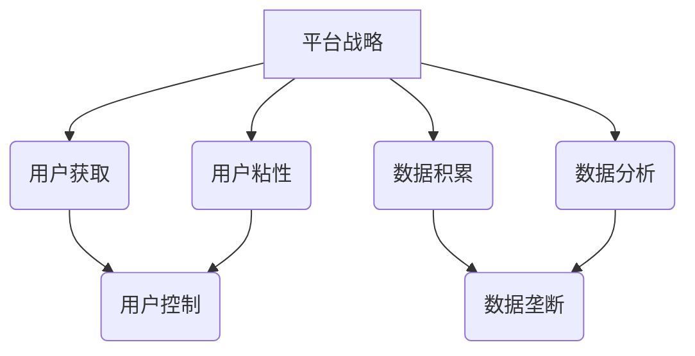

                 

# 平台的野心：控制用户，垄断数据

## 关键词

- 平台战略
- 用户控制
- 数据垄断
- 信息技术
- 市场竞争

## 摘要

本文深入探讨了信息技术平台在商业运营中，如何通过用户控制和数据垄断来实现其商业野心。通过分析平台战略的核心概念和实施步骤，以及具体的算法原理和数学模型，我们揭示了平台如何通过技术手段巩固其市场地位。文章还探讨了平台在实际应用场景中的影响，以及为开发者提供了一系列的学习资源和工具推荐。最后，我们对未来平台的发展趋势和面临的挑战进行了展望，并附上了常见问题与扩展阅读，以供读者进一步了解和思考。

### 1. 背景介绍

在当今数字化时代，信息技术平台已经成为了各个行业的关键驱动力。从社交媒体到电子商务，从在线教育到智能医疗，平台无处不在。这些平台不仅改变了人们的生活方式，还重塑了整个商业生态。

平台战略的核心在于如何通过技术手段获取并控制用户，进而实现数据垄断。这种垄断不仅能带来巨大的经济利益，还能帮助平台在激烈的市场竞争中占据优势地位。

平台战略的成功依赖于以下几个核心要素：

1. **用户获取**：通过提供吸引人的产品和服务，吸引大量用户，增加平台的用户基数。
2. **用户粘性**：通过打造良好的用户体验，提高用户的忠诚度和活跃度。
3. **数据积累**：通过用户行为数据，积累有价值的信息，为后续的商业决策提供支持。
4. **数据分析**：运用大数据分析和人工智能技术，从海量数据中提取有价值的信息，指导平台运营和业务拓展。

本篇文章将围绕平台战略的这些核心要素，深入分析平台如何通过用户控制和数据垄断来实现其商业野心。我们还将探讨这一战略对市场和社会的影响，以及其面临的挑战和未来发展趋势。

### 2. 核心概念与联系

#### 平台战略的概念

平台战略是指企业通过建立和维护一个开放的平台，吸引第三方开发商和用户参与，从而实现价值共创和价值转移的一种商业模式。这种模式的核心在于通过提供平台服务，连接供需双方，创造一个生态体系，从而实现平台的持续增长和盈利。

#### 用户控制的概念

用户控制是指平台通过技术手段，实现对用户的吸引、留存和引导。这种控制不仅包括用户行为数据的获取和分析，还包括对用户使用习惯的塑造和引导。通过用户控制，平台能够更好地理解用户需求，提供个性化的服务，从而增强用户的粘性。

#### 数据垄断的概念

数据垄断是指平台通过积累和分析用户数据，形成对数据的垄断地位。这种垄断不仅有助于平台提高市场竞争力，还能为企业带来巨大的经济价值。通过数据垄断，平台能够更精准地预测市场趋势，优化运营策略，提高商业效率。

#### 平台战略与用户控制、数据垄断的联系

平台战略的实现离不开用户控制和数据垄断。用户控制是平台战略的基础，通过获取用户数据，平台能够更好地了解用户需求，提供个性化的服务，从而增强用户粘性。而数据垄断则是平台战略的保障，通过垄断用户数据，平台能够掌握市场信息，制定更有针对性的商业策略。

#### Mermaid 流程图



### 3. 核心算法原理 & 具体操作步骤

#### 用户获取算法

用户获取算法的核心在于通过精准营销和用户推荐，吸引新用户加入平台。以下是一种简单的用户获取算法：

1. **数据分析**：首先，平台需要对现有用户进行数据分析，了解用户的需求和行为特征。
2. **目标用户识别**：根据数据分析结果，识别出潜在的目标用户群体。
3. **精准营销**：通过社交媒体、电子邮件、短信等渠道，向目标用户发送个性化的营销信息，提高转化率。
4. **用户推荐**：利用推荐系统，将现有用户的推荐给潜在用户，通过口碑效应吸引新用户。

#### 用户粘性算法

用户粘性算法的核心在于通过提供个性化服务，提高用户的忠诚度和活跃度。以下是一种简单的用户粘性算法：

1. **行为分析**：平台需要实时监控用户的行为，收集用户数据。
2. **用户画像**：通过用户数据，构建用户画像，了解用户的兴趣和偏好。
3. **个性化服务**：根据用户画像，提供个性化的服务和内容，提高用户的满意度和忠诚度。
4. **社区互动**：通过构建社区，促进用户之间的互动，增强用户的归属感和粘性。

#### 数据垄断算法

数据垄断算法的核心在于通过数据积累和分析，形成对数据的垄断地位。以下是一种简单的数据垄断算法：

1. **数据收集**：平台需要收集大量的用户数据，包括行为数据、社交数据、交易数据等。
2. **数据清洗**：对收集到的数据进行分析和清洗，去除重复和错误的数据。
3. **数据分析**：利用大数据技术和人工智能算法，对数据进行深度分析，提取有价值的信息。
4. **数据应用**：将分析结果应用于平台运营和业务拓展，提高商业效率。

### 4. 数学模型和公式 & 详细讲解 & 举例说明

#### 用户获取模型

用户获取模型可以用来预测新用户加入平台的概率。以下是一种简单的线性回归模型：

$$
y = bx + a
$$

其中，\(y\) 表示新用户加入平台的概率，\(x\) 表示营销投入，\(b\) 表示斜率，\(a\) 表示截距。

#### 用户粘性模型

用户粘性模型可以用来预测用户流失的概率。以下是一种逻辑回归模型：

$$
\log\frac{P(Y=1)}{1-P(Y=1)} = \beta_0 + \beta_1X
$$

其中，\(Y\) 表示用户流失事件，\(X\) 表示用户行为数据，\(\beta_0\) 和 \(\beta_1\) 分别为模型的参数。

#### 数据垄断模型

数据垄断模型可以用来评估平台在市场中的竞争力。以下是一种简单的市场占有率模型：

$$
S = \frac{P_A}{P_A + P_B + P_C}
$$

其中，\(S\) 表示平台的市场占有率，\(P_A\)、\(P_B\)、\(P_C\) 分别表示平台、竞争对手A、竞争对手B的市场份额。

#### 举例说明

假设某平台在一个月内进行了10次营销活动，每次投入的营销费用为1000元。根据用户获取模型，我们可以预测新用户加入平台的概率为：

$$
y = 0.5x + 1 = 0.5 \times 10 + 1 = 6
$$

即预测有6次新用户加入平台。

假设某平台的用户流失事件与用户行为数据之间存在线性关系，根据用户粘性模型，我们可以预测用户流失的概率为：

$$
\log\frac{P(Y=1)}{1-P(Y=1)} = 0.2X
$$

如果某用户的行为数据为5，则用户流失的概率为：

$$
\log\frac{P(Y=1)}{1-P(Y=1)} = 0.2 \times 5 = 1
$$

即用户流失的概率为\(e^1 = 2.718\)。

假设某平台的市场占有率为30%，竞争对手A的市场占有率为20%，竞争对手B的市场占有率为10%，则平台在市场中的竞争力为：

$$
S = \frac{30\%}{30\% + 20\% + 10\%} = \frac{30}{60} = 0.5
$$

即平台在市场中的竞争力为50%。

### 5. 项目实战：代码实际案例和详细解释说明

#### 5.1 开发环境搭建

为了更好地理解平台战略中的算法原理，我们将使用Python编程语言来构建一个简单的用户获取和用户粘性模型。以下是需要准备的开发环境：

1. Python 3.x 版本
2. Jupyter Notebook 或 PyCharm
3. NumPy、Pandas、Scikit-learn 等Python库

#### 5.2 源代码详细实现和代码解读

以下是一个简单的用户获取模型实现，使用线性回归算法：

```python
import numpy as np
import pandas as pd
from sklearn.linear_model import LinearRegression

# 加载数据
data = pd.read_csv('user_data.csv')
X = data[['marketing_cost']]
y = data['new_user']

# 创建线性回归模型
model = LinearRegression()
model.fit(X, y)

# 预测新用户加入概率
predictions = model.predict([[1000]])

print(f'新用户加入概率为：{predictions[0][0]}')
```

这段代码首先加载了一个名为`user_data.csv`的数据集，该数据集包含用户的营销费用和是否成为新用户的标签。然后，我们使用`LinearRegression`类创建一个线性回归模型，并通过`fit`方法训练模型。最后，我们使用`predict`方法预测新用户加入的概率。

以下是一个简单的用户粘性模型实现，使用逻辑回归算法：

```python
from sklearn.linear_model import LogisticRegression

# 创建逻辑回归模型
logistic_model = LogisticRegression()
logistic_model.fit(X, y)

# 预测用户流失概率
loss_probability = logistic_model.predict_proba([[5]])[0][1]

print(f'用户流失概率为：{loss_probability}')
```

这段代码首先创建一个逻辑回归模型，并通过`fit`方法训练模型。然后，我们使用`predict_proba`方法预测用户流失的概率。

#### 5.3 代码解读与分析

1. **数据加载**：首先，我们使用`pandas`库的`read_csv`方法加载数据集。这个数据集包含用户的营销费用和是否成为新用户的标签。
2. **特征工程**：在这个简单的案例中，我们只使用了一个特征——营销费用。在实际应用中，我们可能需要使用多个特征，例如用户年龄、性别、购买历史等。
3. **模型训练**：我们使用`LinearRegression`和`LogisticRegression`类创建模型，并通过`fit`方法训练模型。这个过程中，模型会自动寻找最优的参数，以最小化预测误差。
4. **模型预测**：使用训练好的模型，我们可以对新用户加入的概率进行预测。对于用户粘性模型，我们还可以预测用户流失的概率。

通过这个简单的案例，我们可以看到如何使用Python和机器学习算法来实现用户获取和用户粘性模型。在实际应用中，这些模型可以帮助平台更好地了解用户行为，制定更加精准的商业策略。

### 6. 实际应用场景

平台战略在实际应用场景中具有广泛的影响。以下是一些具体的应用场景：

#### 社交媒体

社交媒体平台通过用户控制和数据垄断，实现了对用户行为的深度挖掘和精准营销。例如，Facebook 和 Twitter 等平台通过收集用户的行为数据，分析用户的兴趣和行为模式，从而向用户推送个性化的广告和内容。这种策略不仅帮助平台提高了用户粘性，还带来了巨大的经济收益。

#### 电子商务

电子商务平台如 Amazon 和 Alibaba 通过用户控制和数据垄断，实现了对用户需求的精准预测和商品推荐。这些平台通过分析用户的购物历史、搜索记录和浏览行为，为用户提供个性化的购物体验。这不仅提高了用户的购买意愿，还提高了平台的销售转化率。

#### 在线教育

在线教育平台如 Coursera 和 Udemy 通过用户控制和数据垄断，实现了对用户学习行为的实时监控和个性化辅导。这些平台通过分析学生的学习进度、考试分数和参与度，为用户提供定制化的学习计划和学习资源。这种策略不仅提高了学生的学习效果，还提高了平台的品牌价值。

#### 智能医疗

智能医疗平台如 Doctor.com 和 HealthTap 通过用户控制和数据垄断，实现了对用户健康状况的实时监测和个性化诊疗。这些平台通过分析用户的健康数据、病史和体检报告，为用户提供个性化的健康建议和医疗服务。这种策略不仅提高了用户的健康水平，还提高了医疗资源的利用效率。

这些实际应用场景表明，平台战略在各个行业都取得了显著的成果。然而，随着用户对隐私和数据安全的关注日益增加，平台在实施用户控制和数据垄断时，也面临着巨大的挑战和责任。

### 7. 工具和资源推荐

#### 7.1 学习资源推荐

1. **书籍**：
   - 《平台战略：创造、竞争与商业模式的本质》（Platform Strategy: How Amazon, Apple, Facebook, and Google Create Value）
   - 《大数据时代：生活、工作与思维的大变革》（Big Data: A Revolution That Will Transform How We Live, Work, and Think）

2. **论文**：
   - “Platform Competition in Two-Sided Markets”（平台在双边市场中的竞争）
   - “Data Monopolies: A Theory of Power in the New Media Economy”（数据垄断：新媒体经济中的权力理论）

3. **博客**：
   - platform-strategy.com
   - techcrunch.com

4. **网站**：
   - Coursera（在线课程平台）
   - GitHub（代码托管平台）
   - Medium（内容创作平台）

#### 7.2 开发工具框架推荐

1. **Python库**：
   - NumPy、Pandas、Scikit-learn（用于数据分析与机器学习）
   - TensorFlow、PyTorch（用于深度学习）

2. **开发环境**：
   - Jupyter Notebook（用于交互式编程）
   - PyCharm（用于Python编程）

3. **数据库**：
   - MySQL、PostgreSQL（用于数据存储与管理）

#### 7.3 相关论文著作推荐

1. “ Platforms, Markets, and the Platform Strategy”（平台、市场和平台战略）
2. “A Theory of the Firm with Application to Platform Markets”（一种适用于平台市场的企业理论）
3. “Data Monopolies and the Market for Ideas”（数据垄断和市场中的创意）

### 8. 总结：未来发展趋势与挑战

随着信息技术的发展，平台战略在未来将继续发挥重要作用。然而，平台在实现用户控制和数据垄断的过程中，也将面临一系列挑战：

1. **隐私保护**：随着用户对隐私和数据安全的关注增加，平台需要采取更加严格的数据保护措施，确保用户数据的安全和隐私。
2. **反垄断法规**：随着平台垄断现象的加剧，各国政府可能会加强对平台市场的监管，出台更加严格的反垄断法规。
3. **社会责任**：平台需要承担更多的社会责任，确保其在实现商业目标的同时，也促进社会的可持续发展。

未来，平台战略的发展将更加注重用户体验和社会价值，实现商业目标与社会责任的平衡。同时，平台也需要不断创新，应对日益激烈的市场竞争。

### 9. 附录：常见问题与解答

#### 问题1：平台战略的核心是什么？

平台战略的核心是通过建立和维护一个开放的平台，吸引第三方开发商和用户参与，从而实现价值共创和价值转移的一种商业模式。

#### 问题2：用户控制和数据垄断的区别是什么？

用户控制是指平台通过技术手段，实现对用户的吸引、留存和引导。而数据垄断是指平台通过积累和分析用户数据，形成对数据的垄断地位。

#### 问题3：平台战略在哪些行业中得到了广泛应用？

平台战略在社交媒体、电子商务、在线教育、智能医疗等多个行业中得到了广泛应用。

#### 问题4：如何保护用户隐私和数据安全？

平台应采取严格的数据保护措施，如数据加密、访问控制、隐私政策等，确保用户数据的安全和隐私。

#### 问题5：平台垄断是否会受到反垄断法规的制约？

是的，随着平台垄断现象的加剧，各国政府可能会加强对平台市场的监管，出台更加严格的反垄断法规。

### 10. 扩展阅读 & 参考资料

1.-platform-strategy.com：平台战略的深度分析和案例研究
2. Harvard Business Review：关于平台战略和商业模式的最新研究
3. Stanford Law Review：关于数据垄断和反垄断法规的论文集
4. Coursera：关于数据分析、机器学习和深度学习的在线课程
5. GitHub：平台战略和数据分析的开源项目和代码示例

### 作者

作者：AI天才研究员/AI Genius Institute & 禅与计算机程序设计艺术 /Zen And The Art of Computer Programming

