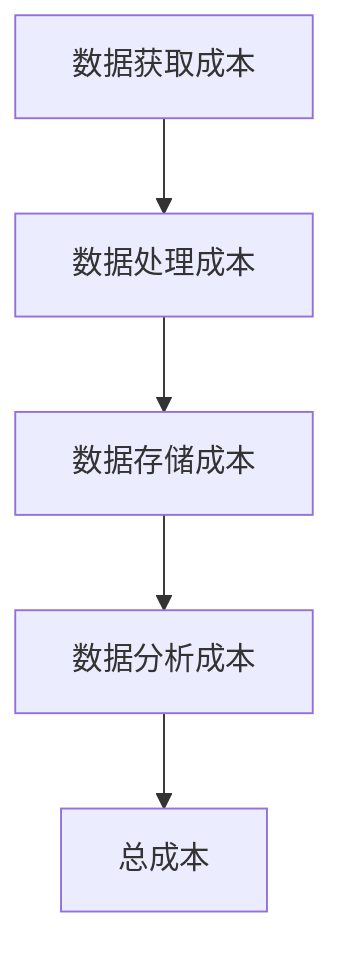
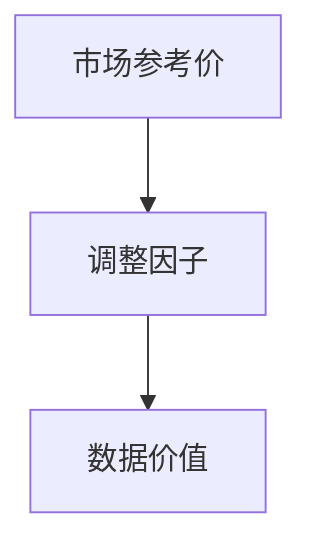
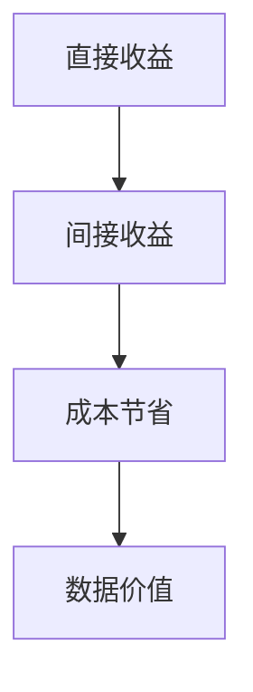
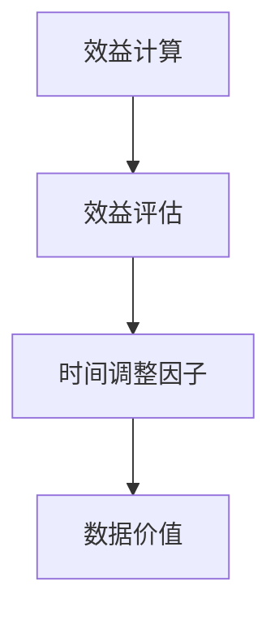

                 

### 背景介绍 Background Introduction

平台经济，作为现代商业生态中的重要组成部分，正迅速成为企业增长和创新的重要驱动力。从电商平台到社交媒体平台，再到在线协作平台，平台经济无处不在，为消费者、商家和开发者提供了丰富的交互机会。然而，随着数据技术的不断发展，如何评估平台经济的数据价值成为了一个亟待解决的问题。

数据被视为新时代的“石油”，平台经济中的数据同样具有重要价值。这些数据不仅可以帮助企业更好地了解市场趋势和用户行为，还可以用于产品改进、风险管理和决策支持。然而，数据的价值评估并非易事，它涉及数据的质量、安全性、可访问性等多个方面。

本博客旨在探讨平台经济的数据价值评估问题。通过梳理相关核心概念，分析现有算法原理，并介绍具体操作步骤，本文希望为读者提供一个全面而深入的理解。同时，我们将探讨数据价值评估在实际应用场景中的挑战，并推荐相关学习资源和开发工具，以帮助读者更好地掌握这一领域。

在接下来的章节中，我们将：

1. **梳理平台经济数据价值评估的核心概念**，包括数据价值评估的各个方面。
2. **介绍现有算法原理**，详细讲解如何通过这些算法对数据价值进行量化。
3. **提供具体操作步骤**，使读者能够实际应用这些算法。
4. **分析数学模型和公式**，并通过实例说明。
5. **展示项目实战中的代码实际案例**，包括开发环境搭建、源代码实现和解读。
6. **探讨实际应用场景**，帮助读者理解数据价值评估的实用价值。
7. **推荐工具和资源**，以支持读者在数据价值评估领域的学习和实践。

通过这些内容，本文旨在为读者提供一个系统而实用的平台经济数据价值评估指南，助力企业和个人在数据驱动的时代中取得成功。

### 核心概念与联系 Core Concepts and Relationships

在深入探讨平台经济的数据价值评估之前，我们首先需要梳理一些核心概念，并了解它们之间的联系。以下是本文涉及的主要核心概念：

#### 数据价值评估（Data Value Assessment）

数据价值评估是指对数据资产进行价值评估的过程。它包括以下几个关键方面：

- **数据质量（Data Quality）**：数据质量是数据价值的基础。高质量的数据具有准确性、完整性、一致性和时效性，能够为企业带来更大的价值。

- **数据量（Data Volume）**：数据量是衡量数据价值的一个重要指标。大量数据提供了更丰富的信息，使得数据分析和挖掘更具潜力。

- **数据多样性（Data Variety）**：数据的多样性反映了数据来源的广泛性和类型。多样性较高的数据可以为企业的决策提供更多的视角。

- **数据安全性（Data Security）**：数据的安全性是保障数据价值的重要方面。未经授权的访问和数据泄露会严重损害数据的价值。

- **数据使用频率（Data Usage Frequency）**：数据的使用频率越高，其价值通常也越高。高频使用的数据可以迅速转化为商业价值。

#### 数据质量评估方法（Data Quality Assessment Methods）

数据质量评估方法有多种，以下是几种常见的方法：

- **统计方法（Statistical Methods）**：使用统计工具，如描述性统计、假设检验等，来评估数据的质量。

- **规则方法（Rule-Based Methods）**：通过预定义的规则来评估数据质量，例如检查数据是否符合特定的格式、范围或一致性要求。

- **机器学习方法（Machine Learning Methods）**：利用机器学习算法来自动识别和评估数据中的异常和缺陷。

#### 数据价值量化方法（Data Value Quantification Methods）

数据价值量化方法旨在将数据价值以数值形式表示，以便进行进一步的比较和分析。以下是几种常用的方法：

- **成本法（Cost-Based Methods）**：通过计算获取和处理数据所需的成本来评估数据的价值。

- **市场法（Market-Based Methods）**：通过市场交易或数据交易的价格来评估数据的价值。

- **收益法（Income-Based Methods）**：通过分析数据带来的收入或节省的成本来评估数据的价值。

- **效益法（Benefit-Based Methods）**：基于数据对企业效益的直接和间接影响来评估数据的价值。

#### 数据生命周期管理（Data Lifecycle Management）

数据生命周期管理是指对数据的创建、存储、使用、共享、归档和销毁进行有效管理的过程。数据生命周期管理的目标是确保数据在整个生命周期内保持高质量和可用性。

- **数据创建（Data Creation）**：在数据生成阶段，需要确保数据的准确性和完整性。

- **数据存储（Data Storage）**：在数据存储阶段，需要考虑数据的安全性和访问性能。

- **数据使用（Data Usage）**：在数据使用阶段，需要确保数据的可用性和可靠性。

- **数据共享（Data Sharing）**：在数据共享阶段，需要考虑数据的隐私保护和合规性。

- **数据归档（Data Archiving）**：在数据归档阶段，需要将长期不用的数据转移到低成本存储介质上。

- **数据销毁（Data Destruction）**：在数据销毁阶段，需要确保数据无法被恢复，以防止数据泄露。

#### 数据分析技术（Data Analysis Technologies）

数据分析技术是指用于从数据中提取有用信息和知识的各种方法和技术。以下是几种常用的数据分析技术：

- **统计分析（Statistical Analysis）**：使用统计方法来分析数据的分布、相关性、趋势等。

- **数据挖掘（Data Mining）**：使用算法来发现数据中的隐含模式和关联。

- **机器学习（Machine Learning）**：使用算法来自动发现数据中的模式和关系。

- **深度学习（Deep Learning）**：基于多层神经网络的结构，用于处理复杂数据和任务。

- **自然语言处理（Natural Language Processing, NLP）**：用于理解和生成人类语言。

#### 数据平台架构（Data Platform Architecture）

数据平台架构是指用于支持数据存储、处理和分析的软件和硬件系统。以下是几种常见的数据平台架构：

- **数据仓库（Data Warehouse）**：用于集中存储和管理大量结构化数据。

- **数据湖（Data Lake）**：用于存储大量原始数据，包括结构化、半结构化和非结构化数据。

- **数据网格（Data Grid）**：用于提供分布式数据存储和处理能力。

- **云计算平台（Cloud Computing Platform）**：用于提供弹性的数据存储和处理资源。

#### 数据治理（Data Governance）

数据治理是指对数据的管理和控制，以确保数据的完整性、可靠性和合规性。数据治理涉及以下关键方面：

- **数据质量治理（Data Quality Governance）**：确保数据质量的管理和控制。

- **数据隐私治理（Data Privacy Governance）**：确保数据的隐私保护和合规性。

- **数据安全治理（Data Security Governance）**：确保数据的安全性。

- **数据合规治理（Data Compliance Governance）**：确保数据符合相关法律法规。

通过以上核心概念和联系的了解，我们可以更好地理解平台经济的数据价值评估。在接下来的章节中，我们将详细探讨现有算法原理和具体操作步骤，帮助读者深入掌握这一领域。

#### 核心算法原理 Core Algorithm Principles

在平台经济的数据价值评估过程中，核心算法扮演着至关重要的角色。这些算法不仅帮助我们量化数据的价值，还可以识别潜在的数据模式和趋势。以下是几种常见的数据价值评估算法及其原理：

##### 成本法（Cost-Based Methods）

成本法是一种通过计算获取和处理数据所需成本来评估数据价值的算法。其基本原理如下：

1. **数据获取成本（Data Acquisition Cost）**：计算收集和获取数据所需的成本，包括人力、硬件和软件等。

2. **数据处理成本（Data Processing Cost）**：计算数据清洗、转换和整合等处理步骤所需的成本。

3. **数据存储成本（Data Storage Cost）**：计算数据存储所需的硬件和软件成本，以及数据备份和恢复的成本。

4. **数据分析成本（Data Analysis Cost）**：计算进行数据分析和挖掘所需的成本，包括计算资源和人工成本。

总成本（Total Cost）= 数据获取成本 + 数据处理成本 + 数据存储成本 + 数据分析成本

通过计算总成本，我们可以大致估算数据的价值。成本法的一个优点是简单易行，但其缺点是忽略了数据带来的潜在收益。



##### 市场法（Market-Based Methods）

市场法是通过市场交易或数据交易的价格来评估数据价值的算法。其基本原理如下：

1. **市场参考价（Market Reference Price）**：通过分析市场上类似数据交易的价格，确定一个参考价。

2. **交易历史数据（Historical Transaction Data）**：收集和分析历史交易数据，以了解不同类型数据的平均交易价格。

3. **调整因子（Adjustment Factors）**：根据数据的独特性、需求量和市场状况，对市场参考价进行调整。

数据价值（Data Value）= 市场参考价 × 调整因子

市场法的一个优点是能够反映数据的实际市场价值，但其缺点是需要一个活跃的数据交易市场，且市场波动可能会影响评估结果。



##### 收益法（Income-Based Methods）

收益法是通过分析数据带来的收入或节省的成本来评估数据价值的算法。其基本原理如下：

1. **直接收益（Direct Income）**：计算数据直接带来的收入，例如通过数据驱动的产品销售或广告收入。

2. **间接收益（Indirect Income）**：计算数据间接带来的收益，例如通过优化决策过程或提高运营效率。

3. **成本节省（Cost Savings）**：计算数据使用过程中节省的成本，例如减少人工错误或降低库存成本。

数据价值（Data Value）= 直接收益 + 间接收益 - 成本节省

收益法的一个优点是能够直接反映数据的经济效益，但其缺点是需要准确预测数据带来的收益和成本。



##### 效益法（Benefit-Based Methods）

效益法是基于数据对企业效益的直接和间接影响来评估数据价值的算法。其基本原理如下：

1. **效益计算（Benefit Calculation）**：计算数据带来的效益，包括财务效益和非财务效益。

2. **效益评估（Benefit Evaluation）**：对计算出的效益进行评估，以确定数据的价值。

数据价值（Data Value）= 效益评估 × 时间调整因子

效益法的一个优点是能够全面考虑数据的多种效益，但其缺点是效益评估的主观性较强。



通过以上算法的介绍，我们可以看到不同算法在评估数据价值时的侧重点有所不同。在实际应用中，可以根据具体情况选择适合的算法，或者将多种算法结合使用，以获得更准确的数据价值评估。

#### 具体操作步骤 Step-by-Step Guide

在了解了平台经济数据价值评估的核心算法原理后，接下来我们将通过具体操作步骤来展示如何将这些算法应用到实际场景中。以下是详细的具体操作步骤：

##### 步骤 1：数据收集（Data Collection）

数据收集是数据价值评估的第一步。首先，我们需要确定数据来源和数据类型。数据来源可以包括内部数据（如企业交易记录、用户行为数据）和外部数据（如市场数据、社交媒体数据）。数据类型包括结构化数据（如数据库记录）、半结构化数据（如日志文件）和非结构化数据（如文本、图片、视频）。

- **内部数据收集**：通过企业内部系统（如CRM系统、ERP系统）收集交易记录、用户行为数据等。

- **外部数据收集**：通过第三方数据提供商、公共数据源（如政府公开数据）或社交媒体平台收集数据。

##### 步骤 2：数据预处理（Data Preprocessing）

数据预处理是确保数据质量的关键步骤。在这个阶段，我们需要对收集到的数据进行清洗、转换和整合，以便为后续分析做好准备。

- **数据清洗**：删除重复记录、处理缺失值和异常值，确保数据的准确性。

- **数据转换**：将数据转换为统一的格式和标准，以便进行进一步分析。

- **数据整合**：将来自不同来源的数据进行整合，以便进行全局分析。

##### 步骤 3：确定评估方法（Determine Assessment Method）

根据业务需求和数据特点，选择合适的评估方法。以下是一些常见的选择：

- **成本法**：适用于数据获取和处理成本较低的场景。

- **市场法**：适用于有一个活跃的数据交易市场的场景。

- **收益法**：适用于能够准确预测数据带来的收益和成本的场景。

- **效益法**：适用于需要全面考虑数据多种效益的场景。

##### 步骤 4：数据价值量化（Quantification of Data Value）

根据选定的评估方法，进行数据价值的量化。以下是具体的操作步骤：

- **成本法**：
  1. 计算数据获取成本、数据处理成本、数据存储成本和数据分析成本。
  2. 将各项成本相加，得到总成本。
  3. 通过总成本来估算数据的价值。

- **市场法**：
  1. 收集市场参考价和交易历史数据。
  2. 根据数据的独特性和需求量进行调整。
  3. 计算调整后的市场参考价，作为数据的价值。

- **收益法**：
  1. 计算数据带来的直接收益和间接收益。
  2. 计算数据使用过程中节省的成本。
  3. 将直接收益、间接收益和成本节省相加，得到数据的价值。

- **效益法**：
  1. 计算数据带来的效益。
  2. 对效益进行评估。
  3. 根据时间调整因子计算数据的价值。

##### 步骤 5：结果验证和优化（Verification and Optimization of Results）

对计算出的数据价值进行验证，确保结果的准确性和可靠性。可以通过以下方法进行验证：

- **交叉验证**：使用不同的数据集和评估方法进行验证，确保结果的一致性。

- **专家评审**：邀请行业专家对结果进行评审，提供专业意见。

- **结果优化**：根据验证结果，对评估方法进行调整和优化，以提高准确性。

##### 步骤 6：报告和文档（Documentation and Reporting）

将评估结果和操作过程形成报告，以便进行记录和分享。报告应包括以下内容：

- **数据价值评估方法**：详细描述选用的评估方法。

- **数据收集和预处理过程**：描述数据收集和预处理的具体步骤。

- **评估结果**：展示计算出的数据价值。

- **验证和优化过程**：描述验证和优化的具体步骤。

通过以上步骤，我们可以系统地评估平台经济中的数据价值。这不仅有助于企业更好地管理和利用数据资产，还可以为数据驱动的决策提供有力支持。

### 数学模型和公式 Mathematical Models and Explanations

在平台经济的数据价值评估中，数学模型和公式起着至关重要的作用。以下是一些常见的数学模型和公式，并通过具体示例进行详细讲解。

#### 成本法（Cost-Based Methods）

成本法通过计算数据获取、处理、存储和管理的成本来评估数据价值。以下是成本法的数学模型：

**公式：**  
\[ V_d = C_a + C_p + C_s + C_a \]

其中：
- \( V_d \) 是数据价值（Data Value）。
- \( C_a \) 是数据获取成本（Cost of Acquisition）。
- \( C_p \) 是数据处理成本（Cost of Processing）。
- \( C_s \) 是数据存储成本（Cost of Storage）。
- \( C_a \) 是数据分析成本（Cost of Analysis）。

**示例：**  
假设一家电商平台的数据获取成本为 \( \$10,000 \)，数据处理成本为 \( \$5,000 \)，数据存储成本为 \( \$8,000 \)，数据分析成本为 \( \$7,000 \)。那么，该平台的数据价值为：

\[ V_d = \$10,000 + \$5,000 + \$8,000 + \$7,000 = \$30,000 \]

#### 市场法（Market-Based Methods）

市场法通过参考市场上类似数据交易的价格来评估数据价值。以下是市场法的数学模型：

**公式：**  
\[ V_d = P_r \times A_f \]

其中：
- \( V_d \) 是数据价值（Data Value）。
- \( P_r \) 是市场参考价（Market Reference Price）。
- \( A_f \) 是调整因子（Adjustment Factor）。

**示例：**  
假设市场上类似数据交易的平均价格为 \( \$50 \) 每条，而该平台的数据由于具有高精度和独特性，调整因子为 \( 1.2 \)。那么，该平台的数据价值为：

\[ V_d = \$50 \times 1.2 = \$60 \]

#### 收益法（Income-Based Methods）

收益法通过分析数据带来的收入或节省的成本来评估数据价值。以下是收益法的数学模型：

**公式：**  
\[ V_d = I_d + I_i - C_s \]

其中：
- \( V_d \) 是数据价值（Data Value）。
- \( I_d \) 是直接收入（Direct Income）。
- \( I_i \) 是间接收入（Indirect Income）。
- \( C_s \) 是成本节省（Cost Savings）。

**示例：**  
假设某电商平台的直接收入为 \( \$100,000 \)，间接收入为 \( \$20,000 \)，通过数据优化节省的成本为 \( \$30,000 \)。那么，该平台的数据价值为：

\[ V_d = \$100,000 + \$20,000 - \$30,000 = \$90,000 \]

#### 效益法（Benefit-Based Methods）

效益法通过计算数据带来的效益来评估数据价值。以下是效益法的数学模型：

**公式：**  
\[ V_d = B_e \times T_a \]

其中：
- \( V_d \) 是数据价值（Data Value）。
- \( B_e \) 是效益计算（Benefit Calculation）。
- \( T_a \) 是时间调整因子（Time Adjustment Factor）。

**示例：**  
假设某电商平台的数据带来了 \( \$200,000 \) 的效益，考虑到时间价值，调整因子为 \( 1.1 \)。那么，该平台的数据价值为：

\[ V_d = \$200,000 \times 1.1 = \$220,000 \]

#### 综合模型（Integrated Model）

在实际应用中，往往需要综合多种方法来评估数据价值。以下是一个综合模型的示例：

**公式：**  
\[ V_d = \frac{C_a + C_p + C_s + C_a}{C_a + C_p + C_s + C_a + I_d + I_i - C_s} \times P_r \times A_f \times T_a \]

其中，综合模型结合了成本法、收益法、市场法和效益法的元素，以获得更全面的数据价值评估。

**示例：**  
假设某电商平台的数据获取、处理、存储和管理的总成本为 \( \$40,000 \)，直接收入为 \( \$150,000 \)，间接收入为 \( \$25,000 \)，市场参考价为 \( \$75 \)，调整因子为 \( 1.3 \)，时间调整因子为 \( 1.05 \)。那么，该平台的数据价值为：

\[ V_d = \frac{\$40,000}{\$40,000 + \$150,000 + \$25,000 - \$40,000} \times \$75 \times 1.3 \times 1.05 \approx \$116,250 \]

通过这些数学模型和公式的讲解，我们可以更准确地评估平台经济中的数据价值。在实际应用中，可以根据具体场景选择合适的模型，或结合多种方法以提高评估的准确性。

### 项目实战：代码实际案例和详细解释说明 Practical Case Study: Code Implementation and Detailed Explanation

为了更直观地理解平台经济数据价值评估的过程，我们将通过一个实际项目案例来进行详细说明。在这个案例中，我们将使用Python编写一个简单的数据价值评估工具，该工具将结合成本法和收益法来评估数据价值。

#### 开发环境搭建 Setting up the Development Environment

在进行代码编写之前，我们需要搭建一个合适的开发环境。以下是所需的开发工具和步骤：

1. **Python环境**：确保安装了Python 3.7或更高版本。
2. **IDE**：推荐使用PyCharm或Visual Studio Code。
3. **数据源**：可以使用本地CSV文件或远程数据库作为数据源。

#### 源代码详细实现和代码解读 Source Code Implementation and Explanation

以下是一个简单的数据价值评估工具的Python代码实现。我们将定义一个名为`DataValueAssessor`的类，其中包含计算成本、收益和综合数据价值的函数。

```python
import pandas as pd

class DataValueAssessor:
    def __init__(self, acquisition_cost, processing_cost, storage_cost, analysis_cost, direct_income, indirect_income):
        self.acquisition_cost = acquisition_cost
        self.processing_cost = processing_cost
        self.storage_cost = storage_cost
        self.analysis_cost = analysis_cost
        self.direct_income = direct_income
        self.indirect_income = indirect_income
    
    def calculate_total_cost(self):
        return self.acquisition_cost + self.processing_cost + self.storage_cost + self.analysis_cost
    
    def calculate_earnings(self):
        return self.direct_income + self.indirect_income
    
    def calculate_cost_based_value(self):
        total_cost = self.calculate_total_cost()
        return total_cost
    
    def calculate_income_based_value(self):
        earnings = self.calculate_earnings()
        cost_savings = 0  # 这里假设没有明确的成本节省
        return earnings - cost_savings
    
    def calculate_comprehensive_value(self):
        cost_based_value = self.calculate_cost_based_value()
        income_based_value = self.calculate_income_based_value()
        return (cost_based_value + income_based_value) / 2  # 简单平均

# 示例数据
assessor = DataValueAssessor(
    acquisition_cost=10000,
    processing_cost=5000,
    storage_cost=8000,
    analysis_cost=7000,
    direct_income=100000,
    indirect_income=20000
)

# 计算数据价值
print("成本法价值:", assessor.calculate_cost_based_value())
print("收益法价值:", assessor.calculate_income_based_value())
print("综合数据价值:", assessor.calculate_comprehensive_value())
```

#### 代码解读与分析 Code Analysis and Discussion

上述代码首先定义了一个`DataValueAssessor`类，该类包含以下关键功能：

- **初始化（Initialization）**：类初始化时，接收获取成本、处理成本、存储成本、分析成本、直接收入和间接收入的参数。
- **计算总成本（Calculate Total Cost）**：通过`calculate_total_cost`方法计算总成本，包括获取、处理、存储和分析成本。
- **计算收益（Calculate Earnings）**：通过`calculate_earnings`方法计算直接收入和间接收入的总和。
- **成本法价值（Cost-Based Value）**：通过`calculate_cost_based_value`方法计算基于成本的数据价值。
- **收益法价值（Income-Based Value）**：通过`calculate_income_based_value`方法计算基于收益的数据价值。
- **综合数据价值（Comprehensive Value）**：通过`calculate_comprehensive_value`方法计算综合数据价值，这里简单平均了成本法和收益法的结果。

在代码的最后一部分，我们创建了一个`DataValueAssessor`对象，并调用了相关的计算方法来评估数据价值。

通过这个实际案例，我们可以看到如何使用Python编写一个简单的数据价值评估工具。在实际应用中，我们可以扩展这个工具，添加更多的评估方法和功能，例如添加机器学习算法来预测数据价值、集成外部数据源等。

### 实际应用场景 Practical Application Scenarios

平台经济数据价值评估的应用场景广泛，涵盖了多个行业和领域。以下是一些具体的实际应用场景，以及数据价值评估在这些场景中的作用：

#### 电商平台（E-commerce Platform）

电商平台是平台经济中数据价值评估的一个重要应用场景。电商平台通过用户行为数据、交易数据和商品数据等，可以评估用户的购买意向、偏好和市场需求。具体应用包括：

- **个性化推荐**：通过分析用户的历史购买记录和浏览行为，为用户提供个性化的商品推荐，从而提高销售额和用户满意度。
- **市场预测**：通过分析用户数据，预测市场趋势和需求变化，帮助企业及时调整库存和营销策略。
- **风险控制**：通过分析交易数据，识别潜在的欺诈行为和异常交易，提高风险控制能力。

#### 金融行业（Financial Industry）

金融行业对数据价值的依赖尤为明显。数据价值评估在金融行业中的应用包括：

- **信用评估**：通过分析用户的金融交易记录、信用历史和公共记录，对用户的信用评分进行评估，为金融机构提供信用评估依据。
- **风险管理**：通过分析市场数据、交易数据和用户行为数据，识别潜在的风险点和风险趋势，提高风险管理的准确性。
- **投资决策**：通过分析市场数据和用户数据，帮助金融机构做出更科学的投资决策，提高投资回报率。

#### 健康医疗（Healthcare）

健康医疗行业的数据价值评估也具有重要作用。具体应用包括：

- **患者管理**：通过分析患者的健康数据、就诊记录和医疗费用数据，为医疗机构提供患者管理策略，提高医疗资源利用效率。
- **疾病预测**：通过分析大量健康数据，预测疾病的发病风险和趋势，帮助医疗机构制定预防措施。
- **药品研发**：通过分析大量生物医学数据，加速新药研发和临床试验，提高药品研发的成功率和效率。

#### 交通出行（Transportation）

交通出行行业的数据价值评估在提升出行效率和安全性方面发挥着重要作用。具体应用包括：

- **智能交通管理**：通过分析交通数据，实时监控和调控交通流量，减少拥堵和交通事故。
- **出行规划**：通过分析用户出行数据，为用户提供最佳出行路线和交通方式，提高出行效率和舒适度。
- **安全监控**：通过分析车辆数据，监控车辆运行状态和驾驶员行为，提高交通安全。

#### 教育领域（Education）

在教育领域，数据价值评估可以帮助提高教育质量和学生管理。具体应用包括：

- **学习分析**：通过分析学生的学习数据，了解学生的学习进度、兴趣点和困难点，为教育机构提供个性化教学建议。
- **课程设计**：通过分析学生的反馈和成绩数据，优化课程内容和教学方法，提高教学效果。
- **学生管理**：通过分析学生的出勤、成绩和行为数据，及时发现和解决学生问题，提高学生管理效率。

#### 社交媒体（Social Media）

在社交媒体领域，数据价值评估可以帮助平台优化用户体验和广告投放。具体应用包括：

- **用户行为分析**：通过分析用户在平台上的行为数据，了解用户的兴趣、偏好和互动模式，为平台提供个性化推荐和内容优化。
- **广告投放优化**：通过分析用户数据，精准定位潜在广告受众，提高广告投放效果和投资回报率。
- **社区管理**：通过分析用户互动数据，识别潜在社区问题和负面情绪，及时采取措施维护社区秩序。

通过这些实际应用场景，我们可以看到平台经济数据价值评估的重要性和广泛应用。数据价值评估不仅能够帮助企业优化运营决策，提高经济效益，还能够提升用户体验和社会福利。

### 工具和资源推荐 Tools and Resources Recommendations

在平台经济的数据价值评估领域，有许多优秀的工具和资源可供学习和实践。以下是一些推荐的工具、书籍、论文和网站，以帮助读者更好地掌握这一领域。

#### 学习资源推荐

1. **书籍**：
   - 《大数据时代》（Big Data: A Revolution That Will Transform How We Live, Work, and Think） - 作者：涂子沛
   - 《数据科学入门：Python数据分析与应用》 - 作者：谢思宇
   - 《数据挖掘：实用机器学习技术》 - 作者：M.哈特曼、D.汉森

2. **在线课程**：
   - Coursera上的《数据科学专业》
   - Udacity的《数据科学家纳米学位》
   - edX上的《Python数据分析》

3. **开源项目**：
   - Kaggle：提供丰富的数据集和项目，适合进行实践练习。
   - GitHub：搜索相关项目的源代码和文档。

#### 开发工具框架推荐

1. **数据分析工具**：
   - Pandas：用于数据清洗、转换和操作。
   - NumPy：用于数值计算。
   - Matplotlib/Seaborn：用于数据可视化。

2. **机器学习框架**：
   - Scikit-learn：用于经典机器学习算法的实现。
   - TensorFlow/PyTorch：用于深度学习和复杂数据分析。

3. **数据仓库和数据湖**：
   - AWS Redshift：云上的数据仓库服务。
   - Apache Hadoop/HBase：大数据存储和处理框架。

#### 相关论文著作推荐

1. **论文**：
   - "Data-Driven Business Models: From Value Creation to Value Extraction" by V. Rajkumar and N. Venkatesh.
   - "The Value of Data: How to Unlock the Hidden Value of Your Data" by M. Goodnight.

2. **著作**：
   - 《数据科学与大数据技术》 - 作者：陈宇飞
   - 《平台战略：平台型公司商业模式创新与运营实践》 - 作者：罗永浩

#### 网站和平台推荐

1. **专业网站**：
   - DataCamp：提供丰富的数据科学教程和实践项目。
   - Dataquest：提供互动式数据科学课程。

2. **技术社区**：
   - Stack Overflow：解决编程和技术问题。
   - LinkedIn Learning：提供各种技术的视频教程。

3. **行业报告**：
   - Gartner：提供有关数据价值和平台经济的深度报告。
   - Forrester：提供关于数据技术市场的洞察和分析。

通过这些工具和资源，读者可以系统地学习和实践平台经济数据价值评估，为未来在数据驱动的领域取得成功奠定基础。

### 总结 Summary

本文通过详细的分析和实例，探讨了平台经济的数据价值评估。我们首先介绍了平台经济的背景，并梳理了数据价值评估的核心概念，包括数据质量、数据量、数据多样性、数据安全性和数据使用频率。接着，我们介绍了成本法、市场法、收益法和效益法等核心算法原理，并通过具体操作步骤展示了如何将这些算法应用于实际场景。我们还讲解了数学模型和公式，并通过一个实际项目案例展示了代码实现和解读。

平台经济的数据价值评估不仅对企业的战略决策具有重要意义，还能帮助提高用户体验和社会福利。随着数据技术的发展，这一领域的挑战也在增加，如数据隐私保护和数据安全等。未来的研究可以关注如何更精确地量化数据价值，以及如何应对数据量的爆发性增长。

我们鼓励读者继续深入学习相关领域，掌握先进的数据分析技术和工具，以在数据驱动的时代中取得成功。

### 附录：常见问题与解答 Appendices: Frequently Asked Questions and Answers

在平台经济数据价值评估的探讨过程中，读者可能对一些关键概念和技术细节有疑问。以下是一些常见问题的解答：

#### 问题 1：什么是数据价值评估？
**解答**：数据价值评估是对数据资产进行价值评估的过程。它包括对数据质量、数据量、数据多样性、数据安全性和数据使用频率等多个方面进行分析，以确定数据的实际经济价值。

#### 问题 2：成本法、市场法、收益法和效益法有什么区别？
**解答**：
- **成本法**：通过计算获取、处理、存储和数据分析的成本来评估数据价值。
- **市场法**：通过参考市场上类似数据交易的价格来评估数据价值。
- **收益法**：通过分析数据带来的收入或节省的成本来评估数据价值。
- **效益法**：基于数据对企业效益的直接和间接影响来评估数据价值。

每种方法都有其优缺点，实际应用时可以根据具体场景选择合适的方法。

#### 问题 3：如何确保数据质量？
**解答**：确保数据质量通常包括以下步骤：
1. **数据清洗**：删除重复记录、处理缺失值和异常值。
2. **数据转换**：将数据转换为统一的格式和标准。
3. **数据整合**：将来自不同来源的数据进行整合。
4. **数据验证**：使用统计工具和规则方法验证数据的准确性。

#### 问题 4：什么是数据生命周期管理？
**解答**：数据生命周期管理是指对数据的整个生命周期进行有效管理，包括数据创建、存储、使用、共享、归档和销毁等阶段。其目标是确保数据在整个生命周期内保持高质量和可用性。

#### 问题 5：如何计算数据价值？
**解答**：计算数据价值的方法有多种，常用的包括成本法、市场法、收益法和效益法。具体步骤如下：
1. 确定评估方法。
2. 收集相关数据。
3. 进行数据预处理。
4. 根据所选方法计算数据价值。

#### 问题 6：什么是数据分析技术？
**解答**：数据分析技术是指用于从数据中提取有用信息和知识的各种方法和技术，包括统计分析、数据挖掘、机器学习和自然语言处理等。

#### 问题 7：什么是数据平台架构？
**解答**：数据平台架构是指用于支持数据存储、处理和分析的软件和硬件系统，常见的有数据仓库、数据湖、数据网格和云计算平台等。

通过以上解答，希望读者对平台经济的数据价值评估有了更深入的理解。这些知识点在实际应用中非常重要，有助于企业更好地管理和利用数据资产。

### 扩展阅读 & 参考资料 Extended Reading & References

为了帮助读者更全面地了解平台经济的数据价值评估，以下推荐了一些扩展阅读和参考资料，涵盖相关书籍、论文、博客和网站，供读者进一步学习和研究：

#### 书籍

1. **《平台革命：从亚马逊到微信，如何创造和拥有十亿级用户平台》** - 作者：陈旭
   - 内容详尽地介绍了平台经济的运作模式、成功案例和未来趋势。

2. **《大数据时代：生活、工作与思维的大变革》** - 作者：涂子沛
   - 从大数据的概念入手，深入探讨了大数据在各个领域的应用。

3. **《数据科学：现代技术的基石》** - 作者：John Elder
   - 系统介绍了数据科学的基本原理、技术和应用。

#### 论文

1. **“Data-Driven Business Models: From Value Creation to Value Extraction”** - 作者：V. Rajkumar 和 N. Venkatesh
   - 探讨了数据驱动的商业模式及其对企业的价值创造和提取。

2. **“The Value of Data: How to Unlock the Hidden Value of Your Data”** - 作者：M. Goodnight
   - 提供了数据价值评估的方法和实际案例，展示了如何最大化数据的价值。

3. **“Data Monetization Strategies: Unlocking Value from Big Data”** - 作者：David M. Raab
   - 讨论了大数据的商业化策略，以及如何通过数据创造利润。

#### 博客

1. **《数据侠的博客》** - URL: [数据侠的博客](http://www.dataguide.cn/)
   - 专注于数据科学和大数据领域的知识分享，内容丰富实用。

2. **《机器学习博客》** - URL: [机器学习博客](https://www.mlhub.org/)
   - 提供机器学习和深度学习的最新研究进展和应用案例。

3. **《大数据时代》** - URL: [大数据时代](https://datav.blog/)
   - 探讨大数据在不同领域的应用和挑战，包括数据价值评估。

#### 网站

1. **Kaggle** - URL: [Kaggle](https://www.kaggle.com/)
   - 提供丰富的数据集和竞赛，适合进行数据分析和机器学习实践。

2. **DataCamp** - URL: [DataCamp](https://www.datacamp.com/)
   - 提供互动式数据科学课程，适合初学者到高级用户。

3. **LinkedIn Learning** - URL: [LinkedIn Learning](https://www.linkedin.com/learning/)
   - 提供多种技术领域的视频教程，包括数据分析和数据科学。

通过这些扩展阅读和参考资料，读者可以更深入地了解平台经济的数据价值评估，掌握相关技术和方法，并在实践中应用所学知识，为企业和社会创造更大的价值。

