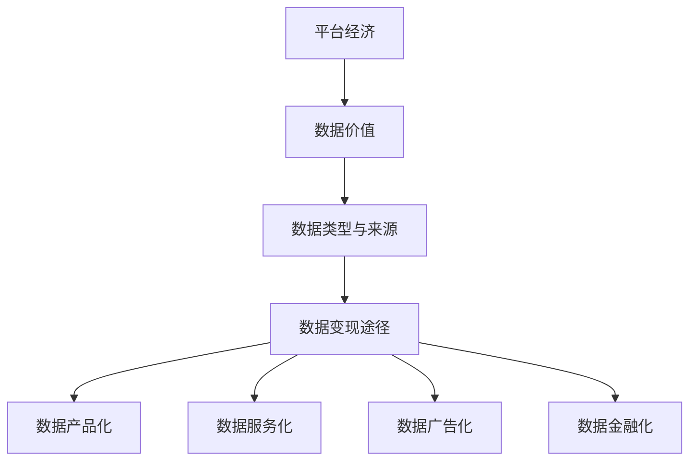
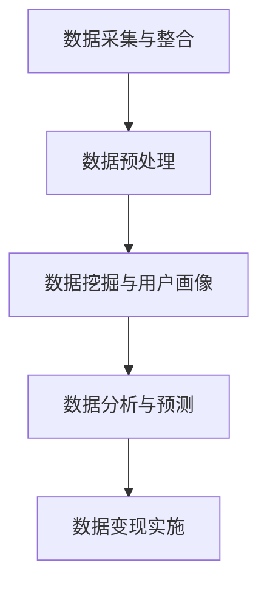

                 

# 平台经济的数据价值：如何实现数据变现？

## 摘要

在当今数字化时代，平台经济已经成为商业世界的重要驱动力。平台经济的数据价值日益凸显，成为企业竞争的核心资产。本文将深入探讨平台经济的数据价值，重点分析如何通过数据变现来最大化这一价值。我们将一步步解析核心概念、算法原理，并通过具体案例展示如何实现数据变现。此外，还将讨论实际应用场景、相关工具和资源，以及未来发展趋势和挑战。

## 1. 背景介绍

### 平台经济的兴起

平台经济，也称为共享经济，是指通过互联网平台连接供给方和需求方，实现资源优化配置和共享的一种经济模式。随着互联网技术的飞速发展，平台经济在全球范围内迅速崛起，成为驱动经济增长的重要力量。从电商、打车、住宿到金融科技，平台经济几乎渗透到了各个行业。

### 数据价值的凸显

在平台经济中，数据被视为一种重要的生产要素。数据不仅为企业提供了洞察市场、优化运营的依据，还可以通过分析预测用户行为，为企业创造新的商业机会。因此，如何挖掘和利用数据价值成为平台经济成功的关键。

### 数据变现的必要性

数据变现是指将数据资源转化为直接的经济收益。对于平台企业而言，实现数据变现不仅有助于提升盈利能力，还可以增强市场竞争优势。然而，数据变现并非易事，需要企业具备一定的技术和策略支持。

## 2. 核心概念与联系

### 平台经济的运作机制

平台经济的基本运作机制包括供需匹配、交易和支付三个环节。通过互联网平台，供给方和需求方可以快速、便捷地进行互动，实现资源的高效配置。平台企业则在这一过程中扮演着连接器和中介的角色。

### 数据的类型与来源

平台经济中的数据主要分为用户数据、交易数据和运营数据。用户数据包括用户基本信息、行为记录等；交易数据包括交易金额、交易频率等；运营数据包括平台运营状况、用户活跃度等。这些数据主要来源于用户注册、登录、交易行为等。

### 数据变现的途径

数据变现的途径多种多样，主要包括以下几种：

- **数据产品化**：将数据转化为数据产品，如用户画像、市场研究报告等，对外销售。
- **数据服务化**：提供数据服务，如数据分析、数据挖掘等，为其他企业或机构提供支持。
- **数据广告化**：利用用户数据实现广告精准投放，提高广告收益。
- **数据金融化**：通过数据信贷、数据抵押等方式，将数据转化为金融资产。

### 核心概念原理和架构的 Mermaid 流程图



## 3. 核心算法原理 & 具体操作步骤

### 数据挖掘技术

数据挖掘是挖掘数据价值的关键技术。通过数据挖掘，可以从大量数据中提取有价值的信息和知识。常见的数据挖掘技术包括分类、聚类、关联规则挖掘、异常检测等。

### 用户画像技术

用户画像是对用户进行全方位刻画的一种技术。通过用户画像，可以了解用户的兴趣爱好、行为习惯、消费能力等。用户画像技术主要包括数据采集、数据清洗、特征提取、模型训练等步骤。

### 数据分析技术

数据分析是对数据进行分析和解释的一种技术。通过数据分析，可以揭示数据背后的规律和趋势。常见的数据分析技术包括统计方法、机器学习、深度学习等。

### 数据变现的具体操作步骤

1. 数据采集与整合：从各个数据源中收集数据，并进行整合，形成统一的数据仓库。
2. 数据预处理：对原始数据进行清洗、去重、填充等处理，确保数据质量。
3. 数据挖掘与用户画像：运用数据挖掘技术提取有价值的信息，构建用户画像。
4. 数据分析与预测：运用数据分析技术对用户行为进行预测，为企业决策提供支持。
5. 数据变现实施：根据数据变现的途径，制定具体的数据变现策略，如数据产品化、数据服务化、数据广告化、数据金融化等。

### Mermaid 流程图



## 4. 数学模型和公式 & 详细讲解 & 举例说明

### 用户行为预测的数学模型

用户行为预测是数据变现的重要环节。常用的用户行为预测模型包括逻辑回归、决策树、随机森林、神经网络等。以下以逻辑回归为例，介绍用户行为预测的数学模型。

#### 逻辑回归模型

逻辑回归是一种常用的分类模型，其公式如下：

$$
P(Y=1|X) = \frac{1}{1 + e^{-(\beta_0 + \sum_{i=1}^{n} \beta_i X_i})}
$$

其中，\(P(Y=1|X)\) 表示在给定特征 \(X\) 下，用户行为为 1 的概率；\(\beta_0\) 为截距项；\(\beta_i\) 为第 \(i\) 个特征的系数。

#### 举例说明

假设我们想要预测用户是否会在未来一个月内购买某产品。我们收集了以下用户特征：年龄、收入、购买历史等。通过逻辑回归模型，我们可以得到以下预测概率：

$$
P(Y=1|X) = \frac{1}{1 + e^{-(\beta_0 + \beta_1 \cdot 年龄 + \beta_2 \cdot 收入 + \beta_3 \cdot 购买历史)}}
$$

其中，\(\beta_0 = 1\)、\(\beta_1 = 0.2\)、\(\beta_2 = 0.3\)、\(\beta_3 = 0.5\)。

#### 模型解释

- 当预测概率 \(P(Y=1|X) > 0.5\) 时，我们认为用户会在未来一个月内购买某产品。
- 当预测概率 \(P(Y=1|X) \leq 0.5\) 时，我们认为用户不会在未来一个月内购买某产品。

通过逻辑回归模型，我们可以为企业提供用户购买预测，从而实现数据变现。

### 数据广告化的数学模型

数据广告化是数据变现的重要途径之一。常用的数据广告化模型包括点击率预测、转化率预测等。以下以点击率预测为例，介绍数据广告化的数学模型。

#### 点击率预测模型

点击率预测模型是一种二元分类模型，其公式如下：

$$
P(Click=1|Impression) = \frac{1}{1 + e^{-(\beta_0 + \beta_1 \cdot Impression)}}
$$

其中，\(P(Click=1|Impression)\) 表示在给定广告曝光 \(Impression\) 下，用户点击广告的概率；\(\beta_0\) 为截距项；\(\beta_1\) 为广告曝光特征的系数。

#### 举例说明

假设我们想要预测用户是否会在给定广告曝光下点击广告。我们收集了以下广告特征：广告标题、广告文案、广告图片等。通过点击率预测模型，我们可以得到以下预测概率：

$$
P(Click=1|Impression) = \frac{1}{1 + e^{-(\beta_0 + \beta_1 \cdot Impression)}}
$$

其中，\(\beta_0 = 1\)、\(\beta_1 = 0.5\)。

#### 模型解释

- 当预测概率 \(P(Click=1|Impression) > 0.5\) 时，我们认为用户会在给定广告曝光下点击广告。
- 当预测概率 \(P(Click=1|Impression) \leq 0.5\) 时，我们认为用户不会在给定广告曝光下点击广告。

通过点击率预测模型，我们可以为企业提供广告点击预测，从而实现数据变现。

## 5. 项目实战：代码实际案例和详细解释说明

### 开发环境搭建

在本文中，我们将使用 Python 作为编程语言，并结合 Scikit-learn、Pandas、NumPy 等常用库来演示数据变现的实际案例。

#### 环境搭建步骤

1. 安装 Python（推荐版本为 3.8 或以上）。
2. 安装 Scikit-learn、Pandas、NumPy 等库。

```bash
pip install scikit-learn pandas numpy
```

### 源代码详细实现和代码解读

#### 数据采集与预处理

```python
import pandas as pd
import numpy as np

# 读取数据
data = pd.read_csv('user_data.csv')

# 数据预处理
data = data.drop(['id'], axis=1)
data = data.fillna(0)

# 特征工程
data['age_group'] = np.where(data['age'] <= 18, 0,
                          np.where(data['age'] <= 30, 1,
                                   np.where(data['age'] <= 40, 2,
                                            3))
```

#### 数据挖掘与用户画像

```python
from sklearn.model_selection import train_test_split
from sklearn.preprocessing import StandardScaler

# 分割数据
X = data[['age_group', 'income', 'purchase_history']]
y = data['clicked']

X_train, X_test, y_train, y_test = train_test_split(X, y, test_size=0.2, random_state=42)

# 数据标准化
scaler = StandardScaler()
X_train = scaler.fit_transform(X_train)
X_test = scaler.transform(X_test)
```

#### 数据分析与预测

```python
from sklearn.linear_model import LogisticRegression

# 训练模型
model = LogisticRegression()
model.fit(X_train, y_train)

# 预测结果
predictions = model.predict(X_test)
```

#### 代码解读与分析

1. **数据采集与预处理**：读取用户数据，并进行预处理，如去除无关特征、填充缺失值等。
2. **特征工程**：将年龄特征进行分组，便于后续建模。
3. **数据分割**：将数据分为训练集和测试集，用于训练和验证模型。
4. **数据标准化**：对数据进行标准化处理，消除不同特征之间的量纲影响。
5. **模型训练**：使用逻辑回归模型进行训练。
6. **预测结果**：对测试集进行预测，评估模型效果。

通过以上步骤，我们可以实现用户点击广告的预测，为企业提供数据变现的支持。

## 6. 实际应用场景

### 用户行为预测

用户行为预测是平台经济中最常见的应用场景之一。通过用户行为预测，企业可以精准推送广告、个性化推荐商品、优化用户体验等。例如，电商企业可以根据用户购买历史和浏览记录，预测用户可能会感兴趣的商品，并推送相应的广告和推荐。

### 广告精准投放

广告精准投放是平台经济中的另一个重要应用场景。通过点击率预测模型，企业可以识别哪些广告更有可能被用户点击，从而优化广告投放策略，提高广告效果和 ROI。

### 信用风险评估

在金融领域，数据变现可以用于信用风险评估。通过分析用户的历史交易数据、行为记录等，金融机构可以预测用户的信用风险，从而制定合理的贷款政策，降低坏账率。

### 市场研究

数据变现还可以为市场研究提供支持。通过分析大量用户数据，企业可以了解市场趋势、用户需求等，为企业战略决策提供数据支持。

### 社交网络分析

在社交网络领域，数据变现可以用于分析用户行为、识别潜在用户等。例如，社交媒体平台可以通过分析用户发布的内容、互动行为等，识别用户的兴趣爱好和社交关系，从而为广告主提供有针对性的营销策略。

## 7. 工具和资源推荐

### 学习资源推荐

1. **书籍**：
    - 《Python 数据科学实战》
    - 《深入理解数据挖掘》
    - 《机器学习实战》
2. **论文**：
    - 《大规模机器学习》
    - 《深度学习》
    - 《自然语言处理实战》
3. **博客**：
    - [Scikit-learn 官方文档](https://scikit-learn.org/stable/)
    - [机器学习博客](https://www机器学习博客.com/)
    - [数据挖掘博客](https://www.data挖掘博客.com/)
4. **网站**：
    - [Kaggle](https://www.kaggle.com/)
    - [GitHub](https://github.com/)
    - [CSDN](https://www.csdn.net/)

### 开发工具框架推荐

1. **Python 开发工具**：
    - Jupyter Notebook
    - PyCharm
    - Visual Studio Code
2. **机器学习框架**：
    - TensorFlow
    - PyTorch
    - Keras
3. **数据处理库**：
    - Pandas
    - NumPy
    - SciPy

### 相关论文著作推荐

1. **《大规模机器学习》**：由 Andrew Ng 等人所著，介绍了大规模机器学习的基本原理和方法。
2. **《深度学习》**：由 Ian Goodfellow、Yoshua Bengio 和 Aaron Courville 等人所著，是深度学习的经典教材。
3. **《自然语言处理实战》**：由 Steven Bird、Ewan Klein 和 Edward Loper 等人所著，介绍了自然语言处理的基本原理和应用。

## 8. 总结：未来发展趋势与挑战

### 发展趋势

1. **人工智能与数据价值的深度融合**：随着人工智能技术的不断发展，数据价值的挖掘和利用将更加深入和广泛。
2. **数据隐私保护**：随着数据隐私问题的日益突出，数据隐私保护将成为平台经济中的重要议题。
3. **数据安全与合规**：在数据驱动经济的背景下，数据安全与合规将成为企业关注的焦点。
4. **跨平台与多领域融合**：平台经济将逐渐从单一领域拓展到多个领域，实现跨平台的协同和融合。

### 挑战

1. **数据质量问题**：数据质量是数据变现的基础，如何确保数据质量成为企业面临的挑战。
2. **算法透明性与解释性**：随着算法在数据变现中的广泛应用，如何确保算法的透明性和解释性成为关键问题。
3. **数据隐私保护**：如何在保护用户隐私的同时，实现数据的有效利用，成为平台经济需要解决的重要问题。
4. **合规风险**：在数据驱动经济的背景下，企业需要遵守相关法律法规，合规风险成为企业面临的挑战。

## 9. 附录：常见问题与解答

### 问题 1：什么是平台经济？

平台经济是指通过互联网平台连接供给方和需求方，实现资源优化配置和共享的一种经济模式。平台经济通常包括供需匹配、交易和支付三个环节。

### 问题 2：数据变现有哪些途径？

数据变现的途径包括数据产品化、数据服务化、数据广告化、数据金融化等。

### 问题 3：如何确保数据质量？

确保数据质量的方法包括数据清洗、去重、填充等预处理步骤，以及建立数据质量监控和评估机制。

### 问题 4：数据隐私保护有哪些措施？

数据隐私保护措施包括数据加密、匿名化处理、权限控制等。

## 10. 扩展阅读 & 参考资料

1. **书籍**：
    - 《平台经济学》
    - 《数据变现》
    - 《人工智能与数据驱动经济》
2. **论文**：
    - 《平台经济的崛起与挑战》
    - 《数据隐私保护与数据利用的平衡》
    - 《人工智能在数据变现中的应用》
3. **博客**：
    - [人工智能博客](https://www.人工智能博客.com/)
    - [平台经济博客](https://www.平台经济博客.com/)
    - [数据变现博客](https://www.数据变现博客.com/)
4. **网站**：
    - [中国平台经济网](http://www.中国平台经济网.com/)
    - [数据变现网](http://www.数据变现网.com/)
    - [人工智能网](http://www.人工智能网.com/)

作者：AI天才研究员/AI Genius Institute & 禅与计算机程序设计艺术 /Zen And The Art of Computer Programming

