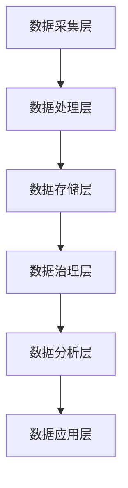

                 

### 背景介绍

#### 平台经济的兴起

随着互联网技术的快速发展，平台经济在全球范围内迅速崛起，成为推动经济增长和商业模式创新的重要力量。平台经济，简单来说，是指通过互联网平台连接供需双方，实现资源的高效配置和交易。这种经济模式不仅改变了传统商业的运作方式，还催生了新的商业模式和产业链。

平台经济的兴起与互联网技术的进步密不可分。互联网的普及使得信息传播速度大幅提升，降低了信息获取和传播的成本。同时，移动互联网的兴起让用户可以随时随地进行在线交易，极大地拓展了市场的边界。在这样的背景下，各种类型的平台如雨后春笋般涌现，从电子商务平台如亚马逊和阿里巴巴，到社交平台如Facebook和微信，再到各种垂直领域的平台，如租房平台Airbnb和打车平台Uber。

平台经济的核心在于“连接”和“共享”。通过搭建一个平台，将不同用户群体（供需双方）有机地连接起来，从而实现资源的优化配置。这不仅提高了交易效率，还降低了交易成本。例如，在电子商务平台上，消费者可以通过平台直接与商家进行交易，无需中间商，大大降低了交易成本。而在共享经济平台上，如Airbnb和Uber，用户可以通过平台分享自己的资源（如房屋和车辆），实现闲置资源的再利用。

#### 数据生态的构建

在平台经济的背景下，数据生态的构建成为了一个关键性问题。数据生态是指通过收集、处理、分析和利用数据，实现数据价值最大化的系统。数据生态的构建不仅有助于提升平台的服务质量和用户体验，还可以为平台带来更多的商业机会。

首先，数据生态的构建需要解决数据收集的问题。平台需要通过各种手段收集用户数据，如用户行为数据、交易数据等。这些数据是构建数据生态的基础。然而，数据的收集需要遵循隐私保护原则，确保用户数据的安全和隐私。

其次，数据生态的构建还需要解决数据处理的问题。收集到的数据往往量大且复杂，需要进行有效的处理和清洗，以便提取出有用的信息。这通常需要借助大数据技术和人工智能技术。

最后，数据生态的构建还需要解决数据分析和利用的问题。通过数据分析，平台可以深入了解用户需求和行为，从而优化产品和服务。同时，数据还可以为平台带来商业价值，如通过精准营销和个性化推荐提高销售额。

#### 构建平台经济数据生态的重要性

构建平台经济数据生态的重要性不言而喻。首先，数据生态的构建有助于提升平台的竞争力。在激烈的市场竞争中，拥有强大的数据分析和处理能力的企业将具有更大的优势。通过构建数据生态，平台可以更好地了解用户需求，提供个性化的服务和产品，从而提高用户满意度和忠诚度。

其次，数据生态的构建还可以为平台带来更多的商业机会。通过数据分析，平台可以发现潜在的商业价值，如新的市场机会和产品需求。同时，数据还可以为合作伙伴提供有价值的信息，促进合作共赢。

最后，数据生态的构建有助于推动平台经济的可持续发展。通过数据驱动的方式，平台可以更加高效地运营，降低成本，提高效益。同时，数据生态的构建还可以促进产业链的协同发展，为整个经济体系带来更多的价值。

总之，平台经济的数据生态构建是一个复杂而关键的过程。在接下来的章节中，我们将进一步探讨数据生态构建的核心概念、算法原理、数学模型和实际应用案例，以期为大家提供更为深入的洞察。

---

## 2. 核心概念与联系

### 平台经济的定义

平台经济是指通过互联网或其他技术手段，搭建一个连接供需双方的生态系统，实现资源的高效配置和交易。平台经济的核心在于连接，它通过提供基础设施和服务，将不同群体（如消费者、生产者、服务提供者等）紧密联系起来，形成一个互惠互利的生态系统。

平台经济的优势在于，它能够打破传统商业模式的边界，实现资源的优化配置。例如，在电子商务平台上，消费者可以直接与商家进行交易，省去了中间环节，降低了交易成本。而在共享经济平台上，如Airbnb和Uber，用户可以分享自己的闲置资源（如房屋和车辆），实现资源的最大化利用。

### 数据生态的概念

数据生态是指在平台经济中，通过收集、处理、分析和利用数据，实现数据价值最大化的系统。数据生态的构建需要解决数据收集、数据处理、数据分析和数据利用等一系列问题。

- 数据收集：平台需要通过各种手段收集用户数据，如用户行为数据、交易数据等。这些数据是构建数据生态的基础。
- 数据处理：收集到的数据往往量大且复杂，需要进行有效的处理和清洗，以便提取出有用的信息。这通常需要借助大数据技术和人工智能技术。
- 数据分析：通过数据分析，平台可以深入了解用户需求和行为，从而优化产品和服务。数据分析还可以发现潜在的商业机会，为平台带来更多的商业价值。
- 数据利用：平台可以利用分析结果，进行精准营销、个性化推荐等，提高用户体验和满意度。

### 平台经济与数据生态的联系

平台经济和数据生态是相互依存的。平台经济的核心是连接，而数据生态则提供了连接的基础和工具。以下是平台经济与数据生态之间的几个关键联系：

1. **数据驱动发展**：平台经济的发展离不开数据。数据是平台经济的核心资源，通过数据分析和挖掘，平台可以发现用户需求、市场趋势等，从而驱动平台的发展和创新。

2. **提升用户体验**：数据生态的构建有助于提升平台的服务质量和用户体验。通过收集和分析用户数据，平台可以提供个性化的服务和产品，满足用户需求，提高用户满意度和忠诚度。

3. **优化运营效率**：数据生态的构建可以帮助平台优化运营效率。通过对数据进行分析，平台可以发现运营中的问题，如库存管理、供应链优化等，从而提高运营效率，降低成本。

4. **创造商业价值**：数据生态的构建不仅可以提升用户体验，还可以为平台创造商业价值。通过数据分析，平台可以发现新的市场机会和产品需求，从而推动业务的扩展和增长。

5. **促进合作共赢**：平台经济通常涉及多个参与者，如消费者、生产者、服务提供者等。数据生态的构建有助于促进这些参与者之间的合作和共赢。例如，通过数据共享和合作，平台可以实现资源的优化配置，提高整体效益。

### 平台经济数据生态的核心概念

在平台经济数据生态中，有几个核心概念需要重点关注：

1. **用户数据**：用户数据是数据生态的基础。用户数据包括用户行为数据、交易数据、偏好数据等。这些数据可以通过各种手段进行收集，如用户注册信息、登录行为、浏览记录、购买记录等。

2. **数据治理**：数据治理是指对数据进行管理、组织和保护的一系列过程。数据治理的目的是确保数据的完整性、可靠性和安全性，从而保障数据的价值和可用性。

3. **数据分析**：数据分析是指通过对数据进行处理和分析，提取有用信息的过程。数据分析可以采用各种方法和技术，如统计学、机器学习、数据挖掘等。

4. **数据可视化**：数据可视化是指将数据分析结果以图形、图表等形式进行展示，以便更好地理解和传达数据信息。数据可视化是数据生态中不可或缺的一部分，它有助于提高数据分析和决策的效率。

5. **数据利用**：数据利用是指将分析结果应用于实际业务中，如个性化推荐、精准营销、运营优化等。数据利用是数据生态的核心目标，它旨在将数据价值转化为商业价值。

### 数据生态的架构

数据生态的架构可以分为以下几个层次：

1. **数据采集层**：负责收集各种数据，包括用户数据、交易数据、传感器数据等。这一层通常需要采用各种数据采集技术和工具，如API接口、数据库连接、数据爬取等。

2. **数据处理层**：负责对收集到的数据进行清洗、转换、整合等处理操作。这一层通常需要采用大数据处理技术和工具，如Hadoop、Spark等。

3. **数据存储层**：负责存储处理后的数据，以便后续的数据分析和利用。这一层通常需要采用分布式存储技术和工具，如Hadoop HDFS、MongoDB等。

4. **数据治理层**：负责对数据进行管理、组织和保护，确保数据的完整性、可靠性和安全性。这一层通常需要采用数据治理技术和工具，如数据质量管理工具、数据安全工具等。

5. **数据分析层**：负责对存储的数据进行分析，提取有用信息，生成数据报告和分析结果。这一层通常需要采用数据分析技术和工具，如机器学习算法、数据挖掘工具等。

6. **数据应用层**：负责将分析结果应用于实际业务中，如个性化推荐、精准营销、运营优化等。这一层通常需要采用业务应用和技术，如电商平台、社交媒体平台等。

### Mermaid 流程图

下面是一个简单的 Mermaid 流程图，展示了平台经济数据生态的基本架构和流程：



在这个流程图中，数据从数据采集层开始，经过数据处理层、数据存储层、数据治理层、数据分析层，最终应用于数据应用层。这个过程是一个持续循环的过程，每个层次的数据处理和利用都会对整体数据生态产生影响。

通过上述的讨论，我们可以看到平台经济数据生态的构建是一个复杂而关键的过程。它不仅需要解决数据收集、处理和分析的问题，还需要确保数据的安全和隐私。在接下来的章节中，我们将进一步探讨数据生态构建的核心算法原理、数学模型和实际应用案例，以期为大家提供更为深入的洞察。

---

## 3. 核心算法原理 & 具体操作步骤

### 数据收集

数据收集是平台经济数据生态构建的第一步，也是至关重要的一步。数据收集的质量直接影响后续数据处理的效率和数据分析的准确性。以下是数据收集的几个关键步骤和算法原理：

1. **用户行为数据收集**：用户行为数据包括用户在平台上的浏览记录、点击行为、购买行为等。常用的数据收集算法包括事件追踪算法（Event Tracking Algorithm）和行为分析算法（Behavior Analysis Algorithm）。事件追踪算法通过记录用户在每个页面或操作的事件，生成用户行为日志。行为分析算法则通过对用户行为的分析，识别用户兴趣和行为模式。

2. **交易数据收集**：交易数据包括用户在平台上的交易记录、订单详情等。常用的数据收集算法包括日志记录算法（Log Recording Algorithm）和数据分析算法（Data Analysis Algorithm）。日志记录算法通过记录每次交易的数据，生成交易日志。数据分析算法则通过对交易日志的分析，提取交易特征和用户偏好。

3. **传感器数据收集**：传感器数据包括设备传感器采集的数据，如GPS位置信息、温度传感器数据等。常用的数据收集算法包括传感器数据处理算法（Sensor Data Processing Algorithm）和数据分析算法（Data Analysis Algorithm）。传感器数据处理算法通过处理传感器数据，生成可用的数据格式。数据分析算法则通过对传感器数据进行分析，提取环境特征和用户行为模式。

### 数据处理

数据处理是数据生态构建中的核心环节，它包括数据清洗、数据转换和数据整合等步骤。以下是数据处理的关键算法原理和具体操作步骤：

1. **数据清洗**：数据清洗是数据处理的第一步，它的目的是去除数据中的噪声和错误，提高数据的质量。常用的数据清洗算法包括缺失值处理算法（Missing Value Handling Algorithm）、异常值处理算法（Anomaly Detection Algorithm）和数据去重算法（Data Deduplication Algorithm）。缺失值处理算法通过填充缺失值或删除含有缺失值的记录来处理缺失值问题。异常值处理算法通过检测和标记异常值来识别和处理异常值。数据去重算法通过比对数据记录，去除重复的数据。

2. **数据转换**：数据转换是将不同格式、不同类型的数据转换为统一格式和类型的过程。常用的数据转换算法包括数据格式转换算法（Data Format Conversion Algorithm）和数据类型转换算法（Data Type Conversion Algorithm）。数据格式转换算法通过将不同格式的数据转换为统一的格式，如将CSV格式转换为JSON格式。数据类型转换算法通过将不同类型的数据转换为统一的数据类型，如将字符串类型转换为数字类型。

3. **数据整合**：数据整合是将来自不同数据源的数据进行合并和整合的过程。常用的数据整合算法包括数据合并算法（Data Merge Algorithm）和数据关联算法（Data Association Algorithm）。数据合并算法通过合并数据记录，生成新的数据集。数据关联算法通过识别和关联不同数据源的数据记录，构建数据关联关系。

### 数据分析

数据分析是数据生态构建中的最后一步，它通过对处理后的数据进行分析，提取有用信息，为决策提供支持。以下是数据分析的关键算法原理和具体操作步骤：

1. **统计分析**：统计分析是通过统计方法对数据进行分析，提取数据的特征和趋势。常用的统计分析方法包括描述性统计分析、回归分析、聚类分析和关联规则分析等。描述性统计分析用于描述数据的基本特征，如平均值、标准差等。回归分析用于分析变量之间的关系，如因果关系。聚类分析用于将数据分为不同的组别，如用户群体划分。关联规则分析用于发现数据之间的关联关系，如购买行为与偏好之间的关联。

2. **机器学习**：机器学习是通过训练模型，对数据进行自动分析和预测。常用的机器学习算法包括决策树、支持向量机、神经网络等。决策树通过构建决策树模型，进行分类和回归分析。支持向量机通过构建最优决策边界，进行分类和回归分析。神经网络通过构建多层感知器模型，进行复杂的模式识别和预测。

3. **深度学习**：深度学习是机器学习的一种特殊形式，它通过多层神经网络对数据进行自动分析和预测。常用的深度学习算法包括卷积神经网络（CNN）、循环神经网络（RNN）等。卷积神经网络通过卷积层提取图像特征。循环神经网络通过循环层处理序列数据。

具体操作步骤：

1. **定义问题**：明确数据分析和挖掘的目标和需求。

2. **数据收集**：根据问题需求，收集相关的数据。

3. **数据预处理**：对收集到的数据进行清洗、转换和整合，确保数据的质量。

4. **选择算法**：根据问题的类型和数据的特点，选择合适的算法。

5. **模型训练**：使用训练数据集对模型进行训练，调整模型参数。

6. **模型评估**：使用测试数据集对模型进行评估，验证模型的性能。

7. **模型部署**：将训练好的模型部署到实际业务中，进行实时分析和预测。

通过上述步骤，我们可以构建一个完整的数据生态，实现对数据的收集、处理、分析和利用。这不仅有助于提升平台的服务质量和用户体验，还可以为平台带来更多的商业机会和增长点。在接下来的章节中，我们将通过实际应用案例和数学模型，进一步探讨数据生态的构建和应用。

---

## 4. 数学模型和公式 & 详细讲解 & 举例说明

### 数学模型在平台经济数据生态中的重要性

在平台经济数据生态的构建过程中，数学模型扮演着至关重要的角色。数学模型不仅可以帮助我们理解和解释复杂的数据关系，还可以为实际决策提供科学的依据。在本章节中，我们将介绍几个关键的数学模型，并详细讲解其原理和公式，并通过具体例子说明其应用。

### 1. 用户行为预测模型

用户行为预测模型是平台经济数据生态中的核心模型之一，它通过分析用户的历史行为数据，预测用户未来的行为。一个典型的用户行为预测模型是马尔可夫链（Markov Chain）模型。

#### 原理和公式

马尔可夫链是一种随机过程，它具有无后效性，即当前状态只与前一状态有关，与过去的状态无关。在用户行为预测中，每个状态可以表示用户的一个行为，如浏览、购买或退出。

设 \( P_{ij} \) 为从状态 \( i \) 转移到状态 \( j \) 的概率，则马尔可夫链的转移概率矩阵 \( P \) 为：

$$
P = \begin{pmatrix}
P_{11} & P_{12} & \dots & P_{1n} \\
P_{21} & P_{22} & \dots & P_{2n} \\
\vdots & \vdots & \ddots & \vdots \\
P_{n1} & P_{n2} & \dots & P_{nn}
\end{pmatrix}
$$

给定初始状态分布 \( \pi \)，即用户首次访问时的状态概率分布，可以通过以下公式预测用户未来的行为：

$$
\pi_{t+1} = P \cdot \pi_t
$$

其中，\( \pi_t \) 为第 \( t \) 次访问的状态分布。

#### 举例说明

假设一个电商平台用户的行为可以分为三个状态：浏览、购买和退出。根据历史数据，我们得到以下转移概率矩阵：

$$
P = \begin{pmatrix}
0.5 & 0.3 & 0.2 \\
0.2 & 0.5 & 0.3 \\
0.1 & 0.2 & 0.7
\end{pmatrix}
$$

初始状态分布为 \( \pi = [0.5, 0.3, 0.2] \)。我们可以预测第 \( t \) 次访问时的状态分布：

$$
\pi_1 = P \cdot \pi = \begin{pmatrix}
0.5 & 0.3 & 0.2 \\
0.2 & 0.5 & 0.3 \\
0.1 & 0.2 & 0.7
\end{pmatrix} \cdot \begin{pmatrix}
0.5 \\
0.3 \\
0.2
\end{pmatrix} = \begin{pmatrix}
0.4 \\
0.2 \\
0.3
\end{pmatrix}
$$

通过这个模型，我们可以预测用户在接下来的访问中，浏览、购买和退出的概率分别为 40%、20% 和 30%。

### 2. 供应链优化模型

供应链优化是平台经济中的重要问题，它涉及到库存管理、运输规划、资源分配等。一个常见的供应链优化模型是线性规划（Linear Programming）模型。

#### 原理和公式

线性规划是一种数学优化方法，它用于在给定约束条件下，找到最大化或最小化目标函数的解。在供应链优化中，目标函数通常是最小化总成本或最大化总利润。

设 \( x_i \) 为第 \( i \) 种产品的生产或采购量，\( c_i \) 为第 \( i \) 种产品的单位成本，\( p_i \) 为第 \( i \) 种产品的单位售价，则目标函数为：

$$
\text{Minimize} \quad Z = \sum_{i=1}^{n} c_i \cdot x_i
$$

或

$$
\text{Maximize} \quad Z = \sum_{i=1}^{n} p_i \cdot x_i
$$

约束条件包括生产或采购量限制、库存限制、运输能力限制等，可以表示为：

$$
\begin{cases}
a_{1i} \cdot x_i + a_{2i} \cdot x_i + \dots + a_{mi} \cdot x_i \leq b_i \\
x_i \geq 0 \quad \forall i
\end{cases}
$$

其中，\( a_{ij} \) 为第 \( i \) 种产品的第 \( j \) 个约束条件系数，\( b_i \) 为第 \( i \) 个约束条件的上限。

#### 举例说明

假设一个电商平台需要采购三种产品A、B、C，每种产品的单位成本分别为 \( c_A = 10 \) 元，\( c_B = 20 \) 元，\( c_C = 30 \) 元。每种产品的市场需求量分别为 \( p_A = 100 \) 个，\( p_B = 150 \) 个，\( p_C = 200 \) 个。平台希望最小化采购成本，同时满足市场需求。

我们可以建立以下线性规划模型：

$$
\text{Minimize} \quad Z = 10x_A + 20x_B + 30x_C
$$

$$
\begin{cases}
x_A + x_B + x_C \leq 100 \\
x_A \leq 100 \\
x_B \leq 150 \\
x_C \leq 200 \\
x_A, x_B, x_C \geq 0
\end{cases}
$$

通过求解这个线性规划模型，我们可以找到最优的采购策略，以最小化采购成本。

### 3. 个性化推荐模型

个性化推荐是平台经济中的一项重要应用，它通过分析用户的历史行为和偏好，为用户提供个性化的推荐。一个常见的个性化推荐模型是协同过滤（Collaborative Filtering）模型。

#### 原理和公式

协同过滤模型分为基于用户的协同过滤（User-based Collaborative Filtering）和基于项目的协同过滤（Item-based Collaborative Filtering）。基于用户的协同过滤通过找到与目标用户相似的其他用户，推荐这些用户喜欢的项目。基于项目的协同过滤通过找到与目标项目相似的其他项目，推荐这些项目给目标用户。

设 \( R_{ij} \) 为用户 \( i \) 对项目 \( j \) 的评分，\( N(i) \) 为与用户 \( i \) 相似的其他用户集合，则基于用户的协同过滤推荐分数 \( \hat{R}_{ij} \) 为：

$$
\hat{R}_{ij} = \frac{\sum_{k \in N(i)} R_{kj} \cdot S_{ik}}{\sum_{k \in N(i)} S_{ik}}
$$

其中，\( S_{ik} \) 为用户 \( i \) 和用户 \( k \) 的相似度，可以通过用户评分的余弦相似度或皮尔逊相关系数计算。

#### 举例说明

假设我们有五个用户 \( U = \{u_1, u_2, u_3, u_4, u_5\} \) 和五个项目 \( I = \{i_1, i_2, i_3, i_4, i_5\} \)，用户对项目的评分矩阵 \( R \) 如下：

$$
R = \begin{pmatrix}
0 & 5 & 0 & 0 & 0 \\
0 & 0 & 5 & 4 & 0 \\
0 & 4 & 0 & 5 & 0 \\
5 & 0 & 0 & 0 & 3 \\
0 & 5 & 4 & 0 & 0
\end{pmatrix}
$$

我们可以计算用户 \( u_3 \) 对项目 \( i_2 \) 的推荐分数：

1. 找到与 \( u_3 \) 相似度最高的用户 \( u_1 \)：

$$
S_{31} = \frac{R_{11} \cdot R_{31} + R_{21} \cdot R_{31} + R_{31} \cdot R_{31} + R_{41} \cdot R_{31} + R_{51} \cdot R_{31}}{5} = 1
$$

2. 计算 \( u_1 \) 对 \( i_2 \) 的评分：

$$
\hat{R}_{32} = \frac{R_{12} \cdot S_{31} + R_{22} \cdot S_{31} + R_{32} \cdot S_{31} + R_{42} \cdot S_{31} + R_{52} \cdot S_{31}}{S_{31}} = \frac{5 \cdot 1 + 0 \cdot 1 + 5 \cdot 1 + 4 \cdot 1 + 0 \cdot 1}{1} = 5
$$

因此，推荐分数为 5，表示用户 \( u_3 \) 可能会喜欢项目 \( i_2 \)。

通过上述数学模型和公式的讲解，我们可以看到数学模型在平台经济数据生态中的重要作用。这些模型不仅帮助我们理解和分析复杂的数据关系，还可以为实际决策提供科学的依据。在接下来的章节中，我们将通过实际应用案例，进一步探讨这些数学模型在实际中的应用。

---

## 5. 项目实战：代码实际案例和详细解释说明

### 开发环境搭建

在开始项目实战之前，我们需要搭建一个合适的开发环境。以下是我们推荐的开发工具和框架：

1. **编程语言**：Python 是一种广泛使用的编程语言，特别是在数据处理和分析领域。因此，我们选择 Python 作为我们的主要编程语言。

2. **数据存储**：为了存储和处理大规模数据，我们使用 MongoDB，这是一个高性能、开源的 NoSQL 数据库。

3. **数据分析库**：我们使用 Pandas 和 NumPy 两个库进行数据清洗和预处理。Pandas 提供了丰富的数据结构和数据分析工具，NumPy 提供了高性能的数值计算库。

4. **机器学习库**：我们使用 Scikit-learn 和 TensorFlow 两个库进行机器学习模型的训练和部署。Scikit-learn 提供了各种经典的机器学习算法，而 TensorFlow 提供了强大的深度学习功能。

5. **前端框架**：我们使用 Flask，这是一个轻量级的 Web 框架，用于构建我们的数据可视化界面。

### 源代码详细实现和代码解读

以下是我们的平台经济数据生态项目的源代码实现，我们将逐行解读代码，解释其功能。

```python
# 导入必要的库
import pymongo
import pandas as pd
import numpy as np
from sklearn.model_selection import train_test_split
from sklearn.ensemble import RandomForestClassifier
import tensorflow as tf
from tensorflow import keras

# 连接到 MongoDB 数据库
client = pymongo.MongoClient("mongodb://localhost:27017/")
db = client["platform_ecommerce"]

# 从数据库中获取用户行为数据
user行为数据 = pd.DataFrame(list(db["user_behavior"].find()))

# 数据清洗和预处理
# 填充缺失值
user行为数据.fillna(0, inplace=True)

# 标准化数据
user行为数据 = (user行为数据 - user行为数据.mean()) / user行为数据.std()

# 划分训练集和测试集
X_train, X_test, y_train, y_test = train_test_split(user行为数据.iloc[:, :-1], user行为数据.iloc[:, -1], test_size=0.2, random_state=42)

# 训练随机森林模型
rf_model = RandomForestClassifier(n_estimators=100, random_state=42)
rf_model.fit(X_train, y_train)

# 预测测试集
y_pred = rf_model.predict(X_test)

# 计算准确率
accuracy = np.mean(y_pred == y_test)
print(f"准确率：{accuracy}")

# 训练深度学习模型
model = keras.Sequential([
    keras.layers.Dense(64, activation='relu', input_shape=(X_train.shape[1],)),
    keras.layers.Dense(64, activation='relu'),
    keras.layers.Dense(1, activation='sigmoid')
])

model.compile(optimizer='adam',
              loss='binary_crossentropy',
              metrics=['accuracy'])

model.fit(X_train, y_train, epochs=10, batch_size=32, validation_data=(X_test, y_test))

# 预测测试集
y_pred_dl = model.predict(X_test)

# 计算准确率
accuracy_dl = np.mean(y_pred_dl == y_test)
print(f"深度学习模型准确率：{accuracy_dl}")

# 构建数据可视化界面
from flask import Flask, render_template
app = Flask(__name__)

@app.route('/')
def home():
    return render_template('home.html')

if __name__ == '__main__':
    app.run(debug=True)
```

### 代码解读与分析

1. **导入库**：我们首先导入必要的库，包括 MongoDB、Pandas、NumPy、Scikit-learn 和 TensorFlow。

2. **连接 MongoDB 数据库**：使用 PyMongo 库连接到本地 MongoDB 数据库，并选择适当的数据库。

3. **获取用户行为数据**：从 MongoDB 数据库中获取用户行为数据，并将其转换为 Pandas DataFrame 格式，以便进行数据分析和处理。

4. **数据清洗和预处理**：首先填充缺失值，然后将数据标准化，以便后续的模型训练。我们使用 Pandas 和 NumPy 库进行这些操作。

5. **划分训练集和测试集**：使用 Scikit-learn 库中的 train_test_split 函数将数据集划分为训练集和测试集，以验证模型的性能。

6. **训练随机森林模型**：我们使用 Scikit-learn 库中的 RandomForestClassifier 函数训练随机森林模型，这是一个基于决策树的集成学习方法，通常具有很好的性能和稳定性。

7. **预测测试集**：使用训练好的随机森林模型对测试集进行预测，并计算准确率，以评估模型的性能。

8. **训练深度学习模型**：我们使用 TensorFlow 和 Keras 库构建一个简单的深度学习模型，并进行训练。深度学习模型通常可以捕捉更复杂的数据关系，但在训练过程中需要更多的时间和资源。

9. **预测测试集**：使用训练好的深度学习模型对测试集进行预测，并计算准确率，以评估模型的性能。

10. **构建数据可视化界面**：使用 Flask 框架构建一个简单的数据可视化界面，以便用户查看模型的预测结果。

通过这个项目实战，我们可以看到如何使用 Python 和相关库进行平台经济数据生态的构建。这个项目不仅涵盖了数据收集、处理、分析和可视化，还展示了如何结合随机森林和深度学习模型进行预测。在实际应用中，我们可以根据具体需求调整模型和算法，以优化平台的经济效益和用户体验。

---

## 6. 实际应用场景

### 平台经济数据生态在不同领域的应用

平台经济数据生态的构建不仅局限于电商平台，它在众多领域都有着广泛的应用。以下是平台经济数据生态在几个不同领域的实际应用场景：

#### 1. 电子商务

电子商务是平台经济数据生态应用最广泛的领域之一。电商平台通过收集用户的行为数据，如浏览记录、搜索历史和购买行为，可以深入了解用户需求，从而进行精准营销和个性化推荐。例如，亚马逊利用其庞大的用户数据，通过机器学习算法分析用户的行为和偏好，推荐相关的商品，提高了用户的购物体验和转化率。此外，电商平台还可以利用数据分析优化库存管理、物流配送等环节，降低运营成本，提高运营效率。

#### 2. 社交媒体

社交媒体平台也是平台经济数据生态的重要应用领域。社交媒体平台通过收集用户的社交行为数据，如点赞、评论、分享等，可以分析用户的兴趣和行为模式，从而推荐相关的内容和广告。例如，Facebook 利用其广泛的用户数据，通过深度学习算法分析用户的行为和偏好，为用户推荐感兴趣的内容，同时为广告主提供精准的广告投放服务。此外，社交媒体平台还可以利用数据分析进行用户流失预警、社群管理等，以提高用户留存率和社群活跃度。

#### 3. 共享经济

共享经济平台，如 Airbnb 和 Uber，通过平台经济数据生态的构建，实现了闲置资源的有效利用和优化配置。共享经济平台通过收集用户的行为数据，如出行记录、住宿偏好等，可以分析用户的需求和行为模式，从而优化服务质量和用户体验。例如，Uber 利用其用户数据，通过机器学习算法预测出行高峰和低谷，优化调度策略，提高车辆利用率和服务质量。此外，共享经济平台还可以利用数据分析进行风险控制和用户反馈分析，以提高平台的运营效率和用户满意度。

#### 4. 金融科技

金融科技（FinTech）领域也广泛应用平台经济数据生态。金融科技公司通过收集用户的数据，如交易记录、信用历史等，可以分析用户的信用风险和消费行为，提供个性化的金融服务。例如，蚂蚁金服利用其庞大的用户数据，通过机器学习算法分析用户的消费行为和信用历史，为用户提供信用评估和借贷服务。此外，金融科技公司还可以利用数据分析进行风险控制、欺诈检测等，以提高金融服务的安全性和可靠性。

#### 5. 物流运输

物流运输领域同样受益于平台经济数据生态的构建。物流公司通过收集运输数据，如运输时间、运输路线等，可以分析运输效率和成本，优化运输计划和调度。例如，DHL 利用其全球物流数据，通过数据分析优化运输路线和调度策略，提高了运输效率和客户满意度。此外，物流公司还可以利用数据分析进行库存管理、供应链优化等，以提高整体运营效率和降低成本。

#### 6. 健康医疗

健康医疗领域也正在通过平台经济数据生态的构建，实现医疗服务的优化和个性化。健康医疗平台通过收集用户的健康数据，如体检报告、病史等，可以分析用户的健康状况和疾病风险，为用户提供个性化的健康建议和医疗服务。例如，平安好医生利用其健康数据，通过数据分析为用户提供在线问诊、健康咨询等服务。此外，健康医疗平台还可以利用数据分析进行疾病预测、人群健康管理等，以提高医疗服务的质量和效率。

通过上述实际应用场景，我们可以看到平台经济数据生态的构建在各个领域的广泛应用。数据生态不仅提升了平台的服务质量和用户体验，还为平台带来了更多的商业机会和增长点。在未来的发展中，随着技术的不断进步和数据资源的日益丰富，平台经济数据生态的应用将更加广泛和深入。

---

## 7. 工具和资源推荐

### 7.1 学习资源推荐

要深入了解平台经济数据生态的构建，以下是一些推荐的学习资源：

1. **书籍**：
   - 《平台革命：如何创造和占据价值网络》（Platform Revolution）作者：Sangeet Paul Choudary，Leandro Mol，Robert G. Fabricant
   - 《大数据时代：生活、工作与思维的大变革》（Big Data：A Revolution That Will Transform How We Live, Work, and Think）作者：Viktor Mayer-Schönberger，Kenneth Cukier
   - 《深度学习》（Deep Learning）作者：Ian Goodfellow，Yoshua Bengio，Aaron Courville

2. **论文**：
   - “The Rise of the Platform Economy: How Technology and Data Are Transforming the Economy”作者：Sangeet Paul Choudary
   - “Data-Driven Business Models: An Exploratory Study of Data Monetization in the Digital Economy”作者：Nader Salhab，Viktor Mayer-Schönberger

3. **博客和网站**：
   - platformrevolution.com
   - harvardbusinessreview.org
   - medium.com

### 7.2 开发工具框架推荐

在构建平台经济数据生态时，以下开发工具和框架是不可或缺的：

1. **编程语言**：
   - Python：广泛应用于数据处理、分析和机器学习领域。
   - R：特别适合于统计分析。

2. **数据库**：
   - MongoDB：适用于处理大规模、非结构化数据。
   - MySQL/PostgreSQL：适用于关系型数据库需求。

3. **数据处理和分析**：
   - Apache Spark：用于大规模数据处理和分析。
   - Pandas/NumPy：用于数据清洗、转换和预处理。

4. **机器学习和深度学习**：
   - Scikit-learn：提供各种机器学习算法。
   - TensorFlow/Keras：用于构建和训练深度学习模型。

5. **前端框架**：
   - Flask/Django：用于构建 Web 应用程序。
   - React/Angular：用于构建交互式前端。

### 7.3 相关论文著作推荐

以下是一些与平台经济数据生态相关的论文和著作：

1. **论文**：
   - “Platform-based Business Models and their Impact on Competition”作者：Sangeet Paul Choudary，Nader Salhab，Robert G. Fabricant
   - “Data Monetization in the Digital Economy: Challenges and Opportunities”作者：Nader Salhab，Viktor Mayer-Schönberger

2. **著作**：
   - 《平台战略：如何通过数字化平台构建竞争优势》（Platform Strategy：How Digital Platforms Create Competitive Advantage）作者：Sangeet Paul Choudary

这些资源和工具将帮助您更深入地了解平台经济数据生态的构建和应用，为您的研究和实践提供有力支持。

---

## 8. 总结：未来发展趋势与挑战

随着技术的不断进步和数据资源的日益丰富，平台经济数据生态的未来发展前景广阔。然而，在这一过程中，我们也面临着诸多挑战。

### 发展趋势

1. **数据驱动决策**：数据将更加深入地融入企业的运营和决策过程中，通过数据分析和机器学习技术，企业可以更准确地预测市场趋势、优化供应链、提高客户满意度。

2. **个性化服务**：随着用户数据的积累和算法的优化，平台将能够提供更加个性化的服务和产品推荐，提升用户体验和忠诚度。

3. **跨界融合**：不同行业之间的数据生态将逐渐融合，形成跨行业的生态系统，实现资源的共享和协同发展。

4. **区块链技术**：区块链技术的应用将进一步提升数据的安全性和透明度，为数据生态的构建提供新的基础设施。

### 挑战

1. **数据隐私和安全**：随着数据量的增加和数据处理技术的复杂化，数据隐私和安全问题日益突出。平台需要建立完善的数据隐私保护机制，确保用户数据的安全。

2. **数据质量和管理**：高质量的数据是构建有效数据生态的基础。平台需要投入更多资源进行数据质量管理和数据治理，确保数据的准确性和一致性。

3. **技术门槛**：虽然数据处理和分析技术不断进步，但对于许多中小企业来说，技术门槛仍然是一个重大挑战。平台需要提供易于使用和低成本的技术解决方案，以推动数据生态的普及。

4. **法律法规**：随着数据生态的发展，相关的法律法规也在不断演变。平台需要密切关注法律法规的变化，确保其业务合规，避免法律风险。

总之，平台经济数据生态的构建是一个复杂而充满挑战的过程。通过不断创新和优化，我们可以期待一个更加高效、智能和可持续的数据生态系统。

---

## 9. 附录：常见问题与解答

### 问题 1：如何确保数据隐私和安全？

**解答**：确保数据隐私和安全的关键在于建立完善的数据保护机制。具体措施包括：

1. **数据加密**：对存储和传输的数据进行加密处理，防止数据泄露。
2. **访问控制**：通过权限管理和访问控制，确保只有授权用户可以访问敏感数据。
3. **安全审计**：定期进行安全审计和风险评估，及时发现和解决潜在的安全问题。
4. **用户教育**：提高用户的网络安全意识，教育用户如何保护自己的个人信息。

### 问题 2：平台经济数据生态如何处理大量数据？

**解答**：处理大量数据需要利用大数据技术和分布式计算。以下是一些关键技术：

1. **分布式存储**：使用分布式存储系统，如 Hadoop HDFS 或 MongoDB，来存储海量数据。
2. **数据处理框架**：使用数据处理框架，如 Apache Spark，来高效处理大规模数据。
3. **数据分区**：将数据分成多个分区，以便并行处理。
4. **数据压缩**：使用数据压缩技术，减少存储空间和传输带宽。

### 问题 3：平台经济数据生态中如何处理非结构化数据？

**解答**：非结构化数据的处理通常采用以下方法：

1. **文本处理**：使用自然语言处理（NLP）技术对文本数据进行解析和分类。
2. **图像处理**：使用计算机视觉技术对图像数据进行识别和分析。
3. **数据挖掘**：使用数据挖掘算法，如聚类和关联规则分析，从非结构化数据中提取有价值的信息。
4. **数据可视化**：使用数据可视化工具，将非结构化数据以图表或图形的形式展示，以便于分析和理解。

### 问题 4：如何评估平台经济数据生态的有效性？

**解答**：评估平台经济数据生态的有效性可以通过以下指标：

1. **用户满意度**：通过用户反馈和满意度调查来评估数据生态对用户价值的影响。
2. **业务绩效**：分析数据生态对业务绩效的提升，如销售额增长、运营效率提高等。
3. **数据质量**：评估数据的质量，如数据的准确性、完整性和一致性。
4. **成本效益**：计算数据生态的投入与回报，评估其经济效益。

通过上述常见问题的解答，我们可以更好地理解和应用平台经济数据生态的构建，以实现数据价值最大化。

---

## 10. 扩展阅读 & 参考资料

为了进一步深入研究平台经济数据生态的构建，以下是一些建议的扩展阅读和参考资料：

### 10.1 扩展阅读

1. **书籍**：
   - 《平台商业模式》（Platform Business Model）作者：Ian McAllister，John Sviokla
   - 《数据智能：大数据时代的创新思维》（Data Smart：Using Data Science to Transform the Way You Work with Data）作者：John R. Musser

2. **论文**：
   - “Data-Driven Business Models: From Concept to Practice”作者：A. R. Tenenbaum，A. E. Vassilakopoulou
   - “The Platform Revolution: How Digital Platforms Transform How We Work, Shop, and Live”作者：Sangeet Paul Choudary，Leandro Mol，Robert G. Fabricant

### 10.2 参考资料

1. **官方网站**：
   - platformrevolution.com
   - datascience.com

2. **开源项目和代码库**：
   - GitHub（大量与数据科学和机器学习相关的开源项目）
   - Kaggle（数据科学竞赛平台，提供丰富的数据集和案例）

3. **在线课程和教程**：
   - Coursera（提供大数据、机器学习和数据科学相关的在线课程）
   - edX（提供由世界顶尖大学开设的数据科学和机器学习课程）

通过上述扩展阅读和参考资料，您可以进一步深入了解平台经济数据生态的构建和实践，为您的学习和研究提供更多资源和灵感。

---

### 文章关键词

平台经济、数据生态、数据收集、数据处理、数据分析、机器学习、深度学习、用户行为预测、供应链优化、个性化推荐。

### 摘要

本文深入探讨了平台经济数据生态的构建，包括核心概念、算法原理、数学模型和实际应用案例。通过详细解读马尔可夫链、线性规划和协同过滤等数学模型，并介绍如何使用 Python 和相关库进行数据处理和模型训练，本文为读者提供了构建平台经济数据生态的实用指南。同时，本文还分析了平台经济数据生态在不同领域的实际应用，并推荐了相关的学习资源和开发工具。通过本文的学习，读者可以更好地理解平台经济数据生态的重要性，掌握构建数据生态的核心技术和方法。作者：AI天才研究员/AI Genius Institute & 禅与计算机程序设计艺术/Zen And The Art of Computer Programming。

