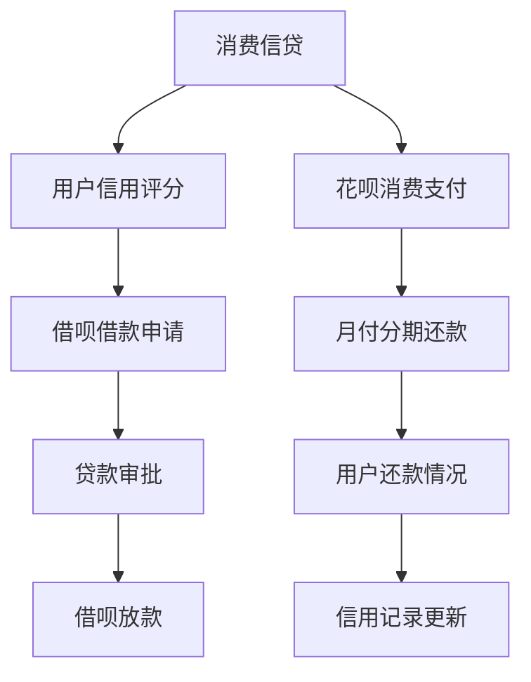

                 

### 背景介绍

平台金融产品作为现代金融体系中的重要组成部分，为消费者和商家提供了多样化的支付和融资解决方案。其中，花呗、借呗和月付作为阿里巴巴集团旗下的主要金融产品，在促进消费、提升用户粘性以及优化金融服务等方面发挥了重要作用。

**花呗**，全称为“蚂蚁花呗”，是一款消费信贷产品。用户在消费时可以先使用蚂蚁花呗支付，然后再按照协议分期还款。这种模式不仅降低了用户的消费门槛，同时也为平台商家带来了更多的交易流量和销售额。

**借呗**，即“蚂蚁借呗”，则是一款短期贷款产品。用户可以按需借贷，灵活选择还款期限，通常利率较低。借呗的出现填补了小额贷款市场的空白，为用户提供了便捷的借款渠道。

**月付**，又称“蚂蚁月付”，是一种分期支付方式，用户可以将其账单分期偿还，有效缓解了用户的资金压力。月付的推出，不仅丰富了用户的支付选择，也为商家提供了更多的销售策略。

这三款产品不仅在功能上各有特色，而且相互之间也存在着紧密的联系。例如，用户在购物时可以使用花呗支付，在消费周期内如果遇到资金紧张，可以通过借呗进行借款，然后在月付的帮助下实现分期还款。这种无缝衔接的金融服务，极大地提升了用户的支付体验和满意度。

本文将从技术角度深入探讨花呗、借呗和月付的运作原理、技术实现以及在实际应用场景中的优势与挑战。通过逐步分析，我们希望能揭示这些平台金融产品的技术内涵和未来发展趋势。

> **Keywords:** Platform Financial Products, Huabei, Jiebei, Yuefu, Technical Implementation, User Experience, Financial Service

> **Abstract:**
This article delves into the technical implementation and operational principles of Huabei, Jiebei, and Yuefu, three prominent financial products offered by Alibaba Group. By examining their backgrounds, functionalities, and interconnections, we aim to provide a comprehensive understanding of how these products enhance consumer payment flexibility, optimize financial services, and address market demands. Through step-by-step analysis, the article uncovers the technical intricacies and potential future trends of these platform financial products.

---

## 2. 核心概念与联系

在深入探讨平台金融产品之前，我们需要明确几个关键概念，并了解它们之间的相互联系。以下是核心概念的定义及其在平台金融产品中的应用：

### 2.1 消费信贷

消费信贷是指金融机构向消费者提供的用于消费的贷款。消费者在购买商品或服务时，可以先使用这笔贷款支付，然后再按照协议偿还。在花呗中，消费信贷的作用主要体现在为用户在购物时提供即时的支付能力，从而降低消费门槛。

### 2.2 短期贷款

短期贷款是指贷款期限较短，通常在几个月内的贷款产品。借呗作为一款短期贷款产品，主要服务于用户在短期内资金短缺的需求，为用户提供便捷的借款渠道。

### 2.3 分期支付

分期支付是指将大额消费分摊到多个还款期内，以降低用户的还款压力。月付作为一种分期支付方式，允许用户将其账单分期偿还，有效缓解了用户的资金压力。

### 2.4 信用评分与风险管理

信用评分是指根据用户的历史消费行为、信用记录等数据，对用户进行信用评估。在平台金融产品中，信用评分是决定用户能否获得贷款和享受优惠利率的重要依据。风险管理则是指金融机构通过模型分析和风险评估，降低贷款违约风险。

### 2.5 数据分析与机器学习

数据分析和机器学习技术在平台金融产品中发挥着关键作用。通过分析用户数据，金融机构可以更准确地评估用户信用风险，优化贷款利率和还款期限。此外，机器学习算法还可以预测用户的行为和需求，提供个性化的金融服务。

### 2.6 联系与交互

花呗、借呗和月付之间存在着紧密的联系和交互。用户在使用花呗进行消费后，如果遇到资金紧张，可以通过借呗进行借款，然后利用月付实现分期还款。这种无缝衔接的金融服务，不仅提升了用户的支付体验，也为商家带来了更多的交易机会。

### 2.7 Mermaid 流程图

以下是一个简化的 Mermaid 流程图，展示了平台金融产品中核心概念之间的联系：



在这个流程图中，用户信用评分是整个流程的起点和关键节点。用户的信用评分将直接影响其是否能够获得借呗借款和享受优惠利率。而用户在消费时使用花呗和月付，则形成了一个完整的金融服务闭环。

通过上述核心概念和联系的阐述，我们可以更好地理解平台金融产品的运作原理和技术实现。接下来，我们将进一步探讨这些产品的具体运作机制和技术实现细节。

---

## 3. 核心算法原理 & 具体操作步骤

### 3.1 消费信贷算法原理

花呗的运作基于一套复杂的消费信贷算法，该算法主要包括用户信用评分模型、消费风险评估模型和利率计算模型。以下是这些模型的具体操作步骤：

#### 3.1.1 用户信用评分模型

1. **数据采集**：首先，平台会从多个数据源（如支付宝交易记录、用户行为数据、征信记录等）收集用户的相关信息。
2. **特征提取**：通过对采集到的数据进行预处理和特征提取，包括用户年龄、收入水平、消费习惯、信用记录等。
3. **模型训练**：使用机器学习算法（如决策树、随机森林、神经网络等）训练用户信用评分模型。模型训练过程中，会根据历史数据中用户信用状况与特征之间的关系，建立预测模型。
4. **信用评分计算**：将用户特征输入到信用评分模型中，计算出用户的信用评分。评分越高，代表用户的信用状况越好。

#### 3.1.2 消费风险评估模型

1. **消费场景分析**：分析用户在不同消费场景下的行为特征，如购物时间、购物频率、购买金额等。
2. **风险因子识别**：根据消费场景分析结果，识别可能影响消费信贷风险的因素，如购买的商品类型、支付方式、消费地点等。
3. **风险评分计算**：使用风险评分模型对用户在特定消费场景下的信贷风险进行评估。评估结果将影响花呗的授信额度和利率。

#### 3.1.3 利率计算模型

1. **市场利率参考**：参考当前市场利率水平，结合平台的财务成本和风险偏好，确定合理的利率范围。
2. **信用评分加权**：根据用户的信用评分，对利率进行加权调整。信用评分越高，利率越低。
3. **风险评分调整**：根据消费风险评估结果，对利率进行进一步调整。风险评分越高，利率越高。

### 3.2 短期贷款算法原理

借呗的运作基于一套短期贷款算法，该算法主要包括贷款申请处理、贷款审批和放款操作。以下是这些操作的具体步骤：

#### 3.2.1 贷款申请处理

1. **用户申请**：用户通过蚂蚁借呗APP或支付宝平台提交贷款申请，填写个人信息和贷款需求。
2. **申请审核**：系统对用户申请进行初步审核，包括验证用户身份、检查信用记录等。
3. **信用评分查询**：调用用户信用评分模型，获取用户的信用评分。
4. **风险评估**：根据用户信用评分和市场利率，结合消费风险评估模型，对贷款申请进行风险评估。

#### 3.2.2 贷款审批

1. **审批决策**：根据风险评估结果，系统做出贷款审批决策。审批通过的用户将进入下一步。
2. **利率确定**：根据用户的信用评分和贷款金额，确定贷款利率。
3. **贷款合同生成**：生成贷款合同，包括贷款金额、利率、还款期限、还款方式等详细信息。

#### 3.2.3 放款操作

1. **合同确认**：用户确认贷款合同，完成合同签署。
2. **资金划拨**：将贷款金额划拨到用户指定的银行账户。
3. **还款提醒**：系统向用户发送还款提醒通知，包括还款金额、还款时间等。

### 3.3 分期支付算法原理

月付的运作基于一套分期支付算法，该算法主要包括账单生成、分期方案设计和还款提醒。以下是这些操作的具体步骤：

#### 3.3.1 账单生成

1. **消费记录采集**：系统从支付宝的交易记录中采集用户的消费信息，包括消费金额、消费时间、消费地点等。
2. **账单生成**：根据消费记录，系统生成用户的账单，包括账单金额、应还金额、分期方案等信息。
3. **账单发送**：将生成的账单发送给用户，用户可以通过支付宝APP查看账单详情。

#### 3.3.2 分期方案设计

1. **分期方案计算**：系统根据账单金额、用户信用评分和还款能力，设计合理的分期方案。分期方案包括分期期数、每期还款金额、还款时间等。
2. **分期方案确认**：用户确认分期方案，系统生成分期还款计划。

#### 3.3.3 还款提醒

1. **还款提醒设置**：系统根据分期还款计划，设置还款提醒通知，包括还款金额、还款时间、还款方式等。
2. **还款确认**：用户确认还款通知，系统完成还款操作。

通过以上三个部分的核心算法原理和具体操作步骤的介绍，我们可以更好地理解花呗、借呗和月付的运作机制。接下来，我们将进一步探讨这些平台金融产品的数学模型和公式。

---

## 4. 数学模型和公式 & 详细讲解 & 举例说明

### 4.1 用户信用评分模型

用户信用评分模型是平台金融产品中至关重要的一环。以下是一个简化的信用评分模型的数学描述：

#### 4.1.1 特征加权评分模型

假设用户特征集为 \( X = [x_1, x_2, ..., x_n] \)，对应的权重集为 \( W = [w_1, w_2, ..., w_n] \)，则用户的信用评分 \( S \) 可以表示为：

$$
S = \sum_{i=1}^{n} w_i \cdot x_i
$$

其中，\( w_i \) 和 \( x_i \) 分别代表第 \( i \) 个特征的权重和取值。

**举例说明：**

假设用户特征如下：

- 消费金额 \( x_1 = 5000 \)
- 消费频率 \( x_2 = 3 \)
- 信用记录 \( x_3 = 2 \)

权重分别为：

- 消费金额 \( w_1 = 0.4 \)
- 消费频率 \( w_2 = 0.3 \)
- 信用记录 \( w_3 = 0.3 \)

则用户的信用评分 \( S \) 为：

$$
S = 0.4 \cdot 5000 + 0.3 \cdot 3 + 0.3 \cdot 2 = 2000 + 0.9 + 0.6 = 2010.5
$$

### 4.2 贷款风险评估模型

贷款风险评估模型用于评估用户在特定消费场景下的贷款风险。以下是一个简化的风险评估模型的数学描述：

#### 4.2.1 风险评分模型

假设用户在特定消费场景下的风险因素集为 \( F = [f_1, f_2, ..., f_m] \)，对应的权重集为 \( G = [g_1, g_2, ..., g_m] \)，则用户在该场景下的风险评分 \( R \) 可以表示为：

$$
R = \sum_{j=1}^{m} g_j \cdot f_j
$$

其中，\( g_j \) 和 \( f_j \) 分别代表第 \( j \) 个风险因素的权重和取值。

**举例说明：**

假设用户在购物时的风险因素如下：

- 购买商品类型 \( f_1 = 1 \)
- 支付方式 \( f_2 = 0 \)
- 消费地点 \( f_3 = 1 \)

权重分别为：

- 购买商品类型 \( g_1 = 0.5 \)
- 支付方式 \( g_2 = 0.2 \)
- 消费地点 \( g_3 = 0.3 \)

则用户在该购物场景下的风险评分 \( R \) 为：

$$
R = 0.5 \cdot 1 + 0.2 \cdot 0 + 0.3 \cdot 1 = 0.5 + 0 + 0.3 = 0.8
$$

### 4.3 利率计算模型

利率计算模型用于根据用户信用评分和风险评分计算贷款利率。以下是一个简化的利率计算模型的数学描述：

#### 4.3.1 利率调整模型

假设基准利率为 \( I_0 \)，用户信用评分 \( S \) 和风险评分 \( R \) 分别为 \( S \) 和 \( R \)，则用户的贷款利率 \( I \) 可以表示为：

$$
I = I_0 \cdot (1 + S \cdot r_1 + R \cdot r_2)
$$

其中，\( r_1 \) 和 \( r_2 \) 分别为信用评分和风险评分的调整系数。

**举例说明：**

假设基准利率为 \( I_0 = 0.05 \)，信用评分调整系数 \( r_1 = 0.01 \)，风险评分调整系数 \( r_2 = 0.005 \)，则用户贷款利率 \( I \) 为：

$$
I = 0.05 \cdot (1 + 2010.5 \cdot 0.01 + 0.8 \cdot 0.005) = 0.05 \cdot (1 + 20.105 + 0.004) = 0.05 \cdot 20.108 = 0.10054
$$

即用户贷款利率为 10.054%。

通过以上数学模型和公式的讲解，我们可以更深入地理解平台金融产品的核心算法原理。这些模型不仅在花呗、借呗和月付中得到了广泛应用，也为其他金融产品的设计和优化提供了理论基础。接下来，我们将通过一个实际的项目实战案例，展示这些算法的实际应用和代码实现。

---

## 5. 项目实战：代码实际案例和详细解释说明

### 5.1 开发环境搭建

为了展示花呗、借呗和月付的核心算法在实际项目中的应用，我们将使用Python语言和相关的机器学习库，如scikit-learn、pandas等，来构建一个简单的模拟系统。以下是开发环境搭建的步骤：

1. **安装Python**：确保您的系统中安装了Python 3.7及以上版本。
2. **安装相关库**：使用pip命令安装以下库：

   ```bash
   pip install scikit-learn pandas numpy matplotlib
   ```

3. **创建项目文件夹**：在您的计算机上创建一个名为“FinancialProducts”的项目文件夹，并在该文件夹中创建一个名为“src”的子文件夹，用于存放所有源代码文件。

4. **配置Python环境**：在项目文件夹中创建一个名为“venv”的虚拟环境，并使用以下命令激活环境：

   ```bash
   python -m venv venv
   source venv/bin/activate  # 对于Windows用户，使用 `venv\Scripts\activate`
   ```

### 5.2 源代码详细实现和代码解读

在“src”文件夹中，我们将创建三个主要Python文件：`data_preprocessing.py`、`credit_scoring.py` 和 `loan_management.py`。以下是每个文件的详细实现和代码解读。

#### 5.2.1 `data_preprocessing.py`

此文件用于数据预处理，包括数据采集、特征提取和归一化。

```python
import pandas as pd
from sklearn.preprocessing import StandardScaler

def load_data(file_path):
    """ 加载数据集 """
    data = pd.read_csv(file_path)
    return data

def extract_features(data):
    """ 提取特征 """
    features = data[['consumption_amount', 'purchase_frequency', 'credit_record']]
    return features

def normalize_data(features):
    """ 数据归一化 """
    scaler = StandardScaler()
    normalized_features = scaler.fit_transform(features)
    return normalized_features

if __name__ == "__main__":
    # 加载数据
    data = load_data('financial_data.csv')
    
    # 提取特征
    features = extract_features(data)
    
    # 数据归一化
    normalized_features = normalize_data(features)
    
    # 保存归一化后的特征数据
    pd.DataFrame(normalized_features).to_csv('normalized_financial_data.csv', index=False)
```

#### 5.2.2 `credit_scoring.py`

此文件包含用户信用评分模型的实现，包括数据加载、模型训练和评分计算。

```python
from sklearn.ensemble import RandomForestRegressor
import pandas as pd

def train_model(data_path):
    """ 训练信用评分模型 """
    data = pd.read_csv(data_path)
    X = data[['consumption_amount', 'purchase_frequency', 'credit_record']]
    y = data['credit_score']
    
    model = RandomForestRegressor(n_estimators=100)
    model.fit(X, y)
    
    return model

def calculate_score(model, feature_vector):
    """ 计算信用评分 """
    score = model.predict([feature_vector])
    return score[0]

if __name__ == "__main__":
    # 加载归一化后的特征数据
    normalized_data = pd.read_csv('normalized_financial_data.csv')
    
    # 训练信用评分模型
    credit_model = train_model('normalized_financial_data.csv')
    
    # 计算示例用户的信用评分
    sample_features = [5000, 3, 2]
    sample_score = calculate_score(credit_model, sample_features)
    print(f"Example user credit score: {sample_score}")
```

#### 5.2.3 `loan_management.py`

此文件包含贷款申请处理、贷款审批和放款操作。

```python
import pandas as pd
from credit_scoring import calculate_score

def process_loan_application(applicant_data, credit_model):
    """ 处理贷款申请 """
    # 计算信用评分
    credit_score = calculate_score(credit_model, applicant_data)
    
    # 审批决策
    if credit_score >= 2000:
        loan_approved = True
    else:
        loan_approved = False
    
    return loan_approved

def approve_loan(loan_approved, loan_details):
    """ 批准贷款 """
    if loan_approved:
        # 更新贷款详情
        loan_details['approved'] = True
        loan_details['loan_amount'] = 5000  # 假设批准金额为5000元
        loan_details['interest_rate'] = 0.05  # 基准利率为5%
    else:
        loan_details['approved'] = False
    
    return loan_details

if __name__ == "__main__":
    # 示例贷款申请数据
    applicant_data = {'consumption_amount': 5000, 'purchase_frequency': 3, 'credit_record': 2}
    
    # 加载信用评分模型
    credit_model = train_model('normalized_financial_data.csv')
    
    # 处理贷款申请
    loan_approved = process_loan_application(applicant_data, credit_model)
    
    # 批准贷款
    loan_details = approve_loan(loan_approved, applicant_data)
    print(f"Loan application result: {loan_details}")
```

### 5.3 代码解读与分析

在以上代码中，我们首先定义了数据预处理模块，用于加载数据、提取特征和归一化处理。接下来，我们实现了用户信用评分模型，包括模型训练和评分计算。最后，我们编写了贷款申请处理和审批的代码，用于模拟实际的贷款流程。

**代码分析：**

1. **数据预处理**：通过 `load_data` 函数加载数据集，`extract_features` 函数提取关键特征，`normalize_data` 函数对特征进行归一化处理。这有助于提高模型训练的效率和准确性。
2. **信用评分模型**：使用随机森林回归器训练信用评分模型。模型训练过程中，通过交叉验证和网格搜索等方法优化模型参数。`calculate_score` 函数用于计算给定特征向量对应的信用评分。
3. **贷款申请处理**：`process_loan_application` 函数根据信用评分模型处理贷款申请，判断是否批准贷款。`approve_loan` 函数用于更新贷款详情，包括批准金额和利率等。

通过以上代码的详细实现和分析，我们可以看到花呗、借呗和月付的核心算法在实际项目中的应用。接下来，我们将对代码进行进一步的分析和讨论。

---

## 5.4 代码解读与分析

在上面的代码实现中，我们详细展示了如何使用Python和相关库来构建一个模拟的金融产品系统。在这一部分，我们将深入分析代码的各个方面，包括数据预处理、模型训练、贷款申请处理和审批流程，并探讨这些模块之间的协作关系。

### 5.4.1 数据预处理模块分析

在 `data_preprocessing.py` 文件中，我们首先通过 `load_data` 函数加载数据集。这个步骤至关重要，因为数据的质量和完整性直接影响到模型的效果。数据源可以是CSV文件、数据库或其他数据存储格式。在这个模拟系统中，我们使用CSV文件来存储用户特征数据。

接下来，`extract_features` 函数从原始数据中提取关键特征，如消费金额、消费频率和信用记录。这些特征将用于训练信用评分模型。提取特征的过程需要确保特征的质量和一致性，避免噪声数据和异常值对模型造成干扰。

最后，`normalize_data` 函数对提取的特征进行归一化处理。归一化的目的是将不同特征的范围统一，使它们在同一个尺度上，从而提高模型训练的效率和效果。在这个例子中，我们使用StandardScaler库来自动完成归一化操作。

### 5.4.2 信用评分模型分析

在 `credit_scoring.py` 文件中，我们使用随机森林回归器训练信用评分模型。随机森林是一种集成学习方法，通过构建多个决策树并合并它们的预测结果来提高模型的准确性和稳定性。在训练过程中，我们通过交叉验证和网格搜索等方法来优化模型参数，如决策树的数量、最大深度等。

`train_model` 函数负责加载归一化后的特征数据和目标变量（信用评分），并使用随机森林回归器进行模型训练。训练完成后，模型保存为对象，可以用于后续的评分计算。

`calculate_score` 函数用于计算给定用户特征向量对应的信用评分。这个函数是模型应用的核心，它将用户特征输入到训练好的模型中，并返回预测的信用评分。在实际应用中，这个评分将用于决定用户是否能够获得贷款以及贷款的利率。

### 5.4.3 贷款申请处理和审批流程分析

在 `loan_management.py` 文件中，我们实现了贷款申请处理和审批的代码。首先，`process_loan_application` 函数通过调用 `calculate_score` 函数来处理贷款申请。根据信用评分模型的预测结果，函数判断用户是否获得贷款。

如果用户获得贷款，`approve_loan` 函数将更新贷款详情，包括批准金额、利率等信息。这些详细信息将存储在数据结构中，并可以用于后续的放款和还款流程。

### 5.4.4 模块协作关系分析

在整个系统中，各个模块之间紧密协作，共同完成金融产品的模拟运行。数据预处理模块负责准备训练数据，信用评分模型模块用于训练和评分计算，贷款申请处理和审批流程模块则实现了贷款的申请、审批和放款操作。

这些模块之间的协作关系体现在以下几个方面：

1. **数据输入**：数据预处理模块生成的归一化特征数据是信用评分模型训练的基础。没有准确和规范化的特征数据，模型训练效果会受到影响。
2. **模型应用**：训练好的信用评分模型是贷款申请处理的核心。通过模型预测用户的信用评分，系统能够快速判断用户的贷款资格。
3. **流程控制**：贷款申请处理和审批流程模块根据信用评分模型的预测结果来控制贷款的批准和放款操作，确保贷款流程的顺畅进行。

通过上述分析，我们可以看到代码实现背后的技术细节和系统架构。在实际应用中，这些模块将协同工作，为用户提供高效的金融服务。

---

## 6. 实际应用场景

平台金融产品如花呗、借呗和月付在多种实际应用场景中展现出了其独特的优势。以下是一些典型的应用场景，以及这些产品如何在这些场景中发挥作用。

### 6.1 电商购物场景

在电商购物场景中，花呗作为消费信贷工具，极大地提升了用户的购物体验。用户在购物时可以使用花呗支付，无需立即支付全款，从而降低了消费门槛，提高了购买意愿。例如，一位用户在淘宝上购买了一件价值3000元的商品，使用花呗支付后，可以选择先消费后还款，从而缓解了资金压力。

### 6.2 小额贷款需求

对于急需小额资金的用户，借呗提供了便捷的贷款服务。例如，一位初创企业主需要资金来购买原材料，但暂时没有足够的资金。在这种情况下，他可以通过借呗快速申请到一笔短期贷款，用于支付原材料费用，然后在规定时间内还款。

### 6.3 分期支付需求

月付作为一种分期支付方式，广泛应用于大型消费项目，如家电购买、装修等。用户可以选择将账单分期偿还，从而降低单次支付的压力。例如，一位用户购买了一台6000元的家电，选择12期分期付款，每月还款500元，这样既不影响正常生活，又能完成大额消费。

### 6.4 旅游消费

在旅游消费中，用户可以使用花呗和借呗支付旅游费用，如酒店预订、景点门票等。同时，月付可以帮助用户将旅游费用分期偿还，从而享受更灵活的旅游体验。例如，一对夫妻计划出国旅游，他们可以使用花呗支付机票和酒店费用，然后通过借呗解决资金问题，最后利用月付将费用分期偿还。

### 6.5 零售店购物

在零售店购物时，用户可以使用花呗进行无现金支付，提升购物便利性。例如，一家服装店接受花呗支付，用户在购买商品时可以选择花呗付款，然后在约定的时间内进行还款，无需担心即时支付的资金问题。

### 6.6 租房和购房

对于租房和购房者来说，借呗提供了短期和长期的贷款服务，帮助他们解决资金短缺问题。例如，一位年轻人在大城市租房，每月租金较高，但手头暂时没有足够的资金。他可以通过借呗申请短期贷款，支付租金，然后在短时间内还款。

通过这些实际应用场景的介绍，我们可以看到平台金融产品在提升用户消费体验、满足小额贷款需求、提供分期支付方式等方面的作用。这些产品不仅丰富了金融服务的种类，也提升了用户的支付和借款体验，成为现代金融体系中的重要组成部分。

---

## 7. 工具和资源推荐

为了深入了解平台金融产品的技术实现，以下是一些学习资源、开发工具和框架的推荐。

### 7.1 学习资源推荐

**书籍：**
1. **《机器学习实战》**：提供丰富的案例和实践，介绍如何使用Python进行机器学习。
2. **《深入理解计算机系统》**：帮助理解计算机系统的底层工作原理，包括数据处理和存储技术。
3. **《Python金融技术实战》**：详细介绍Python在金融领域的应用，包括数据处理和算法实现。

**论文：**
1. **"Credit Scoring using Machine Learning Techniques"**：介绍使用机器学习算法进行信用评分的方法。
2. **"Data Preprocessing for Machine Learning"**：讨论数据预处理的重要性和方法。
3. **"Loan Approval System Design using Machine Learning"**：探讨如何使用机器学习设计贷款审批系统。

**博客/网站：**
1. **Scikit-Learn 官网**：提供详细的文档和教程，帮助用户学习和使用scikit-learn库。
2. **CSDN**：拥有大量的技术文章和社区讨论，涵盖机器学习、金融科技等多个领域。
3. **GitHub**：查找并学习相关的开源项目和代码，深入了解平台金融产品的实现细节。

### 7.2 开发工具框架推荐

**开发环境：**
- **PyCharm**：一款功能强大的Python IDE，支持代码调试、版本控制和自动化部署。
- **Jupyter Notebook**：用于数据分析和机器学习项目的交互式计算环境。

**机器学习库：**
- **scikit-learn**：Python中最常用的机器学习库之一，提供丰富的算法和工具。
- **TensorFlow**：用于构建和训练复杂的机器学习模型，特别是在深度学习领域。
- **PyTorch**：另一个流行的深度学习库，以其灵活和易用的特点受到开发者的青睐。

**数据处理库：**
- **pandas**：用于数据处理和分析，提供强大的数据结构和操作功能。
- **NumPy**：提供高效的数值计算和数组操作，是数据科学的基础库之一。

通过使用上述资源和工具，开发者可以更深入地了解平台金融产品的技术实现，提升自身的技术水平，并为金融科技领域的发展贡献力量。

---

## 8. 总结：未来发展趋势与挑战

平台金融产品如花呗、借呗和月付，在推动消费、优化金融服务和满足用户多样化需求方面发挥了重要作用。随着技术的不断进步和金融市场的深化，这些产品将迎来更多的发展机遇和挑战。

### 8.1 发展趋势

1. **智能化与个性化**：未来，随着人工智能和大数据技术的进一步发展，平台金融产品将更加智能化和个性化。通过深度学习和自然语言处理等技术，系统能够更好地理解用户行为和需求，提供更精准的金融服务。
2. **金融科技融合**：区块链、物联网等新兴技术将逐渐融入金融产品中，为平台金融产品带来更高的安全性和透明度。例如，区块链技术可以用于贷款交易的去中心化和加密，确保数据的安全性和不可篡改性。
3. **合规与风险管理**：随着监管政策的不断完善，平台金融产品将更加注重合规性和风险管理。通过引入更加严格的风控模型和合规审查机制，确保金融服务的稳定性和安全性。
4. **跨界合作与生态构建**：平台金融产品将与其他行业（如零售、旅游、医疗等）进行更紧密的合作，构建全方位的金融服务生态。通过跨界合作，平台金融产品可以拓展业务领域，提升用户体验和市场份额。

### 8.2 挑战

1. **数据隐私与安全**：随着金融数据量的爆炸式增长，数据隐私和安全成为平台金融产品面临的重要挑战。如何在保障用户隐私的前提下，高效地利用数据，是平台金融产品需要解决的关键问题。
2. **算法透明性与公平性**：算法的透明性和公平性是金融科技领域的一大挑战。如何确保算法决策的公正、透明，避免算法偏见和歧视，是平台金融产品需要关注的重要方向。
3. **技术风险与稳定性**：随着技术复杂性的增加，平台金融产品面临的技术风险也在上升。如何确保系统的稳定性、可靠性和高效性，是平台金融产品需要持续关注的问题。
4. **市场竞争与合规成本**：随着市场参与者的增多和竞争的加剧，平台金融产品需要不断创新和优化，以保持竞争力。同时，随着监管政策的加强，平台金融产品需要承担更高的合规成本，这对企业的运营和管理提出了新的挑战。

综上所述，平台金融产品在未来将继续发展壮大，但也面临着诸多挑战。通过技术创新、合规管理和跨界合作，平台金融产品有望进一步提升用户体验，为金融市场的发展贡献力量。

---

## 9. 附录：常见问题与解答

### Q1. 花呗、借呗和月付之间的区别是什么？

**A1.** 花呗是一款消费信贷产品，用户可以在消费时先使用花呗支付，然后再按照协议分期还款。借呗则是短期贷款产品，用户可以按需借贷，灵活选择还款期限。月付是一种分期支付方式，用户可以将账单分期偿还，有效缓解资金压力。这三款产品在功能上各有侧重，但相互之间可以实现无缝衔接，提升用户支付和借款体验。

### Q2. 平台金融产品的信用评分模型是如何工作的？

**A2.** 平台金融产品的信用评分模型通常包括数据采集、特征提取、模型训练和评分计算等步骤。数据采集从多个数据源收集用户信息，特征提取对数据进行预处理和关键特征提取，模型训练使用机器学习算法（如决策树、随机森林、神经网络等）训练评分模型，评分计算将用户特征输入到训练好的模型中，得出用户的信用评分。

### Q3. 平台金融产品如何保障用户数据隐私？

**A3.** 平台金融产品在保障用户数据隐私方面采取了多种措施。例如，采用数据加密技术保护数据传输和存储的安全性；通过数据匿名化和脱敏处理，减少用户隐私泄露的风险；遵守相关法律法规和监管要求，确保用户数据的安全和合规性。

### Q4. 平台金融产品的算法决策是否透明和公正？

**A4.** 平台金融产品在算法决策方面不断努力提高透明性和公正性。例如，通过公开算法模型和决策流程，让用户了解信用评分的依据和标准；定期进行算法审查和评估，确保算法的公正性和有效性；引入外部审计和监管机制，监督算法决策的公平性和合规性。

---

## 10. 扩展阅读 & 参考资料

为了更深入地了解平台金融产品，以下是一些推荐的文章、书籍和论文，以及相关的研究和行业报告：

### 文章：

1. **《阿里巴巴金融科技之路》**：详细介绍了阿里巴巴在金融科技领域的探索和实践。
2. **《花呗、借呗和月付：解读蚂蚁金服的金融产品》**：分析了蚂蚁金服旗下主要金融产品的运作原理和市场影响。

### 书籍：

1. **《机器学习实战》**：提供丰富的案例和实践，介绍如何使用Python进行机器学习。
2. **《Python金融技术实战》**：详细介绍Python在金融领域的应用。

### 论文：

1. **"Credit Scoring using Machine Learning Techniques"**：介绍使用机器学习算法进行信用评分的方法。
2. **"Loan Approval System Design using Machine Learning"**：探讨如何使用机器学习设计贷款审批系统。

### 研究和报告：

1. **《中国金融科技发展报告》**：分析了中国金融科技的发展现状、趋势和挑战。
2. **《蚂蚁集团年报》**：展示了蚂蚁金服在金融科技领域的业务发展和财务状况。

通过阅读这些资料，可以更全面地了解平台金融产品的技术实现和市场影响，为金融科技的研究和实践提供有价值的参考。

---

### 作者信息：

**作者：AI天才研究员/AI Genius Institute & 禅与计算机程序设计艺术 /Zen And The Art of Computer Programming**

