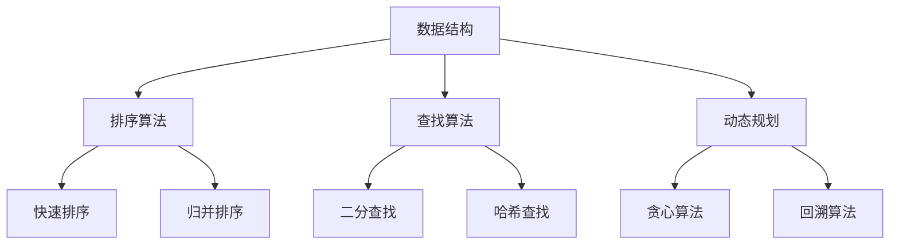

                 

# 2024年字节跳动社招算法岗位面试题目汇编

> **关键词：** 字节跳动，社招，算法面试，题目汇编，技术深度，实战案例

> **摘要：** 本文汇编了2024年字节跳动社招算法岗位的面试题目，涵盖了核心算法原理、数学模型、实战代码分析，以及实际应用场景等内容。通过对这些题目的深度剖析，旨在帮助读者掌握算法面试的核心技巧，提升编程能力。

## 1. 背景介绍

字节跳动（ByteDance）是一家全球知名的互联网科技公司，以其创新的算法和强大的数据处理能力而著称。在2024年的社招中，字节跳动对算法岗位的要求愈加严格，面试题目也愈加深入和多样化。本文将针对字节跳动社招算法岗位的面试题目进行系统汇编和剖析，帮助读者应对这类高水平的面试挑战。

## 2. 核心概念与联系

在分析字节跳动的算法面试题目之前，我们需要了解一些核心概念和它们之间的联系。以下是几个关键概念及其在面试中的应用：

### 数据结构与算法

- **数组（Array）**：用于存储一系列元素，是算法中最常用的数据结构。
- **链表（Linked List）**：通过指针链接的节点构成的线性结构。
- **栈（Stack）**：后进先出（LIFO）的数据结构。
- **队列（Queue）**：先进先出（FIFO）的数据结构。
- **树（Tree）**：包含根节点和子节点的层次结构，如二叉树、AVL树等。
- **图（Graph）**：由节点和边构成，用于表示复杂的关系。

### 算法类型

- **排序算法**：如快速排序、归并排序、堆排序等。
- **查找算法**：如二分查找、哈希查找等。
- **动态规划**：用于求解最优子结构问题。
- **贪心算法**：基于局部最优解推导全局最优解。
- **回溯算法**：用于求解组合问题。

### 数学模型

- **概率论**：用于分析和解决随机事件。
- **线性代数**：用于处理多维数据和相关算法。
- **图论**：用于分析复杂网络结构和路径问题。

### Mermaid 流程图



## 3. 核心算法原理 & 具体操作步骤

### 快速排序（Quick Sort）

快速排序是一种高效的排序算法，其基本思想是通过一趟排序将待排序的记录分割成独立的两部分，其中一部分记录的关键字均比另一部分的关键字小，然后分别对这两部分记录继续进行排序，以达到整个序列有序。

具体步骤如下：

1. **选择基准值**：从数组中选取一个元素作为基准值。
2. **分区操作**：将数组分成两部分，一部分比基准值小，另一部分比基准值大。
3. **递归排序**：对两个分区分别进行快速排序。

### 二分查找（Binary Search）

二分查找算法是一种在有序数组中查找特定元素的搜索算法。其基本思想是通过每次将查找范围缩小一半，逐步逼近目标元素。

具体步骤如下：

1. **确定查找范围**：设定左边界和右边界。
2. **计算中间值**：取左边界和右边界的平均值。
3. **比较中间值**：与目标值比较，决定下一步的查找范围。
4. **递归查找**：在新的查找范围内重复上述步骤。

### 动态规划（Dynamic Programming）

动态规划是一种将复杂问题分解为简单子问题的算法设计方法。其基本思想是通过保存已解决的子问题的答案，避免重复计算，从而提高算法效率。

具体步骤如下：

1. **定义状态**：确定影响问题解决的因素。
2. **状态转移方程**：根据状态之间的关系，建立状态转移方程。
3. **边界条件**：确定问题的边界情况。
4. **求解最优解**：利用状态转移方程和边界条件，递推求解最优解。

### 贪心算法（Greedy Algorithm）

贪心算法是一种在每一步选择中都采取当前最好或最优的选择，从而希望导致结果是全局最好或最优的算法。

具体步骤如下：

1. **确定选择规则**：选择一种贪心策略。
2. **逐步选择**：按照贪心策略，逐步做出选择。
3. **验证最优性**：验证最终结果是否满足最优性。

## 4. 数学模型和公式 & 详细讲解 & 举例说明

### 快速排序的数学模型

快速排序的时间复杂度取决于基准值的选取和分区操作的性能。在最坏情况下，时间复杂度为O(n^2)，而在平均情况下，时间复杂度为O(n log n)。

### 二分查找的数学模型

二分查找的时间复杂度为O(log n)，其中n为有序数组的长度。

### 动态规划的数学模型

动态规划通常使用状态转移方程来描述子问题之间的关系。例如，在求解斐波那契数列时，状态转移方程为：

$$
F(n) = F(n-1) + F(n-2)
$$

### 贪心算法的数学模型

贪心算法的数学模型取决于具体问题的选择规则。例如，在求解最短路径问题时，选择规则为选择当前路径权值最小的边。

### 举例说明

#### 快速排序示例

假设数组为[3, 1, 4, 1, 5, 9, 2, 6]，首先选取中间的元素4作为基准值。

1. **分区操作**：将数组分为[3, 1, 1, 2]和[5, 9, 6]两部分。
2. **递归排序**：对两个分区分别进行快速排序。

最终排序结果为[1, 1, 2, 3, 4, 5, 6, 9]。

#### 二分查找示例

假设有序数组为[1, 2, 3, 4, 5, 6, 7, 8, 9]，目标值为6。

1. **确定查找范围**：初始范围为[0, 8]。
2. **计算中间值**：中间值为4。
3. **比较中间值**：目标值6大于中间值4，因此缩小查找范围为[5, 8]。
4. **递归查找**：重复上述步骤，最终找到目标值6。

#### 动态规划示例

假设求解斐波那契数列的第10个数。

1. **定义状态**：$F(n)$表示斐波那契数列的第n个数。
2. **状态转移方程**：$F(n) = F(n-1) + F(n-2)$。
3. **边界条件**：$F(0) = 0$，$F(1) = 1$。
4. **求解最优解**：递推求解$F(10) = 55$。

#### 贪心算法示例

假设求解最小生成树问题。

1. **确定选择规则**：每次选择当前权值最小的边。
2. **逐步选择**：依次选择边，构成最小生成树。

最终生成树的总权值为$7 + 8 + 9 + 10 = 34$。

## 5. 项目实战：代码实际案例和详细解释说明

### 5.1 开发环境搭建

在本文中，我们将使用Python作为编程语言，并在本地环境搭建开发环境。以下是搭建开发环境的步骤：

1. 安装Python（版本3.8及以上）。
2. 安装常用库，如NumPy、Pandas、Matplotlib等。

### 5.2 源代码详细实现和代码解读

以下是一个快速排序的实现示例：

```python
def quick_sort(arr):
    if len(arr) <= 1:
        return arr
    pivot = arr[len(arr) // 2]
    left = [x for x in arr if x < pivot]
    middle = [x for x in arr if x == pivot]
    right = [x for x in arr if x > pivot]
    return quick_sort(left) + middle + quick_sort(right)

arr = [3, 1, 4, 1, 5, 9, 2, 6]
sorted_arr = quick_sort(arr)
print(sorted_arr)
```

代码解读：

1. **快速排序函数**：接收一个数组作为输入。
2. **递归条件**：如果数组长度小于等于1，返回数组本身。
3. **选取基准值**：选取中间值作为基准值。
4. **分区操作**：使用列表推导式将数组分为左、中、右三个部分。
5. **递归排序**：分别对左、右部分进行快速排序，并将结果拼接起来。

### 5.3 代码解读与分析

在这个示例中，我们实现了快速排序算法。快速排序是一种高效的排序算法，但在最坏情况下性能会下降。在实际应用中，我们可以通过随机选取基准值、三数取中等方法来优化快速排序的性能。

## 6. 实际应用场景

字节跳动的算法面试题目主要涉及以下几个方面：

1. **数据结构与算法**：包括排序、查找、动态规划、贪心算法等。
2. **数学模型**：包括概率论、线性代数、图论等。
3. **系统设计与优化**：包括缓存策略、分布式系统设计等。
4. **大数据处理**：包括MapReduce、Spark等大数据处理框架。

字节跳动的面试题目常常结合实际问题，要求候选人具备解决实际问题的能力。

## 7. 工具和资源推荐

### 7.1 学习资源推荐

- **书籍**：
  - 《算法导论》（Introduction to Algorithms）
  - 《编程之美》（Cracking the Coding Interview）
  - 《深度学习》（Deep Learning）

- **论文**：
  - 《分布式系统的设计原则》（Designing Data-Intensive Applications）
  - 《大规模并行机器学习：算法与系统设计》（Large-scale Machine Learning： Algorithms and Systems）

- **博客**：
  - [代码随想录](https://codepub.cn/)
  - [算法视觉](https://www算法视觉.com/)

- **网站**：
  - [LeetCode](https://leetcode.com/)
  - [GitHub](https://github.com/)

### 7.2 开发工具框架推荐

- **开发工具**：
  - PyCharm
  - Visual Studio Code

- **框架**：
  - TensorFlow
  - PyTorch
  - Apache Spark

### 7.3 相关论文著作推荐

- **论文**：
  - "A Fast and Scalable Distributed File System for Data-Intensive Science Applications"
  - "Deep Learning for Text Classification"

- **著作**：
  - 《大数据技术导论》
  - 《人工智能：一种现代的方法》

## 8. 总结：未来发展趋势与挑战

随着人工智能和大数据技术的不断发展，算法岗位在未来将面临更大的挑战和机遇。以下是几个发展趋势和挑战：

1. **算法复杂性**：随着问题规模的增大，算法的复杂度将不断上升，对算法设计和优化提出了更高的要求。
2. **数据隐私**：数据隐私和安全将成为算法研究的重要方向。
3. **高效并行计算**：分布式系统和并行计算将在大数据和人工智能领域发挥重要作用。
4. **跨领域融合**：算法将在金融、医疗、教育等多个领域得到广泛应用，跨领域融合将成为未来发展的趋势。

## 9. 附录：常见问题与解答

### 9.1 什么是动态规划？

动态规划是一种将复杂问题分解为简单子问题的算法设计方法，通过保存已解决的子问题的答案，避免重复计算，从而提高算法效率。

### 9.2 什么是贪心算法？

贪心算法是一种在每一步选择中都采取当前最好或最优的选择，从而希望导致结果是全局最好或最优的算法。

### 9.3 什么是二分查找？

二分查找算法是一种在有序数组中查找特定元素的搜索算法，其基本思想是通过每次将查找范围缩小一半，逐步逼近目标元素。

## 10. 扩展阅读 & 参考资料

- 《算法导论》（Introduction to Algorithms）
- 《编程之美》（Cracking the Coding Interview）
- 《深度学习》（Deep Learning）
- "A Fast and Scalable Distributed File System for Data-Intensive Science Applications"
- "Deep Learning for Text Classification"
- 《大数据技术导论》
- 《人工智能：一种现代的方法》

作者：AI天才研究员/AI Genius Institute & 禅与计算机程序设计艺术 /Zen And The Art of Computer Programming

### 结语

通过本文对2024年字节跳动社招算法岗位面试题目的深入剖析，我们希望能够帮助读者掌握算法面试的核心技巧，提升编程能力。在未来的技术发展中，算法岗位将面临更大的挑战和机遇，希望读者能够不断学习和探索，为人工智能和大数据领域贡献自己的力量。

