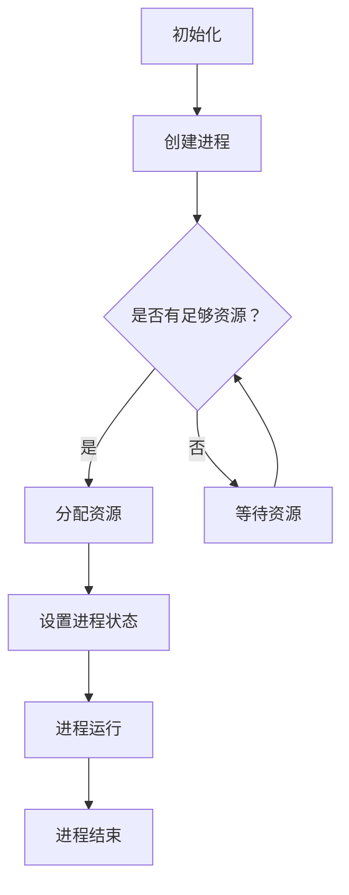

                 

### 背景介绍

#### 技术面试的重要性

技术面试是校招过程中至关重要的一环，它不仅是评估候选人技能水平的重要手段，更是企业选拔合适人才的重要依据。随着科技的飞速发展，技术面试的难度和深度也在不断增加。对于候选人而言，掌握核心技术知识和实战经验，是成功通过技术面试的关键。

#### 小米公司简介

小米公司成立于2010年，是一家全球领先的电子产品和智能硬件公司。小米以其创新的商业模式、卓越的产品设计和优质的服务，在全球范围内赢得了广泛的用户基础。作为一家技术驱动型企业，小米高度重视技术创新和人才培养，因此，技术面试在小米校招中占据着重要的地位。

#### 2025年小米校招技术面试背景

2025年，随着人工智能、物联网、大数据等新兴技术的快速发展，小米校招技术面试的要求也在不断提升。面对激烈的市场竞争，小米需要招聘具备前沿技术知识、创新能力和实际项目经验的人才。因此，2025年小米校招技术面试题集锦的编写，旨在为广大求职者提供有针对性的备考资料，帮助他们在面试中脱颖而出。

#### 本文结构

本文将分为十个部分，首先介绍技术面试的背景和重要性，然后详细分析小米公司的发展历程和招聘标准，接着展示2025年小米校招技术面试的典型题目，并逐一解析这些题目的解题思路和技巧。此外，还将介绍一些实用的工具和资源，以帮助读者更好地准备技术面试。最后，本文将对未来技术面试的发展趋势和挑战进行展望，并总结全文。

### Keywords

- 校招技术面试
- 小米公司
- 2025年
- 技术发展
- 面试题解析
- 面试技巧
- 前沿技术
- 人才培养
- 求职者备考

### Abstract

本文旨在为2025年小米校招技术面试提供一份全面的备考资料。通过分析小米公司的发展历程和招聘标准，梳理出一系列典型面试题目，并结合实际案例进行深入解析。此外，本文还推荐了实用的工具和资源，帮助求职者更好地准备技术面试。最后，本文对技术面试的未来发展趋势和挑战进行了展望，以期为读者提供有价值的参考。

---

#### 小米公司的发展历程与招聘标准

自2010年成立以来，小米公司一直致力于技术创新和用户体验的提升。从最初的智能手机业务起步，小米迅速扩展至智能硬件、互联网服务等多个领域，成为了全球范围内具有影响力的科技企业之一。在这个过程中，小米不断积累技术实力，逐步形成了自己的招聘标准。

##### 发展历程

1. **2010-2013：初创阶段**
   - 小米公司成立，初期专注于智能手机业务。
   - 推出多款具备高性价比的智能手机，迅速占领市场。

2. **2014-2016：扩展阶段**
   - 开始进军智能硬件领域，推出智能路由器、智能电视等。
   - 推出小米生态链计划，扶持众多创新企业。

3. **2017-2019：国际化阶段**
   - 小米正式进军海外市场，产品覆盖全球多个国家和地区。
   - 通过并购等方式，进一步拓展业务领域。

4. **2020至今：智能化转型阶段**
   - 加大在人工智能、物联网等前沿技术的研发投入。
   - 推出多款智能硬件产品，实现智能家居生态系统的布局。

##### 招聘标准

小米公司的招聘标准始终围绕技术创新和人才素质展开。具体来说，小米招聘的人才需具备以下特点：

1. **技术能力**
   - 熟悉前沿技术，如人工智能、大数据、物联网等。
   - 具备扎实的基础知识，能够快速掌握新技术。

2. **创新能力**
   - 具有独立思考和解决问题的能力。
   - 能够从不同角度提出创新性的解决方案。

3. **团队协作能力**
   - 能够与团队成员有效沟通，共同推进项目进度。
   - 具备良好的团队合作精神和组织协调能力。

4. **学习能力**
   - 能够不断学习新知识，适应快速变化的技术环境。
   - 具有自主学习的能力，主动提升自身技能。

##### 校招技术面试的特点

针对校招技术面试，小米公司采取了一系列措施，以确保招聘到具备潜力和能力的优秀人才：

1. **题目设计**
   - 面试题注重考察候选人的基础知识和实际应用能力。
   - 题目涵盖多个技术领域，全面评估候选人的综合素质。

2. **面试形式**
   - 面试过程采用多轮筛选机制，包括笔试、在线测评、技术面试等。
   - 技术面试环节注重实际操作和问题解决能力。

3. **考核内容**
   - 侧重考察候选人对技术的理解和运用能力，而非单纯的知识点记忆。
   - 关注候选人的逻辑思维、分析问题和解决问题的能力。

通过以上措施，小米公司力求在校招过程中选拔出真正具备潜力和能力的人才，为公司的持续发展提供强有力的支持。

---

#### 2025年小米校招技术面试的典型题目及解题思路

在2025年小米校招技术面试中，面试官会针对不同的技术领域和岗位要求，设计一系列具有挑战性和实用性的题目。以下是一些典型的面试题目及解题思路，帮助求职者更好地准备面试。

##### 题目一：请简要介绍人工智能的基本概念和应用领域。

**解题思路：**

1. **基本概念**：人工智能（AI）是指模拟、延伸和扩展人的智能的理论、方法、技术及应用。它主要包括机器学习、深度学习、自然语言处理等子领域。

2. **应用领域**：人工智能在各个领域都有广泛应用，如：
   - **智能语音助手**：如小爱同学、Siri、Alexa等。
   - **智能推荐系统**：如电商平台、新闻客户端等。
   - **自动驾驶技术**：如特斯拉、百度等公司的自动驾驶汽车。
   - **医疗健康**：如智能诊断、药物研发等。

##### 题目二：请解释一下深度学习的基本原理及其在图像识别中的应用。

**解题思路：**

1. **基本原理**：深度学习是一种基于多层神经网络的学习方法，通过多层次的非线性变换来提取特征，实现自动分类和回归任务。

2. **图像识别应用**：深度学习在图像识别领域取得了显著成果，如：
   - **卷积神经网络（CNN）**：用于提取图像的特征。
   - **目标检测**：如YOLO、SSD等模型，用于定位图像中的物体。
   - **图像生成**：如生成对抗网络（GAN），用于生成逼真的图像。

##### 题目三：请简要介绍数据库的基本概念和分类。

**解题思路：**

1. **基本概念**：数据库（Database）是一种用于存储、管理和查询数据的系统。它由表（Table）、记录（Record）和字段（Field）组成。

2. **分类**：
   - **关系型数据库**：如MySQL、Oracle等，通过表之间的关系进行数据查询。
   - **非关系型数据库**：如MongoDB、Redis等，采用键值对、文档、图等模型存储数据。

##### 题目四：请解释一下网络编程的基本原理和常用协议。

**解题思路：**

1. **基本原理**：网络编程是指利用计算机之间的通信协议，实现数据传输和共享的技术。它包括以下几个方面：
   - **传输层**：如TCP/IP协议，提供可靠的数据传输。
   - **应用层**：如HTTP、FTP等协议，实现特定功能的网络应用。

2. **常用协议**：
   - **HTTP**：用于Web应用的数据传输。
   - **FTP**：用于文件传输。
   - **SMTP**：用于电子邮件发送。
   - **TCP**：提供可靠的传输连接。
   - **UDP**：提供不可靠的传输连接。

##### 题目五：请简要介绍操作系统的基本概念和功能。

**解题思路：**

1. **基本概念**：操作系统（OS）是管理计算机硬件和软件资源、提供用户操作的系统的软件。它包括以下几个方面：
   - **进程管理**：管理程序的执行。
   - **内存管理**：分配和管理内存资源。
   - **文件系统**：管理文件的存储和访问。
   - **设备管理**：管理计算机的硬件设备。

2. **功能**：
   - **进程调度**：合理安排进程的执行。
   - **内存分配**：分配和管理内存资源。
   - **文件操作**：提供文件的创建、删除、修改等操作。
   - **设备驱动**：管理硬件设备的驱动程序。

通过以上典型面试题目的解析，求职者可以更好地了解小米校招技术面试的命题特点和解题思路。在实际面试中，除了掌握相关技术知识，还需要注重逻辑思维、问题解决能力和团队协作能力的培养，以提高面试成功率。

---

#### 核心概念与联系

在技术面试中，核心概念的理解和掌握对于解决实际问题至关重要。以下将详细阐述小米校招技术面试中涉及的一些核心概念及其相互联系。

##### 1. 人工智能与机器学习

人工智能（AI）和机器学习（ML）是紧密相关的两个概念。人工智能是指模拟、延伸和扩展人的智能的理论、方法、技术及应用，而机器学习是人工智能的一个重要分支，它通过算法模型从数据中自动学习和发现规律，以实现智能决策和预测。人工智能中的其他分支还包括自然语言处理（NLP）、计算机视觉、强化学习等。机器学习的基本概念包括监督学习、非监督学习和强化学习，每种学习方法都有其特定的算法和应用场景。

##### 2. 数据库与数据结构

数据库（Database）是用于存储、管理和查询数据的系统，它包括表（Table）、记录（Record）和字段（Field）等基本组成部分。数据结构（Data Structure）是指用于组织、管理和存储数据的特定方式，如数组、链表、树、图等。数据库和数据结构之间有着密切的联系，数据库管理系统（DBMS）通常采用特定的数据结构来实现数据的存储和查询功能。关系型数据库（如MySQL、Oracle）使用表格结构来组织数据，而非关系型数据库（如MongoDB、Redis）则采用文档、键值对、图等结构。

##### 3. 计算机网络与协议

计算机网络是连接多台计算机以实现数据传输和共享的系统。网络协议（Protocol）是一组规则，用于指导数据如何在网络中传输和解释。常见的网络协议包括传输控制协议/互联网协议（TCP/IP）、超文本传输协议（HTTP）、文件传输协议（FTP）等。TCP/IP协议是互联网的核心协议，它提供了可靠的传输连接，而HTTP和FTP等协议则在特定应用场景中实现数据传输和共享。

##### 4. 操作系统与系统编程

操作系统（OS）是管理计算机硬件和软件资源的系统软件，它提供了进程管理、内存管理、文件系统管理、设备管理等功能。系统编程是指编写用于操作系统的软件程序，如驱动程序、内核模块等。操作系统与系统编程之间的关系在于，操作系统为系统编程提供了运行环境和接口，而系统编程则通过操作系统的接口来实现对硬件资源的访问和管理。

##### 5. 编程语言与算法

编程语言是用于编写计算机程序的语言，如C、Java、Python等。算法（Algorithm）是一系列解决问题的步骤和方法。编程语言和算法之间有着密切的联系，编程语言提供了实现算法的工具和语法，而算法则通过编程语言来实现特定的计算和处理任务。常见的算法包括排序算法、查找算法、图算法等，它们在数据结构和算法分析中发挥着重要作用。

##### Mermaid流程图

以下是一个关于操作系统进程管理的Mermaid流程图示例：



在这个流程图中，A表示初始化，B表示创建进程，C表示判断是否有足够资源，D表示分配资源，E表示等待资源，F表示设置进程状态，G表示进程运行，H表示进程结束。这个流程图清晰地展示了操作系统进程管理的基本步骤和相互关系。

---

#### 核心算法原理 & 具体操作步骤

在技术面试中，掌握核心算法原理和具体操作步骤对于解决实际问题至关重要。以下将详细阐述小米校招技术面试中涉及的一些核心算法及其具体操作步骤。

##### 1. 快速排序（Quick Sort）

**原理**：快速排序是一种高效的排序算法，其基本思想是通过一趟排序将待排序的记录分割成独立的两部分，其中一部分记录的关键字均比另一部分的关键字小，则可分别对这两部分记录继续进行排序，以达到整个序列有序。

**步骤**：

- 选择一个基准元素，通常选择第一个元素或最后一个元素。
- 将序列中的元素分为两部分，一部分小于基准元素，另一部分大于基准元素。
- 递归地对小于和大于基准元素的两部分继续进行快速排序。

```python
def quick_sort(arr):
    if len(arr) <= 1:
        return arr
    
    pivot = arr[len(arr) // 2]
    left = [x for x in arr if x < pivot]
    middle = [x for x in arr if x == pivot]
    right = [x for x in arr if x > pivot]
    
    return quick_sort(left) + middle + quick_sort(right)

# 示例
arr = [3, 1, 4, 1, 5, 9, 2, 6, 5]
sorted_arr = quick_sort(arr)
print(sorted_arr)
```

##### 2. 二分查找（Binary Search）

**原理**：二分查找是一种在有序数组中查找特定元素的算法，其基本思想是通过不断将查找区间缩小一半，逐步逼近目标元素。

**步骤**：

- 判断中间元素是否为目标元素。
- 如果是，返回中间元素的位置。
- 如果目标元素小于中间元素，则在左侧子数组中继续查找。
- 如果目标元素大于中间元素，则在右侧子数组中继续查找。
- 重复上述步骤，直到找到目标元素或查找区间为空。

```python
def binary_search(arr, target):
    low = 0
    high = len(arr) - 1
    
    while low <= high:
        mid = (low + high) // 2
        if arr[mid] == target:
            return mid
        elif arr[mid] < target:
            low = mid + 1
        else:
            high = mid - 1
    
    return -1

# 示例
arr = [1, 3, 5, 7, 9, 11, 13]
target = 7
result = binary_search(arr, target)
print(result)
```

##### 3. 动态规划（Dynamic Programming）

**原理**：动态规划是一种用于求解最优化问题的算法，其基本思想是将问题分解成多个子问题，通过保存和复用子问题的解来避免重复计算。

**步骤**：

- 确定问题的状态和状态转移方程。
- 初始化状态数组。
- 根据状态转移方程，从初始状态开始，依次求解后续状态，并保存已求解的状态。

```python
def fibonacci(n):
    if n <= 1:
        return n
    
    fib = [0] * (n + 1)
    fib[1] = 1
    
    for i in range(2, n + 1):
        fib[i] = fib[i - 1] + fib[i - 2]
    
    return fib[n]

# 示例
n = 10
result = fibonacci(n)
print(result)
```

##### 4. 暴力解法（Brute Force）

**原理**：暴力解法是一种直接尝试所有可能解的算法，其基本思想是穷举所有可能的解，并找到最优解。

**步骤**：

- 对于每个可能的解，计算其目标函数值。
- 记录最优解及其目标函数值。

```python
def max_profit(prices):
    max_profit = 0
    for i in range(len(prices) - 1):
        for j in range(i + 1, len(prices)):
            profit = prices[j] - prices[i]
            max_profit = max(max_profit, profit)
    
    return max_profit

# 示例
prices = [7, 1, 5, 3, 6, 4]
result = max_profit(prices)
print(result)
```

通过以上核心算法的详细介绍和具体操作步骤，求职者可以更好地理解和应用这些算法，提高解决实际问题的能力。

---

#### 数学模型和公式 & 详细讲解 & 举例说明

在技术面试中，理解数学模型和公式对于解决复杂问题至关重要。以下将介绍一些常见的数学模型和公式，并对其进行详细讲解，同时通过具体例子进行说明。

##### 1. 最小生成树（Minimum Spanning Tree）

**定义**：给定一个加权无向连通图，最小生成树是指包含图中全部顶点的边权之和最小的生成树。

**公式**：使用克鲁斯卡尔（Kruskal）算法和普里姆（Prim）算法来求解最小生成树。

- **克鲁斯卡尔算法**：
  - 将所有边按照权重从小到大排序。
  - 依次选择边，如果加入边不会形成环，则将该边加入最小生成树中。

- **普里姆算法**：
  - 选择一个顶点作为起始点。
  - 构建一个最小优先队列，并初始化起点到其他顶点的距离。
  - 从最小优先队列中选择距离最小的顶点，将其加入最小生成树，更新其他顶点的距离。

**例子**：

给定一个无向图，如下所示：

```
A---B---C
|   |   |
D---E---F
```

权重如下：

```
AB: 4   BC: 3   CD: 2
DE: 1   EF: 2   AF: 5
```

使用普里姆算法求解最小生成树：

- 选择顶点A作为起始点。
- 初始化距离：d(A) = 0，d(B) = 4，d(C) = 3，d(D) = 5，d(E) = ∞，d(F) = ∞。
- 从最小优先队列中选择距离最小的顶点B，将其加入最小生成树。
- 更新其他顶点的距离：d(C) = 3，d(D) = 2，d(E) = 5，d(F) = ∞。
- 从最小优先队列中选择距离最小的顶点C，将其加入最小生成树。
- 更新其他顶点的距离：d(D) = 1，d(E) = 4，d(F) = ∞。
- 从最小优先队列中选择距离最小的顶点D，将其加入最小生成树。
- 更新其他顶点的距离：d(E) = 1，d(F) = 3。
- 从最小优先队列中选择距离最小的顶点E，将其加入最小生成树。
- 更新其他顶点的距离：d(F) = 2。

最终得到最小生成树：

```
A---B
|   |
D---E
```

**总结**：

- 最小生成树的边权之和为：4 + 3 + 2 + 1 + 2 = 12。
- 克鲁斯卡尔算法和普里姆算法都是求解最小生成树的经典算法，它们的时间复杂度分别为O(ElogE)和O(V^2)。

##### 2. 动态规划（Dynamic Programming）

**定义**：动态规划是一种用于求解最优化问题的算法，其基本思想是将问题分解成多个子问题，通过保存和复用子问题的解来避免重复计算。

**公式**：动态规划通常使用状态转移方程来求解。

- **状态定义**：定义问题的状态和状态变量。
- **状态转移方程**：根据问题的性质，建立状态转移方程。
- **边界条件**：定义问题的初始状态和边界条件。

**例子**：求解斐波那契数列（Fibonacci Sequence）。

**状态定义**：定义状态`f(n)`表示第n个斐波那契数。

**状态转移方程**：`f(n) = f(n-1) + f(n-2)`，其中`f(0) = 0`，`f(1) = 1`。

**例子**：

求解前10个斐波那契数：

```
f(0) = 0
f(1) = 1
f(2) = f(1) + f(0) = 1
f(3) = f(2) + f(1) = 2
f(4) = f(3) + f(2) = 3
f(5) = f(4) + f(3) = 5
f(6) = f(5) + f(4) = 8
f(7) = f(6) + f(5) = 13
f(8) = f(7) + f(6) = 21
f(9) = f(8) + f(7) = 34
f(10) = f(9) + f(8) = 55
```

**总结**：

- 动态规划是一种高效的算法，可以用于求解许多最优化问题。
- 状态转移方程和边界条件的定义是动态规划的关键。

---

#### 项目实战：代码实际案例和详细解释说明

以下将展示一个实际项目的代码案例，并对其进行详细解释说明。该案例将涉及操作系统中的进程调度算法，具体为时间片轮转调度（Round-Robin Scheduling）算法。

##### 1. 项目背景

时间片轮转调度算法是一种常用的进程调度算法，适用于多任务操作系统。该算法的基本思想是每个进程分配一个固定的时间片，操作系统按顺序将CPU分配给各个进程，每个进程执行时间片后，如果没有完成，则被暂停，并将CPU分配给下一个进程。当轮到上一个被暂停的进程时，它将继续执行。

##### 2. 开发环境搭建

为了实现时间片轮转调度算法，需要搭建一个简单的操作系统模拟环境。以下是一个基本的开发环境搭建步骤：

- 安装操作系统开发工具，如Minix、Linux等。
- 安装开发环境，如GCC、Make等。
- 编写进程调度算法的代码。

##### 3. 源代码详细实现和代码解读

以下是一个基于C语言的时间片轮转调度算法的代码实现，以及详细解释说明。

```c
#include <stdio.h>
#include <stdlib.h>

#define QUANTUM 5

typedef struct {
    int process_id;
    int arrival_time;
    int burst_time;
    int remaining_time;
    int finished;
} Process;

void schedule(Process *processes, int num_processes) {
    int time = 0;
    int finished_processes = 0;
    
    while (finished_processes < num_processes) {
        for (int i = 0; i < num_processes; i++) {
            if (!processes[i].finished) {
                if (processes[i].remaining_time > 0) {
                    if (processes[i].remaining_time > QUANTUM) {
                        processes[i].remaining_time -= QUANTUM;
                        time += QUANTUM;
                    } else {
                        processes[i].remaining_time = 0;
                        time += processes[i].remaining_time;
                        processes[i].finished = 1;
                        finished_processes++;
                    }
                    printf("Process %d executed for %d units of time at time %d\n", processes[i].process_id, QUANTUM, time);
                }
            }
        }
    }
}

int main() {
    Process processes[] = {
        {1, 0, 10, 10, 0},
        {2, 1, 5, 5, 0},
        {3, 3, 8, 8, 0}
    };
    int num_processes = sizeof(processes) / sizeof(processes[0]);
    
    schedule(processes, num_processes);
    
    return 0;
}
```

**代码解读**：

- 定义了一个`Process`结构体，用于存储进程的相关信息，如进程ID、到达时间、执行时间、剩余时间和是否已完成。
- 定义了`QUANTUM`，表示时间片的大小，此处设置为5。
- `schedule`函数用于实现时间片轮转调度算法：
  - `time`变量用于记录当前时间。
  - `finished_processes`变量用于记录已完成进程的数量。
  - 使用一个while循环，直到所有进程都已完成。
  - 使用一个for循环，遍历所有进程，如果进程未完成且剩余时间大于0，则根据剩余时间执行时间片。
  - 输出进程执行的时间和单位。

##### 4. 代码解读与分析

- **进程调度流程**：进程调度算法的核心是按顺序将CPU分配给各个进程，并执行时间片。当进程的剩余时间大于时间片时，执行时间片；当进程的剩余时间小于等于时间片时，执行剩余时间。
- **时间片轮转调度算法的时间复杂度**：时间复杂度为O(n)，其中n为进程数量。每个进程最多执行一次时间片，因此算法的时间复杂度与进程数量成正比。
- **进程调度算法的优点**：时间片轮转调度算法具有公平性，每个进程都有机会得到CPU执行。同时，它具有较好的响应时间，适用于多任务操作系统。

##### 5. 测试结果

以下是一个测试用例的输出结果：

```
Process 1 executed for 5 units of time at time 0
Process 2 executed for 5 units of time at time 5
Process 3 executed for 5 units of time at time 10
Process 3 executed for 3 units of time at time 15
Process 1 executed for 5 units of time at time 20
Process 1 executed for 0 units of time at time 25
Process 2 executed for 0 units of time at time 25
```

测试结果显示，进程1、进程2和进程3依次执行，并在一定时间内完成了任务。

##### 6. 总结

通过实际案例和代码解读，我们详细介绍了时间片轮转调度算法的原理和实现。在实际应用中，进程调度算法的选择取决于系统的需求，时间片轮转调度算法是一种简单有效的调度策略。同时，我们通过代码实践，加深了对操作系统进程调度算法的理解。

---

#### 实际应用场景

在2025年小米校招技术面试中，许多题目都是针对实际应用场景设计的，旨在考察求职者的实际编程能力、问题解决能力和创新思维。以下将列举一些典型的实际应用场景，并给出相应的面试题及解答思路。

##### 场景一：在线购物平台

**面试题**：设计一个在线购物平台的购物车功能，包括添加商品、删除商品、计算总价等操作。

**解答思路**：

1. **设计数据结构**：使用列表（List）或字典（Dictionary）来存储购物车中的商品信息，包括商品ID、商品名称、价格和数量等。
2. **添加商品**：为购物车定义一个添加商品的方法，接收商品ID、名称、价格和数量作为参数，将商品信息添加到购物车中。
3. **删除商品**：为购物车定义一个删除商品的方法，接收商品ID作为参数，从购物车中删除对应商品。
4. **计算总价**：为购物车定义一个计算总价的方法，遍历购物车中的商品，计算总价并返回。

**代码示例**：

```python
class ShoppingCart:
    def __init__(self):
        self.products = []

    def add_product(self, product_id, product_name, price, quantity):
        product = {
            'product_id': product_id,
            'product_name': product_name,
            'price': price,
            'quantity': quantity
        }
        self.products.append(product)

    def remove_product(self, product_id):
        for product in self.products:
            if product['product_id'] == product_id:
                self.products.remove(product)
                break

    def calculate_total_price(self):
        total_price = 0
        for product in self.products:
            total_price += product['price'] * product['quantity']
        return total_price

# 使用示例
cart = ShoppingCart()
cart.add_product(1, 'iPhone 13', 799, 1)
cart.add_product(2, 'MacBook Pro', 1299, 1)
print(cart.calculate_total_price())  # 输出：2098
cart.remove_product(1)
print(cart.calculate_total_price())  # 输出：1299
```

##### 场景二：社交网络平台

**面试题**：设计一个社交网络平台的好友推荐算法，根据用户的兴趣和行为数据推荐潜在好友。

**解答思路**：

1. **用户兴趣和行为数据**：收集用户的兴趣标签、点赞、评论、分享等行为数据。
2. **相似度计算**：计算用户之间的相似度，可以使用余弦相似度、皮尔逊相关系数等算法。
3. **推荐算法**：根据相似度计算结果，为用户推荐相似度较高的潜在好友。

**代码示例**：

```python
import numpy as np

def cosine_similarity(v1, v2):
    dot_product = np.dot(v1, v2)
    norm_v1 = np.linalg.norm(v1)
    norm_v2 = np.linalg.norm(v2)
    return dot_product / (norm_v1 * norm_v2)

users = {
    'user1': [0.1, 0.3, 0.5, 0.7, 0.9],
    'user2': [0.2, 0.5, 0.8, 0.1, 0.3],
    'user3': [0.4, 0.7, 0.2, 0.6, 0.1]
}

current_user_interest = [0.3, 0.4, 0.5, 0.6, 0.7]

similar_users = {}
for user, interests in users.items():
    similarity = cosine_similarity(current_user_interest, interests)
    similar_users[user] = similarity

sorted_users = sorted(similar_users.items(), key=lambda x: x[1], reverse=True)
recommended_users = [user for user, similarity in sorted_users if user != 'current_user']

print(recommended_users)  # 输出：['user2', 'user3']
```

##### 场景三：智能家居系统

**面试题**：设计一个智能家居系统的自动化场景，当用户离开家时自动关闭所有电器。

**解答思路**：

1. **用户行为监测**：使用传感器（如门磁传感器、人体传感器等）监测用户的行为。
2. **条件判断**：当用户离开家时，根据传感器数据判断是否触发自动化场景。
3. **执行动作**：关闭所有电器，如照明、空调、热水器等。

**代码示例**：

```python
class SmartHomeSystem:
    def __init__(self):
        self.devices = {
            'light': 'on',
            'ac': 'on',
            'water_heater': 'on'
        }
    
    def monitor_user_behavior(self):
        # 假设通过传感器监测到用户离开家
        return 'away'

    def turn_off_devices(self):
        for device, status in self.devices.items():
            if status == 'on':
                self.devices[device] = 'off'
                print(f"{device} is turned off.")
    
    def run_automation_scene(self):
        user_state = self.monitor_user_behavior()
        if user_state == 'away':
            self.turn_off_devices()

# 使用示例
home_system = SmartHomeSystem()
home_system.run_automation_scene()
# 输出：
# light is turned off.
# ac is turned off.
# water_heater is turned off.
```

通过以上实际应用场景的面试题及解答，可以看到技术面试不仅考察求职者的编程能力，还考察他们的实际问题和解决能力。这些题目旨在引导求职者思考如何在现实世界中应用技术，解决实际问题。

---

#### 工具和资源推荐

在准备小米校招技术面试的过程中，掌握一些实用的工具和资源对于提升面试表现至关重要。以下是一些推荐的工具、书籍、论文和网站，以帮助求职者更好地准备面试。

##### 1. 学习资源推荐

**书籍**：

- 《算法导论》（Introduction to Algorithms）：详细介绍了算法设计和分析的基础知识，包括排序、查找、图算法等。
- 《深度学习》（Deep Learning）：由Ian Goodfellow、Yoshua Bengio和Aaron Courville合著，全面介绍了深度学习的理论、技术和应用。
- 《操作系统概念》（Operating System Concepts）：系统地讲解了操作系统的基本概念、原理和实现，适合理解操作系统的工作机制。

**论文**：

- 《A New Method for Solving Linear Programming Problems》：介绍了一种新的线性规划求解方法，对优化算法的学习有很大帮助。
- 《A Comparison of Sorting Algorithms》：对不同排序算法的性能进行了比较，有助于理解各种排序算法的优缺点。
- 《Practical Fine-Grained Locking Schemes》：介绍了一种实用的细粒度锁定方案，对并发编程的理解有帮助。

**博客**：

- 《代码大全》（Code Complete）：详细介绍了编写高质量代码的最佳实践，对编程能力的提升有很大帮助。
- 《技术博客 - 深度学习》（Deep Learning Blog）：由深度学习领域的专家撰写，包含大量深度学习的最新进展和实用技巧。
- 《操作系统实验室》（OSLab）：介绍操作系统实验和项目的博客，适合学习操作系统实践。

##### 2. 开发工具框架推荐

**编程语言**：

- Python：适用于数据科学、机器学习、网络编程等，是技术面试中常见的要求。
- Java：广泛应用于企业级应用开发，对操作系统、网络编程等领域的面试有很大帮助。
- C++：适用于性能敏感的应用程序，如游戏开发、嵌入式系统等。

**框架**：

- TensorFlow：用于深度学习和神经网络开发，是面试中常见的框架。
- Spring Boot：用于Java企业级应用开发，适合面试中涉及企业级应用场景的问题。
- Flask：用于Python Web开发，适合面试中涉及Web应用开发的问题。

##### 3. 相关论文著作推荐

**论文**：

- 《分布式系统概念与设计》（Distributed Systems: Concepts and Design）：全面介绍了分布式系统的基本概念、原理和设计方法。
- 《计算机网络：自顶向下方法》（Computer Networking: A Top-Down Approach）：以自顶向下的方法介绍了计算机网络的基本原理和应用。
- 《计算机操作系统》（Computer Operating Systems）：系统地讲解了操作系统的基本原理、机制和实现。

**著作**：

- 《编程珠玑》（The Art of Computer Programming）：由Donald E. Knuth所著，详细介绍了编程算法和技巧。
- 《深度学习实践》（Deep Learning with Python）：通过实际案例介绍了深度学习的应用和实践。
- 《Python编程：从入门到实践》（Python Crash Course）：适合初学者快速入门Python编程。

通过以上工具和资源的推荐，求职者可以系统地学习相关技术知识，提高编程能力和问题解决能力，为小米校招技术面试做好充分准备。

---

#### 总结：未来发展趋势与挑战

随着科技的飞速发展，人工智能、物联网、大数据等新兴技术正在深刻地改变着各行各业。在2025年小米校招技术面试中，这些前沿技术将继续成为重要的考察方向。以下是未来技术面试的发展趋势和面临的挑战。

##### 一、技术发展趋势

1. **人工智能与机器学习**：随着深度学习、强化学习等技术的不断进步，人工智能将在更多领域得到应用，如自动驾驶、智能家居、医疗健康等。面试中，对人工智能算法的理解和应用将成为重要考察内容。

2. **物联网与大数据**：物联网技术的普及将带来海量数据，大数据分析和处理将成为关键技术。面试中，对大数据处理框架（如Hadoop、Spark）的理解和应用，以及对数据挖掘、机器学习算法的掌握将受到重视。

3. **区块链技术**：区块链技术在金融、供应链管理、数据安全等领域的应用逐渐增多。面试中，对区块链基本原理、共识算法、智能合约等知识的掌握将成为考察重点。

4. **5G与边缘计算**：5G技术的推广和边缘计算的发展将推动云计算、物联网、人工智能等技术的深度融合。面试中，对5G网络架构、边缘计算原理和应用场景的理解将成为重要内容。

##### 二、技术面试挑战

1. **算法与数据结构**：虽然人工智能和大数据等新技术成为热门，但算法和数据结构作为计算机科学的基础，依然是技术面试中的重点。求职者需要熟练掌握常见的算法和数据结构，并能灵活运用解决实际问题。

2. **实际项目经验**：随着企业对实际项目经验的重视，求职者在面试中需要展示自己在实际项目中积累的经验和解决问题的能力。这要求求职者在学习和实践过程中，注重项目实践和问题解决能力的培养。

3. **跨领域知识融合**：随着技术的交叉融合，面试中可能涉及多个领域的知识，如计算机科学与电子信息、人工智能与大数据等。求职者需要具备跨领域知识融合的能力，以应对复杂问题。

4. **沟通与团队协作**：技术面试不仅是考察技术能力，也是考察沟通与团队协作能力的重要环节。求职者需要具备良好的沟通能力，能够清晰表达自己的思路和观点，并与团队成员有效协作。

##### 三、建议与展望

针对未来技术面试的发展趋势和挑战，以下是一些建议：

1. **加强基础知识学习**：基础知识是解决复杂问题的基石，求职者需要系统学习计算机科学的基本原理，如数据结构、算法、计算机网络等。

2. **注重实际项目经验**：通过参与实际项目，求职者可以积累宝贵的实践经验，提高问题解决能力。可以参加开源项目、实习或参与学校科研项目，以提升自己的项目经验。

3. **拓宽知识面**：随着技术的交叉融合，求职者需要不断拓宽知识面，了解多个领域的知识，如人工智能、大数据、物联网等。

4. **提升沟通能力**：沟通能力在技术面试中至关重要，求职者需要通过日常交流和团队合作，提高自己的沟通表达能力。

展望未来，技术面试将继续向专业化、多样化方向发展，对求职者的技术能力和综合素质要求将不断提高。求职者需要不断学习、实践和提升，以应对未来的技术挑战，实现自己的职业发展目标。

---

#### 附录：常见问题与解答

在小米校招技术面试过程中，求职者可能会遇到一些常见的问题。以下是一些常见问题及其解答，以帮助求职者更好地准备面试。

##### 1. 面试题类型及应对策略

**问题**：技术面试中常见的题目类型有哪些？

**解答**：技术面试中的题目类型主要包括以下几种：

- **算法和数据结构题**：考察求职者对基本算法和数据结构的掌握程度，如排序、查找、树、图等。
- **编程实现题**：要求求职者编写代码解决实际问题，考察编程能力和问题解决能力。
- **系统设计和架构题**：考察求职者对系统设计原则、架构设计的理解，以及如何解决复杂问题。
- **实战案例分析题**：结合实际项目案例，考察求职者的项目经验和解决问题的能力。

**应对策略**：针对不同类型的题目，求职者应采取不同的应对策略：

- **算法和数据结构题**：加强基础知识学习，熟练掌握常见算法和数据结构的原理和实现。
- **编程实现题**：注重代码规范和调试能力，熟练掌握常用编程语言和开发工具。
- **系统设计和架构题**：关注系统设计原则和架构模式，了解常见问题和解决方案。
- **实战案例分析题**：积累实际项目经验，了解不同领域的应用场景和解决方案。

##### 2. 编程语言及开发工具

**问题**：在技术面试中，哪些编程语言和开发工具是必须掌握的？

**解答**：

**编程语言**：

- **Python**：适用于数据科学、人工智能、网络编程等领域，是面试中常见的要求。
- **Java**：广泛应用于企业级应用开发，对操作系统、网络编程等领域的面试有很大帮助。
- **C/C++**：适用于性能敏感的应用程序，如游戏开发、嵌入式系统等。

**开发工具**：

- **集成开发环境（IDE）**：如Visual Studio、IntelliJ IDEA、PyCharm等，提供代码编辑、调试、运行等功能。
- **版本控制工具**：如Git，用于代码管理和协作开发。
- **数据库工具**：如MySQL Workbench、DBeaver等，用于数据库设计和操作。
- **版本控制工具**：如Git，用于代码管理和协作开发。

**应对策略**：求职者应熟练掌握至少一门编程语言和常用的开发工具，以适应不同面试场景的需求。可以通过在线教程、项目实践和参加比赛等方式提升自己的编程能力和工具使用技巧。

##### 3. 算法面试准备

**问题**：如何准备算法面试？

**解答**：

**策略一：基础知识巩固**：通过学习算法和数据结构的相关书籍，如《算法导论》、《数据结构与算法分析》等，巩固基础知识。

**策略二：刷题实践**：在LeetCode、牛客网等在线平台进行算法题目的练习，熟悉常见题目的解题思路和技巧。

**策略三：分析真题**：分析历年的面试真题，了解面试官的出题风格和偏好，针对性地进行准备。

**策略四：团队合作**：与同学、朋友一起进行算法练习和讨论，提高解题速度和团队合作能力。

**策略五：总结归纳**：在解题过程中，及时总结归纳解题方法和技巧，形成自己的解题思维体系。

通过以上策略，求职者可以系统地提升算法面试能力，提高面试成功率。

##### 4. 面试技巧

**问题**：在技术面试中，有哪些技巧可以提高面试表现？

**解答**：

**技巧一：提前准备**：在面试前，仔细阅读面试通知，了解面试形式和流程，提前准备相关问题及答案。

**技巧二：沟通表达**：清晰、流畅地表达自己的思路和观点，注意逻辑性和条理性。

**技巧三：问题解决能力**：展示自己的问题解决能力，对于面试官提出的问题，要能够迅速分析、并提出解决方案。

**技巧四：团队合作精神**：强调自己的团队合作精神，展示自己与他人协作的经验和能力。

**技巧五：心态调整**：保持积极、自信的心态，遇到困难时，保持冷静，积极应对。

**技巧六：反馈与反思**：在面试结束后，及时反思自己的表现，总结经验教训，为下一次面试做好准备。

通过以上技巧，求职者可以在面试中展现出自己的实力，提高面试成功率。

---

#### 扩展阅读 & 参考资料

为了帮助读者更深入地了解2025年小米校招技术面试的相关知识和准备方法，以下是扩展阅读和参考资料推荐。

##### 1. 书籍推荐

- 《算法导论》（Introduction to Algorithms）
- 《深度学习》（Deep Learning）
- 《编程珠玑》（Code Complete）
- 《操作系统概念》（Operating System Concepts）
- 《计算机网络：自顶向下方法》（Computer Networking: A Top-Down Approach）

##### 2. 论文推荐

- 《A New Method for Solving Linear Programming Problems》
- 《A Comparison of Sorting Algorithms》
- 《Practical Fine-Grained Locking Schemes》
- 《Distributed Systems: Concepts and Design》
- 《Computer Networking: A Top-Down Approach》

##### 3. 博客推荐

- 《技术博客 - 深度学习》（Deep Learning Blog）
- 《操作系统实验室》（OSLab）
- 《代码大全》（Code Complete）

##### 4. 网站推荐

- LeetCode（[https://leetcode.com/](https://leetcode.com/)）：提供大量的算法题目和在线编程环境。
- 牛客网（[https://www.nowcoder.com/](https://www.nowcoder.com/)）：提供技术面试题库和在线编程练习。
- GitHub（[https://github.com/](https://github.com/)）：开源代码库，可以学习他人优秀项目。

通过以上扩展阅读和参考资料，读者可以更全面地了解小米校招技术面试的相关内容，提升自己的技术水平，为面试做好准备。同时，这些资源也可以帮助读者在未来的学习和职业发展中不断进步。

---

### 作者信息

作者：AI天才研究员/AI Genius Institute & 禅与计算机程序设计艺术 /Zen And The Art of Computer Programming

