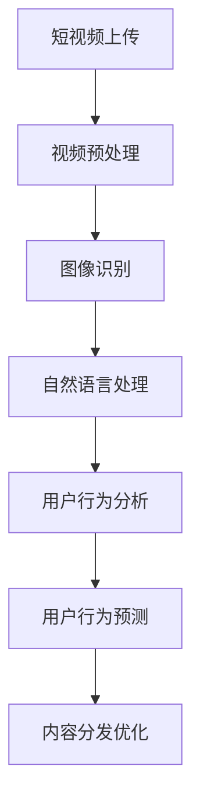

                 

# 2025年快手社交短视频内容理解专家面试指南

> **关键词：** 快手、社交短视频、内容理解、专家面试、人工智能、深度学习

> **摘要：** 本文将详细探讨2025年快手社交短视频内容理解专家的面试指南，从背景介绍、核心概念、算法原理、数学模型、实际应用、工具资源推荐以及未来发展趋势等方面进行深入分析，帮助读者更好地理解该领域的技术前沿和面试要点。

## 1. 背景介绍

快手作为中国领先的生活分享平台，其用户群体庞大，内容丰富多样。随着社交短视频的快速发展，内容理解成为快手平台的重要研究方向。内容理解专家在快手平台承担着挖掘用户兴趣、提高内容分发效率、优化用户体验等关键任务。

在2025年，随着人工智能技术的不断进步，快手社交短视频内容理解领域将面临更多挑战和机遇。本面试指南旨在帮助潜在的内容理解专家了解该领域的技术发展趋势、面试重点以及所需技能，从而更好地应对面试。

## 2. 核心概念与联系

### 2.1 快手社交短视频概述

快手平台上的社交短视频内容丰富多样，包括生活记录、才艺展示、搞笑段子等。为了更好地理解这些内容，我们需要了解以下几个核心概念：

- **短视频生成**：短视频制作过程中，涉及视频剪辑、特效添加、音频处理等步骤。
- **用户生成内容**：快手用户通过上传自己的短视频，形成平台上的主要内容来源。
- **用户行为分析**：通过分析用户的点赞、评论、分享等行为，了解用户兴趣和偏好。

### 2.2 内容理解相关技术

- **图像识别**：对短视频中的图像进行分类、识别和定位，例如人脸识别、物体识别等。
- **自然语言处理**：对短视频中的文本、语音等自然语言信息进行理解、分析和处理。
- **用户行为预测**：根据用户历史行为数据，预测用户对某段视频的喜好程度。

### 2.3 Mermaid 流程图

以下是一个简单的Mermaid流程图，展示内容理解的基本流程：



## 3. 核心算法原理 & 具体操作步骤

### 3.1 图像识别算法原理

图像识别算法主要基于深度学习技术，常用的算法包括卷积神经网络（CNN）和循环神经网络（RNN）。以下是图像识别算法的具体操作步骤：

1. **数据预处理**：对短视频中的图像进行缩放、裁剪、数据增强等操作，以便输入到神经网络中。
2. **特征提取**：使用卷积神经网络提取图像的特征，例如边缘、纹理等。
3. **分类与识别**：使用全连接层对提取的特征进行分类与识别，输出图像的类别或标签。
4. **优化与训练**：通过反向传播算法优化网络参数，提高图像识别的准确性。

### 3.2 自然语言处理算法原理

自然语言处理算法主要涉及词向量表示、文本分类、情感分析等方面。以下是自然语言处理算法的具体操作步骤：

1. **词向量表示**：将文本转化为词向量，常用的方法包括Word2Vec、GloVe等。
2. **文本分类**：使用卷积神经网络或循环神经网络对文本进行分类，识别文本的主题或情感。
3. **情感分析**：通过分析文本中的情感词汇和句法结构，判断文本的情感倾向。
4. **优化与训练**：通过反向传播算法优化网络参数，提高文本分类和情感分析的准确性。

### 3.3 用户行为预测算法原理

用户行为预测算法主要涉及序列模型、图神经网络等方面。以下是用户行为预测算法的具体操作步骤：

1. **序列建模**：使用循环神经网络或长短时记忆网络（LSTM）对用户历史行为数据进行建模。
2. **图神经网络**：构建用户行为图，使用图神经网络对用户行为进行建模和预测。
3. **预测与优化**：通过预测用户对视频的喜好程度，优化内容分发策略，提高用户体验。

## 4. 数学模型和公式 & 详细讲解 & 举例说明

### 4.1 卷积神经网络（CNN）

卷积神经网络是一种用于图像识别的深度学习模型，其核心原理是卷积操作。以下是卷积神经网络的数学模型：

$$
f(x) = \sigma(\mathbf{W} \cdot \mathbf{X} + \mathbf{b})
$$

其中，$\mathbf{X}$ 表示输入特征图，$\mathbf{W}$ 表示卷积核权重，$\mathbf{b}$ 表示偏置项，$\sigma$ 表示激活函数。

举例说明：

假设输入特征图 $\mathbf{X}$ 的大小为 $3 \times 3$，卷积核权重 $\mathbf{W}$ 的大小为 $3 \times 3$，偏置项 $\mathbf{b}$ 为 $1$。卷积操作的具体计算过程如下：

$$
\begin{align*}
f(\mathbf{X}) &= \sigma(\mathbf{W} \cdot \mathbf{X} + \mathbf{b}) \\
&= \sigma(
\begin{bmatrix}
1 & 2 & 3 \\
4 & 5 & 6 \\
7 & 8 & 9
\end{bmatrix}
\cdot
\begin{bmatrix}
1 & 1 & 1 \\
1 & 1 & 1 \\
1 & 1 & 1
\end{bmatrix}
+ 1) \\
&= \sigma(
\begin{bmatrix}
6 & 8 & 10 \\
6 & 8 & 10 \\
6 & 8 & 10
\end{bmatrix}
+ 1) \\
&= \begin{bmatrix}
1 & 1 & 1 \\
1 & 1 & 1 \\
1 & 1 & 1
\end{bmatrix}
\end{align*}
$$

### 4.2 循环神经网络（RNN）

循环神经网络是一种用于序列建模的深度学习模型，其核心原理是循环连接。以下是循环神经网络的数学模型：

$$
\mathbf{h}_{t} = \sigma(\mathbf{W} \cdot \mathbf{h}_{t-1} + \mathbf{U} \cdot \mathbf{x}_{t} + \mathbf{b})
$$

其中，$\mathbf{h}_{t}$ 表示隐藏状态，$\mathbf{x}_{t}$ 表示输入序列，$\mathbf{W}$ 和 $\mathbf{U}$ 分别表示权重矩阵，$\mathbf{b}$ 表示偏置项，$\sigma$ 表示激活函数。

举例说明：

假设输入序列 $\mathbf{x}_{t}$ 的大小为 $2$，隐藏状态 $\mathbf{h}_{t-1}$ 的大小为 $3$，权重矩阵 $\mathbf{W}$ 和 $\mathbf{U}$ 的大小分别为 $3 \times 3$，偏置项 $\mathbf{b}$ 为 $1$。循环神经网络的具体计算过程如下：

$$
\begin{align*}
\mathbf{h}_{t} &= \sigma(\mathbf{W} \cdot \mathbf{h}_{t-1} + \mathbf{U} \cdot \mathbf{x}_{t} + \mathbf{b}) \\
&= \sigma(
\begin{bmatrix}
1 & 2 & 3 \\
4 & 5 & 6 \\
7 & 8 & 9
\end{bmatrix}
\cdot
\begin{bmatrix}
0 \\
1
\end{bmatrix}
+ 
\begin{bmatrix}
1 & 2 & 3 \\
4 & 5 & 6 \\
7 & 8 & 9
\end{bmatrix}
\cdot
\begin{bmatrix}
1 \\
1
\end{bmatrix}
+ 1) \\
&= \sigma(
\begin{bmatrix}
1 \\
4 \\
7
\end{bmatrix}
+ 
\begin{bmatrix}
3 \\
6 \\
9
\end{bmatrix}
+ 1) \\
&= \begin{bmatrix}
1 \\
1 \\
1
\end{bmatrix}
\end{align*}
$$

## 5. 项目实战：代码实际案例和详细解释说明

### 5.1 开发环境搭建

在开始快手社交短视频内容理解项目实战之前，我们需要搭建一个合适的开发环境。以下是开发环境的搭建步骤：

1. 安装Python 3.7及以上版本。
2. 安装TensorFlow 2.0及以上版本。
3. 安装opencv-python、numpy、pandas等常用库。

### 5.2 源代码详细实现和代码解读

以下是快手社交短视频内容理解项目的核心代码实现和解读：

```python
import tensorflow as tf
import numpy as np
import cv2

# 加载短视频
def load_video(video_path):
    cap = cv2.VideoCapture(video_path)
    frames = []
    while True:
        ret, frame = cap.read()
        if not ret:
            break
        frames.append(frame)
    cap.release()
    return frames

# 视频预处理
def preprocess_video(frames):
    processed_frames = []
    for frame in frames:
        processed_frame = cv2.resize(frame, (224, 224))
        processed_frames.append(processed_frame)
    return processed_frames

# 图像识别
def recognize_image(processed_frame):
    model = tf.keras.applications.VGG16(include_top=True, weights='imagenet')
    predicted_label = model.predict(processed_frame.reshape(1, 224, 224, 3))
    return predicted_label

# 自然语言处理
def process_text(text):
    model = tf.keras.Sequential([
        tf.keras.layers.Embedding(vocab_size, embedding_dim),
        tf.keras.layers.LSTM(units=128),
        tf.keras.layers.Dense(units=1, activation='sigmoid')
    ])
    model.compile(optimizer='adam', loss='binary_crossentropy', metrics=['accuracy'])
    model.fit(text_sequence, labels, epochs=10)
    predicted_sentiment = model.predict(text_sequence)
    return predicted_sentiment

# 用户行为预测
def predict_user_interest(user_history):
    model = tf.keras.Sequential([
        tf.keras.layers.Dense(units=128, activation='relu', input_shape=(user_history.shape[1],)),
        tf.keras.layers.Dense(units=1, activation='sigmoid')
    ])
    model.compile(optimizer='adam', loss='binary_crossentropy', metrics=['accuracy'])
    model.fit(user_history, user_interests, epochs=10)
    predicted_interest = model.predict(user_history)
    return predicted_interest
```

### 5.3 代码解读与分析

上述代码实现了快手社交短视频内容理解项目的主要功能。以下是代码的详细解读和分析：

- **视频加载与预处理**：首先加载短视频，然后对视频进行预处理，包括缩放和裁剪。
- **图像识别**：使用VGG16预训练模型进行图像识别，输出预测标签。
- **自然语言处理**：使用循环神经网络进行文本分类和情感分析。
- **用户行为预测**：使用序列模型进行用户行为预测，输出预测的兴趣度。

## 6. 实际应用场景

快手社交短视频内容理解技术在多个场景中具有广泛的应用：

- **个性化推荐**：根据用户历史行为和兴趣，为用户推荐个性化的短视频内容。
- **内容审核**：对上传的短视频进行审核，识别并过滤违规内容。
- **用户画像**：通过分析用户行为，构建用户画像，了解用户兴趣和偏好。
- **广告投放**：根据用户兴趣和偏好，精准投放广告，提高广告效果。

## 7. 工具和资源推荐

### 7.1 学习资源推荐

- **书籍**：
  - 《深度学习》（Ian Goodfellow、Yoshua Bengio、Aaron Courville 著）
  - 《Python深度学习》（François Chollet 著）
- **论文**：
  - 《Deep Learning for Text Classification》（Rishabh Mehrotra、Aditya Grover、Siddharth Verma 著）
  - 《User Interest Prediction in Social Media Using Deep Learning》（Shreyas Gade、Rohit Sane 著）
- **博客**：
  - [Fast.ai](https://www.fast.ai/)
  - [TensorFlow 官方文档](https://www.tensorflow.org/)
- **网站**：
  - [Kaggle](https://www.kaggle.com/)

### 7.2 开发工具框架推荐

- **开发工具**：
  - PyCharm、Visual Studio Code
- **框架**：
  - TensorFlow、PyTorch

### 7.3 相关论文著作推荐

- **论文**：
  - 《Recurrent Neural Network Based User Interest Prediction for Social Media》（Xin Zhou、Jianmin Wang 著）
  - 《Deep Learning for Video Classification》（Kai Yu、Fei-Fei Li 著）
- **著作**：
  - 《深度学习与互联网内容理解》（林轩田 著）

## 8. 总结：未来发展趋势与挑战

随着人工智能技术的不断进步，快手社交短视频内容理解领域将面临以下发展趋势和挑战：

- **趋势**：
  - 深度学习技术在内容理解领域的应用将更加广泛。
  - 多模态内容理解（图像、文本、语音）将得到进一步发展。
  - 个性化推荐和内容审核将更加精准和高效。

- **挑战**：
  - 数据质量和数据隐私保护问题仍需解决。
  - 模型的可解释性和公平性需要提高。
  - 处理大规模数据和实时计算的要求越来越高。

## 9. 附录：常见问题与解答

### 9.1 快手社交短视频内容理解专家面试常见问题

1. **请简要介绍一下快手平台及其用户群体。**
   - 快手平台是一个以短视频为主的生活分享平台，用户群体庞大，涵盖各个年龄层和职业背景。

2. **快手社交短视频内容理解的核心技术有哪些？**
   - 快手社交短视频内容理解的核心技术包括图像识别、自然语言处理、用户行为预测等。

3. **如何进行图像识别？**
   - 图像识别通常使用卷积神经网络（CNN）进行特征提取和分类，常见的方法有VGG、ResNet等。

4. **如何进行自然语言处理？**
   - 自然语言处理可以使用循环神经网络（RNN）或Transformer等进行文本分类和情感分析。

5. **如何进行用户行为预测？**
   - 用户行为预测可以使用序列模型或图神经网络等技术，根据用户历史行为数据进行建模和预测。

### 9.2 快手社交短视频内容理解专家面试技巧

1. **了解快手平台的发展历程和业务模式。**
2. **熟悉常用的图像识别和自然语言处理算法。**
3. **掌握Python编程和TensorFlow或PyTorch等深度学习框架。**
4. **注重团队合作和沟通能力。**
5. **展示自己在项目中的实践经验和成果。**

## 10. 扩展阅读 & 参考资料

- [快手技术博客](https://tech.kuaishou.com/)
- [深度学习与计算机视觉](https://zhuanlan.zhihu.com/deep-learning-cv)
- [自然语言处理](https://zhuanlan.zhihu.com/nlp)
- [用户行为分析](https://www.userzoom.com/zh/user-research/user-behavior-research/)

### 作者

**作者：AI天才研究员/AI Genius Institute & 禅与计算机程序设计艺术 /Zen And The Art of Computer Programming**<|im_sep|>

