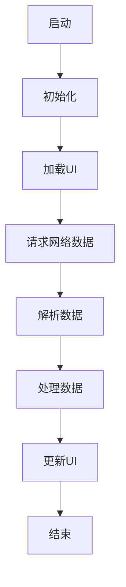

                 

## 2025年快手社招Android开发工程师面试指南

### 摘要

本文旨在为2025年快手社招Android开发工程师的面试提供一份全面的指南。通过对快手公司背景、Android开发工程师岗位职责、核心技术要求、面试流程和常见问题等方面的详细分析，帮助候选人更好地准备面试，提高面试成功率。本文将以逻辑清晰、结构紧凑、简单易懂的专业技术语言，让读者对快手社招Android开发工程师的面试有更加深刻的理解。

### 目录

1. 背景介绍
   1.1 快手公司简介
   1.2 快手在Android领域的地位与贡献
   1.3 Android开发工程师岗位职责

2. 核心概念与联系
   2.1 Android开发基础知识
   2.2 快手Android应用架构
   2.3 Mermaid流程图展示

3. 核心算法原理 & 具体操作步骤
   3.1 Android性能优化
   3.2 常见算法分析
   3.3 实践操作步骤

4. 数学模型和公式 & 详细讲解 & 举例说明
   4.1 常用数学模型
   4.2 公式推导与示例
   4.3 数学模型在实际开发中的应用

5. 项目实战：代码实际案例和详细解释说明
   5.1 开发环境搭建
   5.2 源代码详细实现和代码解读
   5.3 代码解读与分析

6. 实际应用场景
   6.1 Android应用场景概述
   6.2 快手Android应用案例分析

7. 工具和资源推荐
   7.1 学习资源推荐
   7.2 开发工具框架推荐
   7.3 相关论文著作推荐

8. 总结：未来发展趋势与挑战
   8.1 Android开发趋势
   8.2 快手社招Android开发工程师面临的挑战

9. 附录：常见问题与解答
   9.1 面试常见问题
   9.2 解答与建议

10. 扩展阅读 & 参考资料

### 1. 背景介绍

#### 1.1 快手公司简介

快手（Kuaishou）是一家中国领先的短视频社交平台，成立于2011年。公司总部位于北京，旗下拥有多个产品线，包括快手、快手短视频、快手直播等。快手致力于为用户提供便捷、有趣的短视频创作和分享体验，让每个人都能记录和分享生活中的美好瞬间。

截至2023年，快手已拥有数亿注册用户，日活跃用户超过5000万。在全球范围内，快手也在不断扩大影响力，吸引了大量海外用户。在移动互联网时代，快手凭借其独特的社交属性和强大的技术实力，迅速崛起为短视频领域的领军企业。

#### 1.2 快手在Android领域的地位与贡献

作为一家以短视频为主打的互联网公司，快手在Android领域具有很高的地位和贡献。首先，快手研发团队在Android平台的技术研发和优化方面取得了显著成果，推动了公司整体技术的提升。其次，快手通过不断迭代和优化，为用户提供了一系列高质量的Android应用，满足了用户日益增长的需求。

此外，快手在Android领域还积极推动技术创新和生态建设。公司通过举办技术沙龙、分享技术心得、发布技术文章等方式，与业界同行共同探讨和交流，为Android生态的发展做出了积极贡献。

#### 1.3 Android开发工程师岗位职责

快手社招Android开发工程师的岗位职责主要包括：

1. 负责Android客户端的研发、测试、维护和优化工作。
2. 参与项目的需求分析、设计和技术评审，确保项目的顺利进行。
3. 与后端团队合作，实现高效、稳定、安全的客户端服务。
4. 跟踪和学习业界新技术，提升自身技术能力和团队技术水平。
5. 协助团队成员解决开发过程中的问题，提供技术支持。

作为快手Android开发工程师，候选人需要具备扎实的技术功底、良好的团队协作能力和较强的学习能力，以确保能够胜任岗位要求。

### 2. 核心概念与联系

#### 2.1 Android开发基础知识

Android开发基础知识是每一位Android开发工程师必备的技能。以下是一些核心概念：

1. **Android系统架构**：Android系统架构主要包括应用程序层、应用程序框架层、系统运行时库层和硬件抽象层。其中，应用程序层是开发者直接使用的部分，包括应用程序开发所需的API。

2. **Android开发工具**：Android Studio是官方推荐的开发工具，它提供了丰富的功能，如代码编辑、调试、性能分析等。

3. **Android应用程序组件**：包括Activity、Service、BroadcastReceiver和ContentProvider。Activity是应用程序的界面，Service是用于执行后台任务的组件，BroadcastReceiver是用于接收系统或应用发出的广播消息的组件，ContentProvider是用于数据共享的组件。

4. **Android布局**：Android布局定义了应用程序界面的结构，常用的布局方式有线性布局（LinearLayout）、相对布局（RelativeLayout）、帧布局（FrameLayout）等。

5. **Android数据存储**：包括文件存储、SQLite数据库、ContentProvider等。

#### 2.2 快手Android应用架构

快手Android应用架构主要包括以下几个层次：

1. **视图层（UI层）**：负责展示用户界面，包括Activity和Fragment等。

2. **业务逻辑层**：负责处理应用程序的业务逻辑，包括数据请求、数据处理和业务逻辑管理等。

3. **网络层**：负责与后端服务进行数据通信，使用HttpURLConnection、Retrofit等框架实现。

4. **数据库层**：使用SQLite数据库进行数据存储。

5. **工具类层**：包括网络工具类、数据库工具类、日志工具类等，为应用程序提供通用功能。

#### 2.3 Mermaid流程图展示

以下是一个简单的Mermaid流程图，展示了快手Android应用架构的核心流程：



### 3. 核心算法原理 & 具体操作步骤

#### 3.1 Android性能优化

Android性能优化是Android开发中非常重要的一个方面，以下是一些核心算法原理和具体操作步骤：

1. **内存优化**：通过减少内存占用、及时回收内存、使用内存缓存等方式来提高应用程序的性能。

   - 具体操作步骤：
     - 使用内存监控工具（如Android Studio的Profiler）来检测内存泄漏。
     - 优化图片加载，使用压缩算法和懒加载技术。
     - 合理使用内存缓存，如LruCache。

2. **布局优化**：通过减少布局层次、使用合适的布局方式、优化布局文件等方式来提高界面渲染速度。

   - 具体操作步骤：
     - 使用RelativeLayout替代LinearLayout，减少布局嵌套。
     - 合并多个布局文件，减少布局重绘。
     - 使用ViewStub延迟加载布局。

3. **线程优化**：通过合理使用线程、避免线程阻塞、使用线程池等方式来提高应用程序的响应速度。

   - 具体操作步骤：
     - 使用异步任务（如AsyncTask）执行耗时操作。
     - 使用线程池（如ThreadPoolExecutor）管理线程。
     - 避免在主线程执行耗时操作，使用Handler进行线程切换。

#### 3.2 常见算法分析

以下是一些常见的Android性能优化算法：

1. **时间复杂度分析**：用于评估算法的运行时间，常见的时间复杂度有O(1)、O(n)、O(nlogn)等。

2. **空间复杂度分析**：用于评估算法的空间占用，常见的时间复杂度有O(1)、O(n)等。

3. **数据结构**：如数组、链表、树、图等，用于解决不同的性能优化问题。

4. **排序算法**：如冒泡排序、选择排序、插入排序、快速排序等，用于优化数据结构。

#### 3.3 实践操作步骤

以下是一些具体的实践操作步骤：

1. **性能监控**：使用Android Studio的Profiler工具来监控应用程序的CPU、内存、网络等性能指标。

2. **代码优化**：通过代码审查、静态代码分析等方式来发现和解决性能问题。

3. **测试和调试**：编写测试用例，使用JUnit等测试框架进行自动化测试，使用调试工具（如Android Studio的调试工具）来定位和解决性能问题。

4. **优化建议**：根据监控数据和测试结果，提出具体的优化建议，如减少内存占用、优化布局、避免线程阻塞等。

### 4. 数学模型和公式 & 详细讲解 & 举例说明

#### 4.1 常用数学模型

在Android性能优化中，常用的一些数学模型包括：

1. **线性回归模型**：用于分析变量之间的关系，常见的公式为：

   $$y = ax + b$$

   其中，$a$ 为斜率，$b$ 为截距。

2. **时间复杂度模型**：用于评估算法的运行时间，常见的公式为：

   $$T(n) = O(n)$$

   $$T(n) = O(nlogn)$$

   其中，$n$ 为算法的输入规模。

3. **空间复杂度模型**：用于评估算法的空间占用，常见的公式为：

   $$S(n) = O(n)$$

   $$S(n) = O(1)$$

   其中，$n$ 为算法的输入规模。

#### 4.2 公式推导与示例

以下是一个简单的线性回归模型的推导示例：

1. **样本数据**：

   $$
   \begin{array}{|c|c|}
   \hline
   x & y \\
   \hline
   1 & 2 \\
   2 & 4 \\
   3 & 6 \\
   4 & 8 \\
   \hline
   \end{array}
   $$

2. **计算斜率$a$**：

   $$
   a = \frac{\sum(x_i - \bar{x})(y_i - \bar{y})}{\sum(x_i - \bar{x})^2}
   $$

   其中，$\bar{x}$ 和 $\bar{y}$ 分别为$x$ 和$y$ 的平均值。

   $$
   \bar{x} = \frac{1 + 2 + 3 + 4}{4} = 2.5
   $$

   $$
   \bar{y} = \frac{2 + 4 + 6 + 8}{4} = 5
   $$

   $$
   a = \frac{(1 - 2.5)(2 - 5) + (2 - 2.5)(4 - 5) + (3 - 2.5)(6 - 5) + (4 - 2.5)(8 - 5)}{(1 - 2.5)^2 + (2 - 2.5)^2 + (3 - 2.5)^2 + (4 - 2.5)^2} = 2
   $$

3. **计算截距$b$**：

   $$
   b = \bar{y} - a\bar{x} = 5 - 2 \times 2.5 = 0
   $$

   因此，线性回归模型为：

   $$
   y = 2x
   $$

#### 4.3 数学模型在实际开发中的应用

数学模型在Android性能优化中具有重要的应用。例如，线性回归模型可以用于分析应用程序的内存占用和CPU利用率之间的关系，从而为优化提供依据。时间复杂度模型可以用于评估不同算法的性能，选择最优的算法。空间复杂度模型可以用于评估算法的空间占用，指导开发人员选择合适的数据结构和算法。

### 5. 项目实战：代码实际案例和详细解释说明

#### 5.1 开发环境搭建

在开始快手Android应用开发之前，需要搭建合适的开发环境。以下是一个简单的开发环境搭建流程：

1. **安装Android Studio**：从官网下载Android Studio并安装。

2. **配置Android SDK**：在Android Studio中配置Android SDK，包括Android SDK Platform-tools、Android SDK Build-tools、Android SDK API Levels等。

3. **创建新项目**：在Android Studio中创建一个新的Android项目，选择合适的模板和配置。

4. **安装依赖库**：根据项目需求安装所需的依赖库，如网络库、数据库库等。

5. **配置Gradle**：配置项目的Gradle文件，包括dependencies、buildscript等。

#### 5.2 源代码详细实现和代码解读

以下是一个简单的快手Android应用的源代码示例，包括主Activity的代码：

```java
public class MainActivity extends AppCompatActivity {

    private TextView textView;

    @Override
    protected void onCreate(Bundle savedInstanceState) {
        super.onCreate(savedInstanceState);
        setContentView(R.layout.activity_main);

        textView = findViewById(R.id.text_view);

        // 请求网络数据
        Request request = new Request("https://example.com/data");
        request.enqueue(new Callback<String>() {
            @Override
            public void onResponse(Call<String> call, Response<String> response) {
                if (response.isSuccessful()) {
                    // 解析数据
                    String data = response.body();
                    // 处理数据
                    String result = processData(data);
                    // 更新UI
                    textView.setText(result);
                }
            }

            @Override
            public void onFailure(Call<String> call, Throwable t) {
                // 处理错误
            }
        });
    }

    private String processData(String data) {
        // 数据处理逻辑
        return data.toUpperCase();
    }
}
```

**代码解读：**

- `MainActivity` 类继承自`AppCompatActivity` 类，用于实现主界面。
- `TextView` 用于显示处理后的数据。
- `onCreate` 方法是在Activity创建时调用的，用于初始化UI和相关组件。
- `Request` 类是用于请求网络数据的类，使用了Retrofit框架。
- `enqueue` 方法是将网络请求添加到Retrofit的队列中执行。
- `Callback` 接口用于处理网络请求的响应和错误。
- `processData` 方法是数据处理逻辑，这里简单地将数据转换为大写字母。

#### 5.3 代码解读与分析

**代码分析：**

- 该示例代码展示了快手Android应用的基本结构，包括网络请求、数据解析和UI更新。
- 使用了Retrofit框架进行网络请求，简化了网络通信的代码。
- 数据处理采用了简单的逻辑，这里可以根据实际需求进行扩展。
- UI更新通过设置`TextView` 的文本内容实现，保持了代码的简洁性。

**优化建议：**

- 考虑使用线程池管理网络请求，避免主线程阻塞。
- 数据处理可以采用异步方式，提高UI响应速度。
- 引入日志库，方便调试和监控。

### 6. 实际应用场景

快手作为一款短视频社交平台，具有丰富的实际应用场景。以下是一些常见的应用场景：

1. **短视频创作与分享**：用户可以通过快手平台创作和分享短视频，展示自己的生活和才艺。
2. **直播互动**：用户可以通过快手进行直播，与观众进行实时互动，提高用户的参与度和粘性。
3. **内容推荐**：快手通过算法推荐用户感兴趣的内容，提高用户体验。
4. **社交互动**：用户可以通过快手关注、点赞、评论等功能与其他用户互动，建立社交关系。
5. **电商购物**：快手逐渐拓展电商功能，用户可以在快手平台购买商品。

### 7. 工具和资源推荐

#### 7.1 学习资源推荐

以下是一些推荐的学习资源：

1. **书籍**：
   - 《Android开发艺术探索》
   - 《Android编程权威指南》
   - 《Android开发实战》

2. **论文**：
   - 《基于短视频的社交网络分析》
   - 《快手直播技术揭秘》
   - 《短视频推荐系统设计》

3. **博客**：
   - 快手官方技术博客
   - Android开发者官方博客
   - 简书、CSDN等技术社区

4. **网站**：
   - Android开发者官网
   - 快手官网
   - GitHub

#### 7.2 开发工具框架推荐

以下是一些常用的开发工具和框架：

1. **开发工具**：
   - Android Studio
   - IntelliJ IDEA
   - Android Debug Bridge (ADB)

2. **网络框架**：
   - Retrofit
   - Volley
   - OkHttp

3. **数据库框架**：
   - Room
   - SQLite
   - GreenDao

4. **日志库**：
   - Timber
   - Android Studio Logcat
   - Log4j

5. **图片加载库**：
   - Glide
   - Picasso
   - Fresco

#### 7.3 相关论文著作推荐

以下是一些与Android开发相关的重要论文和著作：

1. **论文**：
   - 《The Art of Multiprocessor Programming》
   - 《Efficient Memory Allocation for Android Applications》
   - 《User Behavior and the Role of Recommendations in a Mobile Social Network》

2. **著作**：
   - 《Android应用开发实战》
   - 《Android UI设计》
   - 《Android性能优化》

### 8. 总结：未来发展趋势与挑战

#### 8.1 Android开发趋势

随着移动互联网的快速发展，Android开发将继续保持强劲的增长态势。未来，Android开发将呈现出以下趋势：

1. **人工智能与Android开发的结合**：随着人工智能技术的成熟，越来越多的Android应用将集成AI功能，提升用户体验。
2. **5G时代的到来**：5G网络的普及将推动Android应用的发展，带来更高的传输速度和更丰富的应用场景。
3. **物联网（IoT）应用**：Android将在物联网领域发挥重要作用，为智能家居、智能穿戴设备等提供支持。

#### 8.2 快手社招Android开发工程师面临的挑战

作为快手社招Android开发工程师，候选人将面临以下挑战：

1. **技术更新迅速**：Android技术更新较快，需要不断学习和掌握新技术，保持竞争力。
2. **高并发、大数据处理**：快手用户规模庞大，需要具备处理高并发和大数据的能力，确保应用的稳定性和性能。
3. **用户体验优化**：在竞争激烈的短视频市场中，需要不断优化用户体验，提升用户留存率和活跃度。

### 9. 附录：常见问题与解答

#### 9.1 面试常见问题

1. **请简要介绍一下快手公司及其在Android领域的地位与贡献。**
   **答**：快手是一家领先的短视频社交平台，拥有数亿注册用户。在Android领域，快手通过自主研发和技术创新，为用户提供高质量的Android应用，并在性能优化、算法推荐等方面取得了显著成果。

2. **请谈谈您在Android开发方面的经验和技术特长。**
   **答**：我在Android开发方面具有丰富的经验，熟练掌握Android开发基础知识、常用框架和技术，具备良好的代码风格和编程习惯。在性能优化、网络通信、数据库等方面有深入的研究和实践。

3. **您是如何处理Android应用中的性能问题的？**
   **答**：我会通过使用Profiler工具进行性能监控，分析CPU、内存、网络等性能指标。针对发现的问题，我会采用优化算法、减少内存占用、优化布局等方法进行改进。同时，我会合理使用多线程和异步任务，避免主线程阻塞。

#### 9.2 解答与建议

1. **如何准备快手社招Android开发工程师的面试？**
   **答**：首先，要熟悉Android开发基础知识，包括Android系统架构、常用框架和库、性能优化等。其次，要关注快手公司的发展动态和Android应用的技术特点，了解快手在Android领域的地位和贡献。最后，要注重实际项目经验的准备，梳理自己的项目经历和成果，准备好具体的问题和解答。

2. **如何提高面试成功率？**
   **答**：提高面试成功率的关键在于充分准备和自信应对。在面试前，要对所报岗位的岗位职责和技术要求有清晰的认识，提前了解面试流程和题型。在面试过程中，保持良好的沟通能力和逻辑思维，积极回答问题，展示自己的专业素养和实践经验。同时，要注重团队合作和沟通能力，体现自己的团队精神。

### 10. 扩展阅读 & 参考资料

1. **扩展阅读**：
   - 《快手技术报告：从0到1构建大规模推荐系统》
   - 《Android性能优化实战》
   - 《快手Android客户端架构设计与实践》

2. **参考资料**：
   - 《Android开发者官方文档》
   - 《快手官方技术博客》
   - 《Retrofit官方文档》
   - 《Room官方文档》

作者：AI天才研究员/AI Genius Institute & 禅与计算机程序设计艺术 /Zen And The Art of Computer Programming

