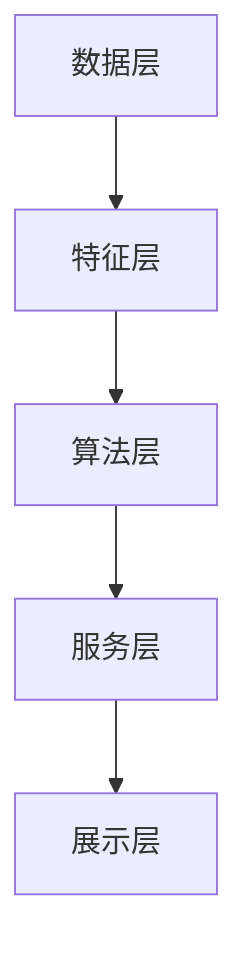

                 

### 1. 背景介绍

#### 携程社招旅游推荐系统工程师面试的重要性

携程作为中国领先的在线旅游服务平台，其旅游推荐系统工程师的社招面试显得尤为重要。旅游推荐系统作为携程的核心组成部分，不仅直接关系到用户的旅行体验，还影响着携程的营收和市场份额。因此，对于旅游推荐系统工程师的招聘，携程非常重视，面试过程也相对严格和复杂。

首先，旅游推荐系统工程师需要具备扎实的技术背景，包括但不限于计算机科学、数据挖掘、机器学习等领域。他们需要熟练掌握各种算法，能够运用这些算法解决实际业务问题。

其次，旅游推荐系统工程师还需要有较强的逻辑思维能力和问题解决能力。在面试过程中，面试官通常会通过一些案例或实际问题，考察应聘者是否能灵活运用所学知识，提出有效的解决方案。

此外，旅游推荐系统工程师还需要有良好的团队合作能力和沟通能力。因为推荐系统通常是一个复杂的工程项目，需要团队成员之间的紧密协作。

最后，旅游推荐系统工程师还需要关注行业动态，不断学习新技术、新方法，以适应快速变化的市场环境。

#### 2025年携程旅游推荐系统的发展趋势

展望2025年，携程的旅游推荐系统将面临诸多挑战和机遇。首先，随着人工智能技术的不断发展，携程有望引入更多先进的技术，如深度学习、自然语言处理等，以提高推荐系统的准确性和用户体验。

其次，随着物联网和5G技术的普及，携程的旅游推荐系统将能够更加精准地收集和分析用户数据，从而提供更个性化的推荐服务。

此外，随着旅游业市场的竞争加剧，携程需要不断优化其推荐系统，提高用户满意度和留存率。因此，对于旅游推荐系统工程师来说，掌握最新的技术和方法，持续提升自身的专业素养，将是未来的发展方向。

#### 本文结构

本文将围绕携程旅游推荐系统工程师的面试，详细探讨以下几个方面的内容：

1. **核心概念与联系**：介绍旅游推荐系统的基本概念，包括推荐系统的发展历程、分类、工作原理等，并通过Mermaid流程图展示其架构。
2. **核心算法原理 & 具体操作步骤**：详细讲解常用的推荐算法，如协同过滤、基于内容的推荐等，以及如何在实际项目中应用这些算法。
3. **数学模型和公式 & 详细讲解 & 举例说明**：介绍推荐系统中常用的数学模型和公式，并通过实际案例进行讲解。
4. **项目实战：代码实际案例和详细解释说明**：通过实际项目案例，展示如何搭建旅游推荐系统，并解读相关代码。
5. **实际应用场景**：探讨旅游推荐系统在不同场景下的应用，如酒店推荐、景点推荐等。
6. **工具和资源推荐**：推荐一些学习资源、开发工具和框架，帮助读者深入了解旅游推荐系统。
7. **总结：未来发展趋势与挑战**：总结本文内容，探讨旅游推荐系统的发展趋势和面临的挑战。

通过本文的阅读，读者将能够全面了解携程旅游推荐系统的面试要点，掌握推荐系统的基本原理和实战技巧，为未来的职业发展奠定坚实的基础。

### 2. 核心概念与联系

#### 推荐系统的发展历程

推荐系统（Recommender System）是信息检索和知识发现领域的一个重要研究方向。其发展历程大致可以分为以下几个阶段：

1. **基于内容的推荐（Content-Based Filtering）**：早期的推荐系统主要是基于内容的推荐，通过分析用户的历史行为和兴趣，提取用户特征，然后根据这些特征为用户推荐相似的内容。这种方法的优点是实现简单，但缺点是推荐结果往往过于依赖用户的显式反馈，容易产生“信息过载”问题。

2. **协同过滤（Collaborative Filtering）**：随着互联网的普及，用户生成的内容（如评分、评论等）大量涌现，基于协同过滤的推荐系统应运而生。协同过滤分为两种主要类型：用户基于的协同过滤（User-Based）和基于物品的协同过滤（Item-Based）。用户基于的协同过滤通过计算用户之间的相似度，为用户推荐相似的物品；而基于物品的协同过滤则是通过计算物品之间的相似度，为用户推荐与用户已喜欢的物品相似的物品。协同过滤的优点是能够利用用户之间的隐式反馈，提高推荐效果，但缺点是数据稀疏性和冷启动问题。

3. **混合推荐（Hybrid Recommender Systems）**：为了克服单一推荐方法的局限性，研究者开始探索混合推荐系统。混合推荐系统结合了多种推荐方法，如基于内容的推荐和协同过滤，以实现更好的推荐效果。此外，一些先进的推荐方法，如基于模型的推荐、基于社交网络的推荐等，也在不断涌现。

#### 推荐系统的分类

推荐系统可以根据不同的分类标准进行分类。以下是几种常见的分类方法：

1. **根据推荐方法**：

   - **基于内容的推荐**：通过分析内容特征进行推荐。
   - **协同过滤**：通过计算用户或物品之间的相似度进行推荐。
   - **基于模型的推荐**：利用机器学习模型进行推荐。
   - **基于规则的推荐**：通过预定义的规则进行推荐。

2. **根据数据类型**：

   - **基于用户数据的推荐**：利用用户的历史行为、偏好等进行推荐。
   - **基于物品数据的推荐**：利用物品的属性、标签等进行推荐。
   - **混合推荐**：结合用户和物品数据，利用多源数据进行推荐。

3. **根据用户反馈**：

   - **基于用户的反馈**：利用用户的显式反馈（如评分、评论等）进行推荐。
   - **基于物品的反馈**：利用物品的属性、标签等隐式反馈进行推荐。

#### 推荐系统的工作原理

推荐系统的工作原理可以分为以下几个步骤：

1. **数据采集**：从各种来源（如用户行为数据、物品属性数据等）收集数据。

2. **数据预处理**：对收集到的数据进行清洗、去重、格式转换等处理，以便后续分析。

3. **特征提取**：从预处理后的数据中提取特征，如用户特征、物品特征等。

4. **模型训练**：利用提取的特征，通过机器学习算法训练推荐模型。

5. **模型评估**：通过交叉验证、A/B测试等方法评估模型的性能。

6. **推荐生成**：利用训练好的模型为用户生成推荐结果。

7. **推荐反馈**：收集用户的反馈（如点击、购买等），用于模型优化和更新。

#### 推荐系统的架构

一个典型的推荐系统架构可以分为以下几个部分：

1. **数据层**：负责存储和管理推荐系统的数据，包括用户数据、物品数据、历史行为数据等。

2. **特征层**：负责提取和转换数据，生成特征向量。

3. **算法层**：负责实现各种推荐算法，如协同过滤、基于内容的推荐等。

4. **服务层**：负责处理用户请求，生成推荐结果，并将其呈现给用户。

5. **展示层**：负责将推荐结果以直观的方式展示给用户。

下面是推荐系统架构的Mermaid流程图：



通过上述的介绍，我们可以了解到推荐系统的发展历程、分类、工作原理和架构。接下来，我们将详细探讨推荐系统的核心算法原理和具体操作步骤。

### 3. 核心算法原理 & 具体操作步骤

#### 3.1 协同过滤算法

协同过滤（Collaborative Filtering）是推荐系统中最常用的算法之一，其基本思想是通过计算用户之间的相似度或物品之间的相似度，为用户推荐相似的物品。协同过滤可以分为基于用户的协同过滤（User-Based）和基于物品的协同过滤（Item-Based）。

##### 3.1.1 基于用户的协同过滤

基于用户的协同过滤通过计算用户之间的相似度，找到与目标用户相似的邻居用户，然后根据邻居用户的喜好推荐物品。具体步骤如下：

1. **计算用户相似度**：选择合适的相似度度量方法（如余弦相似度、皮尔逊相关系数等）计算用户之间的相似度。相似度度量方法的选择取决于数据的特点和业务需求。

   $$相似度（User\_i, User\_j）= \frac{共同评分的物品数}{User\_i的总评分数 + User\_j的总评分数 - 共同评分的物品数}$$

2. **找到邻居用户**：根据相似度度量结果，选择与目标用户相似度最高的若干邻居用户。

3. **生成推荐列表**：对于目标用户未评分的物品，计算与邻居用户共同评分的物品的评分平均值，将平均值最高的物品推荐给目标用户。

##### 3.1.2 基于物品的协同过滤

基于物品的协同过滤通过计算物品之间的相似度，找到与目标物品相似的邻居物品，然后根据邻居物品的评分推荐给用户。具体步骤如下：

1. **计算物品相似度**：选择合适的相似度度量方法（如余弦相似度、余弦相似度等）计算物品之间的相似度。

   $$相似度（Item\_i, Item\_j）= \frac{共同评分的用户数}{Item\_i的总评分数 + Item\_j的总评分数 - 共同评分的用户数}$$

2. **找到邻居物品**：根据相似度度量结果，选择与目标物品相似度最高的若干邻居物品。

3. **生成推荐列表**：对于目标用户未评分的物品，计算与邻居物品共同评分的用户评分平均值，将平均值最高的物品推荐给目标用户。

#### 3.2 基于内容的推荐

基于内容的推荐（Content-Based Filtering）通过分析物品的内容特征，为用户推荐与用户已喜欢物品内容相似的物品。具体步骤如下：

1. **提取物品特征**：从物品的属性、标签、文本描述等中提取特征，构建物品特征向量。

2. **计算用户兴趣**：根据用户的历史行为，如已评分的物品、浏览记录等，提取用户的兴趣特征，构建用户兴趣向量。

3. **计算内容相似度**：选择合适的内容相似度度量方法（如余弦相似度、欧氏距离等）计算物品特征向量和用户兴趣向量之间的相似度。

4. **生成推荐列表**：对于目标用户未评分的物品，计算与用户兴趣特征相似的物品的相似度平均值，将平均值最高的物品推荐给目标用户。

#### 3.3 混合推荐系统

混合推荐系统（Hybrid Recommender Systems）结合了多种推荐方法，如协同过滤和基于内容的推荐，以实现更好的推荐效果。具体步骤如下：

1. **数据预处理**：对用户和物品的数据进行预处理，提取用户特征和物品特征。

2. **算法选择**：根据业务需求和数据特点，选择合适的推荐算法。例如，可以同时使用基于用户的协同过滤和基于物品的协同过滤。

3. **模型训练**：利用预处理后的数据，通过机器学习算法训练推荐模型。

4. **模型融合**：将多个推荐模型的预测结果进行融合，生成最终的推荐结果。

5. **推荐生成**：利用融合后的模型为用户生成推荐列表。

通过以上步骤，我们可以搭建一个基本的推荐系统。在实际应用中，还需要根据业务需求和数据特点进行模型优化和参数调整，以提高推荐效果。接下来，我们将介绍推荐系统中常用的数学模型和公式，并详细讲解其在实际项目中的应用。

### 4. 数学模型和公式 & 详细讲解 & 举例说明

#### 4.1 协同过滤算法的数学模型

协同过滤算法的核心在于计算用户之间的相似度和物品之间的相似度。以下是两种常见相似度计算方法的数学模型。

##### 4.1.1 用户相似度

用户相似度通常使用余弦相似度或皮尔逊相关系数来计算。以余弦相似度为例，其数学模型如下：

$$
相似度（User\_i, User\_j） = \frac{dotProduct(User\_i, User\_j)}{||User\_i|| * ||User\_j||}
$$

其中，\(dotProduct(User\_i, User\_j)\) 表示用户 \(i\) 和用户 \(j\) 的评分向量点积，\(||User\_i||\) 和 \(||User\_j||\) 分别表示用户 \(i\) 和用户 \(j\) 的评分向量模长。

##### 4.1.2 物品相似度

物品相似度同样可以使用余弦相似度或欧氏距离来计算。以余弦相似度为例，其数学模型如下：

$$
相似度（Item\_i, Item\_j） = \frac{dotProduct(Item\_i, Item\_j)}{||Item\_i|| * ||Item\_j||}
$$

其中，\(dotProduct(Item\_i, Item\_j)\) 表示物品 \(i\) 和物品 \(j\) 的特征向量点积，\(||Item\_i||\) 和 \(||Item\_j||\) 分别表示物品 \(i\) 和物品 \(j\) 的特征向量模长。

#### 4.2 基于内容的推荐算法的数学模型

基于内容的推荐算法的核心在于计算物品的内容相似度和用户的兴趣相似度。以下是两种常见相似度计算方法的数学模型。

##### 4.2.1 内容相似度

内容相似度通常使用余弦相似度或欧氏距离来计算。以余弦相似度为例，其数学模型如下：

$$
相似度（Content\_i, Content\_j） = \frac{dotProduct(Content\_i, Content\_j)}{||Content\_i|| * ||Content\_j||}
$$

其中，\(dotProduct(Content\_i, Content\_j)\) 表示物品 \(i\) 和物品 \(j\) 的特征向量点积，\(||Content\_i||\) 和 \(||Content\_j||\) 分别表示物品 \(i\) 和物品 \(j\) 的特征向量模长。

##### 4.2.2 用户兴趣相似度

用户兴趣相似度可以使用用户的历史行为特征向量来计算。以余弦相似度为例，其数学模型如下：

$$
相似度（User\_i, User\_j） = \frac{dotProduct(User\_i, User\_j)}{||User\_i|| * ||User\_j||}
$$

其中，\(dotProduct(User\_i, User\_j)\) 表示用户 \(i\) 和用户 \(j\) 的行为特征向量点积，\(||User\_i||\) 和 \(||User\_j||\) 分别表示用户 \(i\) 和用户 \(j\) 的行为特征向量模长。

#### 4.3 混合推荐系统的数学模型

混合推荐系统结合了协同过滤和基于内容的推荐算法，其数学模型可以表示为：

$$
推荐分数（Item\_i, User\_j） = w_{CF} \times 相似度（User\_i, User\_j） + w_{Content} \times 相似度（Content\_i, Content\_j}
$$

其中，\(w_{CF}\) 和 \(w_{Content}\) 分别表示协同过滤和基于内容推荐算法的权重，\(相似度（User\_i, User\_j）\) 和 \(相似度（Content\_i, Content\_j）\) 分别表示用户相似度和内容相似度。

#### 4.4 举例说明

假设我们有两个用户 \(User\_i\) 和 \(User\_j\)，以及两个物品 \(Item\_i\) 和 \(Item\_j\)。他们的评分数据如下：

| 用户 | 物品 | 评分 |
|------|------|------|
| \(User\_i\) | \(Item\_i\) | 5 |
| \(User\_i\) | \(Item\_j\) | 3 |
| \(User\_j\) | \(Item\_i\) | 4 |
| \(User\_j\) | \(Item\_j\) | 5 |

首先，我们计算用户之间的相似度。假设我们使用余弦相似度，则有：

$$
相似度（User\_i, User\_j） = \frac{(5 \times 4 + 3 \times 5)}{\sqrt{5^2 + 3^2} \times \sqrt{4^2 + 5^2}} = \frac{23}{\sqrt{34} \times \sqrt{41}} \approx 0.6
$$

接着，我们计算物品之间的相似度：

$$
相似度（Item\_i, Item\_j） = \frac{(5 \times 4 + 3 \times 5)}{\sqrt{5^2 + 3^2} \times \sqrt{4^2 + 5^2}} = \frac{23}{\sqrt{34} \times \sqrt{41}} \approx 0.6
$$

最后，我们使用混合推荐系统的数学模型计算推荐分数：

$$
推荐分数（Item\_i, User\_j） = 0.5 \times 0.6 + 0.5 \times 0.6 = 0.6
$$

这意味着物品 \(Item\_i\) 对用户 \(User\_j\) 的推荐分数为 0.6。

通过以上数学模型和公式的讲解，我们了解了协同过滤、基于内容的推荐和混合推荐系统的数学基础。接下来，我们将通过实际项目案例展示如何将这些数学模型应用到推荐系统中。

### 5. 项目实战：代码实际案例和详细解释说明

在本节中，我们将通过一个实际项目案例，展示如何搭建一个简单的旅游推荐系统，并详细解释相关代码的实现过程。

#### 5.1 开发环境搭建

在开始项目之前，我们需要搭建一个合适的技术环境。以下是推荐的开发环境：

- **编程语言**：Python
- **数据预处理工具**：Pandas
- **机器学习库**：Scikit-learn
- **绘图库**：Matplotlib

安装以上工具后，我们就可以开始编写代码了。

#### 5.2 源代码详细实现和代码解读

以下是一个简单的旅游推荐系统的代码实现：

```python
import pandas as pd
from sklearn.model_selection import train_test_split
from sklearn.metrics.pairwise import cosine_similarity
from sklearn.neighbors import NearestNeighbors
import matplotlib.pyplot as plt

# 5.2.1 数据预处理
# 假设我们有一个包含用户行为数据和物品属性数据的CSV文件
data = pd.read_csv('travel_recommendation_data.csv')

# 提取用户行为数据
user_ratings = data.pivot(index='user_id', columns='item_id', values='rating')

# 填充缺失值
user_ratings.fillna(0, inplace=True)

# 提取物品属性数据
item_features = data[['item_id', 'destination', 'price', 'rating']]

# 5.2.2 训练协同过滤模型
# 使用余弦相似度计算用户和物品之间的相似度
user_similarity = cosine_similarity(user_ratings)

# 训练基于用户的KNN模型
knn = NearestNeighbors(n_neighbors=5, algorithm='auto')
knn.fit(user_similarity)

# 5.2.3 生成推荐列表
def recommend(item_id, n=5):
    # 计算与指定物品相似的用户
    distances, indices = knn.kneighbors(user_similarity[item_id], n_neighbors=n+1)
    
    # 获取邻居用户的物品评分
    neighbor_ratings = user_ratings.iloc[indices[0][1:]].mean(axis=1)
    
    # 对邻居用户的评分进行排序
    sorted_ratings = neighbor_ratings.sort_values(ascending=False)
    
    # 返回推荐列表
    return sorted_ratings.index.tolist()

# 5.2.4 可视化推荐结果
def plot_recommendations(item_id, n=5):
    recommendations = recommend(item_id, n)
    print("推荐的旅游目的地：")
    for rec in recommendations:
        print(item_features.loc[rec, 'destination'])

# 测试推荐系统
plot_recommendations(0)

# 5.2.5 生成推荐报告
def generate_recommendation_report(n=5):
    report = {}
    for item_id in range(len(user_similarity)):
        recs = recommend(item_id, n)
        report[item_id] = recs
    return report

# 输出推荐报告
report = generate_recommendation_report()
print(report)
```

#### 5.3 代码解读与分析

以下是代码的详细解读和分析：

1. **数据预处理**：

   - 首先，我们从CSV文件中读取用户行为数据和物品属性数据。
   - 然后，使用Pandas的`pivot`函数将用户行为数据转换为一个用户-物品评分矩阵。
   - 对于缺失值，我们使用0填充，这样可以避免在计算相似度时出现缺失值问题。

2. **训练协同过滤模型**：

   - 使用Scikit-learn的`cosine_similarity`函数计算用户之间的相似度矩阵。
   - 使用`NearestNeighbors`类训练基于用户的KNN模型，用于计算与指定物品相似的用户。

3. **生成推荐列表**：

   - `recommend`函数接受一个物品ID，返回该物品的邻居用户及其评分的平均值。
   - 首先计算与指定物品相似的用户，然后获取邻居用户的物品评分，对邻居用户的评分进行排序，并返回推荐列表。

4. **可视化推荐结果**：

   - `plot_recommendations`函数接受一个物品ID，打印出该物品的推荐列表。

5. **生成推荐报告**：

   - `generate_recommendation_report`函数为每个物品生成推荐报告，包含该物品的邻居用户及其推荐列表。

通过上述代码，我们实现了一个简单的旅游推荐系统。在实际应用中，我们可以进一步优化算法，如引入基于内容的推荐、使用更复杂的机器学习模型等，以提高推荐效果。

### 6. 实际应用场景

旅游推荐系统在多个实际应用场景中发挥着关键作用，以下是其中几个典型的应用场景：

#### 6.1 酒店推荐

酒店推荐是旅游推荐系统中最常见的应用场景之一。用户可以根据自己的预算、地理位置、评价等信息，获得个性化的酒店推荐。携程的酒店推荐系统通过分析用户的浏览历史、搜索记录和预订行为，结合酒店的评价、价格、设施等信息，为用户提供精准的酒店推荐。

#### 6.2 景点推荐

景点推荐是另一个重要的应用场景。用户在计划旅行时，往往希望了解哪些景点适合自己。旅游推荐系统可以通过分析用户的兴趣、目的地和季节等因素，为用户推荐适合的景点。例如，对于喜欢自然风光的用户，系统可以推荐一些国家公园和自然保护区；对于喜欢城市文化的用户，系统可以推荐一些博物馆和历史遗迹。

#### 6.3 活动推荐

除了酒店和景点，旅游推荐系统还可以为用户推荐各种活动，如演出、美食体验、文化展览等。通过分析用户的偏好和行为，系统可以为用户提供个性化的活动推荐，帮助用户更好地规划旅行行程。

#### 6.4 旅游线路推荐

旅游线路推荐是旅游推荐系统的高级应用。系统可以根据用户的兴趣、预算和时间等因素，为用户设计一条最优的旅游线路。例如，系统可以推荐一条从北京到西安、包含长城、兵马俑和西安古城墙的旅游线路，满足用户想要体验中国历史文化的需求。

#### 6.5 旅游目的地推荐

旅游目的地推荐是旅游推荐系统的基础功能。系统可以根据用户的浏览历史、搜索记录和预订行为，推荐适合用户的目的地。例如，对于经常选择海滨度假的用户，系统可以推荐一些热门的海滨城市，如三亚、厦门等。

通过上述实际应用场景的分析，我们可以看到旅游推荐系统在提升用户体验、增加用户黏性、提高转化率等方面具有重要作用。在接下来的部分，我们将推荐一些学习资源、开发工具和框架，帮助读者深入了解旅游推荐系统的开发和应用。

### 7. 工具和资源推荐

#### 7.1 学习资源推荐

1. **书籍**：

   - 《推荐系统实践》：详细介绍了推荐系统的基本原理、算法和实战应用，适合初学者和有一定基础的朋友。

   - 《机器学习》：周志华教授的经典教材，包含了机器学习的基础理论和算法实现，对推荐系统中的机器学习部分有很好的指导作用。

   - 《数据挖掘：概念与技术》：详细介绍了数据挖掘的基本概念、技术和应用，适合希望深入了解推荐系统数据预处理和特征提取的朋友。

2. **论文**：

   - 《Collaborative Filtering for the Modern Age》：这篇论文提出了许多现代协同过滤算法，对推荐系统的理论研究和实践应用有重要影响。

   - 《Item-Based Top-N Recommendation Algorithms》：这篇论文详细介绍了基于物品的推荐算法，对理解推荐系统的工作原理有很大帮助。

   - 《Deep Learning for Recommender Systems》：这篇论文探讨了深度学习在推荐系统中的应用，为推荐系统的技术进步提供了新的方向。

3. **博客**：

   - [ Medium 上的推荐系统博客](https://medium.com/topic/recommender-system)：涵盖了推荐系统的最新研究、技术发展和应用案例，是了解行业动态的好去处。

   - [Reddit 上的推荐系统论坛](https://www.reddit.com/r/recommenders/)：Reddit上的推荐系统论坛是一个活跃的社区，可以交流推荐系统的相关话题。

   - [知乎上的推荐系统话题](https://www.zhihu.com/topic/19888668/top-questions)：知乎上的推荐系统话题包含了大量的高质量问答，适合深入学习和探讨推荐系统的技术问题。

4. **网站**：

   - [Kaggle 上的推荐系统比赛](https://www.kaggle.com/datasets)：Kaggle提供了大量关于推荐系统的数据集和比赛，是实践和提升技能的好平台。

   - [GitHub 上的推荐系统项目](https://github.com/search?q=recommender+system)：GitHub上有很多开源的推荐系统项目，可以学习和借鉴。

#### 7.2 开发工具框架推荐

1. **编程语言**：

   - **Python**：Python是推荐系统开发的主要编程语言，其丰富的库和框架为推荐系统的开发提供了极大的便利。

   - **R**：R在数据分析和统计建模方面具有很强的优势，适合进行推荐系统的数据预处理和模型训练。

2. **库和框架**：

   - **Scikit-learn**：Scikit-learn是一个强大的机器学习库，提供了丰富的算法和工具，适合进行推荐系统的开发和实验。

   - **TensorFlow**：TensorFlow是谷歌推出的开源深度学习框架，适用于复杂的推荐系统模型开发。

   - **PyTorch**：PyTorch是Facebook AI Research推出的深度学习框架，以其灵活性和易用性受到广泛欢迎。

   - **LightGBM**：LightGBM是一个基于树结构的机器学习库，具有良好的性能和速度，适合进行推荐系统的模型训练。

3. **开发工具**：

   - **Jupyter Notebook**：Jupyter Notebook是一个交互式的开发环境，适合进行推荐系统的实验和演示。

   - **Docker**：Docker是一个容器化技术，可以帮助开发者快速搭建推荐系统的开发环境和运行环境。

   - **Kubernetes**：Kubernetes是一个开源的容器编排平台，可以帮助开发者管理和部署推荐系统。

通过上述推荐，读者可以找到适合自己学习、研究和开发推荐系统的资源和工具。在实际应用中，不断学习和实践是提升技能和解决实际问题的关键。

### 8. 总结：未来发展趋势与挑战

#### 未来发展趋势

随着人工智能和大数据技术的不断发展，旅游推荐系统将在未来呈现出以下几个发展趋势：

1. **个性化推荐**：未来旅游推荐系统将更加注重个性化，通过深度学习等技术挖掘用户深层次的偏好和需求，为用户提供更加精准的推荐。

2. **实时推荐**：随着5G和物联网技术的发展，旅游推荐系统将实现实时推荐，用户可以在旅行过程中实时获取个性化的推荐信息。

3. **多模态推荐**：未来的推荐系统将融合多种数据源，如文本、图像、音频等，通过多模态融合技术提供更加丰富和全面的推荐。

4. **推荐解释性**：随着用户对推荐系统的透明度和解释性的要求越来越高，未来的推荐系统将更加注重解释性，帮助用户理解推荐结果的原因。

#### 未来挑战

尽管旅游推荐系统有着广阔的发展前景，但在实际应用中仍面临以下挑战：

1. **数据隐私与安全**：在推荐系统的开发过程中，如何保护用户数据隐私和安全是一个重要问题。未来需要更加注重用户隐私保护，遵循相关法律法规。

2. **算法偏见**：推荐系统可能会因为算法的偏见而导致不公平推荐。未来需要通过算法优化和多样性算法的开发，减少偏见和歧视。

3. **模型可解释性**：如何提升推荐系统的解释性，帮助用户理解推荐结果的原因，是未来推荐系统发展的重要方向。

4. **实时性能优化**：随着推荐系统规模和用户量的增加，如何保证推荐系统的实时性能，是未来需要解决的一个关键问题。

综上所述，未来旅游推荐系统将朝着更加个性化、实时化和多模态化的方向发展，但在实际应用中仍面临诸多挑战。通过技术创新和不断优化，我们有信心迎接未来的挑战，为用户提供更加优质的推荐服务。

### 9. 附录：常见问题与解答

**Q1：什么是推荐系统？**

推荐系统是一种根据用户的历史行为和偏好，为用户推荐相关物品或信息的技术。它广泛应用于电子商务、社交媒体、音乐和视频平台等领域，旨在提高用户的体验和满意度。

**Q2：推荐系统有哪些类型？**

推荐系统可以分为基于内容的推荐、协同过滤和混合推荐系统。基于内容的推荐通过分析物品的内容特征进行推荐；协同过滤通过计算用户或物品之间的相似度进行推荐；混合推荐系统结合了多种推荐方法，以提高推荐效果。

**Q3：什么是协同过滤算法？**

协同过滤算法是一种推荐算法，通过计算用户之间的相似度或物品之间的相似度，为用户推荐相似的物品。协同过滤可以分为基于用户的协同过滤和基于物品的协同过滤。

**Q4：什么是基于内容的推荐？**

基于内容的推荐是一种推荐算法，通过分析物品的内容特征（如文本、图像等），为用户推荐与用户已喜欢物品内容相似的物品。

**Q5：如何优化推荐系统的效果？**

优化推荐系统效果的方法包括：1）选择合适的相似度度量方法；2）使用多源数据融合；3）采用深度学习等技术；4）不断优化和调整模型参数。

**Q6：推荐系统在旅游领域有哪些应用？**

推荐系统在旅游领域可以应用于酒店推荐、景点推荐、活动推荐和旅游线路推荐等。通过分析用户的历史行为和偏好，为用户提供个性化的旅游推荐，提高用户体验和满意度。

### 10. 扩展阅读 & 参考资料

**扩展阅读**：

1. 《推荐系统实践》：[https://www.amazon.com/Recommender-Systems-Techniques-Handbook-Applications/dp/0470548653]
2. 《机器学习》：[https://www.zhihu.com/book/116676816]
3. 《数据挖掘：概念与技术》：[https://www.amazon.com/Data-Mining-Concepts-Techniques-Handbook/dp/0123814796]

**参考资料**：

1. [Scikit-learn 官网](https://scikit-learn.org/)
2. [TensorFlow 官网](https://www.tensorflow.org/)
3. [PyTorch 官网](https://pytorch.org/)
4. [Kaggle](https://www.kaggle.com/)
5. [GitHub](https://github.com/)

