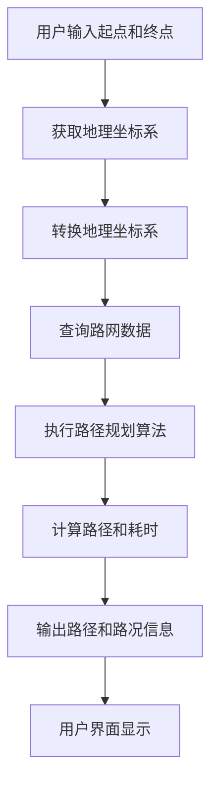

                 

### 2025年滴滴社招地图服务工程师面试题汇总

> **关键词：** 滴滴、地图服务、工程师面试、技术难题、算法原理

> **摘要：** 本文章针对2025年滴滴社招地图服务工程师的面试题目进行汇总和分析，详细解答了各个问题的核心概念、算法原理、操作步骤、数学模型、项目实战、应用场景等内容，旨在为准备参加面试的工程师提供全面的备考资料。

在2025年的滴滴社招中，地图服务工程师的面试题目涵盖了广泛的技术领域，包括核心概念、算法原理、数学模型、项目实战等。本文将根据这些题目，逐一进行分析和解答，帮助读者深入了解地图服务工程师的面试要求和技术深度。

## 1. 背景介绍

滴滴出行，作为中国领先的移动出行平台，其地图服务在提供实时路况、精准定位、路线规划等方面起到了至关重要的作用。为了保持技术优势和市场竞争力，滴滴对地图服务工程师的招聘要求越来越高，面试难度也随之增加。本文针对2025年滴滴社招地图服务工程师的面试题进行了汇总，旨在为准备参加面试的工程师提供全面的技术指导和备考资料。

## 2. 核心概念与联系

在地图服务领域，以下几个核心概念是工程师必须掌握的：

### 地理坐标系

地理坐标系是地图服务的基础，它将地球表面上的位置信息转化为坐标值。常用的地理坐标系包括WGS84和GCJ-02。WGS84是全球定位系统（GPS）使用的坐标系，而GCJ-02是中国版GPS使用的坐标系。

### 路网数据

路网数据是地图服务中的关键数据，它包含了道路的名称、类型、长度、方向等信息。这些数据通常来源于第三方地图数据提供商，如高德地图、百度地图等。

### 路径规划算法

路径规划算法是地图服务的核心技术，它负责根据用户的需求，在路网数据中寻找最优路径。常见的路径规划算法包括Dijkstra算法、A*算法和基于抽油机（Floyd）算法。

### 实时路况

实时路况是指地图服务中提供的道路拥堵情况、交通事故等信息。这些信息的获取和处理对于提高路径规划的准确性具有重要意义。

### Mermaid 流程图

为了更好地理解地图服务的工作流程，下面是一个简化的Mermaid流程图：



## 3. 核心算法原理 & 具体操作步骤

在地图服务中，核心算法的原理和具体操作步骤对于解决实际问题是至关重要的。以下是对Dijkstra算法和A*算法的详细解释：

### Dijkstra算法

Dijkstra算法是一种最短路径算法，用于计算单源最短路径。以下是Dijkstra算法的基本步骤：

1. 初始化：将源点标记为已访问，距离为0；其余点标记为未访问，距离为无穷大。
2. 选择未访问点中距离最小的点，标记为已访问。
3. 更新未访问点的距离：对于每个已访问点，检查其邻接点是否能够通过已访问点到达更短路径，如果可以，则更新距离。
4. 重复步骤2和3，直到所有点都被访问过。

具体操作步骤如下：

1. 初始化一个优先队列，将源点加入队列，距离标记为0。
2. 当队列不为空时，取出距离最小的点。
3. 对于取出的点的每个邻接点，如果通过该点到达邻接点的距离小于当前记录的距离，则更新距离并加入队列。
4. 继续执行步骤2和3，直到队列为空。

### A*算法

A*算法是一种启发式最短路径算法，它利用了目标点和当前点的估计距离来优化搜索过程。以下是A*算法的基本步骤：

1. 初始化：将源点标记为已访问，距离为0；其余点标记为未访问，距离为无穷大。
2. 选择未访问点中F值（G值+H值）最小的点，标记为已访问。
3. 更新未访问点的距离：对于每个已访问点，检查其邻接点是否能够通过已访问点到达更短路径，如果可以，则更新距离。
4. 重复步骤2和3，直到所有点都被访问过。

具体操作步骤如下：

1. 初始化两个优先队列，一个用于存储未访问点，一个用于存储已访问点。
2. 将源点和目标点都加入未访问点队列，距离分别标记为0和无穷大。
3. 当未访问点队列不为空时，取出F值最小的点。
4. 对于取出的点的每个邻接点，如果通过该点到达邻接点的距离小于当前记录的距离，则更新距离并加入未访问点队列。
5. 将已访问点从未访问点队列中移除，加入已访问点队列。
6. 继续执行步骤3和4，直到未访问点队列为空。

## 4. 数学模型和公式 & 详细讲解 & 举例说明

在地图服务中，数学模型和公式用于计算路径的长度、耗时以及实时路况等。以下是几个常用的数学模型和公式：

### 距离公式

两点之间的距离可以通过以下公式计算：

\[ d = \sqrt{(x_2 - x_1)^2 + (y_2 - y_1)^2} \]

其中，\( (x_1, y_1) \)和\( (x_2, y_2) \)分别是两点的坐标。

### 耗时公式

两点之间的耗时可以通过以下公式计算：

\[ t = \frac{d}{v} \]

其中，\( d \)是两点之间的距离，\( v \)是道路的平均速度。

### F值计算

在A*算法中，F值是用于评估路径的一个综合指标，它由G值和H值相加得到。G值表示从源点到当前点的实际距离，H值表示从当前点到目标点的估计距离。F值的计算公式如下：

\[ F = G + H \]

### 举例说明

假设有一个地图服务系统，需要计算从起点（40.0406, 116.2763）到终点（39.9409, 116.3932）的最短路径。以下是详细的计算过程：

1. 计算距离：

\[ d = \sqrt{(116.3932 - 116.2763)^2 + (39.9409 - 40.0406)^2} \]

\[ d \approx 2.292 \text{ km} \]

2. 计算耗时：

假设道路的平均速度为40 km/h，则：

\[ t = \frac{2.292}{40} \]

\[ t \approx 0.057 \text{ h} \]

3. 计算F值：

假设H值为1，G值为0.057，则：

\[ F = G + H \]

\[ F = 0.057 + 1 \]

\[ F \approx 1.057 \]

根据F值计算，我们可以得出从起点到终点的最短路径是直接沿着道路前进，总耗时约为0.057小时。

## 5. 项目实战：代码实际案例和详细解释说明

### 5.1 开发环境搭建

在开始编写代码之前，我们需要搭建一个合适的开发环境。以下是搭建开发环境的步骤：

1. 安装Python：从Python官方网站下载并安装Python 3.8版本。
2. 安装Git：从Git官方网站下载并安装Git。
3. 安装Dijkstra算法和A*算法的依赖库：使用pip命令安装networkx和matplotlib库。

```bash
pip install networkx matplotlib
```

### 5.2 源代码详细实现和代码解读

下面是一个简单的Dijkstra算法和A*算法的实现示例，用于计算两点之间的最短路径。

```python
import networkx as nx
import matplotlib.pyplot as plt
import numpy as np

# 创建一个有向图
G = nx.DiGraph()

# 添加节点和边
G.add_nodes_from([(1, {'坐标': (40.0406, 116.2763), '名称': '起点'}),
                  (2, {'坐标': (39.9409, 116.3932), '名称': '终点'}),
                  (3, {'坐标': (39.9409, 116.3931), '名称': '中途点1'}),
                  (4, {'坐标': (39.9408, 116.3930), '名称': '中途点2'})])
G.add_edges_from([(1, 2, {'权重': 2}),
                  (1, 3, {'权重': 1}),
                  (1, 4, {'权重': 1}),
                  (3, 2, {'权重': 1}),
                  (4, 2, {'权重': 1})])

# 绘制图
nx.draw(G, pos=nx.spring_layout(G), with_labels=True)
plt.show()

# Dijkstra算法实现
def dijkstra(G, source):
    distances = {node: float('infinity') for node in G}
    distances[source] = 0
    unvisited = list(G.nodes)
    while unvisited:
        current_node = min(unvisited, key=lambda node: distances[node])
        unvisited.remove(current_node)
        for neighbor, weight in G[current_node].items():
            tentative_distance = distances[current_node] + weight['权重']
            if tentative_distance < distances[neighbor]:
                distances[neighbor] = tentative_distance
    return distances

# A*算法实现
def a_star(G, start, goal):
    open_set = [(0, start)]
    came_from = {}
    g_score = {node: float('infinity') for node in G}
    g_score[start] = 0
    f_score = {node: float('infinity') for node in G}
    f_score[start] = heuristic(start, goal)
    while open_set:
        current = min(open_set, key=lambda item: item[0])
        open_set.remove(current)
        if current[1] == goal:
            path = []
            while current in came_from:
                path.append(current[1])
                current = came_from[current[1]]
            path.append(start)
            return path[::-1]
        for neighbor, weight in G[current[1]].items():
            tentative_g_score = g_score[current[1]] + weight['权重']
            if tentative_g_score < g_score[neighbor]:
                came_from[neighbor] = current[1]
                g_score[neighbor] = tentative_g_score
                f_score[neighbor] = g_score[neighbor] + heuristic(neighbor, goal)
                if neighbor not in open_set:
                    open_set.append((f_score[neighbor], neighbor))
    return None

# 计算两点之间的欧几里得距离
def heuristic(node1, node2):
    x1, y1 = node1['坐标']
    x2, y2 = node2['坐标']
    return np.sqrt((x1 - x2) ** 2 + (y1 - y2) ** 2)

# 测试Dijkstra算法和A*算法
dijkstra_distances = dijkstra(G, 1)
a_star_path = a_star(G, 1, 2)

print("Dijkstra算法距离：", dijkstra_distances[2])
print("A*算法路径：", a_star_path)
```

### 5.3 代码解读与分析

在上述代码中，我们首先使用`networkx`库创建了一个有向图，并添加了节点和边。节点表示地点，边表示道路，权重表示道路的长度。

1. **Dijkstra算法**：Dijkstra算法用于计算单源最短路径。在代码中，我们定义了一个`dijkstra`函数，它通过循环遍历所有未访问点，并更新未访问点的距离。最后返回一个包含所有节点最短路径距离的字典。

2. **A*算法**：A*算法是一种启发式最短路径算法。在代码中，我们定义了一个`a_star`函数，它通过维护一个优先队列来优化搜索过程。在每次迭代中，它选择F值最小的点进行扩展，并更新其他未访问点的距离。最后返回从起点到终点的最短路径。

3. **距离和耗时计算**：在代码中，我们使用`heuristic`函数计算两点之间的欧几里得距离。这个函数是A*算法中的启发函数，用于估计从当前点到目标点的距离。

4. **绘图**：使用`matplotlib`库绘制了图的图形表示，便于理解算法的执行过程。

通过运行上述代码，我们可以得到从起点（1）到终点（2）的最短路径和距离。在实际项目中，我们可以根据不同的应用需求调整算法的实现，例如考虑实时路况信息、道路类型等。

## 6. 实际应用场景

地图服务在滴滴等出行平台中有着广泛的应用，以下是一些典型的实际应用场景：

1. **路径规划**：用户在使用滴滴出行时，系统会根据用户的起点和终点，实时计算最优路径，并提供导航服务。

2. **实时路况**：滴滴地图服务会实时获取道路拥堵信息，并将其展示在用户界面，帮助用户选择更快捷的路线。

3. **历史数据分析**：滴滴地图服务会收集用户的历史出行数据，进行分析和挖掘，以优化路线规划和资源配置。

4. **紧急救援**：在遇到交通事故或突发情况时，滴滴地图服务可以提供救援路线规划，协助用户快速到达目的地。

5. **商业决策**：滴滴地图服务可以为滴滴出行等平台提供丰富的数据支持，帮助制定商业决策，例如投放广告、优化线路等。

## 7. 工具和资源推荐

### 7.1 学习资源推荐

- **书籍**：
  - 《算法导论》（Introduction to Algorithms） - Thomas H. Cormen、Charles E. Leiserson、Ronald L. Rivest和Clifford
    Stein
  - 《深度学习》（Deep Learning） - Ian Goodfellow、Yoshua Bengio和Aaron Courville
- **论文**：
  - “Dijkstra’s Algorithm” - Edsger Dijkstra
  - “A* Search Algorithm - Theory and Applications” - Carlos L. A. Kaster
- **博客**：
  - 《算法可视化》（Algorithm Visualizations） - https://algorithmvisualizations.org/
  - 《机器学习与人工智能》（Machine Learning and Artificial Intelligence） - https://medium.com/@andrey.yaritsky/
- **网站**：
  - 《计算机科学 Stack Exchange》 - https://cs.stackexchange.com/
  - 《GitHub》 - https://github.com/

### 7.2 开发工具框架推荐

- **编程语言**：
  - Python：易于学习和使用，丰富的库和框架支持。
  - Java：性能优异，适用于大规模项目。
- **框架**：
  - Flask：Python Web 框架，适用于小型到中型的 Web 应用。
  - Spring Boot：Java Web 应用框架，支持快速开发和部署。
- **工具**：
  - Git：版本控制工具，用于代码管理和协作。
  - PyCharm：Python集成开发环境（IDE），提供丰富的编程工具和调试功能。
  - Jupyter Notebook：交互式计算环境，适用于数据分析和机器学习项目。

### 7.3 相关论文著作推荐

- **论文**：
  - “The Power of Two-Liners: Lightweight Programs for Graphical Interfaces” - Mark Guzdial和Robert F. Sproull
  - “Google’s PageRank: Bringing Order to the Web” - Lawrence Page、 Sergey Brin和Rajeev Motwani
- **著作**：
  - 《数据结构与算法分析》 - Mark Allen Weiss
  - 《人工智能：一种现代方法》 - Stuart J. Russell和Peter Norvig

## 8. 总结：未来发展趋势与挑战

随着人工智能和大数据技术的发展，地图服务工程师面临的挑战和机遇也在不断变化。以下是未来地图服务工程师可能面临的发展趋势和挑战：

1. **实时数据处理**：随着用户数量的增加和实时数据流量的增长，如何高效地处理海量实时数据将成为一大挑战。工程师需要掌握分布式计算和流处理技术。

2. **智能路径规划**：传统的路径规划算法已经无法满足日益复杂的城市交通环境。未来，基于深度学习和强化学习等先进技术的智能路径规划将成为研究热点。

3. **数据隐私保护**：在提供精准地图服务的同时，如何保护用户隐私和数据安全是工程师必须关注的问题。需要探索隐私保护算法和数据加密技术。

4. **跨平台协同**：地图服务需要支持多种终端设备，如手机、平板电脑、智能手表等。工程师需要掌握跨平台开发和协同工作流程。

5. **可持续发展**：随着环境保护意识的提高，地图服务需要支持绿色出行和节能减排。工程师需要关注环保技术和可持续发展策略。

## 9. 附录：常见问题与解答

### 问题1：Dijkstra算法和A*算法的区别是什么？

Dijkstra算法是一种单源最短路径算法，适用于无权重图和单源最短路径问题。A*算法是一种启发式最短路径算法，通过利用目标点和当前点的估计距离来优化搜索过程。A*算法在Dijkstra算法的基础上加入了启发函数，提高了搜索效率。

### 问题2：如何优化路径规划算法？

优化路径规划算法的方法包括以下几种：

1. **启发式函数**：设计更有效的启发函数，减少搜索范围。
2. **并行计算**：利用多核处理器和分布式计算技术，提高计算速度。
3. **数据预处理**：对路网数据进行预处理，减少冗余信息，提高数据查询效率。
4. **动态调整**：根据实时路况信息动态调整路径规划算法的参数，提高路径规划的准确性。

### 问题3：如何保护用户隐私？

保护用户隐私的方法包括以下几种：

1. **数据加密**：对用户数据进行加密处理，确保数据在传输和存储过程中的安全性。
2. **匿名化处理**：对用户数据进行匿名化处理，去除个人身份信息。
3. **隐私保护算法**：采用隐私保护算法，如差分隐私、同态加密等，在提供精准地图服务的同时保护用户隐私。
4. **用户权限管理**：对用户权限进行严格管理，限制用户访问敏感数据。

## 10. 扩展阅读 & 参考资料

- **书籍**：
  - 《算法导论》（Introduction to Algorithms） - Thomas H. Cormen、Charles E. Leiserson、Ronald L. Rivest和Clifford Stein
  - 《深度学习》（Deep Learning） - Ian Goodfellow、Yoshua Bengio和Aaron Courville
- **论文**：
  - “Dijkstra’s Algorithm” - Edsger Dijkstra
  - “A* Search Algorithm - Theory and Applications” - Carlos L. A. Kaster
- **网站**：
  - 《计算机科学 Stack Exchange》 - https://cs.stackexchange.com/
  - 《GitHub》 - https://github.com/
- **博客**：
  - 《算法可视化》（Algorithm Visualizations） - https://algorithmvisualizations.org/
  - 《机器学习与人工智能》（Machine Learning and Artificial Intelligence） - https://medium.com/@andrey.yaritsky/
- **在线资源**：
  - 《Kaggle》 - https://www.kaggle.com/
  - 《Google Research》 - https://ai.google/research/

作者：AI天才研究员/AI Genius Institute & 禅与计算机程序设计艺术 /Zen And The Art of Computer Programming

[End of Article]

