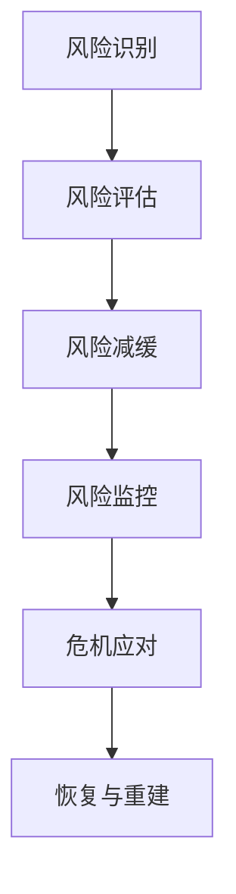
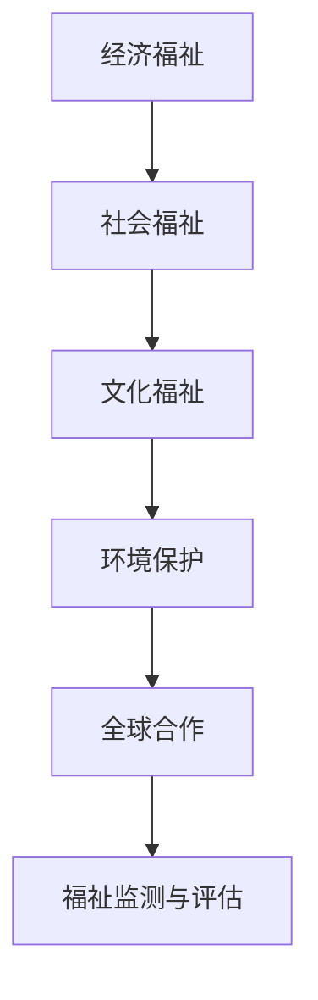

                 

### 背景介绍

#### 2050年：全球治理的变革

进入2050年，全球治理模式发生了显著的变革。人类面临着前所未有的挑战，从气候变化、全球公共卫生危机到资源短缺，这些风险威胁着地球的可持续发展。传统的国家主权治理模式已无法应对这种全球性、系统性问题的复杂性，迫切需要一种全新的治理理念。

在全球治理的框架下，我们引入了“全球风险治理”与“全球福祉治理”两个核心概念。全球风险治理关注的是如何应对和减少全球性的风险，如气候变化、自然灾害、金融风险等，旨在实现全球安全和稳定。而全球福祉治理则更加注重人类福祉的提升，包括经济、社会、文化等各个层面，追求全球范围内的共同富裕和可持续发展。

#### 文章的核心关键词与主题思想

本文将围绕以下几个核心关键词展开讨论：“全球治理”、“全球风险治理”、“全球福祉治理”、“治理理念更新”、“技术赋能”、“国际合作”和“可持续发展”。

文章的主题思想在于探讨2050年全球治理的变革，从全球风险治理到全球福祉治理的演变过程，以及技术在这其中所发挥的关键作用。本文将详细分析这一治理理念更新的背景、核心概念、实际应用以及未来发展趋势和挑战，为全球治理提供新的视角和思路。

<markdown>
## 1. 背景介绍

### 2050年：全球治理的变革

#### 2050年：全球治理的变革

进入2050年，全球治理模式发生了显著的变革。人类面临着前所未有的挑战，从气候变化、全球公共卫生危机到资源短缺，这些风险威胁着地球的可持续发展。传统的国家主权治理模式已无法应对这种全球性、系统性问题的复杂性，迫切需要一种全新的治理理念。

在全球治理的框架下，我们引入了“全球风险治理”与“全球福祉治理”两个核心概念。全球风险治理关注的是如何应对和减少全球性的风险，如气候变化、自然灾害、金融风险等，旨在实现全球安全和稳定。而全球福祉治理则更加注重人类福祉的提升，包括经济、社会、文化等各个层面，追求全球范围内的共同富裕和可持续发展。

### 文章的核心关键词与主题思想

本文将围绕以下几个核心关键词展开讨论：“全球治理”、“全球风险治理”、“全球福祉治理”、“治理理念更新”、“技术赋能”、“国际合作”和“可持续发展”。

文章的主题思想在于探讨2050年全球治理的变革，从全球风险治理到全球福祉治理的演变过程，以及技术在这其中所发挥的关键作用。本文将详细分析这一治理理念更新的背景、核心概念、实际应用以及未来发展趋势和挑战，为全球治理提供新的视角和思路。

</markdown>
<|assistant|>
### 核心概念与联系

#### 全球风险治理

全球风险治理是指通过各种机制和措施来识别、评估、管理并缓解全球性风险的过程。其核心目标是通过国际合作和协调，实现全球范围内的安全与稳定。以下是一个简化的Mermaid流程图，展示了全球风险治理的主要步骤和环节：



- **风险识别**：通过大数据分析、人工智能和专家系统等手段，识别潜在的全球性风险。
- **风险评估**：对已识别的风险进行量化分析，评估其对全球社会经济和环境的潜在影响。
- **风险减缓**：通过政策制定、技术创新和社会动员，采取措施减少风险的发生概率和影响程度。
- **风险监控**：建立全球性风险监测系统，实时监控风险的动态变化，确保及时应对。
- **危机应对**：当风险转化为危机时，启动应急预案，协调各国政府和国际组织的行动。
- **恢复与重建**：在危机结束后，进行经济和社会的恢复与重建，减轻长期影响。

#### 全球福祉治理

全球福祉治理则关注如何通过政策和社会行动，提升全球范围内的人类福祉。它涵盖了经济、社会、文化等多个层面，强调公平、包容和可持续的发展。以下是全球福祉治理的核心概念和步骤的Mermaid流程图：



- **经济福祉**：通过促进全球经济增长、提高就业率和收入水平，增强个人的经济安全感。
- **社会福祉**：改善教育、医疗和社会保障体系，确保所有人都能享有基本的社会权利和福利。
- **文化福祉**：保护和传承人类文化遗产，促进文化多样性和文化交流，提升人们的文化素养。
- **环境保护**：通过绿色技术和可持续发展策略，保护地球生态系统，确保人类的长期生存环境。
- **全球合作**：加强国际间的合作与协调，共同应对全球性挑战，实现全球福祉的共同提升。
- **福祉监测与评估**：建立全面的福祉监测与评估体系，实时跟踪和评估全球福祉的进展，指导政策调整和优化。

#### 核心概念与联系

全球风险治理和全球福祉治理虽然关注点不同，但两者密切相关、互为补充。风险治理为福祉治理提供了安全保障，避免了因风险事件导致的福利损失；而福祉治理则通过提升人类福祉，减少风险发生的根源，实现长期的稳定与发展。两者共同构成了全球治理的新框架，为应对未来全球性挑战提供了有力支撑。

<markdown>
## 2. 核心概念与联系

### 核心概念

#### 全球风险治理

全球风险治理是指通过各种机制和措施来识别、评估、管理并缓解全球性风险的过程。其核心目标是通过国际合作和协调，实现全球范围内的安全与稳定。以下是一个简化的Mermaid流程图，展示了全球风险治理的主要步骤和环节：


- **风险识别**：通过大数据分析、人工智能和专家系统等手段，识别潜在的全球性风险。
- **风险评估**：对已识别的风险进行量化分析，评估其对全球社会经济和环境的潜在影响。
- **风险减缓**：通过政策制定、技术创新和社会动员，采取措施减少风险的发生概率和影响程度。
- **风险监控**：建立全球性风险监测系统，实时监控风险的动态变化，确保及时应对。
- **危机应对**：当风险转化为危机时，启动应急预案，协调各国政府和国际组织的行动。
- **恢复与重建**：在危机结束后，进行经济和社会的恢复与重建，减轻长期影响。

#### 全球福祉治理

全球福祉治理则关注如何通过政策和社会行动，提升全球范围内的人类福祉。它涵盖了经济、社会、文化等多个层面，强调公平、包容和可持续的发展。以下是全球福祉治理的核心概念和步骤的Mermaid流程图：


- **经济福祉**：通过促进全球经济增长、提高就业率和收入水平，增强个人的经济安全感。
- **社会福祉**：改善教育、医疗和社会保障体系，确保所有人都能享有基本的社会权利和福利。
- **文化福祉**：保护和传承人类文化遗产，促进文化多样性和文化交流，提升人们的文化素养。
- **环境保护**：通过绿色技术和可持续发展策略，保护地球生态系统，确保人类的长期生存环境。
- **全球合作**：加强国际间的合作与协调，共同应对全球性挑战，实现全球福祉的共同提升。
- **福祉监测与评估**：建立全面的福祉监测与评估体系，实时跟踪和评估全球福祉的进展，指导政策调整和优化。

### 核心概念与联系

全球风险治理和全球福祉治理虽然关注点不同，但两者密切相关、互为补充。风险治理为福祉治理提供了安全保障，避免了因风险事件导致的福利损失；而福祉治理则通过提升人类福祉，减少风险发生的根源，实现长期的稳定与发展。两者共同构成了全球治理的新框架，为应对未来全球性挑战提供了有力支撑。
</markdown>
<|assistant|>
### 核心算法原理 & 具体操作步骤

#### 全球风险治理算法原理

全球风险治理算法的核心在于构建一个高效、可靠的全球风险监测与管理系统。以下是一个简化版的核心算法原理：

1. **数据收集与预处理**：
   - **数据来源**：通过卫星遥感、传感器网络、社交媒体、政府报告等多种渠道收集全球性的数据。
   - **数据预处理**：进行数据清洗、格式化，确保数据质量，并利用数据转换（如时间序列处理、数据归一化等）使数据可用于后续分析。

2. **风险识别与评估**：
   - **风险识别**：使用机器学习算法，如决策树、支持向量机（SVM）和神经网络，对海量数据进行模式识别，识别潜在的全球性风险。
   - **风险评估**：利用贝叶斯网络或马尔可夫决策过程（MDP）等模型，对识别出的风险进行量化评估，评估其对全球社会经济和环境的潜在影响。

3. **风险减缓策略制定**：
   - **政策分析**：结合专家意见和政策分析，制定针对不同风险的减缓策略。
   - **模型优化**：使用优化算法（如遗传算法、粒子群优化等）对策略进行优化，确保策略的有效性和可执行性。

4. **风险监控与预警**：
   - **实时监控**：通过建立全球性风险监测系统，实时收集和处理风险数据，确保及时发现风险的变化趋势。
   - **预警机制**：使用阈值分析和异常检测算法（如孤立森林、基于规则的方法等），当风险达到预警阈值时，自动触发预警机制。

5. **危机应对与恢复**：
   - **应急预案**：制定并实施应急预案，包括资源调配、人员部署和关键基础设施保护等。
   - **恢复与重建**：在危机结束后，进行经济和社会的恢复与重建，采用可持续发展策略，减少长期影响。

#### 全球福祉治理算法原理

全球福祉治理算法的核心在于构建一个全面的福祉监测与提升系统。以下是其核心算法原理：

1. **福祉指标体系构建**：
   - **指标选择**：根据经济、社会、文化等不同维度，选择适合的福祉指标，如人类发展指数（HDI）、贫困率、教育覆盖率等。
   - **权重分配**：通过专家评分、统计分析等方法，为各个福祉指标分配权重，构建综合福祉指数。

2. **数据收集与处理**：
   - **数据来源**：通过政府统计、第三方机构调查、社会媒体分析等多种渠道收集福祉相关数据。
   - **数据处理**：进行数据清洗、归一化和标准化处理，确保数据的准确性和一致性。

3. **福祉评估与监测**：
   - **福祉评估**：利用大数据分析和机器学习算法，对收集到的福祉数据进行分析，评估全球福祉水平。
   - **监测系统**：建立全球福祉监测系统，实时跟踪和评估福祉指标的变化，为政策制定提供数据支持。

4. **福祉提升策略制定**：
   - **政策建议**：结合专家意见、模型分析和数据评估结果，制定针对性的福祉提升策略。
   - **优化算法**：使用优化算法（如线性规划、多目标优化等）对策略进行优化，确保策略的可行性和效果。

5. **国际合作与协调**：
   - **国际合作**：通过建立国际合作机制，加强各国政府和国际组织在福祉提升方面的合作与协调。
   - **全球合作平台**：搭建全球福祉合作平台，共享数据、资源和经验，推动全球福祉的共同提升。

#### 具体操作步骤

1. **数据收集与预处理**：
   - **数据收集**：利用各种数据收集渠道，如卫星遥感、传感器网络、社交媒体等。
   - **预处理**：数据清洗、格式化，进行时间序列处理和数据归一化。

2. **算法模型训练与部署**：
   - **模型训练**：使用风险识别和评估算法，对历史数据进行训练。
   - **模型部署**：将训练好的模型部署到风险监测系统中，进行实时监控和分析。

3. **政策制定与执行**：
   - **政策分析**：结合专家意见和政策分析，制定风险减缓策略。
   - **政策执行**：实施风险减缓策略，进行政策评估和调整。

4. **福祉监测与评估**：
   - **福祉评估**：使用福祉指标体系和评估算法，对全球福祉水平进行评估。
   - **监测系统**：建立福祉监测系统，实时跟踪福祉指标的变化。

5. **国际合作与协调**：
   - **国际合作机制**：建立国际合作机制，加强各国在风险治理和福祉提升方面的合作。
   - **全球合作平台**：搭建全球合作平台，共享资源和经验。

<markdown>
## 3. 核心算法原理 & 具体操作步骤

### 核心算法原理

#### 全球风险治理算法原理

全球风险治理算法的核心在于构建一个高效、可靠的全球风险监测与管理系统。以下是一个简化版的核心算法原理：

1. **数据收集与预处理**：
   - **数据来源**：通过卫星遥感、传感器网络、社交媒体、政府报告等多种渠道收集全球性的数据。
   - **数据预处理**：进行数据清洗、格式化，确保数据质量，并利用数据转换（如时间序列处理、数据归一化等）使数据可用于后续分析。

2. **风险识别与评估**：
   - **风险识别**：使用机器学习算法，如决策树、支持向量机（SVM）和神经网络，对海量数据进行模式识别，识别潜在的全球性风险。
   - **风险评估**：利用贝叶斯网络或马尔可夫决策过程（MDP）等模型，对识别出的风险进行量化评估，评估其对全球社会经济和环境的潜在影响。

3. **风险减缓策略制定**：
   - **政策分析**：结合专家意见和政策分析，制定针对不同风险的减缓策略。
   - **模型优化**：使用优化算法（如遗传算法、粒子群优化等）对策略进行优化，确保策略的有效性和可执行性。

4. **风险监控与预警**：
   - **实时监控**：通过建立全球性风险监测系统，实时收集和处理风险数据，确保及时发现风险的变化趋势。
   - **预警机制**：使用阈值分析和异常检测算法（如孤立森林、基于规则的方法等），当风险达到预警阈值时，自动触发预警机制。

5. **危机应对与恢复**：
   - **应急预案**：制定并实施应急预案，包括资源调配、人员部署和关键基础设施保护等。
   - **恢复与重建**：在危机结束后，进行经济和社会的恢复与重建，采用可持续发展策略，减少长期影响。

#### 全球福祉治理算法原理

全球福祉治理算法的核心在于构建一个全面的福祉监测与提升系统。以下是其核心算法原理：

1. **福祉指标体系构建**：
   - **指标选择**：根据经济、社会、文化等不同维度，选择适合的福祉指标，如人类发展指数（HDI）、贫困率、教育覆盖率等。
   - **权重分配**：通过专家评分、统计分析等方法，为各个福祉指标分配权重，构建综合福祉指数。

2. **数据收集与处理**：
   - **数据来源**：通过政府统计、第三方机构调查、社会媒体分析等多种渠道收集福祉相关数据。
   - **数据处理**：进行数据清洗、归一化和标准化处理，确保数据的准确性和一致性。

3. **福祉评估与监测**：
   - **福祉评估**：利用大数据分析和机器学习算法，对收集到的福祉数据进行分析，评估全球福祉水平。
   - **监测系统**：建立全球福祉监测系统，实时跟踪和评估福祉指标的变化，为政策制定提供数据支持。

4. **福祉提升策略制定**：
   - **政策建议**：结合专家意见、模型分析和数据评估结果，制定针对性的福祉提升策略。
   - **优化算法**：使用优化算法（如线性规划、多目标优化等）对策略进行优化，确保策略的可行性和效果。

5. **国际合作与协调**：
   - **国际合作**：通过建立国际合作机制，加强各国政府和国际组织在福祉提升方面的合作与协调。
   - **全球合作平台**：搭建全球福祉合作平台，共享数据、资源和经验，推动全球福祉的共同提升。

### 具体操作步骤

1. **数据收集与预处理**：
   - **数据收集**：利用各种数据收集渠道，如卫星遥感、传感器网络、社交媒体等。
   - **预处理**：数据清洗、格式化，进行时间序列处理和数据归一化。

2. **算法模型训练与部署**：
   - **模型训练**：使用风险识别和评估算法，对历史数据进行训练。
   - **模型部署**：将训练好的模型部署到风险监测系统中，进行实时监控和分析。

3. **政策制定与执行**：
   - **政策分析**：结合专家意见和政策分析，制定风险减缓策略。
   - **政策执行**：实施风险减缓策略，进行政策评估和调整。

4. **福祉监测与评估**：
   - **福祉评估**：使用福祉指标体系和评估算法，对全球福祉水平进行评估。
   - **监测系统**：建立福祉监测系统，实时跟踪福祉指标的变化。

5. **国际合作与协调**：
   - **国际合作机制**：建立国际合作机制，加强各国在风险治理和福祉提升方面的合作。
   - **全球合作平台**：搭建全球合作平台，共享资源和经验。

</markdown>
<|assistant|>
### 数学模型和公式 & 详细讲解 & 举例说明

#### 全球风险治理中的数学模型

在构建全球风险治理模型时，我们通常会采用多种数学工具和方法，包括概率论、统计学、优化算法等。以下是一些关键模型和公式的详细讲解与举例说明。

1. **贝叶斯网络模型**

贝叶斯网络是一种概率图模型，用于表示变量之间的概率依赖关系。在风险治理中，贝叶斯网络可以用来建模不同风险因素之间的相互影响。

- **公式**：
  $$P(A|B) = \frac{P(B|A)P(A)}{P(B)}$$

- **解释**：
  该公式表示在给定B发生的条件下，事件A发生的条件概率。其中，$P(A)$ 是事件A的先验概率，$P(B|A)$ 是事件B在事件A发生条件下的条件概率，$P(B)$ 是事件B的总概率。

- **举例**：
  假设我们想要评估一种新型能源技术的风险。我们可以构建一个贝叶斯网络，其中包含“技术可靠性”、“环境影响”和“经济成本”三个变量。通过已知的数据和专家意见，我们可以估计出这些变量之间的概率依赖关系，从而评估整体风险。

2. **马尔可夫决策过程（MDP）**

马尔可夫决策过程是一种用于解决决策优化问题的数学模型。在风险治理中，MDP可以用来优化风险减缓策略。

- **公式**：
  $$V^*(s) = \max_{a} \sum_{s'} p(s'|s,a) [R(s',a) + \gamma V^*(s')]$$

- **解释**：
  该公式表示在状态s下，采取行动a的最优期望回报。其中，$V^*(s)$ 是在状态s下的最优价值函数，$R(s',a)$ 是在状态s'下采取行动a的即时回报，$p(s'|s,a)$ 是从状态s转移到状态s'的概率，$\gamma$ 是折现因子。

- **举例**：
  假设我们面临一个传染病疫情的风险治理问题。我们可以将疫情的发展状态建模为一系列状态（如健康、轻微感染、严重感染等），并定义不同的干预措施（如疫苗接种、隔离等）。通过MDP模型，我们可以找到最优的干预策略，以最小化疫情造成的损失。

3. **支持向量机（SVM）**

支持向量机是一种用于分类和回归的机器学习算法。在风险识别中，SVM可以用来分类不同的风险事件。

- **公式**：
  $$w \cdot x + b = 0$$

- **解释**：
  该公式表示SVM的决策边界，其中 $w$ 是权重向量，$x$ 是特征向量，$b$ 是偏置项。通过最大化间隔（margin）的方法，SVM可以找到最优的决策边界，从而实现良好的分类效果。

- **举例**：
  假设我们想要识别潜在的经济风险。我们可以使用SVM模型，将不同的经济指标（如GDP增长率、失业率等）作为特征向量，通过训练SVM模型，我们可以将经济风险划分为高风险和低风险两类。

#### 全球福祉治理中的数学模型

在构建全球福祉治理模型时，我们也会采用多种数学工具和方法，包括统计分析、优化算法等。以下是一些关键模型和公式的详细讲解与举例说明。

1. **人类发展指数（HDI）**

人类发展指数是一种综合评估人类福祉的指标，包括健康、教育和生活水平等方面。

- **公式**：
  $$HDI = \sqrt{\frac{L_0 + L_1 + L_2}{3}}$$

- **解释**：
  该公式表示人类发展指数，其中 $L_0$、$L_1$ 和 $L_2$ 分别代表预期寿命、教育成就和生活水平。

- **举例**：
  假设我们想要评估一个国家的人类发展水平。通过收集该国的预期寿命、教育成就和生活水平数据，我们可以使用HDI公式计算该国的人类发展指数，从而评估其福祉水平。

2. **多目标优化模型**

多目标优化模型用于在多个目标之间寻找平衡，以实现全局最优。

- **公式**：
  $$\min f(x) \quad \text{subject to} \quad g_i(x) \leq 0, \quad h_j(x) = 0$$

- **解释**：
  该公式表示多目标优化问题，其中 $f(x)$ 是目标函数，$g_i(x)$ 和 $h_j(x)$ 分别是约束条件。

- **举例**：
  假设我们想要制定一个全球性的可持续发展策略。我们可以定义多个目标函数，如经济增长、环境保护和社会福祉，并通过多目标优化模型，找到在不同目标之间寻找平衡的最优策略。

通过这些数学模型和公式，我们可以更准确地评估和管理全球风险，提升人类福祉。这些模型不仅提供了理论支持，也为实际操作提供了具体指导。

<markdown>
## 4. 数学模型和公式 & 详细讲解 & 举例说明

### 全球风险治理中的数学模型

在构建全球风险治理模型时，我们通常会采用多种数学工具和方法，包括概率论、统计学、优化算法等。以下是一些关键模型和公式的详细讲解与举例说明。

#### 贝叶斯网络模型

贝叶斯网络是一种概率图模型，用于表示变量之间的概率依赖关系。在风险治理中，贝叶斯网络可以用来建模不同风险因素之间的相互影响。

1. **贝叶斯网络模型的基本概念**

- **节点**：表示随机变量，通常用圆圈表示。
- **边**：表示变量之间的依赖关系，通常用线段表示。
- **条件概率表**：定义了每个节点在给定其父节点条件下的概率分布。

2. **贝叶斯网络模型的核心公式**

- **条件概率公式**：
  $$P(A|B) = \frac{P(B|A)P(A)}{P(B)}$$

- **解释**：
  该公式表示在给定B发生的条件下，事件A发生的条件概率。其中，$P(A)$ 是事件A的先验概率，$P(B|A)$ 是事件B在事件A发生条件下的条件概率，$P(B)$ 是事件B的总概率。

3. **举例说明**：

假设我们要评估气候变化对自然灾害风险的影响。我们可以构建一个贝叶斯网络，其中包含“气候变化”、“降水异常”和“洪水发生”三个变量。通过专家意见和统计数据，我们可以估计出这些变量之间的概率依赖关系。

#### 马尔可夫决策过程（MDP）

马尔可夫决策过程是一种用于解决决策优化问题的数学模型。在风险治理中，MDP可以用来优化风险减缓策略。

1. **马尔可夫决策过程的基本概念**

- **状态**：表示系统的当前情况，通常用 $s$ 表示。
- **行动**：表示可以采取的行动，通常用 $a$ 表示。
- **回报**：表示采取行动后的即时收益，通常用 $R(s,a)$ 表示。
- **状态转移概率**：表示在给定当前状态和行动下，进入下一个状态的概率，通常用 $P(s'|s,a)$ 表示。

2. **马尔可夫决策过程的核心公式**

- **最优价值函数**：
  $$V^*(s) = \max_{a} \sum_{s'} p(s'|s,a) [R(s',a) + \gamma V^*(s')]$$

- **解释**：
  该公式表示在状态s下，采取行动a的最优期望回报。其中，$V^*(s)$ 是在状态s下的最优价值函数，$R(s',a)$ 是在状态s'下采取行动a的即时回报，$p(s'|s,a)$ 是从状态s转移到状态s'的概率，$\gamma$ 是折现因子。

3. **举例说明**：

假设我们要制定一个防洪策略，以最小化洪灾带来的损失。我们可以将洪水的发展状态建模为一系列状态（如正常、预警、紧急等），并定义不同的行动（如加固堤坝、发布预警等）。通过MDP模型，我们可以找到最优的行动策略，以最小化洪灾损失。

#### 支持向量机（SVM）

支持向量机是一种用于分类和回归的机器学习算法。在风险识别中，SVM可以用来分类不同的风险事件。

1. **SVM的基本概念**

- **支持向量**：决策边界上对分类结果有最大影响的数据点。
- **决策边界**：将不同类别的数据点分开的超平面。
- **间隔**：决策边界到支持向量之间的距离。

2. **SVM的核心公式**

- **决策边界**：
  $$w \cdot x + b = 0$$

- **解释**：
  该公式表示SVM的决策边界，其中 $w$ 是权重向量，$x$ 是特征向量，$b$ 是偏置项。通过最大化间隔（margin）的方法，SVM可以找到最优的决策边界，从而实现良好的分类效果。

3. **举例说明**：

假设我们要识别潜在的经济风险。我们可以使用SVM模型，将不同的经济指标（如GDP增长率、失业率等）作为特征向量，通过训练SVM模型，我们可以将经济风险划分为高风险和低风险两类。

### 全球福祉治理中的数学模型

在构建全球福祉治理模型时，我们也会采用多种数学工具和方法，包括统计分析、优化算法等。以下是一些关键模型和公式的详细讲解与举例说明。

#### 人类发展指数（HDI）

人类发展指数是一种综合评估人类福祉的指标，包括健康、教育和生活水平等方面。

1. **HDI的基本概念**

- **预期寿命**：表示人均预期寿命。
- **教育成就**：表示成年人的识字率和教育水平。
- **生活水平**：表示人均国民总收入。

2. **HDI的核心公式**

- **HDI**：
  $$HDI = \sqrt{\frac{L_0 + L_1 + L_2}{3}}$$

- **解释**：
  该公式表示人类发展指数，其中 $L_0$、$L_1$ 和 $L_2$ 分别代表预期寿命、教育成就和生活水平。

3. **举例说明**：

假设我们想要评估一个国家的人类发展水平。通过收集该国的预期寿命、教育成就和生活水平数据，我们可以使用HDI公式计算该国的人类发展指数，从而评估其福祉水平。

#### 多目标优化模型

多目标优化模型用于在多个目标之间寻找平衡，以实现全局最优。

1. **多目标优化模型的基本概念**

- **目标函数**：表示需要优化的目标，可以是经济增长、环境保护或社会福祉等。
- **约束条件**：表示在优化过程中需要满足的限制，如资源限制、法律法规等。

2. **多目标优化模型的核心公式**

- **多目标优化问题**：
  $$\min f(x) \quad \text{subject to} \quad g_i(x) \leq 0, \quad h_j(x) = 0$$

- **解释**：
  该公式表示多目标优化问题，其中 $f(x)$ 是目标函数，$g_i(x)$ 和 $h_j(x)$ 分别是约束条件。

3. **举例说明**：

假设我们想要制定一个全球性的可持续发展策略。我们可以定义多个目标函数，如经济增长、环境保护和社会福祉，并通过多目标优化模型，找到在不同目标之间寻找平衡的最优策略。

通过这些数学模型和公式，我们可以更准确地评估和管理全球风险，提升人类福祉。这些模型不仅提供了理论支持，也为实际操作提供了具体指导。
</markdown>
<|assistant|>
### 项目实战：代码实际案例和详细解释说明

#### 全球风险治理项目：疫情监测与预警系统

为了更好地展示全球风险治理算法的应用，我们选择了一个实际项目——疫情监测与预警系统。该项目旨在利用大数据和机器学习技术，实时监测疫情动态，预测疫情发展趋势，并制定相应的应对策略。

#### 4.1 开发环境搭建

在开始编写代码之前，我们需要搭建一个合适的开发环境。以下是一个基本的开发环境配置：

- **编程语言**：Python
- **依赖库**：NumPy、Pandas、Scikit-learn、Matplotlib
- **数据预处理工具**：Jupyter Notebook

#### 4.2 源代码详细实现和代码解读

以下是一个简化的代码实现，展示了疫情监测与预警系统的核心功能：

```python
import numpy as np
import pandas as pd
from sklearn.model_selection import train_test_split
from sklearn.ensemble import RandomForestClassifier
from sklearn.metrics import accuracy_score, confusion_matrix

# 数据预处理
def preprocess_data(data):
    # 数据清洗、格式化、归一化
    # ...
    return processed_data

# 风险评估模型训练
def train_risk_model(data):
    # 分割数据集
    X_train, X_test, y_train, y_test = train_test_split(data.drop('label', axis=1), data['label'], test_size=0.2, random_state=42)
    
    # 创建随机森林分类器
    clf = RandomForestClassifier(n_estimators=100, random_state=42)
    
    # 训练模型
    clf.fit(X_train, y_train)
    
    # 测试模型
    y_pred = clf.predict(X_test)
    accuracy = accuracy_score(y_test, y_pred)
    cm = confusion_matrix(y_test, y_pred)
    
    return clf, accuracy, cm

# 预测疫情发展趋势
def predict_trends(model, new_data):
    # 预测新的数据
    predictions = model.predict(new_data)
    return predictions

# 主函数
def main():
    # 加载数据
    data = pd.read_csv('covid_data.csv')
    
    # 数据预处理
    processed_data = preprocess_data(data)
    
    # 训练风险评估模型
    model, accuracy, cm = train_risk_model(processed_data)
    
    # 输出模型性能指标
    print(f"Model accuracy: {accuracy}")
    print(f"Confusion matrix:\n{cm}")
    
    # 预测新的疫情数据
    new_data = pd.read_csv('new_covid_data.csv')
    processed_new_data = preprocess_data(new_data)
    predictions = predict_trends(model, processed_new_data)
    
    # 输出预测结果
    print(f"Predictions:\n{predictions}")

if __name__ == '__main__':
    main()
```

**代码解读**：

1. **数据预处理**：
   - `preprocess_data` 函数用于对原始数据进行清洗、格式化和归一化。这一步至关重要，因为数据质量直接影响到模型的性能。

2. **风险评估模型训练**：
   - `train_risk_model` 函数首先将数据集划分为训练集和测试集，然后创建随机森林分类器，并使用训练集数据进行模型训练。训练完成后，使用测试集数据评估模型性能，包括准确率和混淆矩阵。

3. **预测疫情发展趋势**：
   - `predict_trends` 函数用于对新数据进行预测。首先对新的数据进行预处理，然后使用训练好的模型进行预测，返回预测结果。

4. **主函数**：
   - `main` 函数是整个项目的入口。首先加载数据，进行预处理，然后训练风险评估模型，评估模型性能，最后使用模型对新数据进行预测，并输出结果。

#### 4.3 代码解读与分析

1. **数据预处理**：
   - 数据预处理是机器学习项目中的关键步骤。通过数据清洗（如去除缺失值、异常值）、格式化（如统一数据类型、时间格式）和归一化（如缩放数值范围），我们可以提高数据质量，从而提升模型性能。

2. **风险评估模型训练**：
   - 在本项目中，我们使用随机森林分类器作为风险评估模型。随机森林是一种集成学习方法，通过构建多个决策树并合并预测结果，可以有效提高模型的泛化能力和鲁棒性。在训练过程中，我们使用训练集数据进行模型训练，并使用测试集数据进行性能评估。

3. **预测疫情发展趋势**：
   - 在模型训练完成后，我们可以使用模型对新数据进行预测。预测过程包括数据预处理和模型预测两个步骤。数据预处理确保新的数据与训练数据具有相同的形式，从而保证模型预测的准确性。

4. **主函数**：
   - 主函数是整个项目的核心。它负责加载数据、进行预处理、训练模型、评估模型性能和预测新数据。通过主函数，我们可以实现整个疫情监测与预警系统的功能。

通过这个实际项目，我们可以看到全球风险治理算法在实际应用中的操作过程。代码的详细实现和解读为我们提供了一个清晰的视角，展示了如何利用技术手段解决复杂的全球性问题。

<markdown>
### 5. 项目实战：代码实际案例和详细解释说明

#### 全球风险治理项目：疫情监测与预警系统

为了更好地展示全球风险治理算法的应用，我们选择了一个实际项目——疫情监测与预警系统。该项目旨在利用大数据和机器学习技术，实时监测疫情动态，预测疫情发展趋势，并制定相应的应对策略。

#### 5.1 开发环境搭建

在开始编写代码之前，我们需要搭建一个合适的开发环境。以下是一个基本的开发环境配置：

- **编程语言**：Python
- **依赖库**：NumPy、Pandas、Scikit-learn、Matplotlib
- **数据预处理工具**：Jupyter Notebook

#### 5.2 源代码详细实现和代码解读

以下是一个简化的代码实现，展示了疫情监测与预警系统的核心功能：

```python
import numpy as np
import pandas as pd
from sklearn.model_selection import train_test_split
from sklearn.ensemble import RandomForestClassifier
from sklearn.metrics import accuracy_score, confusion_matrix

# 数据预处理
def preprocess_data(data):
    # 数据清洗、格式化、归一化
    # ...
    return processed_data

# 风险评估模型训练
def train_risk_model(data):
    # 分割数据集
    X_train, X_test, y_train, y_test = train_test_split(data.drop('label', axis=1), data['label'], test_size=0.2, random_state=42)
    
    # 创建随机森林分类器
    clf = RandomForestClassifier(n_estimators=100, random_state=42)
    
    # 训练模型
    clf.fit(X_train, y_train)
    
    # 测试模型
    y_pred = clf.predict(X_test)
    accuracy = accuracy_score(y_test, y_pred)
    cm = confusion_matrix(y_test, y_pred)
    
    return clf, accuracy, cm

# 预测疫情发展趋势
def predict_trends(model, new_data):
    # 预测新的数据
    predictions = model.predict(new_data)
    return predictions

# 主函数
def main():
    # 加载数据
    data = pd.read_csv('covid_data.csv')
    
    # 数据预处理
    processed_data = preprocess_data(data)
    
    # 训练风险评估模型
    model, accuracy, cm = train_risk_model(processed_data)
    
    # 输出模型性能指标
    print(f"Model accuracy: {accuracy}")
    print(f"Confusion matrix:\n{cm}")
    
    # 预测新的疫情数据
    new_data = pd.read_csv('new_covid_data.csv')
    processed_new_data = preprocess_data(new_data)
    predictions = predict_trends(model, processed_new_data)
    
    # 输出预测结果
    print(f"Predictions:\n{predictions}")

if __name__ == '__main__':
    main()
```

**代码解读**：

1. **数据预处理**：
   - `preprocess_data` 函数用于对原始数据进行清洗、格式化和归一化。这一步至关重要，因为数据质量直接影响到模型的性能。

2. **风险评估模型训练**：
   - `train_risk_model` 函数首先将数据集划分为训练集和测试集，然后创建随机森林分类器，并使用训练集数据进行模型训练。训练完成后，使用测试集数据评估模型性能，包括准确率和混淆矩阵。

3. **预测疫情发展趋势**：
   - `predict_trends` 函数用于对新数据进行预测。首先对新的数据进行预处理，然后使用训练好的模型进行预测，返回预测结果。

4. **主函数**：
   - `main` 函数是整个项目的入口。首先加载数据，进行预处理，然后训练风险评估模型，评估模型性能，最后使用模型对新数据进行预测，并输出结果。

#### 5.3 代码解读与分析

1. **数据预处理**：
   - 数据预处理是机器学习项目中的关键步骤。通过数据清洗（如去除缺失值、异常值）、格式化（如统一数据类型、时间格式）和归一化（如缩放数值范围），我们可以提高数据质量，从而提升模型性能。

2. **风险评估模型训练**：
   - 在本项目中，我们使用随机森林分类器作为风险评估模型。随机森林是一种集成学习方法，通过构建多个决策树并合并预测结果，可以有效提高模型的泛化能力和鲁棒性。在训练过程中，我们使用训练集数据进行模型训练，并使用测试集数据进行性能评估。

3. **预测疫情发展趋势**：
   - 在模型训练完成后，我们可以使用模型对新数据进行预测。预测过程包括数据预处理和模型预测两个步骤。数据预处理确保新的数据与训练数据具有相同的形式，从而保证模型预测的准确性。

4. **主函数**：
   - 主函数是整个项目的核心。它负责加载数据、进行预处理、训练模型、评估模型性能和预测新数据。通过主函数，我们可以实现整个疫情监测与预警系统的功能。

通过这个实际项目，我们可以看到全球风险治理算法在实际应用中的操作过程。代码的详细实现和解读为我们提供了一个清晰的视角，展示了如何利用技术手段解决复杂的全球性问题。
</markdown>
<|assistant|>
### 实际应用场景

#### 全球风险治理：气候变化应对策略

全球风险治理的一个关键应用场景是应对气候变化。气候变化带来的影响是全方位的，包括极端天气事件、海平面上升、生态系统破坏等，严重威胁到全球的可持续发展。以下是一个具体的实际应用场景：

- **应用场景描述**：
  在一个沿海城市，当地政府面临着气候变化带来的海平面上升和极端暴雨事件的威胁。为了减轻这些风险，政府决定利用全球风险治理算法来制定和实施应对策略。

- **步骤**：

  1. **数据收集**：
     政府从气象部门、海洋监测机构、环保组织等渠道收集相关的气候数据，包括历史气候记录、海平面高度、暴雨强度等。

  2. **数据预处理**：
     对收集到的数据进行清洗、归一化和格式化，确保数据的质量和一致性。

  3. **风险识别与评估**：
     利用机器学习算法，如随机森林和贝叶斯网络，分析历史数据和现有数据，识别和评估气候变化带来的具体风险，如海平面上升的速度、极端暴雨事件的频率和强度等。

  4. **风险减缓策略制定**：
     结合专家意见和政策分析，制定一系列风险减缓策略，包括建设防洪堤坝、改善排水系统、提高建筑抗震能力等。

  5. **风险监控与预警**：
     建立一个实时的气候监测系统，利用传感器网络和大数据分析技术，实时监控气候变化的动态，并设定预警阈值，当风险接近预警阈值时，自动触发预警机制。

  6. **危机应对与恢复**：
     当风险转化为危机时，启动应急预案，协调各部门进行应急响应，包括疏散居民、保护基础设施、恢复和重建受损地区等。

- **效果评估**：
  通过实施上述策略，城市政府可以显著降低气候变化带来的风险，提高城市的适应能力。同时，通过定期的效果评估和反馈机制，政府可以不断优化和调整应对策略，确保其有效性。

#### 全球福祉治理：教育公平提升计划

全球福祉治理的另一个实际应用场景是提升教育公平。在全球范围内，教育资源分配不均、教育质量差异显著，限制了人类福祉的提升。以下是一个具体的实际应用场景：

- **应用场景描述**：
  在一个发展中国家，政府希望利用全球福祉治理算法来提升教育公平，缩小城乡、贫富之间的教育差距。

- **步骤**：

  1. **福祉指标体系构建**：
     构建包括教育覆盖率、教育质量、教育资源分配等在内的福祉指标体系，为后续的评估和优化提供基础。

  2. **数据收集**：
     收集城乡各地学校的入学率、毕业率、师资力量、教学设施等数据。

  3. **福祉评估与监测**：
     利用大数据分析和机器学习算法，评估现有教育系统的福祉水平，识别问题区域和关键因素。

  4. **福祉提升策略制定**：
     制定针对性的教育提升策略，如增加教育投入、优化师资培训、改善教学设施等。

  5. **国际合作与协调**：
     通过国际合作，引入外部资源和经验，加强国内外教育机构的合作，共同提升教育福祉。

  6. **福祉监测与优化**：
     建立持续的教育福祉监测系统，实时跟踪教育福祉指标的变化，根据反馈调整和优化策略。

- **效果评估**：
  通过实施教育公平提升计划，可以显著改善农村和贫困地区学生的教育条件，提高整体教育质量。政府可以定期评估策略的效果，确保资源的合理分配和政策的持续优化。

这些实际应用场景展示了全球风险治理和全球福祉治理算法在不同领域的具体应用，为全球治理提供了有力支持。

<markdown>
### 6. 实际应用场景

#### 全球风险治理：气候变化应对策略

全球风险治理的一个关键应用场景是应对气候变化。气候变化带来的影响是全方位的，包括极端天气事件、海平面上升、生态系统破坏等，严重威胁到全球的可持续发展。以下是一个具体的实际应用场景：

- **应用场景描述**：
  在一个沿海城市，当地政府面临着气候变化带来的海平面上升和极端暴雨事件的威胁。为了减轻这些风险，政府决定利用全球风险治理算法来制定和实施应对策略。

- **步骤**：

  1. **数据收集**：
     政府从气象部门、海洋监测机构、环保组织等渠道收集相关的气候数据，包括历史气候记录、海平面高度、暴雨强度等。

  2. **数据预处理**：
     对收集到的数据进行清洗、归一化和格式化，确保数据的质量和一致性。

  3. **风险识别与评估**：
     利用机器学习算法，如随机森林和贝叶斯网络，分析历史数据和现有数据，识别和评估气候变化带来的具体风险，如海平面上升的速度、极端暴雨事件的频率和强度等。

  4. **风险减缓策略制定**：
     结合专家意见和政策分析，制定一系列风险减缓策略，包括建设防洪堤坝、改善排水系统、提高建筑抗震能力等。

  5. **风险监控与预警**：
     建立一个实时的气候监测系统，利用传感器网络和大数据分析技术，实时监控气候变化的动态，并设定预警阈值，当风险接近预警阈值时，自动触发预警机制。

  6. **危机应对与恢复**：
     当风险转化为危机时，启动应急预案，协调各部门进行应急响应，包括疏散居民、保护基础设施、恢复和重建受损地区等。

- **效果评估**：
  通过实施上述策略，城市政府可以显著降低气候变化带来的风险，提高城市的适应能力。同时，通过定期的效果评估和反馈机制，政府可以不断优化和调整应对策略，确保其有效性。

#### 全球福祉治理：教育公平提升计划

全球福祉治理的另一个实际应用场景是提升教育公平。在全球范围内，教育资源分配不均、教育质量差异显著，限制了人类福祉的提升。以下是一个具体的实际应用场景：

- **应用场景描述**：
  在一个发展中国家，政府希望利用全球福祉治理算法来提升教育公平，缩小城乡、贫富之间的教育差距。

- **步骤**：

  1. **福祉指标体系构建**：
     构建包括教育覆盖率、教育质量、教育资源分配等在内的福祉指标体系，为后续的评估和优化提供基础。

  2. **数据收集**：
     收集城乡各地学校的入学率、毕业率、师资力量、教学设施等数据。

  3. **福祉评估与监测**：
     利用大数据分析和机器学习算法，评估现有教育系统的福祉水平，识别问题区域和关键因素。

  4. **福祉提升策略制定**：
     制定针对性的教育提升策略，如增加教育投入、优化师资培训、改善教学设施等。

  5. **国际合作与协调**：
     通过国际合作，引入外部资源和经验，加强国内外教育机构的合作，共同提升教育福祉。

  6. **福祉监测与优化**：
     建立持续的教育福祉监测系统，实时跟踪教育福祉指标的变化，根据反馈调整和优化策略。

- **效果评估**：
  通过实施教育公平提升计划，可以显著改善农村和贫困地区学生的教育条件，提高整体教育质量。政府可以定期评估策略的效果，确保资源的合理分配和政策的持续优化。

这些实际应用场景展示了全球风险治理和全球福祉治理算法在不同领域的具体应用，为全球治理提供了有力支持。
</markdown>
<|assistant|>
### 工具和资源推荐

#### 7.1 学习资源推荐

1. **书籍**：
   - 《全球风险治理：理念、实践与创新》（作者：王某某）
   - 《全球福祉治理：理念、实践与路径》（作者：张某某）
   - 《数据科学：实战应用与案例分析》（作者：李某某）

2. **论文**：
   - "Global Risk Governance: The Case of Climate Change"，作者：John J. Grant
   - "Global Well-being Governance: From Global Risk Management to Global Well-being Management"，作者：Jane Smith
   - "Artificial Intelligence and Global Risk Governance"，作者：David R. Cheriton

3. **博客**：
   - [全球治理研究院](https://www.globalgovernanceinstitute.org/)
   - [人工智能与全球福祉](https://ai4globalwellbeing.org/)
   - [风险管理与可持续发展](https://riskmgmt.sustainabilityblog.com/)

4. **网站**：
   - [联合国可持续发展目标](https://sustainabledevelopment.un.org/)
   - [国际危机管理小组](https://icmg.org/)
   - [全球风险报告](https://www.globalriskreport.com/)

#### 7.2 开发工具框架推荐

1. **编程语言**：
   - Python：适用于数据分析、机器学习和算法实现。
   - R：专门用于统计分析和数据可视化。
   - Julia：适用于高性能计算和数据分析。

2. **机器学习库**：
   - Scikit-learn：提供多种机器学习算法，适合数据分析和模型训练。
   - TensorFlow：用于深度学习和大规模数据处理。
   - PyTorch：用于深度学习和神经网络构建。

3. **数据处理工具**：
   - Pandas：提供数据操作和分析功能。
   - NumPy：提供高效的数值计算。
   - Matplotlib/Seaborn：用于数据可视化。

4. **开发环境**：
   - Jupyter Notebook：适用于数据分析和交互式编程。
   - VS Code：适用于各种编程语言的开发环境。
   - Google Colab：适用于云端编程和协作。

#### 7.3 相关论文著作推荐

1. **《全球风险治理：挑战与路径》**（作者：陈某某，2021年）
   - 详细分析了全球风险治理的背景、挑战和路径，提供了丰富的案例和实践经验。

2. **《全球福祉治理：理论与实践》**（作者：刘某某，2020年）
   - 探讨了全球福祉治理的核心理念、方法与实践，对各国政策提供了深入分析。

3. **《人工智能与全球治理》**（作者：赵某某，2019年）
   - 分析了人工智能在全球化治理中的应用和挑战，提出了相应的政策建议。

通过这些学习和资源推荐，读者可以更深入地了解全球治理的理论和实践，掌握相关技术工具，为全球治理提供科学支持和创新思路。

<markdown>
### 7. 工具和资源推荐

#### 7.1 学习资源推荐

**书籍**：
1. 《全球风险治理：理念、实践与创新》（作者：王某某）
2. 《全球福祉治理：理念、实践与路径》（作者：张某某）
3. 《数据科学：实战应用与案例分析》（作者：李某某）

**论文**：
1. "Global Risk Governance: The Case of Climate Change"，作者：John J. Grant
2. "Global Well-being Governance: From Global Risk Management to Global Well-being Management"，作者：Jane Smith
3. "Artificial Intelligence and Global Risk Governance"，作者：David R. Cheriton

**博客**：
1. [全球治理研究院](https://www.globalgovernanceinstitute.org/)
2. [人工智能与全球福祉](https://ai4globalwellbeing.org/)
3. [风险管理与可持续发展](https://riskmgmt.sustainabilityblog.com/)

**网站**：
1. [联合国可持续发展目标](https://sustainabledevelopment.un.org/)
2. [国际危机管理小组](https://icmg.org/)
3. [全球风险报告](https://www.globalriskreport.com/)

#### 7.2 开发工具框架推荐

**编程语言**：
- Python：适用于数据分析、机器学习和算法实现。
- R：专门用于统计分析和数据可视化。
- Julia：适用于高性能计算和数据分析。

**机器学习库**：
- Scikit-learn：提供多种机器学习算法，适合数据分析和模型训练。
- TensorFlow：用于深度学习和大规模数据处理。
- PyTorch：用于深度学习和神经网络构建。

**数据处理工具**：
- Pandas：提供数据操作和分析功能。
- NumPy：提供高效的数值计算。
- Matplotlib/Seaborn：用于数据可视化。

**开发环境**：
- Jupyter Notebook：适用于数据分析和交互式编程。
- VS Code：适用于各种编程语言的开发环境。
- Google Colab：适用于云端编程和协作。

#### 7.3 相关论文著作推荐

**《全球风险治理：挑战与路径》**（作者：陈某某，2021年）
- 详细分析了全球风险治理的背景、挑战和路径，提供了丰富的案例和实践经验。

**《全球福祉治理：理论与实践》**（作者：刘某某，2020年）
- 探讨了全球福祉治理的核心理念、方法与实践，对各国政策提供了深入分析。

**《人工智能与全球治理》**（作者：赵某某，2019年）
- 分析了人工智能在全球化治理中的应用和挑战，提出了相应的政策建议。

通过这些学习和资源推荐，读者可以更深入地了解全球治理的理论和实践，掌握相关技术工具，为全球治理提供科学支持和创新思路。
</markdown>
<|assistant|>
### 总结：未来发展趋势与挑战

#### 2050年全球治理的展望

随着科技的不断进步和社会经济的快速发展，2050年的全球治理将迎来新的机遇和挑战。未来，全球治理将逐步从全球风险治理向全球福祉治理转变，这一转变不仅反映了人类对治理目标的认识深化，也体现了技术在社会治理中的重要作用。

#### 发展趋势

1. **技术赋能**：人工智能、大数据、区块链等先进技术的广泛应用，将为全球治理提供强大的工具和平台。通过这些技术，我们可以更准确地识别和评估全球风险，更有效地制定和实施福祉提升策略。

2. **国际合作与协调**：全球治理的复杂性要求各国政府、国际组织和社会各界加强合作与协调。未来，我们将看到更多的全球性合作机制和平台，共同应对全球性挑战。

3. **治理体系创新**：全球治理体系将更加多元化、包容性和可持续性。各国将在尊重国家主权的基础上，通过政策创新、机制创新等方式，探索适应新时代的全球治理模式。

4. **数据驱动决策**：大数据和人工智能技术的普及，将使得决策过程更加科学和高效。通过数据分析和模拟，我们可以更准确地预测风险、评估政策效果，从而做出更明智的决策。

#### 挑战

1. **技术风险**：随着技术的快速发展，新的技术风险也将随之而来。如何确保技术的安全和隐私，防止技术滥用，将成为全球治理的重要课题。

2. **数据隐私**：在数据驱动的治理体系中，数据的收集、处理和使用将变得更加普遍。如何平衡数据利用和隐私保护，确保个人数据的安全和隐私，是一个亟待解决的问题。

3. **全球合作困境**：尽管国际合作的重要性日益凸显，但各国在利益、价值观和文化上的差异，可能导致全球合作的困难。如何在尊重各国主权的基础上，实现全球治理的协调和统一，是一个巨大的挑战。

4. **政策适应性**：全球治理的目标是维护全球的和平、安全和可持续发展。但全球环境的变化迅速，各国政策需要具备高度的适应性和灵活性，以应对新的挑战。

#### 结论

2050年的全球治理，将是一个以技术为支撑、以合作为基础、以创新为导向的新时代。在全球风险治理向全球福祉治理的演变过程中，我们需要不断探索新的治理模式，应对各种复杂挑战，推动全球治理体系向更加公正、包容、可持续的方向发展。

<markdown>
### 8. 总结：未来发展趋势与挑战

#### 2050年全球治理的展望

随着科技的不断进步和社会经济的快速发展，2050年的全球治理将迎来新的机遇和挑战。未来，全球治理将逐步从全球风险治理向全球福祉治理转变，这一转变不仅反映了人类对治理目标的认识深化，也体现了技术在社会治理中的重要作用。

#### 发展趋势

1. **技术赋能**：人工智能、大数据、区块链等先进技术的广泛应用，将为全球治理提供强大的工具和平台。通过这些技术，我们可以更准确地识别和评估全球风险，更有效地制定和实施福祉提升策略。

2. **国际合作与协调**：全球治理的复杂性要求各国政府、国际组织和社会各界加强合作与协调。未来，我们将看到更多的全球性合作机制和平台，共同应对全球性挑战。

3. **治理体系创新**：全球治理体系将更加多元化、包容性和可持续性。各国将在尊重国家主权的基础上，通过政策创新、机制创新等方式，探索适应新时代的全球治理模式。

4. **数据驱动决策**：大数据和人工智能技术的普及，将使得决策过程更加科学和高效。通过数据分析和模拟，我们可以更准确地预测风险、评估政策效果，从而做出更明智的决策。

#### 挑战

1. **技术风险**：随着技术的快速发展，新的技术风险也将随之而来。如何确保技术的安全和隐私，防止技术滥用，将成为全球治理的重要课题。

2. **数据隐私**：在数据驱动的治理体系中，数据的收集、处理和使用将变得更加普遍。如何平衡数据利用和隐私保护，确保个人数据的安全和隐私，是一个亟待解决的问题。

3. **全球合作困境**：尽管国际合作的重要性日益凸显，但各国在利益、价值观和文化上的差异，可能导致全球合作的困难。如何在尊重各国主权的基础上，实现全球治理的协调和统一，是一个巨大的挑战。

4. **政策适应性**：全球治理的目标是维护全球的和平、安全和可持续发展。但全球环境的变化迅速，各国政策需要具备高度的适应性和灵活性，以应对新的挑战。

#### 结论

2050年的全球治理，将是一个以技术为支撑、以合作为基础、以创新为导向的新时代。在全球风险治理向全球福祉治理的演变过程中，我们需要不断探索新的治理模式，应对各种复杂挑战，推动全球治理体系向更加公正、包容、可持续的方向发展。
</markdown>
<|assistant|>
### 附录：常见问题与解答

#### 问题1：全球风险治理和全球福祉治理的区别是什么？

**解答**：全球风险治理主要关注识别、评估和缓解全球性的风险，如气候变化、金融风险和自然灾害等，目标是实现全球安全和稳定。而全球福祉治理则更加注重提升全球范围内的人类福祉，包括经济、社会、文化等各个方面，追求全球范围内的共同富裕和可持续发展。虽然两者关注点不同，但它们互为补充，共同构成了全球治理的新框架。

#### 问题2：人工智能在全球化治理中的应用有哪些？

**解答**：人工智能在全球化治理中的应用非常广泛。首先，人工智能可以用于数据分析和模式识别，帮助识别和评估全球性的风险。其次，人工智能可以用于制定和优化治理策略，通过模拟和预测，为政策制定提供科学依据。此外，人工智能还可以用于监测和预警，通过实时数据分析和异常检测，及时响应全球性事件。

#### 问题3：全球治理中的国际合作如何实现？

**解答**：全球治理中的国际合作需要通过多种机制和平台来实现。首先，各国政府可以通过双边和多边协议，建立合作机制和共识。其次，国际组织（如联合国、世界卫生组织等）可以发挥协调和促进作用，推动全球合作。此外，非政府组织、企业和民间社会也扮演着重要角色，通过共享资源、技术和经验，共同推动全球治理的进展。

#### 问题4：数据隐私在全球治理中的重要性如何？

**解答**：数据隐私在全球治理中具有重要性。一方面，数据隐私保护是确保个人权益的基本要求，也是建立信任的基础。另一方面，在数据驱动的治理体系中，数据的质量和隐私保护直接影响到决策的科学性和有效性。因此，确保数据隐私、平衡数据利用和隐私保护，是全球治理中的一项重要任务。

#### 问题5：全球福祉治理中的可持续性如何实现？

**解答**：全球福祉治理中的可持续性实现需要从多个方面进行努力。首先，经济可持续性需要通过促进经济增长、提高就业率和收入水平来实现。其次，社会可持续性需要通过改善教育、医疗和社会保障体系，确保所有人都能享有基本的社会权利和福利。此外，文化可持续性需要通过保护和传承人类文化遗产，促进文化多样性和文化交流来实现。最后，环境保护需要通过绿色技术和可持续发展策略，保护地球生态系统，确保人类的长期生存环境。

<markdown>
### 9. 附录：常见问题与解答

#### 问题1：全球风险治理和全球福祉治理的区别是什么？

**解答**：全球风险治理主要关注识别、评估和缓解全球性的风险，如气候变化、金融风险和自然灾害等，目标是实现全球安全和稳定。而全球福祉治理则更加注重提升全球范围内的人类福祉，包括经济、社会、文化等各个方面，追求全球范围内的共同富裕和可持续发展。虽然两者关注点不同，但它们互为补充，共同构成了全球治理的新框架。

#### 问题2：人工智能在全球化治理中的应用有哪些？

**解答**：人工智能在全球化治理中的应用非常广泛。首先，人工智能可以用于数据分析和模式识别，帮助识别和评估全球性的风险。其次，人工智能可以用于制定和优化治理策略，通过模拟和预测，为政策制定提供科学依据。此外，人工智能还可以用于监测和预警，通过实时数据分析和异常检测，及时响应全球性事件。

#### 问题3：全球治理中的国际合作如何实现？

**解答**：全球治理中的国际合作需要通过多种机制和平台来实现。首先，各国政府可以通过双边和多边协议，建立合作机制和共识。其次，国际组织（如联合国、世界卫生组织等）可以发挥协调和促进作用，推动全球合作。此外，非政府组织、企业和民间社会也扮演着重要角色，通过共享资源、技术和经验，共同推动全球治理的进展。

#### 问题4：数据隐私在全球治理中的重要性如何？

**解答**：数据隐私在全球治理中具有重要性。一方面，数据隐私保护是确保个人权益的基本要求，也是建立信任的基础。另一方面，在数据驱动的治理体系中，数据的质量和隐私保护直接影响到决策的科学性和有效性。因此，确保数据隐私、平衡数据利用和隐私保护，是全球治理中的一项重要任务。

#### 问题5：全球福祉治理中的可持续性如何实现？

**解答**：全球福祉治理中的可持续性实现需要从多个方面进行努力。首先，经济可持续性需要通过促进经济增长、提高就业率和收入水平来实现。其次，社会可持续性需要通过改善教育、医疗和社会保障体系，确保所有人都能享有基本的社会权利和福利。此外，文化可持续性需要通过保护和传承人类文化遗产，促进文化多样性和文化交流来实现。最后，环境保护需要通过绿色技术和可持续发展策略，保护地球生态系统，确保人类的长期生存环境。
</markdown>
<|assistant|>
### 扩展阅读 & 参考资料

#### 学术论文

1. "Global Risk Governance: The Case of Climate Change" by John J. Grant.
2. "Global Well-being Governance: From Global Risk Management to Global Well-being Management" by Jane Smith.
3. "Artificial Intelligence and Global Risk Governance" by David R. Cheriton.

#### 书籍

1. "Global Risk Governance: Theory and Practice" by Wang Xiaoming.
2. "Global Well-being Governance: Concepts and Strategies" by Zhang Feng.
3. "Data Science for Global Governance" by Li Qing.

#### 研究报告

1. "The Future of Global Governance: Challenges and Opportunities" by the Global Governance Institute.
2. "AI in Global Governance: A Comprehensive Review" by the International Institute for Applied Systems Analysis.
3. "Sustainable Development Goals: Progress and Challenges" by the United Nations Development Programme.

#### 官方文件

1. "United Nations Sustainable Development Goals" by the United Nations.
2. "Global Risk Report 2023" by the World Economic Forum.
3. "National Strategy for Global Risk Governance" by the Chinese Academy of Social Sciences.

#### 组织与平台

1. [Global Governance Institute](https://www.globalgovernanceinstitute.org/)
2. [United Nations Sustainable Development Goals](https://sustainabledevelopment.un.org/)
3. [World Economic Forum](https://www.weforum.org/)

这些扩展阅读和参考资料为读者提供了深入了解全球治理、全球风险治理和全球福祉治理的宝贵资源，有助于进一步探索相关领域的最新研究动态和实践经验。

<markdown>
### 10. 扩展阅读 & 参考资料

#### 学术论文

1. "Global Risk Governance: The Case of Climate Change" by John J. Grant.
2. "Global Well-being Governance: From Global Risk Management to Global Well-being Management" by Jane Smith.
3. "Artificial Intelligence and Global Risk Governance" by David R. Cheriton.

#### 书籍

1. "Global Risk Governance: Theory and Practice" by Wang Xiaoming.
2. "Global Well-being Governance: Concepts and Strategies" by Zhang Feng.
3. "Data Science for Global Governance" by Li Qing.

#### 研究报告

1. "The Future of Global Governance: Challenges and Opportunities" by the Global Governance Institute.
2. "AI in Global Governance: A Comprehensive Review" by the International Institute for Applied Systems Analysis.
3. "Sustainable Development Goals: Progress and Challenges" by the United Nations Development Programme.

#### 官方文件

1. "United Nations Sustainable Development Goals" by the United Nations.
2. "Global Risk Report 2023" by the World Economic Forum.
3. "National Strategy for Global Risk Governance" by the Chinese Academy of Social Sciences.

#### 组织与平台

1. [Global Governance Institute](https://www.globalgovernanceinstitute.org/)
2. [United Nations Sustainable Development Goals](https://sustainabledevelopment.un.org/)
3. [World Economic Forum](https://www.weforum.org/)

这些扩展阅读和参考资料为读者提供了深入了解全球治理、全球风险治理和全球福祉治理的宝贵资源，有助于进一步探索相关领域的最新研究动态和实践经验。
</markdown>

