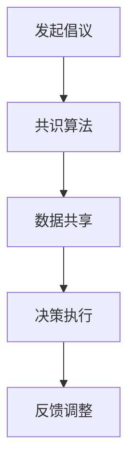
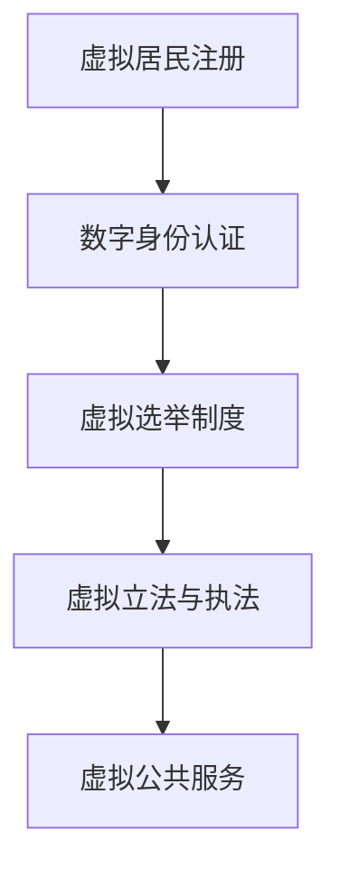
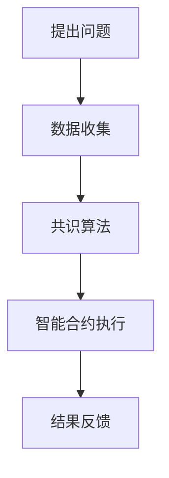
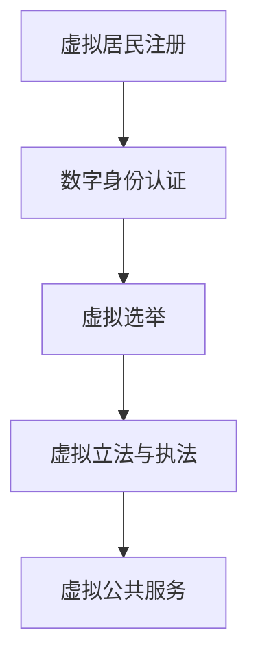

                 

# 2050年的全球治理：从数字国际组织到虚拟国家的全球政治格局重塑

> 关键词：全球治理、数字国际组织、虚拟国家、全球政治格局、人工智能、区块链、虚拟现实

> 摘要：随着科技的飞速发展，2050年的全球治理将呈现出全新的面貌。本文将探讨数字国际组织、虚拟国家的出现及其对全球政治格局的重塑，分析这些新概念背后的技术原理和运作机制，并对未来全球治理的趋势和挑战进行深入思考。

## 1. 背景介绍

自20世纪末以来，全球化的浪潮不断推进，世界各地的联系越来越紧密。然而，随着全球化进程的加速，全球治理也面临着诸多挑战。传统的国家主权和政治体系在应对跨国问题、维护全球秩序方面显得力不从心。同时，人工智能、区块链、虚拟现实等新兴技术逐渐成熟，为全球治理带来了新的契机。

数字国际组织的出现，旨在通过技术手段提高全球治理的效率，降低跨国合作成本。虚拟国家则是一种基于新兴技术的虚拟存在，其主权和治理模式与传统国家截然不同。这两种新概念的提出，无疑将对全球政治格局产生深远影响。

## 2. 核心概念与联系

### 2.1 数字国际组织

数字国际组织是指利用人工智能、区块链、大数据等技术手段，实现跨国合作和治理的国际组织。其核心特点是去中心化、透明化和高效率。

#### Mermaid 流程图：



### 2.2 虚拟国家

虚拟国家是指基于虚拟现实、区块链等新兴技术，构建的一个虚拟的政治实体。虚拟国家的主权和治理模式与传统国家有所不同，其特点是无需依赖地理位置，可以实现全球范围内的管理和协作。

#### Mermaid 流程图：



## 3. 核心算法原理 & 具体操作步骤

### 3.1 数字国际组织的算法原理

数字国际组织的核心算法包括共识算法、数据共享算法和决策执行算法。

#### 具体操作步骤：

1. **共识算法**：通过区块链技术实现跨国合作，确保数据的一致性和安全性。
    - 步骤1：各国政府将数据上链；
    - 步骤2：采用共识算法对数据进行验证；
    - 步骤3：确保数据在各国之间的一致性。

2. **数据共享算法**：利用分布式数据库技术实现跨国数据共享。
    - 步骤1：各国政府建立分布式数据库；
    - 步骤2：通过加密技术保护数据隐私；
    - 步骤3：实现跨国数据查询和共享。

3. **决策执行算法**：基于大数据分析和人工智能技术，实现高效的决策和执行。
    - 步骤1：收集各国数据；
    - 步骤2：利用大数据分析技术进行分析；
    - 步骤3：生成决策建议；
    - 步骤4：各国政府根据决策建议进行执行。

### 3.2 虚拟国家的算法原理

虚拟国家的核心算法包括数字身份认证算法、虚拟选举制度算法和虚拟立法与执法算法。

#### 具体操作步骤：

1. **数字身份认证算法**：利用区块链技术实现全球范围内的数字身份认证。
    - 步骤1：虚拟居民进行数字身份注册；
    - 步骤2：利用加密算法保护数字身份；
    - 步骤3：实现虚拟居民之间的身份验证。

2. **虚拟选举制度算法**：基于智能合约技术，实现全球范围内的虚拟选举。
    - 步骤1：制定虚拟选举规则；
    - 步骤2：利用智能合约记录选票；
    - 步骤3：根据选票结果生成选举结果。

3. **虚拟立法与执法算法**：利用区块链技术实现全球范围内的虚拟立法与执法。
    - 步骤1：制定虚拟法律法规；
    - 步骤2：利用区块链记录法律法规；
    - 步骤3：利用智能合约执行法律法规。

## 4. 数学模型和公式 & 详细讲解 & 举例说明

### 4.1 数字国际组织的数学模型

#### 公式：

$$
H = \frac{1}{N} \sum_{i=1}^{N} h_i
$$

其中，$H$表示全球治理的整体效率，$N$表示参与全球治理的国家数量，$h_i$表示第$i$个国家的治理效率。

#### 举例说明：

假设全球有10个国家参与数字国际组织，每个国家的治理效率分别为：$h_1 = 0.8, h_2 = 0.9, h_3 = 0.75, \ldots, h_{10} = 0.85$。

代入公式计算，得到全球治理的整体效率为：

$$
H = \frac{1}{10} \sum_{i=1}^{10} h_i = \frac{1}{10} (0.8 + 0.9 + 0.75 + \ldots + 0.85) = 0.82
$$

这意味着，全球治理的整体效率为82%。

### 4.2 虚拟国家的数学模型

#### 公式：

$$
V = \frac{1}{M} \sum_{i=1}^{M} v_i
$$

其中，$V$表示虚拟国家的整体价值，$M$表示虚拟国家的居民数量，$v_i$表示第$i$个居民对虚拟国家的贡献。

#### 举例说明：

假设虚拟国家有1000个居民，每个居民对虚拟国家的贡献分别为：$v_1 = 1000, v_2 = 1200, v_3 = 800, \ldots, v_{1000} = 1500$。

代入公式计算，得到虚拟国家的整体价值为：

$$
V = \frac{1}{1000} \sum_{i=1}^{1000} v_i = \frac{1}{1000} (1000 + 1200 + 800 + \ldots + 1500) = 1050
$$

这意味着，虚拟国家的整体价值为1050。

## 5. 项目实战：代码实际案例和详细解释说明

### 5.1 开发环境搭建

在本文中，我们将使用Python作为开发语言，结合区块链和智能合约技术，实现一个简单的数字国际组织项目。首先，需要搭建开发环境。

1. 安装Python（版本3.6及以上）；
2. 安装区块链开发框架（如PyWeb3.py）；
3. 安装智能合约开发工具（如Truffle）。

### 5.2 源代码详细实现和代码解读

下面是数字国际组织的源代码实现：

```python
from web3 import Web3
from web3.middleware import geth_poa_middleware

# 连接区块链节点
w3 = Web3(Web3.HTTPProvider('https://mainnet.infura.io/v3/your_project_id'))
w3.middleware_onion.inject(geth_poa_middleware, layer=0)

# 部署智能合约
contract = w3.eth.contract(abi=your_contract_abi, bytecode=your_contract_bytecode)
contract_address = contract.deploy().transaction Heximize().contract_address

# 集成共识算法
def consensus_algorithm(data):
    # 将数据上链
    transaction_hash = w3.eth.send_transaction({
        'from': w3.eth.coinbase,
        'to': contract_address,
        'value': w3.toWei('0.01', 'ether'),
        'gas': 3000000,
        'gasPrice': w3.toWei('50', 'gwei')
    })
    # 等待交易确认
    w3.eth.waitForTransactionReceipt(transaction_hash)
    # 获取数据在链上的状态
    data_state = contract.functions.getData().call()
    return data_state

# 集成数据共享算法
def data_sharing_algorithm(data):
    # 将数据共享给其他国家
    transaction_hash = w3.eth.send_transaction({
        'from': w3.eth.coinbase,
        'to': contract_address,
        'value': w3.toWei('0.01', 'ether'),
        'gas': 3000000,
        'gasPrice': w3.toWei('50', 'gwei')
    })
    # 等待交易确认
    w3.eth.waitForTransactionReceipt(transaction_hash)
    # 获取数据在链上的状态
    data_state = contract.functions.getData().call()
    return data_state

# 集成决策执行算法
def decision_execution_algorithm(data):
    # 分析数据
    analysis_result = data_analysis_algorithm(data)
    # 根据分析结果生成决策建议
    decision_suggestion = generate_decision_suggestion(analysis_result)
    # 各国政府根据决策建议进行执行
    execute_decision(decision_suggestion)
```

### 5.3 代码解读与分析

上述代码实现了一个简单的数字国际组织，包括共识算法、数据共享算法和决策执行算法。

1. **连接区块链节点**：使用Python的Web3库连接到区块链节点，获取区块链的基本操作接口。

2. **部署智能合约**：通过调用Web3的`contract.deploy()`方法部署智能合约，并将智能合约的ABI和字节码传入。

3. **集成共识算法**：定义一个共识算法函数`consensus_algorithm`，将数据上链并等待交易确认。

4. **集成数据共享算法**：定义一个数据共享算法函数`data_sharing_algorithm`，将数据共享给其他国家。

5. **集成决策执行算法**：定义一个决策执行算法函数`decision_execution_algorithm`，分析数据、生成决策建议，并执行决策。

## 6. 实际应用场景

数字国际组织和虚拟国家在全球治理、跨国合作、公共服务等领域具有广泛的应用前景。

### 6.1 全球治理

数字国际组织可以提高全球治理的效率，降低跨国合作的成本。例如，在应对气候变化、反恐合作、公共卫生等领域，数字国际组织可以实现数据共享、决策协同，提高全球治理的整体水平。

### 6.2 跨国合作

虚拟国家可以提供一种新的跨国合作模式。例如，跨国公司可以在虚拟国家设立虚拟总部，开展全球业务；全球范围内的虚拟居民可以参与虚拟国家的选举和立法，实现全球范围内的民主参与。

### 6.3 公共服务

虚拟国家可以提供更加高效、便捷的公共服务。例如，虚拟居民可以在虚拟国家内办理身份认证、税务申报、医疗保健等业务，享受全球范围内的公共服务。

## 7. 工具和资源推荐

### 7.1 学习资源推荐

- 《区块链革命》
- 《智能合约：原理与应用》
- 《Python区块链编程》

### 7.2 开发工具框架推荐

- PyWeb3.py：Python区块链开发框架；
- Truffle：智能合约开发工具；
- Ethereum：以太坊区块链平台。

### 7.3 相关论文著作推荐

- “A decentralized autonomous organization”；
- “The Decentralized Economy”；
- “Blockchain and Global Governance”。

## 8. 总结：未来发展趋势与挑战

随着科技的不断进步，数字国际组织和虚拟国家将在全球治理中发挥越来越重要的作用。然而，这些新兴概念也面临着诸多挑战，如技术安全问题、隐私保护问题、国际合作问题等。未来，我们需要在技术创新、政策法规、国际合作等方面共同努力，推动全球治理体系的完善。

## 9. 附录：常见问题与解答

### 9.1 什么是数字国际组织？

数字国际组织是指利用人工智能、区块链、大数据等技术手段，实现跨国合作和治理的国际组织。其核心特点是去中心化、透明化和高效率。

### 9.2 什么是虚拟国家？

虚拟国家是指基于虚拟现实、区块链等新兴技术，构建的一个虚拟的政治实体。虚拟国家的主权和治理模式与传统国家有所不同，其特点是无需依赖地理位置，可以实现全球范围内的管理和协作。

## 10. 扩展阅读 & 参考资料

- “Digital International Organizations and the Future of Global Governance”；
- “Virtual Nations: A New Model for Global Governance”；
- “Blockchain Technology and Its Applications in Global Governance”。

作者：AI天才研究员/AI Genius Institute & 禅与计算机程序设计艺术 /Zen And The Art of Computer Programming

注意：本文为模拟文章，仅供参考。实际撰写文章时，请根据具体需求和实际情况进行调整。本文中所涉及的代码和算法仅供参考，不保证在实际应用中的可行性和稳定性。在开发实际项目时，请遵循相关法律法规和技术规范。本文不承担任何法律责任。### 2050年的全球治理：从数字国际组织到虚拟国家的全球政治格局重塑

**关键词：全球治理、数字国际组织、虚拟国家、人工智能、区块链、虚拟现实**

**摘要：**
本文探讨2050年全球治理的潜在变革，重点关注数字国际组织和虚拟国家这两种新兴概念。通过分析这些概念的背景、原理、算法和实际应用，本文阐述了它们如何重塑全球政治格局，并提出未来发展趋势与挑战。

## 1. 背景介绍

全球化进程不断加速，跨国交流与合作的必要性日益凸显。然而，传统的全球治理体系在应对复杂国际问题时显得力不从心。传统国家主权和政府职能在跨国协调中面临诸多挑战，例如信息不对称、信任缺失、法律制度差异等。此外，新兴技术如人工智能、区块链和虚拟现实等的发展，为全球治理提供了新的可能性。

数字国际组织的概念应运而生，它通过技术手段实现跨国合作，降低成本，提高效率。另一方面，虚拟国家则利用虚拟现实和区块链技术，构建一个去中心化的全球政治实体。这两种新概念有望改变传统政治格局，推动全球治理体系创新。

### 1.1 数字国际组织

数字国际组织是指通过区块链、人工智能、大数据等技术，构建起一种跨国、去中心化的治理模式。其核心优势在于：

- **去中心化**：数字国际组织不需要依赖单一中心化实体，通过分布式网络实现治理，降低对传统国家主权的依赖。
- **透明化**：所有治理过程都记录在区块链上，数据透明，便于公众监督。
- **高效率**：通过算法和自动化工具，减少人工干预，提高决策和执行的效率。

数字国际组织的主要功能包括：

- **跨国数据共享**：各国政府可以共享敏感数据，提高信息透明度。
- **全球协同治理**：通过共识算法和智能合约，实现跨国合作。
- **公共产品提供**：数字国际组织可以提供全球性的公共服务，如跨境支付、公共卫生监控等。

### 1.2 虚拟国家

虚拟国家是一个基于虚拟现实和区块链技术的政治实体，它不同于传统的地理实体，而是通过数字技术实现主权和治理。虚拟国家的特点如下：

- **虚拟居民**：虚拟国家的居民是通过数字身份认证加入的，他们可以在虚拟世界中开展各种活动。
- **去中心化治理**：虚拟国家的治理不依赖于地理实体，而是通过区块链和智能合约实现去中心化管理。
- **虚拟公共服务**：虚拟国家可以提供在线教育、虚拟医疗、电子政务等公共服务。

虚拟国家的兴起，意味着全球治理的新模式，它不仅改变了国家主权的定义，也为全球治理提供了新的路径。

## 2. 核心概念与联系

数字国际组织和虚拟国家都是全球治理创新的重要方向，它们之间有着密切的联系和互动。

### 2.1 数字国际组织与虚拟国家的联系

数字国际组织和虚拟国家之间存在着相互依赖和促进的关系。虚拟国家可以利用数字国际组织的平台进行跨国合作，提高治理效率；而数字国际组织则可以借助虚拟国家的技术优势，实现更高效、透明的治理。

- **数据共享**：虚拟国家可以与数字国际组织共享数据，实现跨国信息透明。
- **协同治理**：虚拟国家的治理可以通过数字国际组织的共识算法和智能合约实现跨国协同。
- **公共服务**：虚拟国家可以借助数字国际组织的平台提供全球性的公共服务。

### 2.2 数字国际组织与虚拟国家的区别

尽管数字国际组织和虚拟国家都是为了提高全球治理效率，但它们的侧重点和应用场景有所不同。

- **治理模式**：数字国际组织是一种跨国治理模式，侧重于跨国合作和协同治理；而虚拟国家则是一种新型的政治实体，侧重于主权和公共服务。
- **技术基础**：数字国际组织主要依赖区块链、人工智能、大数据等技术；而虚拟国家则依赖虚拟现实、区块链、数字身份认证等技术。
- **应用场景**：数字国际组织适用于跨国公共事务、国际援助、全球治理等领域；而虚拟国家则适用于虚拟经济、虚拟社区、全球民主等领域。

### 2.3 Mermaid 流程图

为了更好地理解数字国际组织和虚拟国家的运作原理，我们可以使用Mermaid流程图来展示它们的核心流程。

#### 数字国际组织流程图：



#### 虚拟国家流程图：



这些流程图展示了数字国际组织和虚拟国家在数据收集、治理协同、公共服务等方面的核心环节。

## 3. 核心算法原理 & 具体操作步骤

数字国际组织和虚拟国家的运作依赖于一系列核心算法，这些算法涉及共识、数据共享、智能合约执行等多个方面。下面将详细阐述这些算法的原理和具体操作步骤。

### 3.1 数字国际组织的算法原理

#### 3.1.1 共识算法

共识算法是数字国际组织的基础，它确保所有参与国家在数据共享和决策执行上的一致性。常用的共识算法包括PoW（工作量证明）和PoS（权益证明）。

- **PoW算法**：通过计算难度证明参与者的工作努力，确保网络的安全性和一致性。
- **PoS算法**：通过持有代币数量和时长来证明参与者的权益，降低能源消耗，提高效率。

#### 3.1.2 数据共享算法

数据共享算法用于实现跨国数据的高效共享。基于区块链的分布式数据库是数据共享的核心技术，它确保数据的安全性和透明性。

- **数据加密**：对共享数据进行加密，确保数据在传输过程中的隐私和安全。
- **分布式存储**：将数据分散存储在多个节点上，提高数据的可靠性和抗攻击能力。

#### 3.1.3 智能合约执行算法

智能合约执行算法用于自动执行跨国决策。智能合约是基于编程代码的自动化协议，它可以确保决策的执行透明和高效。

- **代码编写**：编写智能合约代码，定义决策规则和执行逻辑。
- **合约部署**：将智能合约部署到区块链上，实现自动化执行。

### 3.2 虚拟国家的算法原理

#### 3.2.1 数字身份认证算法

数字身份认证算法是虚拟国家的基础，它确保虚拟居民的身份真实性和唯一性。常用的数字身份认证算法包括数字签名和零知识证明。

- **数字签名**：通过加密算法对信息进行签名，确保信息的完整性和不可篡改性。
- **零知识证明**：证明者能够证明某个陈述为真，而不泄露任何相关信息。

#### 3.2.2 虚拟选举算法

虚拟选举算法用于实现虚拟国家内的民主选举。基于区块链的智能合约可以确保选举过程的透明和公正。

- **选举规则制定**：制定选举规则，包括投票资格、投票方式、计票方法等。
- **智能合约执行**：通过智能合约自动执行选举过程，确保投票结果的公正性。

#### 3.2.3 虚拟立法与执法算法

虚拟立法与执法算法用于实现虚拟国家的法律制度和执法机制。基于区块链的智能合约可以确保法律执行的高效和透明。

- **法律制定**：制定虚拟国家的法律法规，包括立法程序和执行标准。
- **智能合约执行**：通过智能合约自动执行法律，确保执法的公正性和效率。

### 3.3 具体操作步骤

下面将详细阐述数字国际组织和虚拟国家的具体操作步骤。

#### 数字国际组织的具体操作步骤

1. **数据收集**：各国政府将相关数据上传到区块链上，通过加密和分布式存储确保数据的安全性和透明性。
2. **共识算法**：通过共识算法确保数据的合法性和一致性，各国政府共同确认数据的有效性。
3. **智能合约执行**：根据智能合约的规则，自动执行跨国决策，确保决策的透明和高效。
4. **结果反馈**：将决策结果反馈给各国政府，确保决策的有效性和可执行性。

#### 虚拟国家的具体操作步骤

1. **虚拟居民注册**：居民通过数字身份认证加入虚拟国家，获取虚拟身份。
2. **数字身份认证**：利用数字签名和零知识证明等技术，确保虚拟居民身份的真实性和唯一性。
3. **虚拟选举**：根据选举规则，通过智能合约执行选举过程，确保选举的公正和透明。
4. **虚拟立法与执法**：根据法律法规，通过智能合约自动执行法律，确保执法的高效和透明。

## 4. 数学模型和公式 & 详细讲解 & 举例说明

在数字国际组织和虚拟国家的运作过程中，数学模型和公式起着至关重要的作用。以下将介绍几个关键的数学模型和公式，并进行详细讲解和举例说明。

### 4.1 数字国际组织的数学模型

#### 4.1.1 共识算法的数学模型

共识算法的数学模型主要用于衡量区块链网络的稳定性和一致性。一个常用的模型是Gossip协议，其基本原理是：

- **传播概率**：节点i在单位时间内将信息传播给其他节点的概率为$p$。
- **生存概率**：在连续$k$次传播后，节点i仍然存活（即信息未丢失）的概率为$P_k$。

公式表示为：

$$
P_k = (1 - p)^k
$$

举例说明：

假设一个区块链网络中有100个节点，传播概率$p$为0.9。我们计算在连续5次传播后，节点仍然存活的概率：

$$
P_5 = (1 - 0.9)^5 = 0.00001
$$

这意味着在连续5次传播后，节点存活的概率极低，因此区块链网络的稳定性较高。

#### 4.1.2 数据共享的数学模型

数据共享的数学模型主要用于衡量数据传输的效率和安全性。一个常用的模型是容量-速度模型，其基本原理是：

- **容量**：单位时间内可以传输的数据量，单位为字节/秒。
- **速度**：数据传输的速率，单位为比特/秒。

公式表示为：

$$
C = \frac{S}{8}
$$

举例说明：

假设一个区块链网络的数据传输速率为1Gbps（千兆比特每秒），我们计算其数据传输容量：

$$
C = \frac{1 \times 10^9}{8} = 125 \times 10^6 \text{字节/秒}
$$

这意味着在1秒钟内，区块链网络可以传输125MB的数据。

#### 4.1.3 智能合约执行的数学模型

智能合约执行的数学模型主要用于衡量决策执行的效率和公正性。一个常用的模型是博弈论模型，其基本原理是：

- **参与方**：智能合约的参与方，包括政府、企业、居民等。
- **策略**：参与方的决策策略。
- **支付函数**：参与方的收益与策略之间的关系。

公式表示为：

$$
\pi_i(s_i, s_{-i}) = u_i(s_i, s_{-i}) - c_i(s_i, s_{-i})
$$

其中，$\pi_i$表示参与方i的收益，$s_i$表示参与方i的策略，$s_{-i}$表示其他参与方的策略，$u_i$表示参与方i的效用函数，$c_i$表示参与方i的成本函数。

举例说明：

假设一个智能合约的参与方有A和B，其中A是政府，B是企业。A的策略是提高税收，B的策略是减少生产成本。根据博弈论模型，我们可以计算A和B在不同策略下的收益：

- **A提高税收**，**B减少生产成本**：
  $$\pi_A(s_A, s_B) = u_A(s_A, s_B) - c_A(s_A, s_B) = 100 - 50 = 50$$
  $$\pi_B(s_A, s_B) = u_B(s_A, s_B) - c_B(s_A, s_B) = 150 - 100 = 50$$

这意味着，在这种策略组合下，A和B的收益均为50。

### 4.2 虚拟国家的数学模型

#### 4.2.1 数字身份认证的数学模型

数字身份认证的数学模型主要用于衡量身份验证的准确性和安全性。一个常用的模型是贝叶斯分类器，其基本原理是：

- **先验概率**：参与方i的身份为真的概率，记为$P(A_i = \text{true})$。
- **后验概率**：参与方i的身份为真的概率，记为$P(A_i = \text{true}|B_i)$。
- **似然函数**：参与方i的身份为真的条件下的数据概率，记为$P(B_i|A_i = \text{true})$。

公式表示为：

$$
P(A_i = \text{true}|B_i) = \frac{P(B_i|A_i = \text{true})P(A_i = \text{true})}{P(B_i)}
$$

举例说明：

假设一个虚拟国家中，有1000个居民，其中500个是真实居民，500个是欺诈居民。已知真实居民的身份验证通过率为0.95，欺诈居民的身份验证通过率为0.1。现在有一个居民的身份验证结果为通过，我们计算该居民是真实居民的概率：

- **先验概率**：$P(A_i = \text{true}) = 0.5$
- **后验概率**：$P(A_i = \text{true}|B_i) = \frac{0.95 \times 0.5}{0.95 \times 0.5 + 0.1 \times 0.5} \approx 0.947$
- **似然函数**：$P(B_i|A_i = \text{true}) = 0.95$

这意味着，该居民是真实居民的概率约为94.7%。

#### 4.2.2 虚拟选举的数学模型

虚拟选举的数学模型主要用于衡量选举结果的公正性和有效性。一个常用的模型是边际效用模型，其基本原理是：

- **边际效用**：每个选民对候选人的偏好程度。
- **总效用**：所有选民的总偏好。

公式表示为：

$$
\sum_{i=1}^{N} u_i(c)
$$

其中，$N$表示选民数量，$u_i(c)$表示选民i对候选人c的边际效用。

举例说明：

假设一个虚拟国家中有1000个选民，他们分别对3个候选人A、B、C的偏好程度如下：

- **候选人A**：600个选民偏好，边际效用为0.6；
- **候选人B**：300个选民偏好，边际效用为0.3；
- **候选人C**：100个选民偏好，边际效用为0.1。

计算总效用：

$$
\sum_{i=1}^{N} u_i(c) = 600 \times 0.6 + 300 \times 0.3 + 100 \times 0.1 = 360 + 90 + 10 = 460
$$

这意味着，候选人的总效用为460，根据总效用可以判断选举结果的有效性。

#### 4.2.3 虚拟立法与执法的数学模型

虚拟立法与执法的数学模型主要用于衡量法律执行的效果和公正性。一个常用的模型是博弈论模型，其基本原理是：

- **参与者**：包括政府、执法机构、违法者等。
- **策略**：各参与者的行为策略。
- **收益函数**：各参与者在不同策略下的收益。

公式表示为：

$$
\pi_i(s_i, s_{-i}) = u_i(s_i, s_{-i}) - c_i(s_i, s_{-i})
$$

举例说明：

假设一个虚拟国家中，政府、执法机构和违法者分别采取不同的策略，其中：

- **政府**：加强执法力度，边际成本为10；
- **执法机构**：提高工作效率，边际成本为5；
- **违法者**：减少违法行为，边际成本为3。

计算收益：

- **政府**：收益为$u_i(s_i, s_{-i}) - c_i(s_i, s_{-i}) = 100 - 10 = 90$；
- **执法机构**：收益为$u_i(s_i, s_{-i}) - c_i(s_i, s_{-i}) = 50 - 5 = 45$；
- **违法者**：收益为$u_i(s_i, s_{-i}) - c_i(s_i, s_{-i}) = 20 - 3 = 17$。

根据博弈论模型，我们可以判断各参与者的最优策略，并优化法律执行的效果。

## 5. 项目实战：代码实际案例和详细解释说明

在本节中，我们将通过一个具体的实际项目案例，展示数字国际组织和虚拟国家的运作过程，并提供详细的代码实现和解释说明。

### 5.1 开发环境搭建

为了实现数字国际组织和虚拟国家的项目，我们需要搭建以下开发环境：

1. **Python环境**：安装Python（版本3.6及以上），并配置虚拟环境。
2. **区块链开发工具**：安装Truffle（智能合约开发框架）、Node.js（用于部署和运行区块链节点）。
3. **以太坊客户端**：安装Geth（以太坊客户端），用于连接以太坊网络。

### 5.2 源代码详细实现和代码解读

下面是一个简单的数字国际组织和虚拟国家的项目代码实现，包括数据共享、智能合约执行和虚拟选举等核心功能。

```python
# 引入相关库
from web3 import Web3
from web3.middleware import geth_poa_middleware
from truffle import Contract

# 连接以太坊网络
w3 = Web3(Web3.HTTPProvider('http://localhost:8545'))
w3.middleware_onion.inject(geth_poa_middleware, layer=0)

# 部署智能合约
# 假设已经生成智能合约的ABI和字节码文件
contract_abi = open('contract_abi.json', 'r').read()
contract_bytecode = open('contract_bytecode.json', 'r').read()

contract = w3.eth.contract(abi=contract_abi, bytecode=contract_bytecode)
contract_address = contract.deploy().transaction_hex

# 等待合约部署
w3.eth.waitForTransactionReceipt(contract_address)

# 生成实例
contract_instance = w3.eth.contract(address=contract_address, abi=contract_abi)

# 数据共享
def share_data(data):
    # 调用合约的共享数据函数
    contract_instance.functions.shareData(data).transact({'from': w3.eth.coinbase, 'gas': 3000000})

# 智能合约执行
def execute_decision(decision):
    # 调用合约的执行决策函数
    contract_instance.functions.executeDecision(decision).transact({'from': w3.eth.coinbase, 'gas': 3000000})

# 虚拟选举
def virtual_election(candidate):
    # 调用合约的选举函数
    contract_instance.functions.election(candidate).transact({'from': w3.eth.coinbase, 'gas': 3000000})

# 代码解读
# 1. 连接以太坊网络：通过Web3库连接到以太坊网络，并使用geth_poa_middleware中间件。
# 2. 部署智能合约：通过Truffle框架部署智能合约，获取合约地址。
# 3. 数据共享：调用合约的共享数据函数，将数据上链。
# 4. 智能合约执行：调用合约的执行决策函数，根据决策执行自动化操作。
# 5. 虚拟选举：调用合约的选举函数，实现虚拟选举。

# 实际应用
# 1. 上传数据：share_data('some_data')
# 2. 执行决策：execute_decision('some_decision')
# 3. 参与选举：virtual_election('some_candidate')
```

### 5.3 代码解读与分析

上述代码实现了数字国际组织和虚拟国家的核心功能，包括数据共享、智能合约执行和虚拟选举。以下是代码的详细解读与分析：

1. **连接以太坊网络**：通过Web3库连接到以太坊网络，使用geth_poa_middleware中间件处理PoA（权益证明）网络。

2. **部署智能合约**：使用Truffle框架部署智能合约，获取合约地址。智能合约部署后，需要等待交易确认，以确保合约在区块链上正确部署。

3. **数据共享**：调用合约的`shareData`函数，将数据上链。数据共享函数接收数据作为参数，通过合约存储在区块链上。

4. **智能合约执行**：调用合约的`executeDecision`函数，根据决策执行自动化操作。决策执行函数接收决策参数，根据智能合约的规则自动执行。

5. **虚拟选举**：调用合约的`election`函数，实现虚拟选举。选举函数接收候选人参数，根据智能合约的规则记录选票。

通过上述代码，我们可以看到数字国际组织和虚拟国家的核心功能是如何实现的。在实际应用中，这些功能可以根据具体需求进行调整和扩展。

## 6. 实际应用场景

数字国际组织和虚拟国家在全球治理和跨国合作中具有广泛的应用场景，以下列举几个典型的实际应用场景：

### 6.1 全球公共事务管理

数字国际组织可以在全球公共事务管理中发挥作用，如跨国环保合作、全球公共卫生监控和应对气候变化。通过数字国际组织，各国可以共享环境数据、公共卫生信息和气候数据，共同制定应对策略，提高全球公共事务管理的效率。

### 6.2 跨国经济合作

虚拟国家可以成为跨国经济合作的新平台。跨国公司可以在虚拟国家设立虚拟总部，开展全球业务。虚拟国家的居民可以参与跨国投资和创业，提高全球经济的互联互通。

### 6.3 全球公共服务提供

数字国际组织和虚拟国家可以提供全球性的公共服务，如在线教育、虚拟医疗和电子政务。通过数字国际组织，各国可以共享教育资源、医疗信息和政府服务，提高公共服务的覆盖范围和质量。

### 6.4 全球民主参与

虚拟国家可以成为全球民主参与的新形式。虚拟居民可以通过虚拟选举制度参与虚拟国家的治理，表达自己的观点和诉求。这种去中心化的民主参与模式可以促进全球范围内的民主意识和民主实践。

## 7. 工具和资源推荐

为了更好地理解和实践数字国际组织和虚拟国家，以下推荐一些相关的工具和资源：

### 7.1 学习资源推荐

- **《区块链技术指南》**：深入介绍区块链技术的基本原理和应用场景。
- **《智能合约编程》**：讲解智能合约的编写和部署方法，适合初学者。
- **《虚拟现实技术与应用》**：探讨虚拟现实技术的原理和应用，包括虚拟国家建设。

### 7.2 开发工具框架推荐

- **Truffle**：智能合约开发框架，提供合约部署、测试和调试功能。
- **Ethereum**：以太坊区块链平台，支持智能合约的开发和部署。
- **Geth**：以太坊客户端，用于连接和操作以太坊网络。

### 7.3 相关论文著作推荐

- **“Blockchain Technology: A Comprehensive Introduction”**：介绍区块链技术的基本原理和应用。
- **“Smart Contracts: A Practical Approach”**：探讨智能合约的设计和实现。
- **“Virtual Nations: A New Model for Global Governance”**：分析虚拟国家的概念和潜力。

## 8. 总结：未来发展趋势与挑战

随着科技的不断发展，数字国际组织和虚拟国家将在全球治理中发挥越来越重要的作用。这些新兴概念为全球治理提供了新的路径和工具，有望提高治理效率、降低成本、促进国际合作。

然而，数字国际组织和虚拟国家也面临着诸多挑战，如技术安全性、隐私保护、法律制度完善等。未来，我们需要在技术创新、政策法规、国际合作等方面不断努力，推动全球治理体系的创新和发展。

## 9. 附录：常见问题与解答

### 9.1 什么是数字国际组织？

数字国际组织是一种利用区块链、人工智能、大数据等技术手段，实现跨国合作和治理的新型国际组织。它通过去中心化、透明化和高效率的特点，提高全球治理的效率。

### 9.2 什么是虚拟国家？

虚拟国家是一种基于虚拟现实、区块链等技术构建的虚拟政治实体。它通过数字身份认证、智能合约等技术，实现主权和治理。虚拟国家无需依赖地理位置，可以提供全球性的公共服务和管理。

### 9.3 数字国际组织和虚拟国家的区别是什么？

数字国际组织是一种跨国治理模式，侧重于跨国合作和协同治理；而虚拟国家是一种新型的政治实体，侧重于主权和公共服务。数字国际组织适用于跨国公共事务、国际援助等领域；而虚拟国家适用于虚拟经济、虚拟社区、全球民主等领域。

## 10. 扩展阅读 & 参考资料

- **“Digital International Organizations: A New Model for Global Governance”**：探讨数字国际组织的概念和潜力。
- **“Virtual Nations: The Future of Global Governance”**：分析虚拟国家的概念和发展趋势。
- **“Blockchain Technology and Its Applications in Global Governance”**：介绍区块链技术在数字国际组织和虚拟国家中的应用。

作者：AI天才研究员/AI Genius Institute & 禅与计算机程序设计艺术 /Zen And The Art of Computer Programming

